# 第一篇 序幕：星星和原子

## 第 1 章 科学的方法：经验和理性

> 我相信绝对必然、绝对准确和终极真理这些想法都是空想虚构，任何一个科学领域内都不应采纳。……在我看来这种对思想的松绑是现代科学给予我们的最大幸事。这是因为相信独一无二的真理，相信自己是其拥有者，这些都是这个世界的万恶之源。
> ——玻恩（Max Born），物理学家

### 1.1 星星星的微尘：邀请你访问科学

我们来自星星。的确，我们是由原子构成的，而这些原子由远古的星球产生，并通过星球爆炸进入空间。这一事实只是联系我们同宇宙其他部分的大网中的一缕。科学——观察和了解自然界，是通向理清这张网的一条途径。

从地球上生命的漫长历史，可以看到大自然的不断增长的意识。有充分理由相信，我们的行星形成于大约 50 亿年前，最早的简单生物出现于近 40 亿年前（见第 15 章）。从那时起，有机体就一直进行着生物进化，与环境相互作用的方式日益复杂。从人类的视角来看（阿米巴变形虫看待事物的方式可能有所不同），人类是意识越来越进化的生物有机体序列中最新的一员。

我们甚至可以说，生物进化使宇宙变得更加意识到自身。教育与科学可以看成是这一过程的延伸。而你，随着对宇宙了解的加深，就是这个意识不断扩大的过程的一部分。

爱因斯坦在谈到这个不断扩大的意识圈时，这样写道：
“人是这个我们叫做‘宇宙’的整体的一部分，在时间和空间上都是有限的一部分。他体验自身，感受自己的思想和感觉，似乎这些与其他部分是隔开的——这是他意识中的一种错觉。这种错觉是一种对我们的囚禁，把我们局限在个人欲望和对最亲密的几个人的感情之中。我们的任务应该是摆脱这种囚禁，扩展同情的范围，去包容一切生物和美好的大自然。没有人能完全达到这一点，但为此而努力本身就是解放运动的一部分，也是内心平静的基础。”

我希望《物理学的概念和文化素养》会帮助你发现你与宇宙之间的诸多链接。在写本书时，我始终如一的取舍标准是：“这些材料是否真的是这样的读者想要知道的，这些读者既要充分参与我们的以科学为基础的文化，但是在这个其职业生涯中又不一定用到科学？”我试着使用有文化的非科技专业人士能懂的语言，没有不必要的术语和不必要的数学，尤其是复杂的数学。然而，书中广泛地应用了数字、比例关系、图表以及数值估计，这是因为数量概念在当今的交流沟通中是必不可少的。有文化的人当然应该能够看懂数字。

> 教育的实质就是克服狭隘性，也就是开阔人的眼界。你们一定要扩展见识，超越个人狭窄眼界的限制。
> ——W. Manger，地质学家，阿肯色大学

我们已经讨论了学习科学的一个理由：不断增长的意识或知识。另一个理由是发展适应科学时代的社会价值观。花点时间列出对一个国家或世界重要的 12 个问题，典型的问题清单可能包括人口增长、贫困、犯罪、物种灭绝、文盲、全球变暖、城市衰退、毒品、战争、空气污染、艾滋病以及饥荒。这些问题的每一个都含有科学成分。现在试着列出解决这些问题的办法。一张典型的清单可能包括生育控制、经济增长、教育、可持续耕作、民主、国际法、环境保护、疾病控制、更好的政府、合理使用能量、人们之间更多的理解以及关心环境等。所有这些解决办法也都含有科学成分。

我们这个时代的问题及其解决办法与科学和技术①是不可分的。这就是我们把当代称为科技时代的原因。为了解决这些问题，世界需要你的帮助。我们不敢把这些至关重要的问题完全交给专家或政府。

在于人类第一次月球探险的书《月球上的火》中，小说家和记者梅勒（Norman Mailer）悲观地写道：
“20 世纪将带来前所未有的死亡、毁灭和污染。更糟的是，处在这个世纪中的人们还想把他们的生活观念带到其他的星球上去……这是一个追求技术合理性的世纪，同时又是一个如此没有理性的世纪，以致在每个头脑中展现了全球毁灭的真实可能性……因此，这个世纪受到无与伦比的力量推动，朝着它不能理解的方向发展。它强烈追求的是加速……而原则性的方向却不知道。”

如果我们解决当今的问题，我们必须找到这个科学时代的原则性方向。

随着你开灯、开电视机、发动汽车或打开计算机，你每天都在使用科学的力量。这些装置对世界有巨大的影响；既有好影响（阅读时的照明），也有坏影响（来自发电厂的污染）。科学时代在传统道义上的两难问题是了解与负责任地处理这些强有力的技术的两难处境。

> 对于任何人，不关心科学就是睁着眼走入奴役。
> ——J. Bronowski，科学家和哲学家

> 科学活动是当代世界的主要特征之一，或许它比任何其他特征更能把我们的时代与先前的世纪区分开来。
> ——《为全体美国人的科学》，美国科学促进协会报告

> 我对用“上帝”这个词感到犹豫，但是通过对宇宙的研究我得到了这样一个结论，即宇宙的行为带有一定的目的性。宇宙已经把自己按照这样一种方式组织起来，以致有了自我意识。作为有意识的生物，人类是这个目的一部分。
> ——戴维斯，物理学家

① 技术是运用科学以达到有益于人类的目标。本书经常用科学这一个词统称科学和技术。

这种两难处境象征性地出现在 19 世纪玛丽·雪莱**的小说《弗兰肯斯坦》中。享受技术的威力却不承担明智地使用技术的责任，将会招来灭亡、荒芜与污染——这就是怪物对其创造者的报复。

我们将集中讨论叫做物理学的那门科学，以及它与人类生活方方面面的联系。你曾听过许许多多重要的学科：生物学、地质学、化学、天文学、物理学，等等。当人们问我“什么是物理学”时，我喜欢拿起一件东西，然后放手让它下落。大多数东西当你放手时都会落下。石头也罢，青蛙也罢，卷心菜也罢，一个王棋棋子也罢，它们都会落下。②物理学就是对像下落这类普遍存在的现象的研究。地质学家研究岩石和地球的结构，生物学家研究青蛙和其他生物，而物理学家则研究岩石、青蛙及一切其他东西都遵循的普遍原则。

科学是如何运作的呢？这是我们要回答的至关重要的问题，如果我们了解和适应我们的科学时代，就得回答这个问题。在本章后面各节，我们用天文学的早期历史这个重要的案例研究来回答这个问题。我们从第 1.2 节讲述关于夜空的常识性结论开始。随后三节介绍关于天空的组织方式的三个理论：古代的地心说、哥白尼的日心学说和开普勒的太阳为椭圆轨道焦点的学说。第 1.6 节讨论这段历史关于科学教给了我们一些什么东西。第 1.7 节看看所有这些的文化内涵。

> 世界面临的每一个危险都能追究到科学。拯救世界的每一种手段都将来自科学。
> ——阿西莫夫，科学家和作家

> 我们需要看问题既直截了当又深刻的人。这种人是专家。但是我们也需要周边视觉，而专家一般不太善于提供这种周边视觉。
> ——托夫勒，作家和未来学家

** 英国女作家，著名诗人雪莱的夫人。所著《弗兰肯斯坦》是世界上第一部科幻小说，描写一个专攻秘术的瑞士学者弗兰肯斯坦用各种肢体凑在一起造出一个怪物，最终被他造的这个怪物杀死。——译者注
② 对，几乎所有的东西都会落下。不过也有例外，如氦气球。
③ 除了这一主题外，还有另外三个主题贯穿全书，它们是：后牛顿物理学的意义、物理学的社会影响和能量。

### 1.2 观察夜空

置身于树木之间，难以看到一片森林。同样的道理，由于我们的文化是如此之深地沉浸在科学和技术之中，也就难以对科学和技术得到一个正确的看法。本书最重要的主题是研究科学自身的本性。③科学怎样运作？它的价值是什么？其结论的有效性如何？我们将看到，科学并不只是一堆知识，而更是一条途径，一种学习方法。

“科学方法”，或科学认知过程（我们将这样称呼它），常常被描述为科学家有时从事的几种活动：观察、假设、试验，等等。但是这种烹调书式的规定并未抓住在实际生活中科学如何运作这个问题。事实上，每当你用自己的经验探究一个问题时，你就用到了这个科学认知过程的方方面面。简单地说，科学就是细心应用经验（常常叫做观察和实验）和理性（常常叫做假说、理论、原理和科学定律）来回答问题。为了了解科学如何在实际生活中运作，我们来研究一个历史事例：天文学的早期历史。天文学是研究星星和其他天体的科学，通常与物理学有密切的联系。

> 啊！耐心的星星，教给我你们的心境，
> 你们每晚都攀上这古老的天空，
> 不留空白，不留阴影，不留伤痕，毫无倦容。
> 也没有年龄的踪迹和对死亡的惊恐。
> ——爱默生，诗人

星空似乎是比我们日常生活的世界更完美的地方。生活充满了喧嚣，而星星是那样宁静；生命如此短暂，而星星则是永恒的。古代祭司关注星星就不足为奇了。这里有超越时间的知识。于是至少从有历史记录以来，我们就注视着天空，以得知耕种与收割的时令、战争与和平的征兆、寻求生命的意义和窥视我们的神祇（图 1.1）。虽然相信星星的位置对人间事务有重大影响的占星术成为要破除的迷信已有两个世纪，但今天人们对星星的迷恋比以往任何时候更甚（图 1.2）。

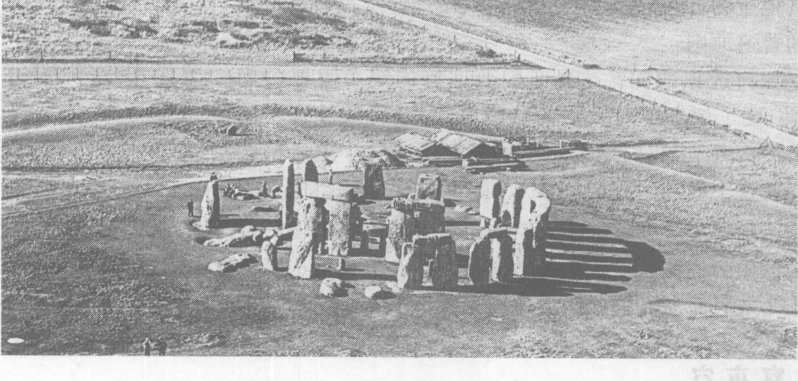

*图 1.1 已有 4000 年历史的英格兰史前巨石阵遗迹，它是我们对星星进行崇拜的证据。人们把这些巨石从 300 多千米之外拖来，建成这座纪念碑。这些巨石是一个更大建筑的遗迹，这个建筑是用于宗教活动和预言天文事件的，特别是二至点（白昼最长和最短）和二分点（昼夜等长）。巨石阵或许也用来预言月食，对于还没有使用文字的人们来说，这是令人惊叹的业绩。月食按一个不规则的、表面上是随机的序列发生，这个表观随机的序列要经过一个 56 年的周期才重复发生。觉察到这个重复序列的存在需要投入巨大的精力进行细致的观察。*

在这个高技术时代，我们有时看不到星星。在某个晴朗的夜晚，远离城市的灯光，花一两个小时跟踪穿越天空的星星。找到月亮、北斗七星、北极星、东方地平线上的任何一组星和西方地平线上的一组星（图 1.3）。在 1 小时或更长的时间内，每 15 分钟观察一次这些星。会发生什么情况？你将看到月亮和星星向西运动，星星在东方升起，在西方落下，不同的星星彼此相对位置不变，成群地运动穿越天空，北极星固定不动，北极星附近的星星环绕北极星做圆周运动（图 1.4）。

有几颗小而异常明亮的星星样的天体，它们与别的星星的运动步调不一致。在观察一星期或更长时间之后，可以发现，它们相对于其他星星（恒星）缓慢地改变位置。这些天体叫做**行星**（希腊文中的意思是漫游者）。不用望远镜就可以看到五颗行星。月亮和太阳也不属于恒星的步调运动。

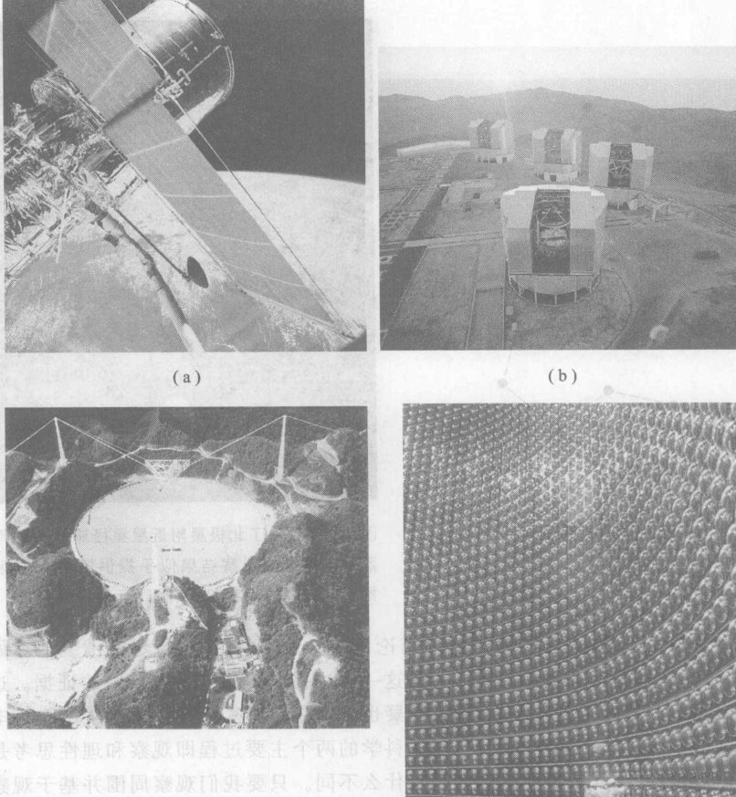

*图 1.2 我们对星星的迷恋比以往更甚。 (a) 1990 年发射到太空的哈勃望远镜，它的一些令人惊奇的照片见图 1.24 和图 5.10。(b) 欧洲南方天文台建在智利的名为“甚大望远镜”的由四个望远镜组成的阵列。每个望远镜都有一个直径 8 米的近理想的反射镜。这些望远镜由“光管”连接，使它们对单一物体所成的四个不同的像得以配合，利用波的干涉效应（见第 8 章）极大地改善像的分辨率。这个阵列于 1998 年投入使用。(c) 许多望远镜接收来自空间的非光学信号。这台大型射电望远镜设在波多黎各的阿雷西博，它接收随地球自转而经过天顶的物体发射的无线电信号。(d) 装满水的超级神冈地下中子探测器，或中微子望远镜。数以千计的光电倍增管布置在这个纯净水的水槽内壁上，用以记录来自太阳或遥远的爆炸的恒星的中微子与水中的原子相互作用时发出的光。中微子是亚原子粒子，它们以接近光速的速度穿过空间和几乎不受限制地穿过像地球这样的物体。中微子能从任意方向包括从顶部、底部（穿过整个地球后）和侧面进入探测器并被记录下来。*

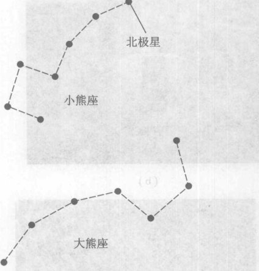

*图 1.3 在夜空中寻找这两个星座（大熊座和小熊座）和北极星。*

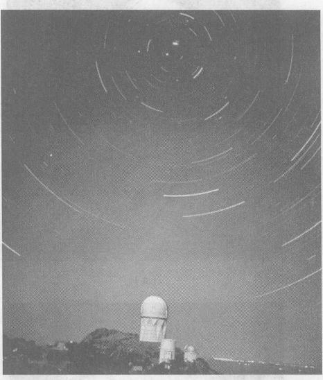

*图 1.4 显示了北极星附近星星路径的长时间曝光照片。这样的观察结果似乎提供了令人信服的证据，证明星星环绕地球做圆周运动。*

通过这些观察，大多数人会得到这样的结论：恒星、太阳、月亮和行星都围绕地球做圆周运动，它们的转轴固定地指向北极星。图 1.4 为这一看法提供了相当令人信服的证据。这是许多世纪之前绝大多数观察者得到的结论，而且无疑也是现在的观察者将要得出的结论，除非他们在学校学到不同的东西。这些观察与结论，对于科学的两个主要过程即**观察**和**理性思考**是有代表性的。其实，科学与人类大量的其他活动没有什么不同。只要我们观察周围并基于观察到的东西发展出一些想法，我们就在像科学家那样行动。

### 1.3 古希腊理论：地心宇宙

至少早在公元前 3000 年，人们就已经认识到，恒星、太阳、月亮与当时已知的五颗行星的运动方式是不同的。约在公元前 500 年，一些希腊人开始寻求对这些运动的新的认识。他们想要超越观察事实，掌握这个系统是如何运转的。

图 1.5 表示早期希腊人的宇宙结构概念。这个图表明，天体是围绕不动的地球旋转的，这与前面描述的观察结果一致。因为所有的恒星相互是步调一致的，希腊人设想它们都嵌在一个透明的（看不见的）球壳的内表面上，球壳的中心在地球中心，球壳带着恒星每天绕地球转一圈。希腊人想象另外七个天体（太阳、月亮和五个看得见的行星）中的每一个都附在一个以地球为中心的透明球壳上，每个天体有一个球壳。这七个球壳中的每一个都以不变的或者说均匀的速率绕地球旋转，大致每天一圈。这些球壳以略微不同的速率绕着通过地球中心的同一轴线旋转。

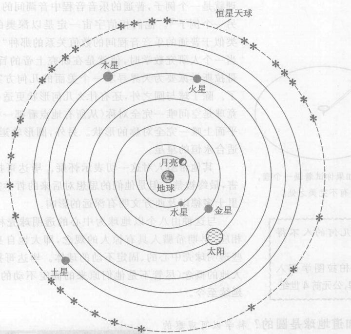

*图 1.5 古希腊人关于宇宙格局的最早观念（公元前 500 年左右）。*

以毕达哥拉斯为首的一个哲学-数学-宗教集团发展了这个**毕达哥拉斯宇宙理论**。毕达哥拉斯学派创立了一种秘密的狂热崇拜，热烈相信抽象概念的重要性。在某种意义上，概念是永恒的。例如，一张真实的桌子最终会腐朽化成灰尘，而“桌子”的概念则似乎是永恒的。毕达哥拉斯相信，最完美的概念是数学概念，因为它们能够表达得如此精确而又抽象。桌子的概念相当不精确，一块平的岩石可以看成一张桌子，也可以只是一块岩石。但是数学概念，比如一条直线、一个圆或数字 5，都是精确的和纯粹的。例如，一个圆是平面上与某一固定点距离相同的一切点的总体。

> 万物皆数。
> ——毕达哥拉斯，公元前 6 世纪

> 数是形式和思想的尺子，数是上帝和魔鬼的事业。
> ——毕达哥拉斯

> **概念检查 1** 为了检查你对上述的圆的定义的理解，试回答下面这个选择题：定义中提到的“固定点”和“距离”分别是指 (a) 圆心和直径；(b) 轴和半径；(c) 正弦和余弦；(d) 圆心和半径；(e) 圆心和弦。（这种以选择题形式出现的概念检查题在全书出现，它们有一个或多于一个正确答案。遇到它们时先试着回答，先不要看每章末尾的答案。为了增长见识，错误答案中包括了学生常犯的典型错误概念。）

虽然这个圆的定义是精确的，但如果按照定义画一个圆，总会发现有不完美之处（图 1.6）。的确，毕达哥拉斯学派相信，正是圆的概念而不是它的任何具体表象，才是纯粹的和永恒的。这种数学神秘主义者发现了如何用数学概念描述自然界的许多特征。著名的毕达哥拉斯定理就是一个例子，普通的乐音音程中音调间的简单数字关系是另一个例子④。他们相信宇宙一定是以深奥的数学原理或者类似于是普通的乐音音程间的数值关系的那种“和谐”为基础的，当一个人研究数学时，他就是在研究上帝的旨意。于是，毕达哥拉斯学派要求为天界寻求一个美丽的几何方案就不令人惊奇了。除了球与圆之外，还有什么几何形状更适合于星星呢？毕竟球是空间唯一完全对称（从所有地点看都一样）的形状，圆是平面上唯一完全对称的形状。另外，圆形轨道无始无终，也是最适合永恒的星星。

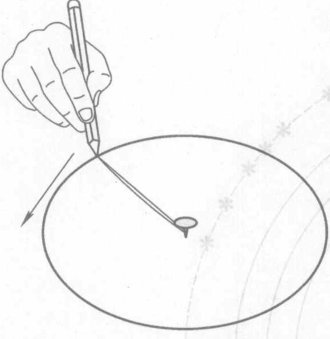

*图 1.6 如果你试着画一个圆，总会有不完美之处。*

> 不懂几何的人不得入内。
> ——柏拉图学园入口处的铭牌，公元前 4 世纪

其他希腊人对这一切表示怀疑。毕达哥拉斯学派受到迫害，最终被杀。但是他们的思想对后来的哲学家如柏拉图和亚里士多德以及西方文明有深远的影响。

与这种由八个以地球为中心的透明球壳构成的宇宙图像相应，早期希腊人具有惊人的观念，即大地自身是一个位于这些透明球壳中心的、固定不动的球体。毕达哥拉斯学派的球状大地的概念（尽管不是他们原来的固定不动的地球概念）一直延续至今。

**我们怎么知道地球是圆的？** 科学以可观察的事实为依据。因此，科学家永远抱怀疑的态度，总是在问“我们怎么知道？”我们将经常提出这个问题。

我们怎么知道大地是球状而不是平的呢？今天的证据相当直接（图 1.7），但是古希腊人有什么证据呢？花一分钟思索一下这个问题。

（思考一分钟）

比毕达哥拉斯晚两个世纪的希腊哲学家亚里士多德强调证据的重要性。他提供了许多很好的根据观察得到的理由，证明大地是球状的而不是平的。第一个理由是，船出海时渐渐地没入地平线（图 1.8）。第二个理由是，希腊旅行者报告，在北方，中午时刻的太阳在天空中的位置较低。第三个理由是，在月食时观察到的地球投到月亮上的影子，正好符合地球与月亮两者都是球。（念第 1 题概念检查的常犯错误答案，见页脚。）

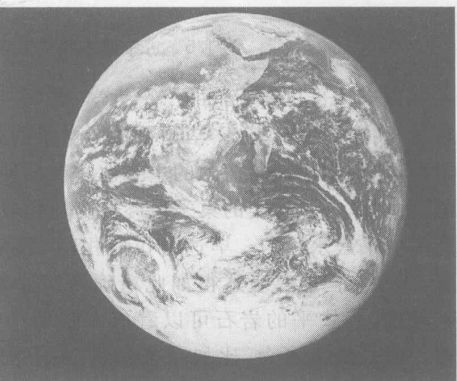

*图 1.7 1972 年 12 月 7 日“阿波罗 17”离开地球轨道飞向月球之际拍摄的全球照片，照片上显示的是非洲和沙特阿拉伯。这样的照片表明地球是一个在太空中自由运动的球体，它们带来的文化影响可能是空间计划最最重要的好处之一。*

④ 毕达哥拉斯定理是：在任何一个含 $90^\circ$ 角的直角三角形中，以三角形的三边为底画三个正方形，则两个小正方形的面积之和等于大正方形的面积。作为乐音音调之间关系的一个例子，你可拨一下弦产生一个乐音，然后取弦长的一半再拨一次，得到的两个音调正好差八度。其他简单的弦长比值，如 $3:2$ 或 $4:3$，将产生别的谐音音程。

但是有一个问题。由于球壳匀速转动，透明球壳理论预言每个行星绕着地球匀速运动。然而细心的观察表明，它们并非如此。相反，从地球上看去，它们的速度在变化。图 1.9 画出单个行星如火星的这种效应。该图是相对于背景恒星来画的，因此它不表示火星和恒星每天的转动。相对于恒星，火星一般由西向东以变化的速率运动。有时火星甚至改变方向，相对于恒星由东向西运动，这种现象叫做**逆行**。

*图 1.8 大地表面是球面的证据。当一只船出海时，岸上的观察者看到它一点一点没入地平线。*

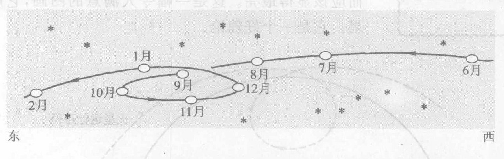

*图 1.9 一个行星（如火星）相对于背景恒星的运动。火星相对于恒星通常由西向东运动。在这张具体图例中，火星在 7 月至 8 月间运动得比 6 月至 7 月间慢，并且越来越慢，在 10 月份停下来，然后在 10 月至 12 月期间逆向运行，12 月到 2 月期间又恢复正常的方向。*

希腊哲学家柏拉图确信天界运动背后存在一个精致的数学实在。他要求他的学生们找到一个能与毕达哥拉斯理论类似但更复杂得多的理论，每个行星有多个透明球壳。

希腊思想家阿利斯塔克曾提出，是太阳而不是地球静止在宇宙中心，地球和五个行星绕太阳做圆周运动，并且地球还绕自己的轴自转。这是一个根本不同的想法，很少有天文学家认真考虑它，因为从以下几个理由来看，这个理论似乎是荒谬的：地球一点也不像天上的东西，因此地球怎么会是像天上的行星一样的一颗行星呢？相信地球运动似乎是荒谬的。它太大了！什么巨大力量能够推动它保持它运动呢？如果它真的运动，那么像鸟和云这些不附着在地面上的物体似乎应当落在后面。如果地球绕自身的轴旋转，那么物体就应该被抛出去，就像一块石头被旋转的投石器猛甩出去一样。这些情况从来没有观察到过，基于这些理由，希腊人否定了阿利斯塔克理论。大约过了 2000 年，日心理论才再次得到考虑。

然而另一个问题又出现了。希腊人注意到，行星在逆行期间比其他时间显得更亮，仿佛它在这段时期更靠近地球。然而，柏拉图理论中每个行星都在一个以地球为中心的球面上，这意味着每个行星到地球的距离是固定的。

> 我们为自己定下了下述任务，即证明五大行星、太阳和月亮的全部表观不规则性都可以用匀速圆周运动表示出来，因为只有这种运动才与它们的神圣本性相称……我们可以认为，完成这个任务是以哲学为基础的数学科学的终极目的。
> ——托勒密

为了解释行星亮度的变化，希腊人又做了颇为不同的尝试。行星不再在一个球壳上运动，每个行星现在沿有着一个小圆之圆环绕地球运动。如图 1.10 所示，一个行星如火星，沿着一个圆周匀速运动，这个圆的中心又沿着另一个以地球为中心的圆周运动。靠外的小圆叫做行星的“本轮”，而靠里的以地球为中心的大圆叫做行星的“均轮”。本轮的中心沿着均轮匀速运动，因此火星同时参与两种圆周运动。这就为每个行星产生出一套**套圈**的轨道（图 1.10）。这个理论与观察结果一致，预言了一段短暂的逆行（在套圈的内侧），并且行星在逆行期间离地球最近，因而应该显得最亮。这是一幅令人满意的图画，它解释了观察结果。它是一个好理论。

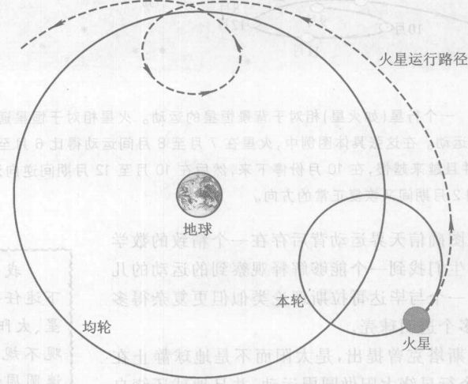

*图 1.10 根据本轮理论得到的火星环绕地球的轨道*

图 1.11 表示作了极大简化后的这一理论。这个理论在公元 100 年前后由最伟大的古代天文学家托勒密（图 1.12）做了改进和总结。为了与已知的观察结果一致，托勒密引入两个新概念：中心的移动或“偏心率”和“偏心等距点”，从偏心等距点看，运动是匀速的⑤。这些概念的细节在这里并不重要。为了与观察结果相符，每个行星需要大量本轮——80 个以上。13 世纪的西班牙国王阿方索十世曾评论说：“如果全能的主在着手创造万物之前先和我商量，我当提供更简单的方案”。

我们怎么知道行星的位置？托勒密对天界的测量大量（数值）测量结果检验了这个精巧的理论。当时尚未发明望远镜，测量装置是带刻度的长瞄准杆以测量行星的角度位置。瞄准装置精确到 $0.2^\circ$ 以内（记住：整个圆周有 $360^\circ$）。在这样的精度范围内，托勒密理论与恒星、太阳、月亮和五个已知行星的所有观察结果相符。它在做一些修正的情况下存在了 15 个世纪，为航海家、天文学家和像占星家这样的神秘主义者所采用。

不赖。

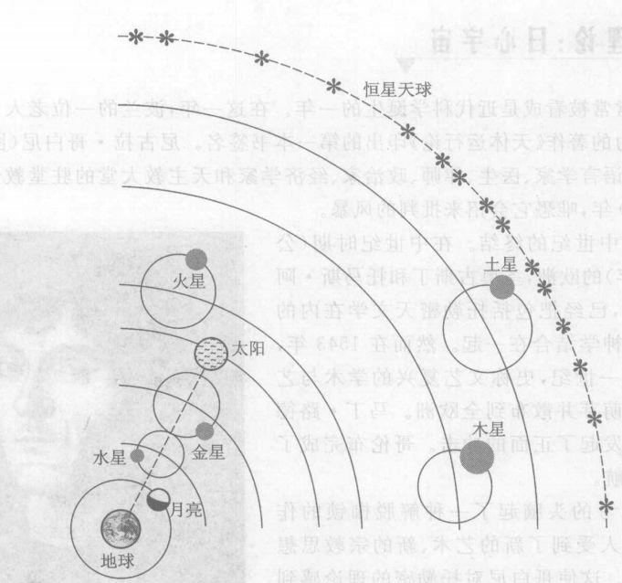

*图 1.11 关于宇宙格局的托勒密地心本轮理论（大约公元 100 年）。根据这个理论，五个看得见的行星在本轮上绕地球运动。最里面的两个行星水星和金星的本轮中心在地日连线上。*

> **概念检查 2** 古希腊人相信星星和行星是自己发光的。他们是否相信能用肉眼看到的每个天体都是这样？(a) 是；(b) 否。

> **概念检查 3** 金星常常作为晨星（在旭日附近最近还看得见的星）或昏星出现。托勒密对这一观察结果的解释是：(a) 金星环绕太阳的轨道靠近日太；(b) 金星的本轮中心位于地球和太阳的连线上；(c) 金星和水星绕太阳运行，而其他行星绕地球运行；(d) 金星为太阳壮观的外表所吸引。（提示：参见图 1.11）

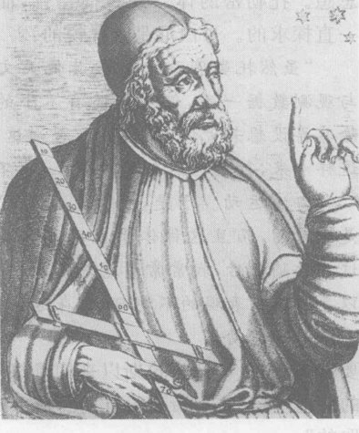

*图 1.12 古代天文学家托勒密，公元 85—165 年，他用本轮和许多别的理论工具完善了宇宙格局的地心理论。*

⑤ 这两个概念都不是托勒密的首创，但是是他第一个把它们一起纳入一个一贯的、定量正确的理论。

### 1.4 哥白尼理论：日心宇宙

公元 1543 年常常被看成是近代科学诞生的一年。在这一年，波兰的一位老人，在他临终的床上，为他毕生致力的著作《天体运行论》印出的第一本书签名。尼古拉·哥白尼（图 1.13）这位天文学家、数学家、语言学家、医生、律师、政治家、经济学家和天主教大堂的驻堂教士，一直把这本书的手稿搞了 30 年，唯恐它会招来批判的风暴。

这本书预示了中世纪的终结。在中世纪时期（公元 500 年至 1500 年）的欧洲，圣奥古斯丁和托马斯·阿奎那这样的哲学家，已经把包括托勒密天文学在内的希腊思想与基督教神学结合在一起。然而在 1543 年，时代在变化。在前一世纪，史称文艺复兴的学术与艺术繁荣已在意大利萌芽并散布到全欧洲。马丁·路德向天主教会的权威发起了正面的冲击。哥白尼完成了他那值得纪念的远航。

这股潮流对思考的头脑起了一种解脱枷锁的作用。哥白尼和其他人受到了新的艺术、新的宗教思想和新的探险的激励。这使哥白尼对托勒密的理论感到不舒服。这并非说哥白尼是一个革命者。正相反，哥白尼反对托勒密理论，是由于托勒密采用了许多本轮、偏心点与偏心等距点，远远偏离了毕达哥拉斯的思想。托勒密的体系缺少简洁性，而这正是科学在一直探求的。哥白尼是这样说的：
“虽然托勒密和其他大多数天文学家的行星理论与观测数据一致，但看来还有不小的困难。这是因为除非再设想若干偏向等距点，否则这些理论就不合适；这样看来，行星既不在其均轮上，也不绕着其本轮的中心做匀速运动。于是，没有充分的理由认为这种体系是绝对的，而且这体系也不那么尽如人意。意识到这些缺陷之后，我常常考虑能否更合理地安排那些圆，以导出各种表现的不均匀性，在这种安排中，按照绝对运动的法则的要求，万物都围绕其固有的中心匀速运动。”

要看到，与毕达哥拉斯以来的思想家一样，哥白尼相信自然的天然形式既是圆周运动又是均匀的。他坚信“在上帝以最佳的方式进行创造的设想中，设想（非圆周运动）这样的东西是不取的”。

作为文艺复兴时期的人物，哥白尼有更广阔的视角。就像文艺复兴时期艺术家的眼光超出了基督教艺术、哥伦布的眼光超出了欧洲一样，哥白尼的眼光超出了地球自身，把它想象成空间的一个物体，一个他相信与其他天体相似的物体。在哥白尼及之后的科学家看来，宇宙以地球为中心的古代观念显得那么狭隘和闭塞。

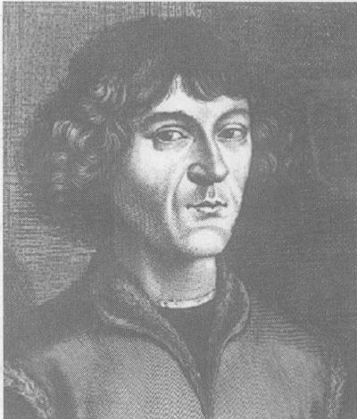

*图 1.13 波兰天文学家哥白尼，1473—1543。他发现托勒密体系“既没有充分理由认为是绝对的，也不是尽如人意的”，便提出了一个较为简单的理论。哥白尼理论把太阳放在宇宙中心，地球环绕它运行。这种认为地球是在运动而且是一个与其他行星没什么不同的行星的古怪想法，遇到了很大的阻力，因为它与地球在万物的中心静止不动的直觉观念相抵触，也因为它与占统治地位的哲学相冲突。*

于是，哥白尼提出了一个比以前更广泛的问题：对于恒星、太阳、月亮、五个观察到的行星和地球的运动，能够符合对天界已知的测量结果的最优美的几何方案是什么？因为着眼点的变化，哥白尼不久就发现了“一个更合理的圆的安排”。在这个理论中，可见的行星和地球环绕太阳做匀速圆周运动，只有月亮环绕地球运行。图 1.14 表示哥白尼理论。哥白尼通过让地球由西向东自转，而不是让星星的球壳由东向西旋转，得出了恒星、太阳、月亮和行星每天由东向西的运动。

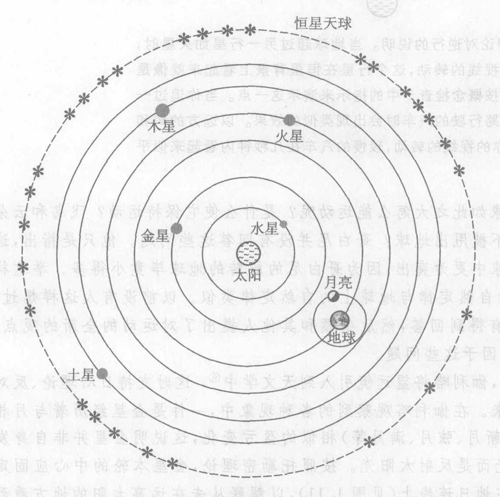

*图 1.14 哥白尼关于宇宙格局的日心理论，于公元 1543 年提出。此图已经经过简化，所有行星都在本轮上运动，这与托勒密理论相似。不过这里的本轮要少得多，而且哥白尼不用偏心等距点。*

**我们怎么知道地球和别的行星绕太阳公转？** 哥白尼时代仍然没有望远镜，靠瞄准星星的装置采集数据。依靠为各个行星轨道选用适当的半径、旋转速率和偏心点，哥白尼得到了与观测数据在定量上的一致。他的理论解释了许多现象，如逆行（见图 1.15 和概念检查 5）。但是正如哥白尼承认的那样，托勒密的理论也“与观测数据相符”。两个理论都与观测数据一致。

新理论面对一些很有力的反对理由，这些反对理由与早先阿利斯塔克理论面对的相似。地球如此之大怎么能运动呢？是什么使它保持运动？飞鸟和云朵为什么不落在后面？为什么物体不被甩出地球？哥白尼并没有回答这些问题。他只是指出，这些问题在托勒密的巨大的旋转天球中更为突出，因为哥白尼的旋转的地球毕竟小得多。举这样的论据，哥白尼是假定星服从的自然定律与地球上的自然定律类似。以前没有人这样想过。这些问题在一个多世纪里一直没有得到回答。然后牛顿和其他人提出了对运动的全新的观点。实际上，牛顿物理学的产生部分起因于这些问题。

> 太阳在宇宙正中坐在其宝座上。在这壮丽的神殿里，有谁能将这个发光体放在另一个更好的位置上以让它同时普照全宇宙？……我们在这个安排中找到了这个世界美妙的和谐，以及运动与轨道大小之间不变的和谐关系，要不然这是找不到的。
> ——哥白尼

> 这个人无论是是在地球上，还是在太阳上或其他星球上，在他看来，他所处的位置似乎总是不可动的中心，而所有其他的东方都在运动。
> ——Nicolas de Cusa, Brixen 地方的主教，1450 年

> 我们生活在一个巨大的、在空间滚动的球形奇境上。
> ——惠特曼，美国诗人

> 难道我们不应该把在普通钟表工匠那里看到的技艺，归功于上帝这个大自然的创世主吗？因为钟表匠小心避免在钟表机构中放进任何多余的齿轮，或者是其功能可由另一齿轮稍微改变位置后更好地实现的那种齿轮。
> ——G. Rheticus，哥白尼思想的早期支持者

直到哥白尼去世大约 70 年后，伽利略将望远镜引入到天文学中⑥，这时支持日心理论、反对托勒密理论的决定性的一击才到来。在伽利略观察到的各种现象中，一件是金星经历着与月相（新月、弦月、满月等）相似的盈亏变化，这说明金星并非自身发光而是反射太阳光。按照托勒密理论，金星本轮的中心应固定在地日连线上（见图 1.11），以解释从未在远离太阳的地方看到过金星这一事实。如图 1.16 所示，这意味着我们决不能从地球上看到“满盈”的金星。另一方面，日心理论预言只要地球与金星两者处干太阳相反的两侧，我们就能看到满盈的金星。伽利略观察到金星的盈亏变化中包括满盈的金星。

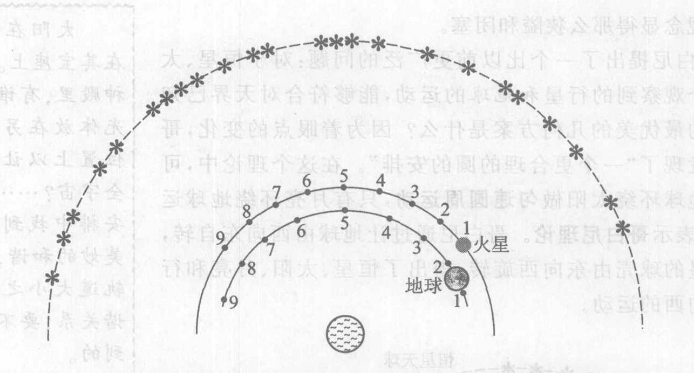

*图 1.15 哥白尼理论对逆行的说明。当地球超过另一行星如火星时，由于地球观察者视线的转动，这个行星在恒星背景上看起来就像是向后运动。你可以按概念检查 5 中的指示来演示这一点。当你追过一辆沿笔直的高速公路行驶的汽车时会出现类似的效果。以远方的树和房屋为背景，由于你的视线的转动，较慢的汽车在几秒钟内看起来似乎是向后运动。*

⑥ 虽然伽利略没有发明望远镜，但是他是把望远镜用于意义深远的科学问题的第一人，他首先用望远镜研究天象。

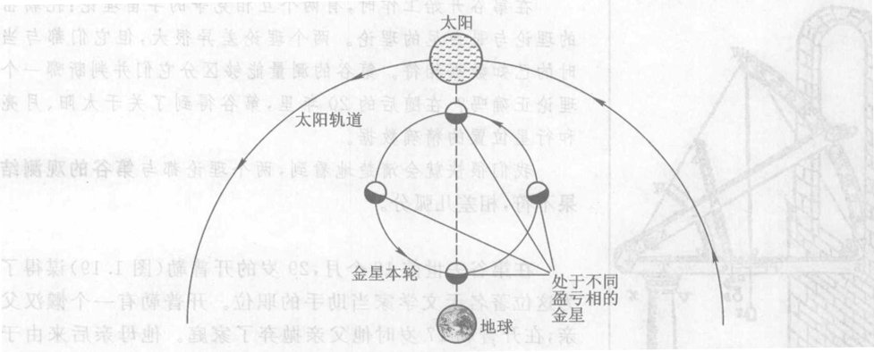

*图 1.16 托勒密理论预言地球上的观测者绝对看不到金星的“满盈”相，这是因为金星的本轮位于地球与太阳之间。哥白尼理论预言可以看到近乎满盈的金星，只要像图 1.14 中那样金星在其绕太阳的轨道上位于太阳的另一侧。伽利略观测到金星的满盈相，从而推翻了托勒密理论。*

> **概念检查 4** 按照哥白尼的观点，当我们说“太阳从东方升起”时，实际上是说 (a) 由于太阳绕地球旋转，太阳开始出现在东方地平线线上方；(b) 由于地球绕太阳旋转，太阳开始出现在东方地平线线上方；(c) 由于太阳绕其自身的轴旋转（或者说自转），太阳在东方地平线上方转入视野；(d) 地球绕其自身的轴向东旋转而将太阳带入视野；(e) 地球绕其自身的轴向西旋转而将太阳带入视野。

> **概念检查 5** 图 1.15 表明地球和火星在九个不同时刻的位置（编号从 1 到 9）。如你所见，在这一期间地球将越过火星。在这九个时刻中的每一个，画出从地球经火星到背景恒星的观测线。根据所画的图，火星逆行出现在 (a) 由 4 到 6 期间；(b) 由 3 到 5 期间；(c) 由 1 到 5 期间；(d) 由 4 到 7 期间；(e) 这些时间都不是；(f) 午饭时间。

> **概念检查 6** 接着前一问题，如果从太阳观察火星，那么看上去它在 (a) 4 到 6 期间逆行；(b) 1 到 5 期间逆行；(c) 5 到 9 期间逆行；(d) 全部时间内逆行；(e) 全部时间内正常（向前）运动。

### 1.5 开普勒理论：以太阳为焦点的宇宙

第谷·布拉赫（图 1.17）出生于哥白尼去世后的第三年。第谷非常喜欢夜空，同时也善于筹募资金，他曾从丹麦国王那里募得一笔资金，用于建立一座大天文台。

**我们怎么知道更精确的行星位置？** 第谷的精致的观测装置（图 1.18）如此精确，以至于他得到的数据直到今天有时还管用。在第谷之前，最好的测量的不准确度（可能的误差）至少是 $10'$ ($1'$ 是 $1^\circ$ 的 $1/60$)。第谷测量数据的准确度仅为 $2'$。

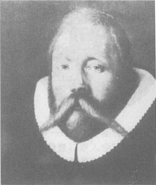

*图 1.17 第谷·布拉赫，1546—1601。通过对行星位置的精确测量（比前人的测量精度高 5 倍），他推翻了关于天界结构的两个理论。*

在第谷开始工作时，有两个相互竞争的宇宙理论：托勒密的理论与哥白尼的理论。两个理论差异很大，但它们都与当时的已知数据相符。第谷的测量能够区分它们并判断哪一个理论正确吗？在随后的 20 年里，第谷得到了关于太阳、月亮和行星位置的精确数据。

我们很快就会清楚地看到，两个理论都与第谷的观测结果不符，相差几弧分。

在第谷去世前 18 个月，29 岁的开普勒（图 1.19）谋得了为这位著名天文学家当助手的职位。开普勒有一个懒汉父亲，在开普勒 17 岁时他父亲抛弃了家庭。他母亲后来由于是女巫而受审判。此外，“这孩子在痘疮、头疼、脓肿、皮疹、寄生虫病、痔疮、螨病以及对像有一个拖负的天文学家来说最糟糕的视力缺陷等疾病的困扰中过早地成熟了。”他的视力问题包括一眼重影和两眼近视。⑦看来，少年时的磨炼锻炼了开普勒的性格，使他能面对日后的挑战。作为哲学家、数学家、天文学家和占星家，开普勒忠实于毕达哥拉斯关于宇宙中存在完美的数学秩序的观念，而且还怀着另一种虔诚，这种虔诚只能说是对太阳的崇拜。关于数学秩序，开普勒声称：
“何必废话呢？几何学在上帝创造万物之前就已存在了，它和上帝的心智同样长久，它就是上帝；几何学为上帝创世提供了一个模型。”
而关于太阳，开普勒写道：
“太阳位于运动着的群星的当中，其自身静止却又是运动的源泉，承载着圣父和创世主的形象……太阳将其动力散发到周围的空间，赋予运动的天体，正如圣父通过无所不在的圣灵创造万物一样。”

了解了开普勒这些信念之后，我们就不会对下述情况感到惊奇了：他是第一个公开支持哥白尼体系的天文学家，并以一种“令人难以置信的如痴如醉的喜悦”欣赏这一理论的美妙。开普勒的言谈与思想透射出这位科学家探索宇宙的热情。

虽然他是哥白尼的忠实信徒，但是开普勒发现第谷关于火星的数据不可能符合哥白尼的理论，哪怕开普勒尝试着重新修正这个理论。哲学家和小说明家凯斯勒特称把开普勒这位科学家兼神秘主义者描写成中世纪科学与近代科学的分水岭。

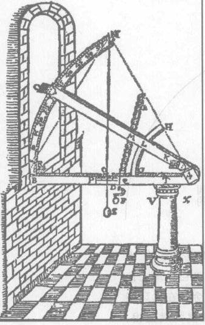

*图 1.18 第谷用来测量行星仰角的仪器。两个木臂连接在一起，下臂水平放置，这可由挂在刻度尺上端铅直垂下的线和悬锤确定。上臂抬起，直至它指向行星。以地平线为基准，这个行星的角位置即可由分度标尺读出。*

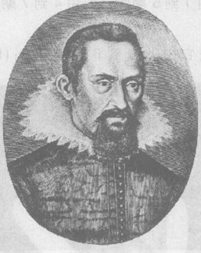

*图 1.19 开普勒，1571—1630。他怀着一种“令人难以置信的如痴如醉的喜悦”思考着哥白尼理论，虽然第谷收集的科学事实迫使他以使哥白尼不高兴的方式修改这个理论。*

⑦ Michael J. Crowe, *Theories of the World from Antiquity to the Copernican Revolution*. New York: Dover Publication, Inc., 1990.

引用哥白尼最看不起的偏心等距点方法也不行。这种计算繁琐而冗长，开普勒为此花了四年时间，清秀的笔算算式填满了 900 页的笔记本。但是，最近似第谷火星数据的哥白尼轨道仍然差 $8'$。在第谷之前，$8'$ 的误差可以归为观察误差。但是，面对第谷艰苦得到的数据，开普勒坚信：不论是观测误差，还是进一步的尼预言一致。但是，热情满怀的开普勒写道：“在这 $8'$ 偏差上，我迟早会建立一个宇宙理论。”他重新开始。他开始研究不基于匀速圆周运动的行星运动，这在历史上是第一次。哥白尼和所有天文学前辈如果知道，将会为此感到震惊。

16 年后，开普勒最终找到了他的答案：行星不做圆周运动。相反，它们是做椭圆运动。他能使一个椭圆与第谷数据吻合，从而解决了烦扰他如此之久的 $8'$ 偏差的问题。并且所有行星的数据都符合椭圆模式。

**开普勒理论**说，每个行星不是在以太阳为中心的圆上运动，而是在一个以太阳为焦点的椭圆上运动；这个椭圆以太阳为一个焦点，另一焦点上没有任何东西。图 1.20 表示怎样画椭圆。⑧你可以把椭圆描述为一个压扁的圆。行星轨道是稍稍有些点扁的椭圆，这是太阳为中心的圆周轨道理论如此接近于观察结果的原因。椭圆具有开普勒一直追求的那种优美。他得意洋洋地写道：
“16 年前我大声疾呼要寻求的东西，我为之而参加第谷·布拉赫的工作的东西，终于被我发现了，并且认识到其真理性超出了我最乐观的估计……木已成舟，书已写成，我并不在乎现在是否有人读它，还是留给后世吧。上帝为了一个观察者已经等了 6000 年，为一个读者再等上 100 年又有什么呢？”

> **概念检查 7** 我们能用图 1.20 的图钉加线的作图法画一个圆，方法是：(a) 使两个图钉更加分开；(b) 在图示的两个图钉中间加上第三个图钉；(c) 把两个图钉放到一起。

⑧ 下面是椭圆的准确定义；椭圆是平面上与两个固定点（两个“焦点”）的距离之和为常数的一切点的集合。图 1.20 所示的作图法遵循这个定义。

> 首先，宇宙所有物体当中最卓越的就是太阳，也许某个盲人会否认这一点。太阳的全部实质就是最纯洁的光，没有比它更伟大的星星了；惟有它才是万物的创造者、保养者和供暖者；它是光的源泉，包含热量，带来成果；看上去极美丽，极清澈，极纯洁，是视觉之源，是所有颜色的涂画者，虽然其自身没有颜色；太阳因其运动而被称为诸行星之王，因其威力而被称为世界的心脏，因其美丽而被称为世界的眼睛，只有太阳才堪称至高无上的天主。
> ——开普勒，大概写于 22 岁时

> 在思想史上也许找不到另外的例子，像顽固执拗地迷信圆那样，这个错误困扰了天文学两个千年。
> ——A. Koestler, 20 世纪作家和科学家

### 1.6 科学：大自然与心智的对话

科学中常常发生下面这种情况。科学家说：“那的确是一个好论据，我错了。”然后，他们真地会改变想法，你不会再从他们那里听到旧观点。他们真是这样的。当然，这种情况并不是应该发生时都会发生的，这是因为科学家也是人，改变立场有时是痛苦的。但是，每天都有这种情况发生。
我想不起在政治或宗教领域里最近一次发生这种情况的时间了。
——萨根，天文学家和科普作家

没有实验的物理理论是空洞的，没有理论的实验是盲目的。正是实验家使理论家保持老老实实的态度。
——帕格尔斯，物理学家

> 我曾测量过天空，
> 而现在测量幽冥，
> 灵魂飞向天国，
> 肉体安息土中。
> ——开普勒自撰墓志铭

> 科学方法：殚精竭虑，不抱任何清规戒律。
> ——布里奇曼，引自 *Reflections of a Physics*

科学以直接经验（观察和实验）和对这种经验进行组织与理解的理性思维为基础。科学的这种经验与理性的基础将它与基于信仰、直觉、个人权威或权威性书籍的其他形式的知识区分开来。

虽然观察是科学认知过程的开端，但是一份观察到的事实的目录并不增加对大自然的了解，就像一本电话簿并不增加对一座城市的了解一样。“了解”——其英文 (understand) 的字面意思是“站在……之下”——的意思是“看出了一个框架”。科学思想的一个框架叫做**理论**。在天文学的发展过程中，观察激发思考而得出理论，这些理论反过来又提出新的观察以检验理论和引发新的思考。观察和理论之间的互动是科学的本质所在。图 1.21 表明这个与大自然的对话过程。

观测指的是数据采集过程。测量是定量的观察，而实验是由人设计和控制的观察，可能是在实验室内进行。

科学理论是一个得到充分证实的思想框架，对我们观察到的东西进行解释。**模型**是一种可以直观想象的理论，而**原理**或**定律**则是更普遍的理论中的一个观念。定律这个词由于听起来如此确定，可能会造成误导。我们将看到，科学概念永远不是绝对确定不变的。

注意：理论是一个得到充分证实的思想框架。认为科学理论只是种猜测，像非科学家有时把某个科学想法说成是“不过是个理论”那样，这是错误观念。一些不喜欢哥白尼理论的

人曾认为它只是理论而已，不需要认真对待。当今不喜欢生物进化论的人以类似的理由攻击它。**理论**——被充分证实的对我们的观察结果的解释——是科学的真正目的，而且像科学中任何一个概念一样地确定。

用来表示一个合理的但未得到证实的科学设想（或猜测）的正确词语是**假说**。例如开普勒最初尚未证实的设想即行星可能是在椭圆轨道上运动，就是一个假说。一旦第谷和其他人的数据证实了开普勒的设想，椭圆轨道就具有了理论的地位而不再仅仅是假说。图 1.22 表明开普勒的太阳系（太阳和它的众行星）理论的普遍形式，它包括了现今已知的所有八大行星*。这一理论解释了第谷的所有数据和以往的所有观察结果，并将这些数据归纳为像椭圆轨道原理这样的几条原理。可以看出，理论体现了一种极大的简化或约化，将大量观察结果归结为几条简单原理。

**天文学早期历史概要**

| 观察 | 代表性时期 | 理论 |
| :--- | :--- | :--- |
| 恒星、太阳、月亮和行星在头顶运动 | 公元前 3000 | |
| 每个行星都以变化的速率运动；逆行 | 公元前 500 | 毕达哥拉斯理论：以地球为中心的透明球壳 |
| | 公元前 400 | 柏拉图的多重透明球壳理论 |
| 天界与大地似乎不同；地球似乎是不动的，显得与阿利斯塔克的理论矛盾 | 公元前 300 | 阿利斯塔克的理论：以太阳为中心的圆轨道 |
| 行星在逆行时更亮 | 公元前 200 | |
| 细致的定量测量表明需要作小修正 | 公元前 100   0 | 以地球为中心的本轮理论    托勒密理论：以地球为中心的本轮，偏心等距点 |
| 第谷的精确测量否定了托勒密和哥白尼的理论 | 公元 1500    公元 1600 | 哥白尼理论：以太阳为中心的圆轨道    开普勒理论：以太阳为焦点的椭圆轨道 |
| 伽利略用望远镜观察的结果否定了地心理论 | | |

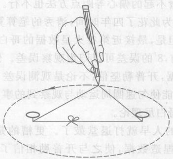

*图 1.20 你可以靠一个线环和两个图钉画出一个椭圆，两个图钉代表两个焦点。*

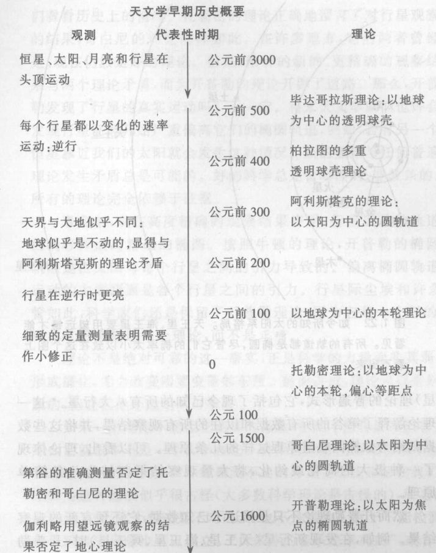

*图 1.21 我们怎样开始知我们在宇宙中的位置。这个图表示观察与理论之间的互动，它是科学的实质。*

> 科学是相信专家无知的一种信念。
> ——费曼，物理学家

> 全部科学不外是日常想法的提炼……形成概念的科学途径与我们在日常生活中所用的形成概念的途径的差别不是根本性的，而仅仅在于对概念和结论的更精确的定义，对实验资料更为精心和系统的选择，以及更为宏大的逻辑体系。
> ——爱因斯坦

> 人类巨大的理性分歧并非沿着地理界线或种族界线发生，而是发生在了鲜并实践着实验方法的人们和那些对实验方法不了解也不实践的人们之间。
> ——萨顿，科学史家

> 科学的目的不是打开通向永存的智慧之门，而是为永存的错误设立一个界限。
> ——布莱希特，剧作家，引自其剧作《伽利略传》

> 科学能使宗教清除掉错误和迷信，而宗教能使科学清除掉偶像崇拜和虚假的绝对性。
> ——教皇约翰·保罗二世，1988年

然而开普勒理论不只是描述了已知数据，它还预言新的观察结果。例如，在发现新行星（天王星、海王星、冥王星）时，开普勒理论正确地预言它们也将是在椭圆轨道上运动。没有预见性的理论，在说明每个新的观察结果时需要修补，这个理论就没有什么价值。例如，托勒密理论无疑能够用足够多的新本轮加以修正，以与第谷的全部数据一致，但结果只会是乱糟糟、倒人胃口，而没发展提供基础。非常重要的是，开普勒理论能够为进一步的发展提供基础。在开普勒去世几年后出生的牛顿，凭借开普勒理论建立了他自己的运动和引力理论。

另一个关于理论的错觉（特别是这些理论被称为“定律”时）就是认为它们是绝对可靠的，从而科学知识是绝对的。让我们看看历史上的情况。托勒密的理论正确地预言了对行星观察的结果，哥白尼的理论同样如此。在许多地方，它们两者曾经是、现在仍然是好的理论。但是，第谷的新的、更精确的观察结果与两个理论矛盾，而为开普勒的理论开辟了道路。那么，开普勒发现了行星的真实运动吗？不一定。将来天文学家们也许会发现行星已经开始严重偏离它们的椭圆轨道，例如，若有另一个恒星靠近我们的太阳就会发生这种情况。新的数据与任何普遍理论发生矛盾总是可能的。好的科学总是暂时性的、非教条的。所有的理论完全依赖于证据。

事实上，现在高度精确的观察结果表明，行星运动的轨道的确轻微偏离精确的椭圆。按照牛顿的理论，这些轻微的偏差轨道是由太阳以外各行星之间的引力导致的。偏离椭圆轨道运动的主要原因是各个行星之间的引力。行星际尘埃和许多别的东西也会引起小偏差。尽管如此，科学家们还是保留了开普勒理论，因为它是一个好的、有用的近似。也许我们应该用好或有用描述一个理论，而不是正确。

理论不是绝对可靠的这一事实，正是科学的力量而非其弱点。绝对可靠会助长教条主义和形成僵化，无力改变需要变革的东西。前面讲过，理论可以是好的、有用的、富有成果的或令人信服的，但它们绝不是绝对可靠的。

如果一个理论不能接受观察的检验，它就不能告诉我们有关这个可观察的宇宙的任何东西，那么它就根本不是一个科学理论。科学理论必须由观察结果检验，而观察结果可以想象是可能和理论抵触的。例如，“一种探测不出的外星生物正生活在我们中间”就不是一种科学论断，这不但是因为这种想法似乎很古怪（大多数科学理论是古怪的），而是因为说这种生物是探测不出来的，从科学上讲，这个想法是不对的，可也不是错的。由于不能检测，它就不属于科学范畴。不属于科学的概念自然也可以成立。“贝多芬的音乐是崇高的”，或者“我爱你”，或者“愿上帝保佑这个家”，都可以是有意义的表述，但它们都不属于科学。

第谷精致的仪器和毕达哥拉斯与开普勒充满灵感的理论表明，科学的兴盛依赖于创造性。这些美妙的发明能够产生一幅宇宙的协调一致的图画，这是大自然的一个秘密。正如爱因斯坦一旦次说的：“这个世界最令人不能理解的一件事就是它能够被理解。”科学家普遍相信毕达哥拉斯学派的理想，即宇宙的基础是几条简单而优美的原理。哥白尼不接受奉为神圣的地心理论而采用日心理论，就是因为后者“令人心智愉悦”。开普勒这样的科学家热烈追求的是发现一个优美的框架。爱因斯坦在创造他的理论时常常问自己，如果他是上帝，他会怎样构筑宇宙。

观察和理论化的科学认知过程与我们应付日常生活的方法并没太多的不同。在科学中，与在生活中一样，我们从经验并通过对经验的仔细思考来学习。这正是人类活动的特点。总结如下：

**科学认知过程**
科学基于经验（实验和观察结果）与理性（整理经验使之相互关联的理论和假说）之间的互动。这一植根于经验与理性的基础，将科学与基于信仰、直觉、个人权威或权威性著作的其他形式的知识区分开来。

我们将经常回到科学认知过程这个主题上。

> **概念检查 8** 对开普勒发展他自己的理论是有效的（或有用的）理论是 (a) 哥白尼理论；(b) 阿利斯塔克理论；(c) 托勒密理论；(d) 柏拉图理论；(e) 牛顿理论。

> **概念检查 9** “与科学界的意见相反，宇宙只是 200 年前才创造出来的。使地球看起来比 200 岁要老的历史纪录、像是很老的树、化石，等等，实实际际上都只是 200 年前制造的，为的是愚弄人类使他们相信宇宙的年龄超过 200 岁。”这个说法是 (a) 非科学的，因为它是愚蠢的；(b) 非科学的，因为它不能被检验；(c) 非科学的，因为它是错的；(d) 非科学的，因为其他科学家不同意；(e) 科学的而正确非的说法。

> **概念检查 10** 威廉绝对确信一个特定的科学原理。我们由此可断定 (a) 这个原理是正确的；(b) 这个原理是错的；(c) 这个原理是离题的；(d) 威廉是讲科学的；(e) 威廉是不讲科学的；(f) 威廉是大傻瓜。

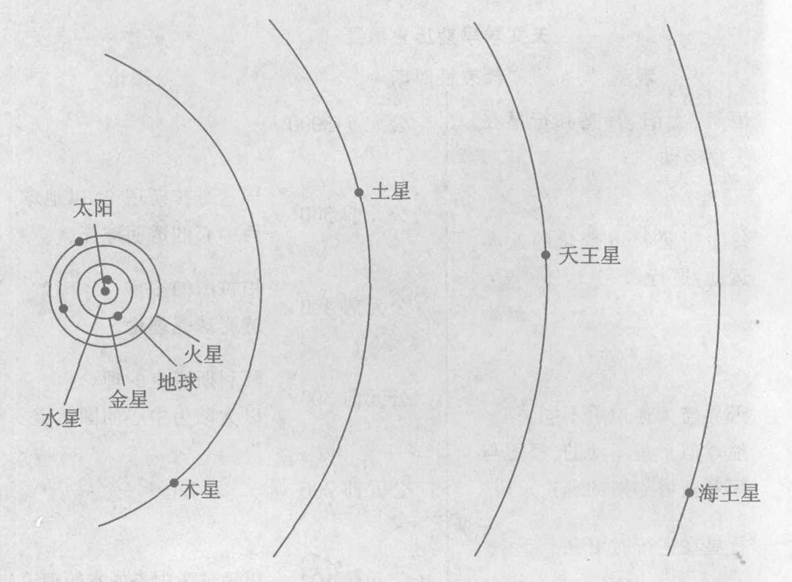

*图 1.22 如今所知的太阳系格局。天王星、海王星要用望远镜才能看见。所有的轨道都是椭圆，尽管它们的椭率太小以致在这个图上看不出来。*

* 2006 年 6 月 24 日，在布拉格举行的国际天文学联合会第 26 届大会修订了行星的定义。“行星”指的是围绕太阳运转、由于自身引力使天体近似呈圆球状并且能够清除其轨道附近其他物体的天体。冥王星不能清除其轨道附近其他物体，因此被降级成为“矮行星”，不算行星了。于是太阳系中只有八大行星。——译者注

> 物理概念是人类心智的自由创造，而不是由外部世界唯一决定的，不管看起来它多么像是那样。
> ——爱因斯坦

> 神从一开始就没有把一切事物揭示给我们；然而在时间进程中，人们通过探索发现了什么是更好的。但对于确凿无疑的真理，还没有人知道它，也不会有人知道它；他不会知道神的真理，也不会知道我所说的一切事物的知识。即使偶然有一次他说出了终极真理，他自己也不会知道他所说的乃是终极真理，因为一切只是一张由猜测织成的网。
> ——色诺芬尼，希腊哲学家，公元前 6 世纪

> 今天我们必须根据我们今天能认识的真理来生活，还准备好在明天称它为谬误。
> ——W. James，哲学家

> 我们正在试图尽可能快地证明自己错了，因为只有这样我们才能进步。
> ——费曼

> 科学由事实构成，就像一所房子由石头建成一样。但是，事实的堆积不是科学，正像一堆石头不是房子。
> ——庞加莱 (1854—1912)，科学家和数学家

### 1.7 哥白尼革命：近代科学的黎明

科学时代源于历史上的两个进展。一个是毕达哥拉斯学派对自然和谐的信念，这种思想吸引了希腊哲学家，然后传播到欧洲和全世界。其基本前提是，宇宙是组织在一个由一些原则构成的框架之中的，而且这些原理是可以通过观察发现的。

另一个历史进展是对“地心幻觉”的拒绝，这种幻觉以为地球是宇宙的中心，从而根本不同于宇宙的其余部分。这一进展是哥白尼启动的，因此被称为**哥白尼革命**。它带来的冲击是，地球是一颗与其他行星类似的行星，大自然基本上到处都一样，只是在不同地点和时间在细节上有所不同，但总是遵循同样的普遍原理。

通过这样的表述，我们能看到在哥白尼观点中存在着某种对称性。**对称性**是对称科学的一个重要主题。若一个物体从几个方向看上去都依然相同，通常就说这个物体具有对称性。例如，一个正方形可以从四个方向看上去仍然相同。哥白尼观点的延伸就是无论你在宇宙的什么地方，其基本运作原理都与地球上的相同。

更多的认沿着这条思路想下去。越来越明显的是，被哥白尼和开普勒看做宇宙中心的太阳也只是与其他恒星一样的一颗恒星。现在我们知道，看得见的星星都属于一个巨大的旋转着的集合，它有着 4000 亿颗以上的星星，散布在空间中一个巨大的馅饼状的区域里。我们的太阳是这个集合中的恒星的一员，并绕集合中心每两亿年转一周。然而，这个集合中心也不是宇宙中心。另外还有几千亿个类似的恒星集合遍布可观察到的宇宙。根据现行理论，这些集合没有一个位于宇宙中心，这是因为宇宙没有中心。（第 11 章要讲述这个奇特的观念。）这就把哥白尼天文学发挥到了极致。

每一个巨大的星星集合叫做一个**星系**。我们所在的星系是**银河系**。图 1.23 显示了一个典型的遥远星系，它与我们的星系很像。夜空中的云状辉光称为银河，这是我们身处其中所看到的银河系——就像站在一个巨大馅饼当中向着这个面团望去。辉光来自整个星系中很小的局部的星星。银河系的中心远在看得见的银河之外，位于叫做人马座的星座（星群）的方向上。

在银河系外面还有大量星系，图 1.24 是包含数以百计的星系的典型的一小块天空中的几个遥远的星系的照片。在整个可观察到的宇宙中——我们能从中接收到光的那部分宇宙——大约有 1 000 亿个星系。在可观察到的宇宙中的星系数目差不多与我们的银河系内的恒星一样多！那是一个巨大的空间。

> 那些星球该多么巨大啊！而这个地球，这个类似剧院的地方，在这里进行着我们所有的宏伟构想、所有的航行和所有的战争，与那些星球相比，它是多么微不足道。对于那些国王和君主们，这是——件很值得思考和反省的事；他们牺牲众多臣民的生命，只是为了满足其野心以及成为这个小地方中某个可怜角落的主人。
> ——惠更斯，物理学家，大约 1690 年

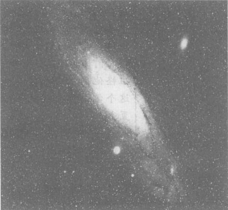

*图 1.23 通过望远镜拍摄到的仙女座星系。这是离银河系最近的一个大星系。与银河系一样，仙女座也由十亿计的恒星组成，这些恒星环绕着一个满是恒星的发光中心旋转，而每个恒星都和我们的太阳多少有些相似。肉眼几乎看不到仙女座，因为它比银河系中的可见恒星远得多。光要用大约 250 万年的时间才能从仙女座到达我们这里，因此我们看到的是仙女座 250 万年前的历史。*

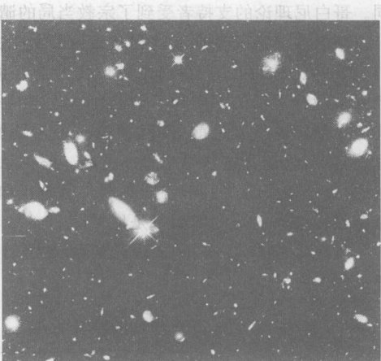

*图 1.24 这是用哈勃空间望远镜 [图 1.2(a)] 拍摄的遥远星系的照片。照片上几乎每个物体都是一个完整的星系，其中大部分离我们非常遥远，我们看到的来自它们的光大约 130 亿年前开始其行程。我们相信这大约是星系形成时，而且仅仅是在宇宙开端大约 10 亿年之后。照片覆盖了天空的很小一块，只有月球直径的 1/30，而比以往任何可见的图像都更深入遥远的空间。虽然这张照片只显示了天空的很小范围，但对星系的空间分布是有代表意义的，因为从统计意义上讲，宇宙在一切方向上看起来都相同。*

哥白尼播下了许多革命的种子。亚里士多德曾发展了一种以地球为中心的物理学，它有两组自然定律，一组用于地球上的事物，一组用于天界。一旦哥白尼宣布地球是一个行星，牛顿就得以把天上的与地上的物理学统一为一门新物理学，它的基本原理在整个宇宙中的各处都同样起作用。与哥白尼把地球与其他行星统一起来一样，达尔文构想出一个生物进化论，把所有的生物统一起来，而人类只是许多物种中的一种。哥白尼和牛顿关于自然规律一视同仁地适用于各处和所有人的观念，是从中世纪的威向法制与民主制度的政治过渡的重要组成部分。

宗教与哲学领域正确地意识到哥白尼天文学的革命性。托勒密体系和以地球为中心的亚里士多德物理学并行发展起来的，而亚里士多德的思想则是天主教神学的基础。如果托勒密体系受损，那么天堂的完美、尘世的缺陷以及人类在上帝的宇宙蓝图中的中心地位就将受到威胁。

哥白尼去世 70 年后，天主教会宣布其理论“荒诞谬误”，“全然离经叛道”，是“异端邪说”。科学史家认为，在这段时期里，科学与宗教分成了两个互不沟通的营垒，直到今天他们彼此仍有争执。这种情况与认为科学和宗教是一回事的毕达哥拉斯学派大不相同。哥白尼理论的支持者受到了宗教当局的谴责和迫害。⑨

新教改革运动领袖人物在谴责新天文学方面更为极端。他们主要的反驳理由是，新理论有悖于对圣经的“原义”解释。圣经常常说到运动的太阳和不动的地球，这和哥白尼的理论相反。甚至在新理论发表之前，新教领袖马丁·路德听说了哥白尼的思想之后，就谴责这些思想背离圣经。路德听认为，“这个白痴（哥白尼）会把整个天文学完全颠倒。但是正如圣经所说，约书亚命令停住不动的是太阳而不是地球。”

难怪生性审慎的哥白尼直到临终之日才出版他的行星理论。

> 人类也许还从来没有面对过比这更大的挑战，这是因为既然（哥白尼）承认（人类不是宇宙的中心），那么，第二个乐园，一个天真无邪的世界，诗与虔诚，理性的证据，宗教的、富有诗意的忠诚的确信……还有哪一样不会化为烟尘呢？难怪人们接受不了这一切，难怪他们把自己摆在和这个学说完全对抗的位置上。
> ——歌德，19 世纪德国诗人和剧作家

*开普勒的艰苦舌战*

⑨ 1984 年梵蒂冈声称，教会官员当年宣布伽利略有罪是错误的，并呼吁加强科学与宗教之间的对话。接着在 1992 年，罗马教皇宣称教皇错误地指控了伽利略，将过去失归于 17 世纪教会当局解释圣经太拘泥于字面意义。

> **概念检查 11** 下面哪些是哥白尼革命的基本突破的延续？(a) 宇宙是为人类产生的；(b) 月球可能是由地球分裂出的材料构成的；(c) 我们的太阳只不过是数十亿颗类似恒星中的一个；(d) 我们的银河系处在宇宙中心；(e) 人类在生物学上并非完全不同于其他物种；(f) 我们的星系只不过是以十亿计的类似星系中的一个。

> **概念检查 12** 科学最突出的特点是 (a) 使用精确的数学关系式；(b) 精确的定量观察；(c) 科学定律的绝对真理性；(d) 理论和观察之间的相互支持关系。

> **概念检查答案**
> 1. 有了你自己的答案之后再看！本题答案是(d)。
> 2. 月相（新月、月牙、弦月等）表明它依靠反射太阳的光发亮，(b)。
> 3. 托勒密理论（图 1.11）把水星和金星的本轮轨道的中心放在地日连线上，(b)。
> 4. (d)。
> 5. (a)。
> 6. (e)。
> 7. (c)，注意：这表明圆是椭圆的特殊一种。
> 8. (a)。
> 9. (b)。
> 10. 科学观念绝非绝对确定，因为下一次观察可能就会否定（或“证伪”）它，(e)。
> 11. 答案 (c)、(e) 和 (f) 是对的，因为它们每个都说明我们在宇宙中的特定位置不是唯一的。
> 12. (d)。

---

### 关键概念

下述概念的定义出现在所标页码的本书正文页面上和书末的按拼音排序的术语词汇中。我们将它们按出现先后顺序排列在这里，你可以用这个清单复习本章内容。

*   科学 3
*   物理学 5
*   科学认知过程 5
*   天文学 5
*   占星术 6
*   行星 6
*   毕达哥拉斯宇宙理论 9
*   毕达哥拉斯学派 9
*   托勒密理论 13
*   本轮 12
*   匀速圆周运动 15
*   哥白尼理论 15
*   第谷的观察结果 18
*   开普勒理论 19
*   观测 20
*   测量 20
*   实验 20
*   理论 20
*   模型 20
*   原理 20
*   定律 20
*   假说 21
*   太阳系 21
*   哥白尼革命 24
*   对称性 24
*   星系 25
*   银河系 25

每章后面都有复习题、思考题和习题（第 1、第 2 和第 11 三章无习题）。复习题重温许多基本内容，并可从本章中找到答案。思考题要求根据自己对教材的理解回答新的概念性（非数学的）问题，思考题有许多，让教师有选择的灵活性，你只要回答其中一部分就行了。习题不是概念性的，要用数学。奇数题号的思考题和习题的答案在书末。

### 复习题

**观察夜空**

1.  本章所说的研究科学的两个理由是什么？
2.  什么是物理学？
3.  区分天文学与占星术。
4.  正常条件下你在夜空中能看到什么天体？描述从地球上看到的它们的运动。

**古希腊理论**

5.  毕达哥拉斯学派信仰什么？这些信念怎样影响科学的发展？
6.  按照希腊人最早的理论，行星环绕地球做匀速圆周运动。这个理论与不用望远镜的简单观察结果在哪方面不一致？
7.  给出两个基于观察的使人相信大地是曲面而不是平的理由。
8.  托勒密理论怎样解释行星的逆行及行星在逆行期间更亮的事实？
9.  托勒密理论与当时已知的定量观测结果一致吗？这些观测是怎样完成的？

**哥白尼理论**

10. “哥白尼拒绝托勒密理论是由于它与观测数据不符，他提出了一个的确与观察数据相符的新日心理论。”这个说法对还是不对？请说明。
11. 用哥白尼理论解释行星的逆行及在逆行期间它更亮的事实。
12. 哥白尼是为什么提出他的理论？
13. 举出至少一个似乎有理的理论，以反对地球环绕太阳运行的观念。
14. 用望远镜得到的证据，怎样决定性地否定了托勒密理论？

**开普勒理论**

15. “开普勒对哥白尼理论发生兴趣，是因为已知数据支持这个理论。”这个说法对还是不对？请说明。
16. 叙述第谷的工作及其对哥白尼理论和托勒密理论的影响。
17. 开普勒理论的哪个方面以往所有的天文学家都会感到震惊？
18. 按照开普勒理论，什么几何形状适合于行星轨道？

**科学革命与哥白尼革命**

19. 科学的最有特色、最重要的特征是什么？
20. 描述一个好的科学理论的几个特征。
21. 一个科学理论能够被证明（我们能够证明一个理论肯定是正确的吗）？能够否定一个科学理论吗？请说明。
22. 严格说来，开普勒理论已被否定。我们发现它有什么问题？既然如此，为什么我们仍然用它？
23. 假说与理论有何不同？
24. 区分哥白尼理论和哥白尼革命。
25. 在什么意义上可以把生物进化论说是成“哥白尼式的”？

### 思考题

单数题号题目的答案在书末。

**观察夜空**

1.  仅通过直接观察，你怎样辨别天空中一个特定天体是星还是行星？
2.  画图表示地球、月亮和太阳在新月、上弦、接近满月和满月时的位置。
3.  图 1.4 中的星星是顺时针旋转还是逆时针旋转？在南半球对着南极用慢镜头拍摄的照片，会显示星星环绕着南天的一个固定点做圆周运动。南方视野中的这些星星是顺时针旋转，还是逆时针旋转？

**古希腊理论**

4.  描述一个你用肉眼能做的观测以否定行星绕地球做简单匀速圆周运动的理论。
5.  描述一个你用肉眼能做的观测以否定下述理论：各行星附在一些透明球壳上，这些球壳以复杂的复式旋转，但总以地球为中心，行星就是这样绕地球运行的。
6.  在寻求逆行的解释时，古希腊人为什么不直接让行星在其围绕地球的圆周轨道上运行时改变运动速率与方向，而是诉诸本轮加均轮的方式？

**哥白尼理论**

7.  是否有可能在某个黄昏火星成了昏星？可能性大吗？（见图 1.14）
8.  用哥白尼理论预言火星是否会经历类似月亮的盈亏变化。我们会看到“满火星”和“新火星”吗？
9.  用肉眼看到水星是可能的，不过很难。那么，你用什么办法去找到它？
10. 用哥白尼理论（图 1.14）解释为什么金星常常会以晨星或昏星出现（把这个与问题概念检查 3 对照）。

**开普勒理论**

11. 哥白尼会喜欢开普勒理论的哪些方面？不喜欢哪些方面？
12. 开普勒理论与托勒密时代已有的数据一致吗？与第谷时代已有的数据呢？
13. 第谷的数据证明了行星是在椭圆轨道上运行的吗？请说明。
14. 开普勒理论中有什么东西和托勒密和哥白尼的偏心点相像？
15. 开普勒在第 19 页上的引语中提到的“观察者”是谁？
16. 在第 19 页上的引语中，开普勒说上帝已经等了 6000 年。为什么是 6000 年？
17. 解释怎样利用图 1.20 的图钉加线作图法得到一个高椭率的（拉长的）椭圆轨道。

**科学革命**

18. 因为达尔文进化论仅仅是一个理论，所以我们无需对它认真看待。试评论之。
19. 科学的最重要和最有特色的特点是什么？
20. 两个不同的理论能够在下面的意义上都正确吗？即在历史上某一特定时期，它们都正确预言已知观测数据。用一个历史例子支持你的答案。
21. “如果地球是弯曲的，那么它一定为球形，因为球是最完美的弯曲的立体形状。”这样的美学论据在科学中有其地位吗？
22. 一家惯于采用耸人听闻手法的小报刊登了这样一个标题：“科学家预言宇宙和其中的一切物体在新年始时大小将加倍！”这是一个可检验的假说吗？如果是，怎样检验？如果不是，那为什么不是？
23. 占星术是正经的科学，还是糟糕的科学，或者什么都不是？
24. 对诸如占星术、推理教、超感官知觉 (ESP)、外星人来访、地球年龄是 6000 年、百慕大三角以及金字塔魔力之类等信念的科学态度是什么？
25. 亚里士多德是一位细心的生物体的观察者，他想知道供植物生长的养料来自何处。他假设所有养料都来自土壤。根据你的生物学知识，你认为这个假说正确吗？设计一个实验检验这个假说。
26. 有些人相信，如果我们向植物讲话，植物会长得更好。这是一个可以检验的假说吗？如果是，设计一个检验它的实验。
27. “某些人具有超感官知觉的天赋，比如能用自己的意念移动物体。但是，超感官知觉是如此的娇气，每个想证实它的企图总是使它消失。”这是一个科学假说吗？
28. 牛顿预言，地球因自转会在赤道附近隆起，而在两极附近变扁平。1735 年，法国科学院派了一支探险队去北极圈测量地球的形状。他们返回时报告了与预言相符的结果。哲学家伏尔泰用下面两行诗嘲笑他们：
    “你们历经千难万险，远涉蛮荒
    为了发现牛顿在家里就知道的情况。”
    伏尔泰的讥讽有道理吗？为什么？
29. 考虑大地是平的的假说。给出支持和反对这个假说的证据。
30. 一个典型的星系中大约有 1 000 亿颗恒星，而宇宙的已知部分至少有 1 000 亿个星系，那么在已知的宇宙内总共有多少颗星星？写出这个数字。
31. 一个天文单位 (AU) 是从地球到太阳的距离。火星轨道半长轴大约为 1.5 天文单位。当地球和火星绕太阳旋转时，它们之间的最大距离和最小距离用天文单位度量是多少？
32. 一光年 (1 l. y.) 是光走一年的距离。我们最邻近的恒星离我们 4 光年。光从太阳到达这里要 8 分钟，用这一事实计算最邻近的恒星离我们多少天文单位？（参见前题）
33. 蟹状星云是一颗恒星爆炸后的残余物。中国人在公元 1054 年观察到这次爆炸。然而，蟹状星云离地球大约 3 500 光年（参见前题）。这颗恒星的爆炸实际发生在什么地球年代？