# 第 2 章 原子：事物的本性

> 如果在某种灾变中，所有科学知识都将被毁灭，只有一句话能传给后来的智能生物，那么，怎样的说法能以最少的语言包含最多的信息呢？我相信那就是原子假说（或原子事实，或者随便你叫它什么名字），即万物皆由原子构成。原子是一种小粒子，它们永不停息地四处运动，当它们分开一个小距离时就彼此相吸，而被挤到一堆时则相互排斥。在这一句话里……有着关于这个世界的极大量的信息。
> ——费曼，物理学家

我们现在由星星转向原子。更普遍地说，这一章考察原子和分子，即物质的微观结构要素。科学的基本原理之一，就是万物都是由难以察觉的微小粒子构成的。这条原理解释了范围非常广泛的观察事实，并深刻地影响着我们的文化对实在的认识。我们在后面各章将看到，在 20 世纪科学彻底改变了对原子的看法，这一发展对本书的四个主题之一①后牛顿物理学的意义至关重要。

第 2.1 节叙述万物由微小粒子构成的观念，这个观念已有 2500 年的历史了。第 2.2 节讨论化学家 200 年来所了解的原子，并把原子和分子区分开来。第 2.3 节探索原子概念在广泛范围内的解释能力。为了定量地讨论原子，我们需要在第 2.4 节对 10 的乘方和米制单位作一简短浏览。第 2.5 节对原子进行定量描述，强调它们是多么微小。第 2.6 节对原子概念的哲学含义作一简短考察。第 2.7 节把本章的原子模型与后面各章要介绍的两个更新的模型提前进行比较。最后，第 2.8 节考察原子的结合与重组（我们称之为化学反应）的几个重要例子。

① 另外三个主题是科学认知过程、物理学的社会联系和能量。

## 2.1 古希腊的原子：最小的碎片

古希腊产生了为数惊人的具有独创性的思想家，他们想要对万物溯本求源。在公元前 5 世纪前后的 200 年间，由于这种倾向于理性的态度，这一小群人为西方世界大部分伟大思想打下了基础。他们思考的一件事情就是物质（实物）的本性，所谓物质就是像木头、棉花、香肠、冰、水、泥土和黄金这些材料实体。他们相信在这些不同物质背后潜藏的统一性，并猜测这种统一性是什么。香肠与黄金有什么共同之处？物质是什么？

一个希腊人德谟克利特用一个“思想实验”突出了他对这个问题的关注。所谓思想实验即想象的实验，在原理上看它是可能的，但实际上难以实现。他说，设想你把一块金子切成两半，接着把其中一半再切成两半，这样继续下去，你能继续分割到什么程度？要么这种分割能够永远继续下去，要么有一个限度，到了这个限度就不能进一步分割了。这就是说，物质要么是连续的，可以无限分割下去，要么是由不可分割的粒子构成。第一种可能性在他看来是荒谬的。他的结论是，物质由小得不能觉察的“a-tomic”（希腊文，意为不可分割的）粒子构成。他把这种最小粒子称为原子（atom）。②

> **概念检查 1** 今天，原子概念应该归类为 (a) 科学事实；(b) 实验观察结果；(c) 假说；(d) 科学理论；(e) 科学谬误；(f) 莫名其妙的想法。（这种以选择题形式出现的概念检查问题在全书出现，它们有一个或多于一个正确答案。遇到它们时先试着回答，先不要看每章末尾的答案。为了增长见识，错误答案中包括了学生常犯的典型错误概念。）

我们将把这个概念叫做：

> **物质的原子论**
> 所有物质都由小得看不见的微小粒子构成。

这是科学原理或定律或理论的一个好例子，它是经过证实的全部概念，它能够解释范围广泛的观察结果。但在德谟克利特的时代，原子概念还未被观察结果证实，它只是一个有根据的猜想或假说。在 19 世纪和 20 世纪，观察结果证明了这一概念，于是它就成为一个确立的理论。但是，这样一个普遍概念不能叫做一个事实，不论观察结果多么经常地证实了它。这是因为我们不可能观察每一个可能的物体，以确切证明万物果然是由原子构成的。理论从来就不是绝对确定的。

你的拇指甲、啤酒、榭果、土星、亚马孙河以及这一段结尾处的句号有什么共同之处？它们中的每一个都是由原子构成。这就是希腊人喜爱的和科学家们寻求的那种根本的统一性。

**我们怎么知道万物都由原子构成？** 科学的力量来自它的“让我亲眼看一看”的态度，来自它坚持依靠证据。因此在本书中我们经常要问，“我们怎么知道？”

古希腊人没有直接用显微镜观察原子的证据，但是德谟克利特的确有一些独特的间接证明。例如他论证说：因为我们能够在远处闻到面包香味，所以小的面包粒子一定从面包上脱落下来飘进了我们的鼻孔。在今天，这仍是对气味的一种可接受的解释（见第 2.4 节）。

道尔顿在 1800 年前后发现了关于原子的第一桩特别的证据。道尔顿注意到，当某些物质化合成别的物质时，它们总是按重量的简单比值相互结合。例如，当氢与氧结合生成水时，两种物质的重量比总是 1:8。如果物质无限可分，就难以理解为什么会有这样的比值，但如果物质是由原子构成的，那么就会有一个简单的解释。例如，如果 1 个氢原子和 1 个氧原子有一个简单的重量比，而且如果这些原子总是以简单的比值结合成水，那么水中氢与氧的重量比也将是简单的数值。今天我们知道单个氢原子与单个氧原子的重量比为 1:16，而且每个氧原子总是和两个氢原子结合生成一个水分子。所以我们今天明白为了什么重量比应该是 1:8。

这样，原子论解释了道尔顿的简单比值。然而，这证明了原子论吗？回答是没有。可能原子并不存在，可能对简单比值另有一个解释。观察结果不能证明一个普遍的理论，但能使其更为可信。

② 今天所说的“原子”在意义上稍微有些不同。今天，“原子”或“化学原子”指的是一种元素的最小粒子。这种化学原子实际上是由更小的亚原子部分（电子、质子和中子）组成。事实上，质子和中子本身又由夸克构成。就我们所知，电子和夸克是终极的、最小的粒子，其他东西都由它们构成。古希腊人所说的原子指的是这些不能更小的部分。

在道尔顿之后几十年，植物学家布朗用显微镜观察到悬浮在液体中的花粉小颗粒无规律地动来动去（图 2.1），虽然液体本身没有可观察到的运动。他最初的假设是：这些花粉是活的。但是，悬浮在液体中的无生命的尘埃颗粒也同样无规律地动个不停，从而否定了这个假说。假设与理论虽然不能被证明，但是它们可以被否定。

人们提出，原子（或“分子”，如我们后面将看到的那样）的亚微观运动引起这种**布朗运动**。这个想法认为，原子在不停地运动，而布朗运动就是由于花粉或尘埃颗粒不断受到大量原子冲撞所产生。1905 年这个假说得到了一个当时还未出名的年轻物理学家的有力支持，他就是爱因斯坦。他运用已经建立的理论，计算像尘埃颗粒这样的粒子受到运动原子的随机撞击会怎样乱冲乱撞的情况。他给出了几个定量的（数值的）预言，例如尘埃颗粒聚集物由于液体中的无规碰撞而散开的速率。这样的预言是能够通过测量检验的，而测量结果与爱因斯坦的预言相符。这种证据无可争辩。要看不见的原子真地引起了布朗运动，要么爱因斯坦只是难以置信地幸运从而给出了所有正确数值。在爱因斯坦的这一工作之后，科学家们不再对原子论提出疑问了。

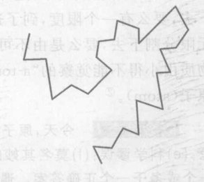

*图 2.1 布朗运动。这条不规则的路径，是对在显微镜下观察到的水中的小悬浮粒子（例如单个尘埃粒子）具有典型意义。原子论用水分子不停地快速随机运动来解释这一行为。虽然分子小即使用显微镜也看不见，但大量分子时刻冲击尘埃粒子的效果，则可以从尘埃粒子的不规则运动中看到。*

> **概念检查 2** 单个硫原子的重量是单个氧原子重量的两倍。当硫与氧结合生成二氧化硫时，每个硫原子需要一个氧原子。生成二氧化硫时硫与氧的重量比是 (a) 4比1；(b) 2比1；(c) 1比1；(d) 1比2；(e) 1比4。

> **概念检查 3** 接着前一问题，生成三氧化硫时硫与氧的重量比是 (a) 6比1；(b) 3比1；(c) 3比2；(d) 2比3；(e) 1比3；(f) 1比6。

## 2.2 原子和分子

想想你周围不同的东西：这张纸、你的衬衣、你的头发，等等，你可以列出成百种。19 世纪的化学家发现，它们中的绝大部分可以被分解成数目少得多的更简单的物质，而这些少数物质不能再进一步转化。任何把一种物质变成千种其他更简单的物质的过程③称为原来物质的**化学分解**。

③ 更精确地说，任何低能（低于核能）的物理过程。

例如，让电通过水，能将水分解成两种不同物质，称为氢和氧，它们中的任何一个都不像水。而氢和氧是 19 世纪的化学家不能分解的一小群物质（少于 100 种）中的两种。无论他们试图怎样分解，氢仍然是氢；氧也是如此。显然，这些不能用化学方法分解的约 100 种物质是格外基本的。它们叫做**化学元素**或简称为元素。

通过研究刚刚讨论过的重量比，道尔顿和其他人很快认识到：每种元素仅由一种原子构成，元素不同即因它们的原子不同。因此原子是化学元素的最小粒子。但是水是由氢和氧两种原子化合而成，因此能够分解成氢和氧。现今已知有 116 种元素，即 116 种不同的原子，它们之中的 88 种是地球上自然存在的，而其余的 28 种则是在实验室里造出来的。本书书后所附的元素周期表给出了每个元素的名称和标准缩写符号，并进行了编号。每个编号称为该元素的**原子序数**，代表特定的一种原子。原子序数越大对应的原子越重。我们将要在第 8 章讨论原子序数的物理意义。

科学家发现，可以对元素进行分组，同组元素具有相似的性质。例如，元素 2、10 和 18（氦、氖和氩）是“惰性气体”，意思是指它们是不愿意与其他元素化合的气体；元素 3、11 和 19（锂、钠和钾）都是软的银白色金属，在中等温度即熔化。如果把具有相似性质的组内诸元素竖直排列，并且按原子序数进行升序排列，那么就得到书后所附的元素周期表。这个表是科学家在自然现象中找到的规律性的一个好例子。在许多元素尚未发现时，科学家把周期表用作预测工具，注意表中当时尚未有元素填入的空白位置，寻找性质恰好适合这些空白位置的元素。

由一种以上的元素构成的物质又怎样呢？由一种以上的元素构成的纯净物质，例如纯水（没有混入盐或污物之类的杂质），叫做**化合物**。设想把一杯水分成越来越小的份额。如果水是纯净的，你得到的将永远仅仅是水，而不是其他东西，如盐或污物。继续分下去，体积越来越小，最后你将得到一个最小的水粒子。在纯净水中，每一个这样的最小粒子一定是水粒子，所以它们应当相同。而且，每个粒子必须包含氢原子和氧原子，因为我们知道水能分解成这两种元素。

上述推理表明，每种纯净化合物一定是由全同的小粒子构成的，这些小粒子本身又是有两种或更多种原子构成的，这些原子结合在一起形成一个可识别的单元。这样的小粒子，即仍然具有这种化合物特征的最小粒子，称为**分子**。化学家能通过使化合物分解或使之与其他化合物化合，推断出这种化合物的分子的结构。例如，这种实验表明水分子是由两个氢原子和一个氧原子构成（图 2.2）。

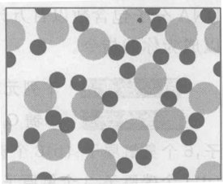

*图 2.2 放大 5 000 万倍的液体水的简化图。液体中分子彼此紧密接触且相对滑动。每个水分子由一个氧原子（大）和两个氢原子（小）构成。观察图样只显示一个大容器内的一个微小区域。*

有些元素由双原子分子构成。例如，氧气的分子由两个氧原子构成（图 2.3）。④氦气则不然，它由单个氦原子构成（图 2.4）。普通形态的氧气和氮气是由双原子分子构成的，而空气则主要由这两成分子构成（图 2.5）。

④ 然而在地球大气层外，宇宙中几乎所有的氢都处于“原子”（单个原子）形态，而不是“分子”（双原子）形态。这是因为宇宙开始时都是原子氢，并且这些原子在空间分开得如此之远，以致它们从未结合成分子。这些“原始的”氢原子在 140 亿年中（140 亿年是宇宙的年龄）没有变化！

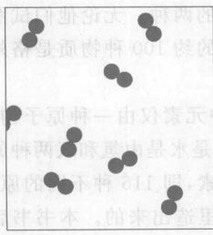

*图 2.3 氦气简化图。每个氦分子由两个氦原子构成。每个分子快速地做近似直线运动，只是在与其他分子或器壁碰撞时，才改变方向。*

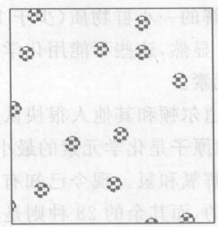

*图 2.4 氦气简化图。每个氦分子就是一个独立的氦原子。*

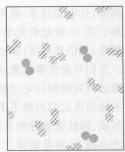

*图 2.5 放大 5 000 万倍的空气简化图。空气是混合物，主要由氮分子（带条纹的）和氧分子（实心的）构成，这两分子种都是双原子分子。*

我们用缩写的分子式表示化合物和元素。例如，水由 $H_2O$ 表示，其中下标 2 属于它前面的符号，表示每个分子中这种原子的个数。氦气由 $He$ 表示，氧气由 $O_2$ 表示，而氦气则由 $He$ 表示。

分子可能相当复杂，特别是生物的分子，像你的蛋白质和 DNA 分子。生物分子是已知的变化最多、最为复杂的分子。血红素，这个使血液呈红色的蛋白质的分子式为 $C_{3032}H_{4816}O_{872}N_{780}S_8Fe_4$。DNA 分子包含数以百万计的原子，而且每个人的 DNA 分子都有所不同。DNA 携带者使你所以成为你的指令。

> **概念检查 4** 下列元素中哪些与氦的化学性质相似？(a) 碘；(b) 硫；(c) 氙；(d) 溴；(e) 氪；(f) 氟。

> **概念检查 5** 单糖 $C_6H_{12}O_6$（葡萄糖）含有哪些元素的多少个原子？(a) 6个氢原子，12个氦原子，6个臭氧原子；(b) 6个碳原子，12个氢原子，6个氧原子；(c) 1个氯原子，1个氢原子，1个氧原子；(d) 1个碳原子，1个氢原子，1个氧原子；(e) 1个碳原子，2个氢原子，1个氧原子。

> **概念检查 6** 二氧化碳的化学式是 (a) $CaO$；(b) $Ca_2O$；(c) $CO$；(d) $CD$；(e) $C_2O$；(f) $CO_2$。

## 2.3 原子解释事物的能力：紫罗兰的香味

原子论的威力，细心观察的好处，这两者都可由“气味是什么？”这个问题来说明。⑤
观察结果表明，我们被空气这种看不见的物质所包围。因为你能感觉到风，所以你知道空气的确存在。原子论告诉我们，每种物质，包括你能拿起或接触到的任何东西，都由原子构成。可以合理地假设空气也是物质，因为你能感觉到它吹在你的身上。仔细的测量会显示空气有重量，这进一步证实了我们的假设。根据原子论，我们断言空气由原子构成。我们从布朗运动实验知道，液体中的原子总是处于运动，即使液体外表看起来是不动的。因此，似乎也可以合理地假设空气分子也在不停地运动着，即使在静止的空气中。

⑤ 这一节的部分内容根据 R. Feynman 的《物理学讲义》（*Lectures on Physics*）（Addison-Wesley, Reading, MA, 1963），第一卷，第一章，其中首次提出了紫罗兰香气的粒子。

想一想紫罗兰的香味。在紫罗兰的各种分子中，一定有一些由分子使它有这样的香气。化学家已经知道了紫罗兰香气分子的构成（图 2.6）。至少从科学的观点看，紫罗兰的气味就是那些分子。为了使紫罗兰气味散布开来，香气分子必须挣脱紫罗兰。且进入空气，运动着的空气分子就撞击香气分子，使之四处运动。这种无规则的撞击使香气分子散布开来，在空气中向各个方向扩散。最后，它们到达你的鼻子。下次你闻到什么气味时，想想这个道理。

原子论把我们周围看到的由人类尺度的或者说**宏观**的现象，与看不到的**微观**层次上的现象联系起来。微观的看法特别有助于了解物态。例如，水有冰、液体和蒸汽三种状态，我们称之为水的**固态**、**液态**和**气态**。几乎每种物质都能以这三种状态中的任何一种状态存在⑥。在宏观层次上，物质的这三种状态可以根据它们在容器内所具有的形状加以区别。在密闭容器中，固体保持原来的形状，液体在底部散布开来，而气体则充满整个容器的容积。在微观层次上它们有何不同呢？根据原子论和某些简单的宏观观察结果，稍微思索就能回答这个问题。我希望通过本书你们将发现，简单的观察结果加上细致的思考能完成多少事情！真是令人惊叹。

因为固体保持其固有形状，所以其分子一定被锁定为固定的布局。而且固体的体积难以压缩，所以它们的分子一定是挤在一起的。精确的布局由物质分子靠到一起时彼此间相互推拉的方式决定。如果你曾看到过大量的一球一个投进一个大盒子里或者装满一个小盒子的气枪子弹，你就会猜到分子趋向于锁定为一种有序的图样，这种图样在整块固体中重复⑦。有序的分子布局造成了在像钻石这样的宏观晶体中看到的规则表面和美丽的对称性。图 2.7 表示冰的微观六边形结晶图样，图 2.8 则表示由它形成的宏观雪花晶体（注意六角形或六边形的对称性）。

液体没有固定形状，所以它们的分子一定不是彼此刚性地固结在一起的。但像固体一样，液体也难以压缩，所以我们预料液体的分子也是到处彼此尽可能靠近地挤在一起。这一推断引导我们得出液体的微观图像，与一碗杂乱堆放的弹子相似，它们可以取不同形状，视碗的形状而定。液体中的分子能够通过相对滑动而在液体中自由迁徙。多数液体的体积比同一物质的固体体积略大一些，但水是个例外；由于冰的疏松的晶体结构（图 2.7），在相同质量的情况下，冰的体积比液态水略大一些。

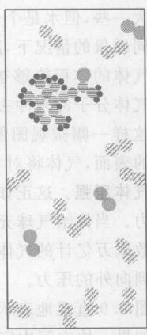

*图 2.6 空气中的紫罗兰香味。看上去古怪的东西是紫罗兰香味的分子，它由碳原子（水平条纹）、氢原子（小）和单个氧原子（大）构成。*

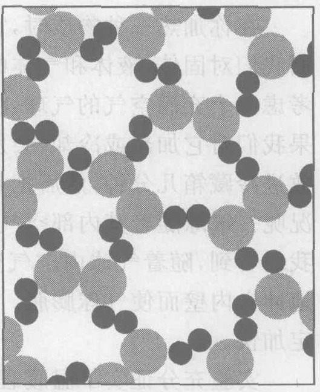

*图 2.7 冰。把这个固体的水图与图 2.2 液体水的图作一比较。在固态下，原子在晶格中的平均位置附近振动，不像液态下的水分子那样在材料中到处移动。*

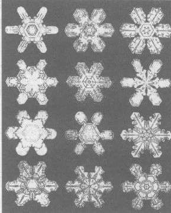

*图 2.8 在雪花中看到的六角对称性，反映了其基本晶体结构的六角对称性（与图 2.7 比较）。*

⑥ 虽然这三种是地球上物质的标准状态，但在宇宙的绝大部分常看到许许多其他的物态。物质的这些“异常”状态包括等离子体（带电气体，在恒星中常见）、三种超密物质（在白矮星、中子星和黑洞中发现的，见第 5 章）和物质显示大尺寸“量子”行为的超冷态（超流体、超导体和玻色-爱因斯坦凝聚态）。
⑦ 但是某些固体材料，包括塑料和玻璃，在微观层次上是无规布局。

气体的体积能够被大大压缩，所以它们的分子一定相隔很远。气体分子冲来冲去，从容器壁反跳开，或者彼此碰撞和回弹。根据这样一幅微观图像，我们可以预料，由于气体分子连续冲击周围的表面，气体将对它的容器有向外的压力。这个向外的压力叫做**气体压强**。这正如把成百个垒球投向一面墙，墙将受到向后的压力。当你给气球充气时，你就会看到气体压强的作用。每秒钟有数以万亿计的气体分子打在气球内表面上，使气球的弹性材料受到向外的压力。

图 2.9 直观地表示出了固体、液体和气体的差别。

如果一块空间中完全没有空气和其他形式的物质，就称为**真空**。地球上任何一团通常的宏观体积内都不可能达到理想的真空，但得到部分真空并不难。部分真空状态下容器内的空气比充满正常密度的空气时要少得多。在实验室的良好的真空下，每立方厘米内仍有上万亿个分子！但在外层空间，星系之间的广阔区域则近似于理想真空——分子间的间隔约有 2 米！

在你加热一种物质时，它的分子会发生什么情况呢？有了上面我们对固体、液体和气体的了解，就可以回答这个问题了。考虑一个充满空气的气球，将其端口扎紧从而不让空气进出。如果我们对它加热或冷却，会发生什么情况？试试看！先把气球放进冷藏箱几分钟，然后把它放在沸腾的水的上方。发生什么情况呢？气球随着其内部空气变暖而膨胀。回到气体的微观图像，我们看到，随着气球内空气变暖，气球内的空气分子一定更猛烈地冲击内壁而使气球膨胀。这意味着当空气变暖时，分子运动一定加快。

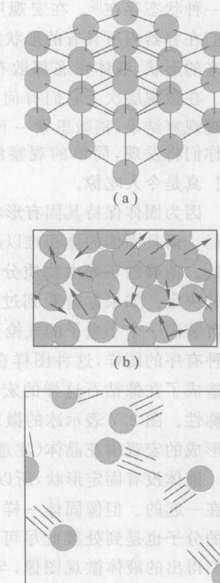

*图 2.9 从微观角度看物质三态：(a) 固态，(b) 液态，(c) 气态。*

实验充分证实了温暖程度与分子运动之间的关系。不仅气体（如空气）是这样，液体和固体也是这样。这就是说，无论是固体、液体还是气体，分子永远在做无规的（或紊乱的）运动，而且随着固体、液体或气体变得更暖，这些无规运动逐步加快。**温度**程度，可以用叫作做温度计的器件进行定量测量。把一个简单的家用温度计放在固体、液体或气体中，温度计内的液体以一种可以测量的方式改变其体积，反映温度的程度。所得读数叫做相应固体、液体或气体的**温度**。

温暖程度与分子运动之间的这种联系如此之密切，以至于科学家认为，温暖程度（或温度）与分子运动分别是同一现象的宏观和微观方面。由于这种联系，这种分子运动就叫做**热运动**。我们把这一概念总结为：

> **温暖程度的微观解释**
> 在微观层次上，温暖程度（温度）是物质分子的无规的或紊乱的运动。这个运动在宏观上不能直接观察，观察到的是温度或温暖程度。

原子论把紫罗兰香气、物质三态、化合物、气体压强、温度以及更多的东西统一了起来。这是一个令人满意的理论。

> **概念检查 7** 下列观察事实哪一个证实我们周围都是空气？(a) 树在风中被吹弯；(b) 我们能观察到光；(c) 当你呼吸时你能感觉到空气进入你的鼻子；(d) 拂面的微风；(e) 充满空气的气球；(f) 当你放开手中的石头时它会落下。

## 2.4 公制长度和 10 的乘方

在定量讨论原子（第 2.5 节）之前，我们需要对公制单位和 10 的乘方作一简短的浏览。

当我们测量像桌子的长度或岩石的重量之类的量时，这个测量是相对于一个特定标准或者说单位作出的。例如，你可以按英寸、英尺或英里测量长度，或者按公制以厘米、米或千米测量长度。如果你要告诉某人到一个城镇的距离，你不能说“53”。你必须说明单位，例如 53 千米或 53 英里。

美国生活中的一个难以理解的特点就是使用基于英尺、磅之类的英式度量衡制。因为没有别的国家，甚至包括英国，还在使用这种度量衡制，今后我将称其为美式单位制。为这种古怪的单位制付出的代价很高：1999 年美国 NASA（国家航空航天局）发射了一个火星气候空间探测器（Mars Climate Orbiter space probe），在导航中一个工程小组用美制单位，而另一组认为这些数据是公制的，这就出了问题。这个价值 1.25 亿美元的宇宙飞船在接近火星时飞行路线出现偏差，与地球失去联系而坠毁。太糟糕了！关于美国应该改用公制单位的更好理由见下面的概念检查 10 和引语中引用安托万的话。

现在你们可能猜到了，我将在本书中坚持用公制单位。基本的公制长度单位是**米**（单位符号为 m）。* 1 米约为 39 英寸，一码多一点。表 2.1 列出其他公制长度单位以及它们与米的关系。最重要的是**千米** (km)、**厘米** (cm) 和**毫米** (mm)。表 2.2 列出四种常用词头，它们可附加到任何公制单位上，它们是**兆** (M)、**千** (k)、**毫** (m)、**微** ($\mu$)。例如，千瓦为 1 000 瓦，兆瓦为 1 百万瓦（以后将看到什么是 1 瓦）。

> 如果改用公制，给美国工业带来的好处可归结为两个字：生存。海外一些国家已经拒绝某些美国英制标准的产品报关单。如果我们不觉醒，不开始按欧共体产品标准生产商品的话，我们的工业在欧共体将失去 3.2 亿人的市场……美国工业要想生存下去，就必须改用公制。
> ——V. Antoine, 美国度量标准协会执行理事

* 与我国市制单位的关系是，1米=3尺。——译者注

为了处理大数和小数，10 的乘方是一种有用的方法。$10^2$ 的意思是 $10 \times 10$，它等于 100，而 $10^5$ 意思则是 $10 \times 10 \times 10 \times 10 \times 10 = 100\ 000$。例如，太阳系直径（一边到另一边的距离）是 12 000 000 000 000 m。你们可以把这个数写成 $1.2 \times 10\ 000\ 000\ 000\ 000$ m 或 $1.2 \times 10^{13}$ m。每用 10 乘一次，就把小数点的向右移一位，因此 $1.2 \times 10^{13}$ 表明从 1.2 开始，将小数点向右移 13 位。前面的数字（这里为 1.2）通常写成 1 到 10 之间的一个数。如果前面没有数字，你可以认为前面的数字是 1，例如 $10^5$ 与 $1 \times 10^5$ 是一样的。

**表 2.1 距离的公制单位**

| 单位名称 | 进位 | 与市制的转换 |
| :--- | :--- | :--- |
| 千米 (km) | $10^3$ m | 1 km = 2 里 |
| 米 (m) | | 1 m = 3 尺 |
| 厘米 (cm) | $10^{-2}$ m | |
| 毫米 (mm) | $10^{-3}$ m | |
| 微米 ($\mu$m) | $10^{-6}$ m | |
| 纳米 (nm) | $10^{-9}$ m | |

**表 2.2 公制的词头**

| | | |
| :--- | :--- | :--- |
| 兆 (M) | 100 万 | $10^6$ |
| 千 (k) | 1 000 | $10^3$ |
| 毫 (m) | 1/1 000 | $10^{-3}$ |
| 微 ($\mu$) | 100 万分之一 | $10^{-6}$ |

负的幂次用于表示小的数字。例如，$10^{-2}$ 表示 $1/10^2$，它等于 1/100 或 0.01，而 $10^{-5}$ 表示 $1/10^5$ 或 0.000 01。负号表示 10 的这个乘方分之一。例如，原子直径为 0.000 000 000 11 m，它可写成 $1.1 \times 10^{-10}$ m。因为每用 10 除一次，小数点就向左移一位，所以 $1.1 \times 10^{-10}$ 就是从 1.1 开始把小数点向左移 10 位。

千 ($10^3$)、兆或百万 ($10^6$)、十亿 ($10^9$) 和万亿 ($10^{12}$) 表示 10 的不同乘方。类似地，毫或千分之一 ($10^{-3}$)、微或百万分之一 ($10^{-6}$)，等等则表示 10 的负幂次乘方。

两个 10 的乘方相乘，只需把它们的幂次相加。例如，$10^2 \times 10^5 = 10^{2+5} = 10^7$，而 $10^2 \times 10^{-5} = 10^{2+(-5)} = 10^{-3}$。10 的乘方前面的数字应先归拢再相乘，例如
$$ (1.5 \times 10^2) \times (3 \times 10^5) = (1.5 \times 3) \times (10^2 \times 10^5) = 4.5 \times 10^7 $$

两个 10 的乘方相除，只需以分子的幂次减去分母的幂次。例如，$10^2 / 10^5 = 10^{2-5} = 10^{-3}$，以及 $10^2 / 10^{-5} = 10^{2-(-5)} = 10^7$。10 的乘方前面的数字先归拢再相除，例如
$$ (1.5 \times 10^2) / (3 \times 10^5) = (1.5 / 3) \times (10^2 / 10^5) = 0.5 \times 10^{-3} = 5 \times 10^{-4} $$

用 10 的乘方可以对各种各样令人惊异的东西进行计算。例如，太阳系的直径除以原子的直径（两个直径的比值）是
$$ 1.2 \times 10^{13}\ \text{m} / 1.1 \times 10^{-10}\ \text{m} = (1.2 / 1.1) \times (10^{13} / 10^{-10}) = 1.1 \times 10^{13-(-10)} = 1.1 \times 10^{23} $$
这个数字，110 000 000 000 000 000 000 000，就是把原子一个接一个地排成一行，使之横跨太阳系所需的原子数目。这个数字大得惊人，是吧？

> **概念检查 8** 宇宙年龄可以用秒计算，事实上是 100 亿亿秒。用 10 的乘方表示，这是 (a) $10^{14}$ 秒；(b) $10^{15}$ 秒；(c) $10^{16}$ 秒；(d) $10^{17}$ 秒；(e) $10^{18}$ 秒。

> **概念检查 9** 原子核的直径大约是百亿分之一米。用 10 的乘方表示，这是 (a) $10^{-10}$ 米；(b) $10^{-12}$ 米；(c) $10^{-14}$ 米；(d) $10^{-15}$ 米；(e) $10^{-16}$ 米；(f) $10^{-18}$ 米。

> **概念检查 10** 不用计算器回答下面两个问题中的任何一个。对愿意用美制单位的人，6 英里合多少英寸？对愿意用公制单位的人，6 千米合多少厘米？答案（美制）(a) 463 173 英寸；(b) 380 160 英寸；(c) 263 150 英寸。答案（公制）(a) 600 000 厘米；(b) 600 000 厘米；(c) 60 000 厘米。

你是选择用美制单位回答概念检查 10 的问题吗？我把我的观点表示清楚了吗？

## 2.5 原子的不可思议之小

关于原子最令人信服的证据，莫过于看到一个原子了。然而，靠普通的光很难看到原子，哪怕用最好的光学显微镜。原因在于光的本性。光是一种波，在某些方面与池塘表面的水波相似。光的波长（两个相邻波峰间的距离）很短，只有可见的最小尘埃粒子尺寸的 1/10 到 1/100。这已经很小了，可是一个原子的尺寸还要更小，小到只有光的波长的 1/5 000。为了直观想象这一点，设想光的波长为 5 米，在这个比例尺上，原子不过是一个 1 毫米大小的斑点。因此光波太大，不能对微小的单个原子有反应。

**我们怎么知道原子存在？** 1970 年，布朗运动可能是离看见原子最近的手段了。1970 年，科学家发展出一种更直接的手段：扫描电子显微镜。它把一束稳定的微小实物粒子（叫做电子）流射到被检测的物体上。电视机就是把电子束喷到屏幕的内侧生成画面。电子束与光束有根本的不同，因为电子是实物——有重量的材料，而光却不是实物。在 20 世纪 20 年代，物理学家发现每个实物粒子，比如电子，都有一个波与之相对应，这个波叫做**物质波**。物质波用来检测单个原子特别好，因为它们的波长只有光波波长的几千分之一。当电子显微镜的电子束扫过单个原子时，电子束的物质波受到扰动。受扰动的物质波由仪器检测，该仪器收集并记录电子产生的图样。结果就是图 2.10 所示的图像。

一种叫做扫描隧道显微镜的更精密的仪器，出现于 1983 年。它使用形如笔尖、只有几个原子宽的微小探针从上方靠近样品表面对之进行扫描。电子在一个叫做“隧道穿透”的独特量子过程中跨越探针与表面之间的狭窄缝隙运动，以感知表面的显微结构。因为探针尖能够拾取单个原子，并把它们从一个地方拖到另一个地方，扫描隧道显微镜能实现 2 500 年前德谟克利特只能想象的思想实验。1990 年，科学家拾取了 35 个单个的氙原子并将它们重新排列，拼写出他们实验室的名称（图 2.11）。⑧他们已经把氙气分割成它的单个原子，就像德谟克利特曾想象过的那样。

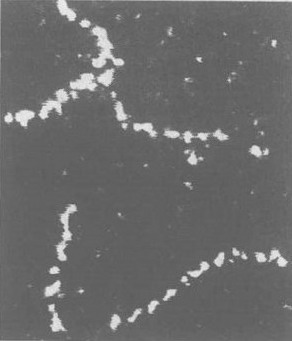

*图 2.10 扫描电子显微镜检测到的钍原子链*

虽然原子属于所有物体中最小的东西之列（图 2.12），但是位于原子中心的**原子核**（见第 2.7 节）更小，其大小大约只有原子的 1/100 000。现在知道，同样是在原子内部发现的电子小于迄今测量过的最小长度，其大小只有原子核的 1/100 000 甚至更小。事实上可认为电子的大小是零，因此电子不出现在图 2.12 中。在大尺度的另一端，星系属于已知的最大物体之列。星系团更大，它们构成由星系组成的“薄块”，单个星系团的延展范围可达已知宇宙的 1%。迄今检测到的最大的结构是创造宇宙的大爆炸的微弱余晖中的波纹，其延展范围达到已知宇宙的 2/3。

⑧ 氙原子不易与其他原子结合，从而使它们易于操作。

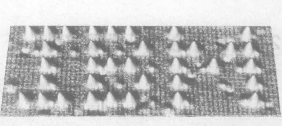

*图 2.11 用扫描隧道显微镜的探针操控实现了 35 个单个氙原子的定位。图中原子之间的距离约为 $10^{-9}$ m ～ 10 亿分之一米，或单个原子宽度的 10 倍。*

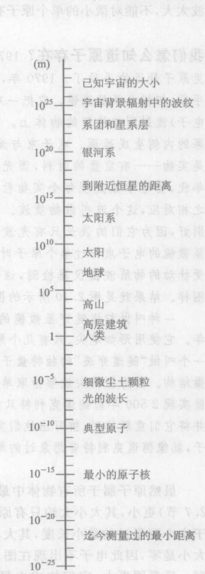

*图 2.12 宇宙中的大小尺度范围。*
*(图注：这是一个标尺图，从微观到宏观。左侧标注尺度（米），右侧标注对应物体)*
* $10^{25}$ m: 已知宇宙的大小*
* ... 宇宙背景辐射中的波纹*
* ... 系团和星系层*
* $10^{20}$ m: 银河系*
* ... 到邻近恒星的距离*
* $10^{15}$ m: 太阳系*
* ... 太阳*
* $10^{10}$ m: 地球*
* $10^5$ m: 高山*
* 1 m: 人类*
* $10^{-5}$ m: 细微尘土颗粒, 光的波长*
* $10^{-10}$ m: 典型原子*
* $10^{-15}$ m: 最小的原子核*
* $10^{-20}$ m: 迄今测量过的最小距离*

人类大致位于大小尺度的中间，在原子与恒星之间某处（图 2.12）。

原子和分子都极小。如果把 100 万个原子一个接一个地排起来，这个队伍的长度不会比这个句子结尾处的句号更长。大头针针头中有 $10^{18}$ 个以上的原子。呼吸一口空气，大约有一升 ($1\ 000\ \text{cm}^3$)，包含 $10^{22}$ 个以上分子。

$10^{22}$ 刚好差不多是地球大气层中空气的总升数，这就得出了一个有趣的结论。任何一份特定的空气，比如你下次呼吸时呼出的那升空气，在此后几年内将会与整个地球的大气混合。这意味着，你几年前一次呼出的空气，现在在地球大气和地球上每个人肺里，每一升空气里就有一点。那次呼出的空气中的一个分子。于是，地球上每个人任一次呼吸呼出的一个分子，现在就在你的肺里。乔治·华盛顿出生后第一次呼出的气，他临终时呼出的气，以及他每次呼吸呼出过的空气中的一个分子，同样，还有其他曾生活在世界上的人每次呼出的分子，现在就在你的肺里。你是一座走动的历史博物馆。

原子是永存的。从 50 亿年前地球形成时起，地球上的原子一直存在着，只有很少的原子在这段时间内发生了变化⑨。发生变化的只是原子间的联系。一个特定的氧原子今天可以是你的脑神经细胞的一部分，一百年后可以是大气中某个水分子的一部分，再过一百年也可以是一棵树的一部分。“你的”原子，即你现在身体内的原子，只不过是从空气中、从地球上借来的，迟早还要还回去，当你去世时，就全部还回去了。

> **作出估计** 在你呼出的分子中，你们班的老师下次呼吸时将大致吸入多少？

这个问题听起来很难。但是做一个粗略的估计却惊人地容易。在对很大的数目进行估计时，估计到最接近的 10 的乘方通常就足够好了，即答案是更接近 10，还是 $10^2$，还是 $10^3$，等等。这样的估计叫做“数量级估计”。在本书中，我们将对各种事物做这样的估计，而不期望得到单一的准确答案。虽然这种估计会因人而异，但所有这些估计应该相当接近。

⑨ 只有那些涉及放射性衰变、核裂变或核聚变的比较少的原子变成了不同种类的原子。

假定你每分钟呼吸 12 次（测一下！）。把每分钟 12 次呼吸乘以每小时 60 分钟，然后乘以每天 24 小时，即每年 365 天，就得到你每年的呼吸次数。因为我们不过做粗略估计，所以不妨调整这些数，使它们便于相乘。于是，把它们写作 $10 \times 60 \times 25 \times 400 = 6 \times 10^6$，即每年呼气 $6 \times 10^6$ 次。如果你是 20 岁，你已经呼吸 $20 \times 6 \times 10^6$ 次或大约 1 亿次。

那么你的老师在一次呼吸中将吸入多少个这些呼出的分子呢？像上面讨论过的那样，他或她将从你每次呼吸中吸入大约 1 个分子，因此答案是 1 亿个！而且在他或她的这同一次呼吸中，也将从现在地球上活着的每个人以及每个曾在地球上活过的人的呼气中吸入大约 1 亿个分子。而且，所有这些不过是你老的师在这次呼吸中吸入的分子总数的一小部分。这是因为你呼吸一次时得考虑的一些东西。

> **作出估计** 一张纸大约厚多少毫米？（提示：一包 500 张打字纸大致有多厚？）⑩

> **作出估计** 国债的高度 美国国债大约是 80 万亿美元。如果你用新的面值 100 美元的钞票叠放出这个数额，大约叠放几千米高？（提示：假定它们就像打字纸那样叠放，参照前一题。）⑪

> 你喝一杯水，大概至少会摄入一个曾通过亚里士多德的膀胱的原子。这是一个匪夷所思的结果，但由下述简单的观察就可以推出，即一杯水中的分子数比海水的杯数要多得多。
> ——R. Dawkins, 动物学家，牛津大学

## 2.6 原子唯物论：原子和虚空

从 1550 年到 1700 年，哥白尼和其他人的革命性思想广泛流传，受过教育的人不再把地球看成是宇宙的中心。人类只不过是众多的行星中一个行星上的乘客，是比较荒凉的宇宙中的居民（图 2.13）。这种新观点激发了高涨的科学思潮，其最高成就就是牛顿物理学——由牛顿 (1642—1727) 和其他人开拓和发展的关于运动、力和引力的卓著成效的理论。在 18 世纪到 19 世纪这一历史阶段，它的文化影响远远超出科学，影响着人们对他们自身、他们的社会以及他们在宇宙中的地位的想法。今天，牛顿的世界观继续主导着我们的文化。

牛顿在回顾其学生生涯时曾说道：“如果说我比别人看得远些，那是因为我站在巨人的肩上。”

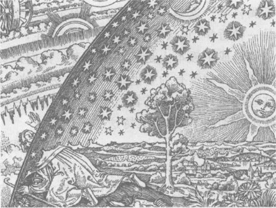

*图 2.13 当中世纪的信仰让位给哥白尼和牛顿的新科学时，暖和舒适的牛顿之前的宇宙，就被浩瀚无际的非人格化的机械论宇宙所取代。这幅木刻创作于 19 世纪，在这一转变发生之后很久。*

⑩ 500 张一包的打字纸大约厚 4～6 cm，就算 5 cm。所以每张纸的厚度大约是 5/500 cm = 0.01 cm = 0.1 mm。
⑪ 所需百元钞票的张数为 $8 \times 10^{12} / 100 = 8 \times 10^{10}$。我们已经看到一张钞票的厚度是 0.01 cm = $10^{-2}$ m = $10^{-4}$ m。这叠钞票的高度为 $8 \times 10^{10} \times 10^{-4}$ m = $8 \times 10^6$ m = 8 000 km，它大于横贯美国的距离。若用 1 元钞票叠起来，结果将是 800 000 km，两倍于到月亮的距离！

笛卡儿 (1596—1650) 和伽利略 (1564—1642) 这两个巨人，帮助建立了牛顿物理学的哲学基础。今天我们认为，笛卡儿、伽利略和牛顿是科学的主要奠基人。

虽然在牛顿的时代只有很少的支持原子论的证据，但是原子概念是牛顿物理学很多内容的基础。它是一个十分深刻的概念，也是一个哲学概念。德谟克利特曾写道：
“甜是从俗约定的，苦是从俗约定的，热是从俗约定的，冷是从俗约定的，颜色是从俗约定的。实际上，只有原子和虚空。这就是说，人们假定感觉的对象是真实的，习惯上也认为它们是真实的，但实际上并非如此。只有原子和虚空才是真实的。”

> 于是，独立存在的全部自然是由两种东西构成的：一是物体，二是物体存在于其间、运动于其间的虚空。
> ——卢克莱修，罗马诗人，大约公元前 50 年

这比原子论走得更远。德谟克利特是在说，不仅是物质，所有东西都是由原子构成的，进而说，原子就是存在的一切。因此，当你说“这水是热的”或“这件衬衣是红的”时，你实际的意思是指水和衬衣中的原子在以某种方式运动。实际并不存在诸如热和红之类的东西——存在的只有原子。当你说“这张画很美”时，实际上你指的只是这张画的原子使你脑中的原子按某一种方式运动，这种方式最终使你的声带说出“这张画很美”这句话。这一切都是纯机械的，德谟克利特说道。

按照笛卡儿的看法，感性知觉仅仅是“派生的属性”，这些属性仅仅存在于我们的心灵中。在宇宙，即我们心灵之外的宇宙，只包含原子和它们的物理属性，如重量和大小。笛卡儿称这些为“本源的属性”。笛卡儿认为，科学的任务是对本源领域的研究，并用原子解释它。

关于什么是实在、什么不那么实在的这些观点，已经超出了能够观察和证明的范围，因此它不属科学。这是一种哲学观点而不是科学观点。这些观点都是**唯物主义**的一种版本。唯物主义是一种哲学，它认为物质是唯一的实在，一切事物都由它的机械运动确定。这并不是说笛卡儿、伽利略或牛顿本人是唯物主义者。他们都赞同非唯物主义的宗教思想，例如信仰上帝。然而，新的科学哲学没有为中世纪的上帝，为这位一直密切地卷入世界事务的上帝留有什么空间。相反，这些现代科学的奠基者们相信的是这样一位上帝，他创造了宇宙，同时建立了物理学定律，然后就不管别的了，只管维持这些定律。

考虑到这一切之后，在我看来，上帝开始造物时，很可能先造结实、沉重、坚硬、不可入而易于运动的粒子，其大小、形状和其他一些性质以及空间上的比例都恰好有助于达到他创造他们的目的。
——牛顿，1704 年

牛顿物理学是一个非凡的成就，它在解释无数观察到的现象时显得惊人地有效。那么它的唯物主义哲学基础是否必然正确？原子就是存在的的一切，这是真的吗？

关于哲学的一点令人放心的是，每个好的哲学观念，也会有好的论据来反驳。物理学家尼尔斯·玻尔是这样表述这一点的：“一个深刻观念的标志，就是它的反命题也是深刻的。”原子唯物主义就是这种情况。对立面的值得重视的论据包括以下这些：

(1) 科学总是从证据出发的，而证据最终来自感性知觉。唯物主义坚持原子是本源的，而感性知觉只是派生的，这是本末倒置。理论概念是由感觉证据派生出来的，而不是相反。

(2) 虽然唯物主义植根于科学，但是科学不过是观察实在的一种方式。其他的观点，如宗教的、美学的、直觉的，都有同样的权利要求被承认为“实在”。科学家这个群体本身就涵盖了从虔诚的和传统的到无神论的各种各样的宗教观点。

(3) 一切科学观念都只是尝试性的，包括原子唯物主义。例如，我们并不能确凿知道万物真的都是由原子构成，因为我们并没有观察过每一种东西。

(4) 我们将在第 5 章看到，20 世纪以来科学家已经发现牛顿物理学只对有限范围内的现象是近似正确的。超出这个限定的范围，它甚至连近似正确都达不到。例如，我们将看到（第 9 章）某些东西（如光）是非实物的，而且不是由原子构成，还将看到（第 10 章和第 18 章）物质自身由非实物的“力场”构成。虽然牛顿物理学与唯物主义彼此投合，但新近的理论则对唯物主义较为冷淡，甚或与之相悖。

> 卢克莱修是真正的罗马英雄诗人；他的英雄是原子，不能推毁的、不可入的、武装得很好的、此外别无其他特性的原子；一场一切人反对一切人的战争，这是永恒的物质的顽固的表现形式；一个没有神的大自然，一群没有活动领域的神。
> ——卡尔·马克思

## 2.7 三种原子模型：古希腊模型、行星系模型和量子模型

在观察与理论之间不断往返的科学之路，是取得成功的保证。如果一个观察结果与一个理论相符，那对这个理论来说是好事。如果观察结果与理论不服，那对这个理论来说就太糟糕了，然而对科学而言这还是好事，因为科学正是通过修正或取代已证明是错误的理论得到更大的进步的。

物质原子论就是一个好例子。科学家关于原子本性的观念已经历了几次变化。在原来的**古希腊原子模型**中，原子是一种不可变的、与小而硬的豌豆相似的单个物体。古希腊的原子也是牛顿看待原子的方式，19 世纪发现的元素、化合物和布朗运动，是对它的支持。

1900 年前后，与光（第 8 章）有关的实验表明，“原子”（按当时的理解）比它的希腊模型要复杂。对电的研究贯穿了整个 19 世纪，但是直到 1897 年科学家发现了一种重量很轻的新带电粒子，才有人想到需要一个全新的原子模型以解释这些实验。这是第一次发现重量比原子还轻的粒子。显然，它是所谓原子（记住，该词本意为不可分的）的一部分。这种粒子是电子。几年后的 1911 年，物理学家发现原子本身是几乎全空的空间，一个原子的几乎全部物质都集中在极微小的中央核心内，这个核心即**原子核**。实验表明，每个原子还包含有在原子核外广阔而全空的区域内运动的电子。科学家发展了一个理论：电子在环绕原子核的轨道上运行，很像行星在环绕太阳的轨道上运行一样。后来，科学家又得知原子核本身由两种亚核粒子构成，它们是质子和中子。图 2.14 根据这种原子的**行星系模型**画出了元素氦的一个原子和元素碳的一个原子。

到了 20 世纪 20 年代，和电子有关的新实验与行星系模型发生了矛盾，而且甚至与牛顿物理学本身相矛盾。为了解释新结果，需要一个所谓“量子理论”的全新的物质理论（第 13、第 14 章）。迄今为止，还没有发现实验与新的原子的**量子理论**之间有什么不符之处。

这样，我们对原子的认识就经历了至少三种不同的理论。在每个阶段，新的实验否定了旧的理论，接着科学家就创立一个更广泛的理论，它既能解释旧的也能解释新的观察结果。但是，科学家并不抛弃古希腊模型和行星系模型，尽管它们有缺陷，这是因为这些模型在它们各自适当的范围内还是有用的。例如，我们能用古希腊的原子模型说明像空气压强等很多通常的观察结果。我们无需用原子的行星系模型或原子的量子理论说明这些现象，因为原子的内部结构及其量子属性与这些现象无关。若局限在适当的范围内，古希腊的原子模型就是一个好的理论。我们再一次看到，一个理论最好是说有没有用而不是说正确不正确。

> **概念检查 11** 原子的量子理论迄今与所有实验一致。(a) 于是它现在可以叫做一个被认可的事实，而不仅仅是一个理论；(b) 于是它现在可以叫做一个科学假说；(c) 于是现在可以认为它是肯定正确的，尽管我们仍把它叫做“理论”；(d) 不过它仍然只是一个理论，从而它基本上不过是一种猜测；(e) 于是它是被适当当地叫做科学理论，尽管像所有理论那样，它多少有点是尝试性的；(f) 不过它仍可能被将来的实验证明不成立。

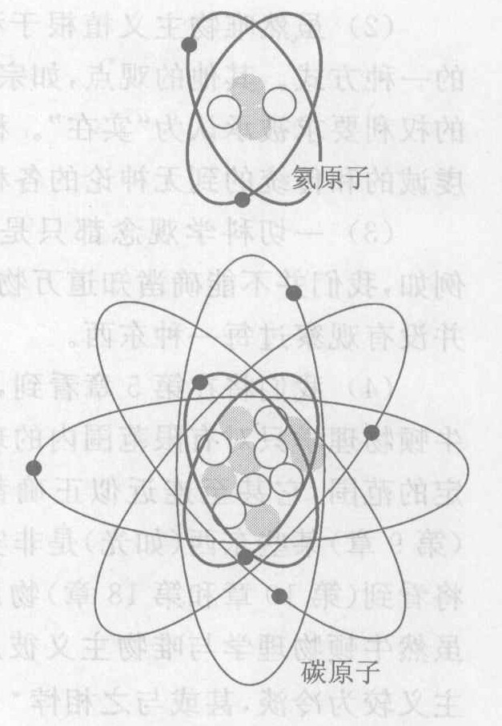

*图 2.14 根据原子的行星系模型画的氦原子和碳原子。小黑点是围绕原子核的轨道上的电子，灰色小圆和白色小圆代表原子核内的质子和中子。此图不成比例！原子核的大小应当只有电子轨道大小的 1/100 000，而且电子可能根本没有大小。*

## 2.8 化学与生命：原子曾为你做过些什么

要把原子以足够精巧的方式连接起来，你可以让它们做意想不到的事情。例如，一堆原子可以从它所处的环境中获取另外的原子，可以把自己从一处移到另一处，可以对外（如特定分子的出现）作出反应，可以生成自身的副本。我们将把这样一堆原子叫做活的。实际上，你正是这样一堆原子。这堆原子，也就是你，具有一种特别令人惊奇的属性：它能认识自身，而且在这个科学时代，它甚至能知道它是一堆原子。这是值得一思的事情。

给生命以强大活力的元素是碳。地球上碳很丰富，而且容易与多种别的丰富的元素结合。在生物分子中，含量丰富的其他元素是氢、氧和氮（记住“C HON”这个名字）。

任何使分子重新排列变成新分子的过程叫做**化学反应**。作为例子，我们来看一看对每个人的生命都很重要的三种化学反应：燃烧、呼吸作用和光合作用。

人们曾经相信火是构成万物的基元物质之一，一个燃烧的物体释放出它原有的火。流行的理论认为火这种摸不到、非实体的物质具有重量，而且任何物体燃烧时释放的火将带走它的重量。1780 年前后，拉瓦锡对燃烧进行了更仔细的研究。他精确地测量了一个物体燃烧时流掉的一切物质的重量，包括掉的气体与释放的气体的重量。虽然流行的理论预言重量应减少，但是拉瓦锡发现重量没有变化。这证明流行的理论不成立，而且开创了近代的**化学**科学，即对物质（化合物）的性质与变化的研究。

这门新科学的关键在于化学反应是自身不变和不可毁灭的原子的重新排列这一原理。由此可知，任何化学反应中涉及的物质总量在反应前后相等，这个概念叫做**物质守恒**（不灭）。它是一个有用的理论，在化学反应中近似正确，但实验证明在别的情况下，它完全错了*。

大多数可燃物质是从含碳、氢以及其他元素的生物材料中得到的。把一个广口瓶倒扣在燃烧着的蜡烛上，可以表明燃烧需要空气。空气不是一种纯物质，而是许多不同物质的混合物。氮和氧是主要成分：接近 80% 的空气分子是氮 ($N_2$)，大约 20% 是氧 ($O_2$)，还有 1% 是单个的氩原子 ($Ar$)。所有其他气体加起来总共不到 1%。这些“痕量气体”包含各种化合。其中一些如水蒸气 ($H_2O$) 和氦 ($He$) 是天然的，其他的如二氧化碳 ($CO_2$) 和臭氧 ($O_3$) 既有天然的也有来自工业的，还有别的如一氧化碳 ($CO$) 几乎全来自工业。

对**燃烧**来说，需要从空气中得到的最重要的成分是氧。燃烧物质中的碳与来自空气的氧结合生成二氧化碳。我们用符号把这句话简写成
$$ C + O_2 \rightarrow CO_2 $$
加号的意思是与之结合，箭头的意思是变成。如果燃料中含有氢，它也会与氧结合生成水蒸气。例如，甲烷 ($CH_4$) 是简单的碳氢化合物燃料。它是天然气的主要成分。它在空气中燃烧生成二氧化碳和水蒸气⑫：
$$ CH_4 + O_2 \rightarrow CO_2 + H_2O $$

任何化学反应的一个重要特征是其能量平衡。我们暂且用能量这个重要的词来表示下述两者之一，使物体运动的能力和热或“热能”（我将这样叫它）。热能与温暖程度（见第 7 章）有关，但又不是同一个东西。正如你知道的，暖热——也许来自摩擦或点燃的火柴——是让物质开始燃烧所必需的。燃烧一旦开始，燃烧反应自身就产生出维持燃烧过程所需更多的热，多余的热就被释放出来。把热能包括在内，像甲烷这种典型的燃料燃烧时的反应式为
$$ CH_4 + O_2 \rightarrow CO_2 + H_2O + \text{多余的热能} $$

我们现在转向生物学。动物从它们吃的食物和呼吸的空气中摄取构成其身体的材料和它们的能量。你的血液从食物中吸收以碳为基本成分的分子，从空气中吸收氧，并把它们输送到你身体的所有部分。当它们到达你的拇指时，它们就进入那里的生物细胞。在**呼吸作用**中，细胞用这些物质产生出生物学上有用的能量。一个典型例子是，叫做葡萄糖的单糖与氧反应生成二氧化碳和水：
$$ C_6H_{12}O_6 + O_2 \rightarrow CO_2 + H_2O + \text{有用的能量} $$

你可以看到，这个反应与燃烧类似。动物的生命是一场缓慢的燃烧（生物氧化）过程。在呼吸作用中，这种有用的能量的一部分转而生成一种叫做 ATP 的高能分子，而其余的能量则以热能形式出现。ATP（三磷酸腺苷）是动物体内的能量载体；它能储存起来，也能在细胞内到处运动。它能用来做各种事情，比如弯曲你的拇指。你从反应式中可以看到，呼吸作用产生水和二氧化碳，它们作为废物以汗、尿和呼出的气的形式排出体外。

* 作者在这里讲的是静止质量的不守恒。考虑到质能关系（第 11.4 节），在计入与辐射场能量对应的质量后总质量仍是守恒的。这是我国学术界通行的观点。——译者注
⑫ 燃烧是氧化的一种形式，它指的是任何产生热和光的化学反应。
⑬ 这个反应式在数量上并不平衡。例如，左端有 4 个氢原子，而右端只有 2 个。平衡的反应式是 $CH_4 + 2O_2 \rightarrow CO_2 + 2H_2O$。因为这里我们并不关心每种化合物有多少参与反应，所以略去了这些数值。

植物和动物有不同的能量策略。植物利用直接来自太阳的能量，而动物则通过食用储存了能量的植物和其他动物来摄取能量。植物从周围环境中收集二氧化碳和水，并把它们结合生成高能碳水化合物（碳与水的化合物），如葡萄糖。从呼吸作用的反应式，你可以看出，植物的上述过程与动物的呼吸作用恰恰相反！既然呼吸作用产生有用的能量，在植物中的相反的反应一定需要摄入能量。植物已经实现了一个从太阳获取所需能量的复杂过程。因为动物消耗氧，所以我们也预计植物一定产生氧。整个反应式是
$$ CO_2 + H_2O + \text{太阳能} \rightarrow C_6H_{12}O_6 + O_2 $$
这叫做**光合作用**（靠光使它们化合）。

动物对植物的依赖不仅仅是为了食物和燃料，还为了我们所呼吸的空气中的最重要的元素——氧。地球上差不多全部的氧都来自光合作用，而且直到大约 27 亿年前能进行光合作用的细菌出现之后，大气中的氧的数量才达到可供呼吸的程度。没有植物，动物很快就会没有食物，没有燃料，也不能呼吸，从而遭殃。

> **概念检查 12** 有些人提出，可以想象碳以外的另一种物质在宇宙的其他地方对形成生物起关键作用。下面哪一个是这种物质的最可能的选择？(a) 硅；(b) 氧；(c) 氯；(d) 氩；(e) 氖；(f) 花生酱。（提示：参照周期表。注意：科学家已经否定了这样一个不现实的设想。）

![漫画]
*漫画内容：两个人身着古代服装。一人对另一人说：“当然，土、水、火、气是元素。那么你拿铅怎么办呢？当然你不能忽略铅。”*

---

### 概念检查答案

1. [你在得出你自己的答案之前读这里的答案吗？如果是这样，你是靠看别人跑步来进行锻炼吗？给出你自己的概念检查答案来锻炼你的心智！] 在图基伯和德谟克利特的时代，这是一个假说，然而今天它是一个已经确立的科学理论，(d)。把这样一个一般概念叫做一件事实或一个观察结果是不对的。
2. 一个硫原子的重量与两个氧原子的重量相同，所以比值为 1 比 1, (c)。
3. 现在的比值是 1 比 1.5，它与 2 比 3 相同, (d)。
4. (a), (d) 和 (f)。
5. (b)。
6. (f)。
7. (a), (c), (d) 和 (e)。注意尽管在外层空间里没有空气，我们也能看到恒星发出的光（答案 f）。
8. $10^8 \times 10^{12} = 10^{18}$, (e)。
9. $10^{-2} \times 10^{-12} = 10^{-14}$, (c)。
10. (b)。
11. (e) 和 (f)。注意答案 (d) 是错的：一个假说是一个有道理的猜测，而一个理论则远不止此。
12. 硅 (a)，它在周期表中与碳在同一列。

### 关键概念

下述概念的定义出现在所标页码的本书正文页面上和书末的按拼音排序的术语词汇中。我们将它们按出现先后顺序排列在这里，你可以用这个清单复习本章内容。

*   物质（实物） 30
*   物质的原子论 31
*   布朗运动 32
*   化学分解 32
*   化学元素 33
*   原子 33
*   原子序数 33
*   周期表 33
*   化合物 33
*   分子 33
*   宏观 35
*   微观 35
*   固态 35
*   液态 35
*   气态 35
*   气体压强 36
*   真空 36
*   温度 36
*   热运动 37
*   温暖程度的微观解释 37
*   单位 37
*   米 (m) 37
*   千米 (km) 37
*   厘米 (cm) 37
*   毫米 (mm) 37
*   兆 (M) 37
*   千 (k) 37
*   毫 (m) 37
*   微 ($\mu$) 37
*   10 的乘方 38
*   唯物主义 42
*   古希腊原子模型 43
*   电子 43
*   原子核 43
*   原子的行星系模型 43
*   原子的量子理论 44
*   化学反应 44
*   化学 45
*   物质守恒 45
*   空气 45
*   燃烧 45
*   呼吸作用 45
*   光合作用 46

每章后面都有复习题、思考题和习题（第 1、第 2 和第 11 三章无习题）。复习题重温许多基本内容，并可从本章中找到答案。思考题要求根据自己对教材的理解回答新的概念性（非数学的）问题，思考题有许多，让教师有选择的灵活性，你只要回答其中一部分就行了。习题不是概念性的，要用数学。奇数题号的思考题和习题的答案在书末。

### 复习题

**希腊原子模型**

1.  原子概念有什么宏观证据？
2.  原子概念有什么光学显微镜证据？
3.  古希腊原子论者想象做的是什么实验？他们相信结果会怎样？
4.  一个像古希腊人想象的那样的实验（见上题）最近已经实现，描述这个实验。
5.  原子和光波波长哪个更大？是大一点还是大很多？

**原子和分子**

6.  从微观观点看，元素与化合物有什么差别？
7.  从宏观观点看，元素与化合物有什么差别？
8.  原子与分子有什么不同？
9.  为什么把周期表排列成现在这个样子？
10. 如果你用化学方法分解水，你会得到像水一样的东西吗？你将得到什么？

**原子解释事物的能力**

11. 描述香料散发出香味使你在一段距离之外就能闻到的微观过程。
12. 固体、液体和气体在宏观上有什么不同？微观上呢？
13. 固体、液体和气体中，哪个最容易压缩？为什么？
14. 在地球上 1 $\text{cm}^3$ 大小的容积内，得到理想的真空了吗？别的地方呢？
15. 热水与冷水在微观上有什么差别？

**原子唯物主义和原子模型**

16. 说出几种人们通常认为是实在的，但按照原子唯物主义却并非实在的事物的名称。
17. 描述唯物主义哲学。
18. 给出支持唯物主义哲学的论据。
19. 给出反对唯物主义哲学的论据。
20. 说出三种不同的原子模型的名称，并描述其中的两个。

**化学与生命**

21. 化学反应指的是什么？
22. 说出三种不同的化学反应的名称。
23. 空气是单一物质（单一化合物）吗？描述其化学成分。
24. 描述一个支持物质守恒概念的包含燃烧的实验。
25. 在哪几种实验中物质守恒是很好的近似？
26. 描述以下反应：燃烧、呼吸作用和光合作用。

### 思考题

**希腊原子模型**

1.  原子论是绝对正确的吗？
2.  碳原子比氧原子大约轻 25%（它们的重量比是 3:4）。一氧化碳的组成中碳与氧的重量比是多少？二氧化碳呢？
3.  一个碳原子的重量是一个氢原子的 12 倍，甲烷 ($CH_4$) 分解后产生的碳和氢的重量比应当是多少？
4.  一个碳原子的重量是一个氢原子的 12 倍，一个氧原子的重量是一个氢原子的 16 倍。葡萄糖 ($C_6H_{12}O_6$) 分解后生成的元素的重量比是多少？

**原子和分子**

5.  $H_2SO_4$（硫酸）的一个分子中有多少个原子？
6.  酒精 $C_2H_5OH$ 的分子中有多少个原子？
7.  下列物质中哪些是纯化合物，哪些是元素，哪些二者都不是：氢、氧、二氧化碳、被污染的水、$C_6H_{12}O_6$、金、水蒸气？
8.  下列物质中哪些是纯化合物，哪些是元素，哪些二者都不是：纯净水、氧气、水银、$H_2SO_4$、U、空气？
9.  假定你得到了下列物质每一作为最小的单个粒子，哪些情况下这个粒子是由一个以上的原子构成的分子，哪些情况它只是单个独立的原子：纯水、地球大气层内的氧气、$H_2SO_4$、U、He、二氧化碳、$H_2$、H？
10. 氮是一种惰性气体，这意味着它不容易与其他物质发生化学反应。列出氮惰性也是惰性气体的五种其他物质。
11. 氯极易与单个氢原子结合生成 HCl。从周期表中找出至少三种别的元素，预料它们与氢结合的方式和氯相同。
12. 考察一个纯化合物 A，假设能用化学方法将它分解成两种别的纯物质 B 和 C，那么能说 B 和 C 一定是元素吗？能说 B 和 C 一定是化合物吗？能说 A 一定是化合物吗？
13. 甲烷（碳和 4 个氢）的化学式是什么？
14. 二氧化硫的化学式是什么？
15. 四氯化碳的化学式是什么？
16. 作一简化的假设：氧原子和碳原子的重量相同。那么，烧一吨煤（煤接近纯碳）会生成多少吨二氧化碳？
17. 参照上题。在一个典型的烧煤的大电厂里，每 10 秒烧 1 吨煤。这个发电厂每小时向大气排放多少吨二氧化碳？

**原子的解释能力**

18. 你为什么观察不到像飘浮的小纸片这样容易看到物体所作的布朗运动？
19. 紫罗兰香味的化学式是什么？（参见图 2.6）
20. 狗把鼻子触到地面追踪逃犯的踪迹。从微观角度解释这个现象。
21. 若把空气装入密封容器内，然后将容器压缩（减小体积），预计空气对器壁的压力会有什么变化？从微观角度说明。
22. 如果将空气放入密封容器内并加热，你预计空气对器壁的压力会有什么变化？从微观角度说明。
23. 如果一个气球部分充气（因而它没有完全膨胀起来），封住口，然后加热，你预料气球会怎样？从微观角度解释。如果这个气球不是加热而是冷却又会怎样？
24. 为什么从一个密封的真空广口瓶上取掉盖子是那么困难？
25. 假设在密封玻璃瓶内的静止空气中悬浮着微小的花粉颗粒，观察其布朗运动。如果增加空气的量会怎样？如果加热空气又会怎样？
26. 为什么随着向轮胎内增加空气，胎内空气压强会增加？为什么加热使轮胎内空气压强增加？
27. 提出一个表明空气有重量的实验。
28. 如果一定体积的空气内的分子除了无规运动之外，还有一个整体运动，比方说所有分子全部向东运动，这一整体运动能在宏观上观察到吗？我们管它叫什么？

**公制长度单位和 10 的乘方**

29. 把以下 10 的乘方写成普通形式的数字：$10^9$；$10^{-6}$；$3.6 \times 10^{13}$；$5.9 \times 10^{-8}$。
30. 把以下数字用 10 的乘方表示：3 万亿；五千分之一；730 000 000 000 000；0.000 000 000 000 082。
31. 地球到月亮的距离是 384 000 km。用 10 的乘方表示它，并用米和毫米作单位表示这一距离。
32. 我们的银河系可能包含 4 000 亿颗恒星。假设这些恒星中的 0.05%（即 0.0005）有行星系并包含至少一颗与地球相似的行星（设想能支持类似地球上的生命的行星）。用 10 的乘方表示这两个数字，然后把它们相乘以估计在本星系内有多少颗与地球相似的行星。用文字（千或百万等）表示这个数值。
33. 宇宙年龄是 100 亿亿秒。用普通记数法（不用 10 的乘方）写出这个数字。

**原子之小**

34. 按从轻到重的顺序排列下述物质：水分子、氧原子、雨滴、氢原子、葡萄糖分子、电子、DNA分子。
35. 按从轻到重的顺序排列下述物质：$H_2$ 分子、甲烷分子、尘埃粒子、血红蛋白分子、质子、葡萄糖分子。
36. 一个婴儿的原子的年龄是多少？它们比一个老人的原子更老吗？婴儿的 DNA 分子呢？
37. **作出估计**。一张纸大约厚 0.1 mm。一个原子直径大约是 $10^{-10}$ m。一张纸的厚度大约有多少个原子？
38. **作出估计**。你身体内每个原子的平均重量大约为 $10^{-26}$ kg。你体内大约有多少个原子？
39. **作出估计**。肉眼可见的最小尘埃粒子直径大约 0.05 mm。在这样的线度上大约有多少个原子？换句话说，如果把原子一个接一个排起来，排成 0.05 mm 长的一列需要多少个原子？
40. **作出估计**。参看上题。假设小尘埃粒子是立方体，它大约包含多少个原子？

**化学与生命**

41. 在空气中燃烧氢气的化学反应式是什么？这个反应生成什么物质？
42. 为安全起见，气球充气用的是氦而不是氢。说明大气中氦的行为是怎样的？
43. 汽油是一种碳氢化合物燃料。汽油在汽车发动机内燃烧生成的主要化合物是什么？
44. $NO_x$（一氧化氮和二氧化氮）是汽车产生的污染物，它是哪些元素结合生成的？
45. 参见上题。汽油既不含氧也不含氮，那么当 $NO_x$ 在汽车发动机内生成时，这些元素来自何处？
46. 你身体内没有什么分子，你可以声称是“你的”分子，即唯一属于你的身体的分子，与宇宙中的任何其他分子都不相同？