# 第二篇 牛顿式宇宙：一个像钟表一样运转的王国

---

# 第 3 章 物体怎样运动：伽利略的问题提得恰当

> 我不相信给了我们感觉、理性、和智能的上帝却又想让我们不要用它们。
> ——伽利略

环顾四周，看看这本书、一朵花、你的脚。它们是由什么构成的？在第 2 章我们看到，古希腊人的回答是，万物由原子构成。你注意到书掉到地上，花在摇晃，你的脚在轻轻地敲打地面。物体为什么运动？怎样运动？仍是古希腊人提出了这些问题（同一时期别的人如中国的自然学者也这样做过），这也是我们要在这一章和后面两章中讨论的问题。

古希腊哲学家和科学家亚里士多德（图 3.1）发展了最早的运动理论。他的理论直观上看似乎有道理，并有一些观察结果支持。但伽利略和牛顿等后来的科学家抛弃了亚里士多德物理学，而支持强有力的新观念，这些观念随后统治了科学界三个世纪。从 1900 年开始，随着相对论和量子论改变了大部分牛顿物理学，科学又一次改变了它的运动观。

第 3、第 4、第 5 三章讨论牛顿物理学。虽然我们现在知道这些概念在超出地球上日常生活遇到的情况时并不准确，但它对我们了解周围宏观世界的运作方式仍然有用，而且是我们每天依赖的许多技术的基础。或许更为重要的是，牛顿物理学的观点仍然保持着其强大的文化影响。

对亚里士多德物理学稍作介绍（第 3.1 节）后，本章将讨论伽利略关于运动本身的观念。第 3.2 节介绍伽利略对亚里士多德物理学的反对意见和牛顿物理学的基石——惯性定律的实验背景。第 3.3 节考察惯性定律。第 3.4 节和第 3.5 节探讨描写运动所需要的两个概念，即速率和加速度。第 3.6 节把所有这些应用到一个熟悉和基本的现象——物体的下落。再往后，第 4 章讨论运动变化的原因。第 5 章讨论这些原因中的一个：重力。

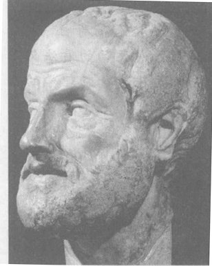

*图 3.1 古希腊哲学家和科学家亚里士多德，公元前 384—前 322 年。他最早提出关于运动的理论。他的理论倒是与我们通常的想法一致，不过后来被远没有它直观的牛顿理论所取代，到了 20 世纪，被更不直观的量子理论所取代。*

---

## 3.1 亚里士多德物理学：常识性的看法

亚里士多德物理学与大多数人的常识一致。但是，正是这些看似有理的观念被牛顿物理学所抛弃。由于亚里士多德物理学在我们的直觉中根深蒂固，我们最好看看它错在哪里。

亚里士多德注意到某些运动无需帮助即可维持，他把这种运动叫做**自然运动**。例如，推岀悬崖的一块石头，在没有明显帮助的情况下向地面落下，所以他认为固体的落下是自然运动的一种形式。按照他的观点，固体下落是因为它们试图尽量靠近它们的自然静止位置，即固体地球的中心。除了固体下落之外，亚里士多德还察觉到地球上的另外三种自然运动：泻下或沿坡流下的液体，上升的气体和向上跳动的火焰。

所有这些自然运动要么竖直向下，要么竖直向上。水平运动有所不同。当你沿着道路拉一辆小车，或水平抛出一块石头，或在地板上推一个箱子时，你的活动维持着运动；推和拉是维持小车、石头和箱子运动所必需的。亚里士多德认为，之所以需要推与拉，是因为物体必须受到强制才会背离其自身的自然运动。亚里士多德把所有这些强制的运动归类为“**强迫运动**”，意思是需要外界的推或拉来维持它。

> 看起来很奇怪，大多数人对运动的看法仍是亚里士多德物理学的一部分，而这个体系是在 2000 多年前提出的，并且至少在 1400 年前就在实验上被证明是对应的了。
> ——I.B.Cohen，科学史家

他认为地球上的运动不是自然的就是强迫的，但是他察觉到天上的——种完全不同的运动。他相信月亮、太阳、行星和恒星是由地球上找不到的叫做**以太**（来自希腊文，意为“使发光”）的一种物质构成。以太没有重量，不会腐朽（不变的，永恒的）。以太在一切方面都是完美的，它的自然位置是在天空，它环绕地球在完美的圆周上自然地运动。这种第三种运动叫做“**天体运动**”。

亚里士多德的理论解释了相当大范围内的观察结果。它得到广泛的认可，部分是由于这个理论似乎言之成理。在我们看来，岩石的确是自动下落，为了维持水平运动的确需要推，而天上的运动的确与地上的运动不同。然而我们将看到，牛顿物理学与所有这三个观念完全对立。

## 3.2 我们是怎么知道的？亚里士多德物理学的困难

亚里士多德物理学有它的不足之处。你可以自己证实其中的一些。扔一张纸到地上，然后把它揉成一团再扔。后者是否落得更快些？① 亚里士多德物理学难以解释这个结果。毕竟揉成一团的纸仍是同样的纸，因此它“追寻”地球中心的强烈程度应该与平整的纸相同，所以它不应该比平整的纸落得更快。

现在取两个物体，它们的形状相同而重量相差很大，例如大小差不多的一块石头和团成球状的报纸，让它们落下（图 3.2）。你发现什么？按照亚里士多德物理学，越重的物体应该越强烈地追寻地球中心，从而应该明显地落得更快。其实不然。

如果你从二楼窗口这样的高处仔细做这个实验，你会发现较重的物体的确落得快些，但并不像亚里士多德物理学预言的那样快。今天的理论预言，两个形状相同的物体中较轻的一个由于空气阻力而下落稍慢一些。**空气阻力**是物体通过空气运动时由于物体与大量空气分子碰撞而产生的对物体运动的阻力。根据今天的理论，空气阻力也是一张平整的纸下落缓慢的非亚里士多德的原因。

让两个物体在真空中或者是在抽去空气的容器内下落，可以检验下落中的小差异是由空气阻力造成的这一假说。此时会发现，轻物体与重物体以完全相同的速率下落。在真空中，羽毛与石头下落得同样快，与亚里士多德的预言截然不同（图 3.3）。由于伽利略（图 3.4）是在这个问题上最先挑战亚里士多德的科学家之一，我们把我们的结论总结为：

> **伽利略落体定律**
> 若空气阻力可以忽略，那么一起掉下来的任意两个物体将一起下落，与它们的重量和形状无关，也与构成它们的材料无关。

*图 3.2 手拿一个垒球和一张揉成团的纸在地面上方，让它们同时下落。亚里士多德物理学是怎样预言的？你看到的又是什么？*

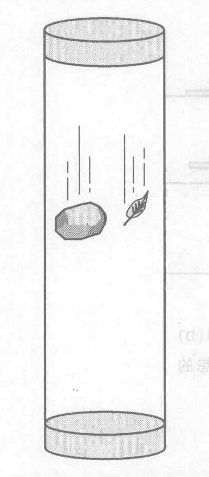

*图 3.3 真空中羽毛和石头下落一样快*

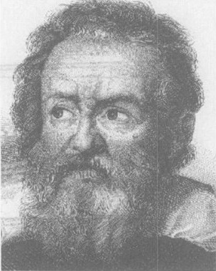

*图 3.4 伽利略，1564—1642。他帮助推翻了亚里士多德物理学，推动了对惯性定律的明确表述，在天文学上也有所发现，这些发现支持了哥白尼的宇宙观，他还首先对运动做了细致的实验和理论研究。但是他最重要的贡献可能是发展了科学方法：观念不是从权威那里学来的，而是从经验与理性思维中获得的。*

① 请照做这些提到的实验，以强化所学的东西。没有什么比得上实际观察！

这是一个极其普遍的表述。它适用于任何两个物体。每个物体可以是随便什么东西：加农炮弹、青蛙、羽毛、充气的气球，甚至单个原子②，只要空气阻力可以忽略。

亚里士多德的强迫运动概念也有问题。如果射出一支箭，它能水平运行一段很长距离而不易轻易减慢下来。一个来自弓弦的短暂而强劲的推力使箭启动，然而一旦离开弓弦之后，是什么外界作用维持其运动呢？亚里士多德本人难以使这类例子与他自己的理论协调起来，后来的科学家也遇到类似的困难。

伽利略是一个才华横溢、非常有自信的意大利人。他支持哥白尼的天文学，对亚里士多德物理学发表尖刻的意见，从而经常激怒当局。他的著作最终导致他受到天主教异端裁判所的审讯，“劝告”这个当时已是老年的人“承认错误”，然后把他监禁在寓所里度过了 10 年余生。即使在监禁中，难以管束的伽利略仍继续他的实验，并写出了物理学巨著。

为了使思路更清晰，伽利略设想了以下的实验：让一个球沿着斜面滚下。这样，球的速度将会增大。现在给这个球一个起始推力让它沿斜面向上滚。它会慢下来（接着停下来并回头滚下来）。假设我们使斜面近于水平（图 3.5）。如果你让一个球沿着一个坡度很小的斜面滚下来过，你就会知道它很可能慢下来并停下来，即使它是向下滚。伽利略认识到这种减速是由于斜面和球的表面不光滑造成的。今天我们称之为**摩擦**。伽利略实验的关键一步是通过忽略（至少在他的头脑中忽略）摩擦的效应而使实验**理想化**。伽利略认为，如果没有摩擦，那么球沿着任何一个向下的斜面都会加速，无论坡度多小，而沿任何一个向上的斜面都会慢下来。然后他采取了绝妙的一步：他想象小坡度斜面的**极限情形**，即理想的水平面。在一个无摩擦的水平面上，球既不会加速也不会减速，因为水平面是下坡与上坡的中间情形。伽利略的结论是，在没有摩擦的情形下，一个球在一个水平面上—经开始滚动，就会永远滚下去。这从根本上与亚里士多德的理论相矛盾。亚里士多德理论认为需要持续的推或拉才能维持强迫运动（即水平运动）。

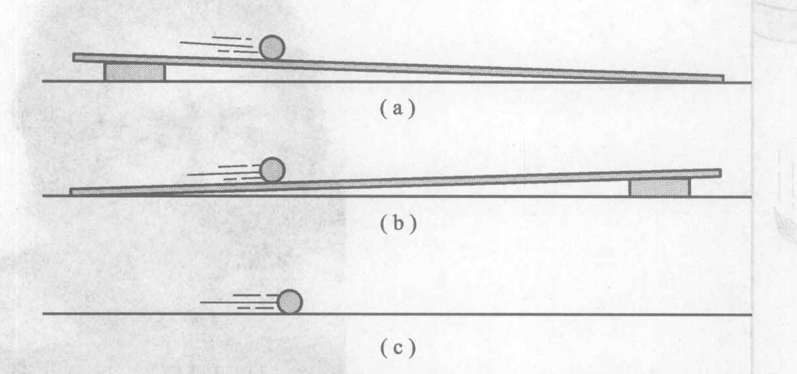

*图 3.5 在光滑斜面上的光滑的球总是 (a) 向下加速运动和 (b) 向上减速运动，即使坡度很小的斜面也是如此。(c) 在理想的光滑水平面上，球应该永远运动下去。*

② 1999 年研究人员首次得以把自由下落的单个原子的运动与像石头之类的宏观物体的下落进行比较。这不是一个容易的实验，为了只观察原子的下落，必须把原子冷却到“绝对零度”附近百万分之二摄氏度的范围内（绝对零度是物理学定律容许的最低温度），以消除原子的热运动。原子就像石头一样下落。

从那时起，伽利略的方法就对科学起着关键作用。这些方法包括：
*   设计实验，以检验特定的假说。
*   对现实世界条件进行理想化，以消除（至少在人的头脑中）任何可能掩盖主要效应的次要效应。
*   一次只考虑一个问题以限制探究范围。例如，伽利略把水平运动与竖直运动分开，一次只研究它们之中的一个。
*   采用定量方法。伽利略尽最大努力测量物体的运动。他懂得，能做出定量预测的理论，比只能做描述性预测的理论更加有力，因为定量的预测更具体，能够在其更详尽的细节上由实验加以检验。

伽利略是最早实践我们今天所称的**科学认知过程**的人之一。这种过程就是经验（以实验和观察的形式）与思维（以创造性构筑的理论和假说的形式）之间的动态的相互作用。科学家不是追随权威或继承信仰而是向经验和理性思维学习，正是这个观念使伽利略的工作和科学本身如此强有力，并且经得起时间的考验。

> 在圣经中，圣灵只教导我们怎样进天国，却没告诉我们天体怎样运行。
> ——伽利略

> 圣经和大自然同样来自上帝的旨意……上帝在大自然的行为中显示了他自己，这和在圣经的神谕中所显示同样令人赞叹。
> ——伽利略

> 一粒沙与一块磨石下落得一样快。
> ——伽利略

## 3.3 惯性定律：牛顿物理学的基石

伽利略和其他科学家终于达到了非亚里士多德的深刻认识。它包含一个极端理想化的情境：假设你能摆脱摩擦和空气阻力以及重力的影响。这种情形不容易想象，因为重力无所不在，以致我们很少注意到它。法国哲学家和科学家笛卡儿是最早想象重力不存在并理解其后果的人。

如果你能够摆脱重力，那会怎样呢？这个问题对亚里士多德是没有意义的，因为在亚里士多德看来，根本就没有重力这种东西。物体不过是自行落下，因为这是它们的本性。但是笛卡儿认识到如果你在半空中松手放开一块石头，而且没有重力和摩擦力或空气阻力，这块石头将不会落下。它将悬在半空中不动。并且如果你用手指轻弹这块不动的石头，它就会沿直线运动并保持速度不变，永远这样运动下去！

笛卡儿是说，如果没有重力和摩擦力或空气阻力，原来运动的物体会保持运动而无需外界帮助。原来静止的物体会保持静止，比方说它将悬浮在半空中。这是一个奇怪而有悖直觉的想法。因为重力、摩擦力和空气阻力充斥在我们周围，直觉告诉我们，只有当物体被推或被拉时，它们才能保持运动，而且只有当某些东西支撑着物体时，它们才能悬在半空中。

我们的直觉观念是，如果要让物体保持运动，它必须得到某种东西的帮助。为了保留这个直觉观念，我们用一个专门的词来称呼物体保持运动和保持静止的倾向，即**惯性**。换句话说，物体的惯性是保持其运动状态（无论是运动还是保持静止）的倾向。使用惯性这个词实际上并没有说明任何东西；它只是一个词，用来表示没有外界帮助的物体保持运动这个无法解释的事实。

> 哦，亲爱的开普勒，我多么希望我们能在一起纵情大笑！帕多瓦这里有一位首席哲学教授，我一再急切地请求他用我的望远镜看看月亮和行星，他却固执地拒绝了。你要是在这里该多好啊！我们会对这种愚蠢透顶的行为怎样地大笑啊！而且听听这位比萨哲学教授在大公面前唠唠叨叨的逻辑论证吧，就好像这些新行星是用魔法咒语从天上召唤出来似的。
> ——伽利略致开普勒的一封信，批评帕多瓦哲学教授利布里，他甚至拒绝通过伽利略的望远镜观察新发现的木星的卫星。

> 利布里在世时不愿意看我的这些天上的小东西；既然现在他已经到了天国，也许愿意看了。
> ——伽利略对利布里的进一步批评，利布里在望远镜事件之后不久去世了。

我们把所有这些总结为：

> **惯性定律**③
> 不受外界影响（也叫做外力）作用的物体，若本来静止则将继续保持静止，若本来运动则将继续保持运动：在后一情况下，物体以不变的速率沿一条直线运动。换句话说，一切物体都有惯性。

观察在水平方向（以消除重力的影响）和近乎无摩擦的运动（例如，沿滚道缓慢滚动的保龄球，或者在气垫上滑行的物体），能够看到惯性定律在起作用。图 3.6(a) 是对这样一个气垫上的滑块[见图 3.6(b)] 的频闪照片。这是在暗房里，打开相机快门，用快速闪光灯在几个等间隔的时刻照明滑块而拍摄成的。对照滑块旁边的米尺可以看出，滑块以不变的速率做直线运动。它在每两次闪光之间的时间间隔中移动相同的距离（就照片上能测得的结果而言）。虽然仔细的测量表明滑块由于空气阻力而稍微变慢，但这这个例子已足够接近伽利略的理想情形，如果你在实验室里看到这个实验，你会对惯性定律有一个直观感受。

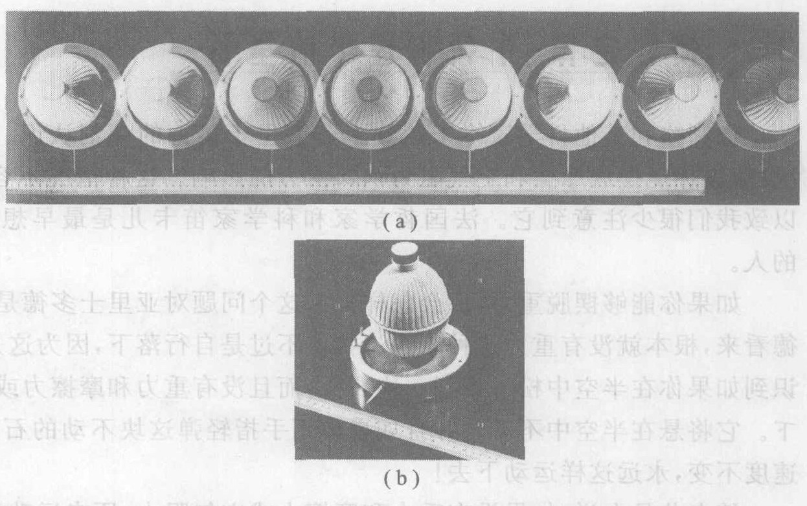

*图 3.6 (a) 从上往下看的气垫滑块在光滑的水平表面上运动的频闪照片；(b) 静止的滑块。*

外层空间提供了许多好例子。外层空间是指地球以外和其他天体以外的宇宙区域，这里“地球”包括大气层。大气层随高度增加变得更稀薄，在 100 km 的高度以上，大气层已经非常稀薄，对人造卫星的阻作用（空气阻力）近似可以忽略。大约在这个高度之外就是外层空间了。图 3.7 画出了这个高度。

③ 它常常称为牛顿第一定律，虽然发现它的是笛卡儿。这是因为牛顿把它列为他的三个关于运动的基本原理中的第一个。本书把这三个原理分别称为惯性定律、牛顿运动定律和作用力与反作用力定律，而不把它们更普遍，但欠准确、欠明晰并且令人厌烦的名称：牛顿第一定律、牛顿第二定律和牛顿第三定律。

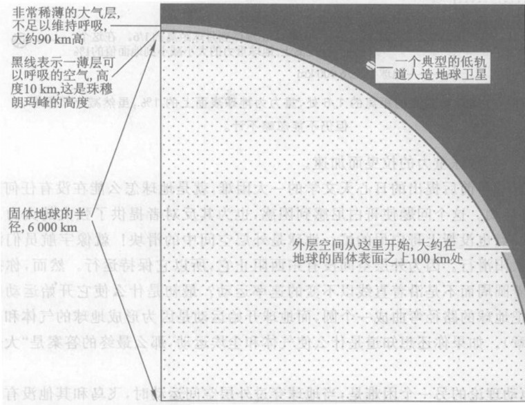

*图 3.7 固体地球、地球的大气层和外层空间。图是大致按比例画的，除了人造地球卫星画得太大了。实际的轨道卫星只有几米大小，在这个图上只是一个微小的点。*

让我来澄清一下对空间这个词的一些常见的误解。**空间**是你周围的一切。在你和你所在的房间另一边的物体之间有空间。在地球表面几千米以内的空间里充满了空气——然而并非完全填满，因为空气分子之间的虚空远远大于分子自身。地球表面附近的空间与地球大气层以上的外层空间并没有显著的差别。二者的主要差别仅在于上面那边的空气比下面这里的空气少得多；也就是说，外层空间比你房间里的空间更接近虚空。但是同样的物理学定律，如惯性定律和重力定律（第 4、第 5 两章），既在下面这里起作用，也在上面那边起作用。

当宇航员飞向月球时，宇宙飞船的火箭发动机先把他们向上推，进入环绕地球的轨道。然后，他们使火箭发动机点火几分钟以离开环绕地球的轨道，开始飞向月球。接着，他们关闭发动机，靠惯性滑行三天，到达月球。宇宙飞船就像一个长距离运动的滑块，极好地验证了惯性定律。

不过这个滑行并没有完全摆脱外界影响。虽然外层空间中没有明显的空气阻力，但还是有明显的重力，除非宇宙飞船离地球、太阳和月亮这一切巨大天体都极远。重力的力程很长。例如在地球到月亮的距离的 1/6 处，重力为地球表面处的 1%，这固然已减小了很多，但仍不能忽略不计（图 3.8）。飞往月球的宇宙飞船在其旅途的头一阶段，由于地球重力的拉伸作用实际上是减速的，然后在最后阶段由于月球重力的拉曳而加速。

> 在以往 1500 多年里人类心智所面对和克服的所有智力困难中，我觉得最令人惊奇、影响范围最大的就是运动问题。
> ——H. Butterfield, 历史学家，在 *The Origins of Modern Science* 中谈及惯性定律时

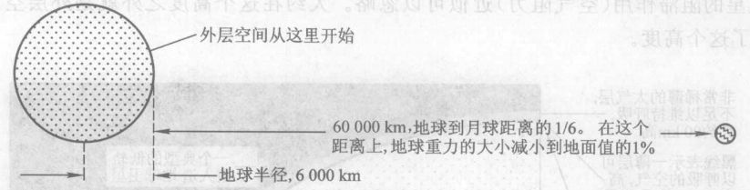

*图 3.8 在地球到月亮的距离的 1/6 处，重力为地球表面上的 1%，虽然减小了很多，但仍不能忽略不计。*

哥白尼在 1550 年前后提出的日心天文学的一大困难，就是地球怎么能在没有任何东西推动它的情况下保持运动。这个问题使哥白尼感到困惑，也为其反对者提供了强大的火力。答案来晚了一个世纪，一点也没帮上哥白尼的忙。地球是外层空间中的滑块！就像宇航员滑行到月亮那样，地球绕太阳滑行。因为外层空间没有东西阻止它，所以它保持运行。然而，你接着就会问，为什么它沿着圆周而不是沿着直线以不变的速率运动？最初是什么使它开始运动的？答案是，太阳的引力把地球的路径弯曲成一个圆，而地球开始运动是因为形成地球的气体和尘埃已经在运动（见第 5 章）。如果你还想知道是什么使气体和尘埃运动，那么最终的答案是“大爆炸”（第 11 章）。

天文学的地动理论的另一个困难是，当地球穿过外层空间运动时，飞鸟和其他没有附着在地面上的物体似乎应当落到后面。答案是鸟也有惯性。站在地面上的鸟正参与着地球以 30 km/s 的速率环绕太阳的运动，因此当这鸟飞起时，它早已以那个速率绕太阳运动了，而惯性定律表明没有任何理由使它停止。它与地球一道滑行。

> **概念检查 1** 根据亚里士多德物理学，石头下落时有什么外界影响作用在石头上？(a) 空气阻力；(b) 惯性；(c) 重力；(d) 没有任何外界影响；(e) 牙齿仙女。*

> **概念检查 2** 根据牛顿物理学，石头落向地面时有哪些外界影响作用在石头上？(a) 空气阻力；(b) 惯性；(c) 重力；(d) 没有任何外界影响。

> **概念检查 3** 假设由于不知道的原因，太阳突然在天空“站住不动”了。从哥白尼的观点看，这意味着 (a) 地球停止了绕其自转轴的自转；(b) 地球停止了在其环绕太阳的轨道上的运动；(c) 太阳停止了在其环绕银河系中心的轨道上的运动；(d) 太阳停止了从东到西的运动；(e) 太阳停止了从西到东的运动。

* 英美传说和民俗中的一个精灵，小孩的乳齿脱落后，把它放在枕头下或屋顶，牙齿仙女会在半夜来访，收走牙齿，留下钱或礼物。实际上是家长利用这个故事和孩子共同庆祝孩子从婴儿长到大少年。——译者注

## 3.4 运动的量度：速率和速度

有时需要用定量的或数值的方法来探求大自然更深层的奥秘。而在另一些时候，定量的细节是多余的，定性的或非数值的描述反而更可取。为了清楚地理解运动及像力和能量这些相关的概念，我们既需要定性的也需要定量的思考。定量的方法对于了解世界的能源等重要的实际问题是需要的。

科学家喜欢只用几个基本量来标记他们的测量结果。要描述运动，只需要两个量：距离和时间。例如，设想我们要定量描述图 3.6 所拍摄的运动，而所用的只是图示的米尺和一个时钟。假设闪光灯以 0.40 s 的间隔稳定地闪光，从第一次闪光时开始计时，这时滑块在 10 cm 刻度处。此后相继的闪光发生在 0.40 s、0.80 s、1.20 s、1.60 s、2.00 s 和 2.40 s。表 3.1 列出这些数据，从图 3.6 读得，估计到最接近的毫米 (0.1 cm) 刻度。

**表 3.1 图 3.6 中气垫上的滑块的位置和时间**

| 钟上的时刻 | 位置 | 钟上的时刻 | 位置 |
| :--- | :--- | :--- | :--- |
| 0.00 | 10.0 | 1.60 | 66.4 |
| 0.40 | 24.1 | 2.00 | 80.5 |
| 0.80 | 38.2 | 2.40 | 94.6 |
| 1.20 | 52.3 | | |

我们怎样用这些数据来描述滑块运动得多快呢？换句话说，这些数据怎么能告诉我们附在滑块上的测速计的读数呢？测速计表示物体单位时间内走过的距离，例如每小时的千米数或每秒的厘米数。因此，如果你 2 小时内走了 6 km，每小时的千米数应该是 6 除以 2，即每小时 3 km。由此你可以看到速率等于距离除以时间。再回到表 3.1，它表明，在每个 0.40 s 的时间间隔里，滑块滑动的距离是 14.1 cm。因此，附在滑块上的测速计的指示应为 14.1 cm 的距离除以 0.40 s 的时间间隔，即每秒 35.2 cm。我们把它叫做滑块的**速率**，写作 35.2 cm/s，这里除号 (/) 读作“每”。

然而有一个问题。假设你在 3 小时内骑自行车走了 24 km。按照这个定义，你的速率应为 8 km/h，但你肯定不会在 3 小时的旅途中每一分钟都保持这个速率。8 km/h 实际上是一个总体速率，即为了以不变的速率走过 3 小时的全程你必须保持的速率。我们把它叫做这个行程的**平均速率**。

但是，汽车的测速计在每个瞬间给出一个读数。这个读数指的是什么呢？测速计根据的是车轮的转数。如果你仔细观察它工作的方式，你会发现它的读数实际上只是某个时间间隔内的平均速率，不过这个时间间隔非常短——短得在这个时间间隔内速率实际上不变。在一个如此之短以至于速率不太可能改变的时间间隔内的平均速率叫做**瞬时速率**。它与平均速率的定义方式相同，但要知道这个时间间隔很短。测速计读出的就是它。我们用不带修饰语的词速率来表示“瞬时速率”，而当我们指的是平均速率时，就加上“平均”两个字。

对平均速率定义的定量表述，缩写成一个公式常常更容易掌握。这个公式是
$$ \text{平均速率} = \frac{\text{走过的距离}}{\text{所用的时间}} $$
用符号可使这个式子进一步缩写。我们可以选用自己觉得合适的符号。我们用 $v$ 表示瞬时速率，$\bar{v}$ 表示平均速率，$d$ 表示走过的距离，$t$ 表示所用的时间。于是这个公式可写成
$$ \bar{v} = \frac{d}{t} $$

别被这样的公式吓住。一个公式不过是话语的缩写。实质的东西是概念，而不是公式。许多最重要的原理，例如惯性定律，不用公式表达得最好。事实上，如果你真要用一个公式，那么首先得肯定能够用话把公式说出来，否则你可能是在愚弄自己，误以为自己理解这个概念了，而实际上你只是记住了一些符号。例如，速率公式中的分母 $t$ 不是任意的时间，它有很特别的意义：它是一个时间间隔的长度，在这个时间间隔内，物体走过了公式的分子所表示的距离。

当你旅行时，朝哪个方向走是关键的。速率与方向在物理学中经常结合在一起出现，使得采用一个专门的术语来表示这一结合是有好处的。我们用**速度**这个术语表示**速率加方向**。速率和速度这两个词在日常语言中可以互换，但在物理学中不行。

回答以下问题，以检查你对速率和速度的理解。

> **概念检查 4** 一辆汽车在半小时内走了 12 km。一个骑自行车的人以不变的速率 30 km/h 猛冲 1 分钟。平均速率较高的是 (a) 汽车；(b) 骑自行车的人。

> **概念检查 5** 在下面这些情形中，哪一种情形是汽车的速率在加大？(a) 一辆汽车在相同的时间间隔内走的距离越来越长；(b) 一辆汽车在越来越长的时间间隔内走过相同的距离；(c) 一辆汽车在相同的时间间隔内走过相同的距离；(d) 一辆汽车在越来越短的时间间隔内走过相同的距离；(e) 一辆汽车花同样的时间走过同样的距离；(f) 在相同的时间间隔内，一辆汽车走过的距离越来越短。

> **概念检查 6** 两个骑自行车的人都以 10 km/h 的速率骑车，在一条笔直的路上，两人擦肩而过，一个向北，另一个向南。他们有 (a) 相同的速率和相同的速度；(b) 不同的速率和不同的速度；(c) 不同的速率但相同的速度；(d) 相同的速率但不同的速度。

## 3.5 运动的量度：加速度

惯性定律说，一个不受外力作用的物体要么以不变的速率做直线运动，要么保持静止，如果它起初静止的话。然而，保持静止不过是速率不变的一种特殊情形（速率保持为零），因此我们可以把惯性定律简单地表述为“不受外力作用的物体一定以不变的速率做直线运动”。但是，速率不变的直线运动就是**速度**不变的运动，而保持静止也是速度不变（速度保持为零）的情形。因此，我们可以把惯性定律更简明地表述为：

> **惯性定律（更简明的形式）**
> 不受外力作用的物体一定保持速度不变。

现在假设有外力（外界影响）存在，它们将怎样影响物体的运动呢？如果你理解了惯性定律就不难猜出答案：外力一定会引起速度变化。任何速度在变化的物体都被说成是它在做**加速**运动。概念检查 7 将使你进一步理解这个概念。记住：只有当物体的速率变化时，物体才是在做加速运动，速度指的是瞬时速率与瞬时方向。

> **概念检查 7** 旅途中一辆汽车做了几种运动。下述哪些情形汽车是在做加速运动？(a) 沿一条水平直路以 70 km/h 的稳定速率行驶；(b) 沿一条水平直路行驶，速率从 70 km/h 减到 50 km/h；(c) 以 50 km/h 的稳定速率绕弯行驶；(d) 以 50 km/h 的稳定速率沿直行斜坡向上行驶（图 3.9）；(e) 以 50 km/h 的稳定速率驶过山顶（图 3.10）；(f) 在一条水平直路上由静止开始动起来。

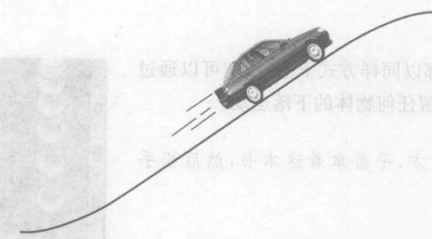

*图 3.9 概念检查 7(d) 的图。*

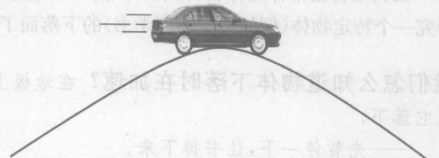

*图 3.10 概念检查 7(e) 的图。*

我们已经看到怎样用测出的量描述速度。加速度又如何呢？为了回答这个问题，想象一辆汽车向北沿一条水平直行的公路行驶。假定它在加快，比如说从 60 km/h 加快到 72 km/h，其速率变化就是 12 km/h。想象一下如果你在车里，你对这个速度变化会有什么感觉。这个变化发生的快慢会使你感觉不同。如果它是整整一个小时内发生的，你就不容易察觉到；但是如果这发生在 1/10 s 内，你可能会以扭伤脖子而收场！因此，我们感兴趣的是速率变化的快慢，即每秒的速率变化量。假设这个时间间隔是 8 s，那么每秒的速率变化量是
$$ \frac{12\ \text{km/h}}{8\ \text{s}} \quad \text{或者说 1.5 “千米每小时每秒”} $$
这些单位告诉我们，在每秒内速率变化了 1.5 km/h。我们把它写成 1.5 (km/h)/s。

这个有用的量叫做汽车的“加速度”，它量度了速率增加的快慢。不过要记住，只要物体的速度发生变化，就说它做加速运动，而速度变化不仅仅指物体运动加快，还包括运动减慢或者改变方向。这意味着，运动物体的**加速度**是其速度的变化（而不仅仅是速率的变化）除以产生这个变化的时间。写成公式就是：
$$ \text{加速度} = \frac{\text{速度的变化}}{\text{产生这个变化的时间}} $$
请注意，物理学家对加速度的这个定义与大众的定义有些不同。其科学意义包括的不只是运动加快（加速的通常意义），还包括减慢（通常称为减速）和方向的改变。对加速度这样的术语的定义是任意的，大自然并没有规定我们必须以某种特定方式定义这些术语。物理学家是按照最方便的原则来定义他们的术语的。* 速度与加速度之间的区别很重要，不注意常会引起误解。“速度”指的是运动本身——物体只要运动就有速度。而“加速度”指的是速度的变化。

> **概念检查 8** 下述情形中，哪些有高速度和低加速度？(a) 穿过空气高速运动的子弹；(b) 一辆赛车刚刚从静止开始启动；(c) 火车沿一长条平缓的曲线快速运行；(d) 撞到砖墙上的快速运行的汽车；(e) 被快速运动的球杆击打的那一瞬间的高尔夫球。

> **概念检查 9** 在前一问题中，哪些情形具有低的速率和高的加速度？

* 这句话的意思是，虽然“加速运动”的日常意义是运动得更快，但物理学中的“加速度”的定义却不受此限制，指的并不只是速率的增加，也包括速率的减少和速度方向的改变，因为这样的定义更有用。——译者注

## 3.6 自由落体

伽利略自由落体定律告诉我们，因为一切物体都以同样方式下落，我们可以通过研究一个特定物体（例如你的物理学书）的下落而了解任何物体的下落运动。

**我们怎么知道物体下落时在加速？** 在地板上方，平拿着这本书，然后松手让它落下。
——先暂停一下，让书掉下来。
在你松手的瞬间，书的速率的数值是多少？
——再停一下，考虑一下这个问题。

当你拿着书的时候，书的速率是零，因此在松手的瞬间它的速率也一定为零。然而，它保持为零吗？显然不。在运动的开始阶段，速率由零增加到大于零的某个值。因此，至少在开始时，这本书一定要加速。

然而你的书在整个下落路程上都在加速吗？它的速率持续变化吗？为了回答这个问题，让书从地板上方约半米处落下。捡起它，再让它从地板上方约 2 m 处落下。（也许你该用另一本书来做实验，如果你想保护这本书的话！）当它撞到地板上时，注意听。第二次它是撞得明显地更猛些？如果是这样，书在第二次下落的末尾阶段一定运动得更快。这表明书下落 2 m 后的运动要快于下落半米后的情况。显而易见，物体下落的距离越长，它就运动得越快。换句话说，物体在整个下落路程上都在加速。

图 3.11 上面的图显示了细心观察的结果。就像扬基棒球队的接球手、著名的 Yogi Berra（多星约吉·贝拉）所说的，“仅仅通过观察你就能学到很多东西。”

图 3.11 的频闪照片表明怎样定量测量落体运动。一个弹子球换着一条长 2 m 的尺子下落，在此期间在若干等间隔时刻进行拍照。两张照片之间的时间间隔为 1/30 s。你可以看到球的加速：它的像分开得越来越远。

图 3.12 是在略去空气阻力的情况下，一个球长距离下落的理想化的图。实际物体在下落距离超过大约 20 m 时，受到的空气阻力影响很强烈，这是因为物体运动越快空气阻力就越大。不过，我们还是想象没有空气阻力，以集中考察重力单独引起的效应。像这样在下落过程中只受重力影响的物体称为**自由落体**。

假设你从释放点向下测量距离，并将一个测速计固定在球上以测量球下落的速率。在撒手的瞬间启动计时器，以及显示球从被释放的那一刻起所经过的时间。图 3.12 给出了这个理想实验的一些数据。为了突出数据的总格局，实际实验数据被舍入成整数④。

④ 舍入成整数引入了 2% 的误差。更精确的距离是 4.9 m、19.6 m、44.1 m、78.4 m 和 122.5 m。更精确的速率是 9.8 m/s、19.6 m/s、29.4 m/s、39.2 m/s 和 49 m/s。用这些更精确的数值求得的加速度是 $9.8\ \text{m/s} / 1\ \text{s} = 9.8\ \text{m/s}^2$。

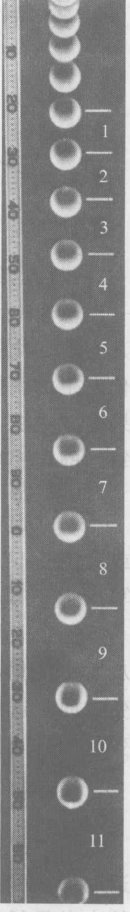

*图 3.11 自由下落的弹子球的频闪照片。位置刻度的单位是 cm。每隔 1/30 s 闪光一次。*

你能用三种不同方式看到球在加速。第一，你从图中可直接看到，在每个相继的 1 秒时间间隔内（即 0 到 1 s, 1 到 2 s, 等等）落下的距离越来越大；第二，每秒末了的速率越来越大，所以球运动得越来越快；第三，如果你仔细看一一下距离的数据，就会发现在相继的每个相同的时间间隔内落下的距离越来越大。例如，0 到 1 s 期间的落下距离为 5 m，1 到 2 s 期间为 15 m。

这个加速度有多大呢？我们还记得，加速度是速度变化量除以时间间隔。现在考察相继的每个长度为 1 s 的时间间隔。所有的速率变化量完全相同！0 到 1 s 期间速率变化为 10 m/s，1 到 2 s 期间也是 10 m/s，如此等等。因此，对这些时间间隔的任何一个计算加速度，得到：
$$ \text{加速度} = \frac{\text{速率变化量}}{\text{时间间隔}} = \frac{10\ \text{m/s}}{1\ \text{s}} $$
它是 10 (m/s)/s，通常缩写为 $10\ \text{m/s}^2$。它的意思是每秒钟内速率变化 10 m/s。因此加速度在整个下落过程中都相同，是 $10\ \text{m/s}^2$。于是伽利略的落体定律告诉我们，所有自由落体的加速度都相同。更精确地在说，这个重力加速度的数值是 $9.8\ \text{m/s}^2$。

速率的数据显示出一个模式。在 0 s、1 s、2 s、3 s、4 s 和 5 s 这些时刻，对应的速率（单位为 m/s）分别为 0、10、20、30、40、50。只要看一下这一串数字，就很容易猜出下一个应该是 60。之所以能够猜出，是因为这里有一个可以辨认出的模式。模式是科学家在大自然中寻求的东西。你预料太阳明天将会升起，这也是基于大自然的一个模式。

描述这个模式的一种方法是用比例关系。我们说一个量与另一个量成正比，如果把第 1 个量加倍就意味着必须把第 2 个量加倍，使第 1 个量变成 3 倍就意味着必须使第 2 个量变成 3 倍，如此等等。一般地说，你对第 1 个量乘以多少，就必须对第 2 个量也乘以多少。看一下速率数据，时间加倍（如由 1 s 到 2 s）速率也加倍（由 10 m/s 到 20 m/s），而且类似的比例关系对全部数据都成立。因此，对于自由落体，有
$$ \text{速率正比于时间} ; v \propto t $$
符号 “$\propto$” 意为“正比于”。注意 $v \propto t$ 这样的正比关系，与等式不是一回事。距离不能等于时间，这与苹果不能等于桔子是同样的道理。

相仿地，对于任何由静止开始以不变的加速度做直线运动的物体，速率总是正比于时间。例如，一个落向月球表面的物体是自由下落的（月球上没有空气阻力），其不变的加速度是 $1.6\ \text{m/s}^2$。因此，落体在下落 1 s 末的速率为 1.6 m/s，2 s 末为 3.2 m/s，3 s 末为 4.8 m/s，等等。与地球上的情况一样，速率正比于时间；例如，3 s 末的速率为 1 s 末的速率的 3 倍。

图 3.12 的位置数据中的模式就不那么容易看出来。为了较容易找到这一模式，我们把位置数据表示成 1 s 时的位置的整数倍，换句话说，以 5 m 为 1 个单位。数据表明，2 s 时和位置（总的下落距离）为 20 m，或 4 个单位，3 s 时为 9 个单位，4 s 时为 16 个单位，5 s 时为 25 个单位。因而，以 5 m 为单位测得的位置分别为 0、1、4、9、16 和 25。这个序列的下一个数是什么？你知道了吗？这些数字中的每一个都是完全平方数：$0^2, 1^2, 2^2, 3^2, 4^2, 5^2$。下一个数是 $6^2$ 或 36 个我们的 5 m 单位！为了得到以米为单位的距离，把它乘以 5，即得 180 m。这一模式也能用比例关系定量的描述。以米为单位的距离和时间的平方成正比。这就是说，时间加倍要把距离乘以 4，时间变成 3 倍要把距离乘以 9，依此类推。一般地说，无论你把时间乘以什么数，你必须把这个数平方，然后再乘以 1 s 时的距离。例如，如果你把时间乘以 3（比如从 1 s 到 3 s），那么你必须把距离乘以 $3^2$ 即 9，从而距离为 $9 \times 5\ \text{m} = 45\ \text{m}$。
$$ \text{下落距离正比于时间的平方} : d \propto t^2 $$
这个比例关系对任何加速度不变的情形都成立。例如，对自由落向月球表面的物体，距离正比于时间的平方。⑤

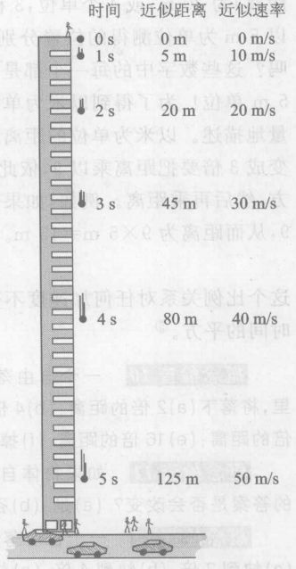

*图 3.12 从一座高楼楼顶自由下落的球。图中略去了空气阻力的影响。*

⑤ 通过进一步分析，对由静止开始以不变的加速度做直线运动的任何物体，我们可以得到其速率和位置的两个普遍公式：$v=at, d=\frac{1}{2}at^2$，其中 $a$ 表示加速度。对地球上的自由落体，$a=9.8\ \text{m/s}^2$。

> **概念检查 10** 一个自由落体从静止下落，在 4 倍的时间里，将落下 (a) 2 倍的距离；(b) 4 倍的距离；(c) 8 倍的距离；(d) 12 倍的距离；(e) 16 倍的距离；(f) 掉到你的汤里。

> **概念检查 11** 如果物体自由下落到火星表面，那么上题的答案是否会改变？(a) 是；(b) 否。

> **概念检查 12** 一个自由落体在 4 倍的时间里下落速率会 (a) 快到 2 倍；(b) 快到 4 倍；(c) 快到 8 倍；(d) 快到 12 倍；(e) 快到 16 倍。

> **概念检查 13** 对一个自由落体来说，(a) 它经过的全程（下落的距离）持续增加；(b) 它每秒钟经过的距离持续增加；(c) 它的速率持续增加；(d) 每秒钟内的速率变化持续增加；(e) 加速度持续增加。

### 概念检查答案

1.  亚里士多德相信下落是石头和其他重物的属性，因此无需外界影响，(d)。
2.  (a) (如果石头穿过空气下落) 和 (c)。
3.  (a)。注意到下述情况是有趣的：由于地球每天的自转，地球表面赤道上的一点绕地轴中心大约以 1600 km/h 的速率运动。因此惯性定律告诉我们，如果地球突然停止自转，人们和房屋会发现他们自己以 1600 km/h 的速率在地球表面滑行。最终，摩擦力会使他们静止下来。大部分物体会滑行几分钟，滑行距离大约会有 25 km (15 英里)，并且他们的表面会因摩擦而变热到接近水的沸点。
4.  汽车的平均速率为 24 km/h，它小于自行车的速率 30 km/h, (b)。
5.  (a) 和 (d)。
6.  (d)。
7.  当汽车的速度改变时，即每当运动的速率或方向改变时，车做加速运动。答案是：(b) (速率减小)；(c) (运动方向改变)；(e) (运动方向改变)，(f) (速率增加)。注意，在 (d) 中速率和方向都不变化，因此没有加速度。
8.  (a) 和 (c)。
9.  (b) 和 (e)。
10. (e)。
11. (b)。
12. (a)、(b) 和 (c)。

---

### 关键概念

下述概念的定义出现在所标页码的本书正文页面上和书末的按拼音排序的术语词汇中。我们将它们按出现先后顺序排列在这里，你可以用这个清单复习本章内容。

*   亚里士多德物理学 54
*   自然运动 54
*   空气阻力 55
*   伽利略落体定律 55
*   摩擦 56
*   科学认知过程 57
*   惯性 57
*   惯性定律 58
*   加速运动 62
*   加速度 63
*   自由落体 64
*   重力加速度 65
*   成正比 65
*   和时间的平方成正比 66

### 复习题

**亚里士多德物理学**

1.  描述亚里士多德认定的四种地上的自然运动。
2.  给出亚里士多德认为是强迫运动的两个例子。
3.  按照古希腊人的想法，地上与天上在哪些基本方面不同？
4.  给出一个与亚里士多德物理学矛盾的运动的例子。
5.  根据亚里士多德物理学，为什么在地面的上方放开一块石头它会落下来？牛顿物理学对这又是怎么看的？
6.  叙述至少一条亚里士多德物理学的原理，它直观看来似乎有道理，但为牛顿物理学所抛弃。

**惯性定律**

7.  说一个物体有惯性是什么意思？
8.  惯性定律对不受外界影响的物体的速度是怎么说的？这个定律对这样一个物体的加速度又是怎么说的？
9.  下面的那个高度是你为了到达“外层空间”所必须到达的高度？地面以上任何地方，大约 100 m，大约 1 km，大约 100 km，超过月亮，在太阳系之外。
10. 外层空间有空气吗？
11. 给出至少一个表明（至少近似地表明）惯性定律的例子，也就是一个没有外界帮助、速度不变或近似不变的运动的例子。
12. 你怎样用一个钟和一条尺子测量运动物体的速率？
13. 当我们说“每秒 5 厘米”时，这是什么意思？
14. 速率与平均速率之间有什么差别？在什么情况下二者相同？
15. 你能给出一个速率不变但速度变化的例子吗？如果能，请给出一个。
16. 你能给出一个速度不变但速率变化的例子吗？如果能，请给出一个。

**加速度**

17. 一辆汽车沿直线加速运动。叙述你怎样用计时器和米尺测量其加速度？
18. 加速度与速度有什么关系？
19. 如果一个物体的位置在变化，我们能肯定它有非零的速率吗？我们能肯定它有非零的加速度吗？
20. 如果物体在一个圆周上以不变的速率运动，它是做加速运动吗？
21. 如果一个运动物体正在慢下来，它是在做加速运动吗？

**落体运动**

22. 在地面上方释放一个物体，它就自由下落。下落过程中在以下哪个位置速度最大：顶点、中点、还是接近底部的一点？在哪个位置上加速度最大？
23. “重力加速度”是什么意思？它在地球上的近似值是多少？
24. “速率与时间成正比”是什么意思？
25. 在两倍的时间间隔内，自由落体从静止下落的距离也增加到两倍吗？下落速率增加到两倍吗？

### 思考题

**亚里士多德物理学**

1.  滚一个球，很快它就停下来了。亚里士多德对此怎样解释？伽利略又怎样解释？

**惯性定律**

2.  大多数流星——外层空间中从卵石大小到巨砾大小的石块——已经运行了几十亿年了。是什么支持它们运动？
3.  在平稳、快速而速率不变的火车内，向上抛一个垒球。这个垒球会落在面前并落向车厢的尾部吗？加以解释。
4.  一个球以 20 m/s 的速率运动而且不受任何外力作用，5 s 后它的速率是多少？5 年之后呢？
5.  你认为图 1.7 所示的地球照片是从一颗低轨道卫星上拍摄的吗？（参看图 3.7）
6.  为了用实验验证惯性定律，你需要测定时间吗？重量呢？距离呢？
7.  一辆行驶的公共汽车突然在一个车站停下时，为什么站着的乘客倒向车的前方？
8.  你能以不变的速度开车绕街区转吗？
9.  玛丽开车从后面超过迈克，她经过他时两人的速度相同吗？速率相同吗？
10. 玛丽骑车沿直线向北走，每小时 15 km。迈克骑车沿直线向南走，每小时 15 km。当他们相互经过时，他们的速度相同吗？速率相同吗？
11. 图 3.13 表示两个向右运动的球的频闪照片。图中给出两个球在几个编号时刻的位置。闪光时刻是等间隔的。哪个球有较大的加速度？较大的速率？较大的速度？会发生一个球超过另一个球的情况吗？如果有，发生在什么时刻？
12. 环绕许多城市的汽车环行线近似是一个圆周。假设你在环线东部 A 点处开始起动，逆时针以不变的速率 90 km/h 行驶（图 3.14）。当你经过北部的 B 点时，你的速率如何？速度如何？
13. 参见前一题，当你经过西部的 C 点时，你的速率如何？速度如何？
14. 在图 3.13 中，假设测量尺上的大刻度是厘米，且每个时间间隔为 0.2 s。求每个球的速率。
15. 一个长跑者在 15 分钟内跑了 3 km，求他的平均速率（以 km/h 为单位）。

**加速度**

16. 一辆法国 TGV 列车沿着直线铁轨以 290 km/h 的稳定速率行驶。其加速度是多少？
17. 有些人在汽车里会晕车。晕车实际上是由运动本身还是由别的什么原因引起的？哪种运动方式不会使人晕车？
18. 你开车时，有可能踩着加速器踏板而实际并不加速吗？有可能在做加速运动而你的脚并没有踩加速器踏板吗？加以说明。
19. 一辆汽车的速率从 0 增大到 30 km/h。然后另一辆车从 0 增大到 60 km/h。你能说出哪辆车的加速度更大吗？加以解释。
20. 图 3.15 表示两个球的频闪照片。描述每个球的运动。会发生一个球越过另一个球的情况吗？发生生在什么时候？两个球曾有过相同的速率吗？在什么时候？

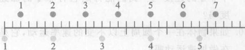

*图 3.13 思考题 11 和 14 的图。*

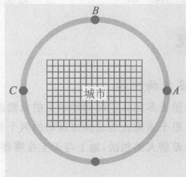

*图 3.14 思考题 12 和 13 的图。*

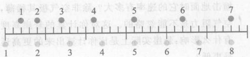

*图 3.15 思考题 20 的图。*

21. 下述各种运动是加速运动还是非加速运动？(a) 一块石头自由下落 2 m；(b) 远离一切行星和恒星因而所受引力可以忽略不计的流星（外层空间的石头）；(c) 绕地球运行的人造卫星；(d) 月亮；(e) 在平滑冰面上滑行的溜冰者，不考虑摩擦力和空气阻力。
22. 一个缓慢运动的物体能够有大的加速度吗？一个快速运动的物体能够有小的加速度吗？
23. 汽车里哪些装置是用来产生加速度的？
24. 对一个无外界帮助的（非强迫的，或者说孤立的）运动物体，下面哪些量是变化的？怎样变化？距离（从出发点算起），速率，速度，还有加速度？
25. 一辆汽车沿笔直的公路平稳行驶，其速率为 80 km/h。下面哪些量在行驶中是变化的？怎样变化？距离（从出发点算起），速率，速度，还有加速度？
26. 一个球沿一条直的斜坡轨道滚下，下面哪些量在运动中是变化的？怎样变化？距离（从出发点算起），速率，还有速度？
27. 一个骑自行车的人，沿一条直路在 5 秒钟内把她的速率由 3 m/s 提高到 4.5 m/s，求她的加速度。
28. 一辆汽车在 10 s 内从 0 加速到 100 km/h。求其加速度。减重短程高速赛车可在 5 s 内从静止加速到 400 km/h。它的加速度有多大？
29. 求一辆汽车在以下几种情况下的加速度。在 4 s 内从 70 km/h 加速到 82 km/h；在 16 s 内从 70 km/h 加速到 82 km/h；在 8 s 内从 70 km/h 加速到 94 km/h；在 8 s 内从 70 km/h 加速到 76 km/h。

**落体运动**

30. 多重选择：两个金属球从三楼窗户同时下落，它们大小相同，但一个的重量是另一个的两倍，到达地面的时间将是 (a) 重球所用时间是轻球的两倍；(b) 轻球所用时间是重球的两倍；(c) 两球所用时间大约相同；(d) 重球所用时间明显长一些，但不见得是轻球的两倍；(e) 轻球所用时间明显长一些，但不见得是重球的两倍。
31. 图 3.12 表明一个落体在 $t=1\ \text{s}$ 时，其速率为 10 m/s。因此，它似乎应该在 1 s 内运动 10 m。然而数据表明该物体在 1 s 内仅运动了 5 m。问题出在哪里？
32. 图 3.16 表示一个下落的球的频闪照片。略去空气阻力，在 A、B 两点中哪一点球的加速度更大？哪一点的速度更大？
33. 一个自由落体在其下落的第三秒钟里（即从撒手放开物体后的 $t=2\ \text{s}$ 到 $t=3\ \text{s}$），其速率增加多少？在其下落的第四秒里呢？
34. 一个自由落向地面的物体，下面哪些量在下落过程中增大：是距离（从出发点算起），速率，还是加速度？
35. 一个物体自由下落，它在第一秒末的速率是多少？第二秒末呢？第三秒末呢？
36. 一个物体自由下落，它在第一秒末的加速度是多少？第二秒末呢？第三秒末呢？
37. 一个宇航员在没有大气的另一个行星上，从悬崖上使一块石头落下。这块石头的运动速率在 3 s 末是 1 s 末的多少倍？石头在 3 s 内下落的距离是 1 s 内下落距离的多少倍（从放开石块的位置算起）？
38. 如果上题中的石块是在地球上下落，略去空气阻力，那么答案与上题相同吗？略去空气阻力，在地球上 3 s 内的下落距离是否可能与另一行星上 3 s 内的下落距离相同？

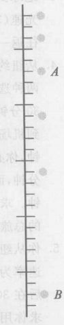

*图 3.16 思考题 32 的图。*

### 习题

**速度**

1.  可能是由于全球变暖的缘故，全球的海平面目前每年上升约 2 mm。以这样的速率，海平面升高 0.5 m 需要多少年？
2.  光从太阳到我们这里大约要 8 分钟。光的速率是 300 000 km/s，我们距太阳多远？
3.  地球到月亮的距离是 $3.8 \times 10^8\ \text{m}$。一束雷达波以光速 (300 000 km/s) 传播，那么在地球和月亮之间往返一次需要多少时间？
4.  从纽约市到华盛顿市区，其距离为 330 km。你有两种选择：火车或飞机。高速火车用 1.5 小时，外加 30 分钟的各车站停留时间。飞机飞行 330 km (机场到机场) 刚好要 30 分钟，但开车到纽约机场要 30 分钟，你必须在起飞前 2 小时到达，飞机起飞等了 15 分钟，而为了拿到行李并乘车到华盛顿市区要 45 分钟。求火车的轨道速率，飞机的飞行速率，每种选择的总旅行时间和每种选择的整体平均速率。
5.  你从纽约开车到华盛顿。第 1 个小时内你的平均速率为 50 km/h，接着在 3 小时内走了 250 km，然后在后 30 分钟内走了剩下的 30 km，进入华盛顿。求你用的总时间和平均速率。

**加速度**

（为了解答习题 6—17，你需要脚注 5）

6.  一辆汽车从静止开始在 5 s 内维持 4.5 (km/h)/s 的加速度。在 5 s 末它跑得多快？
7.  一辆汽车行驶的速率是 30 km/h，接着司机更用力踩加速器踏板，产生 2.25 (km/h)/s 的加速度，维持 4 s。在 4 s 末汽车的速率是多少？

**落体运动**

8.  你在悬崖上从手中放下一块石头，注意到到 6 s 后它撞到下方地面。假定空气很稀薄，以致在整个下落过程中可以忽略空气阻力，那么悬崖有多高？石头撞击地面时的速率有多大？除非空气极其稀薄，空气阻力是不能忽略的。这对你计算的悬崖高度有什么影响：悬崖实际上是比计算出来的更高还是更低？
9.  在前一问题中，当石头撞击地面时，它运动得有多快？仍假定可略去空气阻力。
10. 你让一块石头落向井里，3 s 后听到溅落声。用 Charles Brown 的说法，这并有“3 秒深”。假定空气阻力可以忽略，声音传到井上的时间也可以忽略，这口井深多少米？
11. 在前一问题中，当石头撞击水面时，它运动得有多快？
12. 你从三楼窗口松手放下一个苹果。它什么时候经过在其下 4 m 的二楼窗口？
13. 前一问题中的苹果何时撞击其下 8 m 的地面？
14. 一辆汽车沿一笔直公路从静止加速，其加速度不变。它在 10 s 内走的距离是 1 s 内走的距离的多少倍（从出发点算起）？
15. 前一问题中的汽车在 10 s 后比 1 s 后快多少？
16. 在火星上，自由落体从静止开始在 1 s 内下落 4 m，此时速率为 8 m/s。该落体在 2 s 末会运动得多快？3 s 末呢？
17. 上一问题中的自由落体在 2 s 内下落距离是多少？在 3 s 内呢？