# 第 4 章 物体为什么这样运动

> 大自然及其法则在黑夜中隐藏；
> 上帝说：“派牛顿去吧！”于是一切豁然开朗。
> ——亚历山大·蒲柏*

1687 年世界发生了巨变，那年牛顿（图 4.1）出版了《自然哲学的数学原理》。仅举一个例子：牛顿把笛卡儿和伽利略的惯性定律当作他工作的基础，从根本上动摇了人们对物体怎样运动的直观观念，这种直观观念首先由亚里士多德阐明，并在之后的两千年里一直为人们所接受。牛顿的世界简单得惊人。只用几个基本概念和原理，牛顿就能对行星、月亮、彗星、自由落体、重量、海洋潮汐、地球赤道隆起带、桥梁应力等事物的行为给出清晰和定量的解释。它是我们对大自然了解的前所未有的扩展和统一。

牛顿影响所及远远超出了物理学和天文学。不仅化学和生物学这样的科学领域，而且历史、艺术、经济学、政治学、神学和哲学，也都按照牛顿物理学的普遍模式形成自己的体系。例如，鼓舞了美国革命和法国革命的“人权不可剥夺”的理想，在很大程度上来自于一个沉浸在牛顿文化中的平民阶层。牛顿文化认为，普遍的自然法则平等地适用于一切人，同样适用于平民和国王。①

牛顿物理学工作得太好了。在两个多世纪时间内没有遇到过挑战，以至于最后被看成是绝对真理。理解这个词甚至变成了“用牛顿物理学进行解释”的同义词。最重要的是，人们最终想当然地接受了许多微妙的牛顿式思想习惯，这些思想习惯有着深刻的、但却没有明确说明和检验过的内涵，它涉及了宿命论、因果关系、宇宙的机械属性，以及其他哲学结论①。

\* Alexander Pope，英国 18 世纪新古典主义诗人。这首诗的题目是“拟牛顿墓志铭”。——译者注
① 有两项经典的历史研究工作考察了物理科学从古希腊人向牛顿的新世界观的转变。A. Koestler 的 *The Sleepwalkers* （梦游者）(Universal Library and The Macmillan Company, New York, 1963)——书的书名就指出了新观点是在哲学上不自觉地发展起来的。E. A. Burtt 的 *The Metaphysical foundations of Modern Science* (初版于 1932 年; 1980 年由 Humanities Press, Atlantic Highlands, NJ 重印) 对这些未经明确说明的哲学假定的历史和内涵做了缜密的考察。

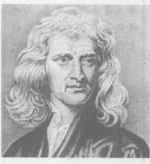

**图 4.1 伊萨克·牛顿，1642—1727。** 他的《自然哲学的数学原理》总结了他本人、笛卡儿和伽利略对地上和天上的物体运动的研究。这书可能是科学史上最重要的著作。

---

> 牛顿不仅是曾经有过的最伟大的人才，而且是最幸运的人，因为只有一个宇宙，因而在世界的历史中只有一个人能够成为其法则的诠释者。
> ——拉普拉斯，科学家

> 我不知道世人怎么看我；但在我自己看来，我不过像是一个在海边玩耍的小孩，为不时发现比寻常更光滑的一块石子或比寻常更美丽的一片贝壳而沾沾自喜，却对展现在我面前的浩瀚的真理海洋全然没有发现。
> ——牛顿

> 如果说我看得更远的话，那是因为我站在巨人的肩上的缘故。
> ——牛顿

于，从贩夫走卒到博学鸿儒，人人都认为牛顿已经为人类的全部知识构建了框架。

在 20 世纪，牛顿物理学已经被相对论和量子论所取代。不过牛顿文化习惯仍然保留着，部分原因是因为还没有被人们认同的与新物理学相适应的哲学框架，再者就是科学教育的缺陷。于是虽然我们的科学是后牛顿时代的，但我们的文化旧主要是牛顿时代的。为了让你掌握帮助人们进入后牛顿时代的手段，我选择后牛顿物理学的意义为本书的主题之一。

牛顿物理学仅从几个概念和原理出发。我们已经讨论过牛顿的两个概念（速度和加速度）和两条原理（惯性定律和自由落体定律）。牛顿的其他基本概念是力和质量，分别在第 4.1 节和第 4.2 节讨论。其他基本原理是运动定律（第 4.3 节、第 4.4 节）、作用力与反作用力定律（第 4.5 节）和万有引力定律（第 5 章）。在第 4.6 节，我们运用这些观念来考察一样重塑了我们的城市、景观和生活的东西——汽车的运动。

## 4.1 力：使物体加速的原因

前一章把力这个词用作“外界影响”的同义词。现在我们需要更专门的定义。像速度和加速度一样，我们想把力按照最有用的方式来定义。由于惯性定律告诉我们不受外界影响（不受力作用）的物体做非加速运动，所以把力定义为使物体加速的外界影响是很自然的。只要一个物体使另一物体加速，我们就说第一个物体对第二个物体“施加了一个力”。

看一些例子。如果一个球在桌上静止不动，而你用手推它，那么这个球将加速而运动起来。如果这个球已经在桌上运动着，而你从后面推它一下，那么这个球将加快。如果你在一个运动着的球的前方轻轻地向后拍它一下，它就会慢下来。如果你从侧面轻轻拍它一下，它就会改变方向。在所有这四种情形中，你用手推或拍球都使球加速。事实上，一些实验表明你不能推一个球而不使之加速②。因此，手的每一次推动都是一个力。当你使用力这个术语时，记住力类似于推动是有帮助的。

对力这个术语有许多错误概念。正像推动这个词一样，力是一个动作而不是一件东西。物体不能是力，也不能拥有力。力是一个物体对另一个物体做的某件事情，就像“推动”那样。一个物体能对另一个物体“施加一个力”。

拉动是另一个例子。你可以把原来静止在桌面上的一个球抓住拉向你，使之加速而运动起来。所以，拉是力。不用手拉这个球，你可以系一根线在球上而拉这根线，线再拉这个球使球加速。所以线拉紧时也对物体施力。

② 假定一个时刻只施加一个推力。在相反方向同时施加的两个推动会相互抵消。

现在假设萨姆和萨莉两人在相反的方向上推一个球（图 4.2）如果他们调整他们的推力，他们能使两个推力相互平衡而使球保持静止。然而，两个人都在推这个球。虽然这个球未被加速，我们还是说萨姆对球施加了一个力，萨莉也一样。在包含一个以上的力的情形，我们说一个物体对另一个物体施加一个力，那是说在没有其他的力出现时，第一个物体会使第二个物体加速。

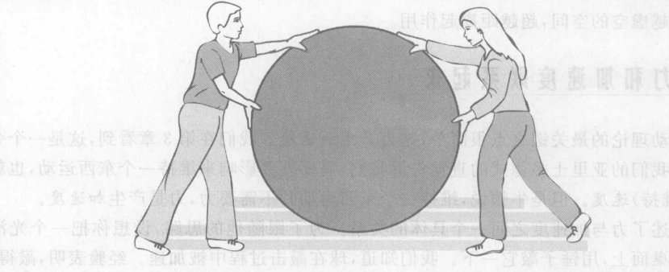

**图 4.2** 萨姆和萨莉两人都对球施加力，但球没有加速。当我们说“萨姆给球施加了一个力”时，我们的意思是，萨姆会使球加速，如果没有其他力的话。在图中所示情形，萨莉作用在球上的力，阻止了萨姆的力给球加速。

你可以用锤子轻轻敲一个球，而不是用手推或拉。因为锤子敲使球加速，所以锤子对球施加了一个力。你自己试着从不同方向敲一个静止或运动着的球，并仔细观察。球究竟在什么时候加速？——暂停一下。找一个球和一把锤子，并做这个实验。

仔细观察。只是在锤子与球接触的远不到 1 秒的时间里，球才得以加速。因此，锤子仅仅在这远不到 1 秒的时间里才对球施力。在敲过之后，球以不变的速率做直线运动，所以没有力施加于球上。注意，运动着的球并没有力，也就是说是它并不“随身携带着力”。一个力就像是一次推动。你不能说球“具有推动”。

摩擦和空气阻力是另外两种力。如果你猛推一下桌上的书，让它在桌面上滑动，那么这本书在滑动中会慢下来。一定有某个力产生了这个加速度（回想一下，慢下来也是一种加速）。这个力来自书与桌面之间的接触，由桌面施加于书的底部。这个力的存在是由于两个表面是粗糙的，或者说在小尺度水平上是不平的。通过让书在更光滑些的表面上滑动，而观察到（负的）加速度效果的减弱，你可以证实这一点。这种由于表面粗糙引起的一个表面作用于另一表面的力叫做**摩擦力**。

沿水平方向穿过空气快速运动的子弹会有所减慢，所以一定有一个力作用在子弹上。这个力是由于子弹飞行时撞击空气分子而产生的，叫做**空气阻力**。空气阻力与摩擦力相似：子弹穿过空气滑行与一本书在桌面上滑动的方式有些相像。

我们由前一章得知，自由落向地面的苹果在整个下落的过程中都在加速。由于苹果在加速，一定有一个力作用于苹果上，这个力通常叫做**重力**。但是我们记得，力总是一个物体对另一物体的作用。重力是作用在苹果上的力，但这个力是由什么施加的呢？答案是这个力是由行星地球施加的。实验验证是，无论你在地球什么地方，下落的苹果永远加速向下，向着地球的中心。你可以把重力想象成一个拉力，尽管它不是人的肌肉的拉力。它是地球对其附近物体的拉力。

在重力与我们讨论过的其他几种力之间有一个有趣的差别。手推、手拉、锤子敲、绳拉、摩擦力和空气阻力全都是**接触力**：一个物体施加于与其接触的另一物体的力。而地球作用于下落的苹果上的力则不同，因为在苹果落下过程中地球实际并未与苹果接触。空气是与苹果接触的，但是我们可以想象去掉空气，或者我们可以把苹果拿到大气层之上，然后放开它，苹果依然会落下。重力能够跨越虚空的空间，超越距离起作用。

## 4.2 把力和加速度联系起来

牛顿运动理论的最关键之点很简单，是力产生加速度。我们在第 3 章看到，这是一个令人吃惊的概念。我们的亚里士多德式的直觉告诉我们，需要外界影响来维持一个东西运动，也就是说力产生（或维持）速度。但是牛顿说，维持一个东西运动并不需要力，力产生加速度。

牛顿表述了力与加速度之间一个具体的关系。为了跟随他的思路，设想你把一个光滑的球放在光滑的桌面上，用锤子敲它一下。我们知道，球在敲击过程中被加速。经验表明，敲得越重，敲击后球运动得越快。我们得出结论说，力越大，产生的加速度越大。定量地做这个实验时，我们发现，随着作用于物体的力的增大，物体的加速度精确地按同一比例增加：两倍的力产生两倍的加速度，三倍的力产生三倍的加速度，依此类推。我们断定，物体的加速度正比于施加给它的全部的力。用符号表示就是
$$ a \propto F $$

**我们怎么知道更大的力意味着更大的加速度？** 加速度与力之间的比例关系，可以用像图 4.3 那样的装置演示。图中一个滑块由一弹簧秤拉在气垫上做无摩擦滑动。通过用计时器和尺子测量滑块的加速度，发现不变的拉力 [图 4.3(a)] 产生不变的加速度，两倍的拉力 [图 4.3(b)] 产生两倍的加速度。

**图 4.3** 定量演示加速度与力成正比 (a) 不变的拉力使一个在水平面上的无摩擦滑块产生不变的加速度。(b) 拉力加倍，加速度也加倍。

现在想象对两个不同的球施力，一个轻，一个重。你会发现，如果你对它们进行同样的敲击，两球加速过程轻比重球运动得快。因此，轻球在敲击时得到更大的加速度。把惯性概念（第 3.3 节）推广到这里的情况是有用的。我们还记得，物体的惯性是它保持其速度的特性。因为较重的球的速度变化较少，我们说它比轻球有更大的惯性，用惯性这个词表示一个物体对加速度的抵抗。

乍一看，“惯性”与“重量”的意思似乎差不多，因为较重的球有较大的惯性。而且事实上只要物体在地球表面附近，它的惯性和它的重量几乎就是一回事。然而，重量与惯性实际上是不同的东西。这对一重要事实的有说服力的证据，来自对外层空间的物体的研究，如穿行我们太阳系的许多孤立石块。如果你在遥远的空间，手里拿着这样一块石头，然后放手，这块石头不会“落下”，而是漂浮在你面前，就像你松手放开它的地方。所以，它在那里没有重量。但是如果你用手推它，你将发现它反抗你的推。要使一块巨石以甚至很慢的速率运动都需要巨大的推力。一块石头在外层空间有惯性，尽管它没有重量。一个研究外层空间中这样的石块对实际作用于它的引力、磁力和其他力的响应的天文学家，每天都观察到同样的结果——是惯性而非重量。

给惯性一个定量的定义是有用的。我们把量化的惯性叫做**质量**。也就是说，一个物体的质量是它的惯性的大小。为了给质量建立一个测量单位，我们选取一个特定物体，叫做**千克原器**，定义它的质量为 1 千克，缩写符号为 kg（图 4.4）。在许多物理实验室中有它的优良复制品。如果一个物体的惯性与千克原器的惯性相同，那么该物体的质量就是 1 kg。如果一个物体的惯性与两个千克原器的惯性相同，就说这个物体的质量是 2 kg。用这个方法，即通过比较一个物体与一个或多个千克（或半个或其他分数个千克）的惯性，可以确定任意物体的质量。

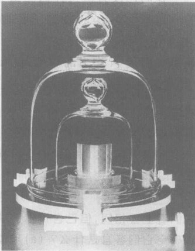

**图 4.4** 美国第 20 号国家标准千克原器。这是保存于法国塞纳尔的国际标准千克原器的精确复制品，保存在空气已被抽空的两个钟罩内。

现在设想我们进一步做像图 4.3 那样的那种气垫实验。不过这次我们保持拉力不变而改变被拉东西的数量（图 4.5）。图 4.5(a) 表示被拉的是单个滑块，而图 4.5(b) 表示两个相同滑块连接在一起被同样的力拉动。我们料想在情形 (b) 中的加速度会比较小，这是因为数量较多的东西有较大的惯性。然而小多少呢？实验的答案是其加速度是单个滑块的一半。三连滑块的加速度将是单个滑块的三分之一，依此类推。我们把这一关系表述为：物体的加速度与其质量成反比，或与其质量的倒数成正比。用小写字母 $m$ 表示质量，因为一个数的倒数是 1 除以这个数，所以我们可以用符号把这个关系表示为：$a \propto 1/m$。

从这个实验我们还学到了另外一些东西：物体的质量（即它的惯性）是它所含的“物质的量”（材料的多少、原子的数目）的量度。例如，双连滑块中的物质是单个滑块的两倍，其质量也是两倍。

我们可以把两个比例关系 $a \propto F$ 和 $a \propto 1/m$ 合在一起，写成
$$ \text{加速度} \propto \text{力} / \text{质量} ； \text{即} a \propto F/m $$
即一个物体的加速度正比于作用于其上的力除以它的质量所得之商。

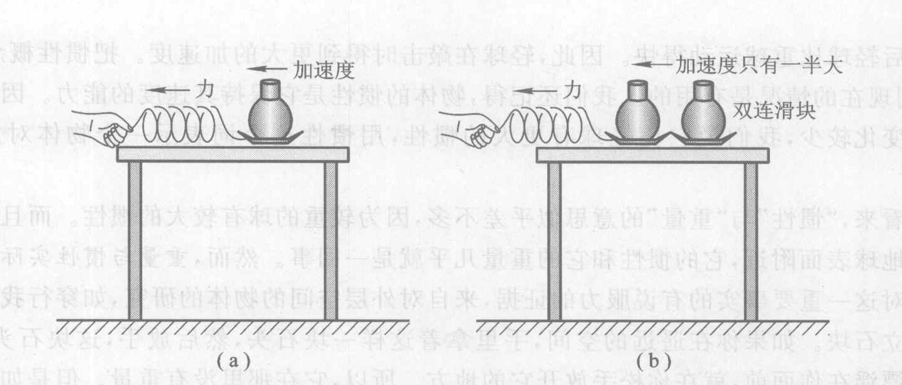

**图 4.5** 定量演示加速度与质量成反比。(a) 作用于滑块上的拉力使滑块加速，像图 4.3 所示那样，(b) 同样大小的拉力作用于双连滑块（质量变为两倍），产生的加速度只有一半大。

我们还没有讲过任何测量力的单位。力的单位为**牛[顿]**（符号为 N），它的定义是使 1 kg 的质量产生 $1\ \text{m/s}^2$ 的加速度的力的大小。这意味着我们可以把上面的比例关系写成等式：
$$ \text{加速度} = \text{力} / \text{质量} ； a = F/m $$
如果我们用 N 作为力的单位，以 kg 作质量的单位，那么这个公式给出的加速度的单位是 $\text{m/s}^2$。

> **概念检查 1** 一块几千米大的巨石静止在太空中，远离所有外界影响。一块小的慢速运动的卵石轻轻撞击巨石后反跳开。这块巨石会出现什么情况？(a) 在撞击期间它加速到一个低的速率，然后很快静止下来；(b) 在撞击期间它加速到一个低的速率，然后渐渐静止下来；(c) 在撞击期间它加速到一个低的速率，然后以这个速率继续运动；(d) 它全然没有加速；(e) 在撞击期间它加速到一个高的速率，其后以这个速率继续运动；(f) 它变成一只青蛙。

> **概念检查 2** 设想你在外层空间，远离所有天体，因而引力可以忽略不计。你面前有两块金属，它们看上去相，但已告诉你一块是铝，另一块是铅（在地球上铅比铝重得多）。你能通过下列哪个方法确定它们各自是什么？(a) 用锤子同样轻重地敲它们，移动较慢的是铅；(b) 用锤子同样轻重地敲它们，移动较慢的是铝；(c) 把它们拿在你的两只手里，较重的是铝；(d) 把它们拿在你的两只手里，较重的是铅；(e) 实际上这些方法没有一个有效。

## 4.3 牛顿运动定律：牛顿物理学的核心

我们必须讨论牛顿运动理论的另外两个方面。第一，如果在一个物体上有不止一个力作用，这些力在不同的方向上推或拉这个物体，那么会发生什么情况呢？在本书中我们将只考虑各个力都沿着一条直线作用的情形。当各个力都作用于同一方向时，它们的作用应该加起来，总作用是各力之和。如果两个力在相反方向上作用于同一物体又将怎样？如果这两个力大小相同（图 4.2），你从经验知道物体不会加速。所以，它们的总作用一定是零。这提示我们，应该让这两个力相减。这个提示是正确的。

于是，两个或多个力作用于同一方向，它们的总作用与大小等于它们之和的单个力的作用相同。两个力作用方向相反，其总作用等于两力之差，且方向与较大的力一致。我们称这个总作用为**合力**。

例如，假定你沿桌面推你的书，桌面对书的摩擦力为 3 N（图 4.6）。那么，作用于书的合力是 7 N。这 7 N 代表外部环境对书的推拉作用的总效果。正是这 7 N 的合力，而不是你的 10 N 的推力，使书加速。

我们需要考察的第二点是加速度的方向。既然力有方向，而且加速度与力成正比，那么加速度也应当有方向就不奇怪了。迄今我们定量讨论过的加速度，仅限于物体沿直线加快速度的情况。在这种情况下，因为速度的变化是向前的，所以加速度方向是向前的（图 4.7）。沿直线减速运动的物体又怎么样呢？因为这时速度变小，所以速度的变化是向后的（图 4.8）。这意味着加速度向后，与速度方向相反。下一章我们将讨论物体不沿直线运动时的加速度方向。

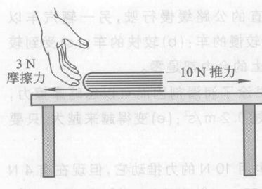

**图 4.6** 作用于书的合力是多大？在什么方向？

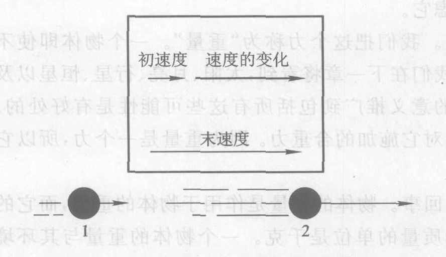

**图 4.7** 物体沿一直线加快运动时，它的速度变化是沿着运动方向。

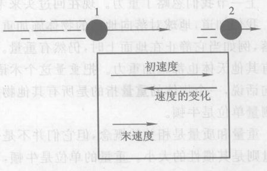

**图 4.8** 物体沿一直线运动变慢时，它的速度变化与运动方向相反。

由于物体的加速度由作用于物体的合力确定，有理由认为加速度的方向应当与合力的方向一致。简单的实验证实了这一点：如果用锤子敲一下静止的球，它将加速而开始沿敲击方向运动，所以加速度是沿着力的方向。如果球已经在运动，而你从后面敲它，它将加快速度；加速度是向前的，沿着力的方向。如果你从前方轻轻敲击运动着的球，这个球将慢下来；这是向后的加速度，还是沿着力的方向。我们把既不向前也不向后的侧向力的情况留到下一章再讨论。结论如下：

> **牛顿运动定律** ③
> 一个物体的加速度由其环境对它施加的合力和它的质量确定。加速度的方向与合力的方向相同。定量地说，加速度正比于合力除以质量的商：
> $$ \text{加速度} \propto \frac{\text{合力}}{\text{质量}} ； a \propto F/m $$
> 如果力的单位用 N，质量单位用 kg，加速度单位用 $\text{m/s}^2$，那么上面的比例式就变成等式：
> $$ \text{加速度} = \frac{\text{合力}}{\text{质量}} ； a = \frac{F}{m} $$

③ 通常令人厌烦地叫做牛顿第二定律。

> **概念检查 3** 一辆汽车以 10 km/h 的不变速率沿一条笔直的公路缓慢行驶，另一辆汽车以 120 km/h 的不变速率急速超过它。哪辆车受有更大的合力？(a) 较慢的车；(b) 较快的车；(c) 受到较大空气阻力和滚动摩擦的那辆车；(d) 都不是，因为作用在每辆车上的合力都是零。

> **概念检查 4** 你沿桌面推一本 2 kg 的书，用力 10 N。如果书涂了润滑剂因而可以忽略摩擦力，这本书的加速度是 (a) $5\ \text{m/s}^2$；(b) $10\ \text{m/s}^2$；(c) $20\ \text{m/s}^2$；(d) $0.2\ \text{m/s}^2$；(e) 变得越来越大，只要你继续推；(f) 变得越来越小，只要你继续推。

> **概念检查 5** 接上题，一本不涂润滑剂的书质量也是 2 kg，也用 10 N 的力推动，但现在有 4 N 的摩擦力。这本书的加速度是 (a) $12\ \text{m/s}^2$；(b) $20\ \text{m/s}^2$；(c) $28\ \text{m/s}^2$；(d) $3\ \text{m/s}^2$；(e) $5\ \text{m/s}^2$；(f) $2\ \text{m/s}^2$。

## 4.4 重量：物体所受的重力

上一节我们忽略了重力。现在回过头来考虑它。

我们知道，地球对落向地面的物体施加重力。我们把这个力称为“重量”。一个物体即使不下落，例如当它静止在地面上时，仍然有重量。我们在下一章将看到，太阳、月亮、行星、恒星以及所有其他天体也都施加重力。把重量这个术语的意义推广到包括所有这些可能性是有好处的。换句话说，一个物体的**重量**指的是所有其他物体对它施加的合重力。因为重量是一个力，所以它的测量单位是牛顿。

重量和质量是相关的概念，但它们并不是一回事。物体的重量是作用于物体的重力，而它的质量则是其惯性的大小。重量的单位是牛顿，而质量的单位是千克。一个物体的重量与其环境有关，例如，物体在月亮上的重量比在地球上要轻，因为月亮上的重力比地球上的小。然而一个物体的质量仅是物体自身的属性，而不是其环境的属性，因此它在月亮上的质量与地球上相同。例如，1 kg 砝码具有 1 kg 的质量，与它是在地球上还是在月亮上还是在遥远的太空无关，然而它的重量在地球上大约是 10 N，在月亮上只有 1.6 N，而在遥远的太空实质上是零。

如果你拿一块石头和一个垒球，放开手，伽利略落体定律告诉我们，它们的加速度相同（略去空气阻力）。如果这块石头和这个垒球刚好有相同的质量，那么牛顿运动定律告诉我们，作用在这两个物体上的力相同。然而这个力正是重力，这意味着它们的重量相同。这是一个可信而重要的结论，它断言两个质量相同的物体的重量也相同，只要你在同一地点测量这两个重量（你不要在地球上测一个，而在月亮上测另一个）。这样，你就可以依靠比较重量来比较质量，比如在一架天平上（图 4.9）。例如，任何一个与 1 kg 的砝码平衡的物体的质量为 1 kg。

公制吨等于 1000 kg，是用来测量较大的质量的单位。相仿的美制单位吨是 2000 磅。1 美制吨的质量大约是 900 kg，比 1 公制吨略小。如你所见，美制单位带来不必要的麻烦，因此今后我们将完全不用它。

作为一个例子，考察放在桌上的这本教科书。假设这本书重 12 N，换言之，假设地球对这本书施加的重力是 12 N。这个力的方向向下。然而，这本书显然并未加速向下穿过桌子。由于这本书的加速度是零，牛顿运动定律告诉我们，作用于它的合力一定也是零。所以一定有一个向上的 12 N 的力作用在这本书上，以抵消向下的重量。桌子一定施加了这个力，因为如果桌子消失了，这本书会掉下来。

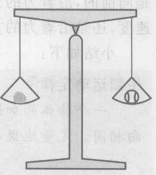

**图 4.9** 你可以依靠比较重量（例如在一架天平上）来比较质量。由于它们平衡，所以这块石头和这个垒球有相同的质量。

看来似乎有些奇怪，一个毫无生气的物体会施加一个力。为什么桌子会推它上面的书？桌面似乎并没有做任何事情。一种微观解释可以说明真相。向上的力是由桌面内的原子施加于书的底部的原子的④当这本书压在桌面上时，桌面被压向下而轻微变形。就像被压缩的弹簧一样，原子会向上推这本书（图 4.10）。桌面施加的力的方向由桌面指向外，垂直于桌面。当任一物体的底部与一固体表面接触时，都会受到一个力作用，这个力与由桌子施加给书的向上的力相似。物理学家把任何一个这样的力叫**向力**，因为“法向”就是垂直的意思。

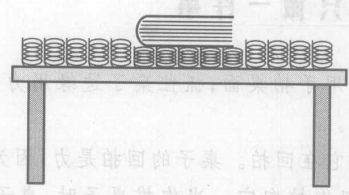

**图 4.10** 作为对桌子作用于书的法向力的解释，想象桌面为小弹簧所覆盖。当书放在桌上时，它挤压弹簧，使弹簧反向推这本书。

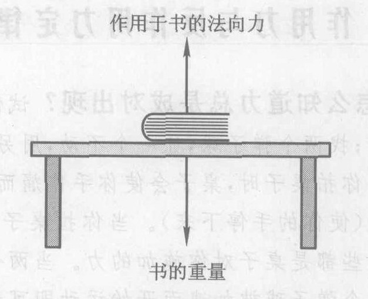

**图 4.11** 放在桌上的书所受的力

图 4.11 表示作用于这本书的力。每个力都由一个箭头表示。这样的力图有助于分析力和运动。当你画力图时，要画出作用于所考察的物体的每一个力。每个力用一个箭头表示，箭头指向各个力对这个物体推或拉的方向，并为每个力取个名字。

作为另一个例子，假设一垂直起飞的火箭重 150 000 N，其质量为 15 000 kg，火箭的发动机施加于火箭的“反冲力”为 180 000 N（图 4.12）。（下一节我们将对反冲力做更多的讨论。）作用于这个火箭的合力有多大？火箭的加速度是多大？

合力大小为 $180\ 000\ \text{N} - 150\ 000\ \text{N} = 30\ 000\ \text{N}$，方向向上。实际加速这个火箭的就是这个 30 000 N 的力。为了求加速度，牛顿运动定律表明，要把合力除以质量：$30\ 000\ \text{N} / 15\ 000\ \text{kg} = 2\ \text{m/s}^2$。

④ 更精确地说，这个力是桌子的原子中的电子施加于书的原子中的电子的电力。当电子彼此很接近时，它们会强烈地相互排斥。

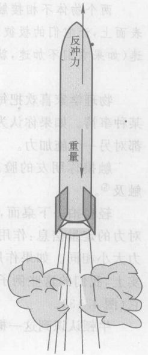

**图 4.12** 火箭在发射过程中所受的力。注意这个图中只画了单个的力，而没有画出 30 000 N 的合力。30 000 N 的合力不是单个的力（它是所有单个力之和），因此未画出。

> **概念检查 6** 假设火箭的反冲力只有 165 000 N。于是加速度为 (a) $4\ \text{m/s}^2$；(b) $3\ \text{m/s}^2$；(c) $2\ \text{m/s}^2$；(d) $1\ \text{m/s}^2$；(e) $0\ \text{m/s}^2$。

> **概念检查 7** 一位宇航员在地球上的质量为 70 kg，重量约为 700 N。在月亮上，这位宇航员的质量和重量约为 (a) 11 kg 和 700 N；(b) 70 kg 和 110 N；(c) 11 kg 和 110 N；(d) 70 kg 和 700 N。

> **概念检查 8** 在地球上还是在月亮上更容易举起这本书？(a) 在月亮上，因为这本书的重量会较小；(b) 在月亮上因为这本书的质量会较小；(c) 在地球上，因为这本书的重量会较小；(d) 在地球上，因为这本书的质量会较小；(e) 两个地方相同。

## 4.5 作用力与反作用力定律：你不能只做一件事

**我们怎么知道力总是成对出现？** 试做以下实验：用手拍桌面；抓住桌子边缘用力拉；用力推桌子；找两个弹子球，让一个不动，用另一个去碰它。

当你拍桌子时，桌子会使你手作痛而让你感觉到它在回拍。桌子的回拍是力，因为它使你的手加速（使你的手停下来）。当你拉桌子时，桌子也把你拉向它。当你推桌子时，桌子也把你推开。这些都是桌子对你施加的力。当两个弹子球碰撞时，投出的弹子球施力于第二个弹子球，这由第二个弹子球被加速而开始运动即可看出。但第二个弹子球也施力于第一个弹子球，这由第一个弹子球速度的变化可以看出。这些实验表明，每当一个物体施力于第二个物体，第二个物体也施力于第一个物体。力永远成对出现，叫做**作用力与反作用力**。

两个物体不相接触而作用时，仍然是这样吗？找两块磁铁考察这个问题。把磁铁放在光滑表面上，让它们的极彼此接近而不相接触，按住它们使其静止。当你放开它们时，两块磁铁都加速（如果它们不加速，就换一张更光滑的桌子）。因此每块磁铁都对另一块施力。

物理学家喜欢把每个力看成是两个物体的**相互作用**，而不是一个物体对另一物体所做的某种事情。如果你认为拍桌子是你的手与桌子之间的相互作用，那自然就得到这样的结论：每个都对另一个施加力。

触摸你朋友的脸。你的手也被你朋友的脸触摸。你不能触及别的东西而不被对方触及⑤。

轻轻拍一下桌面，然后拍得重些。桌子第二次回拍也重些，对吗？这给了我们关于这一对力的定量信息：作用力增大时，反作用力也增大。事实上，定量实验表明，作用力与反作用力大小相同。如果作用力是 3.71 N，则反作用力也是 3.71 N。然而这两个力的方向不同。事实上，我们的这些例子表明，它们的方向相反。例如，当你把桌子拉向你时，桌子也把你拉向它（图 4.13）。

牛顿认识到这一概念是一个基本的物理学原理。我们把它总结如下：

⑤ 感谢我的朋友，Conceptual Physics 第 10 版 (New York: Addison Wesley, 2002) 的作者 P. Hewitt 的这一美妙的表述。

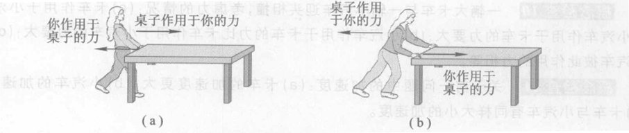

**图 4.13** 当你拉或推一张桌子时，它也向相反的方向拉或推你。 (a) 抓住桌子的边缘拉桌子，(b) 推桌子。

> **作用力与反作用力定律 ⑥**
> 每个力都是两个物体之间的相互作用。因此力一定成对出现：只要一物体施力于第二个物体，第二个物体就施力于第一个物体，而且这两个力大小相等，方向相反*。

这两个力总是具有相同的大小一事实出人意料。举例来说，这事实告诉我们，一个虫子撞一辆汽车所用的力与汽车撞这个虫子的力相同！真是想不到，但的确如此。然而，这两个相等的力使虫子和汽车产生非常不同的反应：虫子感受到一个巨大的加速度，而汽车则得到一个小时无法测量的加速度。这个差别是因为牛顿的运动定律和虫子与汽车差别极大的质量。

图 4.14 说明一个有趣的问题。由于地球对苹果施加一个引力，作用力与反作用力定律告诉我们，苹果必定也对地球施加一个引力！并且这两个力的大小相等：如果地球对苹果施加的力是 2 N，则苹果对地球施加的力也是 2 N。这一点似乎可能令人吃惊。为什么我们一直没有注意到苹果和其他物体拉地球的这个力？为什么地球不向着苹果加速？

答案是，由于地球的质量如此巨大，苹果只能使地球产生极小的加速度。你不能用一个苹果使一个行星明显加速。然而大天体能使行星明显加速，例如科学家可检测到地球受月亮运动的影响所产生的加速度。

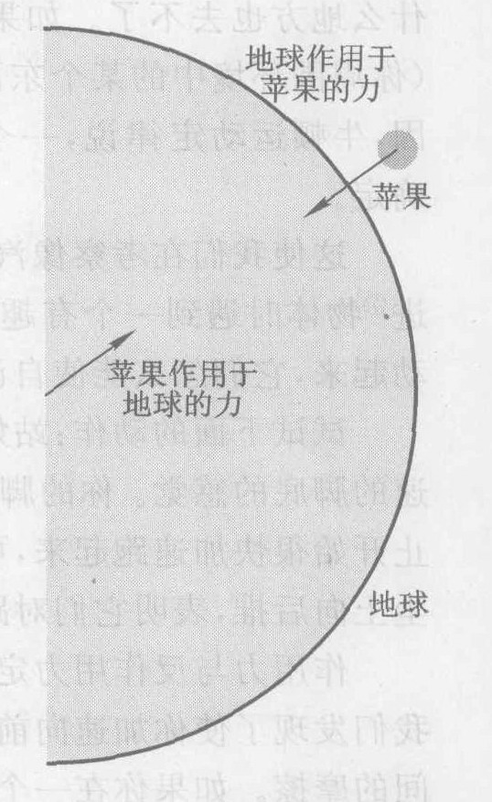

**图 4.14** 地球与下落的苹果：哪一个施加的力更大？（答：它们相同）

> **概念检查 9** 你的手推一个重箱子在地板上滑过。其反作用力是 (a) 向后推箱子的摩擦力；(b) 向下拉箱子的重力；(c) 箱子向后推你的手的力；(d) 箱子向下推地板的力。

你可以从概念检查 9 看到，作用与反作用这两个力总是作用在**不同的物体**上：你的手给箱子一个力，而箱子反过来对你有一个力。相仿地，如果一根绳子拉着一个滑水者向前，那么滑水者就拉着绳子向后。因此滑水者和绳子都受力。第一个力维持滑水者向前运动，而第二个力让绳子绷紧。

⑥ 常令人厌烦地叫做牛顿第三定律。
\* 更准确地说，这两个力大小相等，方向相反，作用在同一直线上。——译者注

> **概念检查 10** 一辆大卡车与一辆小汽车迎头相撞，考虑力的情况：(a) 卡车作用于小汽车的力比小汽车作用于卡车的力要大；(b) 小汽车作用于卡车的力比卡车作用于小汽车的力要大；(c) 卡车与小汽车彼此作用的力相等。

> **概念检查 11** 关于前一问题中的加速度：(a) 卡车的加速度更大；(b) 小汽车的加速度更大；(c) 卡车与小汽车有同样大小的加速度。

## 4.6 牛顿遇到汽车

你不能靠拉自己的鼻子到达任何地方。不信试试看（图 4.15）！你可以把你的鼻子拉得脱位，但你不会去到任何地方，这是因为你的手向后拉你的鼻子和你鼻子向前拉你的手，两个拉力都作用在你身上，因此它们对你的身体产生的合力为零——它们“抵消了”。同样的论据表明，通过推或拉你自己身体的任何部位，你什么地方也去不了。如果你想要加速，那么你身体之外的某个东西（你周围环境中的某个东西）必须对你施加一个力。正是由于这个原因，牛顿运动定律说，一个物体的加速度由其**环境**对它施加的合力确定。

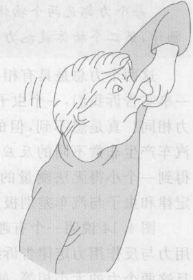

**图 4.15** 拉自己的鼻子，你什么地方也去不了。

这使我们在考察像汽车或自身加速进入运动的动物这样的**自推进**⑦物体时遇到一个有趣的困惑。既然物体不能靠推拉它们自身而动起来，它们怎么能使自己投入运动呢？

试试下面的动作：站好，迈出一步，仔细体验你的腿特别是使你加速的脚底的感觉。你的脚向后推地板⑧如果你在满布尘土的路上从静止开始很快加速跑起来，可以更令人信服地证明这一点。你的双脚把尘土向后推，表明它们对路面施加了一个向后的力。

作用力与反作用力定律告诉我们，如果你的脚向后推地面，地面一定向前推你的脚。好啊！我们发现了使你加速向前的力！是地面推你的脚向前。这个力来自两个表面（地面和你的脚）之间的摩擦。如果你在一个近乎无摩擦的表面上，像一片光滑的冰上，由静止很快加速到快速跑动（可得小心！），就能够证明这一点。

汽车是牛顿的原理的有效应用。更重要的是，汽车技术极大地改变了现代世界的社会结构。像一切强大的技术一样，赞成汽车和反对汽车都有重要的社会理由。汽车给了我们无以比拟的运动的自由，改变了我们的城市的面貌，用掉了我们大部分石油，产生了大量污染，而且是 35 岁以下的美国人死亡的首要原因。本书将对汽车进行大量讨论。

在往下读之前，试着列出或画出汽车沿一条水平直路行驶时，环境施加给汽车的力。
（暂停一下，以列表或画图。）

如图 4.16 所示，一个力是重力或者说汽车的重量，由地球作用于汽车，方向向下。第二个力是法向力，由道路施加于汽车，方向向上。由于汽车在竖直方向上没有加速度，所以竖直方向的合力应该是零。因此，这两个竖直力一定大小相等。

⑦ 自推进的意思是推进物体的能量（第 6 章）来自物体自身内部。然而像我们将要看到的那样，推进物体的力还是来自外部。
⑧ 如果你光脚的话。否则你的脚向后推你的鞋，鞋再向后推地板。

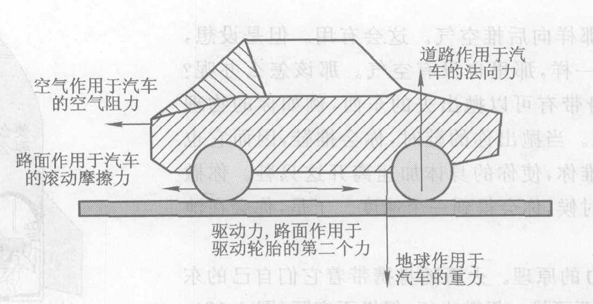

**图 4.16** 作用于汽车的五个力

三个水平方向的力与汽车运动有更直接的关系。两个力对汽车有**阻力**：空气施加的空气阻力，这在第 4.1 节已经讨论过；轮胎与道路之间的接触产生另一个向后的力，称为**滚动摩擦力**。滚动摩擦力由轮胎的橡胶与路面接触处轮胎变平而引起。路面施加给变平轮胎的力起着减慢轮胎转动的作用，因此它对汽车施加了一个减速的（向后的）力。这对较易变形的充气轮胎非常明显。在光滑的硬表面上滚动的硬轮箍，例如钢轨上的钢轮，把滚动摩擦力减小到最小程度——这是火车车的能量效率比汽车高得多的一个原因。

即使在发动机熄火后汽车滑行时，上面讨论过的四个力也作用在汽车上。如果作用在汽车上的只有这四个力，那么合力一定是向后的，所以加速度也向后，于是汽车一定慢下来。这是当汽车开动而不是滑行时，另外还有一个力作用于汽车的原因。认为这个力是由发动机施加于汽车上的，是一种误解，这是因为物体不能推自身前进，而发动机就是汽车的一部分。实际情况是，发动机使驱动轮转动，驱动轮向后对路面施加一个摩擦力，而（由作用力与反作用力定律）路面反过来对驱动轮施加一个向前的摩擦力。

如果汽车以不变的速度行驶，就没有加速度。牛顿运动定律告诉我们，这时合力一定是零，这意味着图 4.16 中的五个力必须平衡。这时作用于驱动轮的向前的力，应该等于两个阻力的大小之和。为了让汽车加速，作用于驱动轮的向前的摩擦力必须大于两个阻力之和；为了让汽车慢下来，这个向前的力必须小于两个阻力之和。

大多数其他自推进物体与此类似：游泳者向后推周围的水，而水则向前推游泳者。机动船的螺旋桨向后推水，水向前推螺旋桨。飞机的螺旋桨向后推周围的空气，空气向前推螺旋桨。喷气式飞机也向后推空气。当喷气发动机穿过空气运动时，从其前端流入的空气由于喷气机上的燃料的燃烧而被加热，变热的气体膨胀而从后端高速喷出。

太空旅行的一个好处是太空中没有任何阻力，因此不需要由环境对空间飞船施加向前的力以维持飞行。空间飞船由于惯性保持持续飞行。但是，如果要你给你的空间飞船一个加速度——例如改变方向，则会遇到问题。你无法使用周围环境对你的空间飞船施加力，因为周围根本无物可推！

如果你被困在光滑的结冰池塘中，你会遇到类似的问题。如果是绝对光滑的，由于没有摩擦，你不能向冰施加推力，于是你就不能从冰面走出来。怎样才能离开呢？你可以扇空气，像游泳者向后推水那样向后推空气。这会有用。但是设想，就像在外层空间一样，那里也没有空气。那该怎么办呢？好吧，假设你随身带有可以抛出去的东西，例如你的物理书，或者是只鞋。当你抛出你的鞋时，你会推鞋，因而它也会向相反的方向推你，使你的身体加速离开这只鞋。你撒手放开这只鞋的时候，你会得到一个速度。于是，你会再池面上滑行。

这是火箭推力的原理。火箭随身带着它们自己的东西，也就是为了有东西可推。扔鞋也行，但极不实际（图 4.17）。美国航天飞机主火箭发动机的燃料，是低温下储存的液态氢和氧。它们化合时，燃烧产生水蒸气，水蒸气从发动机后端快速地加速喷出。根据作用力与反作用力定律，飞船作用于水蒸气的向后的推力意味着逸出的水蒸气一定把航天飞机推向前方。

在我们的太阳系内有大约 1000 个较大的“近地小行星”，它们是直径大于 1 km 的石块，绕太阳运行，可以穿越地球轨道，从而可能撞上我们，给文明世界致命一击。人们正在想办法，如果发现它们之中有一个对着地球飞来的话，如何把这种石块推离它们的轨道。提出的一个办法就是发射一个空间探测器，使其附着在小行星上，挖掘岩石并猛抛出去。这就像猛抛拖鞋一样：小行星会朝反方向运动，使它偏离碰撞轨道。作用力与反作用力定律于是成了救星！

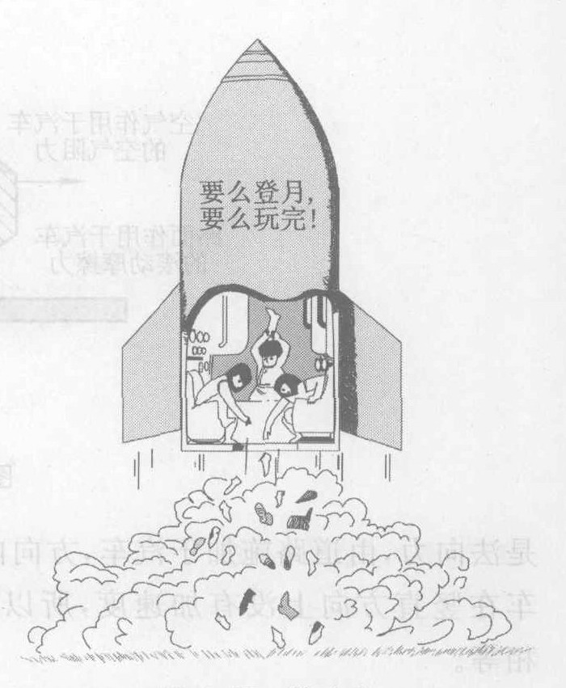

**图 4.17** 鞋动力。 (图中有文字：要么登月，要么玩完！)

> **概念检查 12** 一辆重 10 000 N 的汽车沿水平直路以 80 km/h 的不变速率行驶。空气阻力为 300 N，滚动摩擦力为 400 N。作用于汽车的合力是 (a) 10 000 N；(b) 9 300 N；(c) 10 700 N；(d) 700 N；(e) 不能确定，因为不知驱动力的大小；(f) 零。

> **概念检查 13** 在前一问题中，驱动力的大小和方向是 (a) 10 000 N，向前；(b) 700 N，向后；(c) 700 N，向前；(d) 400 N，向前；(e) 零。

---

### 概念检查答案

1.  当卵石撞击这一石块时，石块加速；因为石块质量很大，所以它的加速度很小，(c)。
2.  如果你敲打它们，牛顿运动定律告诉我们，质量较大的一个的加速度较小，(b)。
3.  (d)。
4.  加速度 = 力 / 质量 = $10\ \text{N} / 2\ \text{kg} = 5\ \text{m/s}^2$，(a)。
5.  现在合力是 $10\ \text{N} - 4\ \text{N} = 6\ \text{N}$，因此加速度 = $6/2\ \text{m/s}^2 = 3\ \text{m/s}^2$，(d)。
6.  (d)。
7.  质量和在地球上相同，但重量比在地球上小得多，(b)。
8.  (a)。
9.  (c)。
10. (c)。
11. (b)。
12. 因为加速度为零，合力一定也是零，(f)。
13. 由于合力是零，所以向前的驱动力一定等于向后的空气阻力与滚动摩擦力之和，(c)。

---

### 关键概念

下述概念的定义出现在所标页码的本书正文页面上和书末的按拼音排序的术语词汇中。我们将它们按出现先后顺序排列在这里，你可以用这个清单复习本章内容。

*   力 72
*   摩擦力 73
*   空气阻力 73
*   重力 73
*   惯性 75
*   质量 75
*   千克原器 75
*   千克 75
*   成反比 75
*   牛[顿] 76
*   合力 76
*   牛顿运动定律 77
*   重量 78
*   公制吨 78
*   法向力 79
*   力图 79
*   作用力与反作用力 80
*   作用力与反作用力定律 81
*   阻力 83
*   滚动摩擦力 83
*   火箭推力 84

---

### 复习题

1.  我们如何判断一个物体是否施力于另一物体？
2.  一个物体可以有力的吗？物体能够施力吗？物体可以是力吗？物体能够感受力吗？
3.  举出力的至少六个具体例子。尽量举有明显不同的例子。
4.  什么是阻力？给出两个例子。
5.  给出两个超距作用的力的例子。
6.  牛顿认为力会产生什么效果？亚里士多德怎么看？
7.  我们说一个物体比另一个物体具有“更大的惯性”，这是什么意思？
8.  如果你把一个物体从地球搬到月亮上，它的惯性变化吗？重量变化吗？质量变化吗？它的物质的量变化吗？它自由下落的加速度有变化吗？对 1 N 的力的反应有什么不同吗？
9.  两个力分别为 8 N 和 3 N，作用于一物体。若两力方向相反，合力是多大？若方向相同呢？
10. 物体的加速度永远与其速度的方向（即运动的方向）相同吗？如果不是，给出一个二者方向不同的例子。物体的加速度总是与作用于该物体的合力的方向相同吗？如果不是，给出一个二者方向不同的例子。
11. 当你加大作用于一个物体的合力时，这个物体的加速度会发生什么情况？如果合力增大到两倍，加速度如何？如果物体质量增大（例如给物体粘附加的物质），其加速度怎样变化？如果质量变为两倍，加速度会怎样？
12. 什么是重量？它和质量是一回事吗？如果不是，差别在哪里？
13. 描述一个在实验室里确定两个物体的质量是否相同的简单方法。这个方法在遥远的外层空间有效吗？在遥远的外层空间什么方法有效？
14. 求作用于质量为 1 N 的苹果上的重力。如果把这个苹果拿到月亮上去，它的重量还是 1 N 吗？
15. 画一个力图表示一个静止在桌面上的苹果所受的各个力。求苹果所受的合力。
16. 画一个力图表示火箭垂直起飞瞬间所受的力。哪个力最大？合力方向如何？
17. 在地球上，还是在月亮上，更由于容易抬起你的汽车？汽车的质量在哪里更大些？
18. 描述几个表明作用力与反作用力总是同时出现的实验。
19. 你对地球施加引力吗？你怎么知道的？这个力的方向怎样？
20. 写出与以下这些力对应的反作用力：作用于书的法向力，苹果的重量，球棒击垒球的力，垒球冲接球手手套的力。
21. 写出作用于“自推进”物体的力的四个例子。
22. 画一个力图表示作用于沿着平直道路行驶的汽车的力。如果汽车在滑行，这个力图有什么改变？如果在刹车，又将怎样？
23. 螺旋桨飞机与喷气式飞机的主要差别是什么？
24. 汽车保持恒定的速率时，汽车受到的向前的力与阻力相比哪个大？汽车加快时呢？减慢时呢？
25. 当汽车以恒定速率沿一条直路行驶时，向前的力（汽车向前运动的动力）是零吗？合力是零吗？加速度是零吗？速率是零吗？
26. 推动火箭的力与推动飞机和汽车的向前的力之间的主要差别是什么？

---

### 思考题

1.  当你沿着一条直线加快运动时，有什么力作用于你吗？当你沿着一条直线慢下来呢？你怎么知道的？
2.  如果你以不变的速率做圆周运动，是否有力作用于你？你怎么知道的？
3.  一个光滑的球在光滑的桌面上滚动。起初，没有水平的力作用于球。然后你拿一块磁铁靠近滚动的球，但你不清楚磁铁是否真的对球施加一个磁力？你怎样才能判断磁铁是否对球施加一个水平力？
4.  一颗高速子弹含有力吗？一块黄色炸药含有力吗？
5.  把书放在桌上，用锤子沿水平方向给书短促而有力的一击。忽略摩擦力。从你用锤子即将击到书时开始，描写这本书的运动。描写整个运动过程中作用在书上的合力的方向和大小。
6.  如果你对一个物体施加一个力，然后对同一物体施加三倍的力。在每个力的作用期间物体的加速度如何？
7.  竖直向上抛出一个重 8 N 的球。忽略空气阻力，求球向上运动期间所受到的合力的大小和方向。球的加速度是什么方向？在这种情况下合力与加速度的方向相同吗？它们能有不同方向吗？
8.  一个物体沿直线以不变的速率运动，这时是否没有力作用于它？请说明。是否没有合力作用于它？
9.  一个物体处于静止，这时没有力作用于它吗？请说明。没有合力作用于它吗？
10. 你站在地板上时，地板施力于你的脚吗？在什么方向？为什么这时你没有在这个方向上加速？
11. 你推一面坚固的水泥墙。你的推力是作用在墙上的唯一水平力吗？你怎么知道的？作用于墙上的合力是怎样的？
12. 一辆汽车由静止发动，沿笔直公路以 $1\ \text{m/s}^2$ 的加速度运动。另一辆汽车以不变的速率 120 km/h 赶超了它。哪辆车所受的合力更大？
13. 一辆 80 吨的卡车和一辆 1 吨的小汽车在笔直的公路上保持稳定速率 80 km/h。哪辆车受到的合力更大？哪辆车受到更大的法向力？
14. 一辆 80 吨的卡车和一辆 1 吨的小汽车在笔直的公路上保持稳定速率 80 km/h。哪辆车受到的驱动力更大？空气阻力更大？受到的合力更大？
15. 一个 3 kg 的石块静止在冰上。你用 60 N 的力踢它一下。假设没有摩擦力，求这石块的加速度。仍假设没有摩擦力，在你的脚与石块不再接触后，石块的加速度如何？此时这石块具有（非零的）速率吗？
16. 在前一问题中，设想石块在冰上滑动时有一个 6 N 的摩擦力作用于石块上。求作用于这石块的合力和石块的加速度。在你的脚不再与石块接触后，作用于石块的合力又会怎样？
17. 空中造型跳伞运动员内德重 600 N，质量为 60 kg。要有多大的空气阻力作用于内德，才能让他穿过空气下落时保持速率不变？
18. 在前一问题中如果没有空气，内德的加速度将有多大？
19. 一辆重 8000 N 的汽车沿平直的道路以 80 km/h 的不变速率行驶。车轮受的总阻力为 500 N。求作用于汽车的合力和汽车的加速度。
20. 在前一问题中，求作用于汽车的驱动力。
21. 你的体重拥有多少牛顿？
22. 1 吨羽毛和 1 吨铁，哪一个的质量更大？哪一个的重量更大？哪一个的体积更大？
23. 你是愿意有一块在月亮上重 1 N 的黄金，还是一块在地球上重 1 N 的黄金？或者它们并没有什么不同？
24. 你是愿意有一块在月亮上质量为 1 kg 的黄金，还是一块在地球上质量为 1 kg 的黄金？或者它们并没有什么不同？
25. 你们物理实验室的千克原器重约 10 N。在遥远的外层空间它们的质量和重量是多少？
26. 求一个重 2 N 的苹果在以下各种情形中所受合力的大小与方向（忽略空气阻力）；苹果拿在你手里不动；苹果正落向地面；苹果在你刚刚把它向上扔出后正在向上运动。
27. 你的手使一个苹果加速向上。苹果的重量与你手给它的向上的力哪个更大？如果你拿手里的苹果加速向下如何？如果你以不变的速度举起这个苹果又如何？如果你以不变的速度往下放苹果，那又怎样？
28. 使火箭离开月亮表面比离开地球表面更容易（换句话说，所需推力更小、燃料更少）吗？为什么？
29. 一个宇航员在月亮上捡起一大块岩石。如果他要在地球上捡起同样的岩石，那将会更容易，还是更难，或者都不是？
30. 一个宇航员在月亮上沿水平方向踢一块大岩石。如果他在地球上踢同样的岩石，略去摩擦的影响，那么此时他的脚的伤害是更大，还是更小，还是相同？
31. 略去摩擦力和空气阻力，是在地球上，还是在月亮上，还是在遥远的外层空间，使这本书以 5 m/s 的速率做水平运动更容易？
32. “行星地球被拉向上，朝着一块下落的大岩石运动，地球所受的拉力与这块大岩石被拉向朝着地球所受的拉力大小相同。”这句话是对应是错？为什么？
33. “行星地球被拉向一块下落的大岩石的加速度，与这块大岩石向地球运动的加速度相同。”这句话是对应是错？为什么？
34. 一辆大卡车在公路上抛锚，被一辆小汽车拖回城里。当以不变的速率行驶时，小汽车对卡车施加什么力吗？卡车对小汽车施加什么力吗？如果施力的话，这个力比小汽车对卡车所施的力是小还是大？
35. 一辆小汽车与一辆大卡车迎面相撞。哪辆车施加更大的力？哪辆车受到更大的力？哪辆车得到更大的加速度？
36. 步枪开火时，它使子弹在枪管中加速。解释为什么步枪一定会后坐。
37. 一个重 2 N 的苹果用绳吊在天花板上。写出作用在苹果上的两个力。每个力的大小如何？这两个力互为作用力与反作用力吗？如果不是，写出每个力的反作用力。
38. 一颗水平运行的子弹减慢下来。有什么东西对子弹施力吗？你怎么知道？子弹也对什么东西施力吗？你怎么知道？

39. 我把你推开（对你施力）吗？哪个力更大——或者说它取决于我们谁更重吗？
40. 投手手投掷垒球时，对垒球施加一个力，说明其反作用力。
41. 绳子拉着冲浪的人向前。说明其反作用力。
42. 我们知道，“重量”是力，而力是一种相互作用。就你自己的体重来说，与这种相互作用有关的两个物体是什么？
43. 说明作用于放在你手掌上的一本书的两个力。这两个力是大小相等方向相反吗？这两个力是作用力与反作用力的关系吗？
44. 继续前面的问题，假设你让这本书加速向上运动。有几个力作用在书上？这两个力还是大小相等方向相反吗？
45. 一个自由落下的苹果重量为 1 N，地球的质量是 $6 \times 10^{24}$ kg。地球作用于苹果的力有多大？
46. 在前一问题中，苹果施加于地球的力有多大？
47. 仍然继续前一问题，苹果的加速度有多大？如果苹果是唯一对地球有作用力的物体，苹果使地球产生的加速度。
48. 既然惯性定律说，保持一个物体以不变的速率沿直线运动不需要力，为什么汽车需要一个力维持行驶？
49. 你的汽车在平直的路上行驶时，你猛然刹车。画画出未刹车而关掉发动机滑行时汽车的力图。这两种情况下哪一种情况的合力更大？
50. 为什么蹬一辆硬的高压轮胎的自行车比蹬软的充气轮胎的自行车更容易？
51. 当你的脚放在汽车加速器踏板上时，你的车一定加速吗？它可能加速吗？它可能有一个向前的加速度吗？它可能有一个向后的加速度吗？
52. 任何汽车上都有三个加速装置。它们是哪些？每种装置给车什么加速度。
53. 一架喷气式飞机在地球大气层之外能加速吗？火箭驱动的飞机呢？
54. 磁力能使铁路列车悬浮在路轨上方一个小的告诉，从而使摩擦力可以实际上忽略不计。假设这样一列磁悬浮列车在一个把部分空气抽空的隧道内，从纽约到洛杉矶行驶。如果可以略去摩擦力和空气阻力，在行程的哪些部分有外加水平方向的力作用于列车？讨论这个力在每段行程上的方向。

---

### 习题

1.  你在水平路面上用 250 N 的力推动质量为 2 吨 (2 000 kg) 的车辆。求车辆的加速度。
2.  一个赛跑的人的质量是 60 kg。如果她的鞋与路面之间的摩擦力为 500 N，那么她的加速度有多大？
3.  为了让 60 kg 的赛跑者的加速度为 $8\ \text{m/s}^2$，他的鞋与路面之间的摩擦力该是多大？
4.  747 大型喷气式客机质量为 30 000 kg，沿跑道的加速度为 $4\ \text{m/s}^2$。它的四个发动机中的每一个该有多大推力？
5.  如果空气阻力是一个跳伞运动员体重的一半，那么这个跳伞运动员的加速度应是多少？如果空气阻力与跳伞运动员的体重相同，又会怎样？
6.  一个投手对 0.5 kg 的垒球施加多大的力，才能使其加速度为 $50\ \text{m/s}^2$？
7.  试求一颗 0.01 kg 的子弹在步枪枪管内以 $10^5\ \text{m/s}^2$ 的加速度（重力加速度的 100 000 倍！）加速时所受的作用力。
8.  一个重 20 N 的 2 kg 的花盆从窗沿掉下。为了使其下落的加速度为 $8\ \text{m/s}^2$，空气阻力该多大？
9.  一个 80 kg 的消防队员体重为 800 N。沿一竖杆滑下，加速度为 $3\ \text{m/s}^2$。作用于消防队员的摩擦力是多少？
10. 一只黑箱子和一只白箱子在地板上以同样的快慢被加速，虽然作用于黑箱子上的合力是作用于白箱子上的合力的四倍。哪只箱子的质量大，大多少？
11. 一个 70 kg 的赛跑者在 2 s 内从 $6\ \text{m/s}$ 加速到 $7\ \text{m/s}$。求赛跑者的加速度和在这段期间地面作用于赛跑者的摩擦力。
12. 一辆 1 吨 (1 000 kg) 的汽车受到 100 N 的空气阻力和 200 N 的滚动摩擦力。为了让汽车的加速度为 $0.5\ \text{m/s}^2$，路面必须对驱动轮施加多大的向前力？
13. 你穿着无摩擦的旱冰鞋，用 50 N 的力沿水平方向推一面墙。这面墙推你的力有多大？
14. 在前一题中，如果你的质量是 40 kg，你的加速度是多少？
15. 你的朋友（质量为 80 kg）和你（质量为 40 kg）都穿着无摩擦的旱冰鞋。你是静止的并且是你的朋友身后的。你用 60 N 的力推朋友的后背。你朋友后背推你的力是多大？
16. 在前一题中，你的加速度是多少？你朋友的加速度是多少？
17. 一辆质量为 1 000 kg 的小汽车，从后面撞上一辆原来静止的 60 000 kg 的 18 轮卡车，作用于卡车的力为 30 000 N。卡车作用于小汽车的力有多大？方向如何？
18. 在前一题中，求小汽车的加速度。这个加速度是“加快”型的，还是“减慢”型的？求卡车的加速度。它是“加快”型的，还是“减慢”型的加速度？
19. 你用 100 N 的力向下压一块放在桌上的重 40 N 的砖。这块砖作用于你手的力有多大？方向怎样？画一张像图 4.16 那样的力图，用箭头表示作用于砖上的每个力。
20. 在前一问题中，作用于砖上的合力有多大？再求桌子作用于砖上的力（大小与方向）。砖压桌子的力有多大？