# 第 5 章 牛顿心目中的宇宙

> **从我的枕头上，向前看**
> **借着月亮或星星的亮光，我能看到**
> **小教堂前厅，那里矗立着**
> **牛顿的塑像，带着他的棱镜和沉默的面容，**
> **这是一个心灵的永恒的大理石标志，**
> **这个心灵孤独地航行在陌生的思想海洋上。**
> ——华兹华斯，《序曲》，1850年

惯性定律可能是历史上最富成果的科学概念。它不但统一了地上和天上的自然运动，摧毁了亚里士多德观念的基础，提倡了普遍的自然法则的概念，并且导出了牛顿的运动定律，它还引导牛顿以新的方式看待一种特殊的力：引力。

因为引力在我们周围无时无处不在，以致我们难以觉察到它。这就使得科学家难以对它形成适当的概念。从亚里士多德时代到牛顿时代为止，人们都相信每个固体都有寻求地球中心的自然倾向，就像口渴的人寻求水一样。不需要外界影响（即力）来解释为什么物体会下落：它们下落是因为它们“想要这样”。但是，惯性观点认为物体“想要”的是保持它们的速度。笛卡儿首先形成了这种新运动观。这是一个不亚于哥白尼日心说的概念变革。

牛顿就是在笛卡儿的观念的基础上建立起他的大厦的。如果你相信物体有惯性，那你一定会问，为什么在地面上方松手放开的苹果会落下。牛顿给出的答案的适用范围不只限于苹果，它达到乃至超出了月亮，表明是同样的力在天上和地上起作用。我们生活在一个宇宙里，而不是两个。

第 5.1 节介绍牛顿万有引力定律的一般概念，第 5.2 节给出详细内容和几个例子。过去100年中一个重要的社会的和文化的发展，就是对我们的宇宙、我们的行星、生物和人类的起源及可能的未来的科学认识的增进。本书从第 5.3 节和第 5.4 节开始将在几个地方探究这些问题。第 5.3 节应用牛顿的引力概念去了解太阳和地球的起源以及太阳未来的最终引力坍缩。第 5.4 节讲述比太阳更大的恒星猛烈的引力坍缩以及由坍缩产生的古怪天体。第 5.5 节、第 5.6 节回到我们的主题，对牛顿物理学和后牛顿物理学进行比较：第 5.5 节考查牛顿物理学的广泛含义，特别是“机械论宇宙”；第 5.6 节从近代物理学的角度，指出牛顿物理学的局限性。

---

## 5.1 万有引力的观念：苹果和月亮

牛顿 22 岁时在英国剑桥大学取得了学士学位。他受邀留校，但是由于瘟疫流行，校园随后关闭了 18 个月，于是这位毕业生回到了自家的农场。在这 18 个月里，牛顿奠定了万有引力理论和光的理论的基础，并在剩余的空闲时间里发明了微积分。

有人说，伟人在一定程度上是时代的产物。牛顿生活在一个在文化上已经为新的宇宙观做好准备的时代。哥白尼、第谷、开普勒、笛卡儿和伽利略已经奠定了科学基础。我们已经看到，笛卡儿和伽利略的惯性观点很自然地导出了牛顿运动定律。有关运动定律的概念与哥白尼和开普勒的天文学相结合，就引导牛顿发现了万有引力定律。正如牛顿自己所说，他站在“巨人的肩上”。

按照牛顿在晚年时所描述的，当他在自家农场期间，看到一个苹果从树上落下，而他同时又能都在天上看到月亮时，他产生了万有引力定律的概念。苹果和月亮除了两者大致都是圆的以外，很难想象还有比它们差异更大的东西了。一个在地上，另一个在天上；一个很快腐烂，另一个则似乎是永恒的；一个掉到地上来，另一个则高悬在天空。然而，就在别人只看到差异的地方，牛顿看到了相似性。

> 当每个人都看到月亮不往下掉的时候，只有牛顿看到月亮正在往下掉。
> ——瓦莱里，法国诗人与哲学家，1871—1945

我们来追随牛顿的思路。图 5.1 表明一个落向地面的苹果，它由地球引力的拖拉而加速。苹果的速度、加速度和引力的方向，都如图所示向下指向地心。月亮的运动则完全不同，它的速度的方向平行于地球表面而不是指向地心。但我们感兴趣的是作用在它们每一个之上的力，而按照惯性观点，力产生加速度而不是速度。

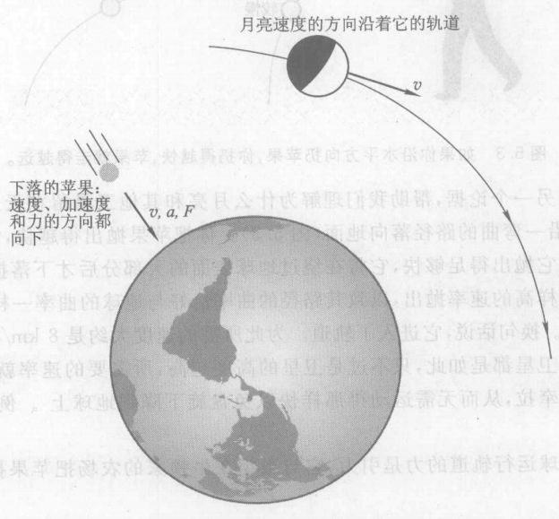

*图 5.1 表明一个落向地面的苹果，它由地球引力的拖拉而加速。苹果的速度、加速度和引力的方向，都如图所示向下指向地心。月亮的运动则完全不同，它的速度方向平行于地球表面。*

因此，尽管它们的速度完全不同，但作用于它们二者的力仍可能相似。这些力有何相似之处呢？

亚里士多德会说，月亮做圆周运动不需要力，因为这是它的自然运动。然而惯性观点则认为，为了使月亮偏离直线运动，必须有一个力作用于它。这个力在什么方向？如果月亮在 图 5.2 中的 $A$ 点，而且如果没有力作用于它，它会沿直线向 $B$ 点运动。然而，实际上它沿圆周运动到 $C$ 点。由图 5.2 你可以看到，把月亮向内拉从而使它到达 $C$ 点而不是 $B$ 点所需的力也指向地心，就像作用于苹果上的力一样。

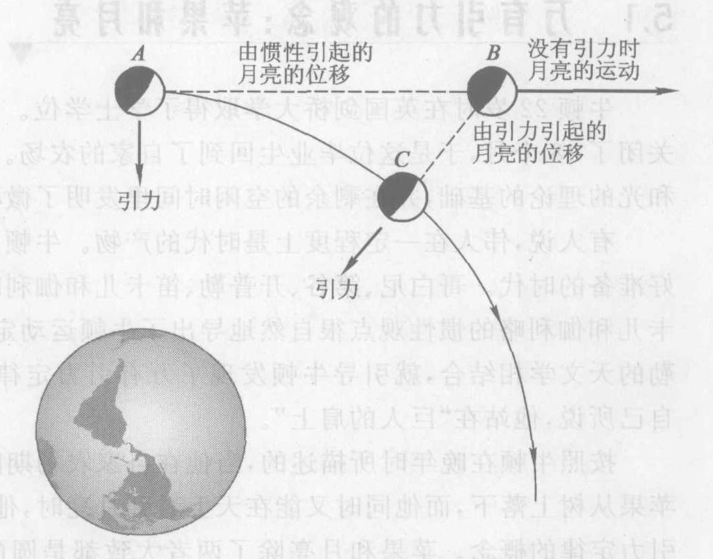

*图 5.2 一个向内的力把月亮维持在它的轨道上*

牛顿假设这个力与拉苹果向下的力的来源相同，都是地球的引力。因为作用于月亮的力是向内指向地心的，由牛顿运动定律可知，月亮的加速度也一定向内。

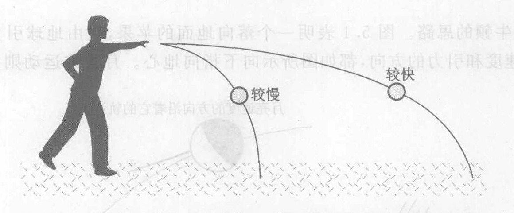

*图 5.3 如果你沿水平方向扔苹果，你扔得越快，苹果就走得越远。*

牛顿还给出了另一个论据，帮助我们理解为什么月亮和其他卫星留在天上。如果你水平抛出一个苹果，它将沿一弯曲的路径落向地面（图 5.3）。你把苹果抛出得越快，它落地之前就会走得越远。如果你把它抛出得足够快，它将在绕过地球表面的大部分后才下落撞击地面（图 5.4）。如果这个苹果以这样高的速度抛出，以致其路径的曲率恰好与地球的曲率一样，那么它的下落就是绕着地球兜圈子。换句话说，它进入了轨道。为此所需的速度大约是 8 km/s，或 29 000 km/h。任何沿轨道运行的卫星都是如此，只不过是卫星的高度越高，所需要的速率就越小，这是因为它们受到较小的引力牵拉，从而无需运动得那样快以免盘旋下降到地球上。例如，月亮的速率只有大约 1 km/s。

形成月亮绕地球运行轨道的力是引力，它与当年在牛顿家的农场把苹果拉向地面的重力是同样的力。

在这许多方面都是一个富有想象力的飞跃。难以相信有什么东西在拉月亮，更不用说它可能是拉苹果的那同样的力了。最难以想象的还是这个引力居然能跨过大约 400 000 km 的虚空（牛顿时代已经知道这个距离）起作用。两个物体直接接触时很容易想象它们相互有作用力，但是跨越这样大的距离的力显得不可思议。

> **概念检查 1**
> 一个重 2N 的苹果从树上落下。略去空气阻力，当其自由落下时，作用于它的合力是 (a) 零；(b) 2 N 向下；(c) 2 N 向上。

> **概念检查 2**
> 在前一问题中，苹果的加速度是 (a) 零；(b) 不能根据所给的信息确定；(c) 大约 10 m/s², 向下；(d) 大约 10 m/s², 向上。

> **概念检查 3**
> 假定像图 5.3 和 5.4 那样水平抛出一个重 2 N 的苹果。略去空气阻力，当苹果处于图中所示位置时，作用于它的合力是 (a) 零；(b) 2 N, 向前（沿着运动方向）；(c) 2 N, 向下（向着地心）；(d) 2 N, 向上（离开地心）；(e) 不能确定。

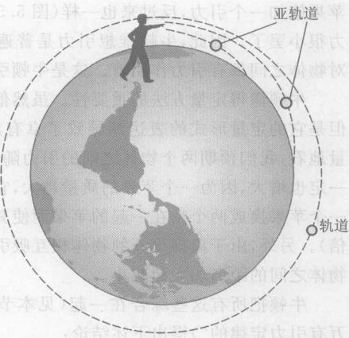

*图 5.4 物体环绕地球下落。如果你把一个苹果扔出得足够快，它将绕过地球表面的很大一部分才落下，甚至将进入轨道。与这个图相似的图出现在牛顿的笔记本内。*

> **概念检查 4**
> 概念检查 2 和概念检查 3 中的合力相同（包括大小和方向）。那么，图 5.3 和 图 5.4 中苹果的加速度的数值和方向必定是怎样的？(a) 零；(b) 从给定的信息不能确定；(c) 约为 10 m/s², 向前；(d) 约为 10 m/s², 向下；(e) 约为 10 m/s², 向上。

---

## 5.2 万有引力定律：推动最远的星球

既然地球的引力把月亮保持在其轨道上，那就可以合理地假设一切卫星——围绕更大的天体运行的物体——是由那些更大的天体所施的引力保持在它们的轨道上的。因为行星是太阳的卫星，所以牛顿对月亮的精辟见解也解决了为什么太阳系这样运行这个老问题！行星根据惯性定律保持向前运动，而太阳的引力则把它们的轨道弯成椭圆（拉长的圆）。同样，木星的卫星是由木星的引力保持在它们的轨道上的。按照作用力与反作用力定律，每个卫星也一定反过来拉更大的物体。引力作用在两个物体上。

但是，有什么理由说引力只作用于天体与其卫星之间呢？例如，说在地球与火星之间存在引力，这似乎也有道理。这种行星之间的力在牛顿时代还从未被注意到，但是牛顿认为这只是因为它比太阳作用于行星的力小得多的缘故。同样，任意两个天体之间，哪怕是两个最远的星体之间，也应该有引力。

但是为什么引力只限于天体呢？为什么地球上如橙子、岩石等较小的物体之间没有引力作用呢？比方说，你的物理书不应该对苹果施加一个引力，反过来也一样（图 5.5）。你没有注意到这个力，不过是由于这些物体之间的力很小罢了。因此，牛顿推想引力是普遍存在的，宇宙中的每一个物体都对其他物体施加引力。这是牛顿引力理论的中心思想。

> 什么使行星环绕太阳运行？在开普勒时代，一些人对这个问题的回答是，行星后面有天使在扑动他们的翅膀，推动行星沿轨道运动……这个答案离真实情况并不算太远。唯一不同的是，天使坐在不同的方向上，并且他们的翅膀是向里推的。
> ——费曼，物理学家

牛顿懂得定量方法的重要性。虽然他的基本洞识是定性的，但是它的定量形式的表达却导致了卓有成效的解释和预言。定量地看，我们预期两个物体之间的引力随着每个物体质量的增大一定也增大，因为一个苹果的质量越大，它的重量也越大（如果把一个苹果换成两个粘在一起的苹果而使其质量加倍，其重量也加倍）。另外，由于离得很开的物体相互吸引不强，因此引力应该随物体之间的距离加大而减小。

牛顿把所有这些综合在一起（见本书节末尾“我们是怎么知道万有引力定律的”）得出下述结论：

> **牛顿万有引力定律**
> 任何两个物体之间都有一个吸引力，这个力的大小与这两个物体质量的乘积成正比，与两个物体之间的距离的平方成反比，即
> $$ 引力 \propto \frac{(第一个物体质量) \times (第二个物体质量)}{两个物体之间距离的平方} $$
> $$ F \propto \frac{m_1 m_2}{d^2} $$
> 如果质量以 kg 为单位，距离以 m 为单位，引力以 N 为单位，那么这个比例式就变成
> $$ F = \frac{6.7 \times 10^{-11} (m_1 \times m_2)}{d^2} $$

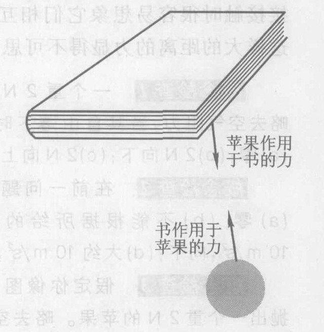

*图 5.5 甚至通常大小的物体也相互施加引力。你的物理书对苹果施加一个力，反之亦然。这个力很小，但是这样的力已经被测量到。*

作为一个例子，看看你的体重，即地球对你的引力。万有引力定律表明，这个力正比于你的质量与地球质量之积，这就是说这个力与两个质量分别成正比。因此，你的质量加倍会使你的重量也加倍，你的质量变成三倍，你的重量也变成三倍，依此类推——这看来很有道理。然而，万有引力定律也告诉我们，如果你想象用某种手段使地球质量加倍（而不改变地球的大小），也会使你的重量加倍；使地球质量减半，也会使你的重量减半，依此类推。你可以减轻体重而无须节食或锻炼：只要减小地球质量就行了！如果两者的质量都改变了又会怎样呢？例如，假设你使自己的质量变成三倍，同时使地球质量变成两倍。因为引力正比于两个物体质量的乘积，所以你的重量变成六倍。

> 在地球上摘朵花，你就移动了最远的星球！
> ——狄拉克，物理学家

> 只有把牛顿万有引力定律的内在矛盾和哲理含义揭示出来，人们才能认识到把万有引力用作宇宙学的基本概念所需要的巨大勇气，或者说梦游者的自信。在思想史上的最后一次鲁莽、最彻底的普遍化概括中，牛顿用相互连接的吸力填满宇宙的整个空间，这些力由物质的所有微粒发出，穿越无边无际的黑暗深渊，作用到物质的所有微粒上。
> ——A. Koestler, 作家和哲学家，引自《梦游者》

当地球与你之间的距离变化时又会怎样？实际上，这时物体之间的距离到底是什么意思呢？从地球到你身体的距离是指从地球的近侧（你脚下的地面），还是从地球的远侧，还是从地心，或别的某个点量起？这个距离又应该量到你身体的哪一点呢？牛顿用了大量的数学回来回答这个问题，事实上他需要发明积分运算才能解决这个问题。牛顿的答案是，把万有引力定律应用于两个扩展的物体时，该用的正确距离是两个物体的“中心”之间的距离。对于像地球这样具有明显的中心的物体，距离由这个中心量起。对于其他物体，如你自己的身体，这个距离应当从物体的平衡点（重心）量起，所谓平衡点就是在引力作用下身体各部分会在这点得到平衡。但是由于你的身体比从地球中心到你的身体之间的距离小得多，选取身体的哪一点就无所谓了。

设想你离开地球。因为引力与你和地球之间的距离的平方成反比，所以距离增大通过会使引力减小。这是减轻体重的另一个方法！（不幸的是，实际上正是我们的质量而不是我们的重量才是我们当中某些人愿意减少的。）例如，在珠穆朗玛顶（大约海拔 10 km），你的体重比在海平面减少 0.3%。如果你的体重在正常情况下是 600 N，在珠穆朗玛峰顶便将是 598 N。低轨道人造卫星所在的几百千米的高度上，你的体重会减轻更多。例如，在 200 km 高度，你的体重会减轻 6%，此时一个正常情况下体重 600 N 的人仅重 560 N。这时，你当真失去了重量（但不是质量！）。

上升到更高的高度，假定你处在地面以上 6400 km（即地球半径）的高度上。这时你的重量是多少？万有引力定律中的比例关系使这个问题变得很容易。如果你升高到离地面一个地球半径的地方，那么从地心到你身体的距离将比通常的距离增加一倍，所以距离的平方就要乘 4。由于力与距离的平方成反比，所以力将除以 4。你的体重只是地面值的 1/4。图 5.6 是你在离地心的不同距离上（以地球半径为单位）的体重。无论你离地球多远，地球作用于你的身体的引力绝不会正好变为零。但是离得很远，引力就会变得很小。例如，在 10 个地球半径处，你的体重是地面上体重的 1%。

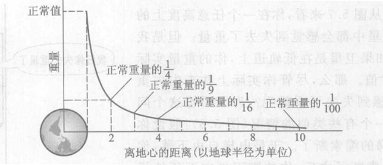

*图 5.6 你在离地心不同距离处的体重。同一图适用于任何物体的重量。*

引力刚好以这种方式随距离增大而下降，这对我们来说是一件大好事。如果引力下降得再快一点，行星就不会在椭圆轨道上运动，而是按螺旋线路径飞进太阳，我们就不会在这里讨论引力之类的问题了。另一方面，如果引力下降得更慢一点，那么来自远方星球的引力将会超过来自地球的引力，我们也不会在这里了。这个问题是该思考的。

万有引力定律可以用来计算从苹果和书到星星和月亮的任意一对物体之间的引力。例如，相距 1 m 的两个 1 kg 质量之间的引力可以通过将这些数值代入万有引力公式而求得。答案是 $6.7 \times 10^{-11}$ N，或 0.000 000 000 067 N！难怪普通物体之间的引力难以探测到了。测量如此微小的力所需的精密实验一直到牛顿的工作之后大约一百年才完成。这些实验证实了牛顿的预言。

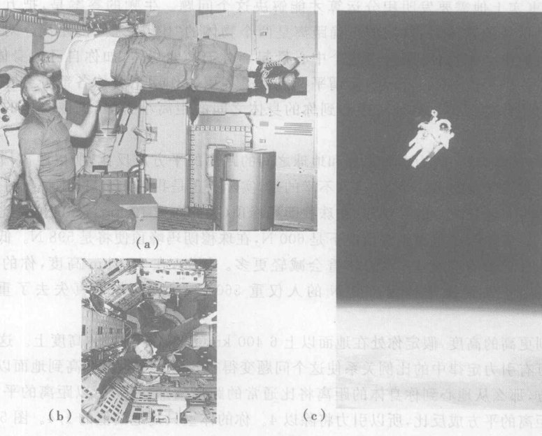

*图 5.7 空间旅行者在轨道上运行以及在穿过空间自由“下落”的任何时候会感觉到失重。(a) 平衡；(b) 飘浮；(c) 空间行走。*

在一个沿轨道飞行的人造地球卫星内发生的情景似乎令人费解。从图 5.7 来看，你在一个任意高度上的绕轨道运行的卫星中都会感觉到失去了重量。但是我们从上面看到，如果卫星是在低轨道上，你的重量实际上只略小于通常值。那么，尽管你实际上并未失去重量，你为什么会感到失去了重量呢？为了回答这个问题，让我们设想一个有些类似的情况（图 5.8）；假设你在电梯里，而电梯的缆索断了。于是电梯自由下落，你也自由下落。缆索断了之后，你的脚不再向下压地板了。如果你试着用脚压地板，你只会推着自己离开地板。粘在你脚底的磅秤的读数会是零，因为你的脚不再向下压它。你看起来好像是没有重量了，但是因为我们已经定义重量为地球作用于物体的引力，你实际上并不是没有重量。虽然你实际没有体验过（我希望如此）自由落下的电梯内的情景，但你在快速越过滑轨顶部的过山车里可能体验过类似的“失重”效果。

基于你在自由落下的电梯内会觉得失重的同样的道理，你在沿轨道运行的卫星中也会感觉失重。在前一节我们看到，卫星是在绕着地球自由下落。不管你是在卫星内，还是在卫星外的空间内，你也都在绕着地球自由下落。由于你和卫星都在绕着地球下落，因此你就感觉到了失重状态。你的身体的行为好像是它已脱离了重力的作用，然而你实际并未失重。

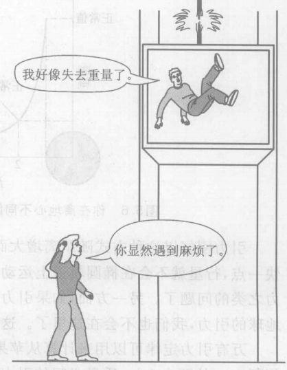

*图 5.8 在自由下落的电梯中自由下落，你显然遇到了麻烦。*

**我们是怎么知道万有引力定律的？** 牛顿是怎样证明他设想的万有引力定律的呢？与质量的依赖关系是不难推知的。因为一个物体的重量正比于其质量（如两个相同的苹果粘在一起的重量肯定是一个苹果的两倍，因而质量加倍使重量加倍），牛顿据此推论引力一定正比于两个质量中的每一个。

但是对距离的依赖关系呢？牛顿知道，到月亮的距离大约是地球半径的 60 倍（图 5.9）。于是，牛顿假设的万有引力定律就意味着在月亮距离处的一个物体将受一个引力，它是同一物体在地球上所受重力的 $1/3600$ ($1/60^2$)。因此，由于加速度正比于力，这个距离上的加速度应当是向地面的物体的加速度的 $1/3600$。换言之，牛顿的假设意味着，月亮的加速度应该是 $(1/3600) \times 9.8\ \text{m/s}^2$，或 $0.0027\ \text{m/s}^2$。另一方面，由已知的到月亮的距离，以及月亮绕地球一周要 27 天这一观察事实，牛顿可以直接算出月亮的圆周运动的加速度实际上是 $0.0027\ \text{m/s}^2$。牛顿的假设与观察结果一致。

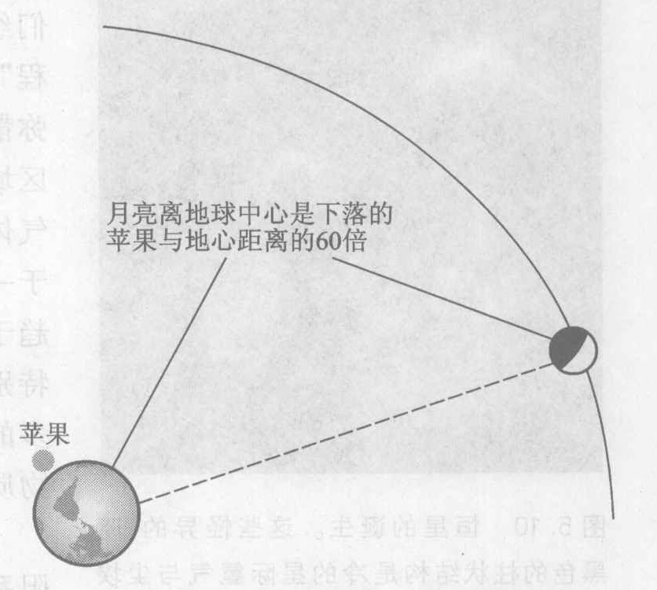

*图 5.9 月亮离地心的距离有60个地球半径。*

> **概念检查 5**
> 假如你在遥远的太空，远离一切行星和恒星，在你面前放一个苹果和一本书，让它们静止，相隔 1 m。然后你离开它们一定距离，为的是观察这个苹果和这本书而不影响它们。这个苹果和这本书将会 (a) 彼此相向很慢地加速；(b) 彼此相向很快地加速；(c) 彼此相向运动而无加速；(d) 保持静止；(e) 向海滩进发。

> **概念检查 6**
> 当你在飞得很高的喷气机中时，(a) 你的重量和质量都正常（与地面上相同）；(b) 你的重量和质量都比正常值小；(c) 你的重量正常，而质量小于正常值；(d) 你的重量小于正常值，而质量正常。

> **概念检查 7**
> 在地面上方两倍地球半径的高度处，你的重量是 (a) 零；(b) 不知道地球半径，从而不能算；(c) 与地面上的重量相同；(d) 你在地面上的重量的 1/3；(e) 你在地面上的重量的 1/4；(f) 你在地面上的重量的 1/9。

> **作出估计**
> 地球的质量约为月亮的 100 倍，地球的半径约为月亮的 4 倍。根据这些信息，用万有引力定律迅速估计物体在地球上的重量与它在月亮上的重量相比要重多少倍？①

*① 在万有引力定律表达式中，质量中有一个乘以 100，而 R 乘以 4。于是 F 乘以 $100/4^2 = 100/16$，或者大约是 6。因此你在地球上的重量是在月亮上的重量的 6 倍。*

---

## 5.3 引力坍缩：太阳系的演化

牛顿物理学的一个重要的社会和文化成果就是当它与近代天文学研究结合时，它帮助了我们了解我们的起源，特别是我们的太阳系和我们的行星的起源。

像你和我以及其他万物一样，星星有一个开端，它们经历种种变化，并且有一个终结。这个“星体演化过程”背后的驱动力就是引力。恒星主要是由遍布宇宙的弥散的（稀薄的）气体（主要是氢原子）形成的。在某些区域，这种物质碰巧聚集得稍微密集一些，形成巨大的气体云。这些气体云便是恒星的发源地（图 5.10）。由于一切物质小块之间的吸引力，空间的所有气体和尘埃趋于集聚。如果气体云内偶然有一个地方物质集聚得特别稠密，这个地方就能成为一个引力中心。若有足够多的物质落入这个中心，它就能变成一颗新恒星。这种物质下落集聚到一起的现象，叫做**引力坍缩**。

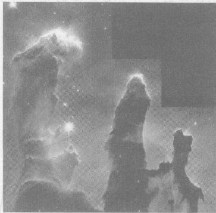

*图 5.10 恒星的诞生。这些怪异的、暗黑色的柱状结构是冷的星际氦气与尘埃柱，也是新恒星的温床。它们是鹰状星云的一部分，而这个星云是本星系中与我们邻近的恒星生成区域。这个区域离我们这里要走 7000 年（即光从哪里到我们这里要走 7000 年）。最高的柱状物（左边）从底到顶大约有 1 光年，这个距离大约是我们太阳系的直径的 800 倍。这是图 1.2(a) 中的哈勃空间望远镜所拍摄的许多美丽而且带给我们大量信息的照片之一。*

太阳系和地球就是这样诞生的：大约 50 亿年前，太阳系，包括你身体内的原子，只是太空中一团冷的气体和尘埃云，这团云比现在的太阳系大几千倍。随后云团内某一部分物质偶然集聚得比其他地方稠密。这个物质团块把周围的物质吸向自己，使团块的质量更大，这增大了它的拉力，这又使团块具有更大的质量，如此下去。这个自我加强的过程一直持续到原来的云团形成一个比我们的太阳系大的巨大气体球为止。我们的气体球继续自动向内收缩。随着中心的质量变得更大，新气体以越来越大的速率被拉向内部。气体球中心的原子以越来越高的速率碰撞。换句话说，中心处的气体变热。

每团气体云都有一些自转，这不过是它的无序流动和涡动的净效果。随着我们的气体云团的收缩，这个自转加强了，就像一个花样滑冰运动员把伸展的手臂收拢时转得越来越快一样。由于持续的收缩，这一自转快到足以使气体球的外缘区域变得扁平成圆盘状，就像旋转一个生面团可以使它变扁平成为比萨饼坏。圆盘外围区域内的一些气体旋转得足够快，进入轨道，环绕更大的中央球旋转。因为它在轨道上旋转，当中心坍缩时，这部分物质就留在轨道上。外缘区域一直继续做轨道运动，一面冷却、凝结和集聚成团，这些团块就变成地球和其他行星（图 5.11）。

随着变热的太阳热到发光，向外涌流的光扫走了原来充满太阳系的尘埃和气体。于是，地球上就有了光。

中央球继续坍缩、变热，直到中心达到百万摄氏度的高温。在这样高的温度下新情况发生了：原子相互猛烈碰撞，以致它们电子被剥掉，留下了由氢的裸原子核和电子组成的气体。猛烈碰撞的氢原子核偶尔也粘在一起，这个过程叫做**核聚变**（第 16 章）。核聚变产生大量的热，而由热产生的压力这时就阻止气体球不再进一步坍缩。随着太阳在大约 50 亿年前开始了核聚变，它就点燃了自己，并成为一颗正常的、自持的恒星。类似的恒星诞生过程在整个宇宙中始终不停地进行着。星空不是静止不变的。

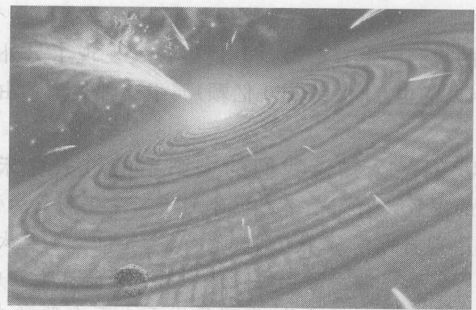

*图 5.11 太阳系形成过程中新生太阳的虚拟图。尘埃部分地遮掩了太阳。彗星疾驰而过，一颗行星（前景）开始由尘埃形成。*

太阳一旦停止坍缩，就进入了中年期，至今已持续近 50 亿年了。这一阶段的长期稳定，使太阳系中一个行星上的原子有可能聚集并演化成像我们自己这样的高度复杂的形式（第 12 章）。与太阳系其余部分一样，我们来自宇宙。

然而，恒星会死亡。在几十亿年时间后，我们的太阳的氢燃料的供应必将枯竭，直到大约公元 5 000 000 000 年，它将不再支持其中央“核心”内的核聚变。这时太阳将进入老年期。虽然在太阳的中心附近核聚变将停止，但由氢构成的薄外壳将继续这个聚变过程，使太阳变亮并膨胀到它现在大小的三倍。这个增大的能量输出将使地球上的海洋蒸发，也许还要引发一个失控的温室效应（第 9 章），这能使地球比金星的 500 ℃ 更热。在随后的几亿年中，太阳将变得更亮而且变大 100 倍，使地球温度升高到大约 1000 ℃，从而杀死任何残留的生命。

同时，中央核的温度将变得更热，足以引发新的更热的涉及氦元素的核反应，这些氦是在太阳的氢聚变过程中生成的。然后太阳将作为一个燃烧氦的恒星度过 1 亿年。接着是另一场灾难。在它的氦耗尽后，太阳将再次膨胀、变亮，并且将其外层喷出形成一个巨大的灼热发光气体的壳，这个壳将向外膨胀，吞没所有的行星，向外飘出太阳系，进入星际空间。在这 100 万年之后，太阳将完全耗尽其能源。

引力将最后再表现一次。没有了核能热源，就没有多少东西可以阻止太阳自身向内坍缩了。支撑固态物质反抗地球上的外界压力的原子间的力实在太微弱，完全承受不住恒星最后的坍缩中巨大的向内的引力。太阳将把自己挤压到远小于其现有的边界，远小于如果恒星是由普通固体物质构成的话它所有的体积，把它的原子挤压到认不出来，直到只剩下一个由裸原子核和不属任何原子的电子填塞得密密实实的一个固态球。到了这一步，坍缩将因电子之间的所谓量子交换力②的作用而永远停止。

太阳死后留下的残骸是热的和固态的，与地球差不多大，或者说是它现在的体积的百万分之一！它将极其致密，每立方厘米中有许多吨物质。在地球上，甚至一张坚固的钢台也支撑不住仅仅一小撮这种物质。太阳在其最后的坍缩中急剧变热，但是一旦坍缩终止就不再有热源了。这个明亮的残骸将短暂地发出耀眼的光，然后慢慢变暗，像一块正在熄灭的余烬，其周围依然有被烧毁的地球和其他行星的残骸环绕它运行。

*② 牛顿物理学不能解释量子交换力。这种力要比维持通常的固体物质的刚性的通常的电力强得多。*

一颗只有地球这么大的恒星？当这样一个天体在 1862 年首次被发现时，天文学家认为他们的观测一定有错误。但是很快发现了另外两颗这样的恒星，现在已经知道在本星系中有约 4% 的恒星（大约 160 亿颗）属于这种类型。由于它们发白炽光，我们管它们叫**白矮星**。

**我们怎么知道我们的太阳系的过去和未来？** 详尽的定量的恒星演化理论预言了刚刚勾画的图景。对处于上面描绘的不同演化阶段的恒星的观察结果，和对地球上最古老的岩石、月亮、月亮上的岩石、陨石、其他行星、其他卫星及太阳本身的所有观察结果，都支持这些理论。

寻找恒星诞生的自然场所应当是在太空的厚气体云中。当哈勃空间望远镜搜索名叫鹰状星云的稠密气体云时，发现了成千上万个新形成的恒星（图 5.10）。正如理论预言的那样，几乎所有这些新恒星都被包在尘埃和气体的圆盘中，预期这些圆盘最终将聚合成行星。

> **概念检查 8**
> 假定明天太阳坍缩成为一颗白矮星，但是不发生任何会改变太阳质量或直接影响地球的爆炸或膨胀，那么下面的哪些情况将会发生？(a) 地球的轨道将会改变；(b) 地球上的生命将受到根本性的影响；(c) 太阳施加于地球的引力会发生根本性变化；(d) 太阳的辐射会根本改变；(e) 上述情况全都没有。

## 5.4 引力坍缩：质量更大的恒星的死亡

恒星的生命历程主要由它的质量大小决定。首先，一颗星星的质量大小至少要有太阳质量的 10%，才能热到足够引起核聚变反应，变成一颗恒星。一切质量大得足以引起核聚变的恒星都要经历一个类似于太阳现在状态的中年期。然后，当它的中央核心内的氢燃料用完时，就进入最后阶段。质量在大约十倍太阳质量以下的恒星经历的最后阶段与太阳的类似，以白矮星结束它们的生命。

> 我的猜疑是，宇宙不仅比我们所设想的更古怪，而且比我们所能想象的还要古怪。
> ——霍尔丹，英国遗传学家，1892—1964

然而，很不相同的命运等待着质量更大的恒星。和太阳一样，它们用完了它们的氢燃料之后其中心收缩。但是由于它们的质量更大，使得收缩更强，从而其中心变得更热。这样的高温引发多种核反应，最终把恒星的小中央核心变成固态的铁。这使这颗恒星陷入更严重的麻烦。铁不断生成，直到内核的质量变得如此之大，以致不能承受自身的重量。于是，整个固态铁核心便在仅仅 1 秒钟内突然坍缩！随着核心的坍缩，这个不可想象的灾变过程把星体的其余部分炸得飞向太空，这个事件叫做一次**超新星**爆发。1604 年以后，在本星系中没有看到过超新星，但是今天的天文学家能在别的星系中经常发现它们。最近的一次爆发出现在 1987 年，肉眼可以看到它（图 5.12）。它发生在一个邻近的小星系，该星系在离我们 150 000 光年（即光从那里到这里要 150 000 年）的安全距离处。一个邻近的超新星，如果近到离我们只有 10 光年左右，它产生的各种辐射将会在地球大气中引发一场不可思议的焰火表演，很快就杀死地球上的一切生命。但是别为此担心：这样的事件不会在银河系中我们这个角落发生，因为超新星的候选者的质量至少必须是太阳质量的 10 倍，可是没有住何质量这样大的恒星距离我们很近，近得足以伤害我们。离我们最近的一个可能的候选者是参宿四（猎户座 $\alpha$），它的不稳定活动已经有年头了。不过它离我们有 430 光年，这个距离已是安全的了。

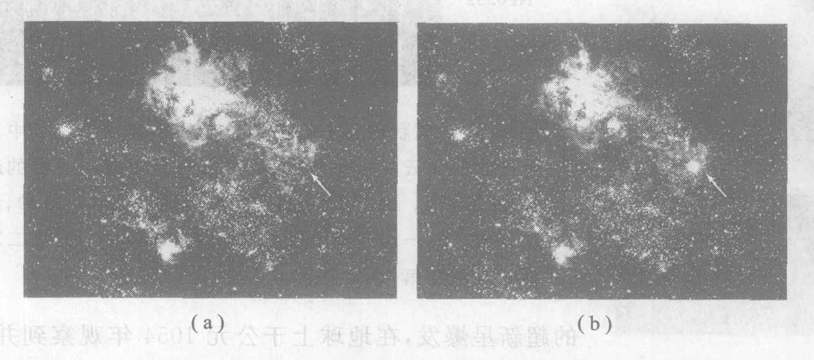

*图 5.12 1987年的超新星，它是 400 年间最亮的一颗超新星。它发出的光于 1987 年 2 月 23 日到达地球。(a) 和 (b) 两幅照片分别显示其爆炸前和爆炸后不久的情况。这颗超新星就是 (b) 图中右侧的那颗亮星。*

爆发后，原来的恒星仅有 10%～20% 留存下来。在这个残骸中不能发生进一步的核反应，因此就没什么东西能够抗拒向里的引力。这个恒星残骸进入了它最后的坍缩。如果原来的恒星质量大到太阳质量的 10 倍到 30 倍，那么它的最后坍缩非常强烈，电子交换力（上节）已经太微弱而不能使它停止。剩下的唯一能使坍缩停下来的力是所谓“中子交换力”，它是与电子交换力类似的一种量子效应，不过作用于中子之间。坍缩不仅把原子挤压得不复存在，而且也把电子挤压得迫使它与原子核内的质子合并而不复存在。这就把每个原子核变成一堆中子的集合，而使整个恒星变成一个类似于由中子组成的巨型原子核的天体。这种天体叫做**中子星**。

> 霍拉旭：哎哟，真是不可思议的怪事！
> 哈姆雷特：那么你还是用见怪不怪的态度去对待它吧。霍拉旭，天地之间有许多事情，是你的哲学里梦想不到的呢。
> ——莎士比亚，《哈姆雷特》第一幕，第五场（朱生豪译文）

原子核物理学家奥本海默（他后来因领导原子弹研制工作而出名，见第 16 章）于 1938 年预言了中子星。但一直没有发现过，直到 1967 年，英国的一位目光敏锐的天文学研究生乔丝琳·贝尔（图 5.13）发现了太空中的一个射电波源，它每 1.3 秒发出一串“嘟嘟声”或“脉冲”。有些科学家开始以为她可能发现了来自地外文明世界的无线电导航信号。然而很快又发现了另一个，迄今已经知道上百个这样的射电波源，其脉冲频率的范围很宽。没有什么可怀疑的，它们就是中子星。

中子星使人印象十分深刻。虽然它的质量比太阳更大，但它的直径却只有几千米，每 $1\ \text{cm}^3$ 中塞有 10 亿吨物质！一丁点儿这种物质，在地球上其重量将与一辆满载的大卡车相同！坍缩的铁核在其一秒钟的坍缩过程中转得越来越快，以至于残留的中子星以质量如此巨大的物体难以置信的速率自转，可以快到每秒几百周。这种自转与磁效应结合，就产生了在地球上观测到的可见光和无线电信号的快速脉冲，贝尔 1967 年发现的就是这种信号。在地球上看，整颗星在 1 秒钟内闪亮和变暗多次。图 5.14 是一个照片序列，显示两个可以看见的闪光。产生这颗中子星的超新星爆发，在地球上于公元 1054 年观察到并有记载*。在几天时间里，爆发产生的光比金星还亮。被爆炸吹散到空间的气体形成的星云状的晕，形如螃蟹，因此今天称之为蟹状星云。

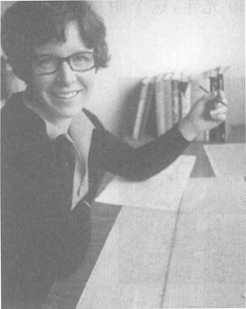

*图 5.13 乔丝琳·贝尔发现了第一批四颗中子星。作为她的博士学位论文工作的一部分，她协助建立了一台射电望远镜。贝尔用这台射电望远镜检测到一组出现时间间隔非常规则的快速脉冲。她确定出这个不寻常的射电波源相对于恒星的位置保持不变，这意味着它处于太阳系之外。在随后的几个月里，她又发现了另外三个脉动的射电波源。后来确认它们都是快速旋转的中子星。*

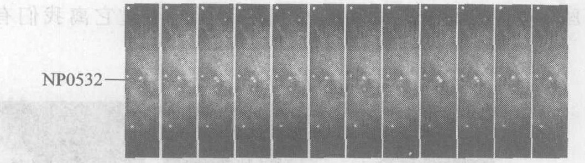

*图 5.14 蟹状星云中心处中子星的照片序列。从中可以看到周围气体云的一部分，这团气体云是生成中子星的超新星爆发的残骸。这个序列的总持续时间大约为 1/20 秒，包含两次闪光。第一次闪光出现在第 3 帧和第 4 帧上，第二次出现在第 9 帧和第 10 帧上。*

中子星向内牵引的力非常强烈。这种星的半径只有 10 km 左右，只有太阳半径的 1/100 000，然而它的质量却比太阳大。牛顿万有引力定律告诉我们，星体表面上的物体重量反比于这颗星的半径的平方。如果一颗坍缩的星的半径变为原来的 $1/10^5$，那么它表面上的物体的重量就增大到原来的 $10^5 \times 10^5 = 10^{10}$（100 亿）倍。真够重的。

比坍缩成中子星的恒星质量更大的恒星又将怎样呢？当一个质量为太阳质量 30 倍以上的恒星燃料烧完时，接着发生的坍缩是如此猛烈，没有任何已知的力能够使它停下来。按照现行理论，它将坍缩成一个点！它的物质——其原子和亚原子粒子——被挤压得不复存在。然而，这颗星仍保持它的质量，所以它保持着对其周围空间的引力影响。它的引力的猛烈之极。如果你不幸离它太近，你将无法逃脱，因为引力不让任何物体挣脱，哪怕是光。因此我们把它叫做**黑洞**。对于一个由巨大恒星坍缩而成的典型黑洞，没有任何东西能从其内逃逸的距离是 10～50 km（黑洞的质量越大，这个距离越大）。你可以把它看成是黑洞的“半径”。如果你离黑洞的中心在这个距离以内，并且你想将一个物体完全抛离这颗星，你就需要把这个物体抛得比光速更快。但是物体不能被抛得比光更快（见第 10 章）。因此没有任何东西能逃离黑洞③。

**我们怎么知道黑洞的存在？** 从黑洞对其周围的东西的引力作用，我们能够探测到黑洞。第一个黑洞天鹅座 X-1 于 1972 年被发现。这个天体据认为是双星，即两颗相互环绕旋转的星。一颗星是可见的巨星，而另一颗是看不见的致密星体（远小于通常的星体）。通过观测它那颗可见星的引力作用，可推算出致密星体的质量大约是太阳质量的 10 倍④。由于理论指出超过三倍太阳质量的致密星体只能是黑洞，所以天文学家相信天鹅座 X-1 是一个黑洞。环绕地球运动的人造卫星检测到来自天鹅座 X-1 的 X 射线，这进一步证实它是黑洞。显然，看不见的星体的引力要把气体从可见的恒星拉出来并使之加速，落入黑洞或散布在其周围。这个过程把气体原子撕裂并使它们发射出我们能观察到的 X 射线（图 5.15）。天文学家现已经确认了本星系内的几个类似的星体，人们认为它们是坍缩了的恒星残留的黑洞。

科学家并不是要独出心裁造出黑洞这样一个古怪的概念。相反，他们总是寻求对观察结果的最不奇怪的解释。例如，人们曾经认为地球环绕太阳运转是奇怪的，但像哥白尼这样的天文学家则认为，这是能说明观察数据的最自然的方式。同样，今天的天文学家认为黑洞是他们对天鹅座 X-1 观察所得结果的最自然的解释。如果它不是黑洞，那么要么这个星体不是致密星体，要么它的质量不超过三个太阳，要么就是质量超过三倍太阳质量的致密星体并不总是黑洞。但是观察结果表明，它是致密的而且质量超过三个太阳，另外得到很好确认的理论指出，质量超过三个太阳的致密星体一定是黑洞。因此，天文学家认为，相信天鹅座 X-1 是一个黑洞，比起另外三种可能性中的任何一种都更容易于接受，或者说，“更少一些奇怪”。

*③ 更精确地说，量子论允许黑洞发射亚原子粒子，但是这种效应对于坍缩的恒星来说可以忽略不计。预期这种效应对于小质量的黑洞是重要的，虽然这样的小黑洞从未被观察到，并且可能不存在。*
*④ 坍缩前这颗星的质量是太阳质量的 30 倍以上，但这质量的大部分在坍缩中被炸散到空间。*

还有另一类黑洞，关于它的证据，比起关于天鹅座 X-1 的证据来，更是令人非相信不可。多数星系的中心包含质量极大的黑洞。例如，1994 年哈勃空间望远镜在一个遥远星系的中心发现一个细小的明亮光源。对这个光源发出的光的详细分析表明，附近的气体和恒星绕轨道运行得如此之快，只有当这个明亮天体具有几十亿个太阳的质量时其引力才能把它们保持在轨道上。已知这个中央天体的大小只比我们的太阳系稍大一些，它只可能是一个黑洞。这种光显然来自发生在黑洞外的高能过程。

对遥远星系的研究揭示出它们大部分（也可能是全部）的中心都包含具有几百万个甚至几十亿个太阳质量的黑洞。叫做“类星体”的遥远的强大天体就是由这种巨型黑洞提供能量。根据对一小部分天空的观察结果，推断整个星空，估计在可观察到的宇宙中分布着至少 3000 亿个巨型黑洞。我们观察到，在环绕我们的银河系中心的紧密轨道上，星星以高达 1/30 光速的速率迅猛运转。这表明，银河系中心潜藏着一个巨型黑洞。尽管它的质量接近 4 百万个太阳，它却只比我们的太阳大 20 倍左右！这样的巨型黑洞随着它们吞噬附近的恒星和气体而辐射 X 射线和光。这种巨型黑洞的起源现在还不清楚。

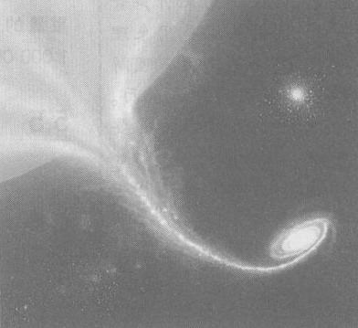

*图 5.15 在画家的想象中，黑洞从一个伴星那里拉出物质，并在慢慢吞下这些物质之前，把它加速形成发射 X 射线的热气盘。*

> **概念检查 9**
> 如果地球从现在的 6000 km 的半径坍缩到仅仅有 6 km，你的重量将会是 (a) 不变；(b) 你现在重量的 1/1000；(c) 你现在重量的 1/1 000 000；(d) 你现在重量的 1 000 倍；(e) 你现在重量的 1 000 000 倍。

---

## 5.5 牛顿世界观：一个平权的、机械的宇宙

在 16、17 世纪，新的日心天文学和惯性物理学迎来了一种新的哲学和宗教观点，我们称之为**牛顿世界观**⑤。它是牛顿物理学最重大的影响之一。即使牛顿的科学概念已经部分地被对范围更广泛的现象仍然准确的别的理论取代，但是基于牛顿物理学的世界观仍然保持着对大众文化的巨大影响。

> 正像眼睛是用来发看颜色，耳朵是用来听声音一样，人的头脑是用来理解数量，而不是用来理解随你便你喜欢的什么东西。所以数量是事物的首要特征，比其他范畴[比如颜色、声音和其他感官印象]更重要。
> ——开普勒

> 我正忙着研究[太阳系运动的]物理原因。我的目的是表明天空这部机器不是一种神性的、有生命的各种，而是一种钟表机制……因为几乎一切多种多样的运动，都是由最简单的、磁性的和物质的力引起的，就像一架钟的一切运动都是由简单的重量产生的一样。
> ——开普勒

> 当有人告诉我们，他看到一个物体的颜色或者感到他的一条肢体疼痛，这完全等同于他说，他在那里看到或感觉到他完全无知的某种东西，或者说他不知道他所看到的或感觉到的是什么……当官们[颜色或疼痛或其他感觉印象]被判断为超出了我们心灵之外的某些东西时，我们就完全不能形成关于它们的任何概念。
> ——笛卡儿

在西方世界，牛顿前世界观把中世纪基督教、古希腊人的地心天文学和亚里士多德物理学结合在一起。这一世界观的核心是目的的概念或者说未来目标的概念。在欧洲中世纪，大众文化与宗教和科学已经结合在一种信念中，即万物都有目的，而且宇宙的更远大的目的与人类是联系在一起的，人类体现了一切创造的目的。古代的地心天文学和亚里士多德物理学及其有目标指引的自然运动（第 3.1 节）与这一传统观点完全一致。它与这个时代的等级社会结构非常协调。这个社会结构有一个由上帝安排的国王，国王周围是一些占有土地的贵族，更外围是众多在土上地劳作的农奴和农民。

中世纪以后的天文学和物理学已经背离了地心天文学和亚里士多德物理学。哥白尼把地球从宇宙的中心移开，开普勒用椭圆轨道取代了行星的“自然的”圆轨道，而笛卡儿宣称物体运动并不是因为它们有什么目的，而仅仅是由于没有什么东西使它们停下来。自然位置的上下层级、地球地位特殊的观念、人类的中心地位以及宇宙中的目的性的科学基础等等，这一切都被一扫而光。

争取宗教自由和政治自由的奋起大致发生在这个时期并非偶然。分层级的宇宙论一旦开始瓦解，人们就不再认为应该遵循旧的等级制的文化习俗。新科学把普遍的自然法则而不是某个特定的人或宗教信仰，确立为人类行为的终极准则。于是，宗教改革家如马丁·路德得以挣脱束缚，向中世纪基督教传统挑战。政治改革家杰斐逊甚至能够起草独立宣言，宣称上帝丢弃了君王王权神授的观念，它浸透了“天赋人权不可侵犯”的思想，这是人类平等的基础。我们对宇宙的了解，就这样在深层次上影响了我们的宗教、我们的社会秩序和我们的政治。

*⑤ 牛顿、笛卡儿和伽利略与众多科学家和哲学家一起对这些信念做出贡献。*

伽利略追求的只是描述事物的行为，而不是为什么它们有这样的行为。他不关心物理现象的目的。分析的方法——把现象分解成最简单的成分并对这些成分进行研究的新方法——是他的工具之一。这导致把注意力集中在物质的最简单、最小的成分即原子上。于是原子论，即大自然可以归结为极小的物质粒子的运动的观念，成了新物理学的基础。例如，与德谟克利特的观点（第 2 章）非常相似，牛顿说：

“在我看来，上帝开始造物时，很可能先造结实、沉重、坚硬、不可入而运动的粒子……这些原始粒子由于是固体，所以它们比任何由它们构成的多孔物体要坚硬得无以伦比，它们甚至坚硬得永远不会磨损或碎裂……”

牛顿、伽利略和笛卡儿都是上帝的坚定信徒。在新科学里能为上帝找到什么位置呢？笛卡儿调和新科学与传统宗教的方法是假设有两个实在，这个观念叫做**二元论**。第一个实在在物质世界，它由物质构成，按照大自然的变的法则运转。这里，这个真实的实在，或本源的属性，被设想为像原子的运动这样的非人格的物理特性。第二个实在在是精神的，是人类思想和感情以及与上帝交流的领域。人类的感觉印象、思想和情感被设想为派生的属性，它们不属于物质世界而仅仅是第一位属性的反映。于是，科学和哲学把人类有关的东西贬黜为物理宇宙中一个模糊的次要角色。

在这物质宇宙的运转中没给上帝留下多少空间。在传统的观点中，上帝持续地、能动地存在于整个宇宙，不断地赋予万物目的。按照新观点，上帝顶多是一位不介入的观察者。笛卡儿和伽利略相信，需要上帝来建立自然法则并使宇宙启动，然而一旦启动之后，整个宇宙就自行运转了⑥。把宇宙设想为一个人、一台机器，特别是一部像钟表这样精巧协调的机器，是对牛顿世界观的一个极好的模拟。一旦主人开动了它们，钟表就会按照它们自己的工作原理自己走下去。物理学奠基人把宇宙设想成为时钟的机制类似，其工作原理是自然法则，其零件是原子。由于它的机械般的性质，我们称这种观点为**机械宇亩观***。

事实上，牛顿物理学的一个主要的推论就是每个物理系统是一个**确定的**系统。物理学家能够（并且已经）表明，牛顿的定律完全可以预测的，就像一只完美的钟。举一个简单的例子，牛顿物理学能准确预测一个自由落体在任何指定时间内下落的距离。这种像钟表一样的可预测性具有惊人的含义。为了理解这些含义，想象一个简单、孤立而自成系统的原子集合，这些原子按照牛顿物理学运动并相互作用着。假设我们确定了一个特定时刻每个原子的精确位置和速度，那么按照牛顿的运动理论，就可以精确预言这个系统在一切时刻的全部未来的行为。

*⑥ 除了由一些例外，牛顿也相信上帝不干预宇宙。在某些场合，即在牛顿自己找不道科学解释的情况下，他相信上帝干预了。然而这种“上帝填补空白”（"God of the gaps"）的观点——即在任何特定时期不能用科学解释的每种现象需要上帝干预，随着科学一步步填补这些空白，就越来越站不住脚了。*
*\* 机械宇亩观也可译为力学的宇宙观，“机械的”与“力学的”在英文中原为同一词 mechanical。前者强调把宇宙看成一台像钟表一样的机器，后者强调这种宇宙观的来源。——译者注*

> 如果没有活的动物，我不相信香气或味道或声音除了是一些名称之外还有什么别的意义——它们除了在使用中之外的确不在别的地方存在；我非常倾向于相信热就属于这一类东西，并且如果有生命、有感觉的物体消亡了，热就只是一个简单的词，除此之外再不是别的什么了。
> ——伽利略

> 宇宙像是一架极好的时钟……一旦上好发条时钟走起来，一切都按照制造它的工匠的最初设计进行，钟的运转……不需要工匠或他雇佣的任何有智能的代理人的特别干预，而是依靠整部机器原来的总体机械装置履行其功能。
> ——玻意耳，物理学家和化学家，1627—1691

> [人是] 具有意志的机器。
> ——玻意耳

> 光、颜色、热和声音以及其他通常称为可感觉的属性并不是客体，而只是感觉中的幻象。因为火发热而说它本身是热的，并不比因为火引起疼痛而说它本身也在疼痛更正确。
> ——霍布斯，哲学家，1588—1679

> 我看到一幅四重的图像，
> 它使我感到四重的最高的欢乐，
> 三重的图像也给我带来欢乐，
> 使我欢乐的图像至少也有二重；
> 上帝将保佑我们
> 远离牛顿那单一的图像，那机械的梦。
> ——布莱克，1757—1827，英国诗人、画家、反对牛顿的机械的单一图像或直线思维的叛逆者

> [我无法相信]，整个大自然，所有的行星，都要遵循永恒不变的规律，但却有一个五英尺高的小动物，他可以无视这些规律，仅凭心思来做所欲为。
> ——伏尔泰，法国哲学家和作家，1694—1778

> 他们爱怎么说就怎么说；我认为，万物都是有组织的物质。
> ——拿破仑，1769—1821

> 只有在我对一样东西建立起一个力学模型之后，我才会对自己感到满意。如果我能够建立起一个力学模型，我就能理解它。只要我还未能建立起力学模型，我就不能理解。
> ——开尔文勋爵，19世纪英国数学家和物理学家

而牛顿的观点就是，宇宙本身就是这样一个原子集合。于是，未来就完全由宇宙的全部原子现在的行为或任何一个别的时刻的行为决定。因为按照牛顿世界观，进入你头脑的每个想法或感觉都可归结为你的头脑里和别的地方的原子的运动，所以你的思想、感觉和行动全都是预先决定的和可以预言的。例如，你从末选择要抓破自己的鼻子——这是自然法则为你做的选择。也许你相信这是你的选择，但是，就连这个想法——你相信这是你的选择这个想法，也由自然法则为你选择的。

这样一个机械论的宇宙，自由意志的丧失和缺少一位持续创造的上帝，使众多的传统奉行者认为是冷酷无情的。例如，德国社会科学家马克思·韦伯（1864—1920）谈到了牛顿科学带来的“世界的醒悟”。然而，从 17 世纪直到 20 世纪，这些观念影响了许多受过教育的人。牛顿物理学是如此成功，以致相应的哲学几乎毫无异议地被接受。人们在不知不觉中吸收了类似时钟机构的宇宙观念。

今天有许多理由对牛顿世界观和牛顿物理学提出疑问（见下一节和第 2 章）。虽然如此，这些观点今天仍然很有影响，这并不令人惊奇。一个人的世界观作为时代文化氛围的一部分，是潜移默化地养成的。看来牛顿世界观仍然很有活力，甚至（或许特别是）在那些从未听说过牛顿的名字（更不用说笛卡儿或伽利略了）的人们当中。

尊敬的读者，要由你来确定牛顿世界观在多大程度上是有效的，它是否仍然保持重大影响，以及可能有多大的重要性。

---

## 5.6 超越牛顿：牛顿物理学的局限性

在 18 和 19 世纪，经过反复检验，牛顿物理学在每次挑战面前都站住了脚，一直准确到定量的细节。事实上，它如此强有力，如此精确，使得科学家开始把它作为终极和绝对意义上的真理接受下来。但是科学从来是不绝的。即使一个科学原理经过了反复证实，它仍待新实验的不断检验。

1880 年前后开始有不可能与牛顿物理学调和的实验结果出现。牛顿物理学在四种极端情况下，即速率很高时，引力很强时，距离很大时，以及距离很小时，给出的预言不正确。在 20 世纪的最初 20 年中，物理学家创立了三个新理论，以说明这些分歧。这三个新理论是狭义相对论、广义相对论和量子物理学。至少到现在为止，科学家尚未发现违背任何一个新理论的情况。

实验表明，牛顿运动定律和牛顿时空观在高速下失效。牛顿理论与实验之间的不一致在低速下不明显，但随着速率增大，误差变得越来越大。非牛顿效应在汽车、喷气式飞机，甚至在大约 10 km/s 的速率沿轨道运动的人造地球卫星的运动中，都难以发现。但是，在 30 000 km/s 的速率（大约在一秒钟内绕世界一圈！）下，牛顿的预言大约差 0.5%。在 290 000 km/s 的速率（近于光速）下，牛顿的预言偏差可达 4 倍！科学家没有注意这些非牛顿效应达 200 年之久，这是因为他们从未仔细研究过这样快速运动的物体。狭义相对论在一切速率（包括低速和高速）下都给出正确的预言。在速率明显小于光速时，狭义相对论的预言变得与牛顿物理学的预言没有差别。

类似地，实验表明，牛顿万有引力定律、牛顿运动定律和牛顿对空观，对于受到很强的引力作用以及在很大距离上的物体都是不正确的。例如，受太阳很强引力作用的行星即水星的轨道，其非牛顿引力效应是可以测出的，虽然很小。在中子星和黑洞附近，以及对于分布范围大到可观察到的宇宙的很大一部分的物质系统，非牛顿引力效应很明显。广义相对论对所有这些情况都给出正确的预言，人们认为它是正确的引力理论。只要引力不太强和距离不太大，广义相对论的预言与牛顿物理学的预言没有差别。

最后，实验表明，牛顿运动定律和牛顿的精巧的可预测性和因果关系的观点，对于分子大小或更小的物体，是不正确的。量子物理学对从微观到宏观所有尺寸的物体都给出正确的预言。对于像足球和苹果这样的宏观物体，量子论的预言与牛顿物理学的预言难以区别。

图 5.16 是用图示法表示牛顿物理学有效范围的一种方式。竖轴代表单个物体的速率。狭义相对论预言物体运动速率不能比光速（300 000 km/s）更快，所以大于这个数值的速率是不容许的。水平轴表示单个物体的大小。因为一条叫做“量子不确定性”的原理预言，物体不能既小⑦又运动得慢，所以在图的小尺寸和低速率的一角还有另一个禁区。

我们得到的教训是，宇宙并不是牛顿式的。牛顿物理学对地球上的普通物体工作得极好，但是地球只是在相对论现象和量子论现象占主导地位的宇宙中的一个例外。我们认为是正常的情况，在宇宙中仅仅是偶尔发生。牛顿和直观的时间、空间、物质及其他许多概念，在宇宙的大部分都远非正确。从第 10 章到第 18 章将看到，“真实”宇宙——量子-相对性宇宙与我们在地球环境的限制下得到的直观所提示的根本不同，要更奇异多。

> 人是事先没有预见其努力目标的原因的产物；他的起源，他的成长，他的希望和恐惧，他的爱和信仰，都只不过是原子的偶然布局的产物……上面所有这些，即使不是完全没有争议，也是相当肯定的，没有哪种否定它们的哲学能够站得住脚。
> ——罗素，哲学家和数学家，1872—1970

> 人的生命短暂而脆弱；来得虽慢但必定要来的劫数无情地，不知不觉地降临到他和他的种族的身上。不分善恶，不顾毁坏，万能的物质坚定不移地沿着自己的道路滚滚向前。
> ——罗素

> 这是一个物质的世界。
> ——麦当娜

*⑦ “高度局域化”是比“小”更准确的用语。像电子这样的粒子，当观察到（或已知）它位于空间一个小区域内时，就说它“被局域化”在这个区域内。“量子不确定性原理”说，一个被局域化在很小的区域内的粒子必定具有（平均意义上的）高速率。*

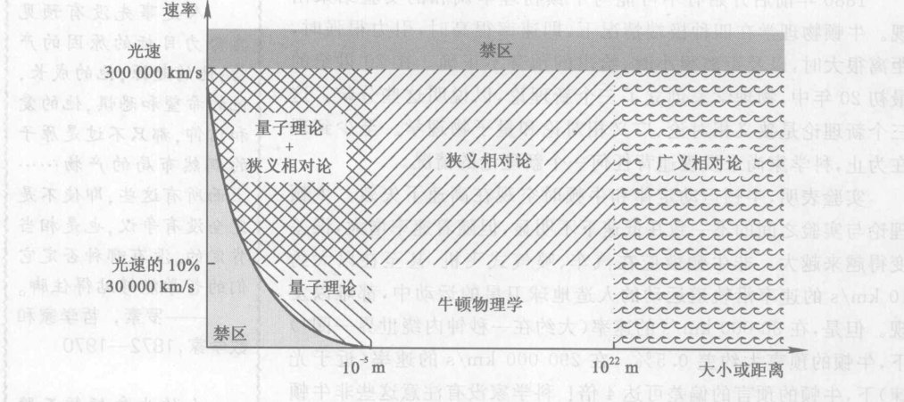

*图 5.16⑧ 牛顿物理学对地球上的通常现象是正确的，而对很小的物体、很大的物体和很快的物体都失效。牛顿物理学对很强的引力（如中子星或黑洞附近）也失效。量子论和相对论适用于迄今观察的全部现象。这个图只是示意性的和近似的。*
（注：图表中包含四个区域：牛顿物理学、量子理论+狭义相对论、狭义相对论、广义相对论。并在高速和微观区域标注了“禁区”）

> **概念检查解答**
> 1. (b)。
> 2. (c)。
> 3. (c)。
> 4. 按照牛顿运动定律，若合力相同，那么加速度也相同，(d)。
> 5. (a)。
> 6. 虽然你的质量没变，但由于你离地心更远了，你的重量要减小，(d)。
> 7. (f)。
> 8. (b)和(d)。
> 9. 半径减小为以前的值的 1/1 000。它的平方是 1/1 000 000，其倒数为 1 000 000, (e)。

*⑧ 感谢 Douglas Giancoli，是他建议画这种形式的图。他是包括 Physics, Principles with Applications (Englewood Cliffs, NJ: Prentice-Hall, 1991)在内的几本物理学教材的作者。*

---

### 关键概念

下述概念的定义出现在所标页码的本书正文页面上和书末的按拼音排序的术语词汇中。我们将会它们按出现先后顺序排列在这里，你可以用这个清单复习本章内容。

*   卫星 92
*   牛顿万有引力定律 94
*   失重 96
*   引力坍缩 98
*   核聚变 99
*   白矮星 100
*   超新星 100
*   黑洞 102
*   原子论 105
*   二元论 105
*   中子星 101
*   牛顿世界观 104
*   本源的属性 105
*   派生的属性 105
*   机械宇宙观 105
*   牛顿物理学的局限性 106
*   狭义相对论 107
*   广义相对论 107
*   量子物理学 107

### 复习题

**万有引力概念**

1.  下落的苹果的运动在什么方向？它的加速度在什么方向？
2.  什么是月亮运动的方向？它的加速度在什么方向？
3.  地球施力于月亮吗？这个力的方向如何？如果这个力不再作用，月亮会怎样运动？
4.  月亮和落下的苹果在哪些方面相似？在哪些方面不同？

**万有引力定律**

5.  本书对你的身体施加引力吗？
6.  如果你设法使地球质量加倍，这本书的重量会怎么变？如果地球质量不变而使书的质量加倍，书的重量将怎样？如果地球和书两者的质量都加倍呢？
7.  为了用牛顿万有引力定律计算你的体重，需要什么数据？
8.  如果你是在地面之上 200 km 的卫星里绕地球运行，你会失重吗？这时你的重量与在地面上的重量相同吗？你会觉得失重吗？加以说明。

**引力坍缩**

9.  什么原因使太阳变热？今天是什么使它保持灼热状态？
10. 描述恒星形成的过程。
11. 既然引力把太阳上的物质向内拉，而太阳又只由气体构成，为什么太阳不坍缩？
12. 在本星系中有恒星正在诞生的地方吗？
13. 说出为太阳提供燃料的过程和物质的名称。
14. 太阳的燃料耗尽后，会发生什么情况？
15. 说出太阳在燃料耗尽后将演变成的天体的名称，并对它作一描述。
16. 是什么因素使不同的恒星的演化进程不同？
17. 一切恒星最终演化成三类天体中的一种。说出这三类天体的名称。它们各自自由哪种恒星演化而成？
18. 描述中子星。
19. 描述黑洞。既然没有任何东西能够离开黑洞，我们怎么能探测到它？

**牛顿世界观**

20. 举出古希腊天文学和亚里士多德物理学支持传统的等级制的和宗教的世界观的几个方面。
21. 举出哥白尼学说和牛顿学说不怎么支持中世纪世界观的几个方面。
22. 牛顿物理学与民主（平权）有什么联系？
23. 按照牛顿世界观，一条红餐巾真是“红”的吗？加以说明。
24. 照牛顿世界观看来，在哪些方面宇宙像是一架钟表？
25. 牛顿物理学对哪些现象不正确？为什么经过这样长时间才发现这些例外？

### 思考题

**万有引力概念**

1.  地球对一块木头和对同样尺寸的一块铁的引力，哪一个更强些？木头和同样尺寸的一块铁下落时，哪一个下落得更快些（忽略空气阻力）？
2.  地球对一块木头和质量相同的一块铁的引力哪个更强些？
3.  当前作用于你的引力的大小和方向如何？
4.  把你一张纸捏成一个纸球时，它的质量改变吗？它的重量改变吗？
5.  你是在环绕地心的轨道上运行（绕着地心下落）吗？你在环绕什么东西的轨道上运动？
6.  月亮在环绕两个天体的轨道上运动。是哪两个天体？（实际上还有第三个——本星系的中心。）
7.  你对周围的人有引力作用吗？他们对你有引力作用吗？
8.  你对地球有引力作用吗？如果有，引力多大？是什么方向？
9.  地球引力影响多远？
10. 随着一艘飞船从地球飞到月球，它完全摆脱了地球引力影响吗？
11. 一个在轨道上运行的卫星重 8 000 N。作用于它的引力的大小和方向如何？这个卫星作用于地球的引力的大小和方向如何？
12. 一个苹果放在环绕地球的一条圆形轨道上，到地球的距离与月亮到地球的距离相同，这个苹果的轨道周期（在轨道上运行完整一圈的时间）近似是多少？
13. 如果万有引力现在突然消失，地球轨道的形状将变成什么样子？月亮轨道呢？
14. 什么力（如果有的话）保持行星沿靠着它们的轨道运行？

**万有引力定律**

15. 是地球作用于月亮的引力大，还是月亮作用于地球的引力大？
16. 地球拉重 1 N 的苹果的力有多大？在什么方向？这个苹果拉地球的力有多大？在什么方向？
17. 假设你去到另一颗行星，它的表面与地球相同，但是内部大部分是空的。这会影响你的重量吗？怎样影响？
18. 假设你去到另一行星，它的半径比地球大，但总的质量与地球相同。这会影响你的重量吗？怎样影响？
19. 列出至少三个对地球的运动有可检测到的引力效应的天体。
20. 大行木星的质量大约是地球质量的 300 倍。那么木星表面上一个物体重量似乎应当是它在地球上重量的 300 倍。但实际它只是地球上重量的大约三倍。为什么？
21. 如果在一个自由下落的电梯里，松手放开一把钥匙，那么这把钥匙会悬浮在你面前。钥匙是在下落吗？钥匙没有了重量吗？
22. 如果黄金是按重量出售，你能通过在地面之上某个高度买黄金而在另一不同的高度上卖掉它来赚钱吗？你想在哪儿买，在高处还是在低处？
23. 你是在拉萨更重，还是在上海更重？为什么？
24. 有什么合力（第 4 章）作用在月亮上吗？
25. 月亮受到加速吗？如果是，加速度在什么方向？月亮速度的方向如何？
26. 假设轻重两个卫星进入环绕地球的两条低轨道。通过观察两条轨道的形状或卫星的速率，你能分辨哪个卫星更重吗？
27. 假设两个卫星进入轨道，一个环绕地球，一个环绕月亮，并且假设两条轨道的半径（分别到地心和月心的距离）相同。已知地球质量大于月亮质量，你能对两个卫星沿轨道运动的速率做出什么预言？
28. 通信卫星应该做相对于地面静止的同步轨道运动。也就是，它们必须停留在地面某一点的上方，使发射和接收天线能瞄准高空的一个固定点。那么，通信卫星的轨道运动周期（在围绕地球的轨道上整整转一圈的时间）必须是多少？
29. 在描述“轨道”运动的图 5.4 中，画出三个箭头（分别标注 $F$, $a$, $v$）附在苹果上表明作用于苹果的力的方向、苹果的加速度方向和苹果的速度方向。
30. 图 5.3 表明沿水平方向抛出的苹果的两条可能途径。假定空气阻力可忽略不计，对每条途径画出三个箭头（分别标注 $F$, $a$, $v$）附在苹果上，表明作用于苹果的引力方向、苹果的加速度方向和苹果的速度方向。
31. 假设在相距很近的一个苹果和一个桔子之间的引力为 $10^{-12}$ N。如果距离加倍，引力应是多大？距离减半呢？距离变为 3 倍呢？距离变为 1/4 呢？
32. 参看上题，如果距离加倍，质量也加倍，这个力会是多大？质量变成 3 倍呢？如果苹果质量变成 3 倍同时桔子质量变成 4 倍呢？
33. 参看上题，如果苹果质量加倍，桔子质量加倍，它们之间的距离也加倍，则这个引力将是多大？

**引力坍缩**

34. 如果地球坍缩到现有半径的 1/10，那么你的重量将是多少？
35. 如果地球膨胀到现有半径的 10 倍，那么你的重量将是多少？
36. 求出你在离地心 10 倍地球半径距离处的体重。与前一题比较。
37. 地球会坍缩成黑洞吗？为什么？太阳会吗？
38. 所有 9 个行星的轨道都近似位于同一平面。为什么？

**超越牛顿**

39. 为了对一个以光速一半的速率运动的原子的行为做出预言，需要什么理论？
40. 按照人们广为接受的关于宇宙创生的科学理论，宇宙在其最初时刻（时间远小于 1 秒）非常之热，充满密集的物质，而且极其微小——小于一个原子。为了说明在这最初时刻发生的情况，需要哪此理论？

### 习题

**万有引力定律**

1.  两个行星之间的距离减小为原先的 1/3 时，求它们之间引力的变化。
2.  两个行星之间的距离增加到原先的 3 倍时，求它们之间引力的变化。
3.  地球质量是 $6.0 \times 10^{24}$ kg，其半径为 $6.4 \times 10^6$ m。用牛顿万有引力定律计算在地球表面上的 1 kg 物体的重量（即所受引力）。
4.  月亮质量是 $7.4 \times 10^{22}$ kg，其半径为 $1.7 \times 10^6$ m。用牛顿万有引力定律计算在月亮表面上的 1 kg 物体的重量。要是你做了上一题，比较上题答案与本题的答案。
5.  某中子星质量为 $4.0 \times 10^{30}$ kg（太阳质量的两倍），被压缩成半径仅为 10 000 m (10 km) 的球体。计算中子星作用于其表面上质量为 1g 的水的引力。（实际上，这“水”不再是通常的液态，如果它在中子星的表面上话！）
6.  求月亮作用于地球的引力。它们的质量分别为 $7.4 \times 10^{22}$ kg 和 $6.0 \times 10^{24}$ kg，它们的中心距离为 $3.8 \times 10^8$ m。
7.  在上题中，地球作用于月亮的引力有多大？这个力在什么方向？
8.  求太阳作用于地球的引力。它们的质量分别为 $2.0 \times 10^{30}$ kg 和 $6.0 \times 10^{24}$ kg，它们的中心距离为 $1.5 \times 10^8$ km。
9.  在上题中，地球作用于太阳的引力有多大？这个力在什么方向？
10. 求 0.1 kg 的苹果作用于另一个 0.1 kg 苹果的力，设它们的中心相距 2 m。
11. 作出估计。估计一下你作用于站在你旁边的人的引力（以 N 为单位）。这个答案接近 1 000 N，还是 1 N，还是 1/1 000 N，还是百万分之一牛，还是 10 亿分之一牛？