# 第三篇 向新物理学过渡

# 第 6 章 能量守恒：你不能超支

> 能量是环境问题中最困难的部分，而环境也是能量问题中最困难的部分。增长和支持经济繁荣的挑战的核心是，以支付得起的代价限制增加能量供给对环境的影响。
> ——J. Holdren，哈佛大学环境政策教授，科学、技术与公众政策主任

能量也许是物理学中最重要的概念，而且，你几乎每天可以在报纸上看到，能量也与社会密切相关。事实上，我们主要是通过利用能源的情况来界定人类的文化。文明本身和对太阳能的有组织的利用差不多是同义的。人类首批定居的村落由于交易和农业的需要形成于 10 000 年前。许多世纪以来，贸易得益于太阳能，太阳能激发了风，而风推动了商船、战舰和探险船只的帆。农业则依靠有组织地利用太阳能种植植物。今天，经过化学变化的古代生物残骸，即所谓化石燃料（煤、石油和天然气），为我们的工业文明提供能量。

能量是本书四个重复出现的主题之一。它是这一章和以后一些章节中分析各种自然现象的基础和讨论许多与能量有关的社会问题的基础。这一章我们的目的是了解科学家所说的能量的意义，并用这个概念了解众多的物理过程。像一切强有力的科学概念一样，能量说明了并统一了多种多样的现象。与牛顿定律不同，能量的原理适用于一切现象，从亚原子粒子“夸克”到迄今观察到的宇宙。

以煤为燃料的蒸汽机激发了开始于 1750 年前后的产业革命，对经济和社会产生了深远的影响。新的工业机器只有上等阶层才用得起。因为新机器又大又复杂，传统的家庭作坊发展成大的集中设置的工厂。传统的手艺人的技艺学习需要长时间的学徒期，但是不熟练的工人和儿童都能照看新出现的机器。因此，19 世纪的欧洲和北美以增长的产量、资本主义的工业组织方式和人口从农场到城市的迁移为标志。20 世纪的政治意识形态是从产业革命的经济学中生长出来的。而今产业革命遍及整个世界，并扩展到像计算机这样的新兴产业。

新产业也激励了 19 世纪的科学家去了解关于能量的两个重要原理。本章讨论这两个原理之一：**能量守恒**。这个原理出现在第 6.5 节，在第 6.1 节到第 6.4 节讨论功和能量的概念之后。宇宙中发生的每一件事都涉及这种或那种能量转化。第 6.6 节研究能量转化的几个例子。第 6.7 节考察一个很有用的相关概念：**功率**，即能量转化率（单位时间的）。然后第 7 章研究另一个重要的能量原理：**热力学第二定律**。

---

> **概念检查 1**
> 既然从来没有观察到过违反能量原理的现象，那么我们可以说能量原理是 (a) 一个好理论；(b) 一个好的假设；(c) 在未来所有的观察中都一定正确；(d) 一个事实；(e) 绝对正确；(f) 废话。

## 6.1 功：用一个力移动一个物体

我们通常说一个物质系统例如一个人、一个闪光灯电池、一桶汽油具有“能量”，如果它具有使其环境或自身产生变化的内在本领的话。物理学家对能量的定义，是对这一观念的提炼。只要一个系统有做功的本领，我们就说这个系统具有“能量”，这里“功”指的是造成外部或内部的变化。在这——节我们将讨论“功”。

物理学家关于功的定义是对通常的关于“工作”的说法的提炼（英语中“工作”和“功”是同一个词“work”）。通常只要你努力执行一项任务，你就说你做了工作。在物理学中，只要你推或拉一个物体使它移动一段距离，你就做了功。例如，你把这本书从桌子的一边推到另一边，你就对这本书做了功。一块磁铁把曲别针拉向自己，这块磁铁就对曲别针做了功。更精确地说，如果物体 A（人或其他物体）施力于物体 B，而 B 在这个力的方向上运动，物体 A 就对物体 B 做了“功”（我们不需要考虑运动与力不在同一方向的情形）。当你举起这本书时你对这本书做了功。当这本书落下时地球对这本书做了功。注意，功总是一个特定物体对另一特定物体做的。还要注意，为了做功，既需要力又需要运动。

> **概念检查 2** 杰德靠在砖墙上，奈德使劲推这面墙，累得大汗淋漓（图 6.1）。是杰德还是奈德在对墙做功？(a) 两人都在做功；(b) 奈德在做功而杰德未做功；(c) 谁也没有做功。

> **概念检查 3** 单个电子在你的电视显像管内穿过真空（假定是“理想的”真空）从后向前飞行，在前端撞到荧光屏内壁，产生一个小闪光。忽略作用在电子上的引力。当电子在显像管内穿行时，(a) 只有空气阻力对电子做功，使它慢下来；(b) 惯性对电子做功，使它以不变的速率沿直线运动；(c) 惯性对电子做功，使它慢下来；(d) 对电子没有做功，电子以不变的速度运动；(e) 对电子没有做功，电子慢了下来。

*图 6.1 杰德或者奈德中有人对砖墙做功了吗？*

任何一个考虑过加满汽车油箱的费用、或者汽车燃油的效率的人都知道，定量地对待能量在实用上是很重要的。让我们考虑一下你在不同情况下所做功的数量。如果要让功这个词与日常用法大致相符，那么你举起一个重物时，重物越重，你所做的功就越多。为了知道多多少，比较拿起一本书与拿起叠放在一起的两本书的情况（图 6.2）。第二种情形的效果是第一种情形的两倍，因此所做的功也应该是两倍。这意味着我们需要力和运动成正比。

现在比较把书推过一张桌子与把书推过两张挨着的桌子的情形（图 6.3）。第二种情形的效果又是第一种的两倍，所以功应该和运动的距离成正比。

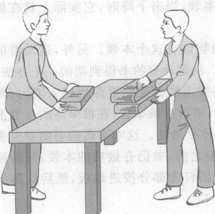

*图 6.2 举起两本书要做两倍的功*

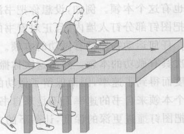

*图 6.3 把一本书推到两倍距离要做两倍的功*

因此，功应该既正比于力又正比于距离。于是我们把物体 A 对物体 B 所做的功的数量定义为物体 A 对物体 B 所施的力乘以物体 B 在该力作用下运动的距离①，即
$$ \text{功} = \text{力} \times \text{距离} = Fd $$
例如，你用 3 N 的力推一本书，使之移动 2 m，你做的功就是 $(3 \text{ N}) \times (2 \text{ m}) = 6 \text{ N} \cdot \text{m}$。注意，功的单位是牛顿米 $(\text{N} \cdot \text{m})$。由于这个单位用得如此广泛，因此又把它命名为**焦耳**，简称**焦** (J)，以纪念英国物理学家 J. P. 焦耳 (图 6.4)。

从以下的概念检查可以看到，举起一个物体所做的功是物体的重量与举起的高度的乘积。

> **概念检查 4** 假设你从地板上把一本重 12 N 的书慢慢地以不变的速率举到离地板 2 m 的书架上，在你举这本书的过程中，作用于书的合力是 (a) 零；(b) 12 N；(c) 24 N。

> **概念检查 5** 前一问题中，你的手作用于书的力是 (a) 零；(b) 12 N；(c) 24 N。

> **概念检查 6** 前一问题中，你对书所做的功是 (a) 零；(b) 24 J；(c) 48 J。

## 6.2 功和能：一个简单例子

做下面这个分两步的实验，并且仔细观察：第一步，把书放在伸出的手上，从地板慢慢向上举到某个高度，保持几秒钟，然后慢慢下降返回到地板上。第二步，重复同样的动作上举过程到同一高度，但这这次你突然撤掉手使书落到地板上。

当你举起书时你对书做功。但在下降回到地板的过程中书对你做功，因为在整个下降的路径中书都在向下推你的手。我们可以说，举高的书有做功的本领，当书下降时，它实际上就在做这个功。

我们更仔细地看看“做功的本领”。我们刚刚看到举高的物体有这个本领。另外，运动着的物体也有这个本领。例如，设想你把书沿水平方向扔到墙上。从运动着的书得到功的一个办法，是先把图钉部分钉入墙内，且正对着书的运动方向，因此书将撞击图钉使它更深地钉入墙内（图 6.5）。任何运动物体都有做功的本领。在我们实验的第二步，书再次被举起，在被举高的位置上它再次具有做功的本领。然而这次你撒手使它掉下来而不对你手做功。这本下落的书随着失去其高度而得到了速率，因而保留了做功的本领。就在撞到地板之前，书仍有做功的本领，只是现在这个本领来自书的速率而不是来自它的高度。我们可以把图钉先部分按进地板，然后让落下的书把图钉撞进更深的深度，让落下的书实际做这个功（图 6.6）。

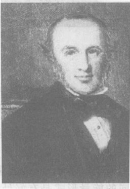

*图 6.4 英国物理学家焦耳。他在 19 世纪 40 年代所做的实验，澄清了关于热能的混乱认识，达到最早的对能量的清晰理解。*

① 这个定义限定运动发生在力的方向所在的直线上。如果运动与力不在同一方向，那么在这个公式中我们必须只用在运动方向上的那一部分或“分量”。这里我们无需这样精细。

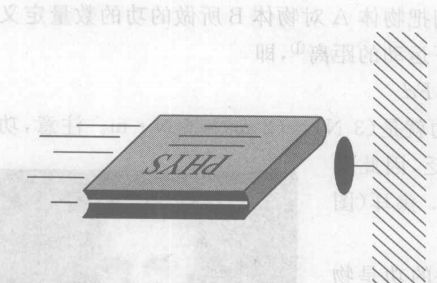

*图 6.5 从一本运动的书得到功的一个方法：让它把一个图钉撞进墙内。*

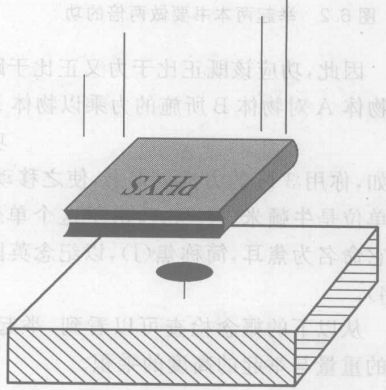

*图 6.6 从一本下落的书得到功的一个方法。*

因此，当你举起或扔出这本书时，你给了它做功的本领。你做的功“储存”在举高的或运动的书里。你可以随时取回这个功，例如让书推着你的手向下直到地板。物理学家用一个术语表示做功的本领，叫做**能量**。我们已经看到，举高的物体和运动的物体都有能量。区分这些不同的能量形式是有好处的。我们说举高的物体具有**引力能**，因为这种能量是由地球对物体的引力产生的；运动的物体具有**动能**，因为这种能量来自运动。我们将看到，还有别的几种能量形式。

在书的下落过程中，书失去引力能而获得动能，从而保持能量不变。这种在没有外部施力者（比方你的手）影响这个系统时能量保持不变的情况，是**能量守恒定律**的一个例子。

这些是用一个简单例子表述的关于功与能量的基本概念。本章的其余部分将进一步展开这些概念。

## 6.3 对能量的定量考察

让我们定量考察上节描述的实验。我们知道，举起一物体所做的功是物体的重量与物体被举起的高度的乘积。一旦书被举起，书就具有引力能，因为它能把你的手推回到地板上而做功。它有多少引力能呢？定量地说，我们把物体的能量大小定义为它能做的功的大小。和功一样，能量的单位也是 $\text{J} (\text{N} \cdot \text{m})$。举高的书的能量就是它能慢慢地把你手推回到地板所做的功的大小，它正是书的重量与到地板的距离的乘积。由此你能看到，对任何被举高的物体，
$$ \text{引力能} = \text{重量} \times \text{高度} $$

当你慢慢放下书时，它耗尽其能量以把你的手推回到地板。但是当这本书下落时，它的引力能转化为动能。像书这样运动的物体具有多少动能？换句话说，一个运动物体由于它的运动能做多少功？从牛顿定律出发，可以推导出这个问题的答案，不过我们不在这里推导。这个答案是：
$$ \text{动能} = \frac{1}{2} \times \text{物体的质量} \times \text{物体速率的平方} $$
即 $\text{动能} = \frac{1}{2} m v^2$。

这个公式表明，物体的质量越大，其动能越大，物体运动得越快，其动能也越大，这正是我们预期的。公式内包括的是物体的质量而不是重量，这是有道理的，因为即使在没有引力的情况下下也有动能。

现在我们注意到一件令人难以置信的事，它也可由牛顿定律证明：如果忽略空气阻力（以后我们会考虑它），这本书开始下落时所具有的引力能就精确地等于它最后的动能（图 6.7）。这本写做功的总本领，即其**总能量**，在下落过程中数量不变。它的能量只是在形式上变化，从引力能转化为动能，而总能量不变。就像物理学家所说的那样，能量精确地“守恒”。注意在英文中，energy conservation 这个词组有两个意义，一个是物理学上的“能量守恒”，一个是社会上用的“节能”，应当把它们二者区分开来。当报纸上谈到节能时，他们的意思是通过较少地消费来保护某些像石油之类的高价值形式的能源。而物理学家说到能量守恒，他们的意思是在某个物理过程中能量的总数量保持不变。

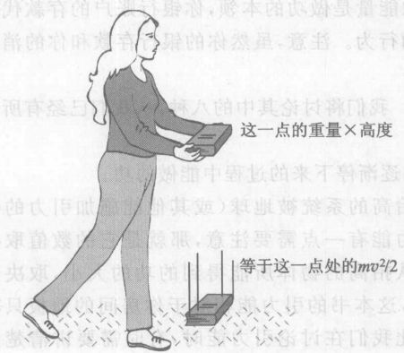

*图 6.7 一件令人吃惊的事：顶部的引力能精确等于书刚要撞到地面之际底部的动能。*

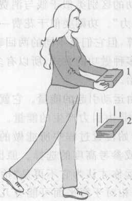

*图 6.8 在整个下落路径上总能量守恒。下落过程中在点 1 和点 2 两点之间引力能的损失精确等于这两点之间动能的增加。无论点 2 在女士的手和地板之间什么地方都是这样。*

而且，因为在任何下落的距离能量都守恒，所以在落下途中的中点，在落下距离的 3/4 处，以及在落下过程中的每个别的地点，能量一定都守恒。在落下的任何一段路程上，引力能的损失精确地等于这段路程上动能的增加（图 6.8）。

> **概念检查 7** 一辆汽车以 100 km/h 的速率行驶时与以 50 km/h 的速率行驶时，二者的动能相比：(a) 二者大小相同；(b) 前者的动能是后者的一半；(c) 前者的动能是后者的 1/4；(d) 前者的动能是后者的两倍；(e) 前者的动能是后者的四倍。

> **概念检查 8** 一袋食品质量是 6 kg，重量是 60 N，从 2 m 高的货架上落下，它刚开始落下时其引力能（相对于地板）是 (a) 零；(b) 12 J；(c) 120 J；(d) 上面的答案都不对。

> **概念检查 9** 参考上题，忽略空气阻力，在就要撞到地板之际，这袋食品的引力能和动能 (a) 都是零；(b) 分别为 0 和 120 J；(c) 分别为 120 和 0 J；(d) 都是 120 J；(e) 上述答案都不对。

**作出估计** 当你把你的物理书举过你的头并向上直胳膊，估计物理书相对于地板的能量。假设书的重量是 10 N。如果你从这一高度上松开手，在书刚要撞到地板之际，它大约有多少动能②？

## 6.4 能量：做功的本领

现在我们进一步展开前两节的内容，把这些概念扩展到更多多种多样的系统。系统这个词在科学中多有遇到，它的意思是宇宙的一个具体部分，例如一个特定的物体集合。

**任何系统若具有做功的本领，就说它具有能量。系统的能量在数量上等于它能做的功。**虽然功和能量都以焦耳为单位，但功和能量不是同一个东西。一个系统**做**功，而它**具有**能量。做功是一个过程，而能量是系统的一个属性。一个系统的能量是该系统能做的功的数量，不论它实际上是否做这个功。一块举高的岩石具有能量，即使它可能被绑起来，永远待在那里而不做任何功。能量与功的区别类似于钱与消费的区别。钱就像能量是做功的本领，你银行账户的存款代表你“消费的能力”。功则类似于花一笔银行存款的行为。注意，虽然你的银行存款和你花的消费都按美元计算，但它们是不同的两回事。

因为有多种做功的方式，所以有多种能量形式。我们将讨论其中的八种，从我们已经有所了解的两种开始。

**动能**是由运动引起的能量。它就是一个系统在逐渐停下来的过程中能做的功。

**引力能**③是由引力产生的能量。它是一个被抬高的系统被地球（或其他能施加引力的物体）拉回其初始位置过程中所能做的功。关于引力能有一点需要注意，那就是它的数值取决于初始高度或参考高度的选择。原因很简单，你从抬高的物体所能得到的功的大小，取决于它向下走多远你才认为它不再是“抬高的”。例如，这本书的引力能相对于你房间的地板只有几焦耳，但是相对于海平面可能有几千焦耳。因此我们在讨论引力能时，有时需要讲清楚约定的参考高度。

② 假定你能举到地板之上大约 2 m 处，引力能 $E = \text{重量} \times \text{高度} \approx 10 \text{ N} \times 2 \text{ m} = 20 \text{ J}$。如果你松开手让它落下，在刚要撞到地板之际，它的动能将接近这全部 20 J 能量。还有小量能量由于空气阻力转化为热能。

③ 也叫“引力势能”。有些书定义“势能”为由系统的位置或组态产生的能量。引力能、弹性能和电磁能都是势能。为简吉起见，我们不用这个“势”字。

拉伸一条橡皮带或弯曲一把尺子，松开手它们又能弹回原样。因为在弹回原样过程中它能做功，所以在这个变形的系统中具有能量。例如，一条拉伸的橡皮带在把你的手指拉回到一起的过程中会做功。这种来自变形系统弹回原样的本领的能量叫做**弹性能**。

一壶热水比同样大小的一壶冷水具有更多的能量。我们怎么知道？噢，如果那壶热水在沸腾，它会使壶盖跳动，而这需要功，所以沸腾的水有做功的本领。如果那壶热水低于沸点温度，从微观角度看热能对我们是很有启发的。我们知道（第 2 章），温度与宏观上看不见的随机的微观运动或热运动联系。例如，随着水的温度升高，它的分子运动得更快，得到动能。热能是这种在宏观上不能直接观察到的微观能量⑤。为避免混乱，我们将保留**动能**这个术语专指**宏观动能**。

把一只手放在一个温暖的物体上，另一一只手放在一个相似但较凉的物体上。从微观观点看，你实际上并不是在体验暖和凉，而是在体验快速运动和慢运动的分子。你觉得这奇怪吗？我是觉得很奇怪的。只不过是微观粒子的运动而已，这些粒子我既看不见也感觉不到它们单个的存在，怎么会在我的手上产生温热的感觉呢？温热的概念已为运动所取代，或者说已“归结”为运动。在某种意义上，温热的概念已经消失，这是科学把多种多样的现象归结为少数几个基本要素的一个经典例子。这种把感觉印象归结为原子的机械运动，正是德谟克利特（第 2.6 节）所说的：“热是从俗约定的，冷是从俗约定的，……人们假定感觉的对象是真实的——但实际上并非如此。只有原子和虚空才是真实的。”

在历史上，热能使人感到困惑，因为它是不能方便地纳入牛顿物理学的力学框架，而且还因为它与其他形式的能量有根本的不同，这一点我们将在下一章看到。在 18、19 世纪，焦耳等人最终证明被体验为暖热的实际是能量的一种形式。在这认识实际上是公认的过程中是很重要的一步。

我们很快地看一下其余四种类型的能量，以后再对它们作更深入的讨论。

由电磁力（第 8 章）产生的能量叫做**电磁能**，有时简称“电能”或“磁能”。

光束中有能量，这你可以从光（例如太阳光）能使物体变热，而你又能从热的物体得到功的这个事实看出来。光束携带的能量是**辐射能**的一种形式。我们在第 9 章将看到还有其他形式的辐射能，其中一些你可能是熟悉的：无线电波、微波、红外线、紫外线、X 射线和 $\gamma$ 射线的能量。

化学反应能做功，从柴火可以把水烧得沸腾的事实就可看出这一点。这个能量来自木柴的分子结构。来自一个系统的分子结构的能量叫做**化学能**。

**化学能**来自分子结构，**核能**则来自原子核的结构，来自质子和中子在原子核内的配置方式。人们通过核反应获取核能（第 15 章），就像人们通过化学反应获取化学能一样。

④ 更准确地说，热能（有时也叫做“内能”）不仅通过系统的温度，还通过它的压力和其他所谓“热力学变量”显示出来。
⑤ 更准确地说，热能包括在宏观层级上不能直接看到的一切微观形式的能量，包括由分子间的作用力产生的能量，这对理解熔化和其他“相变现象”很重要。

> **概念检查 10** 一个工作着的灯泡把电磁能转化成 (a) 动能；(b) 电磁能；(c) 热能；(d) 化学能；(e) 辐射能。

> **概念检查 11** 水电站运行中发电的能量最终来自 (a) 电站大坝后面水库里的引力能；(b) 电站大坝后面水库里的化学能；(c) 电站大坝后面水库里的热能；(d) 来自太阳的辐射能；(e) 来自太阳的化学能；(f) 好的感觉。

## 6.5 能量定律：能量是永恒的

我们已经看到，如果忽略空气阻力而且只观察到物体掉到地板上之前，在物体下落的任何一段距离上失去的引力能刚好由它获得的动能补偿。物体的总能量在整个下落过程中守恒。牛顿物理学预言了这一点，而且实验证实了它。事实上，仍然从牛顿定律出发，还可以证明，任何只受引力作用的系统就像自由落体一样，其总能量守恒。我们的太阳系在很好的近似程度上就是这种系统，它只在引力作用下运动。值得注意的是，在八个行星和它们的卫星的复杂运动过程中，应当有这样一个相当抽象的量即能量保持不变。

然而更值得注意的是，实验表明这个能量原理远远超出了牛顿物理学的范围。在迄今观察过的每个物理过程中能量都守恒。我们把这叫做：

**能量守恒定律**
任何过程中全部参与者的总能量在此过程中始终保持不变。也就是说，能量不能被创造或消灭。能量可以转化（从一种形式变成另一种形式），也可以传输（从一个地方传送到另一个地方），然而其总量永远相同。

这个论断属于科学中最可靠的普遍规律之列。它在观察过的每种情况下都是正确的。甚至在牛顿物理学完全失效的场合，例如在黑洞附近、速度接近光速时以及对亚原子粒子，它也成立。

它是一个很有用的原理，因为你一旦算出或测出某个过程在某一时刻的总能量，你就知道了任一时刻的总能量，而不用计算或观测在这两个时刻之间发生的繁琐细节。例如，汽车油箱消耗的化学能的焦耳数一定等于那段时间里汽车的动能、引力能、排出的热能以及污染物的化学能等等的焦耳数的总和。

物理学家已经发现几个物理量也是守恒的。虽然我们将不去研究别的守恒原理，但把它们列出来还是令人感兴趣的。在每个物理过程中，参与者的以下每一属性始终都守恒：
*   总的做功本领，即“总能量”。
*   总的穿越空间的平动，即“总动量”。
*   总的旋转运动，即“总角动量”。
*   总电荷量。
*   与微观相互作用相关的某些亚原子性质。

能量守恒是一种对称性原理。我们还记得（第 1 章），一个系统具有对称性，如果从不同的侧面看这个系统都相同。能量守恒就是说，不论我们在什么时刻看，系统的能量相同。事实上，一切守恒原理都可以追溯到自然界的对称性。

还有另一种有用的表述能量守恒的方式。做功总是某个系统对另外某个系统做的。做功的系统必定失去若干做功的本领；换句话说，它必定失去能量。由于总能量守恒，这个能量不会消失，一定会进入接受功的系统。因此，功是从做功的系统到接受功的系统的能量传递。我们称之为：

**功的原理**
功是能量的传递。减少了做功的系统的能量，增加了接受功的系统的能量。这两个能量变化的大小都等于所做的功。⑥

**我们怎么知道即使在原子核过程中能量也守恒？** 20 世纪初，原子核物理学家研究了一种叫做 $\beta$ 衰变的“放射性衰变”（第 15 章）。所谓 $\beta$ 衰变就是一个原子核自发产生一个电子并把它从原子核内射出的过程。这个过程改变了原来的原子核。如果能量守恒，那么原来的原子核的核能应该等于衰变后的原子核的核能加上射出的电子的能量。

然而测量表明，衰变前的能量大于衰变后的能量。由于不情愿做能量不守恒的结论，物理学家假设有某种未检测到的粒子与电子一道射出。人们认为，只要把这个粒子的能量包括进来，能量就会平衡。虽然当时没有检测到这样的粒子，但人们认为它的能量可以通过把原子核用一个铅制大圆柱体围起来而直接测出。看不到的粒子肯定会在一个充分粗的铅柱内减慢并且停下来，把它的能量交给铅，从而引起铅内的温度升高。

然而并没有测量到温度的升高。也许在 $\beta$ 衰变中能量不守恒。事情就这样从 1914 年一直持续到 1930 年。玻尔等一些科学家在 1929 年前提出能量守恒可能不适用于原子核。然而别的科学家不接受这种看法，1930 年物理学家泡利假设新粒子的穿透力是如此之强，以至它能穿透很厚的铅而不交出任何能量，一旦找到这个逃掉的粒子，就会发现能量还是守恒的。

这就引发了对这种粒子的搜寻。不久，物理学家发现了另一个不同于 $\beta$ 衰变的间接证据，他们把这个假想的粒子命名为“中微子”（第 18 章）。这个粒子最后在 1956 年被直接探测到。实验表明，正如泡利所预言的，只要把中微子包括到收支账目中，能量是守恒的。

> 要用差多 8 光年厚的铅，才能挡住典型的原子核衰变中发射出的中微子的一半。这些中微子就像闪电似地穿透物质而过……当你握起拳头时，立刻就有几千个中微子飞了过去，因为整个宇宙充满了中微子……还有一个倡议（只是说说好玩儿）是关于中微子炸弹的，它是爱好和平的人喜欢的武器。这种炸弹爆炸时发出一阵鸣叫声，并使目标区域充满高能量的中微子……这些中微子无害地穿过一切而去。
> ——帕格尔斯, The Cosmic Code (中译本：宇宙密码，郭竹第译，上海教育出版社，1989)

> **概念检查 12** 史铁嘴（图 6.9）邀请你为他非凡的“超超高级推进器”的制造进行风险投资。他在图中令人眼花缭乱地排列着一堆超导体、激光器、液氮制冷剂和高级计算机。史铁嘴告诉你，这个终极的推进系统将把宇宙飞船加速到接近光速以进行星际旅行。令人惊讶的是，它不需要任何燃料——飞船上既不装载燃料，也不从外部获取燃料。他解释说，这里用的是“超导光学自推”(SOS)原理。有了 SOS，这个装置便可连续循环工作，既加速飞船又把它的一部分激光反馈回来以维持超级推进系统本身运转，要持续工作多久就多久。你投资吗？

⑥ 还有另一种类似做功的过程，也可以传递能量，这个过程叫做**热传递**（第 7 章）。热传递是由温差引起的热能传递，可以想象成微观的功。如果把能量原理扩展到既包括普通功，又包括热传递，那么就叫做“热力学第一定律”。我们下面的讨论不需要热力学第一定律。

## 6.6 能量的转化

每个发生的事件都可以描述成一种能量转化。本节用能量守恒来说明某些熟悉的过程中涉及的能量转化。

再次把你书掉到地板上（在本书章，书似乎就是为了承受大量的粗暴对待才出现的！）。我们已经研究过在书撞到地板之前这个过程。撞击地板之后能量到哪里去了？能量守恒定律说，能量不会消失。遍察我们的八种能量形式，只有一个可能的候选者：**热能**。所以撞击一定使书或地板变热。虽然这一温度升高难以检测出来，但你能通过用锤子敲打钉子进木板内证明同样的效果。在敲之前和敲之后摸一下钉子。试试敲几下。

我们可以把这个能量转化过程概括为以下形式：
$$ \text{引力能}（\text{在高处}） \rightarrow \text{动能}（\text{即将撞击之前}） \rightarrow \text{热能}（\text{撞击后}） $$

现在我们把空气阻力的作用也考虑进去。因为空气阻力使书的下落变慢，所以与以前相比落下的书的动能要少一些。但这份能量并没有丢失——你不能丢失能量。它一定是转化成热能。随着书的落下，空气和书应该变热一些。

在焦耳等人 1850 年前后的工作之前，科学家长期以为克服空气阻力和摩擦力的功即产生热的功丢失了。因此，人们相信能量在大多数系统中趋向于减少，而不是守恒。导致最终发现能量守恒原理的关键，是发现了变热实际上表示能量以当时还不知道的一种能量形式在增加，这种能量形式就是热能。

**我们怎么知道即使涉及热能时能量也守恒？** 前面我们预言，当你用下落的物体扰动空气时，会使空气变热。焦耳（图 6.4）在 19 世纪 40 年代做了一个与此相似的实验，只是用水代替了空气。他将一个浆轮放在水中，用来搅动水，并测量水中的温升⑦。他让一个系在绳子上的重物下落以转动浆轮，从而使实验定量化。重物损失的能量等于其重量与落下距离之积。焦耳发现水温的升高精确地与损失的引力能成正比。这表明损失的引力能直接引起温升，也就是转化为热能。

能量概念在焦耳的时代是模糊的，因为当时科学家还不了解热（即热能）实际上是能量的一种形式。焦耳通过证明按精确的定量关系转化为热而澄清了这个问题。这一突破把能量原理扩展到包含热能的过程，而热能是能量的微观形式（见第 2 章），已超出牛顿物理学的范畴。

焦耳表明，大约 4 200 J 的一定数量的功总是使 1 kg 水的温度升高 1 ℃。这个数量的热能就是营养学家的卡路里或称大卡⑧，虽然大卡常用来量度热能，但焦耳的工作表明，它实际上是一个通用的能量单位，等于 4 200 J。

回到落下的书（值得注意，我们只从仔细思考落下的书就能学到哪些东西）：在即将撞击地板之前，全部能量已转化成书的动能和空气与书的热能。由于空气阻力对运动只有很小的影响，因此热能一定只占总能量很小份额。撞击使撞击前的动能转化成地板、书和空气的热能。⑨

为了让所有各种能量转化过程形象化，使用**能流图**是有帮助的。例如，图 6.10 把落下的书的能量转化表示成像流经管道的水，开始时是引力能，然后转化成动能和空气的一点点热能（注意其管道较细），最后全部转化为热能。由于能量守恒，在每个分支点上管道的宽度应该匹配。

现在用力使劲推一下你的书，让它在桌面上滑动一段距离再停下来（图 6.11）。这一过程中能量来自何处？具有什么形式？（……暂停，思考一下。）

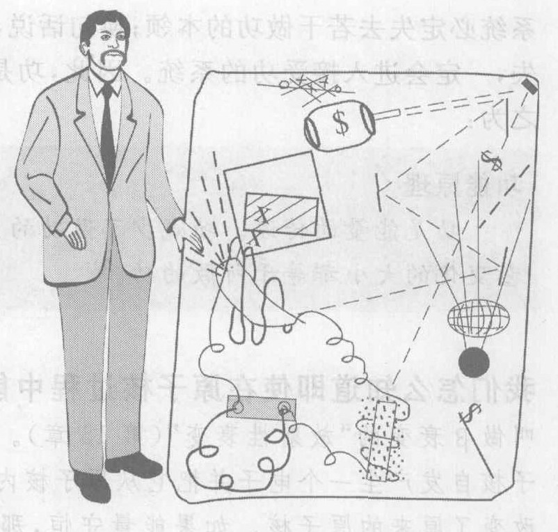

*图 6.9 “一个非凡的装置”，史铁嘴说。你会从这个人才手里买一台超高级推进器吗？*

⑦ 在露天搅拌热水，水会由于蒸发而变凉。在焦耳实验中搅拌是在避免蒸发的密闭容器中进行的。
⑧ 营养学家的卡路里总是用大卡，而物理学家则用它的 1/1 000，即使 1 克水升温 1 ℃ 所需的能量为热能的单位，叫做小卡。
⑨ 你还能听到撞击声。很小一部分能量转化成声能，声能实际上是空气的动能和弹性能的一种形式。

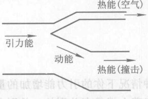

*图 6.10 考虑空气阻力时下落的书的能流图。“管道”的宽度与这个过程各个部分的能量份额相对应。由于能量守恒，管道宽度在每个分支处都匹配。*

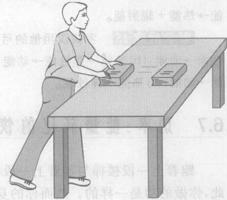

*图 6.11 短暂地推一下书，让它滑动，会发生什么能量转化？*

……这个能量来自你的身体，是化学能（见第 2.8 节）。图 6.12 是这一过程的能流图。用来推动这本书的初始化学能的大部分转化为你身体内的热能。传递给这本书的小份额的能量则最终转化为在书从滑动到停下来的过程中产生的热。也许你已注意到各种形式的能量是多么经常地转化成热能。这一趋势是第 7 章的主题。

动物体内的能量转化提供了许许多多有趣的例子。让你能做有用功的能量来自食物，以化学能的形式储存在你体内（第 2 章）。营养学家用大卡 (Calorie, 简写为 Cal) 做这种被存储的化学能的单位。例如，一片 70 大卡的面包给你 70 大卡储存的化学能，这些化学能可以提供 70 大卡的功和热能。

当动物的化学能用来做功时，这些化学能只有一小部分实际转化为有用的功。我们说这个过程是“低效率的”。相反，“高效率”过程则是大部分初始能量或“输入”能量都转化为有用的“输出”能量，浪费的份额很小。定量地说，任何能量转化过程的**能量效率**是输入中有多少份额转化为有用的输出，即
$$ \text{能量效率} = \frac{\text{有用的能量输出}}{\text{总的输入能量}} $$
它通常用百分数表示。典型的人类肌肉活动的能量效率只有大约 10%。

能量是本书的四大主题之一，在后面各章中，我们将遇到更多的能量转化和能流图。

*图 6.12 快速推一下书，让它滑过桌面而后停下来，整个这个过程的能流图。这个推动过程的效率很低，大部分初始化学能使你的身体变热，而不是传给书。*

> **概念检查 13** 光合作用（第 2 章）中的能量转化过程是 (a) 动能 $\rightarrow$ 热能；(b) 热能 $\rightarrow$ 动能；(c) 动能 $\rightarrow$ 化学能；(d) 电磁能 $\rightarrow$ 化学能；(e) 辐射能 $\rightarrow$ 化学能；(f) 化学能 $\rightarrow$ 辐射能。

> **概念检查 14** 木质火柴杆燃烧时的能量转化是 (a) 热能 $\rightarrow$ 电磁能 + 辐射能；(b) 电磁能 $\rightarrow$ 热能 + 辐射能；(c) 动能 $\rightarrow$ 化学能 + 辐射能；(d) 化学能 $\rightarrow$ 动能 + 辐射能；(e) 热能 $\rightarrow$ 化学能 + 辐射能；(f) 化学能 $\rightarrow$ 热能 + 辐射能。

> **概念检查 15** 罗宾汉用他的弓射出一支箭。从他拉弓之前起，能量转化过程是 (a) 化学能 $\rightarrow$ 弹性能 $\rightarrow$ 动能；(b) 热能 $\rightarrow$ 弹性能 $\rightarrow$ 动能；(c) 弹性能 $\rightarrow$ 化学能 $\rightarrow$ 动能；(d) 化学能 $\rightarrow$ 动能 $\rightarrow$ 弹性能；(e) 弹性能 $\rightarrow$ 动能；(f) 热能 $\rightarrow$ 弹性能。

## 6.7 功率：能量转化的快慢

跑着上一段楼梯与走着上一段楼梯有什么差别？两种情况下你的引力能增加的量相同。因此，你做的功是一样的。然而你的身体感到，跑着上楼与走着上楼是有差别的。差别在于跑着上楼时的功是在较短的时间内做的。

我们需要一个词来表明做功的快慢。我们称它为**功率**。定量地说，功率是每秒做的功的数量。换句话说，就是所做的功除以做功的时间：
$$ \text{功率} = \frac{\text{所做的功}}{\text{做功的时间}} $$
因为做功是能量转化，所以也可将功率想成是能量转化的速率。

假设你跑上一段楼梯，然后走上第二段相同的楼梯。走上第二段所用时间是跑上第一段的两倍。在每段楼梯上你所做的功相同，但是你在第一段楼梯上的功率输出，是你在第二段楼梯上的两倍。这种差别是功率不同而不是能量不同。

功率的单位是焦耳每秒 (J/s)。它同功或能量的单位的差别在于十分重要的“每秒”。功率是这样常用的概念，因此我们给它的单位一个专门的名字，焦耳每秒称为**瓦特**，简称**瓦** (W)，以纪念 18 世纪蒸汽机的开发者瓦特。1 千瓦 (kW) 是 1 000 瓦，1 兆瓦 (MW) 是 100 万瓦。

想想要每天都要用的一些装置：汽车、电灯、搅拌器、烤面包片机等。这些装置都可以看成能量转化器，把能量从一种形式转化成你所能用的另一种形式。它们的一个重要特性常常是能量转化的快慢。例如，为了从白炽灯得到某种程度的照明，白炽灯必须每秒把一定数量焦耳的电能转化为可见光。因此白炽灯等装置必须按功率大小（瓦数）来分级的，而不是按能量大小分级。汽车发动机和热电机（见下章）通用的功率单位是**马力**，1 马力大约等于 750 瓦。

**作出估计** 跑着上一段楼梯，你的输出功率是多少？如果这个过程的效率是 10%，你的（化学能的）输入功率是多少？用 W 和 Cal/s（大卡/秒，1 Cal = 4 200 J）作单位。

**解** 假设你的体重是 500 N (50 kg)，一段楼梯的垂直高度为 4 m（量一下！），你跑上这段楼梯的时间用了 5 s（试一下！），那么你上楼做的功和输出功率为：
$$ \text{功} = \text{重量} \times \text{高度} = 500 \text{ N} \times 4 \text{ m} = 2 000 \text{ J} $$
$$ \text{功率} = \text{功} \div \text{时间} = 2 000 \text{ J} \div 5 \text{ s} = 400 \text{ W} $$

如果你做了这个实验，你会发现，对于人体来说这是很大的功率输出。为了在 10% 的效率下给出这一输出，你必须以 4 000 W 即 4 000 J/s 的速率转化化学能。若用 Cal/s 作单位，则得到本例中你的代谢率：$4 000 / 4 200 \approx 0.95(\text{Cal/s})$。如果你能把这样的代谢率保持 1 小时 (3 600 s)，你就会“烧掉”（转化）$3 600 \times 0.95 = 3 400(\text{Cal})$，这是一大块牛排所含的能量。

表 6.1 给出典型的家用电器的功率。给出的数据是电器通电时间内消耗的功率。一天或一年内总的电能消耗则是另一回事。例如，烤面包片机通常每天只用很短的时间，所以尽管它的功耗很高达 1 200 W，但它每日的耗能却很低。而电冰箱的功耗虽然可以低到 300 W，但因为它每天运转许多小时，它是耗用电能最多的家用电器。

**表 6.1 家用电器通电并消耗电能时的功耗**

| 电器 | 功率/W | 电器 | 功率/W |
| :--- | :--- | :--- | :--- |
| 全套烹饪电灶 | 12 000 | 烤面包器 | 1 200 |
| 衣服烘干机 | 5 000 | 吹风机 | 1 000 |
| 热水器 | 4 500 | 冰箱（无霜） | 600 |
| 空调（挂机） | 1 600 | 冰箱（非无霜） | 300 |
| 微波炉 | 1 400 | 彩电 | 350 |
| 洗碗机（包括热水） | 1 200 | 立体声设备 | 100 |

虽然家庭一年的用电量决定了发电厂必须给出的能量，但在所谓高峰时间内的用电量却对建立新电厂的需求有特殊的影响。每个电厂都有一个最大的输出功率即其额定功率，通常是几百兆瓦。在酷热的午后很多人都开空调时，电厂的实际输出功率最大。如果功率的峰值接近电厂的额定功率，电厂将减少对所有客户的供电来削减输出，这就使白炽灯皆暗，其他电器也都处于电压不足的状态。

因为工业社会浪费大量能量，今天电力公司有许多机会为客户节约开支、提高公司的利润同时又保护环境，而又不降低服务，这靠的是设法避免建设昂贵的新电厂。当已有的电厂在高峰需求期间不能提供所需的电力时，就产生了建设新电厂的压力。节能装置可以用较少的能量提供同样的服务（例如同样的照明）。由于这些提高效率的措施常常比建设新电厂便宜得多，许多电力公司正在积极寻求和提供新的节能能量的机会。例如，由于用隔热材料使屋子暖和通常比用更多的电力取暖便宜得多，许多电力公司便提供服务和低息贷款，鼓励客户把房屋隔热。这是一个多赢的格局：客户更便宜地得到更暖的住房；电力公司因采用隔热材料比建新电厂便宜而获利；而环境也减少了资源消耗和污染而获益。

价格政策是减少对新电厂的需求的又一途径。电力公司提高用电高峰时间的电价，而降低非高峰时间的电价为平衡措施，就会鼓励人们将用电时间从高峰时间转向非高峰时间。这就减少了对建设新电厂的需求，而由此节省的费用，在增加公司利润的同时也可减少客户的电费开支。

计算你家中电能消费的最有用的单位是千瓦小时，即 1 千瓦功率运转 1 小时所转化的能量的大小，俗称 1 度电。因为 1 千瓦是 1 000 焦耳每秒，1 小时是 3 600 秒，所以
$$ 1 \text{ 千瓦小时} = 1 000 \text{ J/s} \times 3 600 \text{ s} = 3.6 \times 10^6 \text{ J} $$
如果已知电器功率的千瓦数和工作的小时数，容易算出所消耗的能量是多少度电，这只要用千瓦数乘小时数就行了。

**电价大约每度电 8 美分。** $3 600 000 \text{ J}$ 才 8 美分，听起来相当便宜。有多便宜？例如，$3 600 000 \text{ J}$ 能把重 1 000 N (100 kg) 的一个人提升到多高？因为提升一个物体所做的功，是这个物体的重量与它被提升的距离的乘积，所以这 $3 600 000 \text{ J}$ 一定等于 1 000 N 与这个距离之积。于是，这个距离等于 $3 600 000 \text{ J}$ 除以 1 000 N，也就是 3 600 m，超过 1 000 丈！这个提升高度不可谓不大，但仅用 8 美分。电是非常便宜的，因而我们大量用它。美国家庭平均每小时消费大约 1.4 度电。

社会对能量的使用是今天一个至关重要的问题，这有许多原因，其中包括全球变暖、污染、国家安全、能源耗竭、核能争议以及环境破坏等。这些问题是本书的若干节和整个第 17 章的主题。

> **概念检查 16** 你在 2 秒钟内，从齐肩高处向上推举 500 N 重物至臂长所及之处，距离大约 0.8 m。你做了多少功？(a) 800 W；(b) 800 J；(c) 400 W；(d) 400 J；(e) 200 W；(f) 200 J。

> **概念检查 17** 在前一问题中，你的功率输出是 (a) 800 W；(b) 800 J；(c) 400 W；(d) 400 J；(e) 200 W；(f) 200 J。

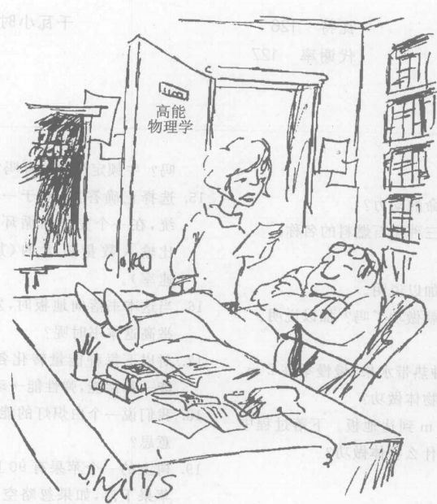

---

### 概念检查答案

1. (a)。
2. 杰德和奈德都没有把墙推动，因此所做功为零，(c)。然而在微观层次上，奈德的肌肉相互之间做功。这个微观功只是在奈德体内做功，它使奈德出汗，但对墙不做任何功。
3. (d)。
4. 除了起动和停止阶段，书是以不变的速度运动的（零加速度），因此合力为零，(a)。
5. (b)。
6. (b)。
7. (e)。
8. (c)。空气阻力忽略不计意味着引力就是合力，而它使书加速。
9. 在地板之上的高度现在为零，因此没有引力能。能量守恒原理告诉我们总能量仍为 120 J，因此动能的大小必定就是这个值（因为在下落过程中没有其他形式的能量产生），(b)。
10. (c) 和 (e)。
11. 水库中的高水位产生水压，将水压着通过水轮机，(a)。这一水位可进一步追溯到水的蒸发，它将水升使水能下落为雨。蒸发是太阳的辐射能引起的，(d)。
12. 别投资，并且别费脑筋去研究他的设计。SOS 违背能量守恒原理。超级推进器必须做功才能使宇宙飞船加速，因此这个装置输出能量。而能量守恒原理告诉我们，这个装置必定也消耗能量，因此它需要可供消耗的燃料供应。你不能无中生有。
13. (e)。
14. (f)。
15. (a)。
16. $\text{功} = \text{力} \times \text{距离} = 500 \text{ N} \times 0.8 \text{ m} = 400 \text{ J}$，(d)。
17. $\text{功率} = \text{功} / \text{时间} = 400 \text{ J} / 2 \text{ s} = 200 \text{ W}$，(e)。

---

### 关键概念

下述概念的定义出现在所标页码的本书正文页面上和书末的按拼音排序的术语词汇中。我们将它们按出现先后顺序排列在这里，你可以用这个清单复习本章内容。

*   化石燃料 115
*   产业革命 115
*   功 117
*   牛顿米 117
*   焦耳 117
*   能量 117
*   能量形式 120
*   动能 120
*   引力能 120
*   弹性能 121
*   热能 121
*   热运动 121
*   电磁能 121
*   辐射能 121
*   化学能 121
*   核能 121
*   能量守恒定律 122
*   功能原理 123
*   热传递 123
*   大卡 125
*   能流图 125
*   能量效率 126
*   功率 126
*   瓦特 126
*   代谢率 127
*   千瓦小时 128

---

### 复习题

**引言**
1.  哪种能量技术是产业革命的动力？
2.  什么是化石燃料？说出三种化石燃料的名称。

**功**
3.  只要施力就做功了吗？加以说明。
4.  只要物体运动一段距离就做功了吗？加以说明。
5.  功与哪两个量成正比？
6.  把重 3 N 的葡萄柚（一种热带水果）慢慢举高 2 m。你做了多少功？对什么物体做功？
7.  重 3 N 的葡萄柚下落 2 m 到达地板。下落过程中做功了吗？什么物体对什么物体做功？

**能量**
8.  说明能量和功的区别。
9.  列出八种不同物理类型的能量。
10. 从微观的角度说明热能。
11. 对下列每种形式的能量各举一例：弹性能、热能、化学能、动能、辐射能和引力能。
12. 如果你使速率加倍，如何影响动能？如果你将高度加倍，如何影响引力能？
13. 选择正确答案：1 J 与 1 ($\text{W} \cdot \text{m}$, $\text{N} \cdot \text{m}$, $\text{m/s}^2$, $\text{N} \cdot \text{s}$, $\text{kW} \cdot \text{h}$) 相同。

**能量守恒定律与能量转化**
14. 在迄今观察过的所有情况下能量守恒定律都正确吗？牛顿定律也这样吗？加以说明。
15. 选择正确答案：对于一个回到其初始状态的系统，在一个完整的循环内你不能从该系统得到比输入数量更大的 (加速度、力、能量、功率、速率)。
16. 当这本书落向地板时，发生哪些能量转化？当你举高这本书时呢？
17. 对以下每种能量转化各举一例：动能$\rightarrow$热能，动能$\rightarrow$弹性能，弹性能$\rightarrow$动能。
18. 我们说一个白炽灯的能量效率是 10%，这是什么意思？
19. 树上的一个苹果有 90 J 的引力能（相对于地面）。苹果下落，如果忽略空气阻力，在它即撞击地面之前，它的动能是多少？如果不忽略空气阻力呢？

**功率**
20. 说明能量与功率的差别。
21. 选择正确答案：(W, N/s, J, 卡, J/s, m/s, 马力, $\text{kW} \cdot \text{h}$) 是功率单位。哪些是能量的单位？
22. 你在 3 s 内把 2 N 的石头举高 4 m。你输出了多少功？输出功率是多少？
23. 你每月是为什么交电费？能量还是功率？

---

### 思考题

1.  你下楼时地球的引力对你做功吗？
2.  为了使你起床时做的功最小，你是把床垫放在地板上好，还是放在大约 1 m 高的地方好？加以说明。
3.  描述你能做的产生弹性能的功，产生引力能的功，产生动能的功。
4.  描述你能做的产生热能的功。
5.  你用左手把重 2 N 的苹果举起 1.5 m，用右手把重 4 N 的葡萄柚举起 0.5 m。哪只手做的功多？哪只手用的力大？
6.  作出估计。把美国全体居民升高 1 km，大约要做多少功？
7.  八种不同形式的能量中哪一种是最早的人类文化的基础？哪一种是产业革命的基础？哪些其他形式已为早期文化使用，哪些其他的形式在今天还在使用？
8.  下面每种情况具有哪种能量？基尔停在滑梯顶部、基尔滑着离开滑梯底部、阳光、热空气。
9.  说出下列每种情况所具有的主要是哪一种能量：黄色炸药、在高坝后静止的水、即将射出的弓、火柴、食物。
10. 说出下列每种情况所具有的是哪种能量：一举举起的书、汽油、拉伸的弹簧、日光、高速行驶的火车、热水。
11. 在你静坐时你的身体含有动能吗？加以说明。
12. 给出一个既有动能又有引力能的系统的例子。
13. 向上抛一个橡皮球，它从天花板反弹回来，在它的最高点（这时它撞到天花板）它有哪些能量？
14. 说出两种由一次典型的爆炸（例如黄色炸药爆炸）产生的能量。用掉的是哪种能量？
15. 你举起一块砖放到墙头。为了确定你做了多少功，你可能会测量哪些量？
16. 扔出一个垒球。为了确定你扔球时做了多少功，你可能会测量哪些量？
17. 从微观角度说明为什么轮胎里的空气压力在热天增大。加热气球中的空气，气球是膨胀还是收缩？为什么？
18. (a) 一个苹果是在 100 km 高度上还是在 1 000 km 高度上有更大的引力能？(b) 把一个绕轨道运行的卫星从 6 000 km 高的轨道转移到 12 000 km 高的轨道上，它的引力能是增加还是减少（见图 6.13）？(c) 在 6 000 km 高处，还是在 12 000 km 高处，卫星受到的引力更大？

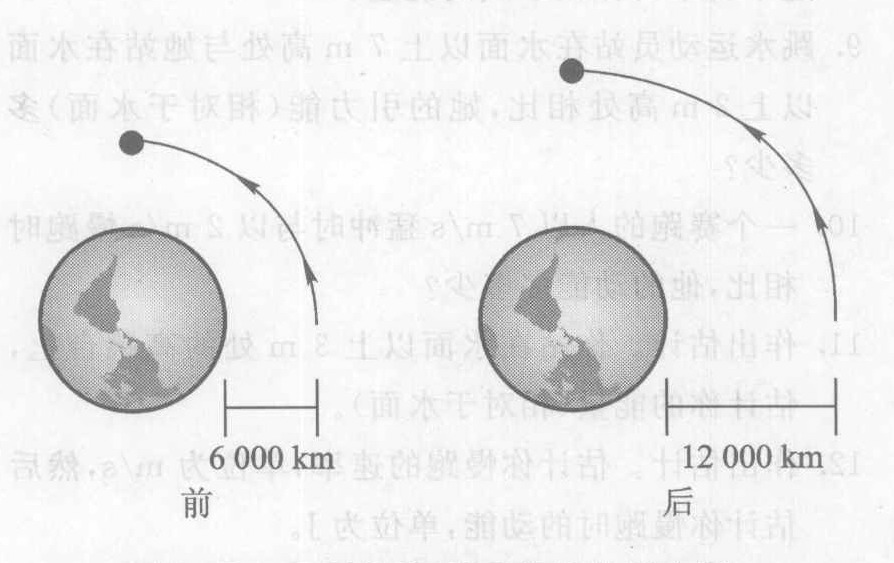

*图 6.13 卫星被移到更高的轨道上时，它的引力能发生什么变化？*

19. 如果你在地面之上的高度增为 3 倍，对你的引力能（相对于地面）有何影响？
20. 如果你使所在的高度减半，对你的引力能（相对于地面）有何影响？
21. 如果你的速率增为 3 倍，对你的动能有何影响？
22. 如果你的速率减半，对你的动能有何影响？
23. 给出动能转化为引力能的例子。
24. 给出一个动能转化为热能的例子。
25. 给出以一个化学能转化为动能的例子。
26. 汽车加速时，主要的能量转化（输入和有用输出）是什么？自行车加速时呢？
27. 忽略空气阻力，下落的石头的能量是增加，还是减少，还是不变？它的动能呢？它的引力能呢？
28. 考虑空气阻力，下落的石头的能量是增加，还是减少，还是不变？它的动能呢？它的热能呢？
29. 在电动搅拌器工作时发生的主要是什么能量转化（输入和有用输出）？烤面包片机呢？白炽灯呢？
30. 压缩一根弹簧，把它保持在压缩的位置。然后把夹着的弹簧放入酸中把弹簧溶解掉，它的弹性能到哪里去了？
31. 爬绳时发生什么能量转化？
32. 你水平抛出一垒球，基尔接住它。忽略空气阻力。描述发生在 (a) 即将抛球（球还在你手中）时和 (b) 接球时的能量转化。
33. 你向抛出一球，然后在同一高度接住它。球的末速度与初速度相比如何？(a) 忽略空气阻力，(b) 考虑空气阻力。说明答案的理由。
34. 汽车行驶，是否要用更多的汽油？汽车开空调时呢？（注意：当发动机运转时，电池并不为这些装置提供能源。）说明答案的理由。
35. 想象一部效率为 100% 的汽车。它会排出任何废热吗？它的发动机发热吗？
36. 图 6.14 给出一辆过山车在地面以上的高度与它走过的轨道的长度的关系曲线。车被向上拉到离起点 100 m 处的最高点。过山车从这个最高点自由滑行到终点。假设过山车在这个最高点从静止开始下滑，并且没有摩擦力和空气阻力。在 200 m 处与终点之间，它在何处走得最慢？何处走得最快？
37. 参看上题。过山车在 1 000 m 处还是在 1 100 m 处更快些？描述过山车在最后 300 m（900 m 至终点）速度的变化情况。

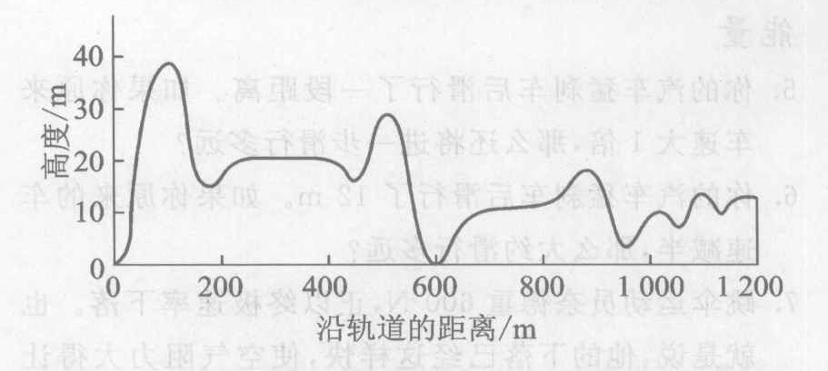

*图 6.14 过山车的高度与沿轨道运行距离的关系曲线。*

---

### 习题

**功率**

38. 你甩动胳膊扔出一个保龄球，然后用长把锤猛捶地击出另一个完全一样的保龄球，其速率与第一个相同。以上两种情况中哪一种把更多的动能传给保龄球？哪一种情况的输出功率更大？
39. 你把砖举到桌上，每次一块。过一会儿，你开始举得越来越慢了。随着你慢下来，你举起每块砖所投入的能量是增加，还是减少，还是保持不变？你举砖的功率又怎样？
40. 还有什么单位可以代替马力对汽车发动机分挡？
41. 为什么夏季的电价常常比冬季高？
42. 下面哪个过程的输出功率更大：一个是在 0.1 s 内做了 2 J 的功，另一个是在 1 小时内做了 1 000 J 的功？哪个过程输出的能量更大？
43. 一辆汽车在 50 分钟内行驶了 60 km，在这个过程中对抗外力（空气阻力和滚动阻力）做了 $30 \times 10^6 \text{ J}$ 的功。汽车的平均输出功率是多少瓦？
44. 参看上题。如果汽车能量效率为 10%，它的输入功率（把汽油的化学能转化成其他形式的能量的快慢）是多少瓦？它能点亮多少只 100 W 的白炽灯？
45. 一个自行车骑手传给她的自行车的功率为 150 W，而她的代谢率为 1 000 W。她的身体的车的能量效率是多少？
46. 假设非无霜冰箱每天消耗功率 8 小时，电费是每度 10 美分，这个冰箱工作一个月要多少电费？如果是无霜冰箱呢？（利用表 6.1。）
47. 如果在电机烘干机里烘干一批衣服需要 30 分钟，而你每月要烘干 16 批，若电价为每千瓦小时 10 美分，那么一个月的烘干费用是多少？
48. 一个衣服烘干机相当于多少只 100 W 白炽灯？利用表 6.1。
49. 作出估计。利用表 6.1 估计一个典型的三口或四口之家一个月内消耗的电能的度数。别忘了白炽灯（它们未列入表 6.1）。

**功**

1.  你的汽油发动机的汽油供应应做 5 000 J 的功。如果你重 800 N，这个发动机能把你升到多高？
2.  一架大型喷气机有四个发动机，每个的推力为 30 000 N，在 1 500 m 的起飞滑跑中，发动机要做多少功？
3.  如果你做 20 J 的功把一个重 30 N 的石块举起来，你将把它举多高？
4.  如果一架飞机在 1 000 m 的起飞滑行中，做了 40 MJ 的功，它的发动机的总推力该多大？

**能量**

5.  你的汽车猛刹车后滑行了一段距离。如果你原来车速大 1 倍，那将滑行多远？
6.  你的汽车猛刹车后滑行了 12 m。如果你原来的车速减半，那大滑行多远？
7.  跳伞运动员奈德重 600 N，正以终极速率下落。也就是说，他的下落已经这样快，使空气阻力大得让他下落速率不变。当奈德以这样的终极速率下落 200 m 时，他对空气做了多少功？
8.  在前一问题中，所做的功转化成什么形式的能量？这个功来自什么形式的能量？
9.  跳水运动员站在水面上以上 7 m 高处与她站在水面上以上 2 m 高处相比，她的引力能（相对于水面）多多少？
10. 一个赛跑的人以 7 m/s 猛冲时与以 2 m/s 慢跑时相比，他的动能多多少？
11. 作出估计。你站在水面以上 3 m 处的高跳台上，估计你的能量（相对于水面）。
12. 作出估计。估计你慢跑的速率，单位为 m/s，然后估计你慢跑时的动能，单位为 J。
13. 利用你对上一问题的答案估计你步行时的动能，假定你的步行速率是慢跑速率的一半。

**能量定律与能量转化**

14. 杰克质量为 30 kg，体重 300 N，坐在儿童秋千上。你把秋千向后拉到最低点上方 2 m 处，然后放开。当杰克被拉到后方并保持静止时，他具有哪种形式的能量？能量有多大？
15. 在上题中，当杰克摆动通过最低点时，他具有哪种形式的能量？能量有多大（忽略空气阻力和运动部分的摩擦）？在这一点上，杰克运动得多快？
16. 在一次撞车试验中，一辆 1 000 kg 的汽车以 10 m/s 的速率撞在一面砖墙上。毁坏墙与汽车并使它们变热的能量是多大？
17. 参看上题。汽车要从多高的悬崖上掉下，才能使它撞到地面时遭受与上题相同的破坏？注意，一辆 1 000 kg 的汽车（在地球上）重约 10 000 N。

**功率**

18. 你做引体向上，在 2 s 内把自己提升 0.5 m。若你的体重是 600 N，你做了多少功？在引体向上过程中你的功率输出是多少？
19. 一个 75 W 白炽灯工作了 30 分钟，它用了多少能量？
20. 100 万焦耳的电能，可供一个 100 W 的白炽灯工作多久？
21. 一个 60 kg 的跑步的人，在 0.5 s 内速率由 0 加速到 10 m/s，求他的功率输出。
22. 试比较一个普通人跑步上一段楼梯所用的代谢能与一个 100 W 白炽灯点亮 1 分钟所需的能量的大小。