# 第 7 章 热力学第二定律：连不盈不亏也不行

> 我曾多次出席一些……被认为受过良好教育的人的集会，这些人一直夸夸其谈地表示，他们难以相信科学家如此缺乏文化素养。有一次我被惹火了，就问他们当中有多少人能够叙述热力学第二定律。回答是一片冷寂；也是否定的。然而，我问的问题实际上大致是“你们读过莎士比亚的书吗？”这个问题在科学领域内的翻版。
> ——斯诺，英国科学家与作家

在学习上一章的过程中，你可能已经留意到，出现在许多过程中的能量最终都转化成热能。各种非热能形式的能量最终转化为热能的倾向是宇宙中一个重要的普遍特性，称为**热力学第二定律**，简称“第二定律”。它就是本章的主题。

正如第 6 章中看到的，在认识能量的过程中，一项重大突破就是发现“热”是能量形式的一种（热能），或者说，与其他形式的能量一样，热能可以做功，做功也能产生热能。这个突破显示，即使在涉及热能的过程中，能量守恒定律也是成立的。由于热能在认识能量的普遍规律的过程中起着重要的作用，因此，人们就把研究能量的学科叫做**热力学**，而能量守恒定律的一种重新表述方式常常就叫做**热力学第一定律**。人们还没有发现违反这些热力学定律的事例，热力学定律属于已知的最普遍的科学规律之列。

第二定律有三种不同的表述方式。在其最直截了当的表述形式中，它是人人熟悉的一个对能量流动的观察结果（第 7.1 节）。与许多日常的观察结果一样，这一表述方式有一个意义深远的推论。第 7.2 节讨论第二定律的另一种表述形式，这种表述形式着重强调了热能的特殊本性。与其他形式的能量不同，热能只能以有限的效率转化成其他形式。这导致对人类社会中很重要的一种设备——**热机**的讨论（第 7.2 节和 7.3 节）。第 7.4 节给出第二定律的第三种表述方式，即**熵增加定律**。它那引人入胜的哲学涵义包括时间的方向，宇宙的最终命运，以及为何会有热力学第二定律等。第 7.5 节、第 7.6 节和第 7.7 节研究两种重要的热机——汽车和蒸汽发电机的物理原理和社会意义。由于这些题目提出了能源的问题，因此，我们在这里自然要讨论指数增长规律及其在能源消耗竭问题上的意义。（第 7.8 节）

## 7.1 热传递

用手摸一块冰（图 7.1）。从能量的角度看，发生了什么事？由于你的手变凉了，而冰块则开始融化，因此，热能必定从你的手传到冰块上。再用手摸一杯热咖啡（图 7.2）。你的手变得温暖，而咖啡则变凉，因此，热能必定从杯子传到你的手上。注意在每种情况下，热能都从高温物体传到低温物体。在这里有一条普遍的原理起作用，当你用手摸一件感到热或冷的东西时，你就会体验到这条原理：热能自发地（无需外界的帮助）从热的区域传到冷的区域。热能从较高的温度传到较低的温度的过程叫做**热传递**。

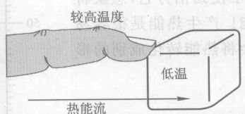

*图 7.1 当你摸一块冰时，热能从温度较高的手流向温度较低的冰，因此冰变暖了而你的手指变冷了。*

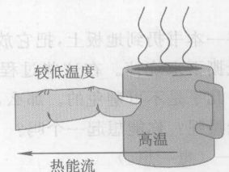

*图 7.2 当你摸一杯热咖啡时，热能从高温的杯子流向温度较低的手，因此你的手指变热了而咖啡杯变凉了。*

热传递有一种单向特性：热能会自发地从较高的温度传到较低的温度，但不会从较低的温度传到较高的温度。像许多简单的概念一样，热传递的这种单向性具有意义深远的推论。它是热力学第二定律的一种表述方式：

> **表述为热传递定律的热力学第二定律**
> 热能自发地从较高的温度传到较低的温度，但不会从较低的温度传到较高的温度。

现在，我们需要更加定量地计论。**温度**是对温暖程度的定量量度。我们在第 2 章中了解到，一个物体的温度与该物体内的分子的微观运动相联系。大多数材料受热时都会膨胀，原因是，更快速地运动的分子要比慢速运动的分子占据更大的空间，这和跳吉特巴双人舞的*在一个拥挤的舞台上要比跳慢速双人舞的需要更大的空间是同样的道理。因此，大多数材料受热时膨胀就不足为奇了。这种膨胀可以用来作为测温器件或**温度计**的基础。一种选择是选液态水银，让它在一根玻璃管内膨胀。标准的（公制的）温度单位是**摄氏度**（℃）。摄氏温标规定水的冰点和沸点分别为 0℃ 和 100℃。只有美国还在使用已经过时的**华氏温标**，在华氏温标中，水在 32°F 结冰，在 212°F 沸腾（图 7.3）。

温度与热能有关系，但是是不同的东西。举个例子，一个冷水湖所含的热能比一杯热咖啡多得多，尽管湖水的温度较低，因为湖比杯子大得多。而一杯湖水所含的热能则比一杯热咖啡少。

> **概念检查 1** 风和日丽天的温度大约是 (a) 10℃；(b) 75℃；(c) 40℃；(d) 55℃；(e) 25℃。（提示：见图 7.3。）

> **概念检查 2** 假定你抓住一个冷冰冰的球形门把手并惊讶地发现，这使你的手变热了而门把手却变得更冷。这将 (a) 违反能量守恒定律；(b) 违反热力学第二定律；(c) 既违反能量守恒定律又违反第二定律；(d) 既不违反能量守恒定律，也不违反热力学第二定律；(e) 不违反任何已知的物理定律。

*\* 吉特巴舞 (jitterbug)，一种随爵士音乐节拍跳的快速舞。——译者注*

## 7.2 热机：用热能做功

将一本书扔到地板上，把它放在桌面上轻轻滑动，用手使劲拍打它，想象将一页纸撕下来烧掉。在这些过程中的每一个都产生热能！产生热能是很容易的——几乎是不可避免的。那么，有什么过程或者设备会将热能转化成别的形式的能量呢？你能想起一个吗？
——（想一想。）

**汽车发动机**是一个例子，它在有规律的循环往复中运转，用燃烧汽油所得的热能做功。另一个例子是**蒸汽发电机**，它也是循环往复地运转，用热蒸汽做功。这种用热能做功的循环装置叫做**热机**。① 汽车发动机的一个重要特性是，除了做功之外，它还放出大量热能。比方说，一辆汽车会通过散热器和排气管放出未使用的热能。因此，并不是发动机中产生的热能实际上都用来做功。人们发现，对一切热机都是这样。一部热机排出的热能叫做该热机的**损耗**（或废热）。因此，任何热机的能量转化过程是：
**热能（输入）→ 功（它可以产生任何别的形式的能量）+ 热能（损耗）**
见图 7.4。

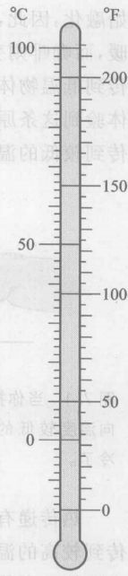

*图 7.3 摄氏温标与华氏温标的比较*

从第 6 章我们还记得，任何设备的**能量效率**等于输出的有用能量除以输入到该设备的总能量。由于一般认为热机所做的功是“有用的”，而损耗则是“无用的”，任何热机的能量效率就是
$$ \text{能量效率} = \frac{\text{输出的功}}{\text{输入的热能}} $$

从图 7.4 中可以看到，输出的功必定小于输入的热能，因此，能量效率一定小于 1，换句话说，小于 100%。所以，说热机总是有损耗，和说热机的效率总是小于 100%，两种说法是等同的。

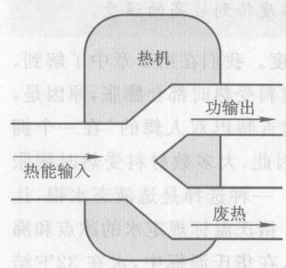

*图 7.4 热机中的能流。热机消耗热能并将其一部分转化为功，这些功接着可以产生其他形式的能量。*

你不能全额消费（或使用）热能，总得损耗掉一部分，这一事实每次检验都是正确的。换句话说，它是自然界的一条基本原理。但是我们将看到，它并不是自然界的另一条新原理。它所具有的这种单向性使人想起热传递定律。后来发现，它就是热力学第二定律，只不过用新的话语表述出来，这也许并不会使我们感到惊奇。我们把它叫做：

> **表述为热机定律的热力学第二定律**
> 用热能做功的任何循环过程必定也有热能损耗。换句话说，热机用热能做功的效率永远小于 100%。

*① 有一些非循环的装置也使用热能做功。比方说，一个热气球用热空气使气球上升。这种装置不叫热机。*

**我们怎么知道没有任何热机的效率能够达到 100%？** 我们相信热机定律的一个理由是，如果这条定律不成立，就有可能违背热传递定律让热能从冷流向热。下面用一个想象的“思想实验”来论证这一点。

我们暂时假定有一部热机能够违反热机定律将热能全部转化为功。于是我们就可以利用这部热机从比方说一罐温水中提取热能并将其全部转化为功。然后这些功可以在一个较高的温度处产生热能（比方通过摩擦一块金属使其发热）。这个过程的净结果就是将全部热能从较低的温度输送到较高的温度，而不发生任何其他改变。但这正是热传递定律告诉我们的做不到的事。换句话说，任何违反热机定律的过程一定违反热传递定律。但是，从实验我们直接知道，热传递定律是不会被违反的。由此可得，热机定律也不能被违反。

从以上的论证不难得出结论，热机依靠热能从热向冷的自发流动。事实上，一部热机可以看做这样一台设备，它实际利用热能从热向冷的自然流动，分出一部分流动的热能来做功（图 7.5）。由于热机靠热能从热向冷流动来驱动，因此，在能有一部热机之前首先必须有一个温差。例如，海洋含有大量的热能，但是，如果没有一个更冷的系统让海洋的热能流进去，就不能用这种热能做功。② 热机总是在两个温度不同的系统之间运转，如图 7.5 所示。

一部优良的热机的能效效率有多大？由于世界上的大部分能量是供热机使用的（主要是运输器械和蒸汽发电），因此这是一个重要问题。由于热机是靠热能从热向冷流动而运转，我们预料它的能量效率会受到其较热的**输入温度**（热能进入热机的温度）及其较冷的**排出温度**的影响。由于温差驱动热机，因此我们预料，输入温度与排出温度之间的温差越大，热机的效率越高。19 世纪的物理学家发现了一个定量的公式，对工作于任何预先确定的输入温度与排出温度的热机可能达到的**最高效率**做出了预言。③ 作为例子，表 7.1 列出了几种具体类型的热机可能达到的最高效率的预言值，以及这些热机在实际中达到的效率。

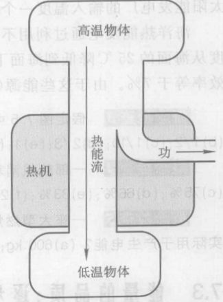

*图 7.5 热机使用从高温自然流向低温的热能的一部分将其转化为功。*

*② 这意味着大洋中不同深度的温差可以用来驱动热机。*
*③ 这个公式是：效率 = ($T_{输入} - T_{排出}$) / $T_{输入}$。在这个公式中，温度用一种新的温标开(K)来度量。以 K 表示的温度数值可由以 ℃ 表示的温度数值加上 273 得到。由于 0 K（等于 -273℃）是可能达到的最低温度，因此称之为绝对零度，在绝对零度下，所有的微观运动达到最小程度。*

**表 7.1 热机的效率。典型的输入温度与排出温度，可能达到的最高效率和实际效率。**

| 热机类型 | $T_{输入}$ /℃ | $T_{排出}$ /℃ | 效率 /% | |
| :--- | :---: | :---: | :---: | :---: |
| | | | **可能达到的最高效率** | **实际效率** |
| **运输业** | | | | |
| 汽油发动机 汽车/卡车 | 400 | 25 | 55 | 10～15 |
| 柴油发动机 汽车/卡车/机车 | 500 | 25 | 60 | 15～20 |
| 蒸汽机车 | 180 | 100 | 20 | 10 |
| **蒸汽发电厂** | | | | |
| 化石燃料 | 550 | 40 | 60 | 40 |
| 核动力 | 350 | 40 | 50 | 35 |
| 太阳能 | 225 | 40 | 38 | 30 |
| 海洋热能 | 25 | 5 | 7 | ? |

表 7.1 显示出第二定律对社会是何等重要：它使得即使是理想的热机其效率也只有 60% 或更小。摩擦和其他缺陷会进一步降低效率。用在这些热机上的能量只有不到一半被用来做功。不过，剩余的热能不一定都浪费掉，因为排出的热能可能还足够热，可以直接用来加热，这个过程叫做**热电联产**。事实上，许多蒸汽发电厂都同时产生电力与有用的热能。

表 7.1 还显示出“燃烧处的热”与“排出处的冷”的重要性。例如，化石燃料发电厂、核电站、太阳能发电厂的输入温度一个比一个低。你可以看到，效率随着 $T_{输入}$ 与 $T_{排出}$ 之差变小而下降。

海洋热能发电通过利用不同深度海水的温差来利用海洋中的热能。在热带地区，海洋的温度从海面的 25℃ 降低到海面下 300 m 处的 5℃。可以利用这一微小的温差来驱动一部热机，其效率等于 7%。由于这些能源（照射到海洋上的太阳光）是免费的，能量效率低没有多大关系。

> **概念检查 3** 假定图 7.5 中的能流与每条“管道”的宽度成正比，这部热机的效率最接近 (a) 1/3；(b) 1/2；(c) 1/10；(d) 2/3；(e) 1；(f) 2。

> **概念检查 4** 一部热机消耗 400 J 热能并排出 300 J 废热，它的效率等于 (a) 133%；(b) 100%；(c) 75%；(d) 66%；(e) 33%；(f) 25%。

> **概念检查 5** 一座大型燃煤发电厂每 10 秒烧大约 1 吨 (1000 kg) 煤。根据表 7.1，其中有多少实际用于产生电能？(a) 600 kg；(b) 60 kg；(c) 500 kg；(d) 400 kg。

## 7.3 能量的品质：逐步降级

热能是一种很特别的能量。一颗飞行的子弹与一块举高的石头能够轻易地用自身几乎全部的动能或引力势能做功，但是第二定律对热能能够转化为功的比例给出了严格的限制。因此，热能不能像别的形式的能量有用，或者说热能的**品质**比别的形式的能量的品质低。只要别的形式的能量转化为热能（如通过摩擦或燃烧），就降低了能量的有用程度，尽管能量的总量保持不变。

因此，任何产生热能的过程都有其一种单向性，或者叫做**不可逆**性。一个系统一旦产生了热能，这个系统就永远不能靠自己回到原先的状态。为了使系统还原，就必须将系统产生出来的热能转变回其原来的形式，而第二定律禁止这种过程发生。系统只有靠外界帮助才能回到其初始状态。

考虑用绳子绑着吊在钩子上以此来回摆动的一块石头（图 7.6）。空气阻力及（绳子与钩子之间的）摩擦力使石头逐渐停下来。尽管整个系统（石头、绳子、钩子以及周围的空气）没有损失任何能量，但是由于这个过程产生了热能，而产生出来的热能不能完全变回动能或引力能，因此这个系统不能恢复其初始状态。当系统像这样逐步停下来时，某种东西永久地丢失了，不过丢失的不是能量，因为能量是守恒的。但是，**能量的品质**丢失了。

当我们使用地球上的能源时，并不会减少地球的总能量。我们只不过是将能量从高度有用的形式（如石油中的化学能）降级为不那么有用的形式（通常就是热能）。于是，能量的两大定律之一告诉我们，能量的数量是守恒的，另一条定律则告诉我们，能量的品质不断降低。透支是不行的，甚至**连不盈不亏也办不到**。

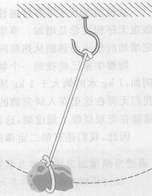

*图 7.6 一块石头用绳子吊在高处某个固定点上摆动。石头慢慢停下来，显示出第二定律隐含的自然过程的不可逆性。*

## 7.4 熵增加定律：为什么连不盈不亏也不行

假设让一盒热气体与一盒冷气体相互接触，这样热能（但不是气体本身）可以在二者之间流动。由热传递定律可知热能将从热盒子向冷盒子流动。这个过程将持续到两个盒子之间不再有温差为止。

图 7.7 从微观角度考察这个过程，只画出了几个分子。热盒子中的分子平均来说运动得较快。热能的交换导致热气体中分子的运动减慢，冷气体中分子的运动加快，直到两盒气体达到某个中间温度为止。现在，两个盒子中的分子的平均速率相同，因此，快分子和慢分子不再彼此区分。④ 从微观观点看，这个系统组织得较差。**微观无序程度**增加了。

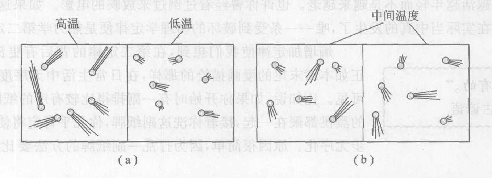

*图 7.7 (a) 只画出了一盒热气体与一盒冷气体中几个气体分子的微观画面：(a) 在开始接触的一瞬间；(b) 在两个盒子达到同一温度一段时间后。图 (b) 显示出比 (a) 更差的组织状态，因为运动较快的分子不再和较慢的分子分隔开。*

*④ 如果两个盒子装的是不同种类的气体，比方说，一个盒子装的是 $O_2$，另一个盒子装的是 $N_2$，那么，当两种气体达到一个共同的中间温度时，单个分子的平均动能相等，而不是平均速率相等。*

这种情况其实带有普遍性，不论材料是什么体还是别的东西。当热能从热向冷流动时，微观无序程度总是增加。事实上，人们最终发现（尽管我们在这里不去证明它），微观无序程度必定增加的想法与热能从热流向冷的想法是等价的。换句话说，这是第二定律的另一种表述方式。

物理学家已经找到一个物理量，用来度量任何系统的微观无序程度。这个物理量叫做**熵**。例如，1 kg 水的熵大于 1 kg 冰的熵，因为水分子不像冰的分子一样组织成有规则的晶体型式。我们无需在这里深入研究熵的精确定义。只要知道测量系统的温度和热量及其余几个量如体积就可以在宏观层级上量度熵，这就够了。

因此，我们有第二定律的第三种表述方式：

> **表述为熵增加定律的热力学第二定律**
> 任何物理过程的全部参与者的总熵（或微观无序程度）在过程中不会减少，但可能增加。

熵增加定律与能量守恒定律相似。二者都对自然过程加以限制：任何过程的全部参与者的总能量一定保持不变，而总熵则一定不减少。
熵增加定律预言，大多数过程是**不可逆**的——不能向相反方向进行。例如，前面提到的热气体盒和冷气体盒可以自发地变到相同的温度，但它们不会从相同的温度出发，变为不同的温度，除非有外界帮助（一边放一个加热器，另一边放一个冷却器）。过程必定朝着熵增加而不是减少的方向进行。事实上，除了在亚原子层级上有一种很微妙的效应⑤之外，热力学第二定律是区分**向前**与**向后**两个时间方向的**唯一的**物理学原理。

因此，如果不是因为第二定律，一切事物逆着时间方向也一样会进行。比方说，静止放在桌子上的一本书能够将自身的一些热能转化为动能和引力势能并自发地跳到空中。这正是这本书掉到桌子上这个过程的逆过程。这似乎违反了像牛顿运动定律这样一些原理，不过从微观尺度上看不违反：尽管可能性极小，但是还是有可能书中随机运动的分子全体刚好在同一时刻以足够大的速率向上运动而跳离桌面。与此相似，水能往山上流，热能可以从冷流向热。人也会越活越年轻而不是越来越老。也许你曾经看过倒过来放映的电影。如果这些逆着时间方向的事件在实际当中真的发生了，**唯一**一条受到破坏的物理学定律便是热力学第二定律。

> 矮胖子*坐在墙上，
> 矮胖子摔到地上。
> 任国王所有的马匹，
> 任国王所有的子民，
> 再也无法将矮胖子拼成原样。
> ——鹅妈妈韵文

> 这是牌里有的。**
> ——古谚语

熵增加定律使我们想到，在第二定律的背后有更深层的原因。正如本章末尾的漫画描绘的那样，在日常生活中无序度的增加随处可见。比如说，如果你开始时有一副排列得比较有序的纸牌，其中所有的黑桃都聚在一起，接着你洗这副纸牌，你几乎肯定将使这副牌进一无序化。原因很简单，因为乱打一副纸牌的方法要比使其进一步有序排列的方法多得多。将物体搞乱很容易，但是要把它们收拾整齐就得费工夫了——或者要靠很好的运气。因此，第二定律是由于简单的统计学理由而引起的。像一副纸牌一样，分子系统向更大的无序程度演化的趋势比向更有序的状态演化的趋势强得多，这只是因为使分子系统变得更无序的方法比使其变得有序的方法多得多。

由此得出了一个令人迷惑的关于宇宙的长远命运的观点。将第二定律应用于整个宇宙，将给出这样的结论：宇宙的自然演化一定是朝着更大的无序度的方向进行。于是，宇宙的最终结局将是一个无序度最大的状态，在这种状态下不会再发生进一步的宏观发展。这样一个状态确实使人烦恼。所有的恒星都将烧完，不会再有新的恒星诞生，因为所有的核反应过程都已完结。生命也不能存在，因为没有像太阳那样发光的恒星，并且所有的化学反应也都已完结。这种状态被称为“宇宙热寂”。由于这是一个千百亿年之后的事，它并非当今最紧迫的问题。更重要的是，这里有很大的猜测成分，因为假定我们对物理学原理已了解得如此之透彻，以至于可以把它们在一切时间应用于整个宇宙，这样做总是冒脸的。

*⑤ 物理学家于 1964 年发现，一种叫做 K 介子的亚原子粒子会区分时间的正向与逆向。尚不知道这个发现与热力学第二定律或关于时间正向的感觉是否有任何关系。*
*\* 矮胖子 (Humpty Dumpty) 是古老儿歌中的蛋形人。在英语中，Humpty Dumpty 已成了一个习语，指损坏了就无法再修补的东西。——译者注*
*\** 源自用纸牌算命时的一种说法，意为“这是可能发生的。”——译者注*

> 由于某种原因，宇宙所含的能量一度具有非常低的熵。自那以后熵不断增加。这就是通往未来的方式。这是一切不可逆性的起源，这是导致生长与衰落过程的原因，它使我们记得过去而不是未来，记得那些更接近宇宙历史中秩序比现在高的时刻的事件，它是我们无法记起无序度比现在高的时刻发生的事件的原因，我们将那个时刻称为未来。
> ——费曼，物理学家

如果是回溯宇宙的历史而不是展望未来，熵增加定律意味着宇宙在过去必定有较低的熵（较高的有序度）。事实上，物理学家们一致认为，宇宙开始于大爆炸（第 11 章、第 18 章）时期的高度组织的低熵状态，自此以后它的熵就一直增加。大爆炸不仅是能量和物质的源头，而且是我们今天在宇宙中所看到的组织和秩序的源头。

**生物系统**提供了有趣的例子。例如，一片生长的叶子用简单的 $CO_2$ 与 $H_2O$ 分子制造出复杂的葡萄糖分子。葡萄糖比起用来制造它的那些随机运动的 $CO_2$ 与 $H_2O$ 来，是高度有组织的物质。叶子必须创造出这种组织程度。它是如何设法产生这中熵的减少的呢？这似乎违反第二定律。

答案是叶子得到了外界的帮助。第二定律说的是，任何物理过程中的**所有**参与者的**总**熵不能减少。在叶子的生长过程中，另一个必不可少的参与者是太阳。太阳辐射有一个温度，即太阳的表面温度 5 500 ℃。这些辐射被叶子吸收时，大约只有 2% 的能量被转化成化学能。其余的太阳能被重新辐射到空间，其温度为叶子的温度 25 ℃。因此，大部分太阳能从 5 500 ℃ 的高温流向 25 ℃ 的低温，这个热能流动中熵值有很大的增加，从而允许其余的太阳能有许多熵为降低的化学能（图 7.8）而不违反第二定律。太阳既给地球上的生命提供能量，又将它们组织起来！

地球上的生命可以依靠自身从简单的单细胞生物演化成今天的高度有序的植物与动物，这从第二定律的观点看似乎是荒谬的。不过，像叶子一样，生物的进化也有来自太阳的帮助。太阳光从高温向低温流过植物，使熵值有很大的增加，补偿了植物进化所减少的熵值，这就帮助了植物进化。动物不直接利用太阳能，它们通过吃高度有序的食物（外部帮助的另一种形式）来减少自身的熵。因此，生物进化并不违背第二定律。

你的大脑就是这种朝着更高的组织程度长期演化的结果。作为一种信息存储装置，人脑是地球上组织程度最高的物质形式。它甚至可能是银河系内组织程度最高的物质形式（第 12 章）。值得注意的是，在人类的大脑中，大自然最终造出一个有自我意识的分子集合，这些分子如此高度组织起来，以致能够认识到它们是一群分子的集合！大自然用了几十亿年的时间才演化到这一步。因此，亲爱的朋友，好好保养你自己，好好保重我们大家吧。

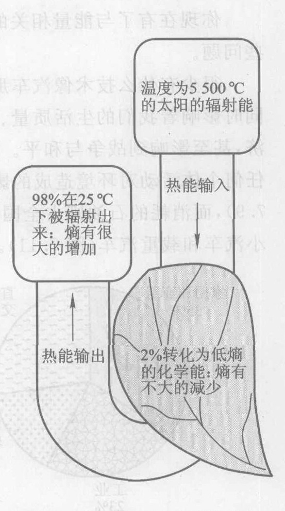

*图 7.8 通过一片叶子的能量流。叶子与热机相似。一片生长的叶子说明了地球是怎样变得更有序的，尽管宇宙的总趋势是朝着熵增加的方向发展。*

> 一个生命有机体……以负熵为生。因此，一个生命有机体将自身保持在高度有序的水平（即熵很低的水平）上的方法实际上在于从环境中不断地吸取秩序。
> ——薛定谔，物理学家，引自 *What is Life?* （中译本《生命是什么》，上海人民出版社，1973）

> **概念检查 6** 一勺盐与一杯水混合后，熵增加了吗？(a) 增加了；(b) 没有增加；(c) 有时增加；(d) 只在星期五增加。

## 7.5 汽车

你现在有了与能量相关的四个社会问题所需要的物理背景知识，本章的其余部分将讨论这些问题。

很少有什么技术像汽车那样强大地塑造着我们的文化。汽车给我们带来了极大的自由，同时影响着我们的生活质量、家庭结构、自我感觉、自然环境、健康、工作、社区结构、资源利用、经济，甚至影响到战争与和平。对于大多数美国人来说，使用汽车对环境造成的影响远远超过其他任何个体活动对环境造成的影响。运输行业消耗的能量占美国能量使用量的相当大一部分（图 7.9），而消耗的石油则占全国石油使用量的大部分（图 7.10），运输行业消耗的能量大部分用于小汽车和载重汽车（图 7.11）。

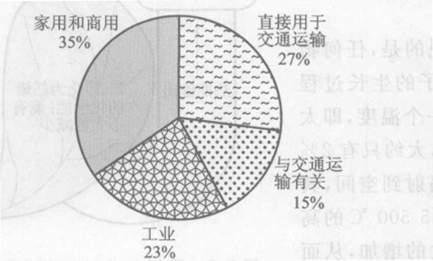

*图 7.9 美国各个经济领域消费的初级能量占总的初级能量消费的百分比。其中“与交通运输有关”指用于建造和保养公路、停车场以及其他基础设施的能量。*

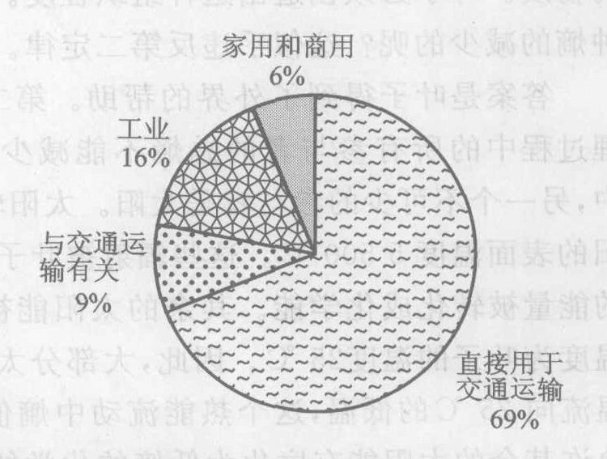

*图 7.10 美国各个经济领域消费的原油占原油消费的百分比*

**作出估计——一辆汽车的能耗** 实验表明，燃烧 1 升 (0.26 加仑) 汽油释放出（转化为热能）大约 $3.2 \times 10^6\ \text{J}$ 的能量。利用这一数字来估计一辆普通小汽车消耗化学能的功率，用 W 作单位。（提示：典型的汽油消耗量为 10 km/L，公路上的一般速率大约是 80 km/h。）
**解** 以 80 km/h 行驶时，小汽车 1 小时行驶 80 km，因此消耗 8 升汽油。8 升汽油含有 $8 \times 3.2 \times 10^6\ \text{J} = 2.6 \times 10^8\ \text{J}$ 化学能。由于这是 1 小时 (3 600 秒) 所消耗的能量，因此每秒消耗的化学能是
$$ (2.6 \times 10^8\ \text{J}) / (3.6 \times 10^3\ \text{s}) \approx 70\ 000\ \text{J/s}, \text{即} 70\ 000\ \text{W}, \text{或者} 70\ \text{kW}。$$

这相当于点亮 700 个连续发光的 100 W 白炽灯所消耗的电力！再作一个比较，70 kW 平均说来大约相当于 50 户人家所消耗的电力。如果小汽车加速前进，你还要将上面的数字乘以大约 5。

运输行业消耗的燃料大部分用在热机中，燃料在热机中燃烧产生热能，然后部分热能转化成有用功。大多数小汽车和载重汽车由**内燃机**提供动力，这种热机燃烧的是燃料与空气的混合物。混合物的燃烧温度高，产生的压强大，因此使热气体能够有力地推动**活塞**运动，所谓活塞是与连杆相连的一块可动的金属板（图 7.12）。活塞做功驱动主动轮。由于燃烧直接在做功的气体内部进行，因此称为内燃，与此相对的是外燃，燃料燃烧后向实际做功的另一种物质如蒸汽提供热能。

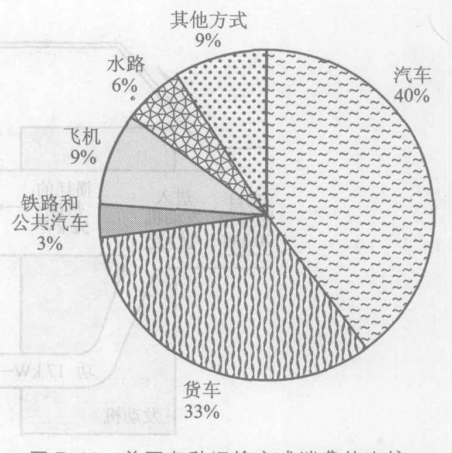

*图 7.11 美国各种运输方式消费的直接运输能量占总消费的百分比*

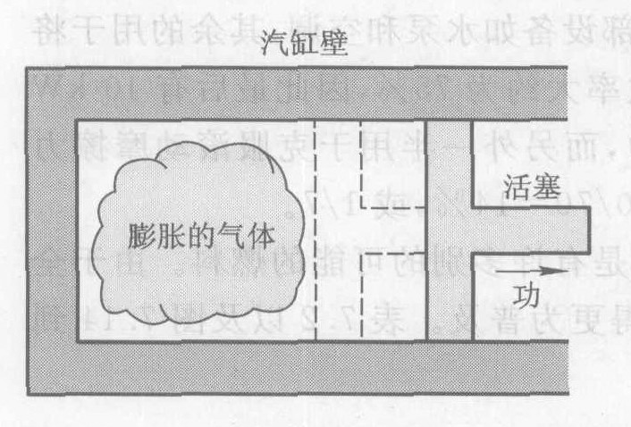

*图 7.12 用活塞将热能转化为有用功*

图 7.13 是一辆普通汽车中的能流图（单位为 kW，即每秒 1 000 焦耳能量转化）。平均说来，有能量值相当于 1 kW 的燃料由于蒸发进入大气，成为造成化学污染的原因之一。剩下的 69 kW 被送入发动机，产生大约 17 kW 的功并将其余的 52 kW 以热能和未使用的化学能的形式作为损耗排出。

能量损耗的大约一半被散热器带走，另一半随着污染气体从废气排放管排出。汽油是一种**碳氢化合物**，由氢 (H) 原子和碳 (C) 原子组成。氢与碳都会与大气中的氧燃烧，因此废气大部分是 $CO_2$ 和 $H_2O$。虽然 $H_2O$ 是无害的，但是燃烧化石燃料所释放的 $CO_2$ 却是全球气候变暖现象的主要原因（第 9 章）。

由排气管排出的废气带有其他各种分子，主要是 CO、NO、$NO_2$ 以及未燃烧的碳氢化合物。这些是有毒的污染源，而且它们没有被使用的那部分化学能也使能量效率低下。一氧化碳和未燃烧的碳氢化合物是燃料不完全燃烧的结果。氮的两种氧化物（统称为 $NO_x$）由大气中的氧和氮在发动机的高温影响下结合而成。小汽车与载重汽车产生的污染占美国 CO 污染的 2/3，碳氢化合物污染的 1/3 和 $NO_x$ 污染的一半。

汽车中有用能的损失主要发生在发动机中，这是第二定律的结果。发动机可能达到的最高效率是 30%，而其实际效率为 $17\ \text{kW} / 69\ \text{kW} = 25\%$。发动机的效率从第二定律允许的 30% 降低到 25% 是几种损失的综合结果：不完全燃烧、形成 $NO_x$、发动机中的摩擦力以及通过发动机外壳损失热能。在发动机产生的 17 kW 的功中，3 kW 用于内部设备如水泵和空调，其余的用于将发动机与主动轮连接起来的变速与传动装置，这种连接的效率大约为 75%，因此最后有 10 kW 到达主动轮。这 10 kW 中大约有一半用于克服空气的阻力，而另外一半用于克服滚动摩擦力（第 4.6 节）。整辆汽车（不只是发动机）的总能量效率为 $10/70 = 14\%$，或 1/7。

*图 7.13 一辆以中等速率在公路上匀速（即不加速）行驶的汽油动力汽车内的典型能流*

尽管最方便最普遍的燃料是石油（汽油或柴油），不过还是有许多别的可能的燃料。由于全球变暖、污染以及资源短缺越来越严重，别的燃料可能会变得更为普及。表 7.2 以及图 7.14 到图 7.17 列出了几种替代的燃料。

**表 7.2 汽车与载重汽车使用的燃料**

| 燃料 | 燃料来源 | 说明 |
| :--- | :--- | :--- |
| **内燃机用** | | |
| 汽油或柴油 | 石油 | 液体，广泛使用 |
| 压缩天然气 | 天然气 | 高压气体 |
| 液化天然气 | 天然气 | 低温液体 |
| 甲醇（木精） | 木材、天然气、煤 | 液体 |
| 乙醇（酒精） | 谷物、糖、垃圾 | 液体 |
| 氢① | 任何能源 | 用水产生的氢 |
| **非燃烧发动机** | | |
| 蓄电池① | 任何能源 | 充电 |
| 燃料电池① | 氢、甲烷及其他 | 氢可以用水产生 |

*①：由于生产氢、对电池充电或用于氢燃料电池的电力可以源自任何能源，因此最终的能源可能是风力、水电、核能、煤、光电池等。*

标准内燃机的几种替代品目前已经投入市场或正在开发中。**电动汽车** (EVs, 图 7.15) 由大电池组驱动，电池利用储存的化学能产生电力。由于这种汽车没有排气管，行驶时不排放化学污染物，因而是一种“零排放汽车”。但是，给电池充电的电力必须来自某个地方。如果电力来自化石燃料发电厂，那么这种车辆就成为工厂排放的原因，排放物产生污染和全球变暖。如果电力来自太阳能电池或风力（第 17 章）等污染程度较小的能源，这种汽车的环境效应就更为良性。一般的电动汽车每行驶 100 英里左右就需要通过市电充电几小时，它的电池笨重，电动汽车目前价格昂贵。不过人们正在进行大量研究以解决这些问题，几款电动汽车已经投放市场。

**油-电混合动力汽车** (图 7.16) 最近达到了前所未有的能量效率。混合动力汽车用汽油作燃料，让一台小型汽油发动机以一个恒定的低功率运转。发动机并不直接驱动汽车，而是驱动一台发电机（第 8 章）为一组蓄电池充电，而蓄电池则驱动汽车前进，就像一辆电动汽车一样。由于发动机以不变的低功率运转，其能量效率相当高。同时，由于蓄电池被连续充电，因而不需要储存大量能量，因此可以比电动汽车的电池小巧轻便得多。使用轻便而坚固的材料（用以抵抗撞击力），流线型设计（以减小空气阻力），使用能够回收减速过程中损失的动能的制动装置，还可以得到额外的效率。几种组合动力载客汽车已经进入市场。由于最近以及有可能在将来油价上涨，丰田汽车公司认定组合动力将变得更受欢迎，并公布了计划，让该公司生产的所有汽车最终由组合动力发动机驱动。

**燃料电池汽车** (图 7.17) 利用从化石燃料或水中获得的氢作燃料。虽然宇宙主要由氢组成，但在地球上这种轻元素很久以前就逃离了地球的引力束缚，几乎没有单独存在即未与其他元素结合的氢 ($H_2$ 分子)。氢必须通过化学过程从化石燃料中获得，或用电流分解 $H_2O$ 分子从水中获得。它能以压缩气体或超低温液体的形式储存在车辆中，也能以化学方法注入到某些金属中。氢燃料并不发生燃烧，而是被注入到一种叫做**燃料电池**的设备中，这种设备直接将氢的化学能转化为电能，这一点就像蓄电池。蓄电池与燃料电池的差别是，蓄电池在其寿命期限内储存化学能，而燃料电池则在需要时往电池内注入化学原料。因此，蓄电池必须进行充电，而燃料电池则需要重新注入燃料。与蓄电池相比，燃料电池重量较轻、连续供电的时间更长。不过燃料电池的广泛使用还存在很多科学的和实际的难题，并且这种电池目前相当昂贵。

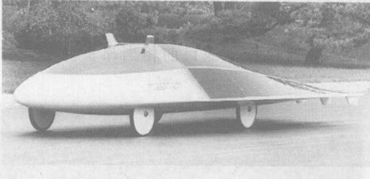

*图 7.14 通用汽车公司的试验车型太阳帆 (Sunraycer)。空车的质量为 180 kg，备有 68 个银锌蓄电池，由 8 000 个在车身外壳上排成阵列的太阳能电池供电。*

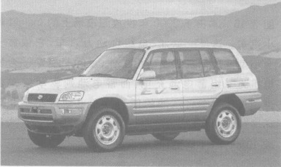

*图 7.15 丰田的电池驱动型 RAV4-EV 牌小汽车，电池充电一次的行程为 200 km，充电时间为 6.5 小时，最高速率为 125 km/h。*

> 正兴起一股环保意识的潮流。聪明的公司将站在这一股潮流的前列。那些在这方面不作为的公司将被扫除出场。
> ——比尔·福特，福特公司董事会主席，他预言了他的曾祖父所普及的内燃机的退位

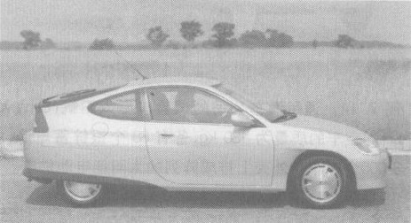

*图 7.16 本田于 2000 年投放到市场上的 Insight 牌小汽车。这是一款油-电组合动力汽车，它依靠一台小型低功率汽油发动机工作，发动机驱动一台发电机为一组蓄电池充电，而蓄电池则驱动汽车前进。这款汽车将汽油的便利性和电动汽车有利于环境两者结合起来，同时达到每消耗 1 加仑汽油行驶 103 km (64 英里) 的成绩。*

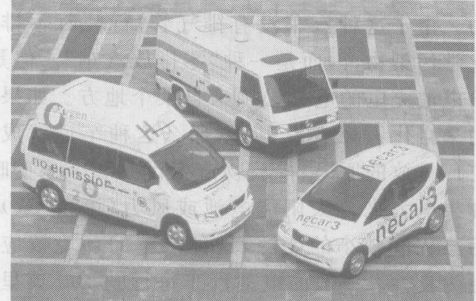

*图 7.17 戴姆勒-克莱斯勒公司的 NECAR 5 型试验型燃料电池汽车。这款车型拟使用的燃料是甲醇，这是一种从木材或天然气中提取的液态醇类化合物，可以在现有的加油站中买到。一台车载的燃料处理机从甲醇中提取氢，所提取的氢注入燃料电池中。这款车型的时速高达 160 km/h，续行里程与一般汽车不相上下，行驶时效率甚高并且几乎是无声的。*

由于燃料电池不属于热机，第二定律不影响它们系通过程。从燃料的化学能获取电能的典型效率是 60% 甚至更高，这比内燃机的典型效率 25% 高得多。这个较高的效率意味着较少的资源损耗、较小的污染程度和较轻的全球变暖。对环境带来的其他好处视氢的来源而定。假如获得氢的电力来自太阳能，燃料电池就是对环境最有利的运输技术之一。戴姆勒-克莱斯勒公司已经开始销售用燃料电池作动力的市内公共汽车，另外几家公司也计划即将在投产一款客车。冰岛已经承诺要成为世界上第一个“氢动力国家”，该国计划用 30 年的时间让国内全部汽车过渡到以氢燃料电池为动力。一些专家已经把氢燃料电池投入市场称为“氢动力时代”的黎明。

> **概念检查 7** 以下设备哪些使用热机？(a) 烧汽油的汽车；(b) 烧柴油的汽车；(c) 电动汽车；(d) 烧燃料电池汽车；(e) 氢燃料电池汽车；(f) 组合动力汽车。

## 7.6 运输效率

我们对能量效率的定义（输出的功除以输入的总能量）并不能真实地反映汽车的用途。尽管汽车是用来运送人的，但是，消耗的能量几乎都是用来使汽车自身运动而不是用来使所载的人运动。**汽油里程**是一种量度汽车效率的常用方法，但是也具有同样的缺陷。这两种量度方法都不能反映汽车运送乘客的效率，或称**运输效率**。然而，汽油里程在对不同的汽车进行比较时是有用的（表 7.3）。你从表上可以看到，小汽车可以达到或超过 25 km/L。表中列出的大多数高效率的汽车都使用组合动力发动机技术，但是双人智能小汽车 (图 7.18) 却通过减小尺寸和减轻重量获得高效率。对效率标准要求过低，加上对 SUV 汽车*和其他效率低的汽车的大量需求，已经导致美国小汽车和轻型载重汽车的燃料使用 21 年来一直处于 8 km/L 的低效率状态。即使就 SUV 而言，提升到双倍甚至更高的效率也是完全可能的。

量度乘客运送效率的一种适当单位是每消耗单位能量的乘客千米数。例如，如果一辆公共汽车运送 20 名乘客行驶了 3 千米，它给出的运输效果就是 $20 \text{位乘客} \times 3 \text{千米} = 60 \text{乘客千米}$。与此相似，量度货物运送效率的适当单位是每消耗单位能量的吨千米数。例如，如果一辆载重汽车运载 5 吨货物行驶了 80 千米，它的运输效果就是 400 吨千米。

表 7.4 对客运效率进行了比较。对步行和骑自行车，表中给出的是与所需要的食物热量等价的汽油量。步行与自行车行遥遥领先，因为没有任何能量用来驱动一部笨重的车辆，由于没有用到任何热机，因此没有任何由热力学第二定律引起的损失。自行车的效率比步行更高，原因是轮子保持滚动，因而最大程度地利用了惯性定律。你每走一步都常要迈开和停止你的腿，这样的加速需要用力（牛顿运动定律），这就意味着要做功。火车（图 7.19）的能量效率比任何别的车辆的效率高得多，原因在于火车能够更有效地克服空气阻力和滚动阻力，以及一列火车能够乘坐很多乘客。由于火车的前端截面相对于其巨大的重量而言很小，因此它的每千克载重的空气阻力远小于小汽车与载重汽车。还有，火车用坚硬的钢轮滚动，因此滚动阻力（参见第 4.6 节）很小。表 7.5 对货运效率进行了比较。我们再次看到，铁路的优势很明显。由于一列货运列车能够运载需要 500 辆卡车才能运载的货物，上述优势因而并不令人感到惊奇。

*\* SUV 是 Sports Utility Vehicle 的缩写，即运动型多功能汽车，起源于美国，是近年美国市场最流行的车型。迎合年青白领阶层的要求，20 世纪 90 年代开始流行。它是四轮驱动，既可载人又可载货，既有轿车的舒适性又有越野车的越野功能。行驶范围广，可以城市行驶或野外运动，适应各种路况。近年来更向豪华化发展。它的特点是：动力强、越野性、宽敞舒适及良好的载物载客功能。它是轿车与吉普的混血后裔。——译者注*

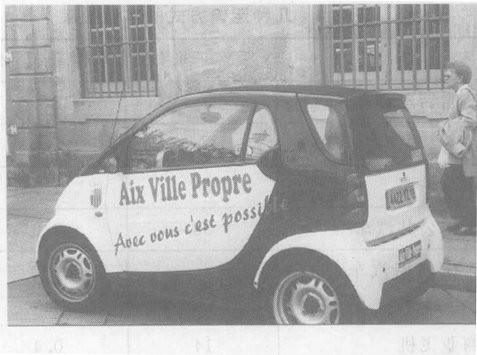

*图 7.18 戴姆勒-克莱斯勒公司的一款双人智能小汽车。它那缩小的车型、减轻的重量和高效的发动机使其汽油效率达到 20 km/L。尽管许多美国消费者对其防撞性能和实用性表示担心，这款智能小汽车在欧洲却大行其道。*

**表 7.3 客运汽车的燃料效率**

| | km/L |
| :--- | :---: |
| 一般的： | |
| 美国客运汽车（小汽车、SUVs、小型货车） | 8 |
| 美国新型客运汽车 | 10 |
| 欧洲新型客运汽车 | 13 |
| 今日生产的小汽车： | |
| 福特 Expedition (SUVs) | 6 |
| 本田 Accord | 12 |
| 丰田 Prius (组合动力) | 19 |
| 戴姆勒-克莱斯勒智能小汽车 | 20 |
| 本田 Insight (组合动力) | 26 |
| 设计原型： | |
| 通用汽车 Precept (组合动力) | 28 |
| 福特 Prodigy (组合动力) | 28 |
| 戴姆勒-克莱斯勒 ESX3 (组合动力) | 29 |

**表 7.4 几种运输方式的客运效率**

| | 乘客千米 / L | 乘客千米 / MJ |
| :--- | :---: | :---: |
| 骑自行车 | 642* | 18.0 |
| 步行 | 178* | 5.0 |
| 市际铁路 | 60 | 1.7 |
| 市内公共汽车 | 33 | 0.9 |
| 合伙使用汽车（平均乘坐 4 人） | 33 | 0.9 |
| 商业飞机 | 14 | 0.4 |
| 上下班私用车（平均乘坐 1.15 人） | 10 | 0.3 |

*注：*对步行和骑自行车，表中给出的是与所需要的食物热量值等价的汽油量。*

**表 7.5 三种运输方式的货运效率**

| | 千克千米 / MJ | 吨千米 / L |
| :--- | :---: | :---: |
| 铁路（货运列车） | 2 900 | 100 |
| 大型卡车 | 720 | 25 |
| 货运飞机 | 145 | 5 |

从图 7.9、图 7.10 和图 7.11 可以看到，运输行业是一个主要的耗能行业，尤其是消耗石油。这样的消耗量给美国带来了巨大的问题：能量成本不断增加、国内外石油资源不断削减以及部分因与石油有关的安全问题引起的两次中东战争。表 7.3、表 7.4 和表 7.5 使我们想到许多迅速而有效地减少石油消费的方法：
*   制定汽车效率标准，使新一代美国汽车的效率至少赶上欧洲汽车的效率。
*   使用激励措施促进组合动力汽车的发展。
*   提倡合伙用车。
*   鼓励发展公共交通工具，不鼓励发展小汽车。
*   用火车不用卡车运载货物。
*   城市规划应有利于步行、骑自行车和公共交通工具，却不是专为驾小汽车服务的。

为了好玩，让我们对动物运动整个领域和人类技术的各种形式作一番比较。哪种动物或人类的运输方式是效率最高的运送运动质量的运输工具？果蝇？火车？马？喷气式飞机？步行的？为了公平地比较果蝇、马和人，我们必须考虑马的质量比果蝇或人大得多这一事实。因此，用来度量有用的输出的应当是动物的整个身体的质量乘运动的距离。表 7.6 给出几种动物的这种质量运输效率，以千克千米/MJ 为单位。自行车再次遥遥领先，原因在于动物没有轮子，因此它们不能利用滚动的优势，还因为在人类的主要运输技术中，自行车几乎是唯一一种不用热机的。换句话说，自行车之所以位居第一是因为惯性定律和热力学第二定律的缘故！作为一个每天骑自行车上下班的人，我觉得这很酷。

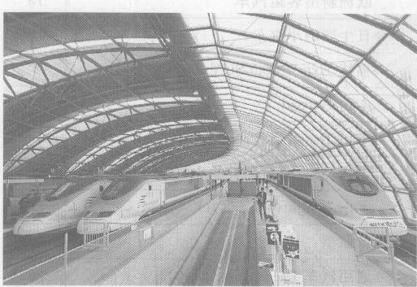

*图 7.19 法国的 TGV（高速列车）自 1972 年起投入使用。法国目前有大约 350 列 TGV。像欧洲大多数高速列车一样，TGV 通常以大约 300 km/h 的速率行进。列车的能量效率比别的车辆的能量效率高得多，原因在于：列车能够装载几百名乘客，列车的前端截面相对于它们的巨大载重而言很小，列车用坚硬的钢轮滚动，因此滚动阻力很小（见第 4.6 节）。*

上面的讨论表明，带轮子的动物具有巨大的能量优势。事实上，某些蝾螈和其他动物就利用这种能量优势在下山时把自己的身体卷起来往下滚。人们可以猜测，在另一个表面由光滑的熔岩流生成的行星上，可能会进化出带轮子的动物，而且种类还会相当丰富呢！

> **概念检查 8** 你想要把 125 吨货物运送 200 km。用卡车和火车各自需要多少升汽油？(a) 卡车需要 125 升，火车需要 500 升；(b) 500 升，125 升；(c) 250 升，1 000 升；(d) 1 000 升，250 升。

**表 7.6 动物和运输工具的质量运输效率 (kg · km/MJ)**

| | |
| :--- | :---: |
| 骑自行车 | 1 100 |
| 鲑鱼 | 600 |
| 马 | 400 |
| 步行 | 300 |
| 普通的鸟 | 200 |
| 市际铁路 | 100 |
| 市内公共汽车 | 55 |
| 蜂鸟 | 50 |
| 合伙使用汽车 | 40 |
| 商业飞机 | 25 |
| 苍蝇和蜜蜂 | 20 |
| 近郊上下班客车 | 12 |
| 老鼠 | 5 |

*注：取自 S. Wilon 的 "Bicycle Technology", Scientific American, March 1973.*

## 7.7 蒸汽发电厂

现在我们转向另一种改变了当代社会的热机——蒸汽发电厂。图 7.20 是燃煤蒸汽发电厂运作流程的示意图。煤是用得最广泛的发电能源。其他使用原油、天然气、核能或者太阳能将锅炉中的水变成蒸汽的发电厂，在从蒸汽生产电力方面与燃煤发电厂的运作流程非常相似。

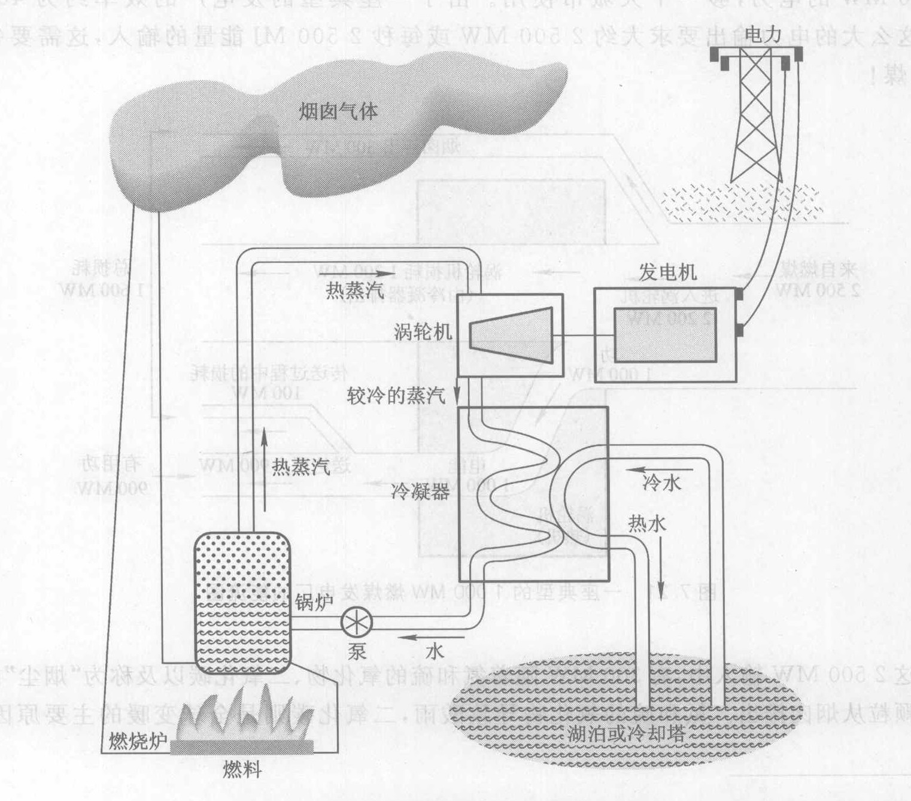

*图 7.20 燃煤蒸汽发电厂运作流程示意图*

燃烧室中的煤在锅炉外燃烧，其热能传给锅炉中的水。大多数燃烧产物通过烟囱逸散，不过，某些污染物已经被先行除去。锅炉产生超过 500 ℃ 的高压蒸汽，这一温度远远高于正常沸点的温度。蒸汽通过管道送到一个叫做**蒸汽涡轮机**的大型旋转装置，当蒸汽涡轮机前部（上游）的压强比后部的压强高时，它就会转起来。像汽车中的活塞一样，蒸汽涡轮机是将热能转化为功的关键设备。涡轮机带动发电机旋转，这时就会产生电力（第 8 章）。

转动的涡轮机将热蒸汽的一部分热能转化为功。第二定律告诉我们，这只有当其余的热能流向一个较低的温度时才有可能。为了维持所需的温差，涡轮机的排气部分用外部水流或湖水冷却或者用在大气中蒸发致冷的方法冷却。为了获得最大的效率，排出的废气被充分冷却，将蒸汽“凝结”变回液态水，因为这样会大大降低涡轮机后部的压强。⑥ 这样，蒸汽就会强力地冲过涡轮机，从一边的极高的压强流向另一边的近似真空。蒸汽一旦凝结成水，就被泵送回锅炉，循环重新开始。从图 7.20 可以看出，发电厂就是一部热机。热能在锅炉内流入，在冷凝器中流出，由涡轮机做功（与图 7.5 比较）。

图 7.21 是能流图（更精确地说，是每秒的能量流，单位为兆瓦）。一座大型发电厂发出大约 1 000 MW 的电力，够一个大城市使用。由于一座典型的发电厂的效率约为 40%（表 7.1），这么大的电力输出要求大约 2 500 MW 或每秒 2 500 MJ 能量的输入，这需要每秒烧 100 kg 煤！

在这 2 500 MW 输入中，有 300 MW 随着氮和硫的氧化物、二氧化碳以及称为“烟尘”的细小不燃物颗粒从烟囱排出。氮和硫的氧化物导致酸雨，二氧化碳则是全球变暖的主要原因（第 9 章）。现代的发电厂将大部分的硫氧化物、一部分氮的氧化物和几乎全部烟尘除去，不过，被清除出来的烟尘又带来了固态废物处理这个大问题。由于煤主要由碳组成，因此，二氧化碳是不可避免的烟囱气体。尽管从原则上说能够将二氧化碳除掉并将它以气体形式注入地下或海洋，但是今天人们并没有把任何二氧化碳除掉。然而，所有这些“碳回收”计划都要冒环境风险和需要财政开支，任何人都会问，大规模的碳回收究竞是否可能。

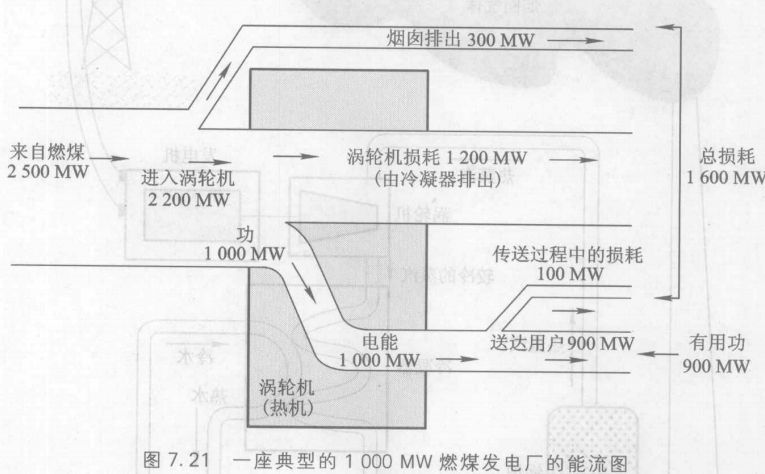

*图 7.21 一座典型的 1 000 MW 燃煤发电厂的能流图*

*⑥ 但是并非全部蒸汽都凝结。一部分蒸汽重新用来加热送到锅炉途中的水。*

涡轮机将蒸汽的热能以 1 000 MW 的速率转化为有用功，这些功驱动发电机发出 1 000 MW 的电力。发电厂的最大的无用能量损失，即 1 200 MW 的损耗（图 7.21），是第二定律的一个不可避免的结果。这些损耗的能量跑到冷凝器的冷水中去了。假如冷水来源于是湖泊或河流，废热就会把水烧热，造成所谓热污染。许多发电厂使用称为**冷却塔**（图 7.22）的大型蒸发式冷凝装置，用大气作冷却剂。最后，大约 100 MW 发出的电力在通过输电线输送的过程中变成热能损失掉了，剩下 900 MW 到达用户手上。

*图 7.22 燃煤发电厂的冷却塔和烟囱。冷空气被吸入冷却塔底部，将来自发电厂的热水冷却。塔的形状有助于热气柱迅速上升。*

> **概念检查 9** 用图 7.20 和图 7.21 判断锅炉将煤的化学能转化为蒸汽的热能的效率。(a) 100%；(b) 12%；(c) 88%；(d) 36%；(e) 10%。

> **概念检查 10** 有一座燃煤发电厂每天消耗 8 000 吨煤。假定煤就是纯碳，以下哪个答案最接近该发电厂每天排放到大气中的二氧化碳量？(a) 8 000 吨；(b) 3 200 吨；(c) 4 800 吨；(d) 24 000 吨；(e) 16 000 吨；(f) 48 000 吨。

**作出估计** 在 100 kg/s 的燃烧速率下，估算一座典型的发电厂每天使用的煤的数量（以吨作单位）。若每辆运煤大卡车装大约 50 吨煤，要用多少辆大卡车运送？

## 7.8 资源使用与指数增长

能量的社会含义提出了许多与增长有关的问题。随着我们不断增加的人口和对环境的冲击开始影响整个自然界，了解增长的长期效应是很重要的。

假定你投资 100 美元，每年的回报率（或增长率）为 10%。你的钱什么时候将会翻番呢？第一年你能赚 10 美元，因此你有 110 美元了。第二年你能赚 110 美元的 10%，即 11 美元。现在你有 121 美元了，于是下一年你能赚 12.1 美元。你每年赚的钱都比上一年多。图 7.23 画出你的账户上钱的数目，并画了第二条线进行比较，这条线每年增加 10 美元。第二条线表
⑦ (一天的秒数为 60 秒/分 $\times$ 60 分/时 $\times$ 24 时/天 $\approx 10^5$ 秒/天。每秒有 100 kg 煤进入工厂，因此每天有 $10^5 \times 100 = 10^7$ kg，或 10 000 吨。这需要用 $10 000/50 = 200$ 辆大卡车（每天）。
⑧ 本节利用了科罗拉多大学物理学家巴特勒特的工作。

> 世界上最重要的计算是指数函数的计算。
> ——A. Bartlett, 物理学家

> 增长的算术是能源危机中被人们遗忘了的基本原理。
> ——A. Bartlett

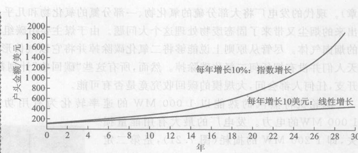

*图 7.23 回报率为 10% 的投资户头。初始投资为 100 美元。你愿意要每年增长 10% 的指数增长还是每年增长 10 美元的线性增长？*

示**线性**（直线）**增长**。你可以看到，每年 10 美元与每年 10% 之间有很大的差异。当一个量在每单位时间内按确定的比率增长时，这种增长叫做**指数增长**。⑨

假如你继续每年增加 10%，那么，七年之后你的户头就会翻一番，达到大约 200 美元。假如你把钱再存七年，会发生什么事情呢？利用相同的算法可以得出，你的钱将再翻一番，达到 400 美元。⑩ 再过七年，再翻一番，达到 800 美元。依此类推。指数增长的翻番时间是不变的。

**作出估计——指数增长的薪金**。你找到一份工作，要求你连续工作 30 天，第一天你的老板只给你 1 美分的薪金，然后，每天将薪金加倍。这份月薪优厚吗？
**解** 第 10 天将赚到 5.12 美元。为了简单起见，将这个数字四舍五入到正好 5 美元。第 20 天你的收入将有 5 120 美元。将这个数字四舍五入到 5 000 美元，继续下去。仅在第 30 天那一天，你的收入就多于 500 万美元！

在动物群体的数目问题上，每年新出生的数目大致正比于当年可能成为父母的个体的数目。成员数目加倍，新出生的数目也加倍。于是，增长百分率（新出生数目除以群体总数）年年都近似相等。这一不变的增加百分率意味着群体数目的增长大致上是指数增长。

*⑨ 叫“指数”增长的原因是，一年之后户头的值是 $100 \times 1.1$，两年之后价值是 $100 \times 1.1^2$，三年之后价值是 $100 \times 1.1^3$，依此类推。表示年数的数字出现在指数位置上。*
*⑩ 如果你不相信这一点，用下述方法考虑这个问题：你以大约 200 美元开始第二个七年。将这笔钱看作是两个 100 美元的户头。在第二个七年期间，每个户头必定增加到大约 200 美元，因此你的总数是 400 美元。*

> **概念检查 11** 在一个有限环境中古体数目的增长——细菌通过分裂繁殖。如果开始时有一个细菌，它会分裂成两个；这两个又分裂成四个，然后是八个，依此类推。由于每一次群体数目加倍的时间间隔相同，所以这是一个指数过程。假定某种细菌的分裂时间为 1 分钟。你在上午 11 点将一个细菌放入瓶中，到中午你注意到了瓶子装满了细菌。那么，瓶子装到一半的时刻是 (a) 11:30；(b) 11:40；(c) 11:50；(d) 11:55；(e) 11:58；(f) 11:59。

正如概念检查 11 显示的那样，如果按指数方式消耗有限的资源，在你意识到要出问题的时候，资源已很快就将全部用尽了（图 7.24）。继续概念检查 11 的讨论，假定在上午 11:56（瓶子只装到 1/16 即 94% 是空的）的时候，某个高瞻远瞩的细菌意识到他们要出问题了，于是发动一次全力以赴的寻找新瓶子的努力。到上午 11:58，这个规划成功了，它们找到了巨大的新保留地：三个新瓶子！细菌长满第一个瓶子花了一小时。新瓶子什么时候装满呢？答案是中午过后两分钟。连续不断的指数增长最终压倒了扩展资源基础的一切企图。

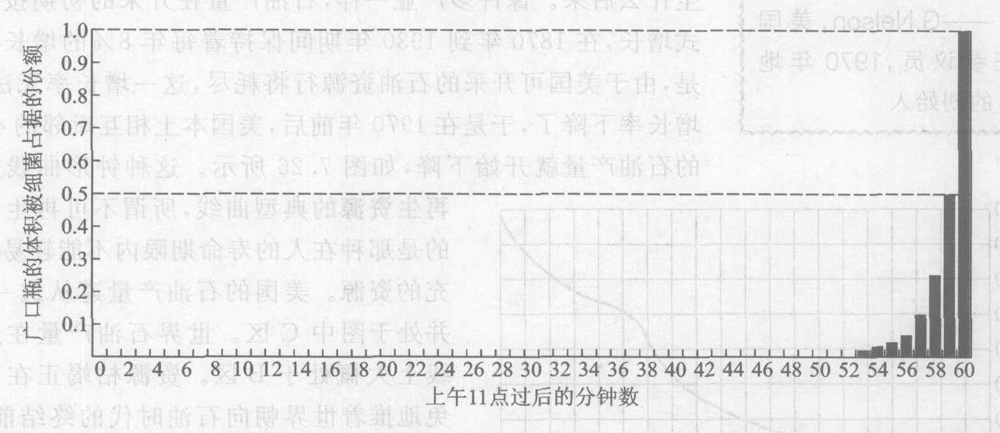

*图 7.24 广口瓶中细菌的增长。指数增长长式地消耗有限的资源会令人意想不到地迅速将资源耗尽。在图中的比例尺下，在上午 11:53 瓶子装到 1% 满之前，增长是觉察不出来的。*

关于指数增长有一个简单而有用的定量关系。增长率的任何增加一定会缩短翻番时间，因此，我们可望找出这两者之间的关系。结果发现它们成反比。这个关系近似为
$$ \text{翻番时间} \approx \frac{70}{\text{增长率}} $$
$$ T \approx \frac{70}{P} $$
其中 $T$ 表示翻番时间，$P$ 是增长率（单位时间内增长的百分率，以百分点数表示）。这一关系可以倒过来写成
$$ P \approx \frac{70}{T} $$
翻番时间和增长率这两个量的每一个都等于 70 除以另一个量。比如说，10% 的存款利率对应的翻番时间为 $T = 70/10 = 7 \text{(年)}$。

> 在这两个十年（20 世纪 50 年代和 60 年代）的每个 10 年中，石油的消耗量比此前历史上消耗量的总和还要多。
> ——卡特总统，1977年

> 假如你问生态学家：“最重要的环境问题是什么？”他们会异口同声地说，是人口的指数增长。
> ——G. Nelson，美国前任参议员，1970 年地球日的创始人

作为一个历史事例，考虑美国电力的增长。考察图 7.25 后你会发现，电力生产在 1935 年到 1975 年期间呈指数增长，电力产量以每年 7% ($P \approx 70/T = 70/10 = 7$) 的增长率百分率每 10 年翻一番。如果这一增长率在 1975 年之后继续保持会怎么样呢？1975 年，美国的全部电能由大约 400 座大型发电厂提供。如果 10 年的翻番时间仍继续保持不变，到 1985 年就会需要 800 座发电厂，1995 年会需要 1 600 座，2005 年会需要 3 200 座，2015 年将会需要 6 400 座。6 400 座发电厂意味着什么呢？它将意味着每个州大约 125 座，每一个人都生活在离某座大型发电厂几千米的范围之内！显然，固定的增长率不能永久维持下去。事实上，在 1975 年到 1988 年期间，电力产量平均每年只增长了 3%。

美国的石油产量表明，按指数方式消耗一种有限的资源会发生什么后果。像许多产业一样，石油产量在开采的初期按指数方式增长，在 1870 年到 1930 年期间保持着每年 8% 的增长率。但是，由于美国可开采的石油资源行将耗尽，这一增长率无法维持。增长率下降了，于是在 1970 年前后，美国本土相继毗邻的 48 个州的石油产量就开始下降，如图 7.26 所示。这种钟形曲线是**不可再生资源的典型曲线**，所谓不可再生资源指的是那种在人的寿命期限内不能轻易得到补充的资源。美国的石油产量遵从这一曲线，并处于图 C 区。世界石油产量在这条线上大概处于 B 区。资源枯竭正在不可避免地推着世界朝向石油时代的终结前进，全球变暖等其他问题可能会使石油时代更快结束。

木材与太阳能等**可再生资源**按照不同的曲线形式发展（图 7.27）。在早期阶段，可再生资源与不可再生资源的使用都指数增长。

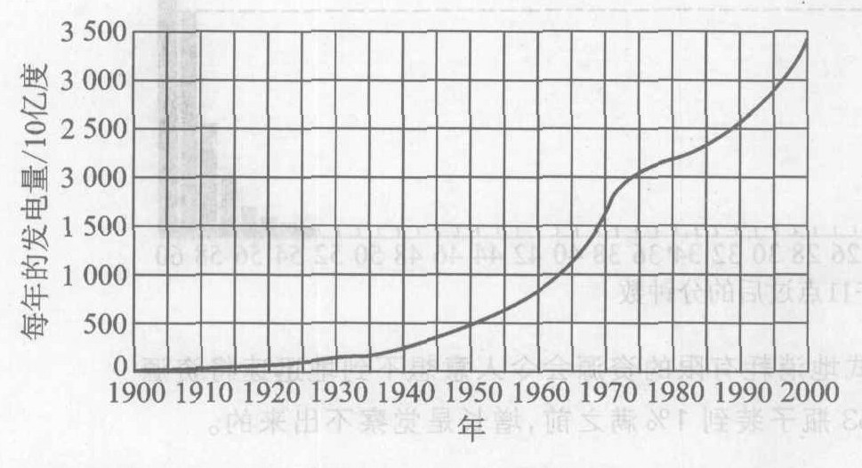

*图 7.25 电力年产量曲线。曲线表示从 1900 年到 2000 年期间电能的年产量，以 10 亿度为单位。从 1935 年到 1975 年期间，电力产量近似按指数规律增长。*

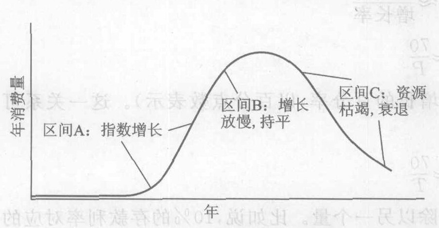

*图 7.26 表示一种不可再生资源的消费量变化的典型钟形曲线。随着资源的减少，指数增长的速度必定要慢下来。当资源接近枯竭时，消费量最终变平并下降。*

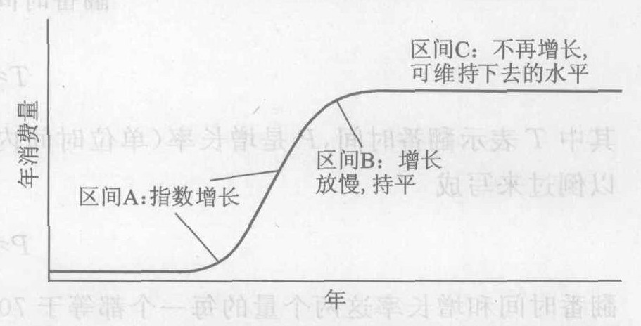

*图 7.27 水力资源等可再生资源的典型发展史。随着消费量达到其自然极限，指数增长的速度便慢下来。消费量最终在一个可以持续维持的值上稳定下来。*

不过，只要可再生资源的消耗速率低于复原速率，其消费量就能够无限期地保持下去。

最后，考虑世界人口的增长（图 7.28）。总共花了 600 万年时间，直到 1825 年世界人口才达到 10 亿。仅仅一个世纪之后，1930 年人口达到 20 亿，1960 年达到 30 亿，1999 年达到 60 亿。人口专家估计，2050 年人口将达到 90 亿左右。实际的结果将强烈地依赖于从现在到那时的出生率。从 1960 年到 2000 年期间人口的翻番，我们可以求出当前的人口增长率近似为 $P = 70/T\% = 70/40\% = 1.75\%$。从图中你可以看到，这个出生率是很高的，事实上是爆炸性的。

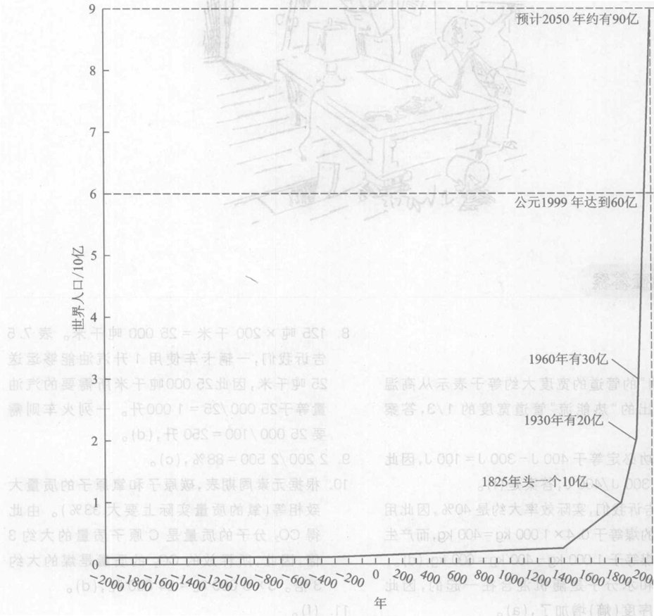

*图 7.28 人口爆炸：比指数方式增长得更快。注意与图 7.24 之间的相似。*

> **概念检查 12** 从 1870 年到 1930 年期间，美国石油产量每年增长 8%。它的翻番时间大约等于 (a) 6 年；(b) 9 年；(c) 12 年；(d) 15 年；(e) 30 年。

---

![s.harris 漫画: 熵业部 (Department of Entropy) 的办公室乱七八糟。]

### 概念检查答案

1.  (e)。
2.  (b)。
3.  表示“功”的管道的宽度大约等于表示从高温热源流出的“热能流”管道宽度的 1/3，答案是 (a)。
4.  所做的功必定等于 $400\ \text{J} - 300\ \text{J} = 100\ \text{J}$，因此效率是 $100\ \text{J} / 400\ \text{J}$，答案是 (f)。
5.  表 7.1 告诉我们，实际效率大约是 40%，因此用来发电的煤等于 $0.4 \times 1 000\ \text{kg} = 400\ \text{kg}$，而产生损耗的煤等于 $1 000\ \text{kg} - 400\ \text{kg} = 600\ \text{kg}$, (d)。
6.  盐分子和水分子是随机混合在一起的，因此微观无序度（熵）增加了，(a)。
7.  (a)、(b) 和 (f)。
8.  $125 \text{吨} \times 200 \text{千米} = 25 000 \text{吨千米}$。表 7.5 告诉我们，一辆卡车使用 1 升汽油能够运送 25 吨千米，因此 25 000 吨千米所需要的汽油量等于 $25 000 / 25 = 1 000 \text{升}$。一列火车则需要 $25 000 / 100 = 250 \text{升}$, (d)。
9.  $2 200 / 2 500 = 88\%$, (c)。
10. 根据元素周期表，碳原子和氧原子的质量大致相等（氧的质量实际上要大 33%）。由此得 $CO_2$ 分子的质量是 C 原子质量的大约 3 倍，因此，所释放的 $CO_2$ 的质量是煤的大约 3 倍。$3 \times 8 000 \text{吨} = 24 000 \text{吨}$, (d)。
11. (f)。
12. $T = 70 / P = 70 / 8 \approx 9$, (b)。

### 关键概念

下述概念的定义出现在所标页码的本书正文页面上和书末的按拼音排序的术语词汇中。我们将会它们按出现先后顺序排列在这里，你可以用这个清单复习本章内容。

*   热力学第二定律 134
*   热力学 134
*   热传递 135
*   热传递定律 135
*   温度 135
*   温度计 135
*   摄氏度 135
*   热机 136
*   损耗 136
*   能量效率 136
*   热机定律 137
*   输入温度 137
*   排出温度 137
*   热电联产 138
*   能量的品质 139
*   微观无序程度 139
*   熵 140
*   熵增加定律 140
*   不可逆 140
*   生物系统 141
*   内燃机 143
*   活塞 143
*   外燃 143
*   油-电混合动力汽车 145
*   燃料电池汽车 145
*   燃料电池 145
*   运输效率 146
*   蒸汽发电厂 149
*   蒸汽涡轮机 150
*   发电机 150
*   增长率 151
*   线性增长 152
*   指数增长 152
*   翻番时间 152
*   不可再生资源 154
*   可再生资源 154

### 复习题

**热传递**

1.  什么是热传递？
2.  用你自己的话叙述热传递定律。
3.  举出一个例子，说明热能与温度实际上是两种不同的东西。

**热机与能量的品质**

4.  为以下每种能量转化过程各举一例：动能变为热能、引力能变为热能、热能变为动能。
5.  用你自己的话叙述热机定律。
6.  输入与排出的哪些性质决定热机的效率最重要？叙述热机效率是怎样依赖于这些性质的。
7.  汽车的实际总体能量效率最接近哪个数字：98%、90%、40%、10% 还是 2%？蒸汽发电厂的效率呢？
8.  如果热机运作过程中完全没有摩擦力，那么它的效率是 100% 吗？说明原因。
9.  用能量的术语说，当悬挂在一根绳子上的石块的运动停下来时发生了什么事？在什么意义下这一行为是不可逆的？

**熵定律**

10. 什么是熵？
11. 用你自己的语言叙述熵的形式的第二定律。
12. 哪个（些）物理学定律区别向前与向后两个时间方向？
13. 一片生长的叶子增加其有序度，是否违反第二定律？

**汽车与运输**

14. 举出两种有重要社会意义的普通热机。
15. 内燃机的名称是怎样来的？用你自己的语言描述它是怎样工作的。
16. 举出汽车的两种代用燃料（汽油或柴油以外）。
17. 汽车运转中效率低的最大原因是什么？
18. 叙述度量一种运输方式的效率的两种不同方法，对每种方法给出恰当的量度单位。
19. 为什么火车的效率比其他的运输车辆的效率高？

**蒸汽发电厂**

20. 蒸汽发电厂中的涡轮机、发电机、冷凝器、冷却塔和烟囱是用来干什么的？
21. 什么是热污染？
22. 蒸汽发电厂的运转中，效率低的最重要原因是什么？
23. 蒸汽发电厂的哪一部分与汽车的活塞相似？

**指数增长**

24. 指数增长与线性增长的差别何在？
25. 如果你的存款的年利率是 7%。它的翻番时间是多长？
26. 画出一种不可再生资源的典型消费量变化曲线图。图中有什么部分近似是指数形式的吗？
27. 对可再生资源重复上述问题。

### 思考题

**热传递**

1.  当某日的温度分别为 -3℃、+3℃、22℃ 或 35℃ 时，你怎样称呼当天的天气？
2.  以 ℃ 为单位，给出以下每种情况的近似温度：你的身体；在没有盖的壶中沸腾的水；冰水；风和日丽的天气。
3.  1℃ 与 1°F 哪个大些？
4.  热能穿过封闭的窗户流动怎样显示了第二定律？户外冷的时候热能流动方向是什么？户外热的时候呢？
5.  想出至少一种使热能从较冷处“向上”流向较热处的技术设备。这种设备违反热传递定律吗？加以说明。
6.  在制冷机的运转中，热能是从热区流向冷区还是从冷区流向热区？这种流动是自发发生的还是需要外部帮助？

**热机**

7.  能够将一定数量的动能全部转化为热能吗？能够将一定数量的热能全部转化为动能吗？对每种情况给出一个例子或说明不可能的原因。
8.  能够将一定数量的化学能全部转化为热能吗？能够将一定数量的热能全部转化为化学能吗？对每种情况给出一个例子或说明不可能的原因。
9.  以下哪些不是热机：天然气发电厂、水电站、酒精燃料汽车、自行车、太阳能电池、蒸汽机车？
10. 以下哪些是热机：核电站、柴油机车、电力机车、地热电站、风力涡轮机（风车发电）、太阳能热水器？
11. 第二定律对热机效率是怎么说的？
12. 你能想个办法利用海水的热能驾驶船漂洋过海而不违反第二定律吗？
13. 史铁嘴（见第 6 章概念检查 12）向你提出一个革命性的运输系统计划。他注意到当他匀速驾驶一辆汽车时，输入的能量最终都表现为热能。史铁嘴建议利用这些热能在恒定的速度下驾驶汽车。汽车仍然需要燃料，但是只用来加速。这样，就可能只用几加仑汽油穿州过省横跨全国。他把自己的方案说成是一个“计算机控制高技术废气反馈后燃烧装置”。你会向史铁嘴的方案投资吗？解释原因。
14. 用华氏温度表示时，冰点和沸点的温度是多少度？用你的答案计算 1℃ 所对应的华氏度数。
15. 利用上题的结果将 10℃ 和 30℃ 转换成华氏度。
16. 热机在一次循环中做 100 J 功，同时放出 400 J 热能。它的输入能量是多少？效率是多少？
17. 热机在一次循环中消耗 1 500 J 热能，做 300 J 功。它的效率是多少？每次循环损耗多少能量？

**能量的品质与熵定律**

18. 你的书本掉到地板上这一过程是热力学不可逆过程吗？在这个过程中能量是否守恒？熵是否增加？
19. 我们说吊在一根绳子上振动的石块的运动是不可逆的，这真的意味着不可能使石块回到其初始位置吗？加以说明。
20. 一块木头沿着滑板滑下来的过程是热力学不可逆过程吗？这意味着不可能使木块沿着滑板往上滑吗？加以说明。
21. 小鸡从蛋中孵出时，蛋内的物质变得更有序。用你学过的关于热力学第二定律的知识，你认为这个过程违反熵增加定律吗？加以说明。
22. 一盆水在寒冷的天气放在户外就要结冰。液态水的分子无序程度比冰高。那么，结冰过程是熵增加定律的例外吗？加以说明。
23. 当橙汁与葡萄汁混合时，熵增加吗？

**汽车与运输**

24. 说明步行与骑自行车的能量输入。步行与骑自行车的行为如何说明了第二定律？
25. 假定可以使用汽车的燃料燃烧到更热而不影响发动机的正常运转（比如说，不会使发动机破裂）。这时，从每加仑汽油中仍获得同样大小的有用功吗？
26. 假定汽车可以使用更坚硬的轮子行驶，这种轮子在路上不受车子重量挤压而变形。这会改变汽车的效率吗？它会怎样影响单位油量的里程？你准备建议用哪种轮子和路面？
27. 按照图 7.9、图 7.10 和图 7.11，美国三个主要经济领域（工业、家用与商业、运输业）哪个领域消耗的石油最多？
28. 一辆小汽车的汽油里程效率是一辆小汽车的 2 倍。比较它们走相同的路所产生的污染量。
29. 在汽车消耗的每 100 桶汽油中，大约有多少桶实际上用来驱动一辆小汽车在路上奔跑？
30. 一辆公共汽车用 300 升汽油载着 30 位乘客跑了 200 千米。求它的乘客千米效率。
31. 蒸汽发电厂和水电站，你认为哪一个的能量效率较高？说明理由。
32. 用电力取暖和直接用天然气取暖器取暖，哪一种方式的能量效率较高？（假定电力来自蒸汽发电厂。）
33. 用汽油开动一部标准的汽车发动机或用燃煤发电厂提供的电力对轻型的汽车蓄电池充电，用那种方法为你的小汽车提供动力能得到较高的能量效率？为什么？假定蓄电池以 100% 的效率将电能转化为功。
34. 每 100 吨进入发电厂的煤中，大约多少吨用来产出你在家里能够用上的电，多少吨变成无用的能量？利用图 7.21 中标出的近似能流值进行计算。
35. 对于每 100 kg 进入发电厂的煤（我们还记得每秒钟就有这么多煤进入发电厂），大约要排放 15 kg 的硫的氧化物与烟尘，这就产生了固态废料处理的重大问题。对于一座典型的 1 000 MW 发电厂，每天产生多少吨这种固态废料？
36. 假定两座燃煤发电厂的发电量相同。如果第一座发电厂的能量效率是第二座发电厂的两倍，那么它们每年的污染量相比较如何？
37. 百合花池中百合花的数量每月翻一番。一天，花池的 2% 被百合花覆盖着。多久之后花池完全被覆盖？
38. 在 6 月 1 日那天，池塘中有几棵睡莲，之后它们的数量每天翻一番。到 6 月 30 日，它们覆盖了整个池塘。在哪一天池塘还有一半未被覆盖？
39. X 公司的利润每年增加 5 千万美元。它的利润增长是指数增长吗？Y 公司的利润每年增加 1%。它的利润增长是指数增长吗？
40. 按照图 7.25，1910 年到 1935 年期间的年发电量是否按指数规律增长？估计 1935 年、1945 年、1955 年、1965 年和 1975 年发电的度数，并验证从 1935 年到 1975 年期间年发电量近似按指数规律增长。
41. 下面哪些是可再生能源：煤、木柴、核能、风力、水库中的水？
42. 下面各种能源最初的能量来源是什么：石油、木柴、风力、水库中的水、地热、海洋热发电？这些能源中哪些是可再生能源？
43. 最近的世界人口翻一番（总人口达到大约 60 亿）的时间约为 40 年。假定（不现实！）这一人口增长率在两个世纪内保持不变，那么，两个世纪后世界人口将是多少？这种不现实的假设在规划未来的走向时常常是有用的，因为它使我们意识到什么是可能发生的，什么是不大可能的。比如，本题告诉我们，目前的人口增长率再保持两个世纪是极不可能的。
44. 最近的世界人口翻一番的时间约为 40 年。假定下一次翻番的时间也是 40 年，不过一次新的农业“绿色革命”也使食物的产量翻一番。那么，同现在正在挨饿的人数相比，40 年后有多少人挨饿？
45. 图 7.29 中的曲线是指数型曲线吗？说明理由。

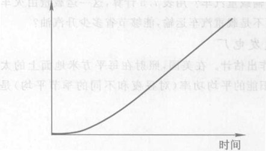

*图 7.29 这是一条指数型曲线吗？*

### 习题

**热机**

(有些问题需要用到脚注③给出的公式)
1.  如果一部热机的效率是 30%，输出的功等于 2 000 J，需要输入多少热能？
2.  如果一部热机的效率是 20%，输入热能 150 万 J，这部热机能够做多少功？
3.  在一座燃煤发电厂中进入涡轮机的蒸汽被加热到 500 ℃。这些蒸汽在 40 ℃ 的水中冷却凝结。计算发电厂可能达到的最高效率。记住在应用公式之前必须将摄氏温度转换为热力学温度。
4.  用太阳能加热的蒸汽发电厂将蒸汽加热到 250 ℃。蒸汽流过涡轮机后，冷却塔将它冷却到 30 ℃。计算这座发电厂可能达到的最高效率。记住在应用公式之前必须将摄氏温度转换为热力学温度。
5.  在上题中，假定对进入发电厂的每 1 000 J 热能，冷却塔将 750 J 作为废热带走。这座发电厂的实际效率是多少？
6.  一部燃煤蒸汽机车将蒸汽加热到 180 ℃，在 100 ℃ 处将其排出。这部机车每运行 1 秒通过燃烧消耗掉 5 亿 J 能量。根据表 7.1，在理想条件下（没有摩擦力或其他非理想的因素），每运行 1 秒可以从机车得到多少功？
7.  在上题中，在实际条件下可以得到多少功？

**汽车与运输**

8.  你独自一人从纽约去洛杉矶，里约为 2 800 英里。用表 7.3 与 7.4 计算，如果你开车去（假定你的汽车具有美国汽车的平均汽油里程），需要用多少加仑汽油？若是乘飞机去，需要使用多少汽油？坐公共汽车呢？坐火车呢？
9.  一列 100 节车厢的货运列车从纽约将 16 000 吨货物运往洛杉矶，里程大约 5 000 km。假定每辆载重汽车能运载 32 吨货物，这一列车的运载量需要多少辆载重汽车？用表 7.5 计算，这一运输量由火车而不是载重汽车运输，能够节省多少升汽油？

**蒸汽发电厂**

10. 作出估计。在美国，照射在每平方米地面上的太阳能的平均功率（对昼夜和不同季节的平均）是 200 W (200 J/s)。照射到一个足球场（大约 100 m $\times$ 30 m）上的太阳能的平均功率是多少？
11. 继续上题，美国一个普通家庭平均消耗电力为 1 kW。假定能量的转化效率是 10%，需要多大一块面积提供这一功率？覆盖这一面积的正方形光电池集能片的尺寸是多少？
12. 假定在 1935 年到 1975 年期间年发电量的指数增长在 1975 年之后再继续 10 年，1985 年的发电量将是多少？假如这一增长继续下去，1985 年大约需要多少座发电厂（与 1975 年相比）？
13. 1985 年到 1990 年期间美国人口的年增长率是 0.8%，墨西哥是 2.2%，肯尼亚最高，达到 4.2%。按照这些增长率，这些国家的人口翻一番各需要多长时间？
14. 现在全世界人口大约 60 亿。自第二次世界大战结束 (1945 年) 以来，人口的增长率大约为每年 2%。如果 2% 的年增长率保持不变，世界人口何时达到 120 亿？
15. 阿肯色州森特维尔的人口年增长率为 7%。现在它正以最大负荷使用其唯一的污水处理厂。假如保持其现在的增长率不变，40 年后它需要多少座污水处理厂？
16. 20 世纪 80 年代期间，美国小汽车和卡车行驶的路程每年增加 4%，但是公路的长度每年却只增加 0.1%。求汽车行驶的路程和公路的长度的翻番时间。
17. 继续上题的讨论，假定上述增长率在将来也保持。当汽车行驶的路程翻番（即增加 100%）的时候，公路的长度将增加大约百分之几？那时，交通堵塞的程度大致将严重多少倍？