# 第 8 章 光与电磁

> 总有一天，您可以对它征税，大人。
> ——法拉第，电磁力的共同发现者，在被财政大臣问到电的实用价值时的回答

在这一章和下一章，我们将讨论有关光的一系列问题：光是什么？它有怎样的行为？它与电这样的基本自然力有怎样的关系？“X 射线”和“红外线”这些现象与光有关吗？如果有关，是怎样的关系？这些各式各样的射线怎样影响我们的行星？

我们周围到处都是光，可是要说出光是什么却不容易。你怎么能看见这页书？是像柏拉图和欧几里得所想的那样，你的眼睛发出看不见的射线射向书页吗？还是像毕达哥拉斯和牛顿所想的那样，由书页发射或反射一束粒子流，被你的眼睛接收？或者像牛顿的同时代人惠更斯所想的那样，光是一种波？光的本性是最古老的科学问题之一，这个问题在近代导致两个伟大的后牛顿理论，即相对论和量子理论。光与其他“电磁辐射”对了解太阳能与全球变暖等社会性问题也是极其重要的。

本章把三个主题交织在一起，这三个题目都与光的本性有关，因而相互关联，但常被分开处理，它们是：波（第 8.1 节至第 8.3 节）、电磁力（第 8.4 节至第 8.8 节）和原子的行星系模型（第 8.6 节和第 8.7 节）。由于本章的主要目的是理解光的本性，因此，我们对波和电磁力的讨论将是简短的，只重点讨论为此目的所需的概念。为了理解电磁辐射（第 9 章）和后牛顿物理学（第 10 章至第 18 章），需要深刻领会光的本性。

在第 8.8 节中，你将遇到一个新的概念：场。“全新”这个词并不过分，因为迄今为止我们探讨的内容都建立在牛顿宇宙观的基础上，即宇宙由在真空中做机械运动的粒子构成，而场在许多方面是与粒子对立的。为了理解后牛顿物理学，场的概念是必不可少的。它们包括引力场（本章和第 11 章）、电磁场（本章和第 10 章）和量子场（第 13、第 14 和第 18 章）。

## 8.1 波：行进的某种特别的东西

你也许熟悉某些波（图 8.1）。沿着地板拉紧一根几米长的软绳，把它的一端固定（也许在一位朋友的脚下），抖动一下没有固定的那一端。有某种东西沿着绳子传播。图 8.2 是用电影摄影机拍摄的一系列照片，它显示出一个想像的“某种东西”沿着一根长弹簧传播，这根弹簧的右端受到一次上下抖动。另一个例子是，想象（试一试更好！）用双手沿着桌面拉开一个螺线管玩具。拿着它的右端不动，把它的左端朝右边迅速移动一段短距离又回到左边。有某种东西沿着螺线管从你的左手向右手传播（图 8.3）。这种在水面上或沿着绳子和螺线管传播的“某种东西”叫做**波**。还有一个例子是，持续抖动一根绳子的一端将产生一个沿着绳子传播的很长的连续波（图 8.4）。

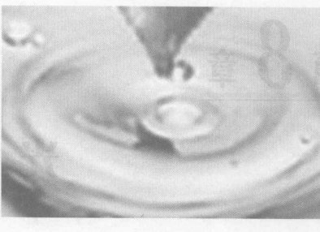

*图 8.1 水波*

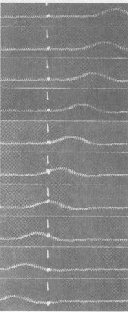

*图 8.2 用电影摄影机拍摄的一系列照片，显示出一个波沿着一根弹簧传播。一条丝带系在弹簧上箭头所指的位置。当波经过时丝带上下移动，但在波的传播方向上移动。*

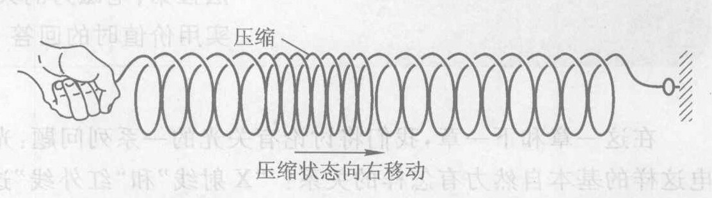

*图 8.3 螺线管的右端固定，其左端一个快速向右再回头的运动产生一个沿着螺线管传播的脉动。*

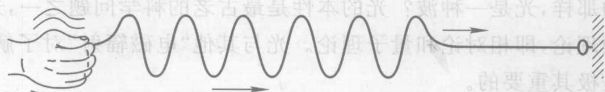

*图 8.4 连续抖动绳子的一端产生一个沿着绳子传播的连续波。*

但是，波只是一个用来称呼这种行为的词，并没有告诉我们它到底是什么。这里实际上发生了什么呢？在图 8.2 中，弹簧的各个部分实际上是怎样运动的？正如你从系在弹簧上的那条小丝带的运动所看到的，弹簧的每一圈只是做上下运动。

图 8.1 中水的某个特定的分子是怎样运动的呢？盛一碗水，放一个软木塞浮在上面，在离软木塞几厘米处扔进一块小石子以产生波纹。观察当波纹经过软木塞时的情况。如果波纹不大，软木塞将上下移动，并不随着波纹向外运动。水的每一部分只是上下晃动（也叫振动），但并不沿着水面移动。螺线管波的情况与此相似，只不过振动方向与螺线管平行而不是垂直而已。

伴随着这些波传播的一种东西是能量。你可以拿着绳子的固定端并让一位朋友抖动另一端来证实这一点。当脉动到达时你的手也振动起来。让你的手这样往复运动需要做功，而我们知道做功需要能量。因此，波传送能量。

另一方面，波并不传送任何实物：在图 8.1 中并没有水被往外传送；在图 8.2 中弹簧的哪一部分都没有从右边被传送到左边；在图 8.3 中螺线管的哪一部分都没有从左边被传送到右边。这种运动不像我们以前讨论过的任何运动。以前我们研究过球、书本、分子以及其他实物物体从一个地点到另一个地点的实际运动。

在图 8.2 中我们看到什么东西沿着弹簧传播呢？瞧，我们看到在本来平直的弹簧上的一个隆起！在图 8.3 中我们看到一个压缩（一个被挤压的区域）沿着螺线管传播。我们可以把这两种情形描述成沿着本来没有受到干扰的弹簧或螺线管传播的“扰动”。水波的情形与此相似。扰动在其中传播的物质（弹簧、螺线管或水）叫做波的**介质**。

因此，波是通过介质传播的扰动，它传送能量通过介质而不传送实物物质。

在一个坐满人的大型体育场中出现的“运动波”是一个有启发性的例子。当体育场一端的所有人有短智地站起来振臂挥手时，运动波就开始了。当他们坐下时，坐在他们近旁的其他人也短暂地站起来挥手，这样依次进行到整个场。这显得像某种东西在体育场内传播，不过，这所谓的“某种东西”并不是任何单独的东西。暂时站起来的是本来坐着的人群的一个扰动，正是这个扰动在人群中传播。这正是我们使用波这个词时心中想到的情景。

我们需要一些定量的术语。一个连续而重复的波的**波长**是沿着波从任一点到下一个相似点的距离，比如在图 8.5 中从波峰到波峰或从波谷到波谷的距离。一个波的**频率**是介质的任一特定部分每秒完成的振动次数。波通常由某种振动的波源发出，这时波的频率必定与波源的频率相同。频率也可以定义为波源每秒发出的波的数目。计量频率的单位是每秒的振动次数，也叫做**赫兹** (Hz)。一个波的**振幅**是指它的最大高度或最大深度（图 8.5），换句话说，就是它离开“平衡”（即未受到扰动）状态的最大扰动。**波速**是扰动在介质中传播的速率。①

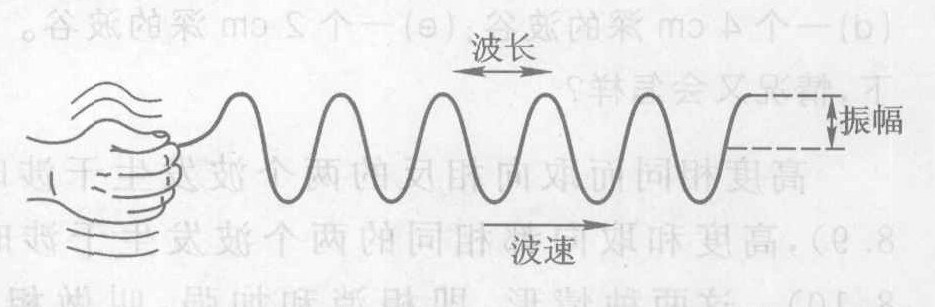

*图 8.5 波长与波幅的意义。波速是波峰或波谷沿着绳子传播的速率。*

扰动能够通过介质传播是由于介质的各个部分之间有联系。例如，当你抖动一根绳子的一端时，由于绳子的各个部分是相连的，因此当一部分向上升起时，其相邻部分也紧跟着向上升起，这个扰动就沿着绳子传送下去。因此，可以合理地假设波速主要由介质决定，在相同的介质中形态不同的扰动其波速大致相同。实验证实了这个想法，不同形态的扰动在任一特定的介质中都以大致相同的波速传播。

> **概念检查 1** 以下哪一种是真正的波？(a) 一排正在倒下的多米诺骨牌；(b) 一块小石子掉在池塘中而在水面上造成的向外扩展的波纹；(c) 打上海滩的一个大浪，冲浪者可乘在它上面冲上海滩；(d) 顺流而下的水。

> **概念检查 2** 在图 8.6 中，哪个波的频率较大（较高）？哪个波携带较多的能量？(a) 上面那个

---

*① 定量地说，一个波的波长 $\lambda$、频率 $f$ 和波速 $v$ 之间有如下关系：$v = f\lambda$。比方说，一个波源每秒发出三个波 ($f=3$ Hz)，每个波的长度为 2m ($\lambda=2$ m)，于是看来合理的是，波速应该是 $3 \times 2 = 6$ m/s。将这个结论一般化，就得到一般关系为 $v = f\lambda$。*

波频率较高，携带的能量比较多；(b) 上面那个波频率较高，但下面那个波携带的能量比较多；(c) 下面那个波频率较高，携带的能量较多；(d) 下面那个波频率较高，但上面那个波携带的能量比较多。

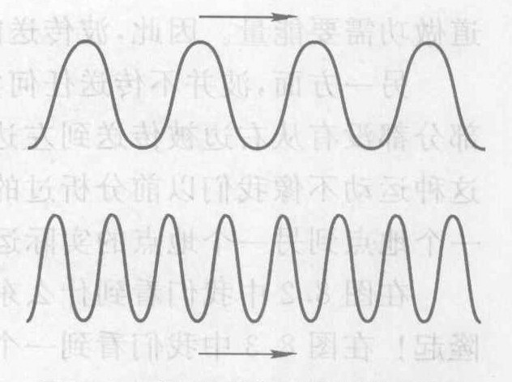

*图 8.6 假设两个波的波速相同，哪个波的频率较高（较大）？*

从概念检查 2 请注意下述有用的规则：波长越短意味着频率越高，如果波幅不变，那么频率越高意味着能量越高。

## 8.2 干涉：波独有的行为

在同一介质内传播的不同的波如何相互作用？比方说，图 8.7 中那个朝上的大波与朝下的小波相会时会出现什么情况？实验显示它们只是相互穿越而过而不发生畸变（图 8.8）。这是我们也许已经预料到的，因为个波传播时只是使绳拾高或降低，所以当两个波相会时，绳子在被大波抬高许多的同时也被小波降低少许。这种两个波在同一时刻出现在同一地点时发生的效应叫做波的**干涉**（或简称“干涉”）效应。

> **概念检查 3** 假定图 8.7 中的两个波的波幅相同，左边的那个波的波峰有 2 cm 高，右边的那个波的波谷有 2 cm 深。干涉的结果将会是 (a) 一个 4 cm 高的波峰；(b) 一个 2 cm 高的波峰；(c) 平的；(d) 一个 4 cm 深的波谷；(e) 一个 2 cm 深的波谷。如果两个波都朝下，情况又会怎样？

高度相同而取向相反的两个波发生干涉时相互抵消（图 8.9），高度和取向都相同的两个波发生干涉时相互加强（图 8.10）。这两种情形，即相消和加强，叫做**相消干涉**和**相长干涉**。

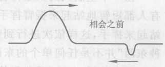

*图 8.7 两个沿绳子向相反方向传播的波。当它们相会时会出现什么情况？*

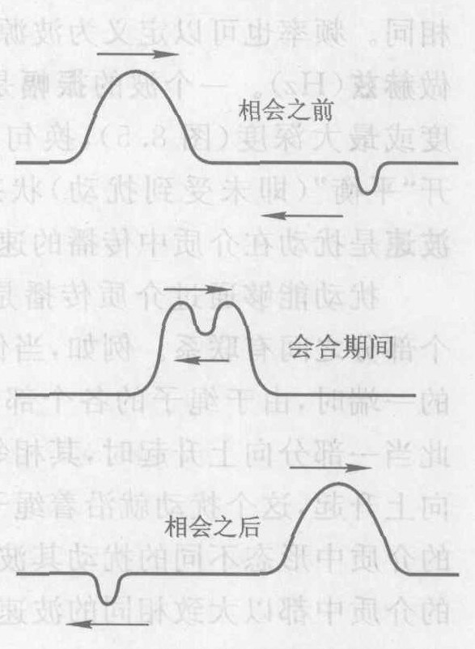

*图 8.8 两个波相会：发生干涉。*

波的干涉再次表明实物物体的运动与波动的之间是完全不同的。两个运动的实物物体——比如说两列货运列车——不会互不干扰地彼此穿越！业已证明，这个差别——实物物体不显示出波的干涉行为而波动则显示这种行为——在物理学的历史上是有决定性的作用，对本书后面的部分也是极其重要的。

发生于二维或三维空间的干涉效应更为有趣。一条受扰动的绳子只有一个有意义的维度——长度。湖面是“二维的”，因为它有长度和宽度；房子里的空间是“三维的”，因为它有长度、宽度和高度。在二维或三维的介质中，由一个小波源产生的波散开分裂为圆或球面（图 8.1）。

举一个二维的例子。假设你在一个长方形的盆中盛上水，用你的手指在沿着一条盆边的两个点处以相同的不变频率轻叩水面。从这两个波源分别发出连续的波并很快覆盖水面。借助干涉图 8.11，你能预言这时的干涉效应。这个图显示从上向下看到的水面。把两个波源标上

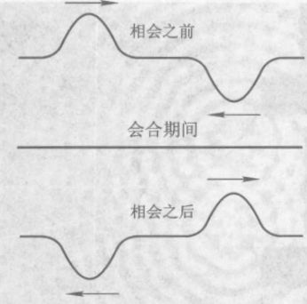

*图 8.9 两个波相会发生相消干涉*

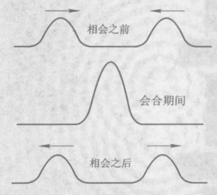

*图 8.10 两个波相会发生相长干涉*

A 和 B。实线圆代表波源 A 单独作用时发出的波峰，虚线圆代表波源 B 单独作用时发出的波峰。波谷没有画出，它们位于两个波峰的中间。为了预言干涉图样，请做概念检查 4。

> **概念检查 4** 在图 8.11 中，在每一个相长干涉点画一个 “x”（用颜色以增强效果）。（提示：这些点是波峰与波峰相会、波谷与波谷相会的地方。）你能看到一幅图样吗？下一步在每一个相消干涉点画一个“o”（换一种颜色）。（提示：这些点是波峰与波谷相会的地方。）现在你能看到一幅图样吗？

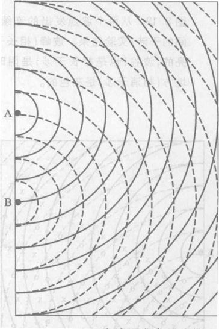

*图 8.11 从两个波源发出的连续表面波。干涉效应将是什么样子？*

图 8.12 是这个实验的照片，是从上向下对着水面拍摄的。照相技术使波峰显得明亮，波谷显得阴暗，而平坦的地方显示出灰色。你能看到，干涉图样具有由未受扰动的水构成的线条，它们呈辐射状向外，好像来自两个波源之间的某一点。沿着这些线干涉是相消的。在这些未受扰动的线条之间是相长的干涉线，有大的波峰和波谷。这正是概念检查 4 所预言的。

迄今我们所分析的都是在某一瞬刻的情况。现在“让时间动起来”，想象一部从图 8.12 中的快照开始的电影。由于单个圆形波从 A 和 B 向外运动，因此整个图样也一定向外运动；换句话说，相消干涉和相长干涉的“射线”保持不动，而相长干涉线上的大波向外运动，如图 8.13 中的箭头所示。

最后，想象这一片水是一个长方形的游泳池，你在观察拍打池子右壁的水波。你会看到什么呢？我们可以用图 8.13 来预测答案。观察者应该发现在某些点有大波拍打池壁，在图 8.14 中用大写字母 X 标记，而在另一些点则没有波涌动，用大写字母 O 标记。

单个波源产生的图样与两个波源产生的图样之间的差别特别明显。单一波源如 A 产生的波涌到盆边的所有地方（图 8.15）。如果我们让第二个波源 B 也工作起来的话，沿盆边的图样就变成一幅干涉图样（图 8.14）。最具戏剧性的变化是，这时没有波来到标有 O 的那些点了，尽管

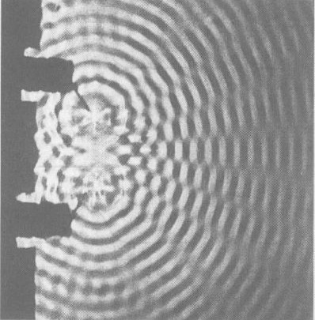

*图 8.12 从两个波源发出的连续表面波之间的干涉；实验结果。波峰（相长干涉）是明亮的，波谷（也是相长干涉）是阴暗的，平的地方（相消干涉）是灰色的。*

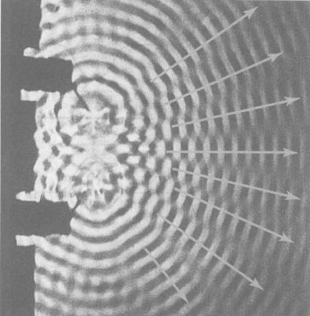

*图 8.13 相长干涉线和相消干涉线在空间保持不动，而相长的（大）波在相长干涉区域内按箭头所指的方向向外运动。*

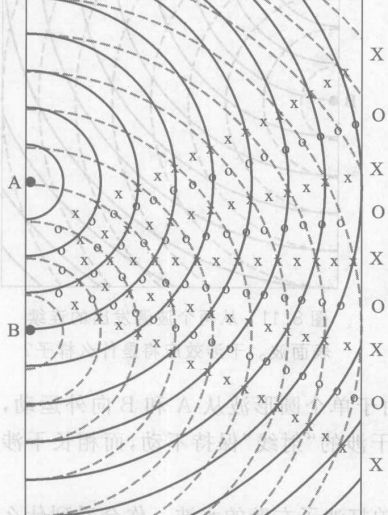

*图 8.14 一个扫视水池对岸池壁的观察者发现，在大波到达池壁的那些点之间穿插着没有波到达的点。*

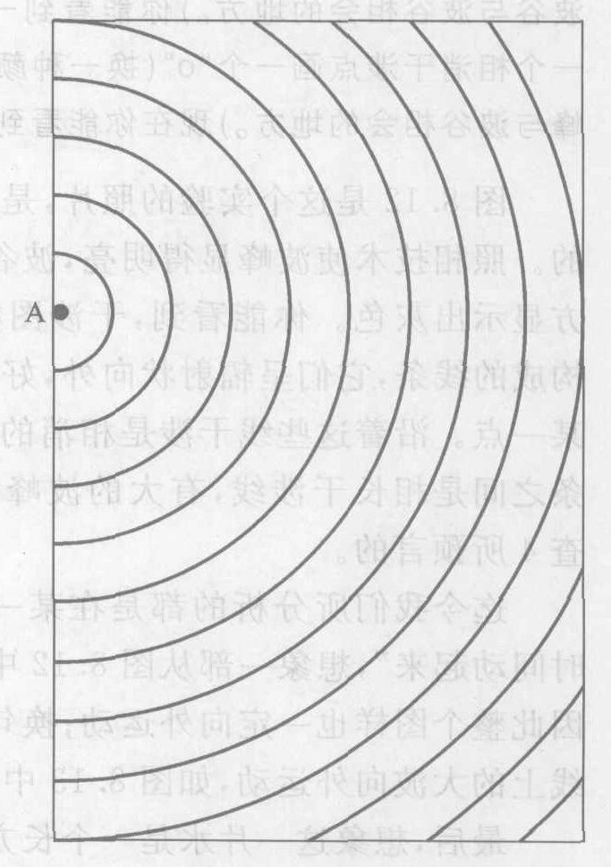

*图 8.15 如果关掉两个波源中的一个，扫视池壁的观测者将发现波到达所有的点。因为这时波只由单个波源发出，所以不再有任何干涉。*

当只有一个波源工作时波确实来到这些点。这似乎有些荒谬：我们加上第二个波源，在标有 O 的那些点得到的波反而减小了（事实上是零）。

下面我们来看光。

## 8.3 光：是粒子还是波

夜里当你把灯关上时，房间就一片漆黑。因此，房间里的光必定来自电灯，而不是来自你的眼睛。当你看着白炽灯这样的发光体时，光从白炽灯进入你的一眼睛。为了让你看到你房间的墙壁这样的不发光的物体，灯发出的光必定从墙壁反跳（反射）回来然后再进入你的眼睛。不过，从墙壁反射的光并不给你一个良好的镜面反射，因为大多数墙壁的表面粗糙，把射来的光散射到许多不同方向。

可是当你看到光时，进入你眼睛的到底是什么东西呢？这个问题已经争论了好几个世纪。提出的大多数答案要么可以归入“粒子”一类，要么可以归入“波”一类。实验是最终的裁判者。我们需要一种实验检验方法来判别光的粒子模型和波动模型哪一个对。上节提出了一个很好的候选方案：波的干涉。粒子可能以各种各样的方式相互作用，但它们不会像波一样发生干涉。光的行为如何？为了回答这个问题，我们需要用光来做一个像水波干涉那样的实验。你可能想到的第一个实验就是用两支手电筒照一个电影屏幕。但是如果你试一试（请真的试一试！），你就会发现这不会产生能观察到的干涉效应，没有交替出现的相长干涉区（亮纹）和相消干涉区（暗纹）。因此，光或许是一股粒子流。

但是在我们对水波干涉的讨论中，我们假定了两个波源的振动完全相同。例如，如果图 8.12 中两个波源的频率一直随时间变化而且变化的方式不同，我们就别指望能看到可以辨认的干涉图样。手电筒灯泡是不通过把灯泡的细金属丝红灯丝加热到白热程度而发光的。使灯丝热得足以发光的微观热运动是杂乱无章的，因此我们不能指望两个不同的灯泡有完全相同的振动，于是，即使光是一种波，它们也不会显示出干涉现象。

**我们怎么知道光到底是波还是粒子？** 1801 年，杨氏证明了光是一种波。他把单个光源的光分成两部分，它们的振动完全相同，从而解决了寻找两个全同光源的问题。然后他让这两部分重新汇合，看看它们是否发生干涉。

图 8.16 表明如何做到这一点。一个光源发出的光通过一块挡板上的两条很小很窄的平行狭缝（图中已放大了许多倍），除了通过双缝的光，挡板挡住了所有其他的光。这两条缝起到了两个光源的作用。如果光是一种波，这两个光源的振动就应该同步，因为来自每条缝的光都源自同一条灯丝。② 杨得到的实验结果如图 8.17 所示。

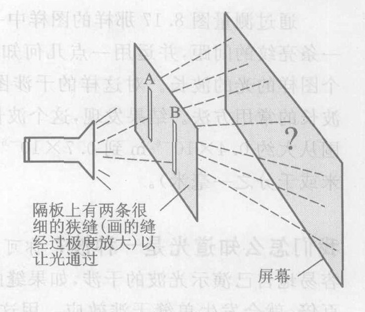

*图 8.16 光的双缝实验。在屏上我们将看到什么？*

*② 更精确地说，首先要用滤色镜将光变成单颜色（即单一频率）的，还要先让光通过一条狭缝以便使其在 A 缝和在 B 缝的振动同步。这样做的实验与图 8.13 和 8.14 完全相似。在这个两个图中，从 A 和 B 发出的波具有相同的频率并且是同步的。*

这张照片是把照相底片放在接收屏的位置拍摄的。图 8.18 画出了这个光的双缝实验的结果。

为了解释图 8.17，让我们把它与水波干涉作比较。图 8.16 中的接收屏与图 8.14 中的右壁相似。不过水波在水的二维表面上发生，而光则充满三维空间。这两个光光源不是像图 8.14 中的 A 和 B 那样很小的点，而是在第三维上伸长的缝。如果这些缝发出光波，我们就预期在接收屏上的干涉图样将是与狭缝平行的相长干涉与相消干涉相间的直条纹，而不是像图 8.14 中标着 X 和 O 的那些点。换句话说，我们预期会出现相间的亮纹和暗纹。这正是图 8.17 所示的结果。

结论是：光是一种波。

如果我们关闭一条狭缝，只留下一条狭缝开着，预期会出现什么情况？如果光是一种波，我们会预期波从开着的狭缝传出而不发生干涉，正像图 8.15 中的水波一样。于是，将会有一条宽的光带覆盖着接收屏上的一大片面积（图 8.19）。事实上，这正是所发生的情况。

手电筒发出的是波而不是粒子的最明确的证据，可以在双缝实验的暗线位置上找到，暗线就是没有光到达的那些点。只打开一条狭缝时，光分布在整个接收屏上（图 8.19），可是，只要打开第二条狭缝，这些特定的位置上就不再有光到达，这是怎么回事呢？我们难以理解通过两条狭缝的粒子怎么能像这样相互抵消，不过这正是波的相消干涉预期的。

通过测量图 8.17 那样的图样中一条相长干涉亮纹到下一条亮纹的间距，并运用一点几何知识，就可以算出产生这个图样的光的波长。对这样的干涉图样的测量是测量光波波长的常用方法。结果发现，这个波长很短。光源的波长范围从大约 $0.4 \times 10^{-6}$ m 到 $0.7 \times 10^{-6}$ m（小于 100 万分之一米或千分之一毫米）。

**我们怎么知道光是一种波？** 你可以用单缝干涉效应容易地自己演示光波的干涉，如果缝的宽度比光的波长大约几百倍，就会发生单缝干涉效应。用这样的宽缝，通过它的光就像是几百个小光源。如果光是一种波，那么来自这几百个光源的波就应该彼此干涉而形成干涉图样。

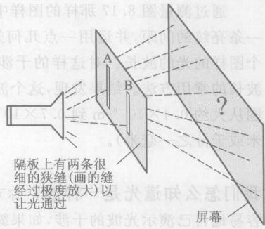

*图 8.17 光的双缝实验结果；在接收屏上（图 8.16）拍摄的照片。*

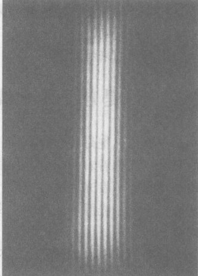

*图 8.18 光的双缝实验；实验装置和结果*

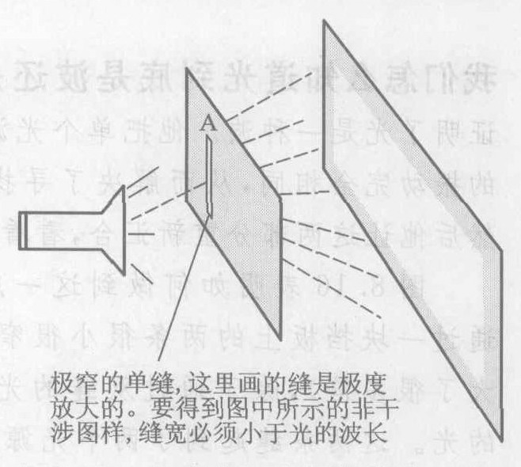

*图 8.19 如果关掉两条狭缝的一条，将会得到图中所示的非干涉图样，缝宽必须小于光的波长放大。光将到达接收屏上所有的点。白色的屏幕表示没有干涉图样，即光到达屏幕的所有位置，这与在图 8.18 中出现的图形形成鲜明的对照。将图 8.18 和图 8.19 与图 8.14 和图 8.15 进行比较。*

实验是这样的：把视线集中在照得很好的墙面或其他表面上。把拇指和食指并拢起来，分开大约 1 mm，形成一条狭缝，放在你眼前几厘米处。把视线集中到光源（墙）上而不是你的手指上，这样你的手指看起来是模糊的。在那一片模糊之中，你应该能看到平行于你的手指的窄的亮纹和暗纹。这些亮纹和暗纹就是在你眼睛的位置上形成的相长干涉区和相消干涉区。

> **概念检查 5** 如果用波长较长的水波做图 8.14 所示的实验，那么，沿着图中右壁的 X 点和 O 点将 (a) 离得更远；(b) 靠得更近；(c) 不变。

> **概念检查 6** 如果用波长较短的光做图 8.17 所示的实验，那么，图中相间的亮纹和暗纹将 (a) 不变；(b) 变多，但长度或宽度不变；(c) 变宽；(d) 变窄；(e) 变长；(f) 变短。（提示：见概念检查 5）。

**作出估计 一个光波有多大？**
典型的光波波长与一张纸的厚度相比大致如何？③

## 8.4 电：电磁力的一部分

水波、绳波和弹簧螺线管波是水里、绳子里和弹簧螺线管里的波。当光波传播时，是什么介质在振动？这不是一个简单的问题。我们不能像看见水波那样直接看见光束（图 8.20），这就像我们能看见水波对游泳池壁的冲击却看不见水。我们能在有灰尘的空气中看到光束（图 8.21），但这只是因为光被灰尘粒子反射的缘故。光波的介质本身是看不见的。

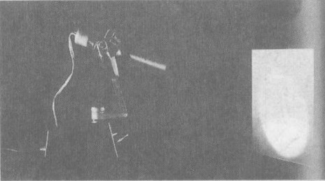

*图 8.20 从侧面看不到光束。是什么看不见的介质在传送光波？*

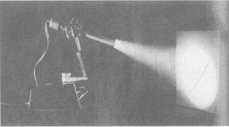

*图 8.21 让光从空气中的尘埃粒子上反射，就能看到光束。*

这种介质可能是空气吗？这听起来似乎有点道理。但是从月亮和星星那里传到地球上的光又怎样呢？就任何可以觉察到的数量而言，空气只延伸到地球表面上方几千米的地方，因此空气不可能是光波的介质。④ 光的一个奇异之处在于它通过根本就不存在任何物质的宇宙空间传播。但是在所谓的真空中一定有某种东西，因为没有产生波动的介质就不可能有波。于是，光的介质是非实物的，不是由原子或其他形式的实物构成的。

*③ 选一个典型的光波波长，比方说 $5 \times 10^{-7}$ m（作估计时常选简单而又合理的数值）。为了估计一张纸的厚度，先估计比方说 500 张纸的厚度（大约 5 cm），然后除以 500，5 cm/500 = 0.01 cm = $10^{-4}$ m。这个厚度中的波长个数为 $10^{-4} / (5 \times 10^{-7}) = 10^{-4+7} / 5 = 10^3 / 5 = 1000/5 = 200$。*
*④ 空气是声波的介质，而非光波的介质。由于声波不直接涉及本书的主要目的，所以我们在这里不对它作进一步的讨论。*

19 世纪的科学家花了大量的时间和精力研究光是哪一种波。结果发现，答案与当时正开始了解的电现象紧密相关，光是一种穿过电磁场传播的电磁波。我们将在本章剩下的部分讨论电，下一章则探讨电与光有什么关系。

找两张教师在投影仪上用的那种塑料透明片。用薄纸用力摩擦透明片，两只手各拿着一张透明片的一边，让它们平行并且只分开几厘米（图 8.22）。它们就会相互推斥。虽然间隔增加时这种力就减弱，不过实验表明，即使透明片相隔很远，这种力仍然存在。接下来把薄纸铺在一个水平面上，把一张摩擦过的透明片拿到它的正上方。薄纸被吸起来贴在透明片上。当你从烘干机取出衣服时，或当你轻刷头发时，你可能也体验过类似的力。图 8.23 示出一个极端的例子。

这种力与万有引力有点相似：它能够超越一段距离起作用，并随着间隔加大而减弱。但是有几个理由表明它不可能是万有引力：透明片相互排斥，而万有引力则相互吸引；这种新的力远远强于在透明片与薄纸这样质量小的物体之间可能存在的万有引力；这种力取决于透明片是否受摩擦，但却难以看出摩擦怎样会影响万有引力。

我们称这种力为电力。一个“带电的”物体例如摩擦过的透明片或薄纸叫做**带电体**，而产生这种状态的任何过程叫**使物体带电**。

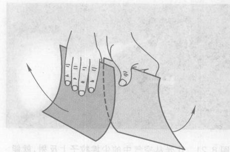

*图 8.22 两块摩擦过的透明片相互施加电力。*

*图 8.23 头发实倒霉的一天，电发。这个效应来自“带电”的金属球。*

实验表明，当我们用相同的方法使两个相同的物体带电时，它们相互排斥。但是带电的透明片和带电的薄纸却相互吸引。因此，透明片和薄纸所带的电一定不相同。在对许多带电物体进行实验之后，人们发现它们分成两种类型：一种电排斥透明片而吸引薄纸，另一种电吸引透明片而排斥薄纸。我们把这两种电分别叫做**正电**和**负电**。别对这些名称赋予太多的意义——我们同样可以把它们叫做红电和蓝电，或者好电和坏电。

我们的实验表明了：

> **电力定律**
> 带电的物体相互有作用力，即使它们相隔一段距离。物体可以带正电也可以带负电。带同种电的两个物体（两个都带正电或都带负电）相互排斥，带不同电的两个物体（一个带正电，另一个带负电）相互吸引。⑤

## 8.5 磁：电磁力的另一部分

你玩过磁铁吗？人人都有机会体验磁铁间相互作用的非常有趣的力。你可以在玩具店买到磁铁。如果你把两根磁铁棒彼此靠近，你就会发现它们的两端要么相互吸引要么相互排斥，即使磁铁之间并不接触也是如此。一块磁铁的两端分别叫做该磁铁的“南”、“北”**磁极**。实验表明，相同的磁极相互排斥，不同的磁极相互吸引。这使我们想起电荷间的作用力：同性电荷相斥，异性电荷相吸。

似乎有理由假设，作用在磁铁之间的力实际上就是电力。这个假设易于检验，因为它预言磁铁对像摩擦过的透明片或薄纸这类带电体应该有作用力。如果你试一试就会发现，磁铁对摩擦过的透明片或薄纸并没有作用力。⑥ 因此，我们的假设是错的。磁铁棒之间的作用力不是电力，磁铁的两端也不是“带电”。

在磁与电之间还有其他重要的差别。第一，磁铁棒的磁性是持久的，与摩擦没有关系。第二，每一块磁铁都同时有北极和南极。从未发现过只有一种磁极而没有另一种磁极的物体，尽管人们很认真地寻找过这种“单极体”。而与此相反，我们很容易找到像摩擦过的透明片这样只带一种电荷的物体。

我们把这种新的力叫做**磁力**。电力和磁力之间的相似性使人想到它们可能有联系。19 世纪物理学的巨大成就之一就是证明了情况正是如此。最具体的证据是 1820 年首次进行的一个实验，在这个实验中，运动的带电粒子对磁铁有一个可测量的作用力。注意，只是**运动**的带电体才对磁铁有作用力。我们已经知道，静止的带电体对磁铁没有作用力。

19 世纪进一步的实验表明，一切磁力都可以追溯到带电体的运动。运动的带电体除了在它们静止时所感受到的各种纯电力之外，还施加和感受磁力。这种由运动引起的额外的力就是磁力。这意味着不需要单独的磁极概念，因此我们可以抛弃磁极概念而代之以考虑运动的电荷。例如，用磁铁棒做实验观察到的力是由每个磁铁棒内运动的亚原子带电粒子引起的（第 8.7 节）。又如，地球的磁效应是由在地球内部流动的带电物质引起的。这是一件好事，因为它使磁罗盘能够运转，这样，男女童子军们就能够互相找到对方了。

我们小结如下：

> **磁力定律**
> 运动的带电体除了它们静止时存在的电力之外，还施加和感受另一种力。这种额外的力叫做磁力。一切磁力都是由带电物体的运动引起的。

*⑤ 定量关系是，电力正比于两个物体各自电荷量的乘积，反比于相隔距离的平方：$F \propto q_1q_2/d^2$。注意与万有引力定律的相似：$F \propto m_1m_2/d^2$。*
*⑥ 由于一种叫做“电极化”的电效应，有时磁铁对透明片会有弱吸引力。即使使用一块没有磁化的金属代替磁铁，这个力依然出现，而且强度相同，因此它不是由磁铁引发的。而是因为，当带电体靠近金属时，金属内极易移动的电荷会重新分布而引发出力。把一张带电的透明片拿近一个可自由滚动的空铝罐时，类似的电极化现象相当显著。请试一试！*

**我们怎么知道运动电荷的行为像磁铁？** 用一个 1 号电池、一小段绝缘铜线和一个带有平衡放置的磁针的灵敏的磁罗盘，就能演示磁力定律。把罗盘放在水平面上，铜线在罗盘的上方或下方按南北走向（与磁针平行）。把铜线接到电池的两极，这时，磁针就会转到一个新的位置。对这个现象的解释是：电池使电子沿着导线运动（第 8.7 节），运动的电子对磁铁施加磁力。注意：铜线和电池只接通几秒钟，以免电池很快耗尽。要用绝缘导线，因为电流可能会发热。

科学的一个目标是寻求不同的现象之间的联系。牛顿通过找出下落的苹果与月亮之间的相似性，把天上和地上统一起来了。类似地，19 世纪的科学家发现电与磁都是由于带电物体的存在而产生的，而且这两种力可以被看作带电物体之间的单一的**电磁力**的两个方面。

这是一种必须认真对待的力。正如本章开头引用法拉第的话所预示的那样，电磁学已经使我们的技术、经济、文化以及日常生活发生了转变。环顾你此时此身处的地方或户外环境，数一数你周围那些依靠电来运转的物体。若是没有这些东西，生活会是怎样的呢？处在我们这个“时髦的”世界中，难以想象在发明电之前生活是什么样子的。

> **概念检查 7** 两根磁铁棒之间的力不可能是由万有引力引起的，其原因是：(a) 这种力太强，不可能由万有引力引起；(b) 这种力太弱，不可能由万有引力引起；(c) 这种力可以是相互吸引的，而万有引力总是相互排斥的；(d) 这种力可以是相互排斥的，而万有引力总是相互吸引的；(e) 万有引力即使在很大的距离上也起作用，而磁力只在短距离内起作用。

> **概念检查 8** 如果你用一张薄纸摩擦一张透明片使两者都带上电，然后拿着它们静止不动并相距数米，它们彼此之间相互施加的力称为 (a) 等于零；(b) 只有静电排斥力；(c) 只有静电吸引力；(d) 静电排斥力加上磁力；(e) 静电吸引力加上磁力；(f) 只有磁力。

> **概念检查 9** 如果你锯下磁铁的一端，你会得到 (a) 两段没有磁性的金属片；(b) 两块磁铁；(c) 两块磁铁，但各自只在一端有磁极。

## 8.6 内部有电的原子

对电磁现象的理解带给科学家们一个非常精细的原子模型，叫做原子的“电”模型或原子的“行星系”模型，我们将在本节和下一节探讨这个模型。

热能、化学反应以及更多的现象都可以用古希腊的原子模型来理解，这个模型把原子看作是一个微小的坚硬的物体（第 2 章），但是，要让电磁现象与原子的这幅不可分的粒子图像相一致是很难的。电荷是从哪里来的？摩擦怎么会产生电荷？为什么有两种电荷？这些和别的一些问题在 20 世纪初导致了原子的行星系模型。⑦ 按照这个理论，原子不是一个坚固的、不可分的物体。相反，行星系式的原子几乎是全空的，是可分的，并由许多部分构成。

就像它的名字所暗示的，原子的行星系模型像一个微型的太阳系。图 8.24 画出了两种不同元素氦和碳的单个原子。原子的行星系模型的界定特征是在中心有一个极小的**原子核**（图中放大了许多倍），周围有若干个更小的**电子**（“带电的小粒子”），它们在离原子核很远（比原子核本身的尺寸大得多的）的轨道上绕原子核运动。一个原子总的大小即跨越电子轨道的距离，大约是 $10^{-10}$ m。这差不多是固体物质中相邻原子之间的距离。但是一个原子核的大小一般只有这个大小的 1/10 000，即 $10^{-14}$ m 的数量级。这些尺寸的一个适当比例关系是，如果我们按比例造一个扩大的原子模型，用一个足球代表原子核，那么沿轨道运动的电子就是远在数千米以外的尘埃微粒！原子是几乎全空的。

你不能从电子上移走电荷——它永远带负电。电子也有质量，大约是最轻的原子质量的 1/2 000。没有人知道这两件事的原因。

原子核本身由多个亚原子粒子构成，它们分为**质子**和**中子**两类。质子（带正电）是另一种和电子一样永远带电的粒子。它所带电荷量的大小正好和电子一样，但不是负电而是正电。我们说电子和质子带电“一样多”，意思把它们放在离另一个面带电物体相同距离处时，它们受带电物体施加同样大小的力（但方向相反）。不过电子和质子的质量不同。质子的质量差不多比电子大 2 000 倍。中子是不带电的中性粒子，其质量与质子的质量几乎相同。构成任一原子的原子核的质子和中子数目从 1 到几百。

把电子保持在围绕原子核的轨道上的“粘合剂”是电子与质子之间的电吸引力。把原子核维系在一起的粘合剂必须是某种非电力，因为带正电的质子之间的电力是排斥力，而中子则不施加电力。第 15 章要讨论这种原子核的粘合剂。

由于一个原子的电子离原子核相对来说比较远，因此容易把电子从原子中移走也不足为奇了。可是在地球上，大多数原子都有数目相同的电子和质子，这是因为任何一个电子数目不足的原子都会带有净正电荷，从而会迅速从周围的环境中吸引电子，而任何一个电子数目过多的原子都会带有净负电荷，因而会迅速把它最外面的电子丢失到周围的环境中。这就是用了这么长的时间才发现许多电现象的原因：单个原子通常是电中性的，因而显示不明显的电效应。电子数目过多或不足的原子叫做**离子**。

> 通过分裂原子产生能量是一个傻主意。任何指望从转变这些原子得到能源的人都是痴人说梦。
> ——卢瑟福，原子核的发现者，1933 年在对英国科学促进协会的讲话中作出了这个著名的错误预言。就在同一大厅里，物理学家开尔文勋爵于 1907 年曾经断言原子是不可能被破坏的。纽约先驱论坛报于 1933 年 9 月 12 日刊登的文章标题为“科学家被告知，用原子做动力的世界是荒诞的——卢瑟福勋爵嘲笑在实验室中驾驭能量的理论”

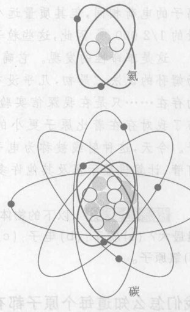

*图 8.24 原子的行星系模型的两个例子。灰点代表质子，白点代表中子，黑点代表电子。这两个图不是按比例画的！如果按比例把它们画在这一页上，原子核就会小以致看不见。*

*⑦ 原子的行星系模型这个术语是自相矛盾的。原子的意思是不可分的，而行星系指的是原子能分成各个部分！这个古老的希腊名字仍在使用，但已不是其原意了。*

**我们怎么知道电子存在？** 1897 年，英国物理学家 J. J. 汤姆孙（图 8.25）研究一种叫做阴极射线的看不见的射线束。阴极射线产生在一个近于真空（抽掉空气）的玻璃管内，玻璃管的两端用金属导线与电源相连。电源接通后，便有分成不明的射线沿着管长方向射出，这可从它们轰击玻璃管的一端发出的闪光观察到。

汤姆孙猜想这些射线是带电的，于是他把电荷与磁铁放在射线周围。闪光的位置发生了偏移，这意味着射线必定是带电的。当时知道的唯一带电的微观物体是在某些化学实验中观察到的离子。因此汤姆孙假设这种带电射线就是这种离子的流。接着他测量了射线的偏转。用已知的电力和磁力定律，他由这些测量结果推知这种射线是带电的粒子流，其电荷与典型离子的电荷相同，但其质量远小于离子的质量，大约只有离子质量的 1/2 000。⑧ 因此，这些粒子不是离子。

这是革命性的发现。它确证了原子是有组成部分的。按照汤姆孙的说法，“最初，几乎没有入相信这比原子还小的物体的存在……只是在我深信实验结果已经确凿无疑之后，我才公布了我对存在着比原子更小的物体的信念。”汤姆孙发现了电子。今天，这种射线被称为电子束，它被用于电视显像管、荧光灯管、计算机显示器及其许多装置中。

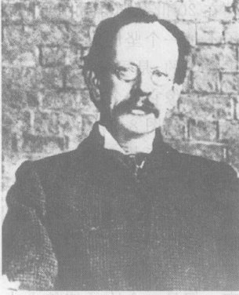

*图 8.25 J. J. 汤姆孙，电子的发现者。他第一个证明原子是由更小的带电部分组成的。*

> **概念检查 10** 以下物体中哪一个的质量最小？哪一个的质量最大？(a) 质子；(b) 电子；(c) 氢原子核；(d) 中子；(e) 水分子；(f) 氧原子。

**我们怎么知道每个原子都有一个原子核？** 像 1910 年前后其他人一样，新西兰人卢瑟福（图 8.26）也试图确定原子的内部结构。他认识到原子包含电子，因此就一定也存在正电荷。人们知道，在固体物质中原子相互紧紧地挤在一起，要把固体物质压缩成更小的体积，需要巨大的力。在科学家们看来，这意味着原子的大部分体积内必定充满了物质。

为了检验这个假设，卢瑟福采用了现已成为传统的物理学技术的方法：用一种微小的东西撞击另一种微小的东西，看看会发生什么事情。他当时刚刚发现不久的射线（叫做 $\alpha$ 射线）“撞击”铝箔之类的金属箔中的原子。$\alpha$ 射线是从某些“放射性”物质中发出的带正电的而且质量相当大（大约是质子质量的四倍）的高能“$\alpha$ 粒子”束（$\alpha$ 粒子即氦原子核，由两个质子和两个中子构成，见第 15 章）。

他的想法是要观测金属箔使快速运动的 $\alpha$ 粒子从它们原来的方向偏转多少，并由此推断金属箔的原子内物质应该如何分布（图 8.27）。偏转角通过观测 $\alpha$ 粒子撞击包围着金属箔的接收屏所发出的闪光来测量，如图 8.27 所示。类似的实验以前已经做过，并且已经发现金属箔对 $\alpha$ 粒子运动的影响小得出奇。大多数粒子的偏转角小于 $1^\circ$，如图中两个放大一部分所示。由于金属箔的厚度大约有 500 个原子，$\alpha$ 粒子显然直接通过了大多数原子而没有偏转。由此可见，原子具有十分疏松、空旷的结构。

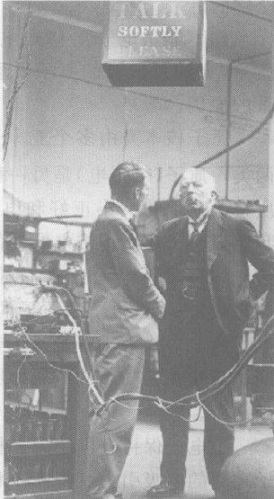

*图 8.26 卢瑟福，原子核的共同发现者，20 世纪最伟大的实验物理学家之一，在与一个同事谈话。由于卢瑟福粗大的嗓门可能会干扰精密的实验仪器，头顶上“请勿喧哗”的告示牌是开玩笑地冲着他来的。他关于放射性和原子核物理学的研究影响了 20 世纪初的一代实验物理学家。*

> 不存在——不存在！我怎么能看到那些小不点在我面前，就像我看到那把勺子那样清楚呢！
> ——卢瑟福，当他在餐桌上被问到是否相信原子核真的存在时

*⑧ 更精确地说，他发现粒子的荷质比是任何已知离子的荷质比的 1/2 000。*

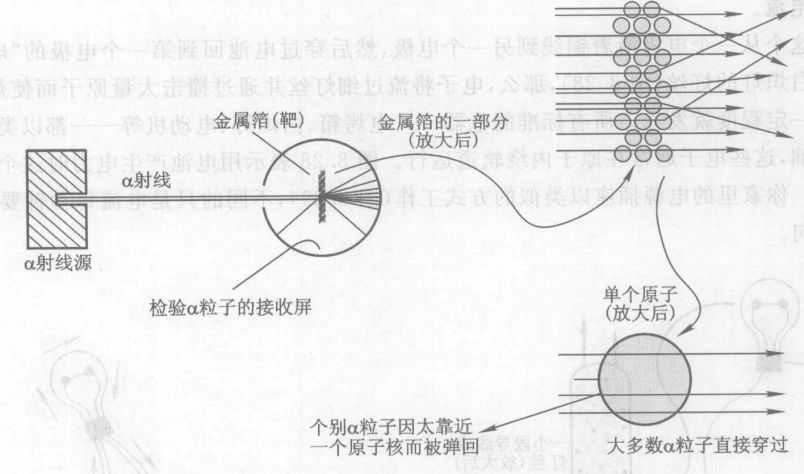

*图 8.27 卢瑟福的 $\alpha$ 粒子散射实验*

随后在 1911 年，卢瑟福决定看一看是否有任何 $\alpha$ 粒子会偏转一个大于 $90^\circ$ 的很大的角度。他用检测屏把金属箔几乎包围起来对这个问题进行研究。他预计看不到大的偏转，因为人们认为，快速运动并且质量很大的 $\alpha$ 粒子穿过一个原子就像是一枚炮弹穿过一锅稀粥一样，如果有很大的偏转却必须受到巨大的力。

几天之后，卢瑟福的合作者给他带来这样的消息：有少量 $\alpha$ 粒子被反弹回来。正如卢瑟福所说：“那真是我一生中遇到的最难以置信的事情。其难以置信的程度几乎就像是你向一张薄纸发射一枚 15 英寸的炮弹，而炮弹却被弹回来并打中你一样。”显然，原子的几乎全部质量都集中在中心区域。炮弹撞上了另一枚炮弹而被反弹回来。卢瑟福和他的合作者们发现了原子核。

> **概念检查 11** 以下物体中哪一个有总（净）电荷？(a) 质子；(b) 电子；(c) 氦原子核；(d) 中子；(e) 氧离子；(f) 氢原子。

## 8.7 原子的行星系模型：一个有用的理论

我们在本节将看到，像所有好的理论一样，原子的行星系模型解释了许多现象。

它解释了我们用带电体做的实验。当你用薄纸摩擦透明片时，透明片的原子内被束缚得不太紧的最外层电子被擦下来转移给薄纸的原子，结果使透明片带正电，薄纸带负电。这就是摩擦后两者互相互吸引的原因。两张摩擦过的透明片都带正电，所以它们相互排斥。

当铜线的两端接到电池的正负端（叫做“电极”）时，电力突然加到铜线内的每个带电粒子上。电池内的化学过程使它的电极总是一个带正电，一个带负电，这两个带电的电极就对铜线内每个带电粒子施加电力。这些力实际上对带正电的铜原子核不产生扰动，这些原子核都固定在本来所处的位置上。但是在铜或其他任何金属内，每个原子的最外层电子只受到母体原子松散的约束。这些电子一旦受到电池产生的电力作用，就开始沿着铜线运动。带电粒子的这种定向流动叫做**电流**。

如果这个从一个电极沿着铜线到另一个电极、然后穿过电池回到第一个电极的“电路”中还包括一个白炽灯的灯丝（图 8.28），那么，电子将流过细灯丝并通过撞击大量原子而使灯丝发热。灯丝热到一定程度就发光。所有标准的电器——电烤箱、白炽灯、电动机等——都以类似的电子流动为基础，这些电子通常在原子内绕轨道运行。图 8.28 表示用电池产生电力时这个过程是如何进行的。你家里的电源插座以类似的方式工作（图 8.29），不同的只是电流每秒钟要多次改变流动的方向。

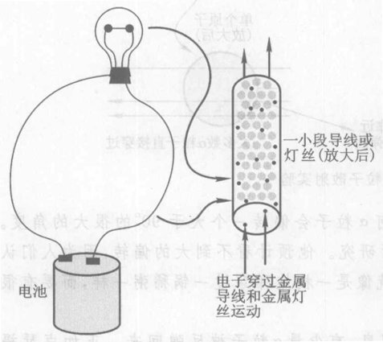

*图 8.28 电池产生电力使电子在金属导线内运动。电子沿着导线回路从电池的一个电极（端子）流向另一个电极，然后由化学力推动，穿过电池，从第二个电极回到第一个电极。*

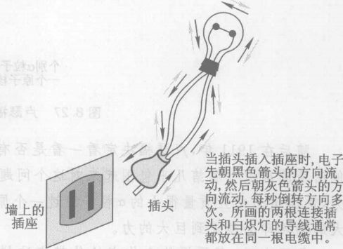

*图 8.29 电器的运转基于看不见的电子在电路中来回运动。墙上的插座（更精确地说，通过导线连接到墙上插座的发电站）相当于一个水泵。它“泵送”（激励）电子使它们能够在电路中往复运动。*

磁力定律说，一切磁力来自运动的电荷。那么，造成永久磁铁的运动电荷又在哪里呢？答案是：可以在原子层级上，在原子内部的电子运动中找到它们。⑨ 磁铁棒中每个运动的电子产生对另一磁铁棒中每个运动的电子的微弱磁力。在大多数物质中，所有电子的运动具有不同的方向，这些微弱的磁力相互抵消。但是在制作磁铁时，对铁进行了处理，把许多电子的轨道锁定在相同的取向，这就使大量微观的磁力相加而造成巨大的宏观效应。

通过迫使物体内的许多电子按相同的方位取向，永久磁铁能够使钉子之类的物体暂时磁化。这就是永久磁铁吸引钉子的原因。

人们认为地球的磁性是由在地球炽热的内部熔化的铁中流动的电流引起的。而这种磁性又导致罗盘针（细小的永久磁铁）指向北方。

行星系模型为许多化学现象提供了微观的解释，其中包括为什么一种元素的所有原子具有同样的化学特性、为什么不同的元素在化学性质上不相同等。一种元素的化学反应是由它的轨道电子的行为决定的。食盐 (NaCl) 是一个很好的例子。由于氯 (Cl) 原子比钠 (Na) 原子对电子的吸引力更强，因此，Na 的一个电子被 Cl 吸引过去，结果使 Na 带上正电荷而 Cl 带上负电荷，所以 Na 就很给易与 Cl 结合。这样，符号相反的电荷之间的电力就把 Na 和 Cl 的原子吸引并保持在一起。

真正决定一种元素的特性的是该元素的原子核内质子的数目，原因是，中性（没有电离）的原子中电子的数目一定等于质子的数目，而电子的数目又决定了原子的化学性质。电子数目相同的两个中性原子具有相同的化学性质，因为它们的电子轨道具有相同的结构。因此，根据不同元素的原子中质子的数目给元素编号是有意义的。这个数目叫做元素的**原子序数**。

既然原子的大部分是虚空，那么是什么原因使固体物质这样结实坚固呢？答案是，电子对电子的排斥力使原子不会相互穿透。所有接触力，比如你用手敲击桌子，都可以在微观层次上解释为（比方说你的手）原子中的轨道电子对其他（比方说桌子的）原子中的轨道电子的作用力。每当你接触某个东西时，你就在体验轨道电子之间的电力！事实上，日常环境中所有的力都归结为仅仅两种力：万有引力解释了重量，而电磁力则解释了所有接触力以及带电物体或磁化物体之间的作用力。这是相当出色的统一。

尽管行星系模型取得了许多成功，但是更新的实验结果却要求把它换成另一个模型，即“原子的量子理论”。今天，人们认为原子的量子理论是正确的理论；而行星系模型与古希腊模型则对许多目来说是有用的近似。

> **概念检查 12** 下面哪一项一定位于地球的北极？(a) 一个正电荷；(b) 一个负电荷；(c) 一个北磁极；(d) 一个南磁极；(e) 一大块辣味香肠馅饼。

## 8.8 力场：空间的扰动

在一些人看来，地球能够跨过 400 000 km 近乎真空的空间对月球施加一个力（第 5.1 节），这是难以置信的。毕竟，当你沿着地板推一个箱子时，你是通过实际接触箱子对它施加力的。你

*⑨ 更准确地说，是在电子的轨道运动与自旋中。电子不仅环绕原子核做轨道运动，还绕自身的轴自旋。这种自旋也是一种电荷流动，具有磁效应。电子的自旋而不是轨道运动引起在普通磁铁中看到的巨大磁效应。*

怎么可能不接触箱子就能推动它呢？当然，你可以在你的手和你想要推动的那个箱子之间放另一个箱子，然后推这另一个箱子。在图 8.30 中，即使箱子 2 并没有与妇人的手直接接触，但是当她的手推动箱子 1 时，箱子 2 仍然有反应。可是如果没有箱子 1 情况会怎样呢？她还能从一段距离之外推动箱子 2 吗？一个自然的回答是：“只是当有某种东西把她的手与箱子 2 连接起来时才能做到。”

出于同样的像法，19 世纪许多物理学家认为，如果地球给月亮施加一个万有引力，那么，为了传递这个力，在地球和月亮之间的空间中必须充满某种东西。他们把这种“东西”叫做**引力场**。它并不真是通常意义上的那种“东西”，不是实物，并不由原子构成。它是一种**场**（或简称为“场”）的一个例子，这个概念是 20 世纪和 21 世纪全部物理学的基础。虽然物理学家发明这个概念只是为了理解像万有引力这样的跨过真空而作用的力，我们在第 9 章将发现，力场并不是虚构的，而是在物理上完全真实的，因为它们包含着能量。

地球的引力场充满了地球周围的空间，一直延伸到超出月亮很远的区域。把这个场和其他的力场想成是一个力源（在这个例子中是地球）对周围空间的影响：不是对空间中的物体，而是对空间本身的影响。把场想像成对空间的扭曲或扰动。然后你可以想象地球引起了一个空间的扰动（一个引力场），这个扰动伸展到月亮之外的区域，你可以想象是这个扰动在拉着月亮。这样，引力场把地球的万有引力传给月亮。对于物理学家，或许对你也是这样，这比想象地球对月球的万有引力吸在真空中直接说得过去。

地球的引力场存在于地球周围的一切地方，即使那个地方没有任何物体感受引力。即使月亮不在，那里也有引力场存在。场充满了周围的空间，就像火炉冒出的烟可以充满房间。地球的引力场存在于一切这样的地方：如果在这一地方放一个实物物体，这个实物物体就会感受到地球万有引力的吸引。

更一般地说，引力场存在于任何空间区域，如果把一个物体放在那里，它会感受到万有引力。引力场就是“万有引力的可能性”。每一个实物物体都能施加万有引力，所以都被自己的引力场包围着。我们可以说太阳、月亮、一块石头、你的身体等的（或者产生的）引力场。严格说来，每个物体的引力场都充满整个空间，但是从实用的观点看，在离产生引力场的物体很远的地方，大

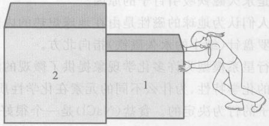

*图 8.30 当你推一个与另一个箱子相接触的箱子时，两个箱子都感受到直接的“接触”力。在图中，一个妇人推箱子 1，箱子 1 又推箱子 2。虽然箱子 2 离开妇人的手一段距离，但是当她推箱子 1 时，箱子 2 也感受到一个力，因为箱子 1 与箱子 2 是相接触的。可是如果没有箱子 1 情况会怎样？这时她还能能够从一段距离外推动箱子 2 吗？*

场是空间自身（把它与其中心可能存在的任何物质脱离关联来考虑）的状态。场在空间和时间中都能逐点变化，这点像温度和风速是空气的状态，它们在大气中会随着时间和地点发生变化……在基本粒子理论的现代理论（叫做标准模型，是一个已经被实验很好地证实的理论）中，大自然的基本组成是几十种不同的场。
——温伯格，基本粒子的“标准模型”的共同创立者

多数场都可以忽略不计。

力场这个概念可以用于每一种能够跨过真空而作用的力。本章和下一章集中讨论电磁力。就像引力场包围着每一个有质量的物体一样，电磁场包围着每一个带电的物体。在任何其他带电物体（如果有的话）感受到电磁力的地方都存在着电磁场。电磁场就是电磁力（电力或磁力或两者的）可能性。没有磁分量的电磁场叫做“电场”，“磁场”这个术语的用法与此相似。更明确地说，在任何带电物体（如果有的话）感受到电力的地方都存在着**电场**，而在任何运动的带电物体（如果有的话）感受到磁力的地方都存在着**磁场**。

力场初看之下似乎显得很抽象，但它们其实是一个简单而自然的概念。每一个有质量或带电的物体都被一个力场包围着，你看不见这个力场，但是当这个场向其他有质量或带电的物体施加力时，你就能感受到它。在一块磁铁被第二块磁铁吸引或排斥时抓住它。你正在感受第二块磁铁的磁场！

例如，一张带电的透明片在自己的周围产生一个电场，即使在透明片周围没有其他物体，这个场也存在。哪怕这张透明片孤立地存在于太空中，它仍然在自己周围空间中的每一点产生电场。磁场则存在于电流和永久磁铁周围。地球的磁场是由地球内部的电流产生的，可以用指南针在地球上或太空中探测到。

为了直观摹想场的概念，我们常用“场线”来表示场。例如，图 8.31 示出一根磁铁棒附近的磁场线。这些线是这样画的：它和施加于刚好放在这根磁铁棒附近的任何别的磁极上的磁力方向平行。图 8.32 是一个实验演示，表示磁铁棒的磁场确实具有图 8.31 所画的形状。图 8.32 是通过在磁铁棒附近撒细铁屑而得到的。细长的铁屑被磁场暂时磁化（就像铁钉被暂时磁化一样），于是，作用在这些铁屑的北极和南极上的磁力就使它们平行于磁铁棒的磁场排列。

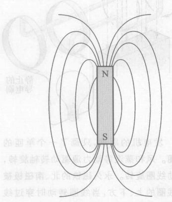

*图 8.31 磁铁棒磁场的表示*

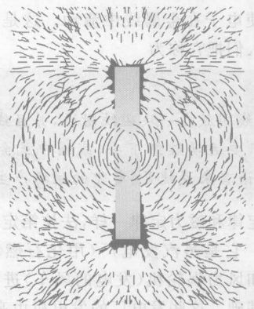

*图 8.32 一个用铁屑做的实验演示，表明磁铁棒的磁场确实具有图 8.31 所画的形状。细长的铁屑被磁场暂时磁化（就像铁钉被暂时磁化一样），作用在它们的北极和南极上的磁力于是就使这些铁屑平行于磁铁棒的磁场排列。*

在 19 世纪，许多科学家开始用场与磁场概念帮助他们理解和摹想电力与磁力。我们可以用场的语言将电力定律和磁力定律重新表述为：

**用场的语言表述的电力定律**
每个带电体的周围都有电场。而且，刚好位于有电场存在的空间一点上的任何带电体将感受到一个由这个电场引起的电力。简而言之，带电体产生电场并感受由其他物体的电场引起的力。

**用场的语言表述的磁力定律**
每个运动带电体的周围都有磁场。而且，刚好位于有磁场存在的空间一点上的任何运动带电体将感受到一个由这个磁场引起的磁力。简而言之，运动带电体产生磁场并感受由其他运动带电体的磁场引起的力。

英国物理学家法拉第是最先认真对待电磁场概念的科学家之一。他是历史上最伟大的实验物理学家之一，这部分归因于他通过场的概念来摹想电磁现象的能力。在 19 世纪中叶，他完成了涉及电磁力和电磁场的多种多样的实验。在进行这些实验的过程中，他研究了当一块磁铁靠近一个简单的圆形线圈时有什么事情发生。他发现，只要磁铁和线圈都静止，就根本不会有任何事发生。但是，当他移动线圈或磁铁中随便哪一个时，线圈中就产生电流。线圈或磁铁的运动一停下来，电流就中止了。

显然，运动的磁铁对线圈内的电子施加了一个力，即使线圈静止也如此。通过场的概念来摹想这种情况，法拉第意识到无论是运动的线圈还是运动的磁铁都会引起线圈附近的磁场发生变化，而这个变化的磁场必定在线圈的附近产生一个电场，因为得要有电场才能使电子在金属线圈中流动。这是一种新的现象。今天人们把它称为

**法拉第定律**
当一个线圈放在一块磁铁附近，并且线圈或磁铁运动时，只要运动继续下去，线圈中就会出现电流。用场的语言来说就是：变化的磁场产生电场。

像电力定律和磁力定律一样，法拉第定律有重大的社会意义。它是蒸汽发电机（用化石燃料或核燃料）、水电站和风力涡轮机（发电的风车）进行大规模电力生产的基础。这些发电厂的发电机由高压蒸汽、高压水或风带动旋转。一且有了旋转的机器，你就能利用法拉第定律发电，办法是，将多匝线圈绕在这台机器周围，让它在强力磁铁产生的磁场中旋转。每一匝线圈都产生附加的电力，于是，用这个方法就可以提供大量电能。图 8.33 中只画了一个单匝的线圈，它说明了发电的基本原理。

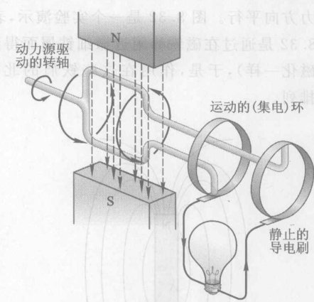

*图 8.33 发电机的原理，只画了一个单匝的矩形线圈。风和蒸汽等动力源驱动转轴旋转，转轴带动线圈旋转。永久磁铁的北、南磁极被固定在线圈的上、下方，当线圈转动时穿过线圈的磁场就会变化。这就产生出电流来，沿着线圈流动到固定在线圈上的金属“集电环”上。这个电流接着流到与运动的集电环相接触的静止的金属“电刷”上。从电刷上出来的电流接着就可以流到一个外部的用电设备（如图画中的白炽灯）中。*

> **概念检查 13** 一个质子静止在一个“真空室”（一个抽空了所有物质的盒子）的中央。考虑盒子中一个角落附近的某点 X。忽略除了这个质子之外的其他影响。那么在 X 点存在 (a) 一个电场；(b) 一个电力；(c) 一个磁场；(d) 一个磁力；(e) 上述答案都不对，因为 X 点没有任何东西。

> **概念检查 14** 在上题中，假设让质子前后摆动。那么在 X 点存在 (a) 一个电场；(b) 一个电力；(c) 一个磁场；(d) 一个磁力；(e) 上述答案都不对，因为 X 点没有任何东西。

> **概念检查 15** 假设一个质子像概念检查 13 中一样静止在一个真空室的中央，而一个电子静止在盒子中一个角落附近的 X 点。那么这个电子会 (a) 感受到一个由质子产生的电场引起的电力；(b) 感受到一个由质子产生的磁场引起的磁力；(c) 感受不到任何电磁力。

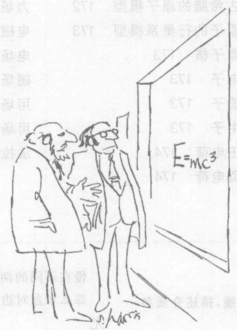

*“这些天什么东西都上涨。”*

---

> **概念检查答案**
> 1. (a)和(b)。
> 2. (c)。
> 3. (c)。如果两个波都朝下，答案是(d)。
> 4. 见图 8.14 中各个标有 X 和 O 的点。
> 5. (a)。
> 6. (d)。
> 7. (a) 和 (d)。
> 8. (c)。
> 9. (b)。
> 10. 最小的质量 (b)，最大的质量 (e)。
> 11. (a), (b), (c) 和 (e)。
> 12. (d)。
> 13. 在 X 点没有物体感受到任何力。但是，如果有一个带电体处于 X 点，它将感受到一个电力而不是磁力，答案是 (a)。
> 14. (a) 和 (c)。
> 15. (a)。

---

### 关键概念

下述概念的定义出现在所标页码的本书正文页面上和书末的按拼音排序的术语词汇中。我们将它们按出现先后顺序排列在这里，你可以用这个清单复习本章内容。

*   介质 163
*   波 163
*   波长 163
*   频率 163
*   赫兹 163
*   振幅 163
*   波速 163
*   波的干涉 164
*   相消干涉 164
*   相长干涉 164
*   光的双缝实验 168
*   电力 170
*   带电体 170
*   电力定律 171
*   磁极 171
*   磁力 171
*   磁力定律 172
*   电磁力 172
*   古希腊的原子模型 172
*   原子的行星系模型 173
*   原子核 173
*   电子 173
*   质子 173
*   中子 173
*   正电荷 174
*   负电荷 174
*   离子 174
*   电流 176
*   元素 177
*   原子序数 177
*   力场 178
*   引力场 178
*   电磁场 179
*   电场 179
*   磁场 179
*   用场的语言表述的电力定律 180
*   用场的语言表述的磁力定律 180
*   法拉第定律 180

### 复习题

**波**

1.  一个波沿着绳子、螺线管或水面传播，描述介质各部分的运动。
2.  波动与实物物体的运动有何不同之处？
3.  赫[兹]是什么单位？
4.  两个波 A 和 B 有相同的波速，但 A 的波长较长。哪一个有较高的频率，或者它们的频率相同？
5.  选出正确的答案（可以不止一个）：可以预期，池塘面上两个不同的连续波具有大致相同的（波速、波长、频率、能量、幅度、上述量都不相同）。

**干涉**

6.  两个连续的水波，每个的波幅是 2 cm。在以下情况下，水面的位移是多少？(a) 当波峰与波谷相会时；(b) 当波峰与波峰相会时；(c) 当波谷与波谷相会时。
7.  就以下情况各举一例：(a) 一维介质；(b) 二维介质；(c) 三维介质。
8.  用一个手指在一个长方形水盆的一边轻叩水面。描述涌向水盆对边的波。如果你接着以同样的快慢在不同的两点处轻叩水面（每点用一个手指），那么水盆对边的波形将如何变化？

**光**

9.  描述支持光是一种波的实验证据。
10. 如果图 8.18 中的一条缝被关闭，屏上的图样将如何变化？
11. 我们怎么知道传播光波的介质不是空气？

**电力和磁力**

12. 用薄纸摩擦两张透明片并使它们靠近，它们将会分开。给出两个理由说明产生这个现象的力不可能是万有引力。
13. 列出支持有两种而且只有两种电荷的证据。
14. 给出两个理由说明磁铁棒之间的力不可能是电力。
15. 电流是什么意思？
16. 磁力总是由哪种物体产生的？

**原子的行星系模型**

17. 列出几种要用原子模型而不能用古希腊原子模型解释的现象。
18. 说出三种在原子中发现的亚原子粒子的名称并对它们作简单描述。
19. 给出支持原子的大部分质量集中在原子中心处的一个极小的核内的证据。
20. 说明当电池在导线内产生一个电流时，导线内部在微观层级上发生了什么事情。
21. 原子序数是什么？它与化学元素有什么关系？

**力场**

22. 说出两种力场的名称。
23. 静止的带电体可以感受哪种力场：引力场，电场，还是磁场？运动的不带电体呢？运动的带电体呢？
24. 说这个房间里到处存在着一个电场是什么意思？
25. 法拉第定律对磁铁和导线说了些什么？它对磁场和电场又说了些什么？

### 思考题

**波**

1.  山泉下泻是波动的例子吗？说出你的回答的理由。
2.  一阵风吹过麦田，荡起一片麦浪。这个麦浪是波吗？如果不是，为什么？如果是，那么介质是什么？
3.  沿着一条绳子或一个螺线管送出一个短暂的波，它最终会消失。能量到哪里去了？
4.  一个软木塞浮在水面，水波从它那儿经过。软木塞会发生什么情况？软木塞的振动频率与水波的频率有关吗？如果有，是各样的关系？
5.  大多数波有固定的波速，由波在其中传播的介质的性质决定。“运动波”有固定的、事先确定的波速吗？为什么？

**干涉**

6.  图 8.34 所示的两个波正沿着一根弦相向运动。画出这两个波发生干涉期间的情形。
7.  假设图 8.12 中的波的频率为 1 Hz。描述半秒后（图中快照拍下之后半秒）和 1 s 后水面的样子。
8.  图 8.9 的三幅图中的第二幅所示的两个波发生相消干涉时，两个波的能量发生什么情况？能量消失了吗？（提示：波传播时绳子的各部分在做什么？波携带什么形式的能量？）
9.  两个小水波源发出圆形波。每个波源产生波幅为 1.5 cm 的波。在波峰与波峰相会处水面的高度（相对于未受扰动的水面）是多少？在波谷与波谷相会处呢？在波谷与波峰相会处呢？

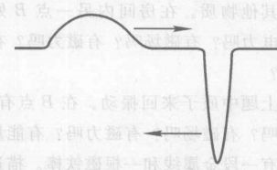

*图 8.34 这两个波将怎样干涉？*

**光**

10. 有什么办法从月亮传到地球上吗？加以解释。
11. 你怎么知道光不是从你的眼睛发出的某种东西？
12. 用两支手电筒照射一面墙壁，为什么看不到干涉图样？
13. 以下物体在正常工作时，哪些是发光的（光源）：照相机、抛光的镀铬面、萤火虫、电炉的加热元件、照相机的闪光灯、镜子、钻石、太阳、月亮？
14. 光能通过真空传播吗？为你的答案列举证据。
15. 如果你在月亮上燃放一个爆竹，你会听到爆炸声吗？你会看到爆炸的闪光吗？（注意：月亮上没有空气）。
16. 波长为 $1 \mu \text{m} \ (1 \mu \text{m} = 1/1 000 000 \text{ m})$ 的红光从交通灯处射到你的眼睛里，距离为 10 m。这段距离内含有多少个波长？
17. 作出估计：估计 1 mm 范围内光的波长的数目。

**电力和磁力**

18. 假设你用一张薄纸包住一张透明片而使两者都带电，然后将它们分开几米并前后抖动。说出它们相互作用力的名称。
19. 既然物质由带电粒子构成，为什么我们和周围的物体一直没有感受到电力？
20. 当你从存衣袋中取出毛料衣服时，存衣袋的两面可能会把衣服贴住。解释这个现象。
21. 图 8.35 中是一个验电器。它的叶片（由金属箔做成）通常下垂，但是当顶部的金属球接触带电体时它们就张开。解释这个现象。
22. 验电器的操作（上题）怎样演示了电流的存在？

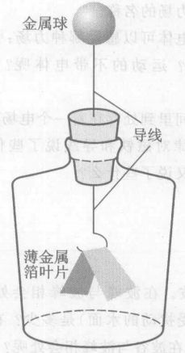

*图 8.35 叶片为什么张开？*

23. 你有三根铁棒，其中只有两根是永久磁铁。由于暂时磁化（第 8.7 节），所有三根棒乍一看都显得有磁性。不用任何其他物体，你怎样确定哪一根不是磁铁？
24. 假设你有两根铁棒（见上题），一根是磁化的，另一根没有磁化。不用任何其他物体，你能确定哪一根是磁铁吗？
25. 把碎纸屑放在两块带异性电的金属平板（一块板带正电，另一块板带负电）之间，它们就在平板之间跳动。解释这个现象。
26. 卡车行驶时可能会带电。这是怎样发生的？这种带电是危险的，特别是对于油罐车。怎样避免这种危险？

**原子的行星系模型**

27. 用刷子轻擦头发时，你会发现头发倾向于相互分开并被吸向刷子。用微观的语言解释这个现象。
28. 桌上放着一个盖着的神秘鞋盒。不直接接触它或举起它，你有哪些方法可以知道有关盒子里的东西的一些情况？
29. 在你走过地毯而把电子从地毯上擦下来之后，你是带正电还是带负电？
30. 根据图 8.24，碳和氢的原子序数是多少？碳原子的质量大致比氢原子大多少？
31. 一些科幻小说把原子描绘成真正的微型太阳系，居住着极小生物。除了大小不同之外，我们的太阳系与一个原子的行星系模型之间还有哪些不同？
32. 一个原子失去两个最外层的电子。所生成的离子靠近一张带正电的透明片时，其行为怎样？靠近带负电的薄纸呢？
33. 在上题中，如果原子只失去一个电子，结果会有什么不同吗？
34. **作出估计**。一张纸的厚度大约有多少个原子？
35. **作出估计**。一个原子和光的一个波长相比，哪一个更大？大约大多少倍？

**力场**

36. 你家中的电路产生磁场吗？提出一个可以检验你的答案的测量方法。
37. 电场是物质的一种形式吗？加以解释。万有引力场呢？
38. 如果你把一个质子放在电场中某一点然后放开它，会出现什么现象？这个质子的运动与放在同一电场中同一点的电子的运动有什么不同？如果这个场是万有引力场而不是电场，情况会怎样？
39. 一个质子在房间内某点 A 处静止不动，房间内没有任何其他物质。在房间内另一点 B 处有电场吗？有电力吗？有磁场吗？有磁力吗？在 B 点有能量吗？
40. 假定在上题中质子来回振动。在 B 点有电场吗？有电力吗？有磁场吗？有磁力吗？有能量吗？
41. 假定你有一段金属线和一根磁铁棒。描述两种能够产生电流的方法。这其中包含哪些物理定律。

### 习题

**波**

*(有几个问题需要用到脚注 1 中给出的公式)*

1.  如果把一个波的波长加倍，但不改变其波速，那么频率会发生什么改变？如果把波长减半呢？
2.  一般的调幅无线电波的波长大约与足球场的长度相同，而一般的调频无线电波的波长大约是 1 m。哪一种波的频率更高（更大）？如果一个调幅波的波长是调频无线电波波长的 100 倍，那么它们的频率比会是多少？
3.  玛丽把一根长绳子的一端系在墙上，以每秒 4 次的固定速率抖动另一端，使一个波沿着绳子发出去（图 8.5）。如果波长是 1.5 m，求波速。
4.  在上题中，如果玛丽减慢到每秒抖动 2 次，假定波速不变，求新的波长。
5.  你注意到每 3 s 有一个波滚涌过你静止的小船，而你估计计两个波浪之间的距离是 15 m。这些波浪的频率是多少？
6.  在上题中，这些波的运动有多快？
7.  汤姆用手指轻叩池面，以 3 Hz 的频率发出波。如果波速为 2 m/s，求这些波的波长。
8.  在上题中假设汤姆把叩击频率增加到 4 Hz。假定波速不变，求新的波长。
9.  无线电波以光速 ($3 \times 10^8$ m/s) 传播。求频率为 100 MHz (1 MHz = $10^6$ Hz) 的调频无线电波的波长。
10. 求频率为 1 000 kHz (1 kHz = $10^3$ Hz) 的调幅无线电波的波长。

**电力**

*(以下问题需要用到脚注 5 给出的公式)*

11. 两个带电的小物体相隔 8 cm，它们相互对向施加一个电力 F。为了相互向对方施加 F/4 的力，两个物体必须相隔多远？
12. 参考上题，为了相互向对方施加 4F 的力，两个物体需要相隔多远？
13. 两个带电的小物体相隔一定距离，它们相互向对方施加一个 4 N 的电力。假定第一个物体的电荷量加倍，力有什么变化？如果两个物体的电荷量都加倍，情况又怎样？
14. 两个带电的小物体相隔一定距离，它们相互向对方施加一个 4 N 的电力。假定第一个物体的电荷量减半，力有什么变化？如果两个物体的电荷量都减半，情况又怎样？
15. 两个各自带有电荷量 $q$ 的小物体相隔一定距离，每个物体对另一个物体产生一个电力 $F$。假定第一个物体的电荷量的一半转移到了第二个物体上。力有什么变化？
16. 相隔一定距离的两个氢原子核之间的电力与相隔同样距离的两个氘原子核之间的力相比如何？
17. 相隔一定距离的氘原子核和氦原子核之间的电力与相隔同样距离的两个氘原子核之间的力相比如何？
18. 相隔一定距离的两个氦原子核之间的电力与相隔两倍距离的两个氦原子核之间的力相比如何？