# 第 9 章 电磁辐射与全球气候变化

> 总有一天，我们必须认识到：我们是同一艘小小的太空船上的乘客，依赖着它对空气和土壤的脆弱的供应。
> ——史蒂文森，民主党 1952 年和 1956 年总统候选人

本章继续探讨对光的了解。我们在第 8 章得知，光必定是一种波，因为它显示了干涉效应。接着我们考察了一种新的力：电磁力，并引入了力场这个关键的概念，包括引力场和电磁场。下面我们将看一看电磁力及电磁场与光到底有什么关系。

第 9.1 节用电磁场解释光。第 9.2 节探讨场到底是不是真实的物理实体，并考察它对牛顿宇宙观的含义。光的电磁理论导致对其他几种与光相似的“辐射”的了解，这些辐射在第 9.3 节中加以解释。第 9.4 节研究来自太阳的辐射。第 9.5、第 9.6 节利用对电磁辐射的这种了解讨论人类对大气层的改变如何导致全球臭氧枯竭和全球变暖。

## 9.1 光的电磁波理论

假设你用一把橡胶梳子梳理头发而使电子从你的头发转移到梳子上。这把带电的梳子就在周围的空间产生一个电场，这个电场可以通过一把摩擦过的透明片拿近这把梳子而被检测出来。

如果你将这把梳子快速地上下摇动一次，周围空间中的电场也将摇动。这可以通过透明片随着梳子的运动而摇动被探测到。梳子在运动的短暂时间内也产生一个磁场。这个暂时的磁场可以通过放在梳子附近的磁铁的短暂摇动而被检测出。总之，梳子的运动引起周围电磁场的变化，这个变化可以用其他带电体和磁铁探测到（图 9.1）。关于这个实验有一个令人感兴趣的问题，这是一个 19 世纪科学家提出过的问题：一个远处的探测器将在什么时候感觉到场的变化？这个作用是即时的吗？假设你精确地在中午 12 点整摇动梳子，透明片也正好在中午 12 点整摇动吗？还是稍晚一些？

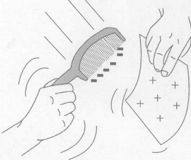

*图 9.1 如果你摇动像带电的梳子这样的带电物体，另一个带电物体也随之摇动。*

在 19 世纪 60 年代，英国物理学家麦克斯韦（图 9.2）对电磁现象做了深入的思考，把当时关于这个问题的所有知识整理成一个单一的理论。麦克斯韦的理论强调了场的概念，并描述了带电体是怎样产生电磁场的。那时已经知道有关电磁力的三条基本原理。用场的语言来表述，它们是：电力定律（带电体产生电场）、磁力定律（运动的带电体产生磁场）和法拉第定律（磁场的任何变化必定产生一个电场）。

像大多数理论物理学家那样，麦克斯韦相信，一个对大自然的正确的和根本的描述应该是简洁的、和谐的和对称的，或者用一个词来概括，是美的。他觉得，电磁定律应该以对称的方式讨论它的两个侧面：电现象和磁现象。在这方面，三条基本定律（电力定律、磁力定律和法拉第定律）似乎缺了点什么。这些定律中的头两条说，电场由电荷产生，磁场由运动的带电体产生。法拉第定律则说，电场可以通过第二种方式，即通过变化的磁场产生。在麦克斯韦看来，还应该存在第四条定律，这条定律应该是对法拉第定律的补充，提供产生磁场的第二种方法。这条第四定律应该与法拉第定律对称，换句话说，它应该这样陈述：磁场可以通过变化的电场产生。于是，这个理论将以对称的方式处理电场和磁场：一个场的改变总产生另一个场。当与另外三条定律结合起来后，麦克斯韦的发现导致了通常所说的“电磁波”（见后）的存在，并预言了光就是一种电磁波。这个预言如今已经得到充分证实，它显示出理论推理的巨大威力。我们再一次看到科学中对美和对称的重视。

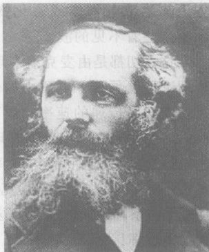

*图 9.2 麦克斯韦，“电磁学的牛顿”。他把电学和磁学的原理概括成四个方程的方程组的形式。这些方程包括由电荷和电流产生电场和磁场。麦克斯韦方程组还有一项，是与其为了增强理论的对称性——理论的美——而加入的。他的理论导致电力与磁力的统一和对电磁辐射的预言，而电磁辐射是许多现代技术包括无线电、电视和激光的基础。*

麦克斯韦以精确的数学语言表述的理论预言了电磁力的时间延迟。关键的因素是一个场的变化产生另一个场。这意味着电场和磁场能够相互产生和再生。麦克斯韦理论给出的结论是，空间一点的场一旦发生变化——例如把一把带电的梳子摇一下，这个变化向外传送，使邻近的场在稍后一个时间发生变化，而这些变化了的场又把这个变化向外送出更远，如此等等。由此可知，电力与磁力并不是瞬时传送的。

麦克斯韦的分析表明，如果你在某一点扰动电磁场，这个扰动将通过场向外传递。这正好就是我们在第 8 章里所说的“波动”那种行为。不过这种新的波不是在水那样的实物介质（由实物构成的介质）中的波。相反，介质就是电磁场本身。任何这样通过电磁场传递的扰动叫做**电磁波**。你不能像看见水波那样直接看见电磁波，因为电磁波的介质是非实物的电磁场而不是像水那样的实物。尽管如此，电磁波还是可以在波发出之后的稍晚时刻与波源相隔一段距离的地方用其他带电物体或磁化物体检测到。图 9.3 演示求学期间，你拿一把带电的梳子摇动一下，发出这些看不见的波。

这一切都是由麦克斯韦理论定量推出的。这个理论不仅预言了电磁力的传递一定有延迟，而且还预言了传递的速率。预言的速率为 300 000 km/s。早在麦克斯韦创立其理论之前两个世纪做的实验中，这个特定的速率就已经出现了。但是这些早先的实验似乎与麦克斯韦所研究的电磁效应毫无关系。300 000 km/s 这个速率是已知的**光**传播的速率！

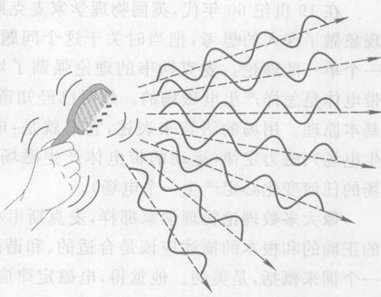

*图 9.3 当你来回摇动一个带电体时，它就向四面八方发出电磁波。这种看不见的波是由带电体产生的电磁场的扰动。*

**我们怎么知道光的速率？** 人们一度认为光不需要传播时间。当然，光传播比声音快得多，你总是先听到雷声之前先看见闪电，就可以证明这一点。伽利略是最早尝试测量光速的人之一，方法是测量光传播到远处山岭后返回的总往返时间。由于这段时间太短，用伽利略的计时方法测量不出来，因此，他的实验没有成功。需要的要么是较高的计时精度，要么是较长的传播距离。

光速有限而非无穷大的第一个证据来自几十年后的天文观测。把望远镜指向木星的一个卫星，天文学家发现他们测得的这个卫星绕木星一周的时间并不保持恒定。这真是不可思议。为什么一个卫星的某几次绕行要比别的几次绕行花更长的时间？月亮绕地球一周每次都是 27.3 天。天文学家发现这些变化根本不是木星的卫星所引起的，而是与地球绕太阳的运动有关。如果来自木星卫星的光以有限的而非无穷大的速率传播，那么绕行时间的这种变化正是人们应该预期的（解释见图 9.4）。根据测得的绕行时间的变化，可以估计出光速。

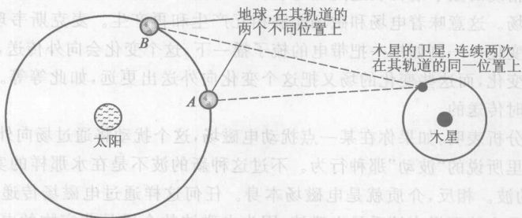

*图 9.4 光从木星的卫星传到 A 点需要大约 35 分钟，传到 B 点需要大约 43 分钟。因此，如果地球从 A 点运动到 B 点，木星的卫星正运行好绕木星一周，那么在地球上测得的绕行周期将比实际周期长 8 分钟，因为光传到 B 点多用 8 分钟。这个效应造成测得的周期发生变化，这个变化可以通过假设光速有限而非无穷大来解释。*

既然麦克斯韦理论预言了电磁波以光速传播，于是麦克斯韦假设光也许实际上就是一种电磁波。但是科学家们不知道用什么办法去证实这个诱人的想法，直到 20 年之后，通过使带电体振荡并在一段距离之外观察其效应，能够直接检验麦克斯韦理论。

**我们怎么知道电磁波存在？** 证实麦克斯韦理论的一个方法是以可见光的频率（约 1000 万亿赫）摇动一个带电体，看看这种抖动是否产生光。你很难这样快速地摇动你的手！即使在今天也难以达到这样高的频率。德国物理学家 H. 赫兹（频率单位赫兹 [Hz] 就是以他的名字命名的）想到了做这种实验的方法，但频率“只有”大约 10 亿赫。他组装了一个电路，这个电路包括一个微小的断开的间隔即空气间隙。在通常情况下，这样一个空隙会阻止电荷流动，但是赫兹采用了一种方法，使这个空隙的两端能够积聚大量电荷（一端有过量的电子，另一端有过量的质子）。积聚了足够多的电荷之后，电子就被迫跳过空隙，我们观测到以火花形式出现的这种电荷跳跃。闪电就是这种火花。在赫兹的电路中，电荷的一次跳跃引发了短暂的一系列这种越过空隙的往复跳跃，快慢大约为每秒 10 亿次。如果麦克斯韦是正确的，这些振荡应该产生频率为 10 亿赫的电磁波。

在离这个预言的电磁波源一定距离处，赫兹放置了第二个电路。这个电路完全是无源的，不带电池或其他内部电源。如果麦克斯韦理论是正确的，来自第一个电路的电磁波应该在第二个电路中产生振荡的电流，频率也是 10 亿赫。从一个电路到另一个电路的传送应该以光速进行。赫兹的实验结果完全证实了这些预言。尽管赫兹的波不是光波，但是他的工作却使科学家们确信电磁波确实存在，而光实际上是一种电磁波。作为一个副产品，赫兹的工作引起了天才的意大利发明家马可尼的注意，掀起了无线电和电视的革命。所有我们知道赫兹的波就是无线电波。

这是一个非常漂亮的统一：麦克斯韦理论正确地描述了电、磁、光和无线电。所有这些都是一个基本实体——电荷的不同的宣示。我们把这些观念小结如下：

> **光的电磁波理论**
> 每个振动的带电体在自己的电磁场中产生一个扰动（波）。这个扰动以光速 300 000 km/s 通过电磁场向外传播。光就是这样一种电磁波。②

> **概念检查 1** 假设你用梳子梳头使梳子带电，然后以 1 Hz 的频率前后摇动这把梳子。这将产生 (a) 一个频率为 1 Hz、传播速率为 300 000 km/s 的声波；(b) 一个波长为 300 000 km、传播速率为 300 000 km/s 的声波；(c) 一个以 1 Hz 的频率振动的电磁场，但没有电磁波；(d) 一个频率为 1 Hz、传播速率为 300 000 km/s 的电磁波。

> **概念检查 2** 赫兹波的频率为 $10^9$ Hz。一台普通的家用收音机能够接收这种类型和频率的波吗？(a) 不能，因为收音机仅能接收声波，而赫兹产生电磁波；(b) 不能，因为这些波既不在调幅收音机的频段内，也不在调频收音机的频段内；(c) 能够，这些波能够被调幅收音机接收；(d) 能够，这些波能够被调频收音机接收。

*② 更精确地说，光和所有的电磁波在真空中的速率是 299 792.458 km/s。然而在实物中传播时，由于光被原子不断地吸收和再发射，所以速率要小一些。*

**作出估计** 灯光从你房间里的白炽灯到你的眼睛大约要花多长时间？③

## 9.2 牛顿宇宙观的衰落

自从古希腊时代以来，科学家普遍认为宇宙是由极微小的实物粒子即原子构成。就像德谟克利特所说的，只有原子和虚空（第 2 章）。这是一个与牛顿物理学非常合拍的观念，牛顿物理学曾经一度被看作原子运动遵循的法则。这个宇宙观——原子唯物论与牛顿物理学的结合——在 18、19 世纪在科学界占统治地位（第 5.5 节）。

在 1830 年前后电磁场被首次提出时，它只不过被看作是描述电力的一种有用的方法，而不是真正的物理实在。后来麦克斯韦和赫兹证明了波能够在电磁场中传播，而且光就是这些电磁波的一个例子。这意味着电磁场不仅仅是一个有用的虚构。它们是物理实在，像光一样实在。

电磁场的实在性的最有说服力的证据来自能量守恒。假设一台无线电发射机向火星上的一台接收机发出一个信息（电磁波），这个信息的传播时间是 20 分钟。由于使接收机产生响应必须要能量，因此一定有能量从发射机传递到接收机。在发送信息与接收信息之间的这 20 分钟内，这个能量在什么地方？既不在发射机里，也不在接收机里，然而能量决不会就这样消失。因此，它一定在发射机与接收机之间的空间里，也就是在电磁场中。

因此，电磁场含有能量。对一个物理学家来说，没有什么东西是比能量更为实在的了。“虚空”是一个用词矛盾的说法。即使在完全没有物质空间，空间也不是空的。宇宙中充满着浩渺的物理实在的然而却看不见的场，这些场是平滑变化的和连续的，并不由微小的粒子构成。

物理学家不情愿放弃牛顿的钟表式宇宙。牛顿宇宙观是如此根深蒂固，以致科学家们无法想象能量可以脱离微小的实物粒子而存在。他们发展了一种观念：有一种极轻的像气体似的物质材料，叫做**以太**，充满整个空间。以太被设想成是一种物质形式，但是由某种未知的材料而不是由我们熟悉的原子构成的。人们假设电磁力和由于超距离作用力是由以太传递的。于是，光和其他电磁波就可以用以太物质的运动从力学的角度加以解释，从而与牛顿传统保持一致。麦克斯韦、赫兹和其他人都接受了这个电磁力的以太理论。在牛顿宇宙观主宰了两个世纪之后，人们难以用任何别的方式思考。

20 世纪初，爱因斯坦是最早突破这种模式的人之一。他指出必须抛弃以太理论（第 10 章）。然而令人惊奇的是，这对麦克斯韦理论或无线电波解释成电磁波并没有影响。它仅仅影响作为基础的对电磁场的力学解释。有了爱因斯坦之后，电磁场可以不再被解释成是物质材料的属性了。于是，电磁场概念的提出成了哲学上的一次革命，是许多后牛顿物理学概念中的第一个。显然，宇宙并不是完全由原子构成，它并不像一具机械的钟表。还有一些别的东西，那就是场。

虽然牛顿宇宙观仍然主宰着许多大众文化，甚至在幕后主宰着许多科学家对自然的直观看法，但是在 1900 年前后，力学的宇宙观开始崩溃了。今天，这个观念与当代物理学已极不协调。两个主要的后牛顿物理学理论，即相对论和量子理论，都与牛顿物理学的具体预言和概念基础相矛盾。物理学仍然处于后牛顿革命之中，还不清楚会出现什么样的新的科学宇宙观。

*③ 光的传播时间等于眼睛到灯的距离除以光速 $3 \times 10^8$ m/s。为了易于计算（记住在估计中要选择易于计算的近似值），假定距离是 3 m，则有：$3 \text{ m} / (3 \times 10^8 \text{ m/s}) = 10^{-8} \text{ s}$，即百分之一微秒。*

> 法国物理学家居里里 1894 年提出，如果在大自然中除了电荷之外还存在一种叫做“磁单极子”的纯“磁荷”，那么麦克斯韦的四条定律所展现的电学与磁学之间的对称性就是完整的了。观测过的每一块磁铁都有南北两极。你不能把这一极从那一极孤立出来。一个磁单极子核子应该是一个纯北极或纯南极的磁极，即使它静止不动也会产生磁场。尽管过去从未没有通过磁单极子，但是理论家们一直没有放弃过这个想法。今天，探索基本粒子的“大统一理论”（第 18 章）的理论家们认为，磁单极子是存在的，或至少在大爆炸的早期阶段一度存在过。

## 9.3 完整的波谱

光的频率处于 $10^{15}$ Hz 附近一个狭窄的范围内。我们已经知道赫兹产生的电磁波（现在叫做无线电波）的频率在 $10^9$ Hz 左右。它们只是现已知道的电磁波的庞大家族群中的两个例子，我们把这整个族群统称为**电磁波谱**（图 9.5）。在这个图中，波长按照从底底部最长到顶顶部最短的顺序排列，并列出尺寸与波长相同的典型物体以资比较。频率按照从底部最低（最小）到顶部最高的顺序排列，并列出这些频率的典型波源。为了能够表示出很大的范围，图 9.5 中的波长和频率采用所谓“对数尺度”表出，这种尺度中每一格的增量是 10 的幂次：即 1, 10, 100, 1 000, 等等。“线性尺度”（如 10, 20, 30, 40, 等等）是不能适当地表示出整个范围的。

所有这些波基本上都是同一种现象，也就是由振动的带电体产生的一种电磁场扰动，这些扰动以光速穿过电磁场向外传播。所有这些波都能被其他带电体接收，当电磁波经过这些带电体时，电磁波会使它们运动。所有的电磁波都能穿越真空传播。它们全都携带能量。电磁波的能量叫做**辐射能**。例如，从太阳传送到地球的能量就是辐射能。电磁波常常被称为**电磁辐射**，因为它们从带电体“辐射”出来。由于较高的频率意味着较高的能量（倘若其他量如波幅不变），随着我们沿上述尺度从底部向顶部攀升，能量也随之增加。

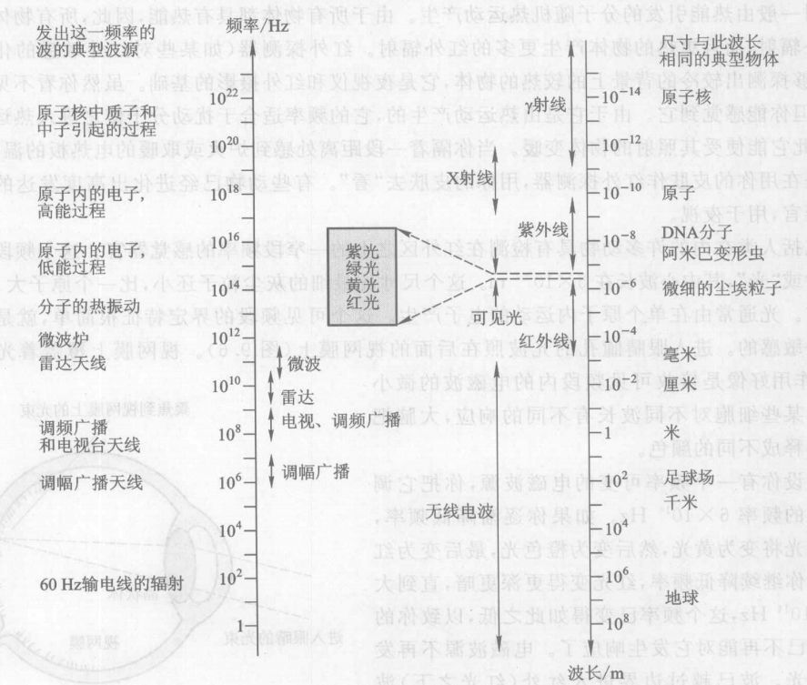

*图 9.5 电磁波谱。波谱没有确切的起点和终点，各个波段之间也没有清晰的边界。*
*(图注：图表展示了无线电波、微波、红外线、可见光、紫外线、X射线、伽马射线的频率和波长范围，并对比了实物尺寸如足球场、微缩尘埃粒子、原子核等)*

让我们对电磁波谱做一番巡视。把电磁波谱分成图 9.5 所示的 6 个波段是有好处的，不同波段对应于不同的发送或接收电磁辐射的方式。波长大于约 1 mm 为止的最长的波长范围组成**无线电波**，包括调幅 (AM) 和调频 (FM) 无线电波、电视波和微波。通过让电子在人造的电路中振荡，人们可以用电子学方法产生和控制这些波。赫兹波及大量现代技术所用的波都属于这一类。调幅广播电波的频率在 1 000 千赫 ($10^6$ Hz) 左右，调频广播电波和电视波的频率在 100 兆赫 ($10^8$ Hz) 左右，它们是由电子沿着电路中的金属天线往复运动产生的。频率高达 1 万亿赫兹 ($10^{12}$ Hz) 的雷达波和微波也是用电子学方法产生的。

许多自然过程也产生无线电波。射电天文学家利用恒星或其他天体的射电接收器（也叫做射电望远镜）研究宇宙。事实上，天体产生电磁波谱中所有波段的电磁辐射。在过去几十年中，安置在地面或地球上空的许多新型接收器已经引起了天文知识爆炸。

**红外辐射**的波长范围由 1 mm 到 1/1 000 mm 以下（相当于婴儿奶粉微细颗粒的尺寸）。红外辐射一般由热能引发的分子随机热运动产生。由于所有物体都具有热能，因此，所有物体都产生红外辐射，而且更热的物体产生更多的红外辐射。红外探测器（如某些对红外敏感的化学药品）能够探测出较冷的背景上的较热的物体，它是夜视仪和红外摄影的基础。虽然你看不见红外辐射，但你能感觉它。由于它是由热运动产生的，它的频率适合于扰动分子使之进入热运动状态，因此它能使受其照射的物体变暖。当你隔着一段距离处感到炉火或取暖的电热板的温暖时，你就是在用你的皮肤作红外探测器，用你的皮肤去“看”。有些动物已经进化出高度发达的红外感觉器官，用于夜视。

包括人类在内的许多动物具有检测在红外区之上的一窄段频率的感觉器官。这个频段是**可见辐射**或“光”，其中波长在 $5 \times 10^{-7}$ m。这个尺寸比最细的灰尘粒子还小，比一个原子大 5 000 倍左右。光通常由在单个原子内运动的电子产生。这个可见频段的界定特征很简单，就是人眼对它是敏感的。进入眼睛瞳孔的光波照在后面的视网膜上（图 9.6）。视网膜上覆盖着光敏细胞，其作用好像是接收可见频段内的电磁波的微小天线。某些细胞对不同波长有不同的响应，大脑把这些解释成不同的颜色。

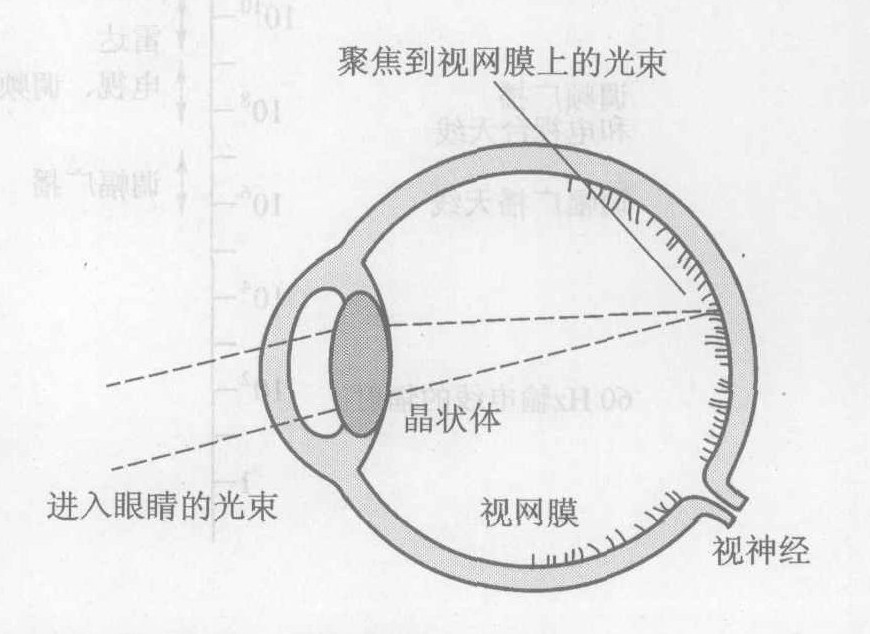

*图 9.6 人眼*

假设你有一个频率可变的电磁波源，你把它调到绿光的频率 $6 \times 10^{14}$ Hz。如果你逐渐降低频率，这个绿光将变为黄光，然后变为橙色光，最后变为红光。当你继续降低频率，红光变得更深更暗，直到大约 $4 \times 10^{14}$ Hz，这个频率已变得如此之低，以致你的视网膜已不能对它发生响应了。电磁波源不再发射可见光。波已越过边界进入红外（红光之下）波段。电磁波源仍在辐射，但是你的眼睛探测不到它。

现在向另一方向调。从 $6 \times 10^{14}$ Hz 出发，升高频率。光的颜色由绿变蓝再变紫。紫光变暗，直到大约 $8 \times 10^{14}$ Hz，你的眼睛不再能探测到它。波已进入**紫外区**（紫光的上方）。产生紫外辐射的途径与产生可见光的途径相同，都由在单个原子内运动的电子产生。虽然紫外辐射与光相似，但它较高的能量有重要的后果。紫外辐射的频率适合于使分子分解成原子（大约 300 nm）。许多生物分子产生振动，因此它容易被生物吸收。而且它的能量足以使分子破裂，这能破坏或杀死活细胞。紫外辐射如果被一个细胞的 DNA 吸收，若此细胞对其自身进行大量复制，就能导致癌变。

**X 射线辐射**也由单个原子内的电子产生，不过只来自原子内最高能量的电子活动。X 射线的波长在 $10^{-10}$ m（大致是单个原子的大小尺寸）附近的一个范围内。我们在高能 X 射线管内产生 X 射线，请看图 9.7 的图题说明。X 射线与生物物质有重要的相互作用。它们有足够的能量使生物细胞内的分子电离，也就是说，把电子从某些分子中打出来。与紫外线相似，这种辐射能引起癌症。能量足以使生物物质电离的辐射叫做**致电离辐射**。X 射线和 $\gamma$ 射线都是致电离辐射，紫外波段能量较高（频率较高）的部分也是致电离辐射。因为 X 射线能够深深穿透生物物质，所以它可用来检查人体内部而不必动外科手术。

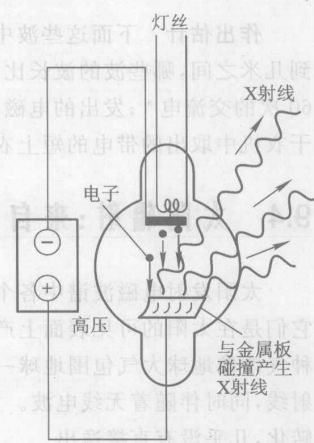

*图 9.7 X 射线管的示意图。电子从加热的细金属灯丝中蒸发出来，朝着真空管另一端带正电的金属板加速运动。当电子撞击这块板时，迅速减速并发射出 X 射线，碰撞也使金属板中的原子发出 X 射线。*

我们对电磁波谱的巡视是按照一定的规律进行的。随着我们审视的波长越来越短，我们就在向更高的频率前进，这意味着能量更高的辐射，要产生这种辐射就需要更高能量的过程。我们也于在朝着越来越小的空间区域内发生的过程前进：无线电波在宏观电路中产生；红外辐射在分子中产生；接下来 3 种辐射（可见光、紫外辐射和 X 射线）在原子中产生。

于是就不奇怪，波长最短的辐射即 **$\gamma$ 辐射**具有最高的频率和最高的能量，并由在最小的空间区域内发生的最高能量的过程产生。$\gamma$ 射线由把原子核结合在一起的强作用力引发的高能核过程在原子核内产生。$\gamma$ 射线在放射性物质中（第 15 章）以及叫做“裂变”和“聚变”（第 16 章）的核反应中产生。与 X 射线一样，$\gamma$ 射线是一种致电离辐射，能够伤害生物物质。正是这个特点使它常被用来摧毁发生病变的细胞从而治疗某些癌症。由于 $\gamma$ 射线的波长比单个原子小得多，原子不容易对它们产生响应，因此它们能够穿透到物质中很深的地方。

你所在的房间充满了电磁波。数以百计的电视和无线电广播信号、来自电子星的射电脉冲、来自几百万颗正常恒星的射电噪声、源于大爆炸的微弱的背景辐射、可能来自地外生命的通信信号、来自太阳和银河系中心的辐射以及其他多种多样的辐射此时此刻正在穿过你的房间。你的身体只具备直接接收这些波谱中微小的可见部分的能力。用适当的接收器，你能够检测到其他任何频率。在别的波段上，宇宙将显得很不样，如果我们能够直接接收整个波谱，那
么，宇宙就会显得非常复杂。眼睛看到的实在只是整个自然界的微小部分。

> **概念检查 3** 当你的收音机调谐到 FM 刻度盘上的 100 时，它正在接收 (a) 频率为 100 Hz 的声波；(b) 频率为 $10^8$ Hz 的声波；(c) 波长大约等于地球的直径、频率为 100 Hz 的电磁波；(d) 波长大约为 100 m、频率为 $10^8$ Hz 的电磁波；(e) 波长大约为 100 m、频率为 $10^8$ Hz 的电磁波；(f) 波长大约为 1 m、频率为 $10^8$ Hz 的电磁波。

> **概念检查 4** 在上题中，来自收音机的声音是 (a) 以 300 000 km/s 传播的电磁波；(b) 传播速率比 300 000 km/s 慢得多的电磁波；(c) 不是任何一种电磁波，传播速率比 300 000 km/s 慢得多。

**作出估计** 下面这些波，哪些波的波长比你的房间（几米）大得多，哪些波的波长在 1 mm 到几米之间，哪些波长比 1 mm 更短？调幅广播无线电波；光；在你的家用电路中每秒振荡 60 次的交流电；发出的电磁波；炉火发出的温暖射线；微波炉发出的射线；雷达波；摇动一件从干衣机中取出的带电的短上衣产生的电磁辐射。④

## 9.4 太阳辐射：来自我们的恒星的光

太阳发射电磁波谱中各个波段的电磁波。太阳辐射的大部分位于可见光、红外和紫外波段，它们是在太阳的可见表面上产生的。太阳辐射的其他部分是由稀薄的、非常热的气体产生的，这种气体像地球大气包围地球一样包围着太阳。太阳大气的过程产生出高能 X 射线和一些 $\gamma$ 射线，同时伴随着无线电波。太阳内部深处的高能过程产生的强烈辐射在太阳内部就被吸收并转化，几乎没有直接逸出。

图 9.8 画出太阳发射出的辐射能在不同波长上的相对大小。当你坐在阳光下，你的眼睛感受到太阳的可见光，而你的皮肤则感受到太阳红外辐射的温暖。你的皮肤还感受到紫外线，但这要等到稍后造成叫做晒斑的细胞损伤时你才会觉察到。到达地球的太阳能的数量在不同地点、不同季节、不同天气条件以及一天 24 小时的不同时间是不同的。在美国，每平方米地面平均接收到 200 W（每秒 200 J）。

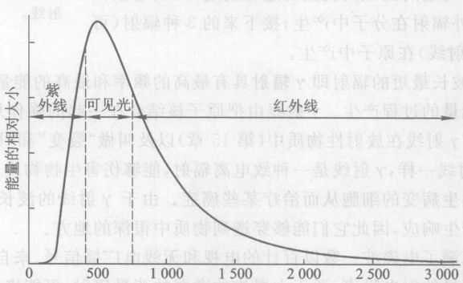

*图 9.8 太阳光谱中不同波长上的能量的相对大小。太阳辐射能的大部分位于电磁波谱的紫外、可见光和红外波段。*

*④ 利用图 9.5。比几米大得多的：调幅广播无线电波；来自交流电的波；来自短上衣的波。1 mm 到几米的波：微波；雷达波。小于 1 mm 的波：温暖的射线；光。*

**作出估计** 光电池是把太阳能转化为电能的器件。如果这种光电池的效率是 100%，那么为了给一个普通家庭提供平均 1 kW 的电力，应该在多大的面积上铺设光电池？实际光电池的效率只有 15% (1/7)。按这样的效率，光电池应该铺设在多大的面积上？你能把它铺设在你的房顶上吗？⑤

> **概念检查 5** 来自太阳的能量被你的皮肤吸收后，以 (a) 以电磁能的形式留在皮肤里；(b) 以辐射能的形式留在皮肤里；(c) 转化为核能；(d) 转化为热能；(e) 转化为电能；(f) 会使你烦躁不安。

## 9.5 全球臭氧枯竭：一颗脆弱的行星

本节和下一节应用我们有关原子和分子、能量以及电磁辐射的知识讨论两个环境问题：臭氧枯竭和全球变暖。这些问题是一类新的社会问题即环境效应的两个例子，由于这些问题不能被控制在局部地区，它们是真正的全球性问题。如果地球要度过当前以强有力的新技术进行的实验的危机，我们就必须认真地思考这些问题，这是我们所有人必须付出的努力的一部分。

漂浮在我们头顶上 10 到 50 km 处的一种看不见的痕量气体保护着地球上的生命免受太阳的高能紫外辐射的伤害。如果把这一极其稀薄的“臭氧层”压缩到正常的几个压强，它只有 2 mm 厚，但是没有它的话，地球上的大多数生命将立即陷入灭顶之灾。在过去一世纪里，人类用普通的家庭工业化学制品毁坏了地球大气中的大部分臭氧。在太迟地认识到我们造成的破坏之后，我们所有的人大家协力同心，好在关键时刻达成一致，禁止使用这种带来破坏的化学制品。臭氧枯竭的故事显示了人类活动导致的全球环境破坏带来的威胁，并且表明了采取强有力的集体行动来保护环境是可能的。它为这个时代上了鼓舞人心的一课。

臭氧的故事开始于 1928 年，这一年，通用汽车公司首次合成了含氯氟烃 (CFC)，其分子由氯、氟和碳的原子构成，用于他们的 Frigidaire 牌电冰箱。CFC 分子的化学性质不活泼，也就是说，它们不容易与其他物质发生反应。它们通常是气体，但在高压下变成液体。由于不活泼，它们对人体无毒，对机械装置没有腐蚀性，并且是不可燃的。这样一种化学品可以有许多用途，其中之一是作为冷却剂。电冰箱和空调器像热机一样运作，但方向反过来（图 9.9）。热机用热气体作为“工作流体”消耗热能做功，电冰箱和空调器则使用一种“冷却剂”，对它做功从而从冰箱或房间抽出热能。

> 这个观念并不是显而易见的：在巴黎用喷雾器喷洒一次香水会使同温层里一种看不见的气体受到破坏，从而在远离半个地球之外的地方和未来的几代人中造成皮肤癌致死和物种灭绝。不论是传统的环境法还是传统的外交，都不能提供面对这种情况的指导原则。
> ——本尼迪克，蒙特利尔臭氧条约的美国首席谈判代表

> 有生以来我第一次看到地平线是一条弯曲的线。它被一薄层暗蓝色的光——我们的大气——突显出来。显然这并不是在我一生中被告知多次的那种空气的海洋。我为它脆弱的外观感到害怕。
> ——U. Merbold, 德国宇航员

*⑤ 1 kW (1000 W) 的太阳能落在 $5 \text{ m}^2 (1 000/200 = 5)$ 的地面上。效率等于 1/7 时，将需要这一面积的 7 倍：35 m²。如果这个面积是正方形，则每边大约 6 m，大概适合铺设在你的房顶上。*
*⑥ 美国政府就这个问题开设了一个资讯网页，网址为 <http://www.epa.gov>。点击“ozone”。*

CFC 很快成为一种普遍使用的冷却剂，商品名叫氟利昂，产量剧增。在 20 世纪 40 年代，人们发现 CFC 可用作驱动喷雾器的压缩气体。接着又开始用作起泡剂在塑料中生成气泡，这种塑料可用作隔热防寒的“热绝缘体”，也可做成泡沫橡胶。在 20 世纪 50 年代，CFC 带来了空调革命，由此促进了美国封闭式购物商场、夏天驾车长途旅行以及向西南部城市的人口迁移。后来，为清洗电子零件的溶剂，它们为计算机革命起了辅助作用。

CFC 造就了一大批产业而没有引起什么异议，直到 1974 年，科学家们开始质疑这些不活泼的气体分子漂散到哪里去了。由于本性不活泼，它们几乎是不能被破坏的，因此，所有自 1930 年以来生产的 CFC 基本上应当仍然留在大气中。但是究竟在哪里呢？它们在那里的情况如何？在投入商业生产后的头 40 年里，没有人为此操心提出过这样的问题。

1974 年，两位大学里的化学家提出了一个令人惊恐的可能性。莫利纳和罗兰（图 9.10）发现，由于 CFC 分子不活泼而且是气态的，它们在较低的大气层中并不被化学分解或被雨清除掉。⑦ 相反，它们慢慢地漂升到离地面 10 到 50 km 的较高的大气层即同温层中，在那里它们可以原封不动地存留几十年甚至若干世纪。莫利纳和罗兰从理论上提出，太阳的

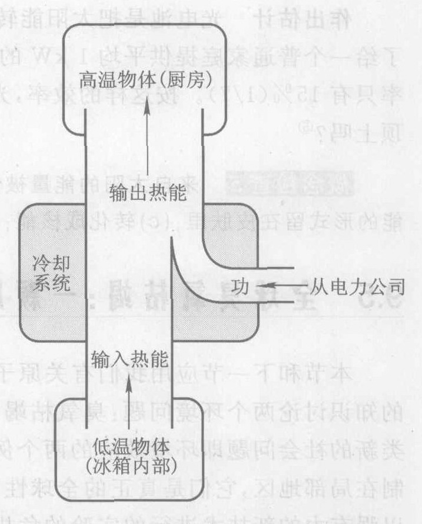

*图 9.9 电冰箱的能流图。比较图 7.5 可以看到，电冰箱像热机一样运作，但方向反过来。外界的能源做功将热能从低温“向高处”移到高温。*

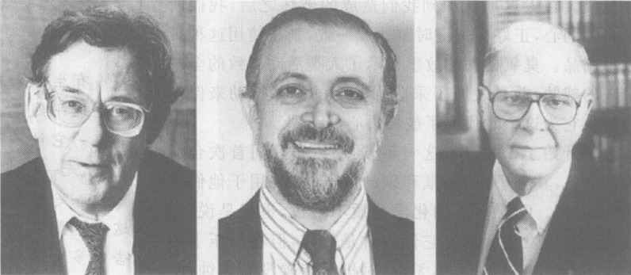

*图 9.10 克鲁岑、莫利纳、罗兰。1995 年度诺贝尔化学奖授予了这三位科学家，这标志着他们提出的人造化合物导致同温层臭氧枯竭的理论得到公认（诺贝尔奖只颁给其研究工作已被主流科学界普遍接受的科学家）。克鲁岑的工作涉及氮的化合物，而莫利纳和罗兰的工作涉及氯的化合物。诺贝尔奖评委会赞誉他们“为把我们从一个可能具有灾难性后果的全球环境问题中拯救出来做出了贡献”。*

*⑦ 教师手册（找你的老师要）中有许多有关臭氧枯竭的原始研究和其他方面的参考读物。*

高能紫外辐射最终会将 CFC 分子分解，向同温层释放出大量的氯。这是令人惊恐的，因为氯被称为臭氧的 $O_3$ 会强列地起作用。臭氧是大气中痕量气体的长长的清单中的一员，所有这些痕量气体全部加在一起，也远小于大气的 1%。表 9.1 只给出了这些痕量气体的几种，它们的浓度为 $10^{-6}$（即每 100 万个大气分子中有一个这种气体分子）或更高。如果把浓度范围扩展到 $10^{-9}$，这张清单还要长得多！

我们来看看氯怎样破坏大气中的臭氧：臭氧在同温层中由 $O_2$ 自然生成，来自太阳的高能紫外辐射使 $O_2$ 分子分解，生成的氧原子随即与 $O_2$ 结合形成 $O_3$。但是臭氧容易被各种化学反应分解，这包括下述与氯的反应：

$$ Cl + O_3 \longrightarrow ClO + O_2 $$

在这个高度上由于紫外辐射的轰击，还发生第二个反应：

$$ ClO + ClO + \text{阳光} \longrightarrow Cl + Cl + O_2 $$

这个反应释放氯，这些氯随即又对受约束地破坏更多的臭氧。科学家发现，1 个氯原子大约瓦解 100 000 个臭氧分子。一点点氯能破坏大量的臭氧。

但是，同温层的臭氧对地球上的大多数生物是很重要的。⑧ 这是因为臭氧分子天然地以紫外线的频率振动，因而吸收了太阳的大部分紫外辐射，从而保护我们免受这种在生物学上有害的辐射的伤害。然而不幸的是臭氧在大气中非常稀薄，在对生物学有重要影响的高度，每 1 千万个大气分子中，只有 3 个臭氧分子！为了对这个浓度有一个直观的印象，想象一个 1 千万人的大城市，其中只有 3 个人标有“臭氧”的身份。我们在臭氧身上看到大气中多种痕量气体的每一种的潜在的重要性（表 9.1）。

在 1974 年，大多数人认为冷却剂和喷雾罐能引起一场灾难的看法是荒谬的，因为这违反了人们的直观观念：人类的活动太微不足道了，远不能改变全球的环境。但是一些人开始警觉了。一场人们现已熟悉的争论随之而来。化学行业辩解说这个理论只是推测性的，在得到更多的证据之前，不应该采取任何在经济上会带来危害的对 CFC 的限制。环境学家则反驳说，宁肯事先做足防范措施也不要事后抱恨终生，因此我们不能冒险再拖延下去了。关心环境的消费者的压力起了关键的作用，一个消费者联合抵制行动导致美国用 CFC 驱动的喷雾器市场萎缩了 2/3，这迫使制造商支持对 CFC 作出限制。

**表 9.1 大气的组成**

| 分子 | 浓度 |
| :--- | :--- |
| **主要成分** | |
| $N_2$ | 78.084% |
| $O_2$ | 20.946% |
| $Ar$ | 00.034% |
| **合计** | 99.634% |
| **痕量气体** (单位为 ppm*) | |
| $CO_2$ | 377 |
| $H_2O$ | 20 ~ 20 000 |
| $Ne$ | 12 |
| $He$ | 5 |
| $NO_2$ | 2 |
| $CH_4$ | 2 |
| $Xe$ | 1 |
| $Kr$ | <1 |
| $O_3$ | <1 |
| $H_2$ | <1 |
| $NO$ | <1 |
| $CO$ | <1 |
| $N_2O$ | <1 |
| $SO_2$ | <1 |
| $NH_3$ | <1 |

*注：如果把浓度范围扩展到包括浓度为 $10^{-9}$ 的气体，这张清单还要长很多倍。大气是相当复杂的！*
*b Parts per million, 100 万分之一，即 $10^{-6}$。*

*⑧ 反之，地面的臭氧是有毒的污染物。它是汽车废气带来的结果，也是城市烟雾的主要成分。*

1978 年，美国和其他几个国家的政府开始禁止将 CFC 用作喷雾器的驱动气体，实际上这只是 CFC 的最不重要的应用。这是第一次对受到怀疑会引起全球性危害的物质在其后果得到完全证明之前就加以限制。这种向关心环境的不完全的让步至少暂时平息了这场争论。在 1980 年之前，这个问题已从公众的视野中消失。但是美国的喷雾器雾化剂只占全球 CFC 用量的 25%，而且其他方面的生产量继续增加。

现在故事的场景移到了南极。幸运的是，一个英国大气考察队从 1956 年开始一直对南极作例行观测。从 1977 年开始，考察队观测到一个新动向：臭氧的浓度每年春天下降，然后在几个月内恢复正常。这个下降逐年加大，到 1984 年暴跌 40%。所涉及的面积比美国还大。这些测量结果是如此难以令人相信，以致科学家们推迟了几年才发表，在这段时间他们复核了他们的工作。他们在 1985 年发表的报告受到怀疑，批评者认为，这个效应是自然周期的一部分，很快就会消失。

不过，美国化学家所罗门（图 9.11）认为应当对这个问题做进一步的调查，她组织了一次到南极的考察活动。随着十月份南极春季的到来，她发现不仅臭氧比正常值低 50%，而且出现了高水平的氯。真的存在着一个“臭氧空洞”，这个空洞正在变大，而且似乎与氯有关系。这是完全没有料到的。莫利纳和罗兰曾以为 CFC 破坏臭氧的效应只会在逐渐发生。虽然他们的预言一直不为人们相信，但实际情况明显甚至更为严重。

可是这个臭氧空洞确实是由 CFC 造成的吗？所罗门提出了一个在漫长黑暗的极地冬季期间在南极高空形成冰云的假说。当太阳在南极的春天重新出现时，太阳的能量在形成冰云的微小冰粒表面引发化学反应。这些反应从混合在冰粒中的 CFC 里把 ClO 释放到同温层中，太阳光随后分解 ClO 分子放出氯，而氯则攻击 $O_3$ 分子。这是一个微妙的机制，不是科学家事先能预料到的那种情况。1987 年的第二次考察证实了所罗门的假说。

**我们怎么知道氯导致了臭氧空洞？** 图 9.12 和图 9.13 给出了暗示氯是罪魁祸首的一些证据。两个图分别显示出 1987 年 8 月 23 日太阳重新出现时以及 3 周后的 9 月 16 日在南极同温层飞行中记录到的数据。图中画出了从南纬 $63^\circ$（刚好在南美洲之南）到南纬 $70^\circ$（南极内陆）上 ClO 和臭氧的浓度，分别以 $10^{-9}$ (ppb) 和 $10^{-6}$ (ppm) 为单位。8 月 23 日，ClO 出现在南纬 $65^\circ$ 以南地区南极上空的同温层中，但还没有开始破坏臭氧。到 9 月 16 日，在极地区域臭氧已经遭到破坏。在图 9.13 中，ClO 的出现与臭氧的枯竭之间的关联是非常强的；ClO 浓度上升的地方，臭氧的浓度就下降。这样细致的关联令 ClO 的累积与臭氧枯竭之间的关系无可置疑。

南极臭氧空洞持续加深，春天的枯竭程度已达到 70%，而且往南半球的许多地方扩展，其

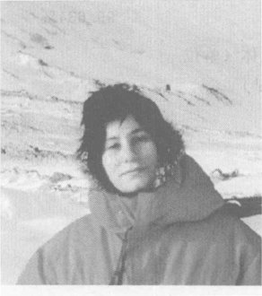

*图 9.11 大气化学家苏珊·所罗门在南极。她在 1986 年组织了第一支国家臭氧考察队，并提出了正确解释南极上空同温层中臭氧如何被含氯化合物破坏的理论。2000 年，她因上述研究工作被授予美国国家科学技术奖章。*

中包括澳大利亚。大约在 2000 年至 2005 年，臭氧的破坏程度似乎达到了最大并趋于稳定，不过还未开始朝正常的臭氧浓度恢复。

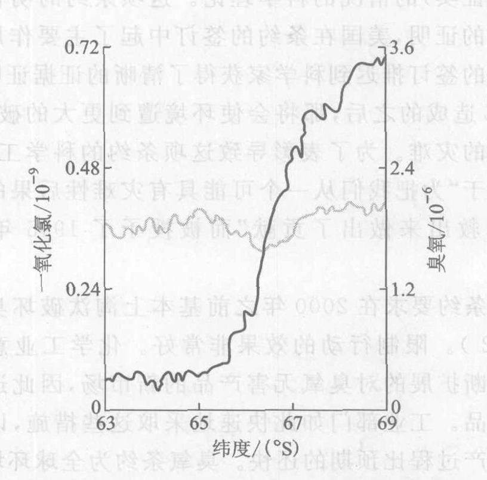

*图 9.12 ClO 浓度（黑色）和臭氧浓度（灰色），测于 1987 年 8 月 23 日，这一年南极附近的臭氧开始消失之前。*

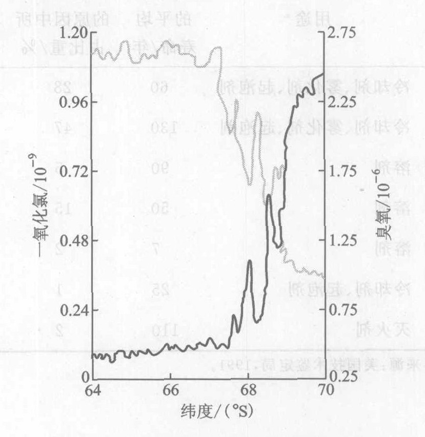

*图 9.13 1987 年 9 月 16 日测得的浓度。在臭氧发生枯竭之后。*

> 如果没有 20 世纪 70 年代中期那几位富于好奇心的研究人员的勇气，世界认识到与 CFC 的迅速增加的应用有关的致命的潜在威胁就会太晚。罗兰和莫利纳那极具著名的假设……从一开始就引发了一场非难与论战的暴风骤雨……1995 年的诺贝尔化学奖为他们洗清了冤屈，不过，值得提及的是 1978 年出版的有关这个问题的第一本通俗读物，书名叫 The Ozone War (臭氧战争)。
> ——本尼迪克

> 科学正在表明，我们这个行星比以前人们以为的更为脆弱。
> ——本尼迪克

> 人们决不应犯这样的错误，低估消费者受到教育和激发后的力量……消费者所读到的和在电视上所看到的，都劝告他们去购买某种不同的东西。这就向工业界提供了一个强有力的信号，他们应该拿出替代品来，他们很快就这样做了。
> ——本尼迪克，谈到以 CFC 作雾化剂的喷雾器时

我们有时会感到吃惊，这个从智力角度看让我们着迷的东西（大气层中的臭氧枯竭）竟具有严重的后果。我知道其他许多人和我一样，觉得从从事医学研究……并且宣称“呵，我有了治愈某种可怕疾病的方法”是非常美妙的。但我们没有这样的好消息告诉人们。尽管如此，从智力角度看它仍然是难以置信地令人兴奋。它是如此的复杂和美妙。
——所罗门，大气科学家

> 建造桥梁时，我们总是要把它建造得能承受比它可能遇到的强得多的压力。可是在谈到保护全球大气这个利害关系大得多的问题时，某些人的态度却似乎等于要求论证一座桥必定会坍塌才可作为加固这座桥的正当理由。如果我们在筹划保护臭氧层的措施时要犯错误的话，那么，就让我们因意识到对后代的责任而犯小心过头的错误吧。
> ——本尼迪克

1987 年在加拿大的蒙特利尔，47 个国家签订了一个独一无二的条约。⑨ 臭氧条约大部分内容拟订于所罗门的南极考察之前，它是一项预防性的行动，所依据的是关于可能发生（尚未实际观测证实的）情况的科学理论。这项条约的明智性现在已得到充分的证明，美国在条约的签订中起了主要作用。如果把臭氧条约的签订推迟到科学家获得了清晰的证据证明臭氧枯竭是 CFC 造成的之后，那将会使环境遭到更大的破坏，使人类陷入更深的灾难。为了表彰导致这项条约的科学工作，罗兰和莫利纳由于“为把我们从一个可能具有灾难性后果的全球环境问题中拯救出来做出了贡献”而被授予了 1995 年诺贝尔化学奖。

臭氧条约要求在 2000 年之前基本上淘汰破坏臭氧的化学品（表 9.2）。限制行动的效果非常好。化学工业意识到出现了一个不断扩展的对臭氧无害产品的新市场，因此迅速转向发展换代产品。工业部门如此快速地采取这些措施，以致 CFC 产品的逐步停产过程比预期的还快。臭氧条约为全球环境保护提供了一个令人鼓舞的例子。我们在下一节将看到，全球变暖造成的威胁甚至更大，它的解决不会是轻而易举的。臭氧的传奇带给我们的许多教训之一，就是我们能够采取强力而有效的全球行动。

**表 9.2 大气中破坏臭氧的化学物**

| 化学物 | 用途 | 在大气中的平均寿命/年 | 在造成问题的原因中所占比重/% | 美国在总用量中所占份额/% |
| :--- | :--- | :--- | :--- | :--- |
| CFC-11 | 冷却剂、雾化剂、起泡剂 | 60 | 28 | 22 |
| CFC-12 | 冷却剂、雾化剂、起泡剂 | 130 | 47 | 30 |
| CFC-113 | 溶剂 | 90 | 5 | 45 |
| 四氯化碳 | 溶剂 | 50 | 15 | 27 |
| 甲基氯仿 | 溶剂 | 7 | 2 | 50 |
| 海龙 1211 | 冷却剂、起泡剂 | 25 | 1 | 25 |
| 海龙 1301 | 灭火剂 | 110 | 2 | 50 |

*注：资料来源：美国技术鉴定局，1991。*

⑨ 我极力推荐美国首席谈判代表本尼迪克写的报道 Ozone Diplomacy (Cambridge, MA: Harvard University Press, 1991)。

裁决现在要由大自然来做了。由于破坏臭氧的化合物寿命很长（表 9.2），这个裁决需要一段时间才能作出。如图 9.14 下方曲线所示，氯的浓度于 1998 年终于稳定下来，但是预期在 2050 年之前不会降到安全水平。从 1997 年到 2001 年期间，全球的臭氧水平比 20 世纪 60 年代低 3%。作为比较，图 9.14 还画出了如果推迟到 2010 年才采取控制措施的话将会出现的灾难。

可能出现什么后果呢？美国环境保护局估计，在 1987~2050 年期间，美国将增加 1 200 万皮肤癌病例，包括 20 万例死亡。预计的其他人对人的影响包括眼睛白内障、免疫系统反应抑制以及皮肤过早老化等。由于某些植物品种对紫外辐射敏感，农作物产量预计会减少。自然生活在海洋表面附近的微生物和鱼类可能会减少。受影响最大的地区将是南极地区。在 1996 年前，测量的结果表明南极地区周围的微生植物的数量减少了 25%。可能发生的况还包括整个南极生态系统的崩溃。

> **概念检查 6** 冰箱（图 9.9）冷却它里面的物体。它对你的厨房有什么影响？(a) 使厨房冷却；(b) 使厨房变暖；(c) 不影响厨房的温度。

> **概念检查 7** CFC 破坏臭氧关键的一步是：(a) CFC 在同温层中分解并释放出氯；(b) CFC 在同温层中分解并释放出碳；(c) 太阳辐射将 $O_3$ 分解；(d) CFC 直接与同温层中的臭氧结合；(e) 工业生产过程中的碳与臭氧发生反应。

> 臭氧枯竭将是我们留给下世纪大部分时期的遗产。
> ——M. Kurylo, 美国航空航天局高层大气项目负责人，引自 1990 年的谈话

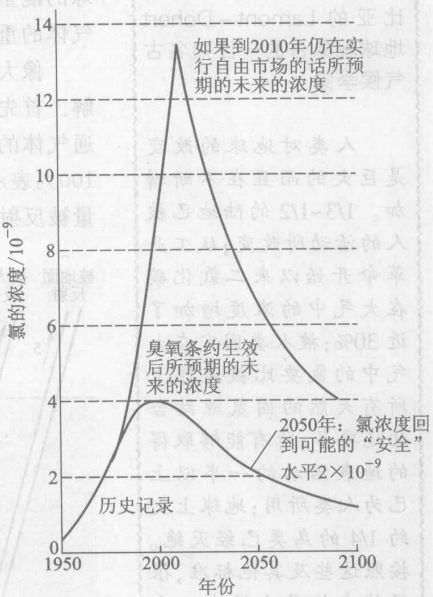

*图 9.14 臭氧条约对大气中氯的浓度的影响。当氯的浓度水平达到 2 ppb 时南极臭氧空洞首次变得明显。如果拖延到 2010 年才进行控制的话，氯的浓度水平就会剧增。浓度以 ppb ($10^{-9}$) 为单位。*

## 9.6 全球变暖：激怒这头猛兽

如果你从太空测量地球的温度，你就会发现它相当冷，冷到 $-19^\circ C$。你在太空测量地球温度的方法是研究地球的电磁辐射输出。这就像通过看一个电炉的颜色来测量其近似温度：发白光表示很热，明亮的红光意味着热，而暗红则意味着不太热。对这种方法进行改进，用精确测量辐射谱的仪器，就可以得知精确的温度。地球不像电炉或太阳那样热

⑩ 美国政府就这个问题在政府网站 <http://www.epa.gov> 上开设了一个资讯网页，进入上述网站后点击“global warming”。用你的计算机在空闲时间帮助科学家进行关于地球气候的大规模计算，你能为解决全球变暖做出贡献。要知道怎么做，进入 <http://www.climateprediction.net>。

得足以发出可见光。相反，地球发红外光，因此需要使用红外测量器件。

对于我们来说，幸运的是地球的平均表面温度是 $+14^\circ C$，比从太空测得的 $-19^\circ C$ 暖和得多。这高出的 $33^\circ C$ 是由地球周围的大气气垫造成的。这种升温叫做**温室效应**。令人惊讶的是，产生温室效应的气体并不是构成地球大气主体的氮和氧。相反，这个效应是由某些痕量气体，主要是水蒸气和二氧化碳（表 9.1）造成的。这些气体叫做**温室气体**，它们的重要特性是强烈吸收红外辐射。由于地球辐射红外线，因此我们可以预期，这样的气体对地球的能量平衡是重要的。就像上一节那样，我们再次看到了痕量气体的重要性。

像大自然的许多性质那样，温室效应最好用能流概念来理解。首先，我们来研究在一个想象的没有温室气体但是有其他普通气体的地球表面附近的能流。图 9.15 用百分率表示能流，100% 表示每日从太阳接收到的总辐射能。如图所示，30% 的能量被反射，其余的 70% 被吸收。吸收的能量使地球变暖，而每一

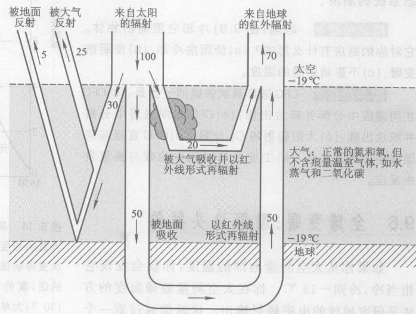

*图 9.15 一个假想地球的表面附近的能流，这个假想地球没有温室气体，但是有其他方面都正常的大气。数字表示相对于从太阳接收到的辐射能的百分数。*

> 我们正在同我们的气候玩俄罗斯轮盘赌……地球的气候系统是一头易怒的猛兽，常常作出难以预料的反应，而增加大气中的二氧化碳有可能激怒这头猛兽。
> ——W. Broecker, 哥伦比亚大学地质与环境科学 Newberry 教授、哥伦比亚的 Lamont - Doherty 地球观象台的一位知名古气候学家

> 人类对地球的改变是巨大的而且在不断增加。1/3~1/2 的陆地已被人类的活动所改变；从工业革命开始以来二氧化碳在大气中的浓度增加了近 30%；被人为固定在大气中的氮要比被地球上所有天然的固氮源结合的还要多；所有能够取得的地表活水的一半以上已为人类所用；地球上大约 1/4 的鸟类已经灭绝。按照这些及其他标准，很显然我们是生活在一个由人类主宰的行星上。
> ——P. Vitousek, H. Mooney, J. Lubchenko, J. Melillo, 引自 “Human domination of Earth's ecosystems”, in the journal *Science*, 25 July 1997

*⑪ 像 $H_2O$ 和 $CO_2$ 这样的三原子或多原子分子是高效的红外线吸收体，这是因为它们有许多不同的振动方式来响应辐射。占大气主体的 $N_2$ 和 $O_2$ 分子只有两个原子，因此每个分子只有一种振动方式（两个原子相互靠近再远离）。*

个暖的物体都要辐射能量，因此地球要向外辐射能量。但是，流入的辐射和流出的辐射有明显的差别。由于地球比太阳冷得多，所以它只在红外波段“发光”（即辐射），而不是像太阳那样在紫外、可见光和红外波段都发光。如果没有温室气体，那么，被重新辐射的能量就会完全通过大气进入太空，上述差别就不会影响到总的能量平衡。于是，吸收过程和重新辐射过程之间的平衡将使地球大体上具有 $-19^\circ C$ 的平均温度。

当我们加入温室气体时，上述平衡就发生改变（图 9.16）。被地球重新辐射的红外线现在被温室气体吸收并再次重新辐射射出去。由于重新辐射是朝向所有方向的，既向上也向下，因此，这种能量的“回收”使地球表面变暖。温室气体使地球变暖的方式就像一床毯子使一些辐射的能量改变方向返回你的身上而使你变暖一样。温室的玻璃就以类似的方式使温室变暖。

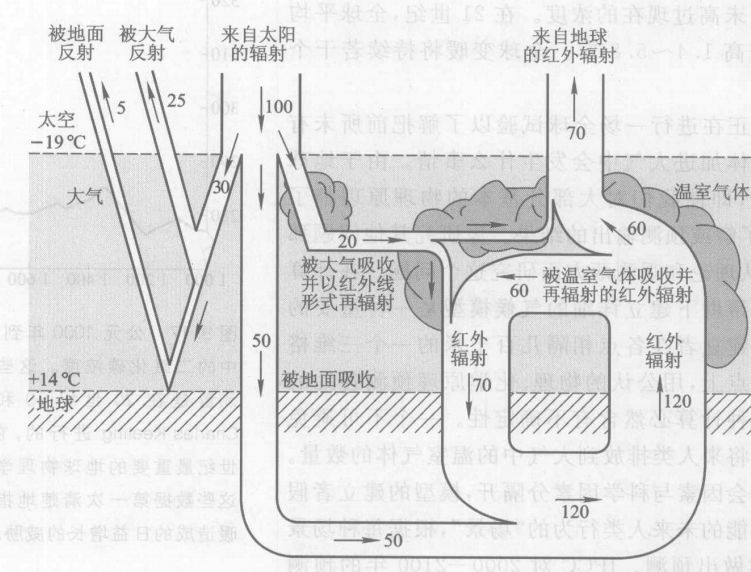

*图 9.16 地球表面附近的能流。本图与图 9.15 之间的巨大差别是由痕量温室气体造成的，这些气体对地球的能流有显著的影响。*

这种天然的温室效应千百万年以来已经使我们的行星变暖，然而这种效应近年来却由于人类的活动而加强。燃烧化石燃料产生大量二氧化碳，这是一种重要的温室气体。1750 年前后开始的工业革命之前的数十万年里，二氧化碳保持着天然的大气中的浓度，即 280 ppm 以下。但是截至 2004 年，浓度达到了 377 ppm，增加了 34%（图 9.17）。这已经使地球在过去的一个世纪里稍微变暖。这种人为的对天然温室效应的加强叫做**全球变暖**。

这个问题几十年前就可以预见到，而且事实上在 19 世纪就有人预言过，但是人们把它看作是遥远未来的事情，没有认真对待。这个未来已经来到了。1990 年、1995 年、还有 2001 年，来自一百多个国家的数千位科学家对几万篇科学论文进行了评估，并取得了广泛共识：全

球变暖正在发生并且将会加剧。这个项目叫做政府间气候变化调研 (IPCC)，它代表人类对全球变暖的认识现状。

以下是摘自 IPCC 的 2001 年度报告的几点结论：主要由于人类活动导致的温室气体排放，在 20 世纪里全球平均表面温度上升了大约 $0.6^\circ C$（图 9.18）。全球平均海平面升高了，海洋的热含量也增加了。冰雪的覆盖量已经减少，冰河已经消退。北半球暴雨发生的频率大概增加了 2%~4%。极度反常的天气也有可能进一步增加。在过去 42 万年里，也许是在过去 2000 万年里，$CO_2$ 的浓度从未高过现在的浓度。在 21 世纪，全球平均温度预计将升高 $1.4 \sim 5.8^\circ C$。全球变暖将持续若干世纪。

人类当前正在进行一场全球试验以了解把前所未有的大量温室气体加进大气中会发生什么事情。由于地球气候的复杂性，即使我们对大部分基本的物理原理都了解，但也很难了解和预测输出的结果。像研究其他问题那样，科学家们从理论和观测两方面研究这个问题。在计算机计算结果的帮助下建立详细的气候模型是一种重要的方法。模型的建立者在各点相隔几百千米的一个三维格点空间的每个点上，用公认的物理、化学原理预测各处的气候情况。这种计算必然含有不确定性。一个不可避免的不确定性是将未来人类排放到大气中的温室气体的数量。为了把这个社会因素与科学因素隔开，模型的建立者假设几种似乎可能的未来人类行为的“场景”，根据每种场景对未来的气候做出预测。IPCC 对 2000—2100 年的预测是根据多种场景做出的，不同的经济增长、人口增加、能量使用效率、化石燃料和非化石能源的使用情况决定了各种结果的特点。

图 9.19 显示根据 6 种不同的场景对 2000—2100 年温度的 6 种预测结果以及自公元 1000 年以来全球的温度。灰色区域表示未来的不确定性。你可以看到，每种场景都使 2100 年变得热多了。最上面的曲线根据的是快速的经济增长和高度依赖于化石燃料的“通常的商业”场景，它给出最大的变暖。最下面的两条曲线是假定迅速用非化石能源代替化石燃料后的结果。

**我们怎么知道公元 1000 年以来地球的温度？** 科学家们怎么能重建公元 1000 年以来还没有温度计时的温度？人们利用了几种间接方法。其中两种方法是年轮和冰核。树木年轮的

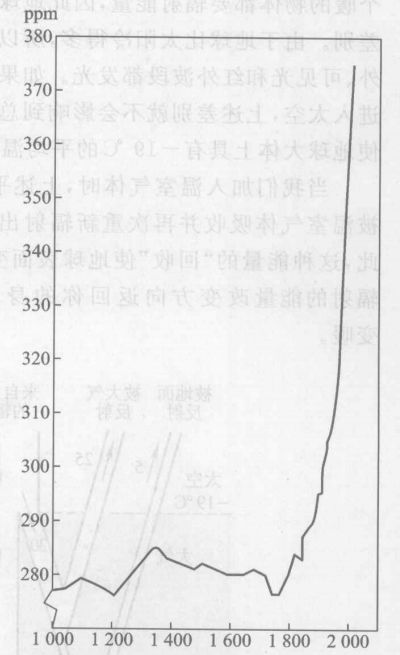

*图 9.17 公元 1000 年到 2003 年大气中的二氧化碳浓度。这些数据的测量是在 20 世纪 50 和 60 年代由 Charles Keeling 进行的，它被称为“20 世纪最重要地球物理学测量”，因为这些数据第一次清楚地指出由全球变暖造成的日益增长的威胁。*

*⑫ 你可以在 <http://www.ipcc.ch/> 上找到 IPCC 的最新报告的摘要。*

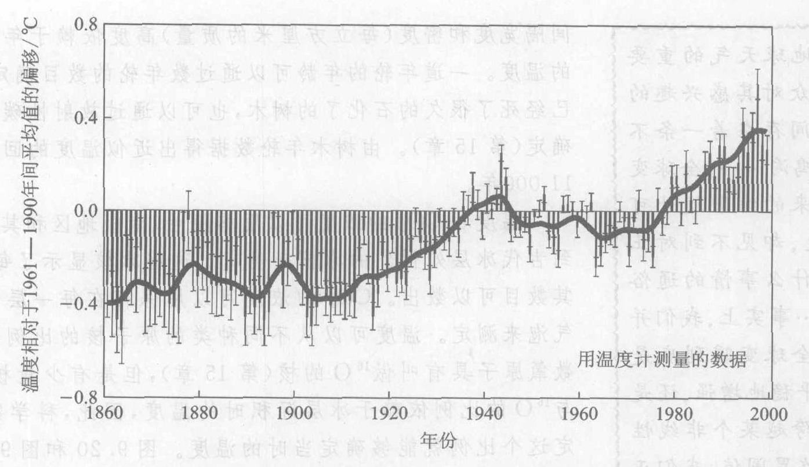

*图 9.18 从 1860 年到 2000 年地球表面温度的变化。线条图表示每年测得的温度，而光滑的曲线是 10 年的滑动平均值。数据表明，从 1860 年以来，温度升高了 $0.6^\circ C$。你可以看到，1998 年是这个记录中温度最高的年份，并且有 9 个最热的年份出现在 1988 年之后。*

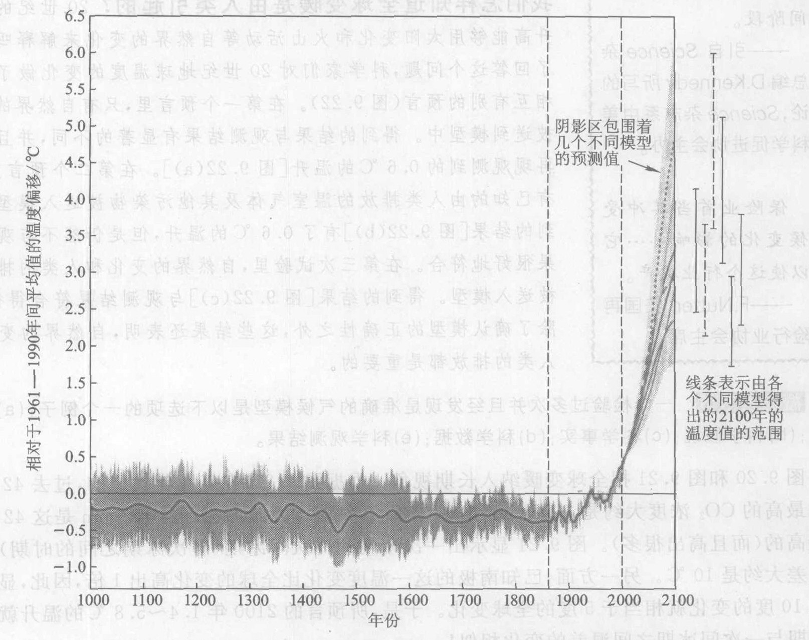

*图 9.19 从公元 1000 年到 2100 年地球表面温度的变化。1000—1860 年期间的温度（黑实线）用树木的年轮和其他间接方法确定。1860—2000 年的温度由用仪器测出的记录确定。灰色区域表示数据的不确定性。2000 年之后的预测值由气候模型确定，所依据的场景见正文；灰色区域表示预测值的不确定性。*

间隔宽度和密度（每立方厘米的质量）高度依赖于生长时期的温度。一道年轮的年龄可以通过数年轮的数目确定，对于那些已经死了很久的石化了的树木，也可以通过放射性碳年代测定法确定（第 15 章）。由树木年轮数据得出近似温度的回溯年限长达 11 000 年。

温度和 $CO_2$ 的浓度可以用格陵兰、南极地区和其他地方深钻到古代冰层处得到的冰核来确定。这些冰核显示了每年的冰层，其数目可以数出。$CO_2$ 的浓度可以用保存在每一层中的古代空气泡来测定。温度可以从不同种类的原子核的比例判断。大多数氧原子具有叫做 $^{16}O$ 的核（第 15 章），但是有少量核是 $^{18}O$。$^{18}O$ 与 $^{16}O$ 的比例依赖于冰层沉积时的温度，因此，科学家们通过测定这个比例就能够确定当时的温度。图 9.20 和图 9.21 显示由此得到的过去 42 万年里 $CO_2$ 和温度的数据，年代一直回溯到第四个冰期之前。

**我们怎样知道全球变暖是由人类引起的？** 20 世纪的温度升高能够用太阳变化和火山活动等自然界的变化来解释吗？为了回答这个问题，科学家们对 20 世纪地球温度的变化做了三个相互有别的预言（图 9.22）。在第一个预言里，只有自然界的变化被送到模型中。得到的结果与观测结果有显著的不同，并且没有再现观测到的 $0.6^\circ C$ 的温升[图 9.22(a)]。在第二个预言里，只有已知的由人类排放的温室气体及其他污染物被送入模型。得到的结果[图 9.22(b)]有了 $0.6^\circ C$ 的温升，但是仍然不与观测结果很好地符合。在第三次试验里，自然界的变化和人类的排放都被送入模型。得到的结果[图 9.22(c)]与观测结果符合得很好。除了确认模型的正确性之外，这些结果还表明，自然界的变化和人类的排放都是重要的。

> **概念检查 8** 一个检验过多次并且发现是准确的气候模型是以下选项的一个例子：(a) 科学理论；(b) 科学假说；(c) 科学事实；(d) 科学数据；(e) 科学观测结果。

图 9.20 和图 9.21 把全球变暖纳入长期的视角。根据图 9.20，在工业年代之前，过去 42 万年以来最高的 $CO_2$ 浓度大约是 300 ppm，出现在 33 万年前。因此，今天的 377 ppm 是这 42 万年中最高的（而且高出很多）。图 9.21 显示出一次冰期和一次间冰期（各次冰期之间的时期）之间的温差大约是 $10^\circ C$。另一方面，已知南极的一个温度变化比全球的变化高出 1 倍，因此显示出的这 10 度的变化就相当于 5 度的全球变化。于是，所预言的 2100 年 $1.4 \sim 5.8^\circ C$ 的温升就和一次冰期与一次间冰期之间的温差的变化相似！

二氧化碳并不是唯一的问题。如图 9.23 所示，还有另外三种气体也起作用，包括导致臭氧枯竭的 CFC。另外，由于树木储存 $CO_2$，因此滥伐森林导致全球 $CO_2$ 排放量的 7%~30%。

> 在地球天气的重要性和公众对其实感兴趣的程度之间存在着一条不该有的鸿沟……[全球变暖]带来的结果随处可见，但是，却见不到正对正在发生什么事情的通俗说明……事实上，我们并不知道全球变暖到底是将继续平稳地增强，还是有可能跨越某个非线性过程的临界阈值。我们正处在我们在我们拥有的唯一的行星上进行的一场大的不受控制的试验的中间阶段。
> ——引自 Science 杂志总编 D. Kennedy 所写的社论，Science 杂志系由美国科学促进协会主办。

> 保险业首当其冲受气候变化的影响……它可以使这个行业破产。
> ——F. Nutter, 美国再保险行业协会主席

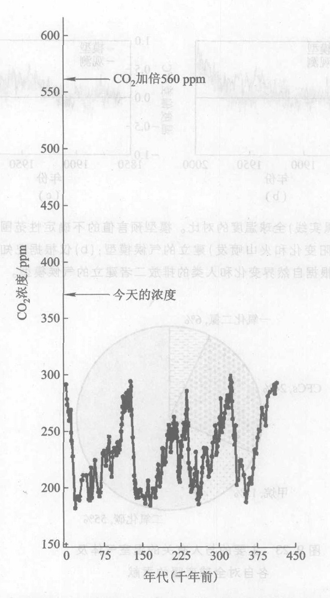

*图 9.20 用南极的冰核确定的过去 42 万年 $CO_2$ 浓度记录（单位为 ppm）。*

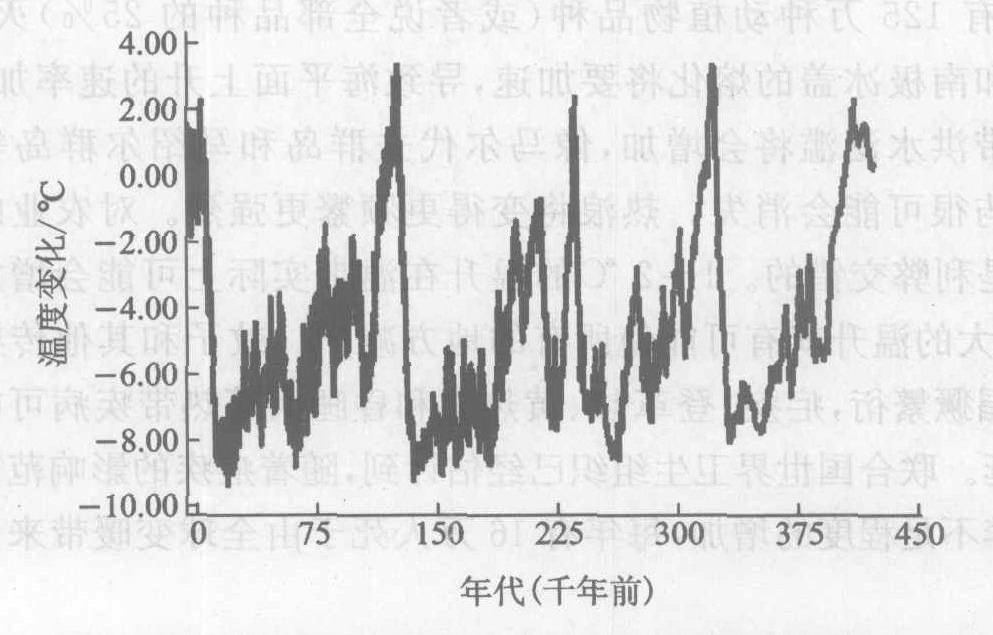

*图 9.21 用南极的冰核确定的过去 42 万年的温度变化记录（偏离南极现在温度的摄氏度数）。*

> 没有任何现有的补救性的反应（比如京都协议）能够为气候变化带来的问题提供一个解决方案。它们只不过是朝着减慢变化的步伐、改善和适应的方向努力，而不是彻底治疗。因此，到 2050 年，气候变化问题将更严重得多，到 2100 年甚至越发严重。
> ——罗兰，化学家，由于在同温层臭氧枯竭问题上的科学工作荣获诺贝尔奖

> 在我看来，气候变化是我们当前面前的最严重的问题，甚至比恐怖主义的威胁更严重……持续变暖的一个结果是，全世界数以百万计的人在将来会面临饥饿、干旱、洪水以及像疟疾这种使人变虚弱的疾病的危险……推迟几年采取行动不是一个严肃认真的选择。
> ——David A. King, 英国政府的科学顾问

> 人类造成的全球变暖有可能给是给美国人设下的最大的骗局吗？听起来的确像是那么回事。
> ——J. Inhofe

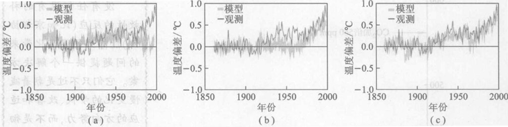

*图 9.22 气候模型预言的（灰色）与实测的（黑实线）全球温度的对比。模型预言值的不确定性范围用灰色表示。(a) 仅根据已知的自然界的变化（如太阳变化和火山喷发）建立的气候模型；(b) 仅根据已知的人类排放的温室气体和污染建立的气候模型；(c) 根据自然界变化和人类的排放二者建立的气候模型。*

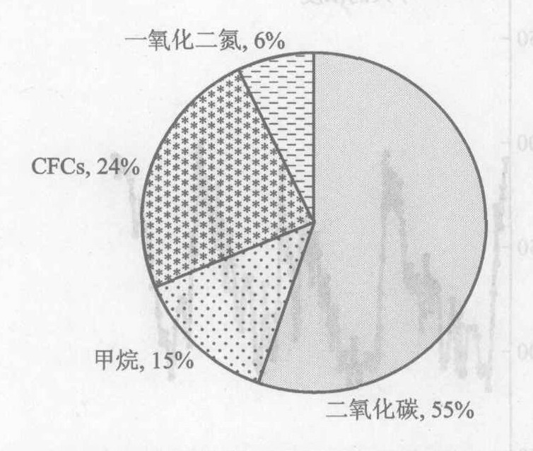

*图 9.23 主要的与人有关的温室气体及各自对全球变暖的贡献。*
*(图注：二氧化碳 55%, 甲烷 15%, CFCs 24%, 一氧化二氮 6%)*

全球变暖有多种多样的后果。有一些列在上述 IPCC 的 2001 年年度报告的结论中。此外，气候带将北移大约 500 km，导致到 2050 年有 125 万种动植物品种（或者说全部品种的 25%）灭绝。格陵兰和南极板冰盖的熔化将要加速，导致海平面上升的速率加快。低洼地带洪水泛滥将会增加，像马尔代夫群岛和马绍尔群岛等低洼的岛屿很可能会消失。热浪将变得更频繁更强烈。对农业的影响将会是利弊交错的。$1 \sim 2^\circ C$ 的温升在温带实际上可能会增加收成，而更大的温升就可能使所有的地方面方减产。蚊子和其他传染病媒体将猖獗繁衍，疟疾、登革热、黄热病和昏睡病等热带疾病可能会向北蔓延。联合国世界卫生组织已经估计到，随着疟疾的影响范围扩大和营养不足程度的增加，每年有 16 万人死于由全球变暖带来的上述效应。

许多后果会进一步影响它们的起因。这种**反馈效应**可能是不可预测的和戏剧性的。比如：全球变暖会增加水的蒸发，这会加大云的覆盖范围，使地球变冷，从而减弱全球变暖，这是**负反馈效应**。另一方面，增加的蒸发也会增加大气中的水蒸气，这将加强全球变暖，因为水蒸气本身是一种温室气体，这是**正反馈效应**。正反馈可能造成无法预料地失控。

有可能出现几个带来重大冲击的失控事件。变暖可能会导致沉积在洋底的大量甲烷气体突然释放出来，这将使变暖立即加速，因为甲烷是一种温室气体。第二个可能性是在全球范围内传输热的洋流的中断。据认为，这些洋流的突然中断和接通启动和结束了从前的冰期。变暖可能导致这些洋流减慢或停止。第三个可能性是北极的冰盖完全熔化，自 20 世纪 50 年代以来，这个冰盖的厚度已经由平均厚度 3.1 m 减小到如今只有 1.8 m。尽管这并不会使海平面升高，⑬ 但是却令北冰洋从一个白色的太阳光反射体变成一个巨大的集热器，由此带来的结果是一个未知数。第四个可能性是南极西部冰川可能会滑入海中，使海平面在 21 世纪升高达 1 m。

我们能做些什么呢？为了使大气中的 $CO_2$ 浓度不超过目前的高水平，估计今后几十年的年排放量必须减少 60% 至 80%。但是，从 1950 年以来的年排放量却迅速增加了（图 9.24）。为了使大气中的 $CO_2$ 浓度不再增加，必须把这个不断增加的排放率扭转过来，并减至大约每年 20 亿吨。这不是一件容易事，不过臭氧的故事（上一节）告诉我们，人类能够采取激进的措施来保护环境。

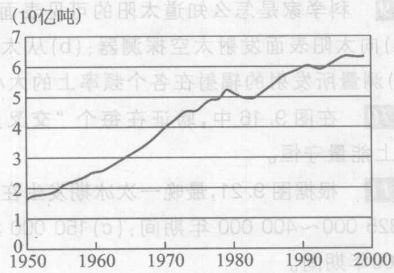

*图 9.24 1950—1999 年全世界燃烧化石燃料产生的碳排放量。年排放量以 10 亿吨碳为单位。为了使二氧化碳浓度不超过现在的高水平，碳的年排放量必须从现在的 60 亿吨降到大约 20 亿吨。*

针对全球变暖已采取的行动要比针对臭氧枯竭采取的行动力度弱得多，这有几个原因：这个问题的解决将带来大得多的经济冲击；所要求的生活方式的变化可能是难以做到的；还有，世界上最大的经济大国美国在这个问题上拖后腿，而不是像它在臭氧枯竭问题上那样发挥带头作用。

> 从本质上说，全球气候变化并不是一个有关经济理论或政治讲坛的问题，也不是有关党派利益或利益集团压力的问题。这是关乎上帝创造的天地万物的未来和人类大家庭的问题。这是关乎既保护“人类环境”又保护自然环境的问题。这是关乎人类作为天地万物的管理员以及对天地万物的未来和人类大家庭的问题。这是关乎既保护“人类环境”又保护自然环境的问题。
> ——美国天主教会主教团，《关于全球气候变化的一个呼吁：对话、慎重和着眼于共同利益》

> 你相信全球变暖吗？这是一个宗教式的问题……实际上，如果你所听到的什么东西被称为是得到“所有科学家”的支持，你就不必对这个争论有任何一步的了解。你只要回到以前把它当作宗教信仰那样对待就行了……说到科学，隐藏在危言耸听者的舆论后面的设想是，科学是权威之源，这种权威性随着持赞同意见的科学家的人数的增多而加强。不过……怀疑态度对于科学是不可少的，舆论则是相干的。危言耸听的人预言有更多的热带风暴，预言海平面的灾难性的上升、南北极熔化、甚至进入另一个冰期，这些都没有在科学上得到支持。这导致这样一种状况，这些东西的鼓吹者们希望我们在没有任何惊慌的根据时感到恐惧。针对这种恐惧的回应是，他们想要我们做他们想做的事情。
> ——R. Lindzen，麻省理工学院地球、大气和行星科学教授

*⑬ 与南极冰盖不同，北极冰盖是浮在海洋中的。如果你将一杯水放到一杯水中让它熔化，水面并不会升高。请试试看！*

> 在我们看来，气候变化的挑战现在是如此严峻，它要求一定程度上的政治承诺，这实际上是没先例的。世界上的政治作为尚有待观察。在这个问题上的领导能力要求的由不只是实用主义或摇摆姿势。它要求勇敢、果断和机智的品质，这些品质在和平时期是很难得的。
> ——英国会下院环境监察委员会 2005 年的报告“气候变化的国际挑战”

> 当然，目前最大的问题是全球变暖，这个问题公认比臭氧问题复杂得多。
> ——本尼迪克，臭氧条约的美国首席谈判代表

> 要使大气的浓度稳定在任何一个可能由意义的水平——即使是工业化之前的 4 倍，需要全球排放量最终下降到只有当前 60 亿吨碳的零头。
> ——J. Holdren，物理学家

竭问问题上那样起带头作用。在一份带来看望的文件中，大多数工业化国家于 1997 年在日本的京都同意，在 2012 年前把他们的温室气体排放量减到比 1990 年的水平低 5%。不幸的是，在 2001 年，全球的排放量已经比 1990 年的水平高了 10%。而且，所希望的到 2012 年的 5% 减少量只是最终解决这个问题所需的 60%~80% 减少量的一个零头。

工业化国家，特别是美国，是问题的主要源头，因为它们消耗的化石燃料占最大的份额（图 9.25）。单单一个美国，其人口只占世界人口的 4.5%，碳排放量却占了世界碳排放量的 23%。其他工业化国家的人均碳排放量低于美国的一半。发展中国家占的份额小得多，不过他们的排放量近年来由于人口增加及迅速工业化已经增加了。

推荐的措施一般包括：建筑物更好得地隔热，制造效率更高的汽车，用核能或太阳能代替煤发电，重新造林等。图 9.26 画出几种提高能量效率的措施的效果，全面采用这些措施，会使美国现有的 $CO_2$ 排放量降低 50% 以上。一个叫做**预防性原则**的方法在对付像全球变暖这种还不是很确定的环境困境时变得重要起来，它是欧盟环境法律的基本原则。这一原则基于这样一个观念，就是宁愿事先做足防范措施也不要出事之后后悔。更准确地说，预防性原则认为，科学上的不确定性不应该成为推迟采取防范措施的理由。并不奇怪，这个原则的采用常常是有争议的。

> **概念检查 9** 科学家是怎么知道太阳的可见表面的温度大约是 5 400 ℃ 的？(a) 向太阳表面发射太空探测器；(b) 从太阳的化学成分的知识得知；(c) 测量所发射的辐射在各个频率上的大小。

> **概念检查 10** 在图 9.16 中，验证在每个“交叉点”（能流分流或汇合的地方）能量守恒。

> **概念检查 11** 根据图 9.21，最近一次冰期发生在约 (a) 25 000 年前；(b) 距今 325 000~400 000 年期间；(c) 150 000 年前；(d) 距今 100 000~250 000 年期间。

**作出估计 你的小汽车的碳排放量** 一般来说，一辆 1 400 kg 的普通小汽车每年排放的 $CO_2$ 的重量比它的自重更重。作出估计核对这个说法。⑭

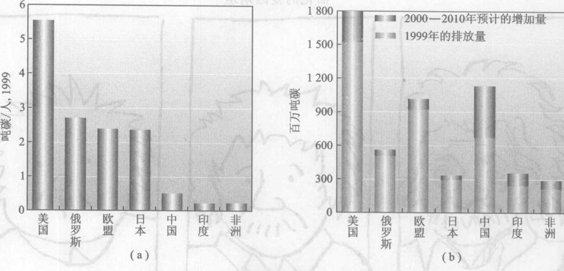

*图 9.25 一些国家和地区燃烧化石燃料产生的碳排放量。(a) 1999 年人均碳排放量；(b) 1999 年全国碳排放量和预计的到 2010 年的增加。*

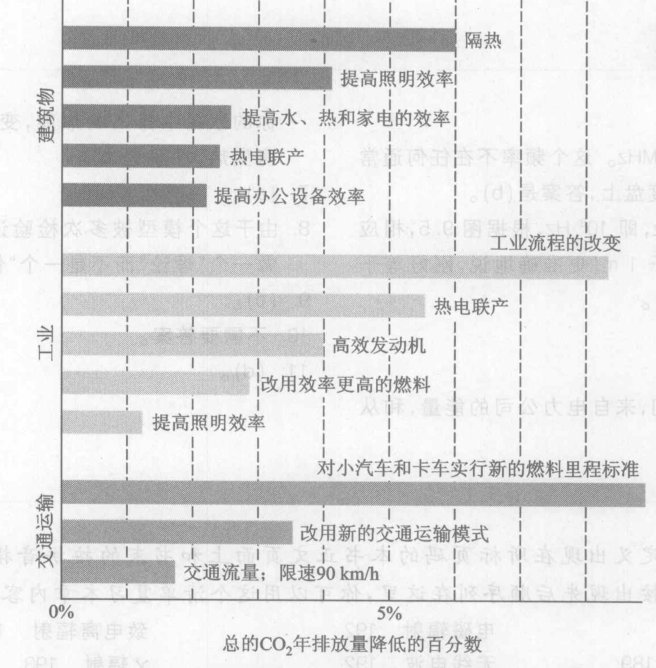

*图 9.26 几种可能的提高能量效率措施对 $CO_2$ 排放量的影响。每种措施如果能大力推行的话，就有可能使美国的总排放量下降图中所示的百分数。图中列出的所有措施总共能够使美国的 $CO_2$ 排放量下降到小于当前排放量的一半。*

*⑭ 一辆普通小汽车每年行驶 20 000 km。假定汽油效率是 12 km/L，这辆汽车每年要用 20 000/12 = 1 600 升汽油。汽油的重量与水的重量大致相同，1 升大约 1 kg。于是，1 600 升汽油重 1 600 kg。从重量上看，汽油中大部分是碳，当汽油与 $O_2$ 结合时，重量增加到大约 3 倍（由于 C 原子和 O 原子的重量大致相等，因此一个 $CO_2$ 分子的重量大约是一个碳原子的 3 倍）。因此，一辆普通汽车每年排放 4 800 kg 的 $CO_2$，这是一辆 1 400 kg 的汽车重量的 3 倍还多。*

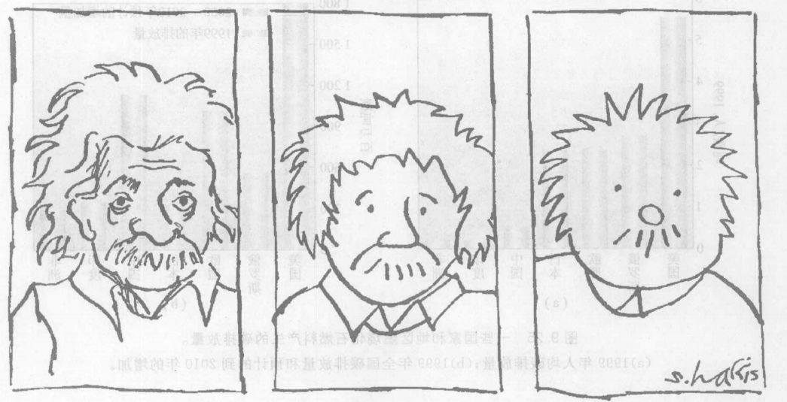

*简化的爱因斯坦*

> **概念检查解答**
> 1. (d)。
> 2. $10^9 \text{ Hz} = 1 000 \text{ MHz}$。这个频率不任任何通常的收音机的刻度盘上，答案是 (b)。
> 3. 频率是 100 MHz，即 $10^8$ Hz，根据图 9.5，相应的波长大约等于 1 m（更准确地说，刚好等于 3 m），答案是 (f)。
> 4. (c)。
> 5. (e)。
> 6. 图 9.9 告诉我们，来自电力公司的能量，和从你的冰箱中排出的热能，变成热能使你的厨房变热，答案是 (b)。
> 7. (a)。
> 8. 由于这个模型被多次检验并证实，它够得上叫做一个“理论”而不是一个“假说”了，(a)。
> 9. (c)。
> 10. 不需要答案。
> 11. (d)。

### 关键概念

下述概念的定义出现在所标页码的本书正文页面上和书末的按拼音排序的术语词汇中。我们将它们按出现先后顺序排列在这里，你可以用这个清单复习本章内容。

*   电磁波 187
*   光的电磁波理论 189
*   光速 189
*   以太 190
*   电磁波谱 191
*   辐射能 192
*   电磁辐射 192
*   无线电波 192
*   红外辐射 192
*   可见辐射 192
*   紫外辐射 193
*   X 射线辐射 193
*   致电离辐射 193
*   $\gamma$ 辐射 193
*   太阳辐射 194
*   臭氧 197
*   痕量气体 197
*   臭氧条约 200
*   温室效应 202
*   温室气体 202
*   全球变暖 203
*   政府间气候变化调研 (IPCC) 204
*   气候模型 204
*   反馈效应 208
*   负反馈效应 208
*   正反馈效应 209
*   预防性原则 210

### 复习题

**电磁波**

1.  列出电荷产生的现象。
2.  什么是电磁波？无线电波和光有什么关系？
3.  电磁场是物理实在吗？说出理由。
4.  描述光的以太理论。
5.  电磁波怎样与牛顿物理学的哲学基础矛盾？

**完整的电磁波谱**

6.  按照波长从长到短的顺序，列出电磁波谱的六个主要波段。
7.  描述下述每种辐射的一个典型的辐射源：X 射线、红外线、$\gamma$ 射线、无线电波和紫外线。
8.  从物理学的角度描述人怎样看见事物。
9.  列出无线电波的几种实际应用。
10. 波谱的哪些部分是致电离辐射？
11. 在太阳辐射中占优势的是波谱中哪三个波段？哪个波段最占优势？

**全球臭氧枯竭**

12. 地球上的臭氧在哪里天然生成？它对人类有什么好处？
13. 什么是 CFC？它们对人类有哪些用处？
14. 概述 CFC 破坏臭氧的过程。
15. 列出大气中的三种痕量气体。
16. 什么是臭氧条约？
17. 列出臭氧枯竭的一些预期的后果。

**全球变暖**

18. 两种主要的温室气体是什么？什么性质使它们成为温室气体？
19. 如果我们从大气中去掉全部 $CO_2$，那将会发生什么情况？去掉全部臭氧呢？
20. 解释温室效应。
21. 造林与毁林哪个会加剧全球变暖？为什么？这也会加剧臭氧枯竭吗？
22. 什么是反馈效应？描述一种与全球变暖有关的反馈效应。
23. 列出人们建议的并已被用来抗击全球变暖的三种措施。

### 思考题

**电磁波**

1.  有什么证据证明传播光波的介质不是空气？
2.  想象空间一个区域，其中没有原子和亚原子粒子。它包含实物吗？它可以包含能量吗？
3.  光与无线电波哪个传播得更快？哪个的波长更长？哪个的频率更高？
4.  光从火星到地球要走 20 分钟（这取决于火星和地球在各自轨道上的位置）。这对火星上的宇航员和地球上的人之间的交谈会有什么影响？假设用一个超强力的望远镜进行可视通信，这会使事情变快吗？
5.  你的房间现在充满了无线电波吗？描述一个可以证实你的答案的简单实验。
6.  如果你的耳朵实际上是检测无线电波而不是声波，那么你的耳朵现在正听到什么？
7.  列出一切电磁波共有的三个特性。
8.  光从太阳传到地球大约需要 8 分钟，而光从太阳以外最近的恒星半人马座 $\alpha$ 星传到地球大约需要 4 年。半人马座 $\alpha$ 星比太阳远多少倍？
9.  用上题的数据计算，到半人马座 $\alpha$ 星大约有多少千米？

**完整的电磁波谱**

10. 光和无线电波之间在物理上有什么不同？加以说明。
11. 即使在地球的日子里你也可能被晒伤。为什么？
12. 如果你躲在玻璃后面，那么即使在晴朗的日子里你也不会被晒伤。为什么？
13. 一个恒星的辐射主要在红外范围。在环绕这个恒星旋转的行星上会进化出什么样的动物？
14. 假设你从太空中看地球上黑夜的那一面。你能用对紫外线敏感的胶片对地球拍照吗？对光敏感的胶片呢？对红外线敏感的胶片呢？如果这样做了，你预计会在照片上看到什么？
15. 太阳辐射使你的皮肤变热，这时发生了什么样的能量转化（从什么形式变成什么形式）？在手电筒中呢？用微波加热食物时呢？
16. 将你的收音机调谐到 FM 刻度盘上的 92 处。收音机在接收什么频率的电磁波？这种波传播得有多快？波长大约是多少？电磁波实际上传到你的耳朵吗？传到你耳朵的是什么？

**全球臭氧枯竭**

17. 下面哪些因素使臭氧问题恶化：燃烧火力发电厂、汽油发动机、CFC 冷却剂、核电站、水电站、家庭太阳能取暖、滥伐森林？
18. 为什么喷罐喷雾剂用不活泼的气体来驱动是很重要的？为什么 CFC 的化学性质不活泼会导致同温层臭氧出现问题？
19. 根据表 9.2，哪一种破坏臭氧的化合物将首先降到无害的水平？要花多长时间？哪一种将是最后一个？要花多长时间？
20. 1950 年氯的浓度是多少？在臭氧条约规定下，预期的最高浓度是多少？预计何时恢复到 1975 年的浓度？如果没有臭氧条约，那时的浓度将会是多少？
21. 在破坏臭氧的各种化学物中，哪一种在大气中的寿命最长？哪一种在问题的原因中最为重要？
22. 臭氧 $O_3$ 一般在同温层仅能存在 100~200 s，然后就与一个氧原子发生反应生成两个 $O_2$ 分子。既然它如此短命，怎么能保护我们免受紫外辐射伤害呢？
23. 到达地球的红外波段的总能量大于紫外波段的。可是相比红外线为什么我们更关注紫外线对健康的直接影响？

**全球变暖**

24. 在地球表面上方 1 $\text{cm}^3$ 正常空气中含有大约 $2.7 \times 10^{19}$ 个分子。利用表 9.1 求 1 $\text{cm}^3$ 空气中 $O_2$ 分子的数目。对 $O_3$ 做同样的计算，$O_3$ 在大气中的浓度是 0.3 ppm。
25. 接着上题的计算，求 1 $\text{cm}^3$ 空气中 $CO_2$ 分子的数目。
26. 下面这些汽车燃料中哪些不会造成全球变暖：天然气、用煤制成的合成汽油、来自太阳能发电厂的电力、来自火力发电厂的电力、来自核电站的电力、由谷物制成的酒精？
27. 烧化石燃料的替代方法有哪些？考虑发电、交通运输和家庭取暖等几方面。
28. 臭氧条约有助于解决全球变暖问题吗？有什么帮助？
29. 下面哪些因素帮助造成全球变暖：火力发电厂、汽油发动机、CFC 冷却剂、核电站、水电站、家庭太阳能取暖、滥伐森林？
30. 已经有人提出，全球变暖会影响海洋中的 $CO_2$ 浓度。在你的日常环境有什么证据证明 $CO_2$ 能溶于水？随着温度上升，你预期溶解的 $CO_2$ 的量是增加还是减少，或者保持不变？如果这个效应发生在海水中，它将对全球变暖表现出正反馈还是负反馈效应？
31. 根据图 9.20，为了找到 $CO_2$ 的浓度超出工业化以前的浓度值 280 ppm 的时期，要从本世纪倒退多远的年代？那个时期 $CO_2$ 的浓度是多少？当时的温度与现在的温度相比如何？
32. 假定图 9.25 中列出的 $CO_2$ 排放量的差异完全是由化石燃料用量的差别造成，那么，一个普通的美国人每消耗 1 J 能量，一个普通的美国人就要消耗多少焦耳矿物能？一个普通的印度人每消耗 1 J 能量，一个普通的日本人要消耗多少焦耳能量？
33. 根据图 9.26，如果大力推行热电联产，美国 $CO_2$ 排放总量总共将会降低多少个百分点？如果列出的交通运输方面的所有三种选择方案都得到大力推行，情况又会怎样？

### 习题

**电磁波**

1.  无线电波从纽约传到旧金山（大约 5 000 km）需要多长时间？
2.  指向月球的雷达发射机在发出信号之后 3 秒接收到反射信号。它离月亮有多远？
3.  光从太阳传到地球需要 8.3 分钟，由此计算地球轨道的半径。
4.  通信卫星在赤道上空半径为 36 000 km（地球半径的 6 倍！）的圆轨道上运行。经由卫星传送的电视信号延迟多长时间？为简单起见，假设信号直上直下。
5.  用公式 $v=f\lambda$（第 8 章）计算 60 Hz 输电线辐射的波长。
6.  计算微波的波长（见图 9.5）。
7.  钠灯光的波长是 589 nm (1 nm 等于 $10^{-9}$ m)。它的频率是多少？
8.  计算频率等于 $6 \times 10^{14}$ Hz 的蓝绿光的波长。这个波长与原子的尺寸（大约等于 $10^{-10}$ m）相比如何？

**臭氧枯竭和全球变暖**

9.  为了更好地了解 1 ppm ($1 \times 10^{-6}$) 的意义，考虑氮原子，它在大气中的浓度是 1 ppm。在地球表面上 1 $\text{cm}^3$ 正常空气中含有大约 $2.7 \times 10^{19}$ 个分子。求 1 $\text{cm}^3$ 正常空气中氮原子的数目。
10. 作出估计。1 升汽油的质量大约是 0.7 kg。假定汽油是纯碳（实际上碳仅占其质量的大约 85%），估计一辆普通的汽车每年排放到大气中的碳的质量。与图 9.25 比较。