# 第四篇 后牛顿宇宙观：观察者的闯入

---

# 第 10 章 狭义相对论

> **大自然和她的规律在黑暗中隐藏，上帝说：“派牛顿去吧！”于是一切豁然开朗！**
> ——亚历山大·蒲柏
>
> **这并不长久；魔鬼大喝一声“派爱因斯坦去！”就一切恢复原样。**
> ——斯夸尔爵士*

本章进入的领域仍然被称为“近代”物理学，尽管它已经有一个多世纪的历史了。“后牛顿物理学”更为准确。19 世纪场的引进是与牛顿力学传统的一次决裂，相对论标志着进一步的决裂。

爱因斯坦的相对论建立在很少几个简单的观念上，它所有的主要原理都是从这几个观念派生出来的。相对论有很难懂的名声，但这实实在在是由于它不合常理，而不是由于任何内在的困难。它的结论违背常识。要弄懂这个理论，主要的要求是心智要灵活。

爱因斯坦创立了两个互有联系的相对论理论。本章讨论的“狭义”相对论使我们关于空间和时间的概念发生了革命性的改变，它又导致我们关于质量和能量的概念的进一步的革命。下一章要讨论的“广义”相对论更进一步革命化了我们关于空间和时间的概念，并且从根本上重新表述了我们看待引力的方式。

在第 10.1 节讲了一些历史背景之后，第 10.2 节讨论看待爱因斯坦关心的现象（运动的相对性）的旧方式（伽利略相对性）。第 10.3 节和第 10.4 节分别讨论相对论的两个关键定律：相对性原理和光速不变原理。第 10.5 节和第 10.6 节讲述爱因斯坦关于时间相对性的预言。第 10.7 节讲述另外两个预言：空间的相对性和质量的相对性。第 10.8 节讲述爱因斯坦关于能量和质量等价的著名预言（爱因斯坦本人认为这是狭义相对论最重要的方面），并且讨论它的深远意义。

## 10.1 爱因斯坦：反传统的叛逆者

由于对光速的精确测量而成为美国第一位诺贝尔物理学奖得主的迈克耳孙，在 1894 年宣称在物理学中作出的基础性发现的年代可能已经过去了：

* *Sir John Collings Squire，20世纪上半叶英国诗人。这两行诗句选自他的一首长诗。——译者注*

---

> **我是在骑自行车时想到这点的。**
> ——爱因斯坦，关于相对论，引自 Quotable cyclist

> **常识只不过是一个人年满十八岁之前心中成见的淀积。**
> ——爱因斯坦

> **为了惩罚我对权威的蔑视，命运使我本人成了一名权威。**
> ——爱因斯坦

“虽然不能绝对肯定在物理科学的未来发展中一定不会再出现比以往更辉煌的奇迹，但似乎可以说，绝大部分基本原理都已牢靠地建立了，进一步的进展主要是探索这些原理对所有那些我们还没有注意到的现象的纯粹应用。……物理科学的未来真理要在第六位小数上去找。”（意即仅仅在于已知结果精度的改进。）

当时许多科学家①都和迈克耳孙抱有相同的信念，认为已知的“大统一原理”——牛顿定律以及热力学和电磁学的定律——是完备的和永恒的。

但是世界很快就变了。1900 年，普朗克引进了一个革命性的新原理：能量量子（见第 13、第 14 章）。不到 5 年之后，在 1905 年，一个很不一样、但是同等革命性的观念在瑞士伯尔尼的一个不起眼的专利局小职员的脑海中构思出来了。他的名字叫阿尔伯特·爱因斯坦（图 10.1 和 图 10.2）。

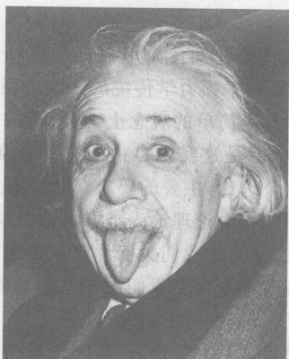

*图 10.1 爱因斯坦绝不是一个板着面孔不苟言笑的人，在他 72 岁生日，人家要他微笑时，他却伸出了舌头。*

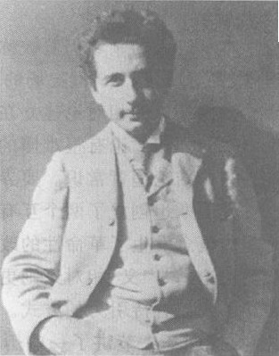

*图 10.2 在苏黎世上大学时的爱因斯坦，这是他创立其狭义相对论之前几年。*

爱因斯坦在许多方面都是一个叛逆者。在他十五六岁时，他对上中学厌倦之极而退了学。这不使任何人惊讶，因为从上小学开始他就是一个平庸的学生和一个空想家。在上学之前他曾是一个迟钝的儿童，迟至 3 岁才开始学说话。他的中学老师很高兴看到他离校，其中一个告诉爱因斯坦他“永远不会有任何成就”，另一个建议他离校，因为他出现在课堂破坏了学生的纪律。爱因斯坦非常乐意地照办了。他像一个典型的退学学生一样消磨了随后的几个月时间，在意大利的阿尔卑斯山区徒步旅行和闲荡。

在决定学习工程之后，他向苏黎世的瑞士联邦工艺大学申请入学，但在入学考试中失败。问题好像出在生物学和法文成绩上。为了准备再次入学尝试，他在一所瑞士中学中呆了一年。这所中学的进步和民主气氛使他生机蓬勃。他后来回忆说，正是在这里，他开始了后来导致相对论的最初想法。大学这一次根据爱因斯坦的中学毕业文凭而接纳他入学。在人们的印象里，他是个讨人喜欢的、平庸的大学生。他定时上咖啡馆（他喜欢在那里讨论哲学和科学）而偶尔上课（因为他更喜欢在物理实验室里消磨时间）。依靠朋友们的帮助（这些朋友把自己系统的听课笔记借给不守规矩的爱因斯坦），他设法通过了必要的考试，最后毕业了。

在 1900 年毕业之后，爱因斯坦申请一个助教职位以进修研究生课程，但是这个职位给了另外某人。在谋求一席教职失败之后，1902 年，一个朋友帮他找到了一份专利审查员的工作。爱因斯坦经常提到在专利局工作的七年对他是一种“解救”，这份工作使他能够交房租，而每天只占用他 8 小时，剩下的时间他就可以对大自然沉思默想。的确是沉思默想。相对论的许多引人注目之处之一就是，它几乎是由爱因斯坦单枪匹马搞出来的。

> 如果我再一度年轻，并且得决定怎样谋生，那么我决不去做一个科学家、学者或者教师。相反，为了希望得到目前环境下还允许的那一点点独立性，我宁愿选择去做一个水管工或者货郎担小贩。
> ——爱因斯坦，晚年的一次谈话

> 如果我是错了，一个教授就足够了。
> ——爱因斯坦在被问到一本书时的回答，在这本书里，100 个纳粹教授谴责爱因斯坦在科学上是错误的

*① 但也是许不是大多数科学家。当时许多物理学家都对物理学的理论基础感到不满，他们拒绝以牛顿力学作为物理学的基础，而是支持电磁学。*

---

## 10.2 伽利略相对性：牛顿物理学中的相对性

下面是一个典型的关于相对性的问题：假设设一个叫薇玛的火车乘客，向着车头的方向掷垒球。莫特则站在地面上看着火车开过。薇玛和莫特都测量垒球的速率（图 10.3）。他们的答案相同吗？如果不同，差多少？想想看。

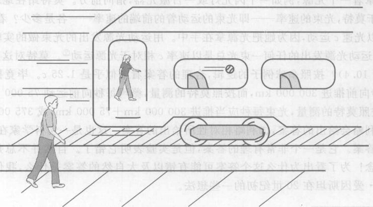

*图 10.3 莫特观察到的薇玛掷球的情形*

现在在物理学中没有什么新鲜东西好发现了。剩下的只有越来越精确的测量。
——物理学家开尔文爵士 1900 年对英国科学促进会的讲话

这个问题涉及两个运动状态不同的观察者。只要薇玛与莫特的运动状态不同，我们就说他们在做**相对运动**。任何一个能够对有关做相对运动的观察者的问题给出一个答案的物理理论，就是一个**相对性理论**。我们可以把火车车厢想象成薇玛的实验室，或她的**参考系**，薇玛在其中进行测量，例如测量垒球的速率。我们还可以把铁道旁的地面想象成另一个参考系，莫特进行测量的参考系。任何相对性理论都要提出的标准问题是，在一个参考系中得到的测量结果与另一参考系中得到的测量结果如何进行比较。至少从伽利略的时代起，科学家们就已经在思考这样的问题了。

为了更具体起见，假设火车以 70 m/s 的速率运动（相当于 250 km/h，这是典型的现代火车的速率）。假设薇玛以 20 m/s 的速率“相对于薇玛”（用火车上的钟和米尺在火车上进行测量而得）向火车的前方掷垒球。那么这个垒球“相对于莫特”（在地面测量）运动多快呢？
……想想看。

好，在每一秒钟内，薇玛测得垒球向着火车前方运动 20 m。但是在莫特看来，垒球在这一秒钟里还要运动附加的 70 m，因为火车本身向前运动了 70 m。因此垒球相对于莫特必须以 90 m/s 的速率运动。对吧？因为伽利略在 4 个世纪以前就已经给出了同样的答策，这种直截了当的、相当直观的形式的相对性叫做**伽利略相对性**。

> **概念检查 1**
> 薇玛掷球正常的速率是 20 m/s。她在以一列 70 m/s 的速率向东行驶的列车中，向车尾的方向掷球。相对于薇玛，球的速率和方向是 (a) 50 m/s 向东；(b) 50 m/s 向西；(c) 20 m/s 向东；(d) 20 m/s 向西；(e) 70 m/s 向东；(f) 70 m/s 向西。

> **概念检查 2**
> 在上一问题中，相对于站在铁轨旁的莫特，球的速率和方向是 (a) 50 m/s 向东；(b) 50 m/s 向西；(c) 20 m/s 向东；(d) 20 m/s 向西；(e) 70 m/s 向东；(f) 70 m/s 向西。

现在我们转到一个类似的例子，但以光束代替垒球。我们在第九章中得知，光是一个电磁波，它以 300 000 km/s 的速率运动，我们用字母 $c$ 作符号表示这个速率。很难想象这样高的速率。一束光从纽约到洛杉矶只要 1/100 秒时间就够了；在 1 秒钟内一束光走过的距离等于环绕地球 7 圈半。和光速相比，火车、喷气式飞机、甚至以 8 m/s 运动的人造地球卫星都只是慢吞吞的。

想象薇玛驾驶一艘实在是很快的飞船，以 75 000 m/s 或 0.25 $c$（光速的 1/4）的速率飞过地球。她手中拿着一个光源，例如一个闪光灯或一台激光器，指向前方。莫特站在地球上。相对于薇玛和相对于莫特，光束的速率——即光束的运动着的前端的速率——各是多少？看来应当是，薇玛测得光束以光速 $c$ 运动，因为她把光源拿在手中。用运动光源发出的光束做的实验已经多次表明这是对的；运动光源发出的一束光总是以速率 $c$ 相对于光源运动②。莫特对这束光测得的速率是多少（图 10.4）？按照垒球例子的逻辑，合理的答案看来应该是 1.25 $c$。毕竟按照薇玛的测量，光束每秒向前运动 300 000 km，而按照莫特的测量，薇玛每秒向前运动 75 000 km，因此看来合理的，按照莫特的测量，光束每秒应当推进 300 000 km + 75 000 km，或 375 000 km。

这是伽利略相对性会给出的答案，伽利略相对性所给出的答案。这也是一切科学家在 19 世纪末不得不放弃的答案。它是一个非常合理的答案，但是实验表明它错了。自然界并不是总是遵从我们认为合理的观念！为了看出为什么这个答案可能错以及大自然的答案是什么，我们在下一节介绍阿尔伯特·爱因斯坦在 20 世纪初的一些想法。

*② 假设光源不做加速运动；见第 10.4 节。*

---

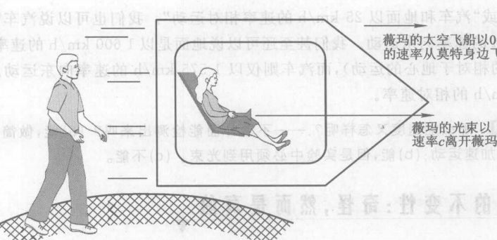

*图 10.4 在莫特看来，薇玛的光束运动得多快？*
*(图中文字: 薇玛的太空飞船以 0.25c 的速率从莫特身边飞过; 薇玛的光束以速率c离开薇玛)*

## 10.3 相对性原理

想象你正搭乘一种平稳运动、没有加速的交通工具，比如一架在水平面内沿直线以不变的速率飞行的喷气式飞机。空中小姐要为你倒一杯咖啡。你该端着你的杯子在什么地方接呢：是壶嘴的正下方，还是考虑到飞机正在飞，而换到别的什么地方呢？换句话说，倒出的咖啡相对于飞机是落在正下方吗？什么时候试试看。或者试着在一辆开动的汽车里把一枚硬币从一只手掉落到另一只手（当然不是由你开车）；接的手是在投的手的正下方吗？

答案是，倒出的咖啡相对于飞机是落向正下方。

你可以在一个平稳运动的参考系内用许多东西做实验：下落的球、无摩擦的气垫（图 3.6）、电流、磁铁，等等。正像倒咖啡一样，你会发现，实验结果和在静止在地面上的参考系中做实验的结果完全相同。

现在想象你是飞机上唯一的乘客，并且飞机的乘客舱没有窗户。你睡了一觉，然后醒来时发现舱中只有你孤身一人。如果不接收来自外部世界的信息③，你能说出你所在的飞机是在正以恒定速率做水平直线飞行还是停在地面上吗？回答是不能。你可以扔一个球，用手倒立，用磁铁吸起大头针，等等，不论你的飞机是在飞还是停在地面上，所有的事情都将同样地发生。

这是对称性原理（第 1 章、第 9 章）的又一个例子。它说，不论你从哪个不做加速运动的参考系观看宇宙，物理定律是相同的。我们把这总结为：

> **相对性原理**
> 任何不做加速运动的观察者都观察到同样的自然定律。换句话说，在一个以不变的速率运动的封闭房子内做的任何实验，都不能告诉你你是在静止站着还是在运动。

除非你看外面，否则你就没法说你运动得多快。这个观念很合常理，而且是爱因斯坦思考相对性的关键。我们把它叫做“相对性原理”，因为它说，一切运动都是相对运动。当我们说“汽车以 25 km/h 的速率向西运动”时，我们的意思实际上是“汽车相对于地面以 25 km/h 的速率向西运动”或“汽车和地面以 25 km/h 的速率相对运动”。我们也可以说汽车静止不动而地面则以 25 km/h 的速率向东运动。我们甚至还可以说地面是以 1 600 km/h 的速率向东运动（由地球自转引起的相对于地心的运动），而汽车则仅以 1 575 km/h 的速率向东运动。重要的实际只是 25 km/h 的相对速率。

> **概念检查 3**
> 那么加速度又怎样呢？——不看外面能检测出来吗？(a) 能，做简单的实验就能判断你是否在做加速运动；(b) 能，但是实验中必须用到光束。(c) 不能。

*③ 来自驾驶员的信息应当算作来自外部世界的信息，因为驾驶员的信息是通过驾驶舱的窗户和无线电接收机进来的。*

---

## 10.4 光速的不变性：奇怪，然而真的

> **上帝是玄妙的，但他不怀恶意。**
> ——爱因斯坦

你是否曾问过自己，如果你能追上一束光同它一道运动，事情将会怎样？有人就问过。16 岁的爱因斯坦就问过自己这个问题，他对这个问题的思索有助于引导他发现他的相对论。在爱因斯坦看来，同一束光一道运动的可能性显得是不可思议的，自相矛盾的。其理由是，对于一个同一束光一道运动的观察者，这束光本身将是静止的。在这个观察者看来，这束光将显得是一个静止不动的电磁“波”！在爱因斯坦看来，这是荒谬的。原因如下。

我们对电磁波（例如光）的理解，是建立在麦克斯韦电磁场理论（第 9 章）之上的。麦克斯韦理论预言，电磁场中的任何扰动，比如一个带电物体运动引起的扰动，一定会作为一个波以速率 $c$ 通过电磁场向外传播。这个特定的速率 300 000 km/s 嵌在麦克斯韦理论之中。

> 你可以看到，爱因斯坦的动力并不是逻辑（在这个词的狭义的意义上），而是一种对美的感觉。他总是在他的工作中寻求美。同样他被一种要发现宇宙中的奇妙而简单的定律的深厚的宗教感所推动的。对这的确是一种宗教体验，最深厚的那种，尽管他不相信一个包含人格的上帝。
> ——B. Hoffman, 数学家和作家，引自 Some Strangeness in the Proportion

爱因斯坦相信，麦克斯韦理论像一切其他自然定律一样，也应当服从相对性原理。因此麦克斯韦的预言，即使在任何一个运动参考系内，都应当是正确的。但是，如果你和一束光一道运动，那么你就会在这样一个参考系里，在这个参考系里这束光是静止的，不以 300 000 km/s 的速率传播。由于光速 $c$ 是嵌在麦克斯韦理论之中的，爱因斯坦得出结论说，每一个观察者都应该观察到每一束光都以速率 $c$ 运动，不论观察者的运动状态如何。不论你运动得多快，一束光永远以速率 $c$ 相对于你从你身边经过。如果每一个观察者看到每一束光都以速率 $c$ 运动，那么就没有人能够追上一束光。

这个想法很简单。但是也很古怪，这就是为什么只有爱因斯坦才能想到它的原因。毕竟，如果你在一束离你而去的光束后面追赶它，常识会告诉你从你的参考系离你而去的光束的速率一定小于 300 000 km/s。而如果你对着向你而来的一束光跑去，常识说这束向你而来的光束的速率一定大于 300 000 km/s。爱因斯坦的想法是如此之古怪，使得 19 世纪与 20 世纪之交时期的几位本来可能发现它的物理学家竟没有发现它。它是作为爱因斯坦理论的基础的第二条重要原理。我们把它总结为：

**光速不变原理**
真空中的光速（和其他电磁辐射的传播速率）对一切不做加速运动的观察者都相同，不论光源或观察者的运动状态如何。

像相对性原理一样，光速不变原理只对不做加速运动的观察者才成立。这是因为，麦克斯韦理论，像大多数物理定律一样，只对不做加速运动的观察者才成立。

为了对这条原理有点体会，我们把它用到几个“思想实验”上，思想实验是原则上可以做、但是由于这种那种原因实际上很难实现的实验。每个实验中都用到一束光，我们取它为一束激光，不过它也可以是闪光灯一次闪光的光束。

假设薇玛以 0.25 $c$ 的速率离开莫特，并且拿着一具激光器指向前方，如图 10.4 所示。在第 10.2 节曾指出，她观察到激光束以速率 $c$ 离她而去。莫特观察到这束激光的速率是多少呢？伽利略相对性和我们的直观回答说是 1.25 $c$ 或 375 000 km/s。但爱因斯坦的相对性则预言答案是 $c$ 或 300 000 km/s！

另一个例子：莫特拿着激光器，用它照向薇玛前进的方向，薇玛以 0.25 $c$ 的速度率离开莫特（图 10.5）。莫特观察到激光束以速率 $c$ 离开他，但是薇玛观察到的它的速率是多少？伽利略相对性和常识预言是 0.75 $c$，但是爱因斯坦预言是 $c$。

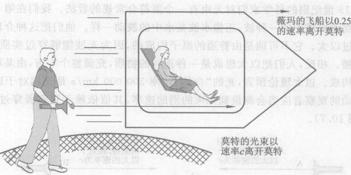

*图 10.5 莫特的光束相对于薇玛的速率是多少？*
*(图中文字: 薇玛的飞船以 0.25c 的速率离开莫特; 莫特的光束以速率c离开莫特)*

为了更突出这条原理的古怪特性，想象薇玛以 0.999 999 $c$ 的速率（即比光速只慢一点点）离开莫特（图 10.6）。莫特打开激光器，看到光束以速率 $c$ 离开他。在莫特看来，薇玛的运动只比光束慢一点点，于是他说薇玛已接近于与光束并驾齐驱了。伽利略相对性预言，薇玛观察到光束经过她的速率只有 0.000 001 $c$。这个速率只有 300 m/s——快的喷气式飞机的速率。但是爱因斯坦的相对性说，薇玛看到光束正好以速率 300 000 km/s 经过她身边，尽管她正在以接近光速的速率离并光源。

你大概已经注意到，我们不让薇玛正好具有速率 $c$。如果我们想象她正好以光速运动，我们就会陷入爱因斯坦注意到的困难：她将观察到一束光静止不动。因此，一个观察者相对于另一个观察者运动的速率可以接近于光速 $c$，但不能完全等于 $c$。下面我们会看到为什么。

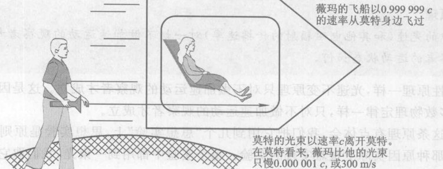

*图 10.6 在薇玛看来，莫特的光束运动得多快？*
*(图中文字: 薇玛的飞船以 0.999 999c 的速率从莫特身边飞过; 莫特的光束以速率c离开莫特; 在莫特看来，薇玛比他的光束只慢 0.000 001c，或 300 m/s)*

**我们怎么知道对一切观察者光都以同样的速率运动？** 光速不变尽管显得很奇怪，却每天都得到证实。不过，大部分实验涉及的是快速运动的微观粒子，而不是宇宙飞船。在 1964 年的一个实验中，一个接近光速运动的亚原子粒子向前和向后都发射电磁辐射。伽利略相对性预言，在实验室测量，向前的辐射应当以比 $c$ 快得多的速率运动，而向后的辐射的运动速率则应比 $c$ 慢得多。但是测量表明，两束辐射相对于实验室都以速率 $c$ 运动。

麦克斯韦和 19 世纪别的科学家们对光束有一个更符合常规的看法。我们在第 9 章解释过，他们相信光波是物质介质中的一种波，正像水波是水中的波动一样。他们把这种介质叫做**以太**。没有人曾观察到过以太。它不可能是由普通的原子构成的，因为光波能够穿过实质上不存在原子的外层空间传播。相反，人们把以太想成是一种连续的物质，充满整个宇宙，由某种未知的、非原子形式的物质构成。以太理论预言，光速 300 000 km/s 是光相对于以太的速率。于是穿过以太运动的观察者应当会测量到光束的别的速率，其值依赖于观察者穿过以太的速率和光束的方向（图 10.7）。

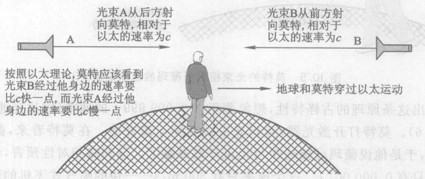

*图 10.7 光的以太理论预言，一个穿过以太运动的观察者会测量在不同方向运动的光束的速率不同。*
*(图中文字: 光束A从后方射向莫特，相对于以太的速率为c; 光束B从前方射向莫特，相对于以太的速率为c; 按照以太理论，莫特应该看到光束B经过他身边的速率比c快一点，而光束A经过他身边的速率比c慢一点; 地球和莫特穿过以太运动)*

但是迈克耳孙和莫雷在 1887 年（爱因斯坦理论建立之前 18 年）做的一个实验提供了证据，表明一切观察者看到光有同样的速率，这同以太理论不符合。迈克耳孙和莫雷对在不同方向向运动的光束的速率进行了精确的比较。由于认为他们的实验室（像地球上一切东西一样）穿过以太运动，他们预言在不同方向运动的光束相对于实验室将有稍微不同的速率。但是他们发现的却是一切光束相对于他们的实验室的速率相同。迈克耳孙和莫雷未能看出这个实验的基础性含义，而是反过来去假定光只是在这个具体实验中表面上显得具有相同的速率，并且从各方面去寻找这种表面现象的解释。迈克耳孙本人感到很失望，因为他们“未能”探测出预期的速率差异。实际上，他们的实验是一个激动人心的新事实的重大突破，即相对于一切观察者光的速率都相同。

令人惊奇的是，爱因斯坦并没有怎么注意迈克耳孙-莫雷实验，虽然这个实验对他的关键想法提供了直接支持。对爱因斯坦而言，由于在本节开头处给出的理由，相对于一切观察者光应当有同样的速率，似乎是一件显然的事情。这是一个真正的空灵的心灵；别的物理学家哪怕有迈克耳孙-莫雷实验也拒绝光速不变的观念，而爱因斯坦尽管没有注意到迈克耳孙-莫雷实验的证据，却承认光速不变！爱因斯坦理论和以太理论是矛盾的，从而在根本上推翻了光波是实物介质中的波的观念。因此光波和其他电磁波必须是非实物的。自从爱因斯坦起，人们就把电磁波看成是电磁场的振动，而电磁场不是由任何实物构成的。我们在第 9 章曾讲过，这和牛顿物理学的唯物主义世界观形成了鲜明的对照*。

光速不变是相对论具有古怪品性的关键性的新原理。自然要对这个原理提出疑问。我们怎么知道它是正确的？答案很简单但是意义深远：光速不变是正确的，因为大自然是这么说的。大量的实验表明，每一束光都以速率 $c$ 运动，不论光源或观察者的运动状态如何。尽管这个古怪的观念侵犯了我们预先抱有的信念，但是决定科学的真理性的，是对自然的观察，而不是我们预先抱有的信念。我们关于运动的先入之见是建立在对运动速率远远小于光速的物体的观察上的，它们在这种速率上是接近于正确的。但是在更高的速率上，我们的先入之见根本就不对了。

爱因斯坦理论的基础是相对性原理和光速不变原理。应当把它们看作是爱因斯坦相对论的第一和第二定律。它们在相对论中所起的作用等同于牛顿定律在牛顿的运动和力的理论中所起的作用：它们构成了理论的逻辑基础，理论的其他所有内容都从它们导出，而它们本身的正确性则直接由观察证实。物理学家把这个理论叫做**狭义相对论**。狭义（特殊）一词把这个理论同爱因斯坦的另一个相关的理论**广义相对论**（第 11 章）区别开来。广义相对论的突出特点是，它允许观察者做加速运动，因此它是一个比狭义相对论更普遍——范围更广阔——的理论。严格说来，地球本身是一个加速参考系，因为它绕地轴自转并且环绕太阳公转。但是这些加速度是如此之小，使得狭义相对论的预言对以地球为基础的观察者是良好的近似。

在本章剩下各节中，我们将探讨狭义相对论的 5 个最重要的预言：时间的相对性，空间的相对性，质量的相对性，作为速率的极限 $c$ 和 $E=mc^2$。

> **概念检查 4**
> 薇玛以 0.75 $c$ 的速率离开莫特。她打开两个激光器，一个指向前方，另一个指向后方。按照伽利略相对性，莫特观察到的向前光束和向后光束的速率应当是多少？(a) 0.25 $c$ 和 1.75 $c$; (b) 1.75 $c$ 和 0.25 $c$; (c) 0.25 $c$ 和 0.75 $c$; (d) 0.75 $c$ 和 0.25 $c$; (e) $c$ 和 $c$。

> **概念检查 5**
> 在上题中，莫特实际观察到的是 (a) 0.25 $c$ 和 1.75 $c$; (b) 1.75 $c$ 和 0.25 $c$; (c) 0.25 $c$ 和 0.75 $c$; (d) 0.75 $c$ 和 0.25 $c$; (e) $c$ 和 $c$。

* *为了维护唯物主义哲学，我国学术界一般认为，电磁场也是一种特殊的物质，场和实物是物质的两种不同的形式。和牛顿物理学相联系的唯物主义哲学叫机械唯物主义。——译者注*

---

## 10.5 时间的相对性

光速的不变性表明，在我们关于空间和时间的直观观念中有什么东西错了。毕竟，速率测量的是在运动的时间单位里一个物体在空间中走多远，因此速率是空间和时间紧密联系的。

> 如果你不问我什么是时间，我对它倒能够心领神会；你一问我，我就不知道该怎么言传了。
> ——圣奥古斯丁，公元 400 年

我们自以为了解什么是“时间”，但是，每当我们开始对时间认真思考，它的意义便模糊起来。由于陷在时间之中，我们无法在一段距离之外来看它的真面目。因此我们定义时间的企图通常成了一个循环定义，隐隐地使用时间的概念来定义时间。爱因斯坦对时间的洞察是，时间是物理的，是物理世界的一部分。正像人们能测量一块石头或一束光的性质一样，也能测量时间的性质。那么我们应当怎样来测量时间的性质呢？用钟！这个答案比它表面看来更深刻。我们测量时间的唯一方法是用真实的、物理的“时钟”，这里说的时钟指的是任何现象，它们经历着相同的重复，如一个来回摆动的摆，地球绕太阳的公转等。从物理学的观点看，一个时钟的概念实际定义了时间。因此为了研究时间的性质，我们必须研究时钟。时钟实际上是怎样运作的？爱因斯坦设法只用狭义相对论的两条基本原理为出发点，来预言时钟的性质。

对于一个普通的上发条的或电池驱动的钟，只用爱因斯坦的两条原理是难以研究的，因为这些钟是如此复杂，包含了弹簧、电流、齿轮，等等。因此爱因斯坦发明了一种简单的钟，实际上是一个简单的思想实验。他的**光钟**（图 10.8）不含机械运动部件；它唯一的运动是一束光的运动。两面平行的反射镜面对面摆放着，一个在上一个在下，一束光在它们之间跳上跳下（来回反射）。虽然对于时钟的制作这不太实际了，但为了我们方便，想象两面镜子相隔 150 000 km，这样光束完整回来一次的时间正好就是 1 秒。我们知道这段时间是 1 秒，这是因为，光速不变原理说，一切光束在 1 秒钟里走 300 000 km。我们假定，这个光钟在每次回来时了滴答响一次。

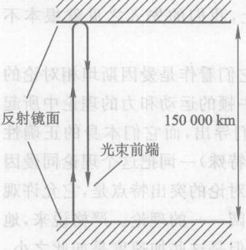

*图 10.8 一架光钟。一束光在两面反射镜之间上下跳动。如果上下两镜之间的距离是 150 000 km，那么光束一次完整回来就需要 1 秒钟。*

我们在薇玛的朝东飞过地球的飞船里安装一架光钟，在地球上的莫特的实验室里安装另外一个，以此开始研究时间的性质。我们先想象薇玛的光钟。薇玛看到她的光束直上直下地来回跳，每滴答一声走过 300 000 km [图 10.9(a)]。够简单的。但是从莫特的观点来看，薇玛的光束的前端不只是上下运动，它还向东运动，因为薇玛向东运动。因此在莫特看来，薇玛的光束的前端是沿着一条对角线路径运动。图 10.9(b) 画出了莫特在三个时刻所观察到的薇玛的飞船：当薇玛的光束的前端位于下镜子的镜面时，当它向上运动到上面镜子的镜面时，以及当它回到下面镜子的镜面时。

由于两面镜子之间的距离是 150 000 km，由图你可以看到，沿着一条对角线的距离必定大于 150 000 km。这意味着，按照莫特的测量，薇玛的光束来回一次走过的总距离必定大于 300 000 km。这并没有什么令人惊奇或微妙之处，伽利略也会这样说的。下面的说法伽利略（和我们的直觉）就不会同意了：光速不变原理说，莫特观察到薇玛的光束也正好以 300 000 km/s 的速率运动（伽利略会说，莫特会观察到薇玛的光束运动的速率比 300 000 km/s 快，因为薇玛也在运动）。由于莫特观察的光束来回一次的距离大于 300 000 km，由此得出，在莫特看来，薇玛的光束来回一次花的时间大于 1 秒！因此，莫特用他的钟测量出，薇玛的钟的两次滴答之间流逝的时间多于 1 秒。莫特认为，薇玛的钟走得太慢。

*图 10.9 (a) 薇玛在飞船里观察她的光钟; (b) 莫特用自己的光钟观察薇玛的飞船和薇玛的光钟的光束，在莫特看来，薇玛的光束的前端沿着如虚线所示的对角线路径运动。*

薇玛的 1 秒不同于莫特的 1 秒。两个观察者对同一事件（薇玛的光束的一次来回）测出的时间间隔不同。时间是相对于观察者的。这很简单，但难以置信。

我们再反过来看。两个观察者对莫特的钟又怎样看呢？在莫特看来，他的钟的光束来回一次走 300 000 km，需要 1 秒时间。但是从薇玛的观点来看，莫特的钟是在向西运动，因而莫特的光束的前端也是沿对角线运动，因此薇玛观察到，莫特的光束来回一次走过的总距离大于 300 000 km。但是因为薇玛看到莫特的光束是以 300 000 km/s 的速率运动，她必定观察到，莫特的钟两次滴答之间流逝的时间多于 1 秒。薇玛认为，是莫特的钟走慢了。

运动的钟走得慢成了一条规则：莫特和薇玛都观察到另一个人的钟走得慢。这就和日常由于一个钟不准而引起的情况不同，在那种情况下，如果以你的钟作标准，我的钟走得慢，那么以我的钟作标准，你的钟一定走得快。这就提出了一个有趣的问题：谁的钟真正走得慢，谁的钟真正走得正确？回答是，薇玛和莫特都正确。薇玛观察到莫特的钟慢了，莫特观察到薇玛的钟慢了，两个观察结果都准确。这种情况是不准确的确的钟引起的；它是时间本身的一种属性。宇宙中并没有一个单一的“真实”时间，并没有“普通时间”；只有薇玛的时间，莫特的时间，和其他一切可能的观察者观察到的时间。

> 横看成岭侧成峰，
> 远近高低各不同。
> 不识庐山真面目，
> 只缘身在此山中。
> ——题西林壁。苏轼(1037-1101)，中国北宋著名诗人

绝对的、真正的和数学的时间自身在流逝着，而且由于其本性在均匀地、与任何外界事物无关地流逝着，又可名为“持续性”；相对的、表观的和通常的时间是持续性的一种可感觉的、外部的、通过运动来进行的量度，人们常常用这种量度，如小时、日、月、年后来代替真正的时间。
——牛顿，对时间是绝对的这一想法的论证

正如你也许会期望的，有一个定量描述时间相对性的公式。④ 表 10.1 给出从这个公式算出的一些数值结果，而图 10.10 是用这个公式画出的曲线图。从表可以看到，即使在人造地球卫星的速率(10~20 km/s)下，这种效应也可以忽略不计。直到速率达到 0.1 $c$（这个速率将使你在大约 1 秒钟内环游世界一圈），这种效应才达千分之五。但是在速率达到光速的很大的百分比时，这种效应变得很大：在光速的 99.9% 的速率下（图上未画出），莫特和薇玛的 1 秒由另一观察者测量将长达 22 秒多。时间的相对性也叫做**时间延缓**，因为一个运动时钟上 1 秒的时间间隔由另一观察者（时钟相对于他运动）来测量就膨胀或延缓为多于 1 秒。

> **我不对时间、空间、地点和运动下定义，因为它们是人人熟知的。**
> ——牛顿

**表 10.1 时间的相对性：一些定量预言**

| 相对速率 / ($km \cdot s^{-1}$) | 相对速率 (和光速 $c$ 之比) | 观察者测量得到的相对于他运动的时钟的一次滴答声的时间长度 |
| :--- | :--- | :--- |
| 0.3 | $10^{-6}$ | 1.000 000 000 000 5 |
| 3 | $10^{-5}$ | 1.000 000 000 05 |
| 30 | $10^{-4}$ | 1.000 000 005 |
| 300 | 0.001 | 1.000 000 5 |
| 3 000 | 0.01 | 1.000 05 |
| 30 000 | 0.1 | 1.005 |
| 75 000 | 0.25 | 1.03 |
| 150 000 | 0.5 | 1.15 |
| 225 000 | 0.75 | 1.5 |
| 270 000 | 0.9 | 2.3 |
| 297 000 | 0.99 | 7.1 |
| 299 700 | 0.999 | 22.4 |

下面让你对这些速率有点印象：0.3 km/s 是典型的亚音速喷气式飞机的速率，3 km/s 是强力来复枪子弹速率的两倍，30 km/s 大致是地球在其环绕太阳的轨道上的速率，3 000 km/s 的速率可以使你在 1 秒钟内横越美国，而 30 000 km/s 则可以在大约 1 秒钟内绕地球一圈。显然，如果速率不是非常大，相对论效应都很小。

虽然我们研究时间的相对性用的是光钟，但所得的结论对每种时钟——每种有规律的重复现象——都成立。爱因斯坦之所以考虑光钟，只是为了要弄清楚他的理论的两条原理在时间方面有哪些含义。每种时钟的行为必定和光钟的行为相同，因为它们测量的是同一对象：时间。而且，在一段时间间隔里出现的每一种现象，必然也都有这种行为方式。例如，想象一支冰淇淋卷筒在融化。假设你能使冰淇淋刚好在 10 分钟内融化，并且薇玛和莫特各有一支这样的冰淇淋。这些冰淇淋卷筒就是一个钟，一个 10 分钟滴答一次的钟。

④ 应用毕达哥拉斯定理（一个直角三角形的两个直角边的长度 $a$、$b$ 与斜边的长度 $c$ 有关系 $c^2=a^2+b^2$），可以从图 10.9 导出这个公式。这个公式是 $T=T_0 / \sqrt{1-v^2/c^2}$，其中 $v$ 是相对速率，$T_0$ 是薇玛观察到的她的钟的两次滴答声之间的时间（$T_0=1$ s），而 $T$ 是莫特观察到的薇玛的钟的两次滴答声之间的时间。

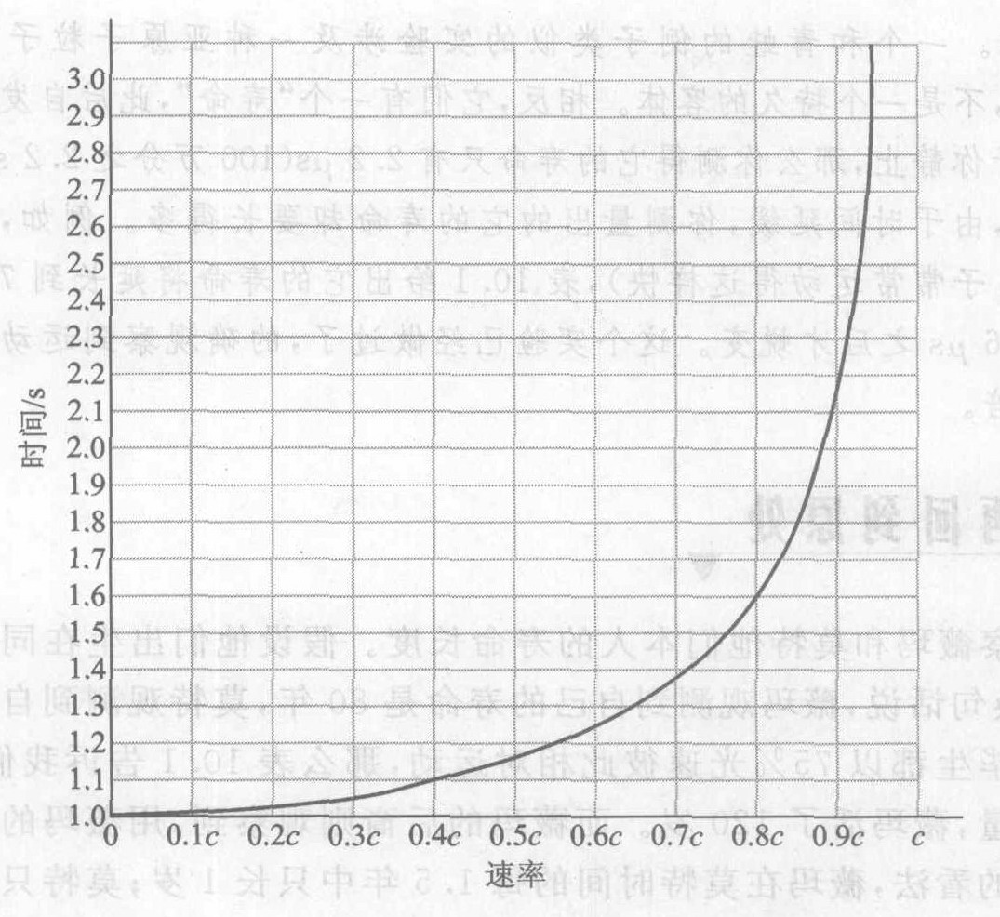

*图 10.10 时间的相对性。图中曲线表示一个运动时钟的两次滴答声之间的时间间隔（在固定于钟上的参考系中为 1 秒）与时钟相对于观察者运动速率之间的关系。*

> **需要极不平凡的心智，才能对显而易见的事物作出分析。**
> ——怀特海，20 世纪哲学家

> **概念检查 6**
> 莫特和薇玛有完全相同的 10 分钟融化的卷筒冰淇淋。薇玛以光速 75% 的速率经过莫特身边。用表 10.1 预言莫特所测量的他和薇玛的卷筒冰淇淋融化的时间。(a) 莫特的卷筒 10 分钟，薇玛的卷筒 10 分钟; (b) 10.3 分钟，10 分钟; (c) 10 分钟，10.3 分钟; (d) 15 分钟，10 分钟; (e) 10 分钟，15 分钟。

代替冰淇淋卷筒，他们也可以用青蛙。假设你们当地的生物部门孵化了一批十日蛙，其寿命保证为 10 天。生物学寿命也是发生在时间之中的，因而这些青蛙也可以想象成一种时钟。因此，如果薇玛以 75% 光速在莫特身边经过，莫特会说薇玛的青蛙存活 15 天而自己的青蛙只活 10 天（见概念检查 6）。而薇玛呢，她也说莫特的青蛙存活 15 天而自己的青蛙只活 10 天。因此每个人都看到他们自己的青蛙先死。而两个观察都是准确的！怪哉！

当我们问“究竟是谁的青蛙真的先死？”的时候，我们没有说出来的一个埋藏在心底的信念仍然是，只有一个单一的、普遍的、“真实的”时间。但是并没有这样一个时间。有的只是莫特的时间，薇玛的时间，和每一个其他个别观察者的时间。

**我们怎么知道对不同的观察者时间的流逝不同？** 通过观测快速运动的亚原子粒子，时间的相对性已在实验室里一再被证实。一个和青蛙的例子类似的实验涉及一种亚原子粒子“$\mu$ 子”。$\mu$ 子和大多数通常的物质不同，不是一个持久的客体。相反，它们有一个“寿命”，此后自发蜕变为别的粒子。如果一个 $\mu$ 子相对于你静止，那么你测得它的寿命只有 2.2 $\mu$s（100 万分之 2.2 s）。但是一个相对于你快速运动的 $\mu$ 子，由于时间延缓，你测量出的它的寿命却要长得多。例如，在 99% 光速下（在高能物理实验室中 $\mu$ 子常运动得这样快），表 10.1 给出的它的寿命将延长到 7.1 倍，于是它将在经过 $7.1 \times 2.2 = 15.6\ \mu$s 之后才蜕变。这个实验已经做过了，的确观测到的 $\mu$ 子的寿命正好延长预言的那么多倍。

---

## 10.6 时间旅行：你不能再回到原处

你也许已经猜到，下一步要考察薇玛和莫特本人的寿命长短。假设他们出生在同一时刻⑤并且他们的寿命长 80 年。换句话说，薇玛观测到自己的寿命是 80 年，莫特观测到自己的寿命是 80 年。如果薇玛和莫特毕生都以 75% 光速彼此相对运动，那么表 10.1 告诉我们，莫特的后裔观察到，用莫特的钟测量，薇玛活了 120 岁。而薇玛的后裔则观察到，用薇玛的钟测量，莫特活了 120 岁。按照莫特的看法，薇玛在莫特时间的每 1.5 年中只长 1 岁；莫特活了 80 个莫特年就死了，薇玛则活了 120 个莫特年才死，但是她的相貌则只是一个只有 80 岁的人的相貌。按照薇玛的看法，所有这一切都倒过来。而他们两人都是正确的。真是不可思议！

> **概念检查 7**
> 当薇玛看到自己是 60 岁时，她看到莫特是 (a) 30 岁; (b) 40 岁; (c) 60 岁; (d) 80 岁; (e) 90 岁。

这引出了一个令人困惑的问题。假设莫特和薇玛同时出生在地球上，比方说是一对孪生子，然后薇玛登上一艘宇宙飞船，用很快的速率飞到一个遥远的星球，然后回到地球上。这一段情节同上一节的情节不同，因为薇玛和莫特开始和末了都在同一个参考系中。一旦他们回到一起，他们一定会对谁年龄更大有一致看法，因为在任何单一参考系中只有一个单一的时间。这一对孪生子中哪个年龄更大一些，还是他们的年龄将是一样大？

> **关于我们常识的证言在高速下是可疑的。**
> ——萨根，天文学家和科普作家

我们记得，狭义相对论只适用于非加速的观察者。但是在这段关于两个孪生子的故事中，薇玛必须先离开地球，进行剧烈的加速，转弯飞向地球，然后再停下来停在地球上。由于这一次旅行必然包括三次剧烈的加速过程，因此狭义相对论不适用于薇玛的观察。但是狭义相对论的确适用于莫特的观察，因为他并没有加速。我们已经看到，这个理论预言他观察到薇玛在她的整个旅程中老得慢，因为她相对于他运动。例如，如果薇玛以 0.75 $c$ 的速率运动，他将观察到，薇玛的每一年相当于他的 1.5 年（表 10.1）。如果莫特测量的薇玛的旅行花了 60 年，那么他观察到薇玛的时间只流逝了 40 年。因此他看到，当他们又在地球上聚首时，他是 60 岁而她则只有 40 岁！薇玛的观察必定与此一致，因为他们俩现在是在同一参考系中。用这个办法你可以变得比你的孪生兄弟年轻 20 岁。

**我们怎么知道时间旅行是可能的？** 这个结论已在实验上得到验证，不过没有这么充满戏剧性。把原子钟放置在喷气式飞机商务航班上环绕世界飞行。虽然理论预言的由此产生的时间差只有 1 秒的多少分之一，但是它是可以用高精度的钟测量出来的。正如理论预言的，做过这种旅行的钟在回来后比那些待在家里的钟“年轻”（滴答次数少一些）。流逝时间是定量差别与理论预言的完全相同。我们即将看到，这样的实验表明，时间旅行是可能的，不过只能去到未来。

这就开辟了一些令人惊讶的可能性。假设你母亲离开地球到织女星去，织女星是一颗和太阳相似的恒星，比较靠近太阳，可能也带有一个行星系。到织女星的距离是 26 光年，它的意思是，光从这里到织女星花 26 年。1 光年是光走 1 年的距离。

假设你母亲的飞船的平均速率极大，达到 0.999 $c$。她在环绕织女星的一颗行星上呆了 3 年后回家。由于她旅行的速率接近光速，在地球上测量起来，她的每一单程旅途花的时间比 26 年略多一点点。因此从地球上看，她一共去了大约 $26+3+26=55$ 年多一点。如果你母亲离开地球时你是 5 岁，你母亲是 30 岁，那么她回来时你将是 60 岁。但是你母亲不再是比你大 25 岁！表 10.1 告诉我们，在她以 0.999 $c$ 进行太空旅行的 52 个“地球年”中，“地球时间”每 22.4 年她只老 1 岁。因此她在 52 个“地球年”里只老了 $52/22.4=2.3$ 岁。包括在织女星系上度过的 3 年，她在整个旅行中只老了 5.3 岁。因此她回来时年龄将是 35.3 岁，而你却是 60 岁！用这种方法你能变得比你母亲年龄更大。

> 不同的地点有不同的时间的观念是一个很难的观念，但是爱因斯坦利用的就是这个观念，而且它是正确的——不管你信不信。
> ——费曼，物理学家

这是一形式的时间旅行。你母亲对未来做了一次旅行。只要飞得更快，比方说速率达到 0.999 9 $c$，她还可以深入未来更远，走进未来成百上千年。但是这是一条单行道。你不能再回到你告别的过去。

时间延缓使人类可以在一生的寿命期限内旅行到遥远的星球。假设你要以相对于地球为 0.999 $c$ 的速率去一个离地球 200 光年的星球。虽然在地球钟上测得这次旅行用了 200 多年一点时间，但是在你的飞船里测量，它只用了你 $200/22.4 \approx 9$ 年时间。在你到达这个星球时，地球上已经流逝了两个世纪。即使你一点不耽搁，立即启程赶回地球，你也会在往返旅途上向未来做一次四个世纪的时间旅行，而你只长了 18 岁。在地球上，你将是一件四个世纪前遗留下来的古董。

> 一次我曾就一个理论问爱因斯坦，他说道，“当我评价一个理论的时候，我会问自己，如果我是上帝，我会以这个方式创造世界吗？”如果这个理论不具有上帝要求的那种简单的美，那么这个理论至多只是一个暂时的理论。
> ——B. Hoffman

> **概念检查 8**
> 以下的情况哪一种是物理上可能的？你母亲在你出生后离开地球，并且 (a) 在你出生前回到地球; (b) 在她出生前回到地球; (c) 回到地球时比你年轻; (d) 回到地球时比你年老; (e) 回到地球时比她离开时更年轻; (f) 回到地球时比她离开时更年老。

*⑤ 你可能会对“在同一时刻”是什么意思感到疑惑，因为我们假设莫特和薇玛是在不同的参考系中。为了使事情简单化，设莫特和薇玛这时刚刚在彼此身边经过。于是“在同一时刻”意味着，当二者中的一个来到世上时，他或她看到另一个也来到世上。*

---

## 10.7 空间和质量的相对性

什么是空间？正像时间是“用钟测量出的东西”（第 10.5 节）一样，空间是用尺子测量出的东西。

莫特应当进行什么操作来测量比方说一扇窗户的宽度呢？对于一扇相对于莫特静止的窗户，办法是沿窗户放一根测量米尺并且比较窗户的两端与尺上的刻度。如果窗户相对于莫特运动，他应当继续使用固定在他的参考系中的米尺，因为他想要知道的是运动的窗户在他的参考系中测量的长度。如果待测量的长度沿运动方向，莫特对窗户两端的位置的测量必须同时进行，否则在两次测量之间的时间差里窗户的位置将会移动，因而莫特将测量不到真正的宽度。

为了保证对窗户前后两端位置的测量是同时的，莫特必须用两个钟——每个端点一个。这意味着对一个运动物体的宽度的测量同时也是对时间的测量；时间和空间是彼此纠缠在一起的！既然时间是相对的，那得空间也是相对的，就不使人吃惊了。我们将不详细讲述证明这一结论的论据；它同第 10.5 节中证明运动时钟走得慢的论据相似。更具体地说，爱因斯坦的理论预言，莫特观察到窗户沿其运动方向的宽度，要比和窗户一起运动的薇玛测量到的宽度短（图 10.11）。这个效应叫做**长度收缩**。在垂直于窗户运动方向的方向上没有长度缩短。

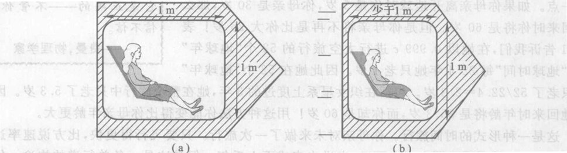

*图 10.11 薇玛飞船上的窗户 (a) 薇玛测得的; (b) 莫特测得的*

与时间延缓一样，长度缩短效应也是双向的：正如莫特发现薇玛的窗户缩短一样，薇玛也发现莫特的窗户缩短。

定量的分析导致一个公式，可用图 10.12 中的曲线表示。⑥ 图上面的是一个 1 m 长的物体比如一根米尺，放在平行于其运动的方向，对于物体不同的速率，公式所预言的它的长度。像时间延缓一样，长度缩短在速率低于 0.1 $c$ 时很难检测到，但是在更高的速率上变得很明显。

长度缩短并不是只发生在米尺上的某种事件。由于空间是由米尺定义的，因此是空间本身在缩短。正如薇玛的时间流逝不同于莫特的时间流逝一样。我们必须说“薇玛的空间”和“莫特的空间”，而不是一个单一的、普遍的空间。对于不同的观察者，空间是不同的。空间是相对的。

*⑥ 这个公式是 $L=L_0 \sqrt{1-v^2/c^2}$，其中 $L_0$ 是物体的静止长度（相对于物体静止的观察者所测量的长度），而 $L$ 是物体以速率 $v$ 运动时的长度。*

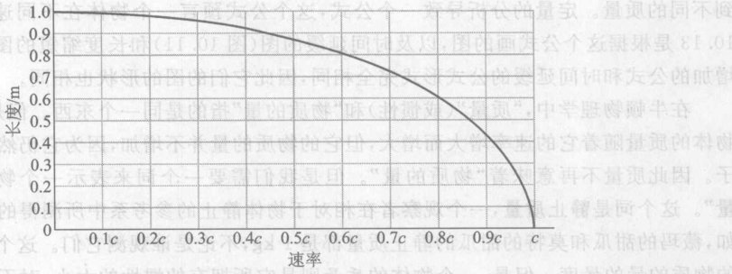

*图 10.12 空间的相对性。相对论预言的在米尺与观察者不同的相对速率下米尺的长度。*

> **概念检查 9**
> 薇玛测量出她的飞船有 100 m 长，10 m 高。她的飞船能够以足够大的速率在莫特身边飞过，使得在莫特看来，飞船的长度等于它的高度吗？(a) 能够，需要飞船以 0.9 $c$ 的速率运动; (b) 能够，需要飞船以 0.99 $c$ 的速率运动; (c) 能够，需要飞船以 0.1 $c$ 的速率运动; (d) 不能，因为她必须以正好等于光速的速率运动才能做到这一点; (e) 不能，因为物体不会改变形状。

爱因斯坦的新原理光速不变原理，几乎影响到物理学中的每一件东西：时间，空间，等等，包括牛顿运动定律（第 4 章）。这条定律说，一个物体的加速度等于施加在物体上的净力除以物体的质量，用符号表示就是
$$a=F/m$$

这意味着，如果对一个物体施加一个不变的力，这个物体应该保持一个不变的加速度。最终这个物体将以光速运动并且仍然加速。搭乘这样一个物体的观察者可以赶上并且超过一束光。

因此牛顿运动定律和相对论是不相容的！显然，相对论对牛顿定律的改变，应当会阻止把物体加速到光速。为了描述牛顿运动定律的这种变化，我们想象莫特和薇玛（她正飞过莫特身边）各有一个完全相同的 1 kg 的物体，比方说 1 kg 的甜瓜。如果莫特用 1 N 的力推他的甜瓜，他会发现他的甜瓜得到的加速度正如牛顿运动定律所预言的是 1 m/s²。如果他再用同样的 1 N 的力去推薇玛的甜瓜（它正经过他身边），牛顿运动定律预言得到的加速度也将是 1 m/s²，但是相对论预言⑦薇玛的甜瓜的加速度小于 1 m/s²。像别的相对论效应一样，这个效应在通常速率下小得可以忽略不计，但是在与光速可比较的速率下很明显。

从莫特的观点来看，1 N 的力作用于两个甜瓜上产生的加速度不同，薇玛的甜瓜产生的加速度小于他自己的甜瓜产生的加速度。从他的观点看，薇玛的甜瓜比他的甜瓜有更大的惯性（我们还记得一个物体的惯性是它反抗加速的能力）。但是这等于说薇玛的甜瓜有更大的质量，因为质量的基本意义就是“惯性的大小”（第 4 章）。换句话说，莫特测量到薇玛的甜瓜比他自己的甜瓜有更大的质量，尽管它们是完全一样的甜瓜。和惯性一样，这个效应是双向的：相对于薇玛，她自己的甜瓜的质量是 1 kg，但是莫特的甜瓜质量却大于 1 kg。

*⑦ 其原因是莫特看到薇玛的甜瓜的加速度将减小，因为距离缩短而时间间隔膨胀。*

---

质量是相对的：一个物体的质量随其速率的增大而增大，因此不同的观察者对同一物体测量到不同的质量。定量的分析导致一个公式，这个公式预言一个物体在不同速率下的质量⑧。图 10.13 是根据这个公式画的图，以及时间延缓的图（图 10.11）和长度缩短的图（图 10.12）。质量增加的公式和时间延缓的公式形式完全相同，因此它们的图形形状也相同。

在牛顿物理学中，“质量”（或惯性）和“物质的量”指的是同一个东西。但是在相对论中，一个物体的质量随它的速率增大而增大，但它的物质的量并不增加，因为它仍然包含着同样那些原子。因此质量不再意味着“物质的量”。但是我们需要一个词来表示一个物体所含的“物质的量”。这个词是**静止质量**，一个观察者在相对于物体静止的参考系中所测得的该物体的质量。例如，薇玛的甜瓜和莫特的静止质量都是 1 kg，不论是谁观测它们。这个数，1 kg，是它所含的物质的量的量度。但是，一个物体的**质量**则是它所拥有的惯性的大小，对不同的观察者它是不同的。一个运动很慢的物体的质量和静止质量实质上是相同的，但是一个高速物体的质量比它的静止质量大得多。

**我们怎么知道质量随速率增大？** 在高能物理实验室中，相对论性质量增加是司空见惯的事。一个亚原子粒子可以加速到如此接近光速的速率，使得它的质量比其静止质量大几千倍。检验这个预言的一个办法是对一个快速运动的粒子施加电力或磁力，以弯曲它的路径，并测量所得路径的曲率。如果快速运动的粒子真的有更大的质量，那么它的路径就将弯得小一些，因为它们更大的惯性试图保持它们沿直线运动。测量表明，快速运动粒子路径的曲率比如果不存在相对论质量增加的情况下的弯得少一些，并且弯曲的程度与爱因斯坦的预言一致。

虽然时间、空间和质量是相对的，但并非一切东西都是相对的。实际上，爱因斯坦的理论的两条基本原理告诉我们，对于每一个观察者，任何光束的速率都相同，物理定律也是如此。

相对论性质量增加说明了为什么不能把物体加速到光速。在高速下，一个物体的质量变得非常之大，随着速率趋于 $c$ 而无限增大（图 10.13）。最后，进一步加速所儒的一个物体的力变得如此之大，使得此物体的环境无法提供。但是有一件东西是以光速运动的，那就是光本身。事实上，光绝不以小于 300 000 km/s 的速率运动⑨。当你拧亮一只白炽灯时，产生的光并不是从零加速到光速；相反，它产生的那一刻便精确地以光速运动。光和任何实物物体都不同。当你把一个实物物体放在你面前，它有**静止质量**，因为如果有，那么相对论质量增加将使它们以光速运动时的质量变成无穷大。任何以速度 $c$ 运动并且没有静止质量的东西，像光或别种形式的辐射，都属于**辐射**（或场）一类。区别实物和辐射是很有的：实物有静止质量，运动速率永远达不到光速；辐射没有静止质量，永远以光速运动。

> **概念检查 10**
> 下面这些东西，哪些是实物的一种形式？(a) 红光; (b) 图 9.3 中画的看不见的波; (c) 汽车排出的看不见二氧化碳气体; (d) 在电视显像管上生成图像的电子束; (e) $\gamma$ 射线。

*⑧ 这个公式是 $m=m_0 / \sqrt{1-v^2/c^2}$，其中 $m_0$ 是物体的静止质量（相对于物体静止的观察者测得的质量），$m$ 是物体以速率 $v$ 运动时的质量。*
*⑨ 但是，光通过透明物体如水或玻璃时的平均速率有时远小于光速。在通过实物时，光因被原子吸收而暂时消失，然后又被原子发射而重新生成。只要光实际上是作为光存在，它就以 300 000 km/s 的速率运动。*

---

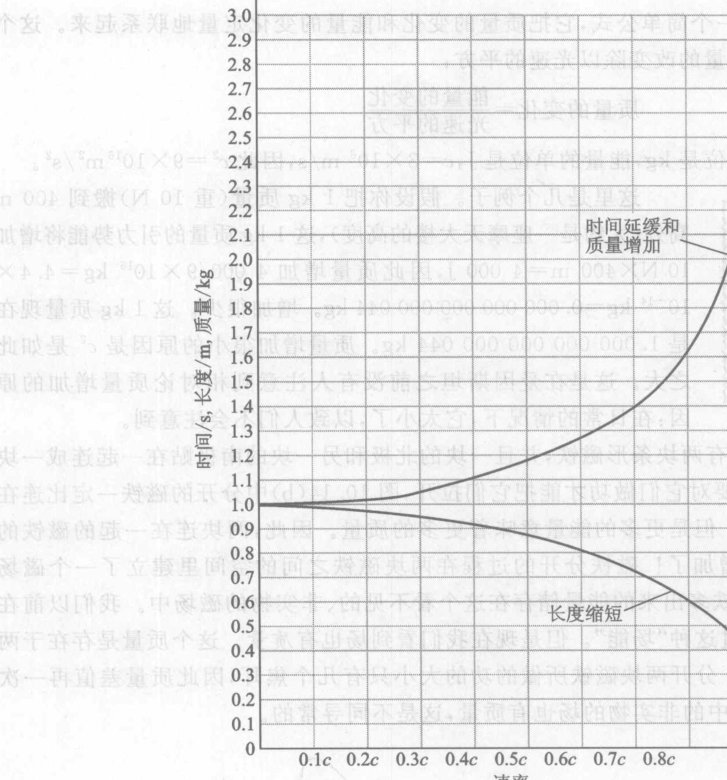

*图 10.13 相对论质量增加、长度缩短和时间延缓。图中的曲线表示一个运动时钟上一次滴答持续的时间长度（在钟的参考系内为 1 秒）、一条运动米尺的长度和一个运动的千克原器的质量（在不同的相对速度下）。*

## 10.8 $E=mc^2$：能量有质量，质量有能量

随着一个物体的加速，它的动能就增加，而且我们刚刚又学到，它的质量也增加。因此至少就动的物体而言，能量增加和质量增加是同时并进的。爱因斯坦从相对论和能量守恒定律出发，发现质量和各种形式的能量都以这种方式相联系。你可以通过简单地把一个系统举高给它引力势能、加热给它热能、拉伸给它弹性势能或者给予它任何其他形式的能量，来增加这个系统的质量。

这使你感到惊讶吗？我对此感到惊讶。如果你拉伸一条橡皮筋，你并不期望它的质量会增加。毕竟它仍是同一条橡皮筋。这是一个新结果：一个系统的能量的任何增加，都会带来它的质量的增加，不论能量的增加取哪种形式。

> **爱因斯坦把 $E=mc^2$ 这个公式看作狭义相对论的最重要的单项结果。**
> ——Ralph Baierlain，物理学家及 Newton to Einstein: The Trail of Light 一书的作者

爱因斯坦的分析得出一个简单公式，它把质量的变化和能量的变化定量地联系起来。这个公式说，质量的改变等于能量的改变除以光速的平方：
$$质量的变化 = \frac{能量的变化}{光速的平方}$$
在标准的米制中，质量的单位是 kg，能量的单位是 J， $c=3 \times 10^8$ m/s，因此 $c^2=9 \times 10^{16}$ m²/s²。

这里是几个例子。假设你把 1 kg 质量（重 10 N）搬到 400 m 高处（大约是一座摩天大楼的高度），这 1 kg 质量的引力势能将增加 $10\ \text{N} \times 400\ \text{m} = 4\ 000$ J，因此其质量增加 $4\ 000 / 9 \times 10^{16}\ \text{kg} = 4.4 \times 10^{-14}$ kg = 0.000 000 000 000 044 kg。增加很少。这 1 kg 质量现在是 1. 000 000 000 000 044 kg。质量增加很小的原因是 $c^2$ 是如此之大。这是在爱因斯坦之前没有人注意到相对论质量增加的原因：在日常的情况下，它太小了，以致人们不会注意到。

> **当我想起物质时，通常我想到的场。与其说我们是粒子，不如说我们是场。**
> ——戴森，物理学家

第二个例子是，假设你有两块条形磁铁，并且一块的北极和另一块的南极贴在一起连成一块磁铁 [图 10.14(a)]。由于对它们做功才能把它们拉开，图 10.14(b) 中分开的磁铁一定比连在一起的磁铁有更多的能量。但是更多的能量意味着更多的质量。因此，两块连在一起的磁铁的总质量只是由于被拉开而增加了！磁铁分开的过程在两块磁铁之间的空间里建立了一个**磁场** [图 10.14(b)]。分开的磁铁多出来的能量储存在这个看不见的、非实物的磁场中。我们以前在电磁辐射的能量中已遇到过这种“场能”。但是现在我们看到场也有质量。这个质量是存在于两块磁铁之间的空虚空间里。分开两块磁铁所做的功的大小只有几个焦耳，因此质量差值再一次非常之小。但是，空虚空间中的非实物的场也有质量，这是不同寻常的。

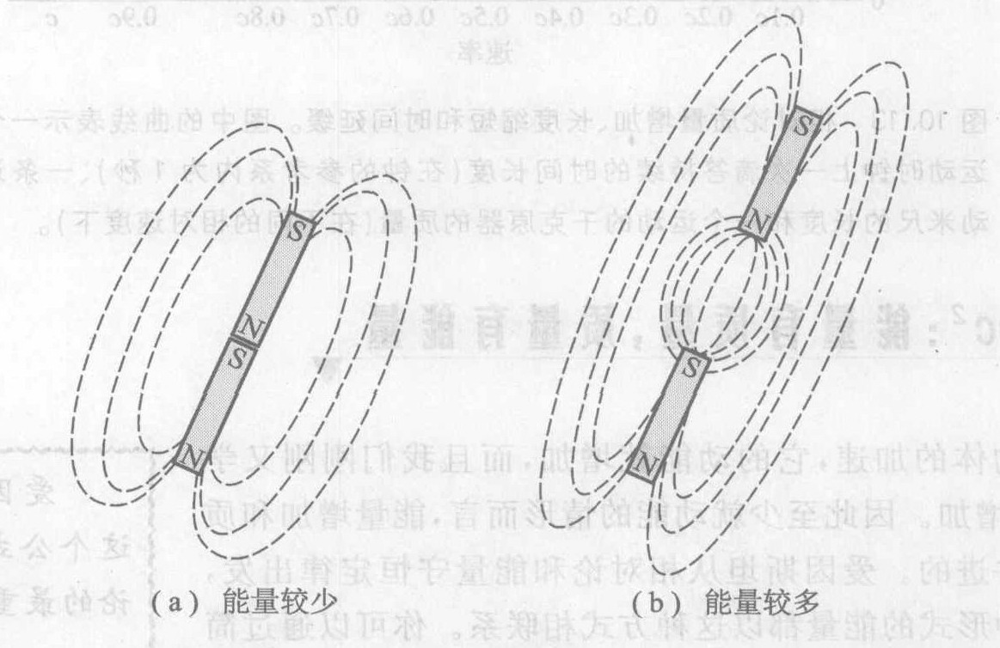

*图 10.14 (a) 磁铁贴在一起; (b) 分开的磁铁比 (a) 中连在一起的磁铁有更多的能量，因而有更大的质量；(b) 中多出的能量和质量存在于看不见的非实物的磁场中，磁场在图中用虚线表示。*

现在转向这个效应更明显的例子，原子核反应涉及自然界中最强的力，即在原子核内作用的力（第 15 章和第 16 章）。当前，关于核反应我们需要知道的只是，它们和化学反应相似，但它们涉及的是原子核结构的变化，而不是电子轨道的变化。例如，在核电站反应堆中和核武器中，铀元素发生一种叫做**核裂变**的核反应，在这个反应中，每个铀原子的原子核都发生变化⑩。裂变反应有一点像燃烧，但是其中涉及的力是如此之强，使得它产生的热能比任何化学反应中产生的热能大得多。因此在把热能移走之后，静止质量的损失也大得多。如果 1 kg 铀发生裂变，其静止质量损失大约是 0.001 kg (1 g)，这个质量减少达到了 0.1%，容易检测得到。这可以用实验检验，并且结果和爱因斯坦的预言一致。

19 世纪的科学家相信，物质是不可摧毁的，换句话说，在一切自然过程中静止质量都守恒。这当然是有它的道理的。从古希腊唯物主义者（第 2 章）的时代起，大部分科学家就感到物质是不可摧毁的——虽然它的形式可能改变，它的总量不会变化。19 世纪的化学家进行了高精度的质量测量，得出结论说，即使在高能化学反应中，静止质量也守恒。但是爱因斯坦的相对论否定物质守恒。不论是在化学反应中，还是在橡皮筋的拉伸或其他过程中，物质——即静止质量——都不守恒。但是在这些过程中静止质量的变化是如此之小，是实验检测不出来的。但是，在高能过程例如核裂变中，静止质量的变比容易检测出来，其结果表明物质不守恒。

现在我们把这个推理更向前推一步：爱因斯坦相信，这个结果不仅适用于质量的变化，还可推广到任何系统的全部质量。换句话说，

$$任何系统的总质量 = 该系统的总能量 / c^2$$

或者用符号表示：
$$m = \frac{E}{c^2}$$

这就是爱因斯坦的著名公式
$$E = mc^2$$
$$任何系统的总能量 = 该系统的总质量 \times c^2$$

因此一切能量都有质量，并且一切质量都有能量。由于能量是做功的本领，而质量是惯性，公式 $E=mc^2$ 的实用意义是，任何质量为 $m$ 的系统应当能够做 $mc^2$ 单位的功，并且能量为 $E$ 的系统的惯性为 $E/c^2$。

**我们怎么知道 $E=mc^2$？** 如果爱因斯坦是正确的，那么应当有某种物理过程，能够从任何质量为 $m$ 的物体获得 $mc^2$ 单位的功。这样的过程已经发现了，它叫做**物质-反物质湮没过程**。在构成通常物质的质子、中子和电子之外，物理学家还发现了另外三种实物粒子，分别叫做“反质子”、“反中子”和“反电子”（正电子）。如果把一个这样的“反粒子”带到它对应的粒子附近，两个粒子就会完全消失而产生高能辐射。这是一个实物不守恒的极端例子：实物完全消失，被高能辐射取代。因此任何实物物体都可以通过使其全部质子、中子和电子湮没而转变成辐射——虽然要收集足够的反粒子让一个宏观物体湮没在实际中是困难的。然后可利用这个辐射的能量做功。而且，测量这个辐射的能量后，人们发现它等于对粒子总质量乘以 $c^2$。

> 就算物质最终（在宇宙长河中）只是过眼烟云，那对你在踢一块石头时的疼痛感又有什么不同呢？
> ——惠勒，物理学家

> 看得见的世界既不是物质也不是精神，而是能量的看不见的组织化。
> ——Heinz Pagels，物理学家

*⑩ 每个铀原子核都分裂成两个重量较轻的不同的元素的核。*

---

公式 $E=mc^2$ 简单而玄妙，而且容易被误解。大部分混乱来自对质量（惯性）和静止质量（实物）两个概念的混淆。下面是两种常见的对 $E=mc^2$ 的误解：不总是守恒，科学家受骗了。

（有时听到这样的不正确说法：爱因斯坦关系式意味着“质量并不总是守恒”。的确实物（静止质量）并不总是守恒。但是质量（惯性）永远是守恒的，因为质量等于能量除以 $c^2$，而能量永远是守恒的。还有一个不正确的说法是：爱因斯坦关系式意味着“质量可以转化为能量”。的确静止质量——实物——可以转化为非实物形式的能量例如辐射。但是我们刚刚看到质量永远是守恒的，因此质量决不会转化为别的什么东西！例如，在质子-反质子湮没中，粒子的质量正好等于所产生的辐射的质量。但是静止质量或实物则被推毁了，被转化为了辐射。我们必须小心对待**质量**一词。爱因斯坦的想法是，质量和能量实在同一祥东西，只是用不同的单位测量（差一个因子 $c^2$）。总结如下：

> **质能等价原理**
> 能量有质量；这就是说，能量有惯性。质量也有能量；这就是说，质量有做功的本领。任何系统的能量和该系统的质量之间的定量关系是 $E=mc^2$。

质能等价关系意味着和牛顿物理学的世界观的一次尖锐的决裂。牛顿物理学追随古希腊的唯物主义哲学家，同样相信物理世界中发生的每一件事都由在虚空中运动的不可摧毁的原子之间的相互作用决定。让我们思索原子层级上的质能关系。由于一切能量都有质量，一个原子的质量中的若干一定来自它的各部分（电子、质子和中子）的动能，以及它的各种电磁场和核力场。这就提出了一个有趣的问题：它们就是一切吗？原子是仅仅由场和运动构成的吗？如果是这样，那么原子就不仅大部分是空虚的空间，而且整个原子都是空虚的空间，仅由图 10.14 中那样的磁场相似的场以及这些场的运动组成！

高能物理学（第 18 章）已经提供了部分答案。现已知道，质子和中子是由三个更小的叫做“夸克”的粒子构成的。由于夸克粒子相互施加极大的力，它们力的场中的能量也是巨大的。事实上，计算表明，这些场的能量已足以说明质子（或中子）的质量的 90%！由于寻常物质的质量的 99% 来自质子和中子，这个结果意味着寻常“物质”的大约 90% 的质量来自非实物的场和运动的能量！

其余的 10% 也可能是由类似的途径引起，虽然这还没有得到证实。物理学中我们最精确的理论（“标准模型”，第 18 章）提在，在整个宇宙中充填着一个场叫做“希格斯场”。迄今还没有找到支持这个预言的直接证据，但是确定的证据可能会在今后几年中来到。如果得到证实，那么希格斯场将会用粒子（电子、夸克等）与希格斯场相互作用所含的能量来说明尚未得到说明的 10% 的质量。

> 在 21 世纪，改变的世界观将放弃唯物论，走向更抽象的东西。
> ——H. Schopper，欧洲核研究中心(CERN)主任

> 科学已经发现，没有“东西”，只有事件。宇宙没有名词，只有动词。
> ——R. B. Fuller，建筑师和未来学家

> 没有事物，只有过程。
> ——玻姆，物理学家

现代物理学的基础理论，所谓量子场论（第 18 章）也提出，全部质量都是由非实物的场引起。例如，杰出的理论高能物理学家温伯格说：“根据 20 世纪向内建立的理论]对于每一种基本粒子假设没有一个场。宇宙中的居民被想象为一组场：电子场、质子场、电磁场，等等；并且，粒子被降格为仅仅是次级现象。这种观点的本质一直留存到今天，并成为量子场论的中心教义：本质的实在是一组场，这些场服从狭义相对论和量子力学的规则；其他一切都是作为结果从这些场的量子动力学导出的。”

在这种对实在的力场观中，“是没有什么实在的东西的”（引用诗人 G. Stein 的话）。根本就没有什么“事物”。电子和其他实物粒子只是空间中的力场，就像磁铁的磁极之间的空间中的磁场一样。一切质量都全部来自力场的能量。由于场是“可能的力”（第 8 章），而力则是相互作用，这种观点意味着一切“事物”，任何东西，都是相互作用和运动。基础的东西是相互作用和运动本身，而不是我们一直假设的进行相互作用和运动的实物粒子。这个观点使牛顿的唯物论一败涂地。

> **构成我们的材料也就是构成梦幻的材料。**
> ——莎士比亚，《暴风雨》

> **也许莎士比亚要比我们自己更理解我们这个宇宙！**
> ——惠勒，物理学家，引自 The Frontiers of Time 一书，当他提到上面这行摘自暴风雨的台词时的评论

> **概念检查 11**
> 在下面哪些过程中系统的质量会改变？(a) 一颗子弹在射出枪管的过程中被加速; (b) 一条橡皮筋绕着一个盒子被拉长; (c) 两个带正电的物体彼比移近并停下来; (d) 处于静止的一个电子和一个电子自发湮没。

> **概念检查 12**
> 在上题中，哪些过程中系统的静止质量会改变？

---

> **概念检查解答**
> 1. (d)。
> 2. 每一秒钟里，球向列车车尾移近 20 m，而列车则向东走 70 m。这两个运动的净结果是球（相对于地面）向东运动 50 m，因此莫特观察到的速率是 50 m/s, (a)。
> 3. (a)。
> 4. (b)。
> 5. (e)。
> 6. 莫特观察到他自己的卷筒在 10 分钟内融化。表 10.1 显示，在他观察薇玛的卷筒时，时间延缓因子是 1.5，因此他观察到薇玛的卷筒在 15 分钟内融化，(e)。
> 7. 她观察到莫特比她年轻，其比率和别的例子中相同（1.5 比 1），因此当她 60 岁时，她观察到莫特只有 40 岁，(b)。
> 8. 她不能回到过去，这就排除了答案 (a)、(b) 和 (e)。如果她运动得足够快，她可以做到 (c)。如果她运动得慢，她可以做到 (d)。不论她运动得多快还是慢，(f) 总是对的。(c)、(d) 和 (f)。
> 9. 为了使 100 m 缩短到 10 m，必须 1 m 使缩短为 0.1 m。图 10.12 告诉我们，这发生在相对速率大约是光速的 99% 时，(b)。
> 10. (c)、(d)。
> 11. 只要能量增大，质量就增大。子弹的能量随着它运动得更快而增大。橡皮筋的能量增大（因为要拉伸它必须做功）。两个带电的物体在移动后有更多的电能（因为要把它们移得更靠近必须做功）。但是，由于能量守恒，电子-正电子对得不到也不丢失能量（即使它们湮没了）。(a)、(b)、(c)。
> 12. 子弹的静止质量不变。橡皮筋和两个带电的物体停下来不动，但是有更大的能量因而有更大的质量，因此这两个系统的静止质量都增大。电子-正电子对在它们湮没时失去它们的全部静止质量以生成 $\gamma$ 辐射（其静止质量为零）。(b)、(c)、(d)。

### 关键概念

下述概念的定义出现在所标页码的本书正文页面上和书末的按拼音排序的术语词汇中。我们将会它们按出现先后顺序排列在这里，你可以用这个清单复习本章内容。

*   相对运动 222
*   相对性理论 222
*   参考系 222
*   伽利略相对性 222
*   相对性原理 223
*   光速不变原理 225
*   以太理论 226
*   狭义相对论 227
*   广义相对论 227
*   时间 228
*   光钟 228
*   时间的相对性 230
*   时间延缓 230
*   光年 233
*   时间旅行 233
*   空间的相对性 234
*   质量的相对性 234
*   长度收缩 234
*   惯性 235
*   质量 235
*   静止质量 236
*   实物 236
*   辐射 236
*   $E = mc^2$ 237
*   核反应 238
*   核裂变 239
*   物质-反物质湮没 239
*   质能等价原理 240
*   实在的力场观 241

---

### 复习题

**伽利略相对性**

1.  相对运动、参考系、一种相对性理论各是什么意思？
2.  一列火车以 70 m/s 的速率运动。向着车头的方向以相对于火车 20 m/s 的速率扔出一个球，球相对于铁轨运动得多快？如果球是向车尾方向扔又怎样？
3.  一艘宇宙飞船以 0.25 $c$ 的速率相对于地球运动。一束光朝着飞船前进的方向越过飞船，其相对于飞船运动的速率是多少？这个答案在实验上正确吗？如果不正确，正确的答案是多少？

**相对性原理和光速不变原理**

4.  在喷气式飞机中的旅行怎样说明了相对性原理？为了说明这个原理飞机得怎样飞行？
5.  用你自己的语言讲述相对性原理。它适用于任何两个观察者吗？解释理由。
6.  用你自己的语言讲述光速不变原理。它适用于任何一个观察者吗？解释理由。
7.  光速不变原理为什么意味着没有一个观察者能够以速率 $c$ 相对于任何其他观察者运动？
8.  迈克耳孙-莫雷实验测量的是什么？结果如何？
9.  在伽利略相对性中，空间和时间是绝对的，而光速是相对的。爱因斯坦相对论中的情况怎样？
10. 狭义相对论区别于广义相对论的是什么？
11. 列出狭义相对论的基本“定律”。

**时间的相对性**

12. 物理学中怎样定义时间？
13. 描述光钟。
14. 薇玛以高速率经过莫特身边。两个观察者都有钟。每个观察者对薇玛的钟是怎样说的？他们俩人对莫特的钟又是怎样说的？
15. 孪生子中之一进行了一次高速旅行然后回来。狭义相对论适用于两个孪生子的观察吗？为什么？
16. 孪生子中之一进行了一次高速旅行然后回来。在此次旅行期间两个孪生子的年龄变化不同，是吗？如果是，他们的年龄如何不同？
17. 解释你怎么能够到未来旅行。

**空间的相对性**

18. 我们说的“空间”或“距离”是什么意思？
19. “空间是相对的”是什么意思？
20. 薇玛以高速经过莫特身边。他们每人拿着一根米尺，平行于运动方向。两个观察者对薇玛的米尺有什么说法？对莫特的米尺有什么说法？
21. 在上题中，按照爱因斯坦相对论，哪些东西是相对的？
22. 薇玛以高速在莫特身边经过。两个观察者都随身带有一个标准的千克原器。莫特怎么看两个标准千克原器每一个的质量？薇玛呢？
23. 莫特对他的千克原器施加一个 1 N 的力，这将使他的千克原器得多大的加速度？如果在薇玛正以高速经过他身边时以同样大的力施加于薇玛的千克原器上，他将发现什么？
24. 静止质量、惯性质量和实物之间有区别吗？有什么区别？哪些随着速度的增大而增大？
25. 实物和辐射有什么区别？
26. 为什么实物物体不能加速到光速？有什么东西以光速运动吗？它怎么能那样？

**$E=mc^2$**

27. $E=mc^2$ 的意思是什么？它的意思是质量可以转化为能量吗？加以说明。
28. 实物永远守恒吗？质量永远守恒吗？静止质量永远守恒吗？能量永远守恒吗？
29. 根据爱因斯坦的相对论，静止质量在化学反应中精确守恒吗？这个效应能测量出来吗？
30. 描述一个实验，在此实验中一个系统的全部静止质量都消失了。实物在这个实验中守恒吗？质量呢？

---

### 思考题

**伽利略相对性**

1.  两个骑自行车的人，在同一城市的不同街道上，都以 15 km/h 的速率，向正北方向运动。他们在做相对运动吗？
2.  根据伽利略相对性，每个观察者对一光束测得的速率都相同吗？
3.  薇玛以光速的一半向着莫特运动。莫特用探照灯照向薇玛。根据伽利略相对性，薇玛观察到的探照灯光束的速率是多少？
4.  薇玛骑自行车以 4 m/s 的速率向北行进。莫特站在路旁，以 10 m/s 的速率向北扔一个球。相对于薇玛来说，球的运动速率和方向是什么？如果莫特是以 10 m/s 的速率把球向南扔，那又怎样？
5.  一个藏在列车顶上的亡命徒向列车的正前方开枪。枪弹的出膛速率（相对于枪）是 500 m/s，列车的速率是 40 m/s。站在铁路旁的警长所看到的子弹的速率和运动方向如何？列车上的旅客看到的子弹速率又是多少呢？如果这个亡命徒把枪指向列车的尾部，又将如何？

**相对性原理**

6.  薇玛在一列以 70 m/s 向东行驶的列车中。莫特站在铁路旁以 20 m/s 的速率向东扔一个球。相对于薇玛，球的速率和方向是什么？
7.  薇玛在一列以 70 m/s 向东行驶的列车中。莫特站在铁路旁以 20 m/s 的速率向西扔一个球。相对于薇玛，球的速率和方向是什么？
8.  相对性原理要求每一个观察者都观察到同样的物理定律吗？加以说明。
9.  如果你乘火车以恒定的速率沿一段直轨道运动。你在地板上一点白点的正上方让一个球下落，预计白点这个球将落在地板上什么地方？
10. 假设你乘火车以恒定的速率沿一段直轨道运动时让一个球下落。如果你测量球的加速度，你的测量结果比通常的重力加速度是大还是小，还是二者相等？
11. 想出几个办法，使你能够从一架飞机内部判定这架飞机是在平稳飞行还是停在跑道上。这些办法中的每一种是否都包含有来自外界世界的信息（直接或间接的接触）？
12. 此刻你正运动得多快？这个问题意义是什么？
13. 如果你在一辆正在右转弯的汽车里往下扔一枚辅币，它将落到什么地方？

**光速不变原理**

14. 每个观察者都观察到一束光有同样的速率吗？说明理由。
15. 一颗以 20% 光速朝向地球运动的星突然燃烧炸成为一颗明亮的超新星。爆炸所发的光以什么速率离开这颗星？在地球上测量，它以什么速率射向地球？
16. 一个人以光速运动经过地球，这在物理上可能吗？说明理由。
17. 薇玛的宇宙飞船以 0.75 $c$ 的速率飞向地球。她打开一具激光器，使它的光束射向地球。地球上的观察者看到光束以什么速率开她？一个地球上的观察者看到光束以什么速率射向地球？
18. 一个亡命徒在一列货车车顶上用激光枪向前方开火。这把枪的“离膛速度”是多大？假设火车正以 40 m/s (0.04 km/s) 的速率运动。激光束的前端相对于站在列车旁地面上的警长的速率是多大？伽利略的相对性理论对这个问题会给出什么答案？
19. 地球绕太阳公转的速率约为 30 km/s。如果我们假定空间充满以太并且太阳在以太中静止不动，那么地球便以大约 30 km/s 的速率在以太中穿行。我们还假定光是以太中的一种波，那么图 10.7 中的观察者所观察到的光束 A 的速率是多少？光束 B 呢？

**时间的相对性**

20. 薇玛以高速经过你身边。在你看来，她老得慢。按照她自己观察，她的年龄怎么变化？在她看来你的年龄又怎么变化？
21. 假设你有一个孪生兄弟。有什么办法使他变得比你年长？
22. 本星系（银河系）的中心大约离我们 26 000 光年。在地球上测量，一个人能够在短于 26 000 年的时间里旅行到那里吗？

---

23. 在一艘向一个遥远的行星系高速飞行的空间殖民船上，一个妇人怀孕了。按照那个人测算，孩子要多久才出生？一个地球上的观察者所测得的时间相同吗？
24. 观察到某一快速运动的粒子的寿命为 2 s。如果此粒子在实验室中静止，它的寿命仍是 2 s 吗？还是将会大于或小于 2 s？
25. 狭义相对论允许你去进行一次旅行，回来时比你父亲更年长吗？
26. 狭义相对论允许你父亲去进行一次旅行，回来时比你更年轻吗？
27. 狭义相对论允许你去进行一次旅行，回来时比你出发时的年龄更年轻吗？
28. 如果你进行一次很快的旅行，你回来时的年龄永远比你出发时年轻吗？
29. 求出一个低轨道卫星的速率 (8 km/s) 是光速的多少分之一。这个卫星上的一个宇航员，如果不利用复杂的测量技术，能够直接注意到时间延缓效应吗？
30. 薇玛以 50% 光速飞过地球。她在她的电视机上看一个录像节目，节目长 1 小时。在地球上的观察者看来，这个节目长多少？
31. 你的科幻的火箭船以 30 000 km/s 的速率飞行。如果你登船起飞，以这个速率飞行 24 小时（你测量的时间），再返回地球，你的钟和地球上的钟指示的时间将差多少？你的年龄增加比地球上的人多还是少？差多少？
32. 假设你的幻想火箭船以 99% 光速飞行，回答上题。
33. 莫特和薇玛有完全一样的 10 分钟融化的卷筒冰淇淋。薇玛以光速 75% 的速率经过莫特身边。按照薇玛的测量，莫特的冰淇淋要多久才融化？
34. 薇玛必须飞行多快，才能使她的 10 分钟融化的冰淇淋，在莫特看来是在 30 分钟里融化的？

**空间和质量的相对性**

35. 薇玛必须以多快的速度相对对于莫特运动，使莫特看到她的飞船的长度缩短到 50%？如果薇玛以这样的速度飞越美国（大约 5 000 km 宽），她看到美国有多宽？
36. 莫特的游泳池长 20 m，宽 10 m。如果薇玛以 60% 的光速沿游泳池长度方向飞越游泳池，她将观察到游泳池多长？多宽？
37. 莫特的汽车他自己量是 4 m 长。如果薇玛以 90% 光速飞过莫特，她测量的莫特的汽车长多少？
38. 薇玛带着一个钟和一条米尺，经过莫特身边。莫特有可能观察到薇玛的米尺发生长度缩短，但却观察不到她的钟有时间延缓吗？如果有可能，怎么做到这一点？
39. 薇玛带着一个钟和一条米尺，经过莫特身边。莫特有可能观察到薇玛的钟发生时间延缓，但却观察不到她的米尺有长度缩短吗？如果有可能，怎么做到这一点？
40. 薇玛驾驶着一列极快的火箭列车向北从站在铁道旁的莫特身边开过。沿着铁道有两根柱子。莫特所测得的柱子之间的距离和薇玛测得的相比，是更长些、更短些还是一样？
41. 如果薇玛以高速经过莫特，莫特将会发现她的质量大于正常值。他也将发现薇玛的尺子变大吗？
42. 薇玛的飞船的静止质量是 10 000 kg，她测量得到飞船的长度为 100 m。她以 0.8 $c$ 的速率从莫特身边飞过。根据莫特的测量，飞船的质量和长度是多少？
43. 要使莫特观察到薇玛的飞船的质量增大 50%，薇玛必须以多大的速度飞过莫特？如果要使莫特观察到她的飞船的长度减小 50% 呢？
44. 一根静止质量为 1 kg 的米尺相对于你运动。你的测量表明它的质量是 2 kg 而长度是 1 m。米尺是取什么方向？它运动得多快？
45. 用图 10.13 估计，要使莫特观察到薇玛的体重比正常值大 50%，薇玛相对于莫特必须运动多快？

**$E=mc^2$**

46. 当你扔一块石头时，它的质量是增大、减小还是不变？这个效应能够检测出来吗？
47. 一块烧得火红的煤放在一个充满空气的大容器中，它在那里完全地燃烧掉。容器是一个理想的热绝缘体——换句话说，热能不能传过器壁。根据 $E=mc^2$ 关系，容器及其包含物的总质量在燃烧过程中变化吗？如果变化，质量是增加还是减少？
48. 参看上题：设容器不是一个热绝缘体——换句话说，热能能够通过器壁传递。这时，容器及其包含物的总质量在燃烧过程中变化吗？如果变化，质量是增加还是减少？
49. 一个电子和一个正电子发生湮没。在这个过程中，能量守恒吗？质量守恒吗？静止质量守恒吗？
50. 两个相同的老鼠夹子，一个的扳机松开，弹簧是收拢的，另一个则否。把它们放在两缸完全相同的酸中。在它们完全溶解之后，这两缸东西之间有任何差别吗？如果有，有什么差别？质量有不同吗？
51. 在一个物理实验室中，一个电子被加速到接近光速。如果你是骑在电子上，你会看到电子的质量有增加吗？如果你站在实验室里，对电子的质量和能量你会看到什么现象？

---

### 习题

用时间延缓公式 $T=T_0 / \sqrt{1-v^2/c^2}$ 回答下面的第 1 至第 6 题。

1.  时间延缓依赖于 $\sqrt{1-v^2/c^2}$ 这个量，而这个量又依赖于分式 $v^2/c^2$。计算这个分式在以下各个速率下的值：3 km/s（强力来复枪子弹），30 km/s（地球绕太阳公转的速率），3 000 km/s（快得足以在大约 1 秒钟内横跨美国）。在这些速率下，时间延缓效应是重大的、引人注意的效应吗？
2.  时间延缓依赖于因子 $\sqrt{1-v^2/c^2}$。计算这个因子在以下各个速率下的值：30 000 km/s（快得足以在 1 秒钟内环绕地球 1 周），150 000 km/s。
3.  薇玛以 30 000 km/s 的速率经过莫特身边。这个速率是光速的多少分之一？1 微秒秒（薇玛观察到的持续 1 秒的时间间隔）按照莫特的观察是多长？
4.  薇玛以 150 000 km/s 的速率经过莫特身边。这个速率是光速的多少分之一？1 莫特秒（莫特观察到的持续 1 秒的时间间隔）按照薇玛的观察是多长？
5.  薇玛以高速经过莫特身边。她看到莫特的钟走得只有它的正常速率的一半快——比方说，在她自己的钟上的 1 小时时间里，莫特的钟只走了 30 分。这时 $\sqrt{1-v^2/c^2}$ 这个值必定是多大？求薇玛相对于莫特的速率。
6.  薇玛以高速经过莫特身边。莫特看到她的钟走得快慢只有它正常速率的 25%——比方说，在他自己的钟走了 1 小时的时间里，薇玛的钟只走了 15 分。这时 $\sqrt{1-v^2/c^2}$ 这个量的值必定是多大？求薇玛相对于莫特的速率。
7.  当你扔一块 1 kg 的石头时你给了它 90 J 的动能。你使它的质量增大了多少？
8.  一座大型核电站以 1 000 MW 的功率发电。它一天产生的电能是多少焦耳？这么多能量的质量是多少？
9.  假设你有两只鞋，一只寻常的鞋，另一只是由反粒子构成的“反鞋”。你把它们放到一起湮没，所产生的能量能把全美国的人口抬升多高？假定每个人重 600 N，每只鞋的静止质量为 0.5 kg，并且全部能量都用来抬升。
10. 作估计。证明，1 kg 铀发生裂变所释放（转化）的全部能量，如果用来烧水，可以使 20 亿 kg 水从冰点加热到沸腾。（假设铀的静止质量减少大约 0.1%。把 1 g 水的温度升高 1 ℃ 大约需要 4 J 热能。）这些水是多少吨（1 吨等于 1 000 kg）？在高速公路上跑的大卡车，每辆载重 30 吨左右，需要多少辆这样的大卡车来运这么些水？
11. 在正对太阳的每一平方米面积上，有 1 400 W 的太阳辐射功率到达地球。一个半径为 $R$ 的圆的面积为 $\pi R^2$，用这个公式求每秒钟进入地球大气层的太阳能总量。地球的半径是 6 400 km。
12. 用上题的答案求每秒钟有多少千克太阳光射中地球。