# 第 11 章 广义相对论和新宇宙学

> **爱因斯坦的飞马**
>
> 爱因斯坦骑着一根光线，
> 一面镜子持在他手中，
> 镜子里他看不到自己飞行中的面孔，
> 这个原因我现在已懂，
> 因为镜子也以光速运动，
> 因此光永远到不了镜子，他的尊容。
> 在这飞逝的一天，他如同骑着
> 神驹珀伽索斯*，这套上辔头的沉思，飞过银河，
> 来到我心灵的室女座，在那里，我
> 也是一个远视者，凝视着没有被风吹皱的池塘，
> 看着他修饰过的倒影一飚而过。
> 虽然他看不见他自己，这个自我消隐的笨蛋
> 他头脑牢牢地装着一切运动，
> 我却忘不了他如何面对他在思想中看不见的东西，
> 在这种思想中生死已合为一体；
> 并且和他一道骑着，逼视着凝固的永恒。
> ——Robert Pack，1991年于Middlebury学院

* *珀伽索斯(Pegasus)，据希腊神话，它是英雄珀尔修斯割下蛇发女妖默杜萨的头时，从默杜萨的血中跳出的飞马。珀伽索斯后来变成了一个星座（飞马座）和宙斯的仆役。——译者注*

狭义相对论描述各个非加速观察者的观察结果。做加速运动的观察者又怎样呢？爱因斯坦找到了加速度和重力之间以及重力和“时空弯曲”（这个名字取得好！）这一特性之间的令人吃惊和激动的联系。第 11.1 节将叙述这些基础观念。我把本章的其余各节都用来介绍宇宙学——对大尺度宇宙的起源、结构和演化的研究。广义相对论正是这些研究的科学基础。第 11.2 节讲述创造我们的宇宙的“大爆炸”和实际发生过这次大爆炸的证据。引力和弯曲时空之间的这一新联系导致看待宇宙总体结构和膨胀的一种新方式，这在第 11.3 节讨论。第 11.4 节介绍新近得到的大爆炸发生不久后大爆炸的微波照片及其对宇宙的整体形状的含义。第 11.5 节介绍一个令人吃惊和激动的新发展：宇宙充满了大量的所谓“暗物质”，它与光没有相互作用，因此迄今还没有直接观察到。第 11.6 节描述另外两个以往完全没有想到的新发展：宇宙正在加速膨胀，和推动这一加速膨胀的神秘的“暗能量”。最后，第 11.7 节讲述最近的假说，这个假说不但讨论这个大爆炸是怎样发生的，甚至还讨论它为什么会发生。因为这些结果都难以置信，我加了几处“我们是怎么知道的”。

## 11.1 爱因斯坦的引力：广义相对论

狭义相对论开始于下述原理：物理定律对所有非加速的观察者相同。那么对加速的观察者又怎么样呢？这正是广义相对论的出发点。

你也许已经注意到，在乘一部电梯从建筑物的底层加速向上时，你会感到被压着向下，很沉重，就像有比平常更大的重力作用在你身上似的。加速度和“表观重力”之间的这种联系，比你可能想到的更为深刻。例如，想象你是在远离一切行星和恒星因而没有引力的太空中做加速运动的火箭舱里[图 11.1(a)]。如果火箭的加速度是 $9.8\ \text{m/s}^2$ 或一个 $g$（$g$ 是地球上的重力加速度），你的感觉将和你静止在地球上时的感觉是一样的[图 11.1(b)]。理由是，根据牛顿运动定律，火箭的地板一定给你一个向上的推力，以提供一个 $g$ 的加速度。因为这个推力的大小等于你在地球上的重量，你的感觉与在地球上静止时的感觉相同。因此加速度能够模拟重力的效应。

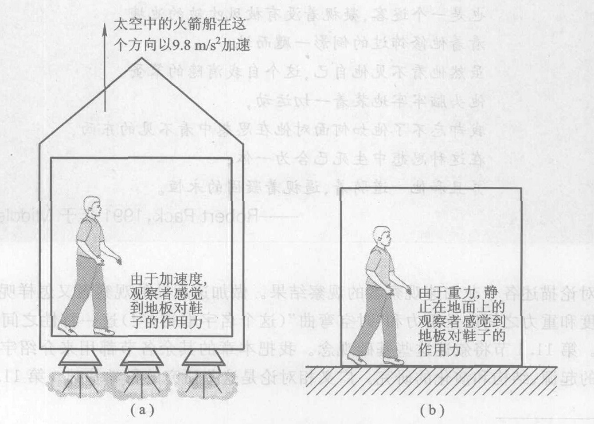

*图 11.1 加速度和重力的效应完全相似。电梯内的观察者不能分辨它们的差异。(a) 太空中的火箭舱在这个方向以 $9.8\ \text{m/s}^2$ 加速；由于加速度，观察者感觉到地板对鞋子的作用力。(b) 由于重力，静止在地面上的观察者感觉到地板对鞋子的作用力。*

如果你正在一艘火箭里以一个 $g$ 的加速度平稳地加速穿过太空，并且你不同窗外的世界通信联络，你能够判断你是在空间飞行而不是停在地球表面上吗？想想这个问题。你也许会扔一块石头，看它怎样下落（图 11.2）。但是你的火箭是在以一个 $g$ 加速，因此地板会加速向上迎接石头。从在火箭里的你的观点来看，石头是在以一个 $g$ 的加速度“落”到地板上。而且，伽利略的落体定律（第 3 章）成立：同时撒手的两块石头，一块质量大，一块质量小，将同时到达地板（或者宁可说，地板同时到达两块石头）。你还可以水平地扔出一块石头（图 11.3）。由于火箭向上加速运动，石头在横越火箭的同时，会越来越接近地板在你看来，石头“落”向地板的方式，同你在地球上水平扔出的石头完全一样。

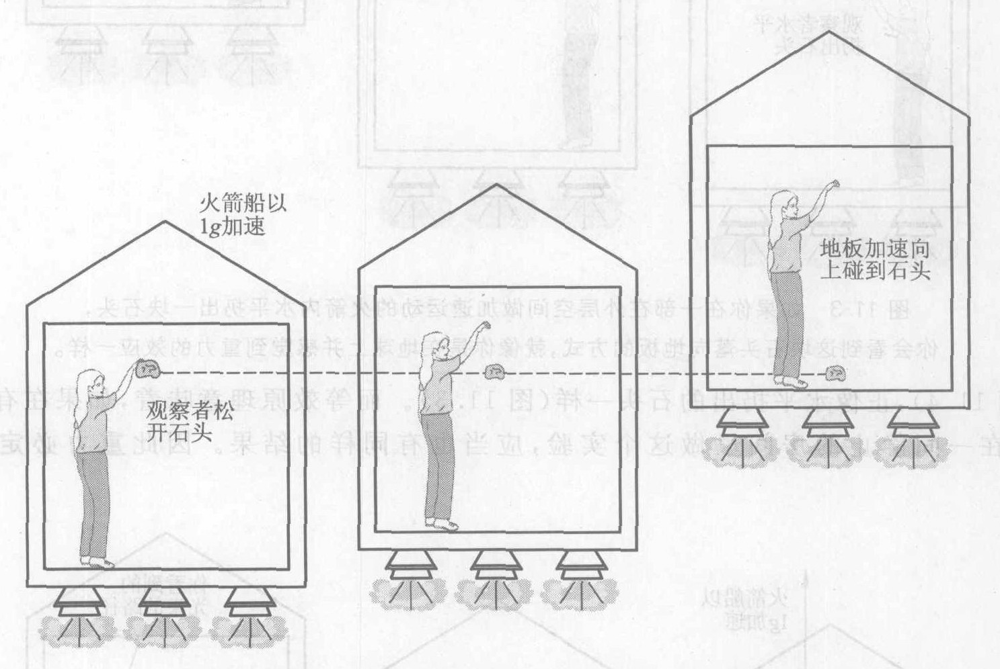

*图 11.2 如果你在一艘在外层空间做加速运动的火箭内释放一块石头，你会看到这块石头“落”向地板，就像你在地球上感觉到重力的效应一样。*

看来，不容易找到一个实验，你能通过在火箭舱内进行这个实验，来判定你到底是在地球表面上静止还是以一个 $g$ 的加速度穿过空间运动。

爱因斯坦把这个推理表述成一条基本原理，这条原理与相对性原理相似。相对性原理说，在你的实验室内无法判定一个状态是静止还是在以恒定速度运动。新原理说，在你的实验室内无法区别重力的效应和加速度的效应。因为它说重力和加速度等效，我们管这条原理叫等效原理。

> **等效原理**
> 在一个封闭的房间里没法做一个实验来判断，你到底是在有重力的情况下处于静止，还是在没有重力的情况下做加速运动。

正像在狭义相对论中一样，光束在广义相对论中也起着关键的作用。加速运动怎样影响光束？如果你正穿过外层空间加速运动，并向水平方向打开闪光灯，光束相对于你必定指向下弯曲（图 11.4），正像水平扔出的石头一样（图 11.3）。而等效原理意味着，如果在有重力的情况下在一间静止的房间里做这个实验，应当也有同样的结果。因此重力必定使光束弯曲。

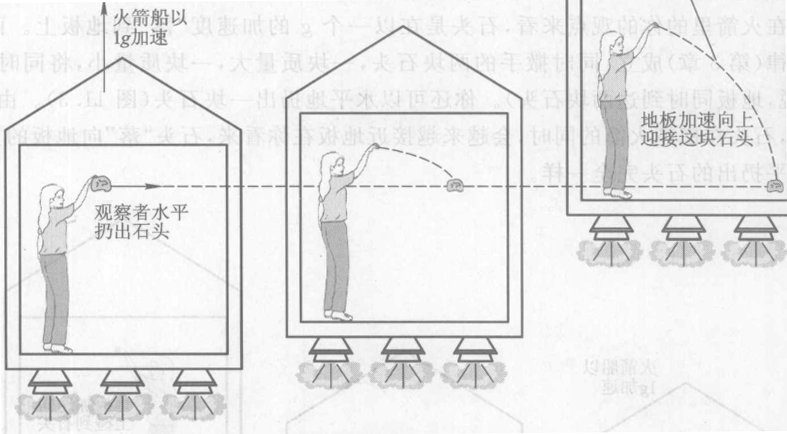

*图 11.3 如果你在一艘在外层空间做加速运动的火箭内水平扔出一块石头，你会看到这块石头落向地板的方式，就像你在地球上感觉到重力的效应一样。*

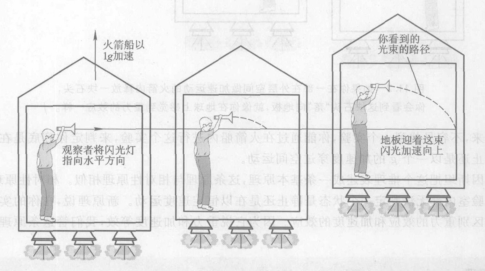

*图 11.4 如果你在一艘在外层空间做加速运动的火箭内打开一个闪光灯，光束相对于你将会弯曲。*

**我们怎么知道重力使光线弯曲？** 地球的重力太弱，不能使光束弯曲多少。但是太阳有足够大的质量，能够使遥远恒星发出的光经过太阳附近时受到的弯曲变得可以测量出来。对这个效应的首次测量是在 1919 年一次日全食时进行的，日食时天文学家能够把出现在太阳边缘附近的星星拍摄在照片上（图 11.5）。对这些星星位置的测量表明，星光经过太阳时的确被弯曲，而且弯曲的程度与爱因斯坦的预言相符。

我们还记得，光速不变使爱因斯坦得出令人惊奇的发现：时间是相对的。类似地，引力使光线弯曲意味着空间的一个令人惊奇的性质，这一性质同直线概念有关。正像时间是宇宙的一种可以用光钟测量的物理性质一样，直线也是宇宙的一种物理性质，它可以用光束走的路径来定义。事实上，测绘员就常使用激光光束来决定直线，你在沿着枪管瞄准时也是用光束决定直线。但是，既然光束本身就是直线的定义，那么说重力使光束弯曲又是什么意思呢？正像运动的光钟变慢意味着时间本身变慢一样，爱因斯坦看出，光束的弯曲意味着空间本身被引力弯曲。对一个光束的路程的最佳描述是“可能最直”的路程。在一个弯曲的空间里，即使这样一条可能最直的路程也一定是弯曲的。

空间是弯曲的。这是一个古怪的概念。需要一个爱因斯坦才能想出这个概念，但是它不是爱因斯坦或你或其他任何人所能直观想象的东西。正如斯蒂芬·霍金（图 11.6）所说，“形象地想象普通的三维空间已经够难的了，更不用说弯曲的三维空间。”困难在于，空间只有三维（长、宽、高），因此我们没有更高的维数，那里里我们可以看见我们的三维空间的弯曲，就像我们能够从我们的三维视角看见一张二维的纸的弯曲一样。

我们能做的顶多是形象地想象这个重要的弯曲空间概念的类比。例如，一张平的桌面是二维的（表面只有长和宽），可以把它看成“平直的二维空间”的一个区域（图 11.7）。如果在它里面弄出一个弯曲，比方说一个凹陷（图 11.8），这个表面就变成一个弯曲的二维空间。另一个例子是，一个球的表面（不是其内部）是一个弯曲的二维空间。例如，一个地球仪表面上的两个标准维叫微经度（与一个经过两极和英国格林尼治天文台的圆的东西角距离）和纬度（离赤道的角距离）。在这个弯曲的二维空间里可能最直的线（类似于弯曲的三维空间里光束的路径）是“大圆”，例如赤道和通过两极的经线构成的圆。

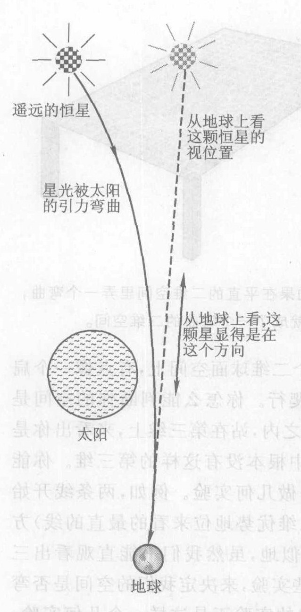

*图 11.5 由于太阳使光束弯曲，我们能够看见太阳后面的星星。*

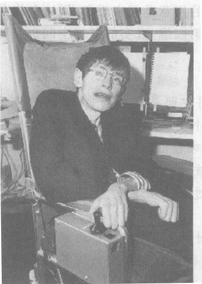

*图 11.6 斯蒂芬·霍金对天体物理学和宇宙学做出了巨大的贡献。*

> 那么我将为亲爱的上帝感到遗憾，因为这个理论是正确的——
> ——爱因斯坦在被问到如果 1919 年的日食观测结果与他的广义相对论不符时他会有什么感觉时的回答

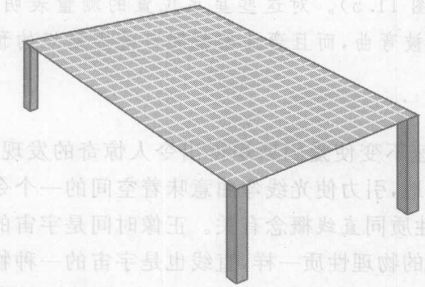

*图 11.7 一张平桌面是一个平直二维空间。*

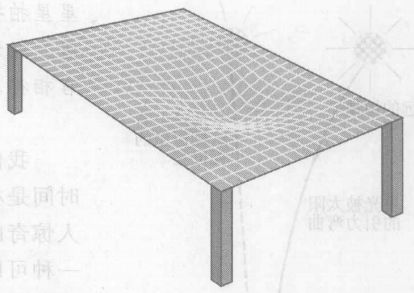

*图 11.8 如果在平直的二维空间里弄一个弯曲，它就成了一个弯曲的二维空间。*

假设你是一个二维生物，住在一个二维球面空间上，有点像一个扁平的蚂蚁，在一个大地球仪的表面上爬行。你怎么能判断你的空间是弯曲的？你不能站在球面之外或球内部，站在第三维上，来看出你是在一个球面上，因为在这个二维类比中根本没有这样的第三维。你能够得知你的空间是弯曲的一个办法是做几何实验。例如，两条线开始时彼此平行并延伸长，最终将会相交（图 11.9）。类似地，虽然我们不能直观看出三维空间的弯曲，但是我们能够想象一些实验，来决定我们的空间是否弯曲。1919 年测量光在太阳附近的弯曲的实验正是这样一个几何实验。它发现，即使是最直的路径——一束光的路径，也在太阳附近弯曲。我们的结论是，这个三维空间本身是弯曲的。

许多学生在这里有一个误解，以为一定有一个空间第四维，三维空间的弯曲就是弯进这一维里去。这不是对的。我们的二维类比的用意是用来想象，这两维是否“嵌入”第三维没有关系。尽管没有使三维空间弯进去的空间第四维，真实的三维空间也是弯曲的。

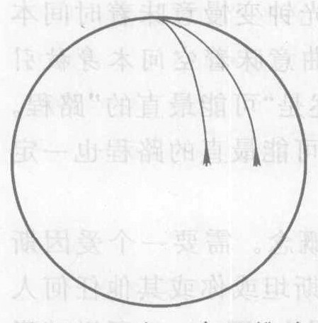

*图 11.9 在一个二维球面空间上，开始时平行并且以“直”线（或最直的线）方式延长的两条线最终会相交。*

**我们是怎么知道空间是弯曲的？** 但是光束的弯曲真的表明空间是弯曲的吗，还是只表示光束在普通的或“平直的”三维空间里的弯曲？1972 年做的一个实验排除了后这种可能性。在这个实验中，一个绕火星飞行的太空飞行器定 向反射回从地球送出的雷达信号（图 11.10）。在一年中当从地球到火星的视线经过太阳附近时，测量雷达波束的传送时间。测量这个传送时间可以判断弯曲的光束是穿过一个平直的空间还是穿过一个弯曲的空间。下面是具体做法。

很容易用观察到的弯曲路径预言在平直空间中的传送时间，这只要把雷达波束的弯曲路径按缩小的比例尺画在一张平纸上，看看它比直线长多少就行了。实验中给的答案是大约长 10 m，因此如果雷达波束仅仅是在平直空间中弯曲，它应当延迟大约 30 ns ($1\ \text{ns}$ 是 $10^{-9}$ s)，即光走 10 m 路程的时间。但是你不能用一张平纸来测量弯曲空间中的距离，其理由与你不能一张平的地图上精确量出从洛杉矶到伦敦的距离一样：由于弯曲“比例尺”不断变化。爱因斯坦的公式预言会有 $200\ \mu\text{s}$ ($1\ \mu\text{s}$ 是 $10^{-6}$ s) 的延迟，是预言的穿过平直空间的延迟的 7 000 倍。实验证实了爱因斯坦的预言。

迄今我忽略了一件事实，现在必须说一说。从第 10 章我们记得，空间和时间是相互纠结在一起的。例如，要测量一个运动窗户的宽度，你需要至少两个钟，以保证你正好是在同一时刻测量窗户两边的位置。因此，此距离测量含有时间测量。在广义相对论中，空间和时间的这种纠结意味着空间的任何弯曲一定也使时间发生畸变，使时钟（换句话说就是时间）在更强的引力场中走得更慢。事实上质量是使时间和空间一起（或时空）发生畸变。时空并不是一个特别微妙或困难的概念。不难想象它的维数中的两维或三维，但是不可能同时想象全部四维。例如，如果你画出了一个沿直线运动的物体的“$x$”与物体的行进时间“$t$”的关系曲线，你就画出了这个物体在时空中的运动。

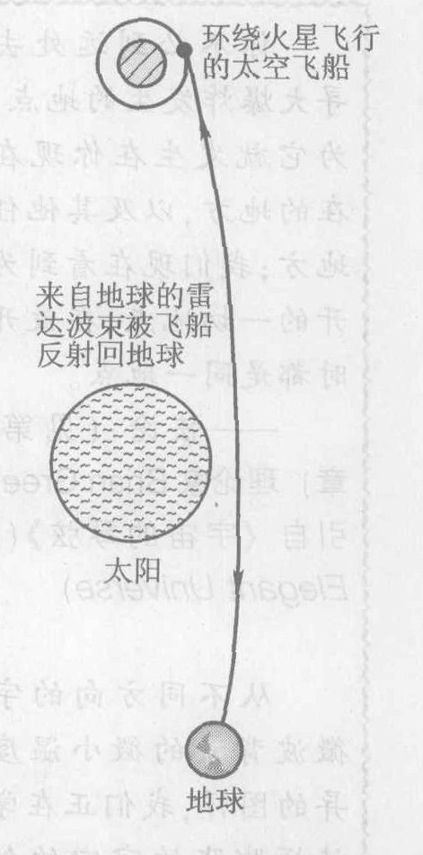

*图 11.10 测量一个雷达波束从地球送到火星再返回的总传送时间的实验验证了弯曲空间的理论。*

广义相对论使我们对引力的看法和对时间和空间的看法发生了革命。牛顿物理学把时间和空间看作一个被动的、不变的背景，事件就在这个背景上演出；而后牛顿物理学则把时空看作事件的一个主动的、变化的物理参与者。时空形成一种“织物”，其形状由质量定型（图 11.11），就像一柄铁锤能够使一片金属弯曲一样。时空的形状由物质决定，而这一形状又影响光和辐射在空间的运动。

对于地球上熟悉的情况如石头的下落，广义相对论的预言和牛顿的预言近乎全同①。对于异乎寻常的情况如黑洞附近或宇宙创生的早期阶段，广义相对论的预言与牛顿的预言有很大的差异。从概念上说，这两个理论有根本的不同。在爱因斯坦的理论中，诸如地球环绕太阳的圆运动这样的引力效应，根本不是由力引起的，而完全是由时空的弯曲引起的。地球的轨道并不是被引力拉成一个圆，而是因为太阳使空间弯曲，地球只是沿着这些弯曲自由“下落”（根本不受任何力）。地球必须沿运动，因为时空本身是弯曲的。为了避免一个常见的误解，必须讲清楚，我在这里并没有说空间弯曲成环绕太阳的一个圆，而地球循着这些圆运动。相反，它是这样弯曲的：随着在时间维中向着时间增加的方向运动，地球在空间谱维中在一个圆轨道上运动，从而在时空中产生一条螺旋线。

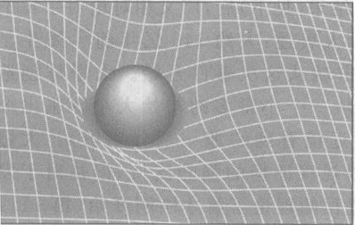

*图 11.11 质量（如太阳）使时空弯曲。*

> **物质告诉空间如何弯曲，空间告诉物质如何运动。**
> ——惠勒

*① 即使在地球上，与牛顿的预言的微小差异，对于需要极高精度的实际应用也是很重要的。例如，全球定位系统 (GPS) 依靠卫星来精确决定地球上的任何 GPS 接收机的位置。这时至关重要的是，全部 24 个 GPS 卫星都高度精确地使用同样的时间。为此，科学家必须考虑狭义相对论和广义相对论二者的效应。*

> **概念检查 1**
> 由于加速度能够模仿重力的效应，加速度应当能够抵消重力。因此，人们能够通过以下的某种方法经受“失重”（没有重量）的状态：(a) 从地球上以一个 $g$ 的加速度被垂直向上发射；(b) 从高处如跳水跳板或一架飞机（延迟打开降落伞）掉下；(c) 环绕地球公转；(d) 站在月球的表面上。

> **概念检查 2**
> 赤道是地球仪表面上的一条“可能最直”的线。别的东西向的纬圈也是“可能最直”的线吗？(a) 是；(b) 不是，它们比赤道弯曲得更厉害；(c) 不是，它们弯曲得没有赤道厉害；(d) 不是，尽管它们弯曲的程度和赤道相同。

## 11.2 大爆炸

> 你不必到远处去搜寻大爆炸发生的地点，因为它就发生在现在你所在的地方，以及其他任何地方；我们现在看到为分开的一切地点，在最开始时都是同一地点。
> ——弦论（见第 18 章）理论家 Brian Greene，引自《宇宙的琴弦》(The Elegant Universe)

宇宙学是对大尺度宇宙起源、结构和演化的研究，你正生活在宇宙学的黄金时代。本书将充分利用这一事实，讲述一些令人震憾的宇宙学最新发现。宇宙学的黄金时代开始于 1992 年，那年一具观测卫星绘出了早期宇宙第一幅详尽的空间分布图。做出这些宇宙学新发现的关键是那些奇妙的新观测仪器，像哈勃空间望远镜。理解这些新发现的关键，则是广义相对论。

在把广义相对论应用于作为一个整体的宇宙时，这个理论预言了我们的三维空间在整个过去和未来时间中的可能的演化方式。在补充了若干天文观测结果（见下）后，广义相对论对宇宙的起源和演化得出了以下的惊人叙述：大约 140 亿年前②，发生了一次叫做**大爆炸**的事件，宇宙就从这次事件开始。大爆炸创造了不同形式的能量和物质，从一个小得多的初始大小膨胀出来，直到可观察到的宇宙（可用望远镜看到的那一部分宇宙）。大爆炸的真实性受到几条独立的观察证据的强烈支持，但是对于发生这一事件的原因和具体过程的理解才刚刚刚开始（第 11.7 节）。

**我们怎么知道曾发生过一次大爆炸？** 有四条独立的证据支持大爆炸理论：

1.  天文学家起初于 1929 年提出大爆炸理论，是因为他们发现了证据表明，整个宇宙的一切星系都在互相远离，好像它们是被一次爆炸推散开似的。从我们今天观测到的星系退离速率和距离出发在时间中回溯，所有的星系在大约 140 亿年前应当统统聚在一起。

2.  1964 年，射电天文学家首先探测到**宇宙微波背景**，它是炽热的初始爆炸的微弱余烬，现在仍然充满整个宇宙。这个辐射现在已冷却到 $-270^\circ\text{C}$③。这个冷的辐射的能量太小，不在可见光谱段内，今天它只能作为微弱的无线电干扰，在微波和射电频段观察到。观测到的它的特征如温度和大爆炸理论的预言相符。

3.  1992 年，然后后再次在 2003 年，观测卫星（图 11.12）测绘出从太空各个方向射到地球的宇宙微波背景辐射的分布图。结果（图 11.13）表明，这个辐射包含着微弱而高度复杂的“起伏”，如果初始的大爆炸真的要发展成我们今天所看到的由星系和星系团构成的宇宙结构，这种起伏正是我们所期望的。图 11.13 中所绘的辐射的存在，以及这个辐射与我们今天看到的我们周围的宇宙之间的密切关系，是大爆炸理论的强有力的证据。

*② 更精确地说是 137 亿年前，误差小得令人惊奇，不超过 1%。*
*③ 这个温度只比绝对零度高 $3^\circ\text{C}$，绝对零度是可能最低的温度，在这个温度下，一切微观运动都处于在不违反量子不确定原理条件下它所能有的最小运动状态。*

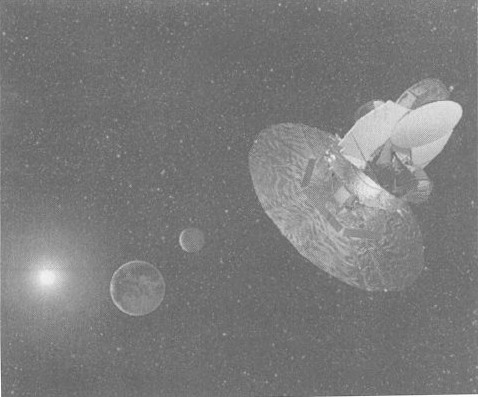

*图 11.12 Wilkinson 微波各向异性探测器 (WMAP) 离开地-月系统，飞向太空中一个叫“L2”的点。2003 年，这个卫星在时间中回溯大约 140 亿年，观察我们的宇宙处于婴儿期（年龄大约为 40 万年）时的情况。这相当于观看一个 80 岁老者在婴儿时的照片，这幅照片是在他出生不到一天时候拍的。L2 离地球 150 万公里（100 万英里），在太阳中心和地球中心的连线上，离月球轨道 100 多万公里。这个特别的点是五个平衡点之一，在这些点上，太阳和地球对一个小物体如 WMAP 的作用力加起来，刚好是使一个卫星环绕平衡点公转所需的力。WMAP 利用月球来得到向 L2 弹射的速度。*

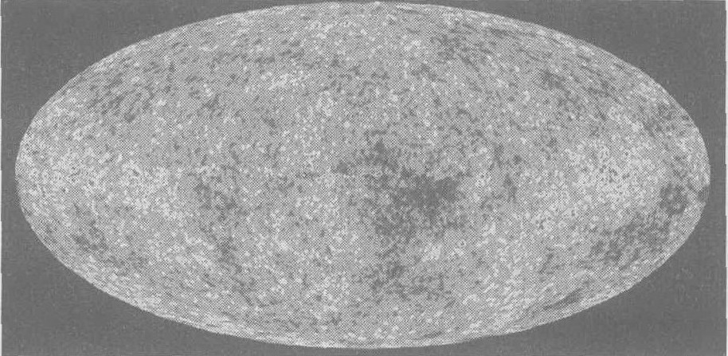

*图 11.13 最早的光：早期宇宙留下来的一个“化石”。这幅图是大爆炸后仅 40 万年（更精确地说是 38 万年）时的强烈的辐射闪光留到现在、年龄已有 140 亿年的微波“悄语”的一幅相片，它显示了释放这一辐射时的宇宙中的温度差异。这幅图示出太空中的每一方向：想象水平轴和竖直轴通过图的中心，沿水平轴分布着全部 $360^\circ$ 方位角，沿竖直轴则是从上到下 $180^\circ$ 角。虽然宇宙的膨胀至今已把空间拉伸得如此之厉害，使辐射的波长被拉长，把辐射拉进了波谱的微波波段，但你看的仍是穿过宇宙的第一缕光的照片（实际上是微波照片）。在此之前，宇宙是如此之热，使得它的原子都带电，这阻止了光穿过空间传播。因此，宇宙微波背景的作用像是一块发光的帘幕，处于它之外的东西是我们看不见的。它是科学所知道的最古老的、最大的和最远的可见观察到的结构。*

> 从不同方向的宇宙微波背景的微小温度差异的图样，我们正在学着读懂膨胀着的宇宙的创世故事。由此得到的万物起源故事是历史第一个建立在科学证据上的起源故事，它是由全世界不同宗教信仰和种族的人们协作得出的，他们的一切贡献都受同样的标准的检验。这幅关于实在的新图像不排斥任何人，并且把一切人当成平等的。今天在科学宇宙学中发生的这场革命可能为关于更广阔的实在的一幅可信的图像敞开了大门，我们的世界、我们的生活以及我们的全部文化都深植在这一实在中。
> ——N. E. Abrams, 律师和作家；和 J. Primack, 理论天体物理学家。载于 *Science*

4.  第四条证据与宇宙的最初的化学元素的生成有关。在大爆炸的最初的千分之一秒内生成的显示最早的几种寻常物质是质子、中子和电子。此后的 3 分钟内的条件适合于质子和中子“聚合”成更复杂的原子核。在这 3 分钟后，宇宙又变得太冷、太稀薄，不适合于质子和中子继续聚变（即粘到一起——见第 16 章）了。毕竟成熟并且高度可靠的原子核物理学计算预言，在这最初的 3 分钟结束时，大约 75% 的原初质子仍然留存，而 25% 的原初质子和中子聚合成另另外四种原原子核。这四种原子核分别标记为 $^2\text{H}$，$^3\text{H}$，$^3\text{He}$ 和 $^7\text{Li}$（第 16 章将解释原子核这些标记的意义）。留下的单个质子是普通的氢核，标记为 $^1\text{H}$。那时的宇宙由两种不同的氢、两种不同的氦和一种锂组成。原子核物理学计算预言，在最初的 3 分钟终了时，这五种原子核存在的比例如表 11.1 所示。

**表 11.1 科学家预言的大爆炸开始后大约 3 分钟的宇宙中原子核的组分，当前对宇宙中最古老物质的观测结果和这些预言符合得很好**

| 核素 | 按质量的相对丰度 |
| :--- | :--- |
| $^1\text{H}$ | 75% |
| $^2\text{H}$ | $(5 \sim 10) \times 10^{-5}$ |
| $^3\text{He}$ | $(2 \sim 5) \times 10^{-5}$ |
| $^4\text{He}$ | 25% |
| $^7\text{Li}$ | $(2 \sim 5) \times 10^{-10}$ |

天文学家曾对来自最古老的恒星的光或“光谱”（第 14 章）进行了测量，这些恒星据说是由大爆炸产生的原初物质组成的，而且从那时以来改变很少。这些测量表明，这五种同位素的相对含量与理论预言符合得极好（表 11.1）。对五种不同的核素相对含量的观测结果和大爆炸理论的预言这样的细致符合，是支持这个理论的强有力的证据。关于 $^2\text{H}$ 的预言及其证实特别有说服力，因为原子核物理学预言，除了大爆炸外，在宇宙中不可能有任何过程能够制造这种材料。

大爆炸和你接通电视机的电源而没有接收到信号时在电视屏幕上看到的“雪花”或干扰同样地真实。宇宙微波背景辐射引起了一部分这样的干扰。大爆炸的回声就在你周围！

虽然从大爆炸以来产生的更重的元素现在在宇宙中也占一个小百分比，但宇宙仍然主要由氢和氦构成。几乎所有的氢和氦都可以追溯到大爆炸。虽然我们的身体中不含氦，140 亿年前在大爆炸中生成的氢却是你的身体和一切活的有机体中含量最多的元素。

> **概念检查 3**
> 宇宙中的金原子核 (a) 全都是在大爆炸中生成的；(b) 全都是在大爆炸以后的某个时候生成的；(c) 一部分在大爆炸中生成，一部分在大爆炸以后生成。

## 11.3 宇宙的各种可能的几何

> 一条直路实际是弯的，因为它是是在地球上而地球是弯的。
> ——一个小学女生对我说的话

宇宙的膨胀可能是我们所曾发现的有关我们的起源的最重要的事实。正确理解它的关键是不要过于认真地对待“大爆炸”这个术语。它不是发生在时间和空间中的一个爆炸，即它是大爆炸创造了时间和空间。时间和空间是宇宙的一部分，但是宇宙并不是时间和空间的一部分，换句话说，宇宙并不是存在于时间和空间之中，在宇宙之外别无时间和空间，宇宙就是全部存在。随着宇宙的膨胀，它生成了自己的时间和空间。宇宙在膨胀，但它不是膨胀到什么东西里面去，因为在宇宙之外别无空间。

广义相对论的预言之一是，三维空间不能保持为静态，而必须要么不断地膨胀要么不断地收缩。值得注意的是，即使空间本身处处处于不断的膨胀变化之中。万事万物看起来都是活动的和变化的：星星诞生和死亡，地球上的生命在演化，你我出生了又将死去，连空间自身也必定不断膨胀或收缩。而且，在第 18 章里我们将看到，甚至所谓空虚的空间或真空中也充满了活动。

宇宙膨胀的直接证据来自对我们银河系以外的其他星系的天文学观测。遥远的星系总是离我们而去，而且离我们越远的星系离开得越快。但是各个星系并不是只是离开我们这个星系；它们相互之间都在彼此远离。不论你坐在哪个星系，你都将观察到别的星系正在离开你。这就像一个葡萄干面包在焙烤时发生的膨胀：如果你站在任何一粒葡萄干上观测别的葡萄干，你会看到它们全都离你远去，并且越远的葡萄干离开你的速度越快。

要全面直观摹想三维宇宙的三维空间的膨胀，让我们像在第 11.1 节中那样，想象一个二维类比。与第 11.1 节中的蚂蚁和地球仪的类比类似，假想一个部分充气的气球的表面是一个二维宇宙。想象有二维（扁平）的葡萄干贴在这个表面上，以代表各个星系。记住，在这个二维类比中，你必须想象气球的内部和外界都不存在；假设存在有的只有充气的二维表面。

现在想象对气球充气（图 11.14），代表宇宙膨胀。注意，随着气球膨胀，所有的葡萄干之间的距离都增大。不论你站在哪颗葡萄干上，所有的葡萄干都在离你开。没有哪颗葡萄干是在这个气球宇宙的中心，事实上气球的这个表面没有中心。与哥白尼革命（第 1 章）的哲学相一致，平均而言，这个宇宙的处处都是相同的。注意各个星系相对于气球表面是静止的。实际上并不是葡萄干在运动；相反，是各个葡萄干之间的空间在膨胀。在真实的三维宇宙里，引力把每个星系（以及每颗恒星和每颗行星）聚在一起，保持一个相对固定的规模和形状，但星系之间的空间则在膨胀。还要注意，没有哪个星系是在这个气球宇宙的边缘，这个气球宇宙没有边缘。真实的三维宇宙同样也没有边缘。

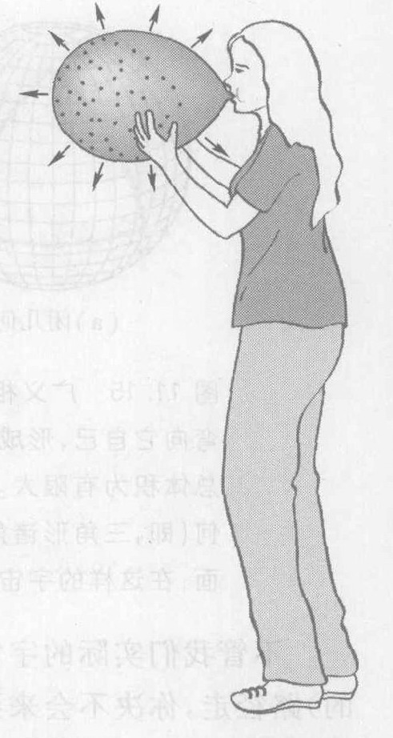

*图 11.14 一个膨胀的气球的二维表面是三维宇宙的膨胀的二维表示。随着由气球表面所代表的空间的膨胀，由贴在气球上的葡萄干所代表的星系相互离开更远。虽然这个二维模拟显示出宇宙膨胀到气球外面的空虚空间中，但在真实的三维宇宙之外却没有空间。*

根据广义相对论，三维宇宙的大尺度结构可能的形状或几何只有三种。图 11.15 画出这些三维几何的二维模拟。一个**闭宇宙**向它本身弯曲，形成一个球面。如果你是生活在一个闭宇宙中，那么可以从以下的事实检测出来：开始时平行的几条直线（即最直的线）最终会相交（图 11.9），并且一个三角形的三个角加起来大于正常的 $180^\circ$，这可从图 11.15 看出。虽然一个闭宇宙只有有限大小的广延，另外两种几何却有无穷大的总广延，因此在图中只能示出这些表面的一部分。一个**平直宇宙**没有总体的大尺度弯曲（虽然在所有三种几何中都会有由星体、黑洞、星系和其他物体引起的小尺度弯曲），具有通常的欧氏几何，其性质是我们熟悉的——平行线保持平行，三角形诸角之和等于 $180^\circ$。一个**开宇宙**类似于一个鞍状曲面；在这样的宇宙中，起始时平行的直线最终彼此发散，三角形诸角之和小于 $180^\circ$。

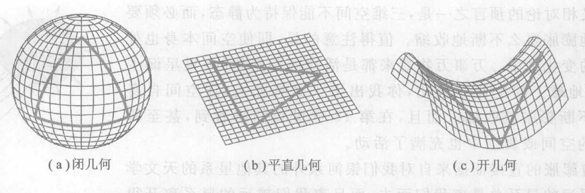

*图 11.15 广义相对论预言的三维宇宙的各种可能的大尺度几何的二维模拟。一个**闭宇宙**弯向它自己，形成一个三维球面空间，在这个空间中三角形诸角之和大于正常的 $180^\circ$，并且总体体积为有限大。一个**平直宇宙**没有总体的大尺度弯曲；它具有我们熟悉的正常的欧氏几何（即，三角形诸角之和等于 $180^\circ$），总体体积为无穷大。一个**开宇宙**类似于一个较平的鞍状曲面；在这样的宇宙中，三角形诸角之和小于 $180^\circ$，总体体积为无穷大。*

不管我们实际的宇宙可能具有的是这三种几何中的哪一种，如果你始终沿着一条直线（最直的）路径走，你决不会来到一个边界或者宇宙的中心。在开宇宙和平直宇宙中，这是因为宇宙的广延是无穷大。在闭宇宙中，这是因为直线（最直的线）将弯回它们的出发点。在这样的宇宙中，如果你沿着一条绝对直的线飞行几百亿光年，你将抵达你的出发点。

> **概念检查 4**
> 宇宙在膨胀。宇宙中的万事万物都在膨胀吗？(a) 是；(b) 不是，星系之间的距离不膨胀；(c) 不是，银河系不膨胀；(d) 不是，我们的太阳系不膨胀；(e) 不是，地球不膨胀。

## 11.4 宇宙的形状

宇宙学中发生的革命是由观测强烈推动的。直到 1992 年，具有宇宙学意义的观测资料还很少并且非常不精密；宇宙学必然也是高度理论性的和猜测性的。精密宇宙学的年代开始于 1992 年，这一年首次进行宇宙微波背景的细节的观测，其结果与图 11.13 所示的 2003 年的更为详尽得多的图相似。

图 11.13 是一张“微波照片”，它和红外线照片（第 9 章）相似，显示大爆炸所发射的背景辐射中的温度差异。亮区的温度要比暗区稍微高一点。这个辐射是在大爆炸后仅仅 40 万年时发射的。在此之前，宇宙的温度是如此之高，使得质子和电子运动得非常快，无法粘在一起形成氢原子；如果偶然形成了一个氢原子，它立即就被与其他粒子的的高能碰撞撕开。这样得到的带电的质子和电子的混合物会立刻吸收掉出现的任何辐射。到了第 40 万年，宇宙已足够冷却，使电子能够和质子结合形成中性的氢原子，并且辐射首次可以穿过空间传播。生成图 11.13 的微波在接近真空的空间里传播了 140 亿年，才进入探测器生成这幅图。你在图上看到的是宇宙的第一缕光，是一具已有 140 亿年历史的“化石”。

这幅图表示的是在早期宇宙中四处晃荡的物质和能量波（类似于空气中的声波）的细节，科学家从这幅图得出结论：宇宙的大尺度几何是平直的，而不是闭合或开的几何（图 11.15）。下面解释我们是怎么知道的。

**我们怎么知道宇宙的形状？** 科学家根据他们关于炽热、稠密而且带电的早期宇宙的物理本性的知识，可以预言在大爆炸与释放出这幅图中看到的光之间这一段 40 万年的时间里，这种材料中的波状扰动能够传播的最大距离。天文学家还能根据图上所显示的较热区域或较冷区域的平均大小，在宇宙微波背景中直接观测这个距离（图 11.16）。但是，在这个微波辐射穿越空间来到地球的漫长旅途中，空间的几何使这种视观测发生畸变，正是这种畸变使科学家能够判定空间的几何。如图 11.16 所示，今天从地球上观测，一个典型的波状扰动应当张成一个大约 $1^\circ$ 的角，如果宇宙是平直的话；而一个闭宇宙则会将辐射弯曲成一个大于 $1^\circ$ 的角；而一个开宇宙会将辐射弯曲成一个小于 $1^\circ$ 的角。实际观测到的角是大约 $1^\circ$，这是一个判决性的证据，表明宇宙的总体几何是平直的或至少非常接近于平直的。

> **如果你信教，那就像是在注视着上帝。**
> ——George Smoot, 1992 年宣布发现宇宙微波背景中的起伏的研究团队负责人

> **可以把宇宙的演化比作一场刚刚结束的焰火表演；只留下一点余火、灰烬和烟雾。站在一块已经冷却的炉渣上，我们凭吊太阳们的衰落，并且试图回想已消失的世界起源的辉煌。**
> ——比利时教士勒梅特，他在 20 世纪 20 年代提出大爆炸理论

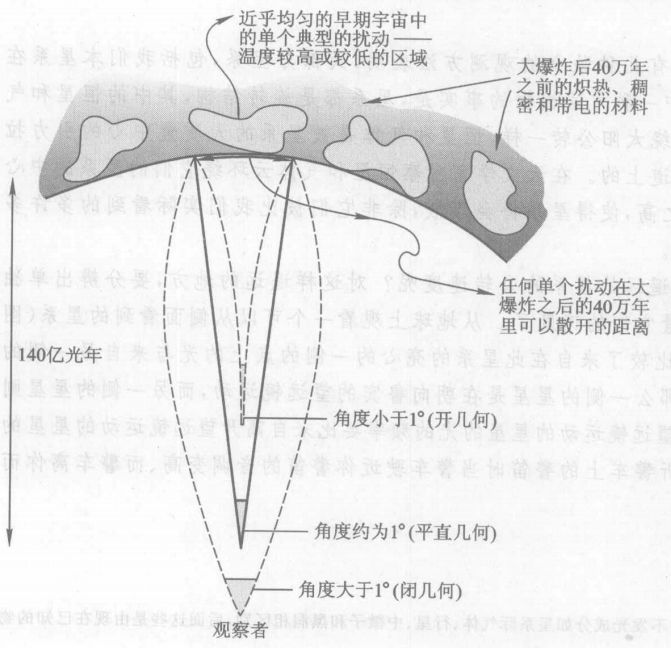

*图 11.16 早期宇宙材料中的一个典型的波状扰动，今天从地球上观测，应当张成一个大约 $1^\circ$ 的角，如果宇宙是平直的。一个闭宇宙将辐射弯曲成一个大于 $1^\circ$ 的角，而一个开宇宙将辐射弯曲成一个小于 $1^\circ$ 的角（比较图 11.15）。实际观测到的是大约 $1^\circ$，这是一个很强的证据，表明宇宙的总体几何是平直的或至少是非常接近于平直的。*

> **概念检查 5**
> 既然有证据表明宇宙是平直的，那么是不是根本没有弯曲空间这样的东西呢？说明回答的理由。(a) 是；(b) 否。

## 11.5 暗物质

我们习惯于认为，宇宙主要是由可以看见的恒星和少量的其他不发光的物体如行星构成的。但是我们在过去 20 年中已经得知，构成宇宙的成分远比这多。首先，在大爆炸中生成的大量的氢和氦既不聚集恒星，也没有被收集在可见的星系中；相反，它们散布在星系之间的广在区域中，在那里它们既不可见，也很难探测出来。天文学家通过观察从遥远的恒星来到地球上的光在穿越星际空间时是怎样被部分吸收的首次检测到了。现在已经知道，这种看不见的星际气体的质量大约是宇宙中全部恒星、行星和发光气体的质量的 10 倍！

恒星、行星和星际气体，就像你坐的椅子一样，是由寻常物质的原子构成的。但是还有别样的物质，那些物质的基元不是原子。中微子就是一个例子（见图 1.2(d) 中的中微子“望远镜”，及第 6.5 节中的“我们怎么知道”）。无数的单个中微子在宇宙中穿越，估计它们的总质量为全部恒星总质量的四分之一。另一种非原子结构的物质是黑洞（第 5 章）。根据现有的关于处于星系中心的大质量黑洞的知识来判断，估计它们的总质量大约为全部恒星质量的十分之一。

我觉得这些已经够玄了。但是还有更多更玄的。在过去二三十年中，科学家已经得知，还有另外一种物质，它们不是由质子、中子、电子或任何现在已知的别种粒子（如中微子）构成的。没有人知道这种物质的组成，虽然提出过几种假设。它不与电磁辐射相互作用，因此不能因发光（像恒星那样）或反射光（像行星那样）或吸收光（像星际气体那样）而被发现，也没有人在实验室里检测到它。但是由于它对星系中星体的引力效应，我们知道它是存在的，而且知道它的含量很多。这种所谓**暗物质**的总质量是全部恒星质量的大约 60 倍！

**我们怎么知道暗物质存在？** 有几种独立的观测方法表明，大部分星系，包括我们本星系在内，主要是由暗物质构成的。其中一种方法根据的事实是，星系都是旋转结构，其中的恒星和气体环绕星系中心公转。像行星环绕太阳公转一样，恒星和气体是被星系的大质量中心的引力拉力保持在它们的大致为圆形的轨道上的。在天文学家观察恒星和气体环绕它们的星系的中心公转时，发现它们的速度是如此之高，使得星系将会飞散，除非它们被比我们实际看到的多许多倍的物质的引力拉力保持在一起。

但是天文学家怎么能够测量遥远的星系的公转速度呢？对这样遥远的地方，要分辨单独的一颗星都很困难，更不用说测量它们的速度了。从地球上观看一个可以从侧面看到的星系（图 11.17）。薇拉·鲁宾（图 11.18）比较了来自此星系的一侧的点上的光与来自另一侧的点上的光。既然星系是在旋转，那么一侧的星星是在朝向鲁宾的望远镜运动，而另一侧的星星则是在离开她的望远镜。来自朝向望远镜运动的星星的光的频率要比来自离开望远镜运动的星星的光的频率高，正如你在人行道上听当警车驶近你时警笛的音调变高、而警车离你而去时警笛的音调变低是一样的道理。⑤ 从这两个频率的差异，鲁宾能够算出星星的速度。

第二种观测方法是，从遥远的星系到达地球的光，在经过其路程上散布的星系的引力场时，光会被弯曲。通过分析这种叫做“引力聚焦效应”的弯曲（图 11.19），天文学家可以推出，途中的这些星系包含有比能够看见的多得多的物质。

在你读到这些话时，暗物质也许已经在实验室里发现了。历史上最大的粒子加速器（第 18 章）2009 年在日内瓦附近的欧洲核研究中心 (CERN) 投入运行后，物理学家相信它将能使暗物质的许多理论候补者曝光，如果有任何这样的候补者存在的话。

从这些观测我们知道，我们的银河系，以及许多别的星系，是浸在一个巨大的球形暗物质云中，其直径是可见的星系的直径的许许多多倍（图 11.20）。

那么，这种暗物质是什么呢？没有哪种已知的物质形式能够说明它。科学家预期将会发现全新的物质形式，并且对它可能取什么形式已经有了若干理论建议。它同寻常物质的相互作用必定很弱，否则现在它应当已被我们发现了。不论它是什么，它就在我们周围。也许每秒钟有几十个暗物质粒子穿过你的身体，而不在你的身体上留下任何效应。暗物质已经激发了在宇宙射线（来自太空的粒子）中和高能物理实验中的许多探索工作。类似的情况存在于 1914 年至 1955 年期间，那时理论建议在 $\beta$ 衰变中有一个没有观察到的粒子产生，但是直到 1955 年才探测到这种粒子，那一年物理学家发现了中微子（见第 6.5 节中的“我们怎么知道？”）。在实验室里发现暗物质将是一件里程碑性的工作。宇宙的大部分看起来是由它构成的。

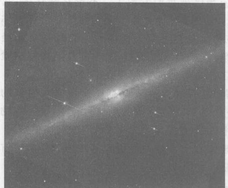

*图 11.17 从侧面看的一个充满恒星、气体和尘埃的星系（与图 1.23 中的星系比较）。*

*图 11.18 薇拉·鲁宾。她的开拓性发现通过观察星系中恒星的频移，对理解暗物质的存在和含量做出了贡献。*

*⑤ 这叫“多普勒效应”，如果你想知道的话。*

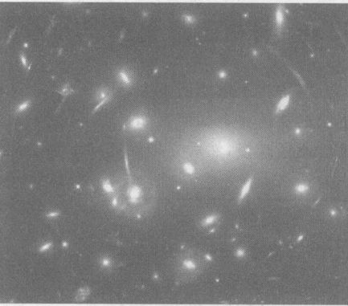

*图 11.19 弯曲的光。为了拍这张照片，将哈勃空间望远镜对准一个遥远的星系团（一群星系被它们相互的引力场保持为一个集团）的中心。照片中的圆形物体是这个星系团中的星系。轮廓不清的或拉长的光来自别别的星系，它们在“前景”星系团后面很远的地方。来自这些更远的星系的光在经过前景星系团的过程中被引力弯曲。在这幅照片中，被弯曲的光来自距我们几十亿光年之遥的星系；它们之中有一些是在宇宙年龄只有其现年龄的四分之一时发出的！这样一幅照片是广义相对论的直接视觉证据。*

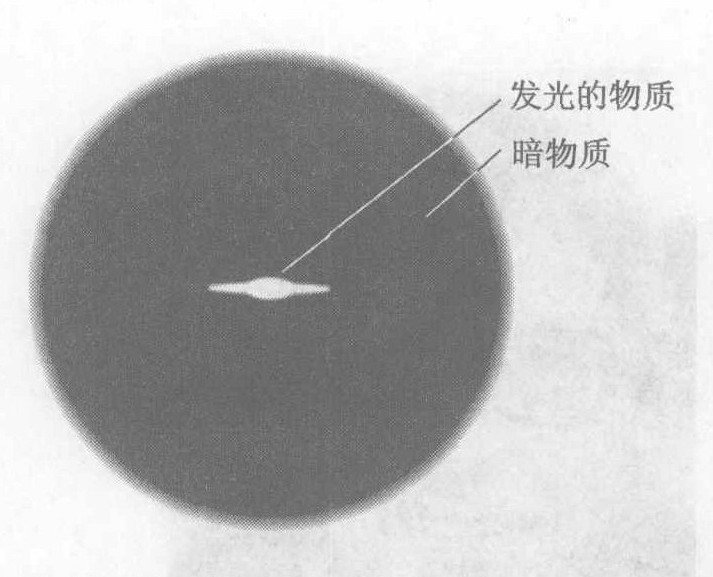

*图 11.20 暗物质在每一个可见的星系周围形成一个巨大的球状“云”。图中中心的小物体是一个从侧面看的像我们的银河系一样的旋涡星系（比较图 11.17）。*

> **概念检查 6**
> 暗物质的最不平常的特性究竟是什么？(a) 它不对别的东西施加引力；(b) 它的引力是推（排斥）别的东西而不是拉；(c) 它是由于在我们的实验室里从未观察到的材料构成的；(d) 它运动得比光速快；(e) 它与电磁辐射没有相互作用。

## 11.6 加速膨胀的宇宙和暗能量

宇宙将永远膨胀下去，还是最终它又将回过头来向内崩塌？这个问题类似于问从地球表面向上扔的物体将会如何。如果你向上扔一个球，随着它趋近它的最大高度并在那里暂时停顿，它的速度逐渐减慢，然后立即加速向下回到地面。但是如果 NASA（国家航天局）用一具巨型火箭发动机把一艘空间飞船向上“扔出”，速度快于 11 km/s，随着它上升速度会变慢，但是它绝不会回到地面；相反，它保持上升并逃出地球。

像上升的球和空间飞船一样，宇宙膨胀将会变慢是合乎情理的。正像球和空间飞船被地球重力的向后的拉力减慢下来，宇宙的膨胀也应当被宇宙中所有物质向内的引力拉力减慢。重要的是定量测量出宇宙膨胀速度的这个减少率，因为如果这个减少率足够大，那就意味着宇宙就像上抛的球一样，最终将停止膨胀，然后立即开始在一次最后的“大塌缩”中向自己崩塌。反之，如果这个减少率足够小，那么宇宙就像向上发射的空间飞船，将永远继续膨胀下去。但是测量宇宙膨胀的速度已经很困难，更不用说宇宙膨胀速率的减慢率了，因此在好多年里，宇宙学家不知道宇宙最后是将会崩塌呢，还是将永远继续膨胀下去。

在 20 世纪 90 年代，宇宙学家设法测量出膨胀速度的减少率。这个结果于 1998 年发表，令人大吃一惊：宇宙的膨胀根本不减慢。它在加速膨胀。

> **暗能量约占宇宙的 70%，而对它到底是什么我们一点线索也没有。**
> ——Mario Livio, 物理学家，巴尔的摩的空间望远镜学术支援小组

> **我们不仅不在宇宙的中心，而且我们甚至不是由和宇宙相同的材料构成的。**
> ——Joel Primack, 加州大学的理论天体物理学家

**我们怎么知道宇宙在加速膨胀？** 首先，让我们看我们怎样测量星系离我们远去的速度。在光波穿越宇宙的过程中，由于在这段时间里空间在膨胀，光波也被拉长。因此，来自遥远的星系的光到达地球时的波长比它离开发射它的星系时的波长要长；它移向电磁波谱的波长更长的一端或红端。来自遥远星系的光的这种红移是 20 世纪 20 年代首次发现的，它是大爆炸和宇宙膨胀最早的证据。科学家可以测量一个星系的光的红移的大小，由此推出星系的速度。

但是为了用红移来证实宇宙是在膨胀，还需要知道的确是更远的星系的红移更大。而这个距离测起来不容易。我们没法把一条皮尺拉到遥远的星系上去！不过，天文学家早就办法测定这样的距离，并充分证实：更远的星系有更大的红移，其关系正是一个膨胀的宇宙该具有的关系。

近年来，天文学家发展了一种特别有力的方法以决定这种距离以及速度。现代的大型望远镜能够检测到一种特别的超新星爆发（恒星的一次爆爆发，见第 5.4 节）。这种“1A 型超新星”足够明亮，即使在大于可观察宇宙的半径一半的距离上都可以看出。我们还知道所有的 1A 型超新星都接近于全同，并且它们在爆发后的大约一个月的最最大强度阶段以相同的亮度发光。由于它们的实际亮度全都相同，离地球越远的这种超新星看起来就越模糊，从它们的视亮度就可以推断它们离我们多远。于是，1A 型超新星成了我们决定膨胀速率和距离（跨越大部分宇宙的距离）的最精确的标尺物。它们的精确程度不但可以决定宇宙的遥远部分膨胀的速度，而且可以决定膨胀速度的变化率——加速度。

1998 年，这些观测揭示出宇宙膨胀实际上是在加速。

这不是我们预料的结果。如果你把一枚银币往上扔到空中，而银币并不减速和掉回来，而是加速并上升看不见，你一定会说这枚银币丢得真稀奇。你可能会想要知道是什么力量把它推到了外层空间。同样，宇宙中全部物质的引力拉力应当使宇宙膨胀减慢。但是它却在加速。是什么在推它？

让我们回想起，退离的星系实际上根本就没有运动，而是在空间大致处于静止，但是空间在膨胀，就像第 11.3 节中的膨胀气球类比中的葡萄干一样。由于加速度是力引起的，加速膨胀意味着有什么东西把空间织构向外推。是什么东西呢？肯定它既不是普通的物质也不是暗物质，因为寻常物质和暗物质的引力都只能是拉力而不是推力。科学家们相信，充满全部空间，甚至包括真空，必定包含某种新形式的非实物的能量，是它们在向外推。它叫**暗能量**。

这个令人惊讶的新概念是 1998 年随着宇宙加速膨胀的发现而突然出现在物理学界面前的。没有人知道暗能量是什么，虽然有些理论把它同所谓希格斯场的能量联系起来，后者在大爆炸的很早的时刻使宇宙“暴胀”（见下节）。暗能量与暗物质相似，但是比暗物质更神秘。我们有证据表明它是存在的，但是对于它到底是什么却不清楚。

暗能量一定影响宇宙的形状，因为爱因斯坦说一切形式的能量都有质量，而质量影响空间的弯曲程度。从宇宙微波背景的详细情况（图 11.13）能够推断宇宙中暗能量的含量。把这个暗能量的质量加到宇宙中的发光物质、不发光的寻常物质和暗物质的质量上，得出的总质量正是使宇宙的总体几何变成平直所需的质量。于是，宇宙的平直性质、暗物质、宇宙的加速膨胀和暗能量这些东西相互配合，一起构成一幅一致的但是完全出乎意料的宇宙图像。

所有这些为“宇宙是由什么构成的”这个古老的问题提供了一个新答案。对宇宙微波背景和宇宙加速膨胀的观测表明，宇宙主要是由暗能量构成的！它的另一成分是物质，而其中大部分是暗物质。更详细地，宇宙有 73% 是暗能量，23% 是暗物质，接近 4% 的不发光的“寻常”物质（包括星际气体、中微子和黑洞），只有 0.4%（不到百分之一的一半）是寻常的可见物质（图 11.21）。宇宙比我们所能想象的还要奇怪：它的 96% 是完全不了解的和能量构成的，剩下的 4% 中的大部分是不可见的，而可见物质（我们总以为万物是由它们构成的）只占所有这些的 1% 不到！

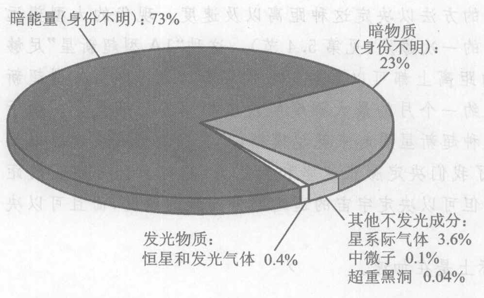

*图 11.21 宇宙是由什么构成的？这些数字表明，不论未知的暗能量和暗物质的本质是什么，宇宙的主要组分和构成我们的不是同样的材料。*

> **如果你以前觉得宇宙学难以理解，那么你最好吃点聪明药，因为情况只是变得更糟。**
> ——Michael Turner, 芝加哥大学天体物理学家

回到本节开头所提的问题上来：如果宇宙继续加速膨胀，它将不仅永远膨胀下去，而且将永远膨胀得越来越快。但是这需要假定宇宙的确保持加速，而在经历了过去几年的出人意料之后，很少有宇宙学家会作任何特定的长期图赌。

> **概念检查 7**
> 1A 型超新星爆发是测量宇宙膨胀加速度的极好标尺，是因为 (a) 它们都发出大致等量的光；(b) 它们离我们都一样远；(c) 它们可以在很远的距离之外看到；(d) 它们都以同样的速度离开我们。

> **概念检查 8**
> 暗能量 (a) 是由某种未知形式的物质构成；(b) 具有质量；(c) 是由看不见的电磁辐射构成；(d) 对空间有推力。

## 11.7 宇宙暴胀和宇宙简史

1979 年，物理学家古斯（图 11.22）把广义相对论、量子物理学（第 13、第 14 章）和高能物理学（第 18 章）里的观念结合起来，以解释宇宙中的物质和能量如何能够通过一次发生在于近乎“真空”的空间中的一次高能亚微观事件，从近于一无所有的情况下被创造出来。古斯的假说⑥并不解释宇宙实际上如何开始，但是它的确解释了宇宙从包含极少量的物质和能量的一小块时空出发，如何在大充填物质和能量并同时猛烈膨胀。

简短地说，古斯的假说是：宇宙开始时小得不可思议，比一个质子还小得多，并且立即膨胀。在一个极早的时刻，在宇宙开始后的大约一万亿亿分之一的一万亿亿分之一的一万亿亿分之一 ($10^{-36}$) 秒，宇宙会经历一次极为迅猛的膨胀阶段，膨胀的速率远远超过光速，在这个过程中，它在仅仅 $10^{-35}$ 秒的时间内就猛烈拉伸 $10^{25}$ 倍。要看到这是多么使人目瞪口呆，试着写出这两个数字。这个玩命的膨胀被恰当地称为“暴胀”（回忆图 11.14），这个假说叫做**宇宙暴胀假说**。

*⑥ 它也叫做暴胀“电影脚本”和“宇宙暴胀理论”。由于本书强调科学的认知过程，我倾向于使用假说这个术语，以表明这个奇妙的想法仍然处于尝试性的和不完备的状态，因为现在有几种不同的可能的暴胀“脚本”，它们都共享暴胀的主要思想。*

这些听起来全都稀奇古怪而且难以置信，但是近来它已经受到一些观测证实。对这个假说的一个反应是：宇宙怎么能以快于光速的速度膨胀呢？因为狭义相对论已经预言没有什么东西能够走得比光速更快。我们在第 11.3 节和这个问题打过交道：狭义相对论预言的是，任何东西都不能比光更快地穿过空间运动。但是广义相对论告诉我们，宇宙的膨胀是空间本身的结构的膨胀，对它并没有速度极限。这个膨胀带着星系和别的物体和它一起走，但这些物体相对对于它们周围的空间仍然处于静止，正像你能够停在机场里的“活动人行道”上保持静止，而人行道带着你和它一道前行一样。

我们来更细致地讨论一下暴胀。根据古斯的假说，我们的宇宙在开始时是如此之小，使得像不确定原理这样的量子效应（第 14 章）支配着一切。不确定原理的一个含义是，在每个空间区域中，区域内的能量围绕它的平均值随机地（不可预测地）上下涨落，有点像一个湖面的一部分由于风的吹拂而起浪上下涨落。即使在假设为“空虚”的空间里，不确定原理也仍然要求有这种能量涨落。

暴胀假说并不告诉我们宇宙如何起源，但是它的确告诉我们宇宙可能怎样开始膨胀以及它的庞大的物质和能量总量可能来自何处。人们认为，在极小的亚微观尺寸上，时间和空间并不以我们所认识的那种形式存在，而是断裂或“量子化”为一个个不相连的小段，每段的持续时间约为 $10^{-43}$ s（真短！）而直径（径宽）约为 $10^{-35}$ m（真小！）（见第 18 章）。按照暴胀假说，在这样的一小段中，发生了一次大得不同寻常的能量涨落。这个涨落的大小约为 $10^9$ J，大约是一个汽车油箱的汽油所含的能量。根据公式 $E=mc^2$，这么些能量的质量是 0.01 mg——大约是一颗灰尘的质量。这听起来不像是一笔大能量，但是当它全部都塞在这么小的区域中时，就能发生惊人的事。这些惊人的事情之一，就是这么小的区域集中这么些多能量就会产生一个极高的温度，大约是 $10^{32}$ K（试着把它用普通的数字写出来）。仅仅因为它是如此之热，我们的宇宙就立即开始膨胀（这也是普通的爆炸引起膨胀的原因），而膨胀又将宇宙从如此热的 $10^{32}$ K 冷却到大约 $10^{28}$ K。

在望远镜看无法到的地方，显微镜开始观察。这两者哪一个看到的东西更多？
——雨果

近代物理学的一个重大题目是，宇宙仅仅是由延展到全部空间和时间的几种场构成的，我们在讨论引力场和电磁场时（第 8 章和第 9 章）已经遇到过这个题目。宇宙暴胀假说建立在一种新型的场的基础上，这种场叫做希格斯场（第 18 章），现在尚未在自然界中发现。当我们那时候还很小的宇宙膨胀和冷却到 $10^{28}$ K 时，希格斯场产生出一种叫做“假真空”的东西，它相当于一个引力场，不过是强烈的相斥而不是像我们熟知的重力那样相吸。这个排斥力将宇宙送进一个短暂的迅速加速膨胀或“暴胀”的阶段，膨胀速度比光速快得多。这个膨胀实际上按“指数”规律进行——即有固定的翻番时间（见第 7.8 节）。指数增长能产生惊人的效果。虽然这个暴胀阶段开始于大爆炸之后的 $10^{-36}$ s 并且只持续到大爆炸后 $10^{-34}$ s，宇宙的大小还是翻番了近 100 次，得出的宇宙大约比暴胀前大 $10^{25}$ 倍（10 亿亿亿倍）。即使在暴胀后的宇宙的跨径也只有 1 mm，但无论如何这个膨胀是极其猛烈的。想象用高压消防水枪对一个气球充气的情景。

物理学家相信，只有四种基本的力场：引力场、电磁场、“弱力”场和“强力”场。后两者与核力（第 15 和 16 章）相关联，只在原子核的层级上才明显。但是在早期宇宙的烈火中，这四种基本力曾经“融合”在一起，不可区分。起初只有一种力，不是四种。物理学家说，那时这四种力有同样的“对称性”，因此不单个存在。随着宇宙冷却，引力突然从这个统一力中“冻结”出来；它失去了曾经把它和别的力统一起来的对称性，转而呈现它自己特有的引力特性。这种“对称性破缺”与水结冰时的对称性的丢失相似：在水里面一切方向是平等的，但是冰晶却在特定的方向上排队——对称性的丢失。随着宇宙继续冷却，强力也冻结出来，形成它自己独特的物质型式 (pattern)，如图 11.23 所模拟的夸克-胶子浆体 (plasma)。最后，弱力和电磁力也冻结出来，留给我们四种力，它们具有四组各自不同的特性，就是我们今天观察到的。

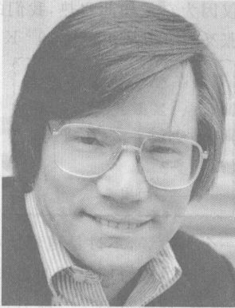

*图 11.22 1979年，高能粒子物理学家古斯做出了一个重大的宇宙学发现：宇宙暴胀的观念。这个假说在实验上得到宇宙背景辐射的卫星观测结果（见图 11.13）和别的宇宙学观测的有力支持。宇宙暴胀也许是到目前为止对最早的一些时刻发生的详细情况的最好的科学解释。*

> **宇宙学是对宇宙中最大的东西的研究，而粒子物理学研究的是最小的东西；科学的内在的统一性，没有比宇宙学和粒子物理学之间的相互作用表现得更清楚了。**
> ——Rocky Kolb, 费米实验室的物理学家

> **我们现在知道，在宇宙早期时刻的高温高密度的的大动乱中，只有最初始的物质才能存在；任何短暂的结合如原子（更不用说中子了）都会迅速被分解掉，快过火山口中的一只蝴蝶。**
> ——莱德曼与施拉姆，引自 From Quarks to the Cosmos

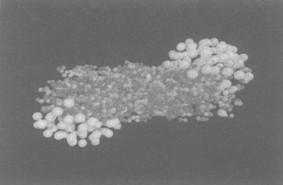

*图 11.23 一个真实的实验实验室的模拟“快照”：在这个实验中，两个铅原子核在很高的能量下相碰撞。这个模拟图画出在碰撞发生后刚 $6 \times 10^{-24}$ s 的两个原子核，图中的白球表示质子和中子，用较暗的颜色画的较小的粒子是“夸克”粒子，质子和中子都是由夸克构成的（见第 18 章）。这是一个对真实实验的模拟，这个实验复制了理论预言的描绘在大爆炸后大约 $10\ \mu\text{s}$ 时存在过的“夸克浆体”。在这个新物态里，夸克被释放出来自由漫游，而不是被捆绑在一起形成更复杂的粒子如质子和中子。*

但是，如果能量守恒，并且如果万事万物都从一个其质量只相当于一粒尘埃的能量涨落发展而来，那么宇宙中的全部质量和能量是从何处来的？它们的来处如下：任何一团只由引力结合在一起的孤立物质如一颗恒星，其引力能量都是负的（小于零），因为要把它拉开成分开的碎片，必须对恒星做功（而不是从恒星得到功）。同样，整个宇宙由于它的所有各部分之间的吸引而来的引力能量也是一个庞大的负值。暴胀并不改变宇宙的净能量，而是以相等的数量生成负能量（引力势能）和正能量（动能、辐射能和生成物质所需的能量）。它像一个人靠借钱进行高消费；他花钱像一个百万富翁，但是他的净资产仍然是零。因此宇宙的净能量仍然非常接近于零，在庞大的负引力势能和比引力势能略大一点的庞大的正能量之间保持平衡，只多了一个油箱的汽油的能量。我们在今天在周围看到的物质和运动的正能量是在早期宇宙中从重力“提取”的。

正如像古斯所说的，宇宙暴胀是“最盛大的免费午餐”：这一罐汽油的能量是时间、空间、物质和运动的种子。这是一个关于万物是怎样来的权威故事。

图 11.24 示出这个时间序列的一些详细情形。时间是按 10 的幂次而不是简单地按秒刻度，因为在早期宇宙中由于涉及高能量而快速地发生了许多事情！

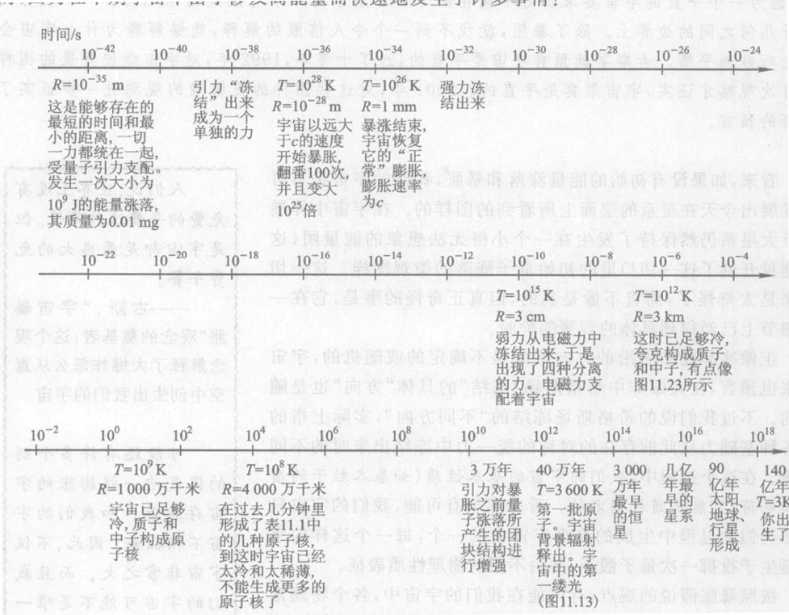

*图 11.24 宇宙的一部极简略的历史。所有的数目都只是近似的，并且最初的一百万分之一秒纯为假说（尚未被观测直接检验）！温度的单位是从绝对零度算起的开尔文度 $K$。可观察到的宇宙的半径缩写为 $R$。在暴胀结束后的全部时间里，宇宙的大小都是可观察到的宇宙的 $10^{25}$（10 亿亿亿）倍，因为在暴胀阶段宇宙膨胀的速度比光速快得多，以致几乎它的全部都如此遥远，使得在宇宙的整个历史时期里光都不能从那里到达这里。*
*(Timeline text details omitted for brevity, but they describe epochs from Planck time to present)*

**我们怎么知道发生过宇宙暴胀？** 宇宙暴胀已经通过了几个实验检验。首先，它对我们在今天的宇宙中所看到的大尺度成团的现象（恒星“成团”结成星系，星系结成星系团，星系团还要结成超星系团）提供了一个令人信服的解释。不难理解，任何初始的团块结构如何被引力增强变成今天的有相当多团块的恒星和星系的宇宙——正像引力能够从弥漫的气体和尘埃云产生恒星一样（第 5 章）。在暴胀假说之前，大爆炸模型对于是什么造成了初始的团块结构，不能提供任何线索。宇宙暴胀给出的答案是，量子不确定性在大爆炸中造成了微观的团块，然后这些微观团块被宇宙膨胀拉所拉伸。没有暴胀，拉伸的总量将太小，用量子涨落远不足以解释今天看到的庞大的团块（星系团，等等）。暴胀解决了这个问题：暴胀剧烈地拉大了初始的量子团块，引力再对这些拉长了的团块加工，刚好产生出今天观察到的团块。

其次，古斯的假说还解释并解决了观测到的我们的宇宙的平直性。理由很简单：暴胀把宇宙拉伸得这么厉害，使得任何总体弯曲都被拉平了，这就和一个膨胀着的气球的表面，在气球表面上一个蚂蚁看来越来越平一样。在我们的宇宙中，这件事本应使人惊奇，因为一个平直的宇宙要求正好平衡图 11.15 所示的一个有限大的闭几何和一个无穷大的开几何之间的边界上。除了暴胀，就找不到一个令人信服的解释，能够解释为什么宇宙会如此巧妙地平衡。古斯早就预言宇宙是平直的，过了十多年，1992 年，对宇宙微波背景的图样的首次观测才证实，宇宙真的是平直的。2001 年，对这些图样的更精确的观测进一步证实了古斯的预言。

看来，如果没有初始的能量涨落和暴胀，我们的宇宙是不可展能发展出今天在星系的层面上所看到的图样的。在宇宙中伸展的巨大星系仍保持了发生在一个小得无法想象的能量团（这团能量开创了这一切！）里的初始量子涨落的微观图样。这一切听来是太奇怪了，简直不像真的，但真正奇怪的事是，它在一些细节上已经得到具体的观测的检验。

正像冰晶凝结所沿的方向事先是不确定的或随机的，宇宙暴胀也预言，在大爆炸中希格斯场“冻结”的具体“方向”，实际上指的是各种基础力从此存在的对称的统一力中冻结出来时的不同性质。在这个过程中，我们的宇宙的基本性质（如基本粒子的质量和电荷）可能是随机确定的。看来甚至有可能，我们的宇宙只是在类似的过程中生成的许多宇宙中的一个，每一个这样的宇宙诞生于投掷一次量子骰子，并由不同的物理性质表征。

按照暴胀假说的观点，有可能在我们的宇宙中，各个物理常量的数值取得恰到好处，使得可以演化出智能生物。在任何别的宇宙中，这些物理常量可能非常不一样，使得生命和智能在物理上成为不可能。也许，我们自身的存在正是最好的解释，解释这些常量为什么取现在它们所取的值。我们的宇宙必须按这样的方式组织，因为任何别的组织方式都不允许有观察者在这里提出这个问题，这个想法叫做人存原理 (anthropic principle)。

大爆炸和地球上我们的生命之间的这个联系是奇特的但是言之成理的，在这里结束我们在宇宙学中的漫游是合适的。

> 人们说，世界上没有免费的午餐这种事情。但是宇宙却是最盛大的免费午餐。
> ——古斯，“宇宙暴胀”观念的奠基者；这个观念解释了大爆炸怎么从真空中创生出我们的宇宙

> 可能还有许多个别的像气泡一样膨胀的宇宙存在着，和我们的宇宙不相往来。因此，不仅宇宙非常之大，而且我们的宇宙可能不是唯一的宇宙。
> ——莱德曼与施拉姆，引自 From Quarks to the Cosmos

> **概念检查 9**
> 是否有什么东西比光更快？(a) 是，空间的膨胀可以快于光速；(b) 是，某些亚原子粒子可以以比光速更快的速度在空间运动；(c) 否，狭义相对论不允许比光更快；(d) 否，广义相对论不允许。

> **概念检查解答**
> 1. (b)、(c)。
> 2. (b)。
> 3. (b)。
> 4. (c)、(d)、(e)。
> 5. (b)；星系、恒星和别的特定物体在一个总体是平直的宇宙中使空间的一小部分弯曲。
> 6. (c)、(e)。
> 7. (a)、(c)。
> 8. (b)、(d)。
> 9. (a)。

### 关键概念

下述概念的定义出现在所标页码的本书正文页面上和书末的按拼音排序的术语词汇中。我们将会它们按出现先后顺序排列在这里，你可以用这个清单复习本章内容。

*   等效原理 249
*   时空 253
*   宇宙学 254
*   大爆炸 254
*   宇宙微波背景 255
*   宇宙膨胀 257
*   闭宇宙 257
*   平直宇宙 257
*   开宇宙 257
*   暗物质 260
*   加速膨胀的宇宙 262
*   红移 263
*   暗能量 263
*   宇宙暴胀 265
*   人存原理 269
*   重力必定使光束弯曲 250
*   弯曲的空间 251

### 复习题

**爱因斯坦的引力；广义相对论**

1.  举出两个你可以在一艘在外层空间中以一个 $g$ 加速运动的宇宙飞船中做的实验，它们使你以为你还在地球上处于静止。
2.  按照等效原理，加速度等效于什么？
3.  用你自己的语言陈述等效原理。
4.  给成一条表明引力使光线弯曲的证据。
5.  在一个加速运动的参考系中观察，光束会弯曲吗？关于引力对光束的效应，这个现象告诉了我们什么？
6.  按照牛顿的观点，引力是实物物体作用在别的实物物体上的力。按照爱因斯坦的观点引力是什么？

**大爆炸**

7.  宇宙的年龄大约是多大？
8.  举出支持大爆炸的两条不同的证据。
9.  宇宙中最多的元素是什么？
10. 接着上一问题，宇宙中第二多的元素是什么？
11. 举出两个不是在大爆炸中产生的元素。再举出两个在大爆炸中产生的元素。

**宇宙的几何**

12. 对平直的二维空间、弯曲的二维空间和有限广延的二维空间，各举一个例子。
13. 从我们的实际三维空间之内，我们怎么能判断这个空间是否是弯曲的？
14. 列举宇宙的三种可能的大尺度几何，并对其中至少一种加以描述。

**空间的形状**

17. 关于空间的总体形状，观测证据告诉了我们什么？
18. 举出一条我们是生活在一个平直宇宙里的证据。
19. 什么是宇宙微波背景？
20. 大爆炸发射大量的高能辐射。那么为什么我们探测到的大爆炸辐射主要是低能的微波呢？

**暗物质**

21. 普通物质大约占宇宙总质量的百分之几？
22. 暗物质大约占宇宙总质量的百分之几？
23. 什么是“暗物质”？
24. 为什么它叫“暗”物质？
25. 是什么使天文学家假设有暗物质存在？

**加速膨胀的宇宙和暗能量**

26. 宇宙的膨胀是在慢下来，还是在加速，还是维持一个不变的速度？
27. 描述宇宙是在加速膨胀的观测证据。
28. 是什么使宇宙的膨胀加速？
29. 暗能量大约占宇宙构成的多大的百分比？

**宇宙暴胀和宇宙简史**

30. 宇宙暴胀假说是试图解释什么？
31. 按照宇宙暴胀假说，是什么引起了大爆炸？
32. 人们为什么叫它“暴胀”？
33. 既然能量守恒，并且宇宙仅仅发端于一桶汽油的能量值，其质量仅为 $0.01\ \text{mg}$，那么宇宙是如何才能获得它今天所具有的巨大的能量和质量的呢？
34. 举出两条支持宇宙暴胀假说的证据。

**综合题**

15. 大爆炸和一次普通的爆炸有什么根本的不同？
16. 由于宇宙的膨胀，星系会穿过空间运动吗？加以说明。
35. 宇宙学家并没有预料到会发现宇宙是加速膨胀的。他们预料的是什么？
36. 为什么 1A 型超新星是这么好的确定宇宙膨胀速率的标记？
37. 宇宙中虽多的组成成分是什么？
38. 为什么我们以有暗能量存在？
39. 假设有某个星系 X，它离我们的星系如此之远，以致宇宙的膨胀使得它以光速的一半远离我们的星系。这意味着星系 X 是以光速的一半穿过空间运动吗？试解释之。
40. 四种不同的基本力在大爆炸中的出现，在哪些方面与水从液态到固态的物态变化相似？
41. 如果宇宙暴胀理论是正确的，那么自然界中的单次量子涨落的最重要的例子无疑是什么？
42. 我们今天在宇宙中看到的太尺度结构是怎样从微小的量子涨落发展出来的？
43. 一颗孤立的星体的总引力能量是正的还是负的还是零？
44. 为了生成我们在今天的宇宙中看到的所有的物质和所有的运动，需要极大其量的能量。按照宇宙暴胀假说，这些能量从何而来？
45. 宇宙暴胀听来有些牵强附会，但是有一些证据支持它。叙述两条证据。

### 思考题

**爱因斯坦的引力；广义相对论**

1.  如果你是在一艘火箭舱里，在远离一切恒星和行星的太空中以两个 $g$ 加速运动，你感觉自己有多重？
2.  在上题中，如果你的加速度是半个 $g$ 呢？如果你根本不做加速运动呢？
3.  广义相对论在什么方面比狭义相对论更广义？
4.  由于长时间的失重，宇航员的心脏和肌肉在太空中功能会减退。为了克服这个问题，怎样才能在一个空间站中加上人造重力？
5.  如果你在一艘火箭舱里，在远离一切恒星和行星的太空中以两个 $g$ 加速运动，并且掉下一个球，你会观察到球怎样运动？
6.  在上题中，如果你的加速度是半个 $g$ 呢？如果你根本不做加速运动呢？
7.  在等效原理中，是什么和什么等效？
8.  为什么在地球上我们看不到光线的引力弯曲？
9.  一颗高速运动的子弹的路径弯曲得比光线厉害吗？为什么？
10. 一支步枪和一个激光器双双瞄准一段距离外的一个靶子。广义相对论声言，在它们水平运动途中都受有相同的向下的加速度，但是子弹击中靶子的地方却在激光光束下面很远。解释之。

**大爆炸**

11. 你身体中的氢原子核是怎么起源的？
12. 你身体中的氧原子核是来自大爆炸吗？
13. 大爆炸被说成是宇宙学和亚微观物理学相遇的地方。为什么？
14. 大爆炸只生成三种化学元素。为什么它不生成更多的化学元素？
15. 假设我们能够在一瞬间让宇宙中的所有星系的速度倒转方向。然后若我们观察遥远的星系，它们看起来是什么样子？
16. 今天的宇宙中有一处特别的地方，大爆炸就是在那里发生的吗？加以说明。

**宇宙的几何**

17. 如果我们把地球的表面看成一个二维“空间”，那么赤道就是这个空间中的一条“可能最直的线”。还有别的这样的线吗？
18. 在地球表面上，南北方向的经线属于可能最直的线之列吗？东西向的纬线呢？
19. 你能在一个球面上画一个三角形，使它的每个角都是 $90^\circ$，因此三个角之和为 $270^\circ$ 吗？这个三角形看起来是什么样子？
20. 今天的宇宙中有一个地方处于宇宙的中心吗？加以解释。
21. 今天的宇宙中有一个地方处于宇宙的边缘吗？加以解释。

**宇宙的形状**

22. 在大爆炸之后大约 40 万年时，发生了什么重要事件？
23. 在大爆炸之后大约 40 万年时，释放了宇宙背景辐射。在此之后的宇宙与在此之前的宇宙有什么不同？
24. 想象一个巨大的三角形，它铺盖了可观察的宇宙的大部分。这个三角形的三个角加起来是等于寻常的 $180^\circ$ 呢，还是大于或小于 $180^\circ$？
25. 如果一个遥远的观察者能够实地观察大爆炸后仅仅 30 万年的宇宙，他会看到任何东西吗？加以解释。
26. 为什么光不能穿过早期宇宙？
27. 我们说宇宙是“平直的”，这是什么意思？

**暗物质**

28. 有什么证据说我们的银河系可能包含有“暗”物质？
29. 按照现行的理论，你的房间里有暗物质吗？
30. 为什么你看不见你房间里的暗物质？
31. 既然暗物质是看不见的，是什么使我们认为它可能是存在的？
32. 为什么如果在实验室里发现了暗物质，将是一项巨大成就？
33. 暗物质通过引力相互作用吗？我们是怎么知道的？

**加速膨胀的宇宙和暗能量**

34. 既然宇宙的膨胀是加速的，在宇宙学家眼中宇宙的命运是永远膨胀下去有任何疑问吗？加以解释。
51. 如果宇宙暴胀理论是正确的，那么自然界中的单次量子涨落的最重要的例子无疑是什么？
52. 我们今天在宇宙中看到的太尺度结构是怎样从微小的量子涨落发展出来的？
53. 一颗孤立的星体的总引力能量是正的还是负的还是零？
54. 为了生成我们在今天的宇宙中看到的所有的物质和所有的运动，需要极大其量的能量。按照宇宙暴胀假说，这些能量从何而来？
55. 宇宙暴胀听来有些牵强附会，但是有一些证据支持它。叙述两条证据。