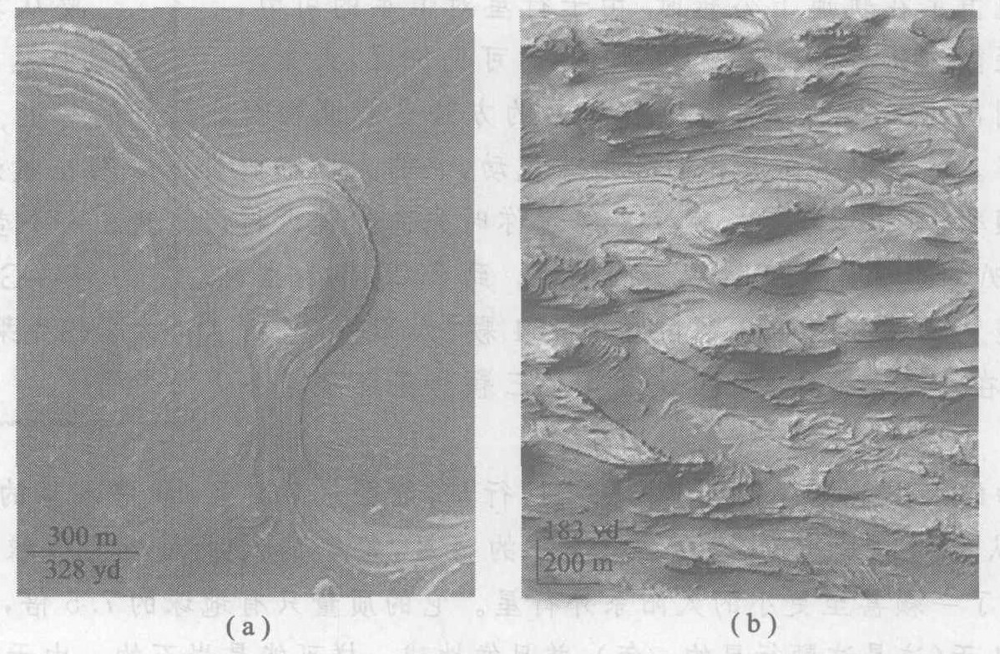
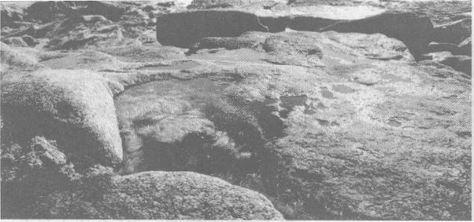
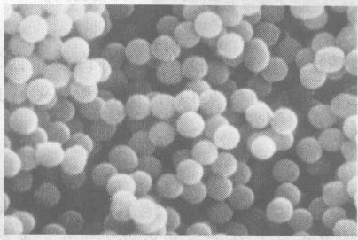
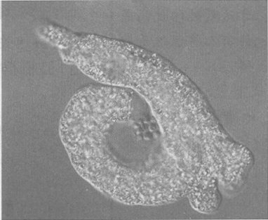
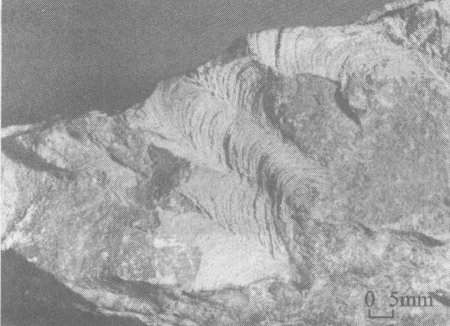
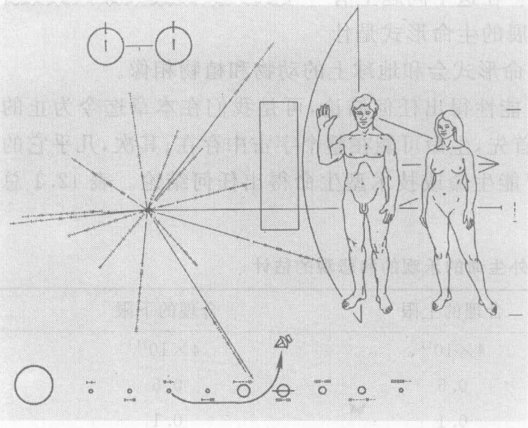
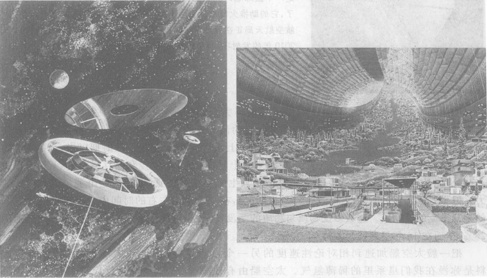
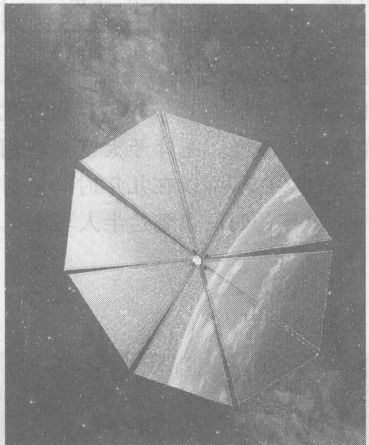
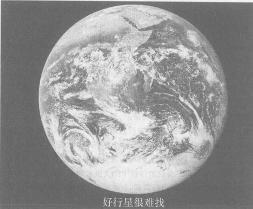
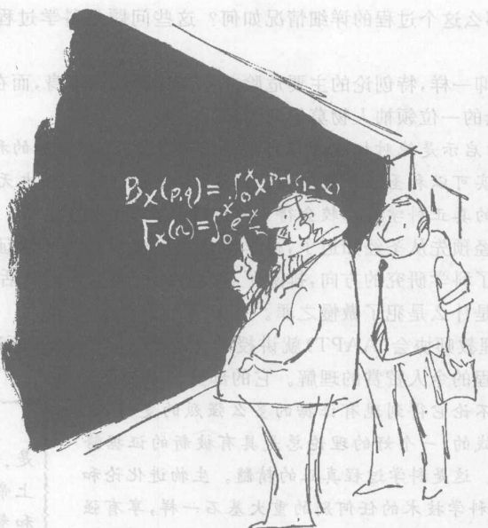

# 第 12 章 探寻地外智能

> 有时候我想我们是孤独的，有时候我想不是。不论在哪种情形，思绪都蹒跚不定。
> ——Buckminster Fuller，建筑师和未来学家

我们是孤独的吗？人类对这个问题已思索了至少 2000 年了。在公元前 1 世纪，罗马诗人卢克莱修提出，正如在地球上生命起源于自发的化学相互作用一样，“我们必须承认，在宇宙中别的地方也会发生别的原子的这种结合，生成像这个世界一样的世界。……因此我们必须认识到，在宇宙的另外的部分还有另外的世界，有不同种类的人类和动物。”某些人类学家相信，发现外星智能的存在将不可逆转地改变人类对自己的看法。这种发现的可能性鼓舞了许多科学家把他们的大部分专业活动用于探寻地外智能（search for extraterrestrial intelligence，缩写为 SETI）。反之，智能只在地球上才演化出来的结论则将挑战哥白尼的原理，哥白尼原理（第 1 章）认为，自然界处处基本上相同，虽然细节有别。

这里是讨论探寻地外智能的一个合适的地方，因为现在你已掌握了讨论它所需要的物理学工具——牛顿定律、电磁辐射和狭义相对论。在处理这样一个推测性的问题时，我们必须小心，坚持以观察数据为基础，并且注意到结论中的不确定性。在本章中，我们能够对一些问题得出高度可信的结论，对另一些问题则不能。

本章遵循一个普遍的分析方法，这种方法已成为讨论地外生命的“标准做法”，并且是思考推测性问题的一个很好的范例。① 我们把“地外智能生命的可能性有多大？”这个问题分解为若干个子问题，每个子问题本身是有趣的：存在有别的类地行星（与地球想像的行星）的可能性有多大（第 12.1 节）？有了一个类地行星，生命发生的可能性怎样（第 12.2 节）？有了生命，演化出智能的可能性如何（第 12.3 节）？在这之后，我们再追加两个问题：有了智能，开发技术的可能性有多大（第 12.4 节）？有了技术，一种生命形式和我们接触（或我们同他们接触）的可能性如何（第 12.5 节）？第 12.6 节关注一个使人烦恼的相关问题：如果的确在别的行星上发展起来了建立在技术上的文明，它们能长久持续吗？最后，第 12.7 节讨论实际上是否有外星生命访问过我们，我们把这个问题放到一个更大的题目下讨论，这个题目是当前的一个紧迫问题，那就是伪科学。

> 因为这个世界是大自然这样创造的：原子以成千上万种方式自发地、随机地碰撞，漫无目的地、毫无用处地被驱赶到一起，没有任何结果；在这之后，终于有一天，突然有一些特定的原子结合在一起，从它们能够衍生出我们所知道的各种东西——大地、海洋、天空和各种各样的生物。因此，我们必须承认，在宇宙中别的地方其他原子也会发生这样的结合，生成与我们的世界相像的世界。……因此我们必须认识到，在宇宙的其他部分还有别的世界，有别种人类和动物。
> ——卢克莱修，罗马诗人，公元前 1 世纪

① 这个普遍方法是天文学家 F. Drake 于 1965 年首先引入的。

---

> 这是一幅令人忧郁的场景。如果星星上住着人，那么痛苦和愚蠢将散布到多大的范围啊。如果它们上面没有住人，那么空间又是多么浪费啊。
> ——卡莱尔，19 世纪苏格兰散文作家和历史学家

## 12.1 还有别的适合于生命的“好”地方吗？

我们从一个重要的观察结果出发：地球上已经发展出智能生物。这一点，连同科学中普遍流行的哥白尼主义观点（第 1 章），即自然界的原理在宇宙中到处都一样，必然得出这样的结论：条件与地球相似的其他地方也可能孕育生物。因为在推测时采取保守态度比较明智，本章采用比较保守的做法，只研究在与地球想像的条件下发展出智能的可能性。我们将不猜测这样的可能性，例如，生命是否能在星际空间中发展，或者生命是否能由暗物质（第 11 章）构成。

> 十年前，还能争辩说，太阳系是独一无二的。但是今天，各种证据强有力地表明，我们银河系中的行星系是很丰富的。单从统计数据看，很可能其中有许多具有有利于生命的条件。
> ——A. Sargen 和 S. Beckwith，天文学家，引自 Physics Today 1993 年 4 月号上的一篇文章

科学的力量部分来自被称为分析的方法：把一个问题分解成几部分，分别进行考察。地外智能是一个特别适合于进行分析的题目，因为如引言中所述，它自然地分解成几个子问题。每个子问题对应于一两门特定的学科。第一个子问题是一个天文学问题：有多少个像地球这样的“好”地方，这些地方的地质条件（行星质量、温度、大气和水）与地球十分相似，使得生命能够开始？在这里和在本章的其他地方，我们只限于分析我们的本星系银河系，因为本星系看来是其他星系的一个典型情况。然后可以把我们的结论推广到整个宇宙，只要乘以至少 10 亿个星系。

> 空间是一面镜子，它等待着生命前来照见自己。
> ——R. Bradbury，科幻作家

天文学家相信，仅仅本星系中就有大约 $4 \times 10^{11}$（4 000 亿！）颗恒星。有多少颗好的行星或卫星围绕这些恒星呈呢？我们关于恒星形成的知识（第 5 章）表明，别的恒星也和我们的太阳一样，也是由星际气体和尘埃引力坍缩而成。但是许多正在形成的恒星破裂为双星或三合星系统，而不是坍缩为单颗恒星。对太阳邻近的恒星的观测显示，大约有 50% 实际上不是单个光点，而是两个甚至多个恒星相互环绕旋转的系统。由于聚星系统可能会破坏行星生成过程，我们将忽略这种系统周围存在生命的可能。

许多单星的质量太大或太小，不能拥有好的行星。质量比我们的太阳大得多的恒星“燃烧”得太猛，在几百万年里就耗尽了它们的燃料，而不是几十亿年。有几分像一辆巨大的老古董汽车，有一个硕大的油箱，里程数却极其低无。这个时间可能太短，使生命无法发生，因为在地球形成之后，过了整整 8 亿年，岩石才不再像雨点般地落下，压碎生命发展的任何可能性。因此我们认为，质量很大的恒星不具有好行星。

质量比太阳小得多的恒星的燃烧很慢，一个行星要够暖使得生命能够存在，其轨道就必须离恒星很近。但是离恒星这么近的行星会受到如此强的引力，它将把行星锁定在永远以同一面对着恒星的情况（就像月亮被锁定永远以同一面对着地球一样）。这将迫使该行星可能具有的大气都跑到行星的暗面，冻结在那里。由于地球的大气对地球上的生命是必不可少的，我们也排除了小质量恒星的候补资格。

天文学家估计，在本星系中大约有 10% 的单星其质量和太阳的质量非常相近，因而可能具有好行星。在这些类日恒星中，有多少具有行星，这些行星中又有多少和地球相像？

**我们怎么知道其他恒星周围行星的情况？** 要看别的恒星周围的行星是困难的，因为它微弱的反射光被其中心恒星发的光所掩盖。但是恒星生成理论和观测证据都表明，许多单星拥有行星系统。

当行星环绕恒星在轨道上公转时，由于行星对恒星的引力，行星也使恒星轻微地晃动。细心追踪恒星的可见位置，天文学家可以直接检测出这种晃动。另一个较容易的方法是观测恒星所发的光的频率。随着恒星向着和离开发球晃动，它的光也移向较高或较低的频率，其道理就和汽车经过你时喇叭声音变高然后变低一样。到 2005 年为止，用这些方法已经发现了环绕 136 颗恒星的 154 颗“太阳系外”行星（第 5 章）。③ 在许多场合下，两颗或者甚至三颗行星环绕着一颗单星。

大多数已知的太阳系外行星是大质量的巨行星，范围从 0.2 到 10 倍木星的质量，因为这样的行星最容易认出。但是也发现了一些较小的行星，每个的尺寸大小为地球的 15 至 20 倍。2005 年，还发现了一颗甚至更小的太阳系外行星。它的质量只有地球的 7.5 倍，环绕它的恒星公转一周只要 1.94 天（这是这颗行星的一年），并且像地球一样可能是岩石的。由于它和它的恒星非常靠近，它的温度是水已变成蒸汽的 $200^\circ\text{C}$ 或更高。随着新技术显露出更小的质量与地球相当的行星，以及对大气成分的细致分析和有生命出现的化学表征，我们期望将来有更多的这方面的证据。

> 要从其恒星的眩目光辉中抠出一颗太阳系外的行星，其难度无异于试图在核爆炸的眩光中找出一个萤火虫。
> ——G. Marcy，加州大学柏克莱分校的行星搜寻者

有间接的证据表明，大多数单星具有行星系统。我们本来预期，一颗由气体云塌缩生成的单星随着气体云的塌缩自转得会越来越快，就像一个旋转的花样滑冰运动员收拢双臂时转得越来越快一样。但是观测表明，大多数类日单星自转得不是很慢。使一颗单星不快转的最可能的机制，就是生成了一个快速旋转的扁盘，这个快速旋转的扁盘在中央恒星塌缩时留在后面，并且最终聚合成行星。

② 恒星并不是真的燃烧，它们发生的是“核聚变”（第 16 章）。
③ 你可以在网上找到经更新、包括有最新发现的太阳系外行星的表，网址为 www.cfa.harvard.edu/planets。

---

任何对地外生命可能性的估计中，显然有许多的不确定性，我们给出的任何估计都只能是一个合理的猜测。为了在我们的结论中体现不确定性，我们将作两个估计：一个是上限，它是对存在地外文明的机会的一个有道理然而乐观的估计；还有一个是下限，它处于合理的范围的底端。一个合理的上限估计是差不多所有的类日恒星都有行星。而一个合理的下限估计可能是，10% 的类日恒星有行星系。更小得多的估计值，比方 1%，在已有的前面所述的证据的情况下看起来是不合理的。请记住，这样的一些数目只是合理的猜测——假说。

有了一个类日恒星带着一个行星系，有多少个行星或卫星可能具有有利于生命的条件呢？在我们的太阳系内，除了地球以外，可能存在这样的条件的地方还有火星、木星和土星的大气，木卫二的冰盖下可能存在的海洋，和几十亿年前的土卫六，它那时的状态与地球相似。

火星上过去可能曾有生命发端，甚至今天可能仍有生命存在于一些特别的环境中，如与比较晚近的火山活动有关的温泉中。虽然火星今天是一片又干又冻的沙漠，但是在整个行星上有着久远的河谷、湖泊甚至海洋的痕迹，表明大约 40 亿年前它曾是一个更温暖、更湿润的行星（图 12.1）。美国曾于 1976 年发射两个飞行器在火星着陆，它们的任务之一便是寻找生命的征迹。人们曾以为，在火星土壤中可能存在有原始的单细胞微生物生命形式，与地球上出现多细胞动植物之前存在了十几亿年的生命形式相似。但是在火星土壤中搜寻有机分子的结果否定了这点。

*图 12.1 (a) 火星上的 Holden 环形山中像这样的沉积岩层暗示，这颗红色行星在古代曾经一度包含有湖泊。(b) 这幅火星的卫星图片显示了火星上的巨大峡谷 Valles Marineris 中的分层地面。这样的图样在地球上发现时，通常表示这种沉积岩是在非常动荡的水下环境中沉积的。*

好几个国家计划在不久的将来把自动轨道飞行器、登陆器、漫游车和地表穿透器送上火星。美国航天局 NASA 计划在 2007 年再向火星发送一个机器人使团；在 2011 年发送一个机器人，它能把火星表面和地表下的标本带回地球；并在 2020 年前派人在火星着陆。让我们等待在我们的邻居行星上的关于生命前置的进一步的消息！

作为一个上限估计，环绕每一个类日恒星有一个或更多的好行星或卫星似乎是有道理的，因为在我们的太阳周围，除地球外，还有别的五处可能有生命的地方。作为一个下限估计，可以争论说，我们太阳系中的别五处地方并非真正有利于生命，并且也许只有 10% 的行星系统中才有一颗类地行星。

总结一下：对本星系中“好”行星（环绕一类日恒星公转并且地质条件和最初的地球的地质条件非常相似，使生命能够起源）的数目的上限估计是

$$ (银河系中恒星的数目) \times (其中单星所占的比率) \times (单星中类日恒星的比率) \times \\ (类日恒星中有行星系的比率) \times (每个行星系中像地球这样的行星的个数) $$

$$ \text{实单：} (4 \times 10^{11}) \times 0.5 \times 0.1 \times 1 \times 1 = 2 \times 10^{10} $$

而下限估计是

$$ \text{下限：} (4 \times 10^{11}) \times 0.5 \times 0.1 \times 0.1 \times 0.1 = 2 \times 10^8 $$

即在本星系中有 2 亿到 200 亿颗好行星，这个结论反映了科学家的共识：有许多地方可能已经出现生命了。

> **概念检查 1**
> 假设别的某个星系包含 $8 \times 10^{12}$ 颗恒星，其中只有 25% 是单星，单星中有 10% 和太阳相像，这些类日恒星的 50% 有行星系，并且这些行星系中有 1% 含有一个类地行星。这个星系中有多少颗类地行星？(a) 100 万颗；(b) 2 000 万颗；(c) 1 亿颗；(d) 10 亿颗；(e) 100 亿颗；(f) 200 亿颗。

> **概念检查 2**
> 本节所讨论的发现别的恒星周围的行星的方法包括 (a) 靠视觉检测行星；(b) 靠视觉检测恒星响应行星的运动；(c) 检测带有行星的恒星发射的非同寻常强的射电波；(d) 检测由恒星的运动（它是对行星运动的响应）引起的恒星发光的频率漂移；(e) 检测由行星绕恒星运转引起的恒星所发的光的频率漂移；(f) 占星术。

## 12.2 在“好”行星上有生命发源吗？

有许多理由使我们以为，在地球之外是有生命存在的。地球上的生命的砖石——以碳为基础的化合物在本星系中散布得很广泛。液态水在本星系中很丰富，在别的星系中也可能如此。通过研究地球上生命的起源，我们可以探索其他地方生命存在的可能性。科学家对地球上生命的起源已经研究了一个多世纪，现在的知识已足以建立言之成理的假说。地球是从气体和尘埃引力坍缩形成太阳时后面留下的材料发展而来。第 5 章 5.3 节描述了这个过程并给出了一些证据。当 46 亿年前地球刚刚从这一过程生成时④，它是一个固态的、岩石的行星，基本上没有气态的大气。构成地球的某些材料是放射性的（第 15 章），它们的放射性使地球内部加热，使束缚在地球内部的气体在火山爆发或地热活动中升到表面上面。这些气体，主要是蒸汽、二氧化碳和氮，就构成了地球最早的大气。一旦处于大气中，大部分蒸汽就被冷却和凝结，形成海洋。因此在生命出现之前，地球部分地由液体水的海洋覆盖着，并且有一层由水汽、二氧化碳、氮、甲烷、氨和氢组成的大气。

这个原始的地球受到各种能源的作用，这包括行星由熔融的状态凝固时引力收缩所产生的热能、闪电、强烈的紫外辐射（当时还没有臭氧层阻挡太阳的紫外线）、火山活动的加热、早期太阳系中陨石和碎片的轰击、放射性和宇宙线（来自外层空间的粒子）。每一种能源都可以生成和破坏化学键，从而促进新的化学反应。这此能源提供的不仅仅是能，还有微观的组织。我们在第 7 章看到，为了组织一片叶子或别的什么系统的生长，必须有一个能流穿过这个系统，它带着一个……

④ 第 15.5 节讲述了这个日期的证据。

---

大大增加的熵输出，以减少系统的熵，从而仍然保持净熵增加，满足热力学第二定律的要求。

**我们怎么知道化学反应能够生成生命的砖石？** 科学家做过各种各样的模拟实验，以决定一个像原始地球那样的环境在得到这些能量输入时会发生什么情况。其中最著名的一个简单实验是米勒和尤里在 1953 年做的。由于当时认为早期地球大气是由水蒸汽、氢、甲烷和氨气组成的，他们把这些组分放进一个封闭的罐子中，让它们与液体水接触，加热以模拟火山的加热作用，并且在其中进行电火花放电以模拟闪电。然后他们等待了一段时间。液体水在几天之内变成棕色，化学分析表明含有丰富的氨基酸和核酸，它们是生命的砖石！生物蛋白质是由氨基酸连接成长链构成的，而 DNA 分子则是由核酸排成一条很长的“双螺旋”而形成的。

从那时以来，研究工作者已经得知，早期大气大概是由二氧化碳、氮和水汽组成，而不是米勒-尤里实验中所用的那四种成分。当实验中使用这些成分时，甚至得出了更多的氨基酸和核酸。事实上，许多科学家用各种各样的气体混合物和能源做了类似的实验。只要这些气体含有水汽、氮、氢和气体形式的碳，所发生的化学反应就会产生生命的砖石。

由此得出的教训是：生命的砖石是很容易生成的，不论我们用的是原始地球大气的几种似乎有道理的模型中的哪一种。

像米勒-尤里实验这样的实验并不产生生命，而只是生成“有机分子”，它们是生命的砖石。

一旦生成了这些有机分子，它们将会许多机会聚集在一起生成一种浓稠的有机物“汤”。例如，如果海洋边缘的一个潮汐池中的水中含有有机分子，并且如果池中的水部分或全部蒸发掉，那么在剩下的水中或干涸的陆地上，有机分子就会高度浓缩（图 12.2）。剩下几步还不是很确定。浓缩的有机物可以完全干掉，并且发生干反应，它也可以仍然悬浮在液体水中，并且发生湿反应。两种类型的实验都有人在实验室做过。在干实验中，氨基酸通过连接而发生反应生成长蛋白质分子！放回水中时，这些蛋白质呈现圆球物体的形状，与简单的生物细胞相似（图 12.3）。在湿实验中也得到类似的结果。这些物体叫做原细胞，它们从周围的液体中吸收原料，通过相互连接而生长，并且断裂以产生更多的这种物体。生物化学理论表明，如果把原细胞放在含有蛋白质和其他养分的水中，它们可以依靠吸收养分而生长，依靠简单的断裂而数目倍增。今天，单细胞有机体例如阿米巴正是依靠这种机制实现基本的生命功能（图 12.4）。原细胞可能经历了一种“化学演化”过程，在这个过程中，那些在生长和断裂中效率更高的原细胞繁衍起来，而那些效率低的原细胞则成为牺牲品，最终得出了原始的单细胞生物。

*图 12.2 在原始的地球上，像这样的潮汐池可能盛有富含有机物分子的汤，随着水分的蒸发，起浓度越来越高，就使复杂的化学反应得以发生，其产物然后又以原细胞或活的有机体对海洋“施肥”。*

*图 12.3 “蛋白质小球”在电子显微镜下的像。它们是加热干氨基酸混合物而形成的，回水中时，就取如圆的球形。这些原细胞与生物细胞相似，它们甚至能依靠吸收在它们周围分解的蛋白质而生长并且能发芽。它们的直径是几个微米——小的细菌的大小。*

*图 12.4 一种活的单细胞生物，阿米巴变形虫，正把自己的身体散开以包围附近的食物颗粒。*

1990 年前后，关于地球上“极端环境”中生命的研究导致另一个假说：有机分子有可能是在海底形成的，在深海的喷口——即海水被地下的炽热物质从下面加热的孔洞。推动这一发展所需的能量和组织可能是来自喷口的热量提供的。

**我们怎么知道地球上的生命开始于几十亿年前？** 一旦有足够的条件，使得生命能够在地球上存活下去，那么生命几乎就立即发生。我们有化学方面的（但不是化石的）证据，表明至少在 38 亿年前（即地球形成仅仅 8 亿年后）就有生命存在了。大约 39 亿年前地球所受到的岩石雨的猛烈轰击使得现代生命不可能出现更早。

已知的最早的化石（叫做叠层石）所出现的岩层，由放射性年代测定方法（第 15 章）测得其年龄为 30 亿年至 35 亿年。图 12.5 中的波纹状岩石沉积物是由“蓝菌”一层叠一层生长而形成的，蓝菌是生长在海底的一种像海藻的进行光合作用的单细胞细菌。图中的样品来自罗得西亚，其年代距今在 31 亿年至 27 亿年之间。蓝菌是一种“原核”细胞，是近代的以碳为基础的生命的最初单形式，它没有细胞核，其 DNA（遗传物质）是裸露的。这种简单的有机物将是此后 20 亿年地球上唯一的生命，直到大约 15 亿年前为止。

> 在大锅里煎熬着
> 壁虎眼睛，蛤蟆脚，
> 恶狗的舌头，蝙蝠毛，
> 毒蛇的信子，盲蛇的刺，
> 蜥蜴腿，枭鸟翅。
> ——莎士比亚，《麦克白》

> 回顾地质学记录，情况似乎是，大自然母亲在试过每一种可能的错误摸索后，才达到她的最高成就（也有人将这说成是她的最大错误）——人类。最终她试着造出这样一种生物，他身材不大，几乎毫无防卫能力；她给予他一件使其免于灭绝的礼物，即一个叫大脑的器官及其孜孜不息的活动。
> ——A. S. 爱丁顿，天文学家和物理学家

> 只要自然条件与大约 40 亿年前我们在地球上的条件相似，生命几乎是一定会发生的。
> ——C. De Duve, 生物化学家，1974 年诺贝尔生理学或医学奖得主

> 对生命的搜寻已成为对液体水的搜寻。
> ——C. Chyba, SETI 研究所的宇宙化学家

*图 12.5 波纹状的岩石沉积物是由单细胞微生物的作用生成的。这个样品来自罗得西亚，年代距今 31 亿年至 27 亿年。图上附有一条 5 mm 长的尺子作为比例尺。*

虽然关于生命在地球上的出现我们肯定还有许多东西不知道，但根据我们迄今已经知道的已足以作出下述看来有理的猜测：

**生命的化学起源假说**
生命是依靠物理过程和化学过程而在地球上出现的，其开端是通过各种能源的作用生成各种有机化合物，它们是生命的砖石。⑤

在这幅图景中，并没有任何东西使地球处于独一无二的地位。所需要的只是一颗带水的行星（围绕着一颗类日恒星公转的一颗类地行星）。大多数生物化学家同意，只要有和原始地球相似的条件，生命也将会别处发展起来。事实上，探测绕别的恒星旋转的类地行星的大气的化学成分的行动方案已经在筹划中。举例来说，生命出现的一个关键性指标将是有足够量的氧，它是由进行光合作用的植物生成的（见第 2 章）。如果生命在那里存在，那么也许用不了几年，我们就会着手探测它了！

一个乐观的（高的）估计是，只要有一颗好行星和水，生命就几乎肯定会出现。一个低的估计可能认为，由于周期性的灾变（比如和其他天体的碰撞）或由于缺乏水或其他必需的材料，生命只能在小得多的百分比（比如 1%）的好行星上发展起来。把这个估计和我们以前的估计结合在一起，我们的高端估计是，单单在我们的银河系中，生命就会在 $2 \times 10^{10}$（200 亿）处地方发生。

⑤ 我应当讲一下另一个很有趣的假说。不论是原始生命还是生命所必需的有机化合物都有可能是搭乘雪球、陨石或别的碎片从早期的火星或更远的地方来到地球的。如果是从别的地方来到这里的，那么生命的实际化学起源是发生在这些别的地方的一处或多处，而不是发生在地球上。

---

展，而低端估计是，仅在 $2 \times 10^6$（200 万）处地方发展。如果是这样，那么生命就是宇宙的一个特征，在每个星系的上百万个地方发生。这些数字反映了专家的共识：生命在本星系的许多地方出现。

> **概念检查 3**
> （提示：见第 2 章）地球现在的大气中的氧气大部分 (a) 是绿色植物在光合作用中生成的；(b) 是动物在呼吸中生成的；(c) 是绿色植物在呼吸中生成的；(d) 从地球创世以来就存在于地球的大气中。

> **概念检查 4**
> 在用化学手段在地球上产生生命的过程中，下面这些东西哪些看起来是必不可少的成分？(a) 氧气；(b) 液体水；(c) 一层大气；(d) 至少一种碳化合物；(e) 氢分子；(f) 一种能源。

> **概念检查 5**
> 下面这些成分中，哪些是我们的月球拥有的？(a) 液体水；(b) 一层大气；(c) 一种能源；(d) 月球拥有所有这些；(e) 这些东西月球一样也没有。

## 12.3 智能是生命的特征吗？

我们是宇宙中唯一思考着的生物吗？从地球上的早期生命的化石证据和化学证据我们能学到些什么？本节要总结生物学家和其他人在化石和化学证据的基础上，关于地球上早期生命演化主要特征的共识。

**我们怎么知道早期生命演化的情况？** 我们已经看到，虽然一旦条件成熟生命就立即开始，它仍然在 20 亿年的时间里停留在简单的单细胞细菌的形式。这些“原核细菌”具有 DNA 分子双螺旋链中的一条，系单螺旋链，这条链弥散在它们的整个单细胞身体内。化石证据和放射性年代测定表明，在其第一个 10 亿年中的某一时刻，这些细菌中的某一些发展出吸收水分子的本领，把水中的氢结合到它们的细胞结构上，而把水中的氧释放到大气中。换句话说，它们发明了光合作用。

这导致了地球所经受的最重要的全球变化之一。随着进行光合作用的细菌变得更普遍，它们逐渐改变了地球的大气，把它从富含二氧化碳的混合物变成和今天有些相像的富含氧气的混合物。这一变化的证据来自古代的铁沉积物，这些沉积物由于曝露在氧气中而生锈了。由于氧气提供了一个高效的产生能量的方法，这一发展就为新的革命性的一步铺平了道路，据在 15 亿年到 10 亿年前出现了以更复杂的“真核”细胞为基础的单细胞生命。这得到了包含有变成化石的真核细胞的沉积岩层的证实，放射性方法测定岩层的年代距今约 10 亿年。真核细胞是更大的有机体，它具有包括“细胞核”在内的分隔开来的内部结构以存放 DNA 分子。这种内部结构可能是在一个细菌被另外某个细菌囫囵吞下但却保持完整无损而不是被消化掉时发生的，这种新安排证明对捕获者细菌有用。一切不同于细菌的近代植物和动物生命形式都是以真核细胞为基础的。

然后，真核生物是下一个重大进化步骤有性生殖的基础，有性生殖允许更多的遗传多样性，因为有性生殖的后代的遗传基因不完全相同。在 6 亿年以前的某个时候，遗传多样性导致多细胞有机体的出现，它能在它的 DNA 中储存和利用多种细胞的遗传信息。大约 6 亿年前，突然有大量的多细胞动物显露在化石记录中，这场生物大爆炸叫做“寒武纪大爆发”。生物学家还不明白这场转变的原因，但是它可能是被环境事件推动的，例如覆盖几乎整个行星的巨大冰壳。

---

这段历史表明，简单的单细胞生命的开始出现要比这种生命发展为多细胞形式容易得多。事实上，有些科学家曾经宣称，虽然简单的生命形式在宇宙中相当普遍，复杂的生命却是罕见的，因为它依赖于许多特别的因素。

有了多细胞生命，发展出智能的机会有多少呢？人们叫做“生物趋同性”的概念在这个问题中起着核心作用。在地球上，同一种生物特征有时会独立地在两种或多种相去很远的生物体上出现。例如，翅膀在昆虫身上、在已灭绝的爬行动物翼龙身上、在鸟类身上、在蝙蝠身上都出现。翅膀之所以进化这么多次，是因为飞行对生存有价值，飞行动物可以更容易逃离敌人和进行觅食。这些一次又一次地演化出的特征叫做生物趋同属性。

智能是一种生物趋同属性吗？那些对此说“不”的人指出，人类智能只是在大约 600 万年前才演化出来，这在地球的 46 亿年的历史中只不过是一瞬刻之前。如果智能是生物趋同属性，那么为什么它不在早得多的时间出现呢？另一方面，智能对生存的确是有价值的。如果不是靠智慧，一种运动很慢⑥、柔弱、软皮肤、住在地面、并且需要近 20 年时间才能抚育后裔的生物怎么能够在过去 600 万年里存活和繁衍呢？

此外，有些科学家争辩说，复杂的认知能力已经在别的与人类并无密切亲戚关系的动物中进化出来，例如海豚和更令人惊讶的乌鸦。海豚能够对包含五个单元的复杂“句子”作出准确的响应，并且它们显然是通过声波相互沟通。有些海豚把海绵从海底剥下来，戴在自己的尖喙上，探测海底的鱼鲜；对传递数据的分析表明，这种使用工具的行为是从别的海豚学来的，而不是遗传决定的（本能的）。海豚可能像猿猴一样聪明，但是在亲缘关系上却和狗、蝙蝠、兔子和马一样离人类很远。乌鸦在亲缘关系上离人类更远，它能制作和熟练地使用专门的工具采集食物，并且能够懂得这些工具所以起作用的因果关系。如果智能不是一种生物趋同属性，那么海豚、乌鸦和人类（且不说我们的近亲猿猴了）怎么会都变得这么聪明呢？

因此智能应当最终出现在大部分具有多细胞生命的行星上，这看起来是有道理的。不过大多数专家承认，大多数支持生命的行星也许只有单细胞生物。因此一个有道理的乐观估计是，智能会在这些有生命的行星的 1% 上出现。而作为一个悲观的估计，我们可以推论说，智能只能出现在一系列高度不可能的事件之后，因此单细胞生物进化为智能生物的概率是很低的，也许只有一百万分之一（$10^{-6}$）或更低。把这些数字和前面的估计结合起来，得出的乐观估计是，在我们的银河系中，有智能的生命已经在大约 $2 \times 10^8$（2 亿）处地方出现，而悲观估计是，它只在仅仅几处地方出现，也许只在我们地球上。这两种估计的巨大差距只是告诉我们，科学对多少颗行星上可能育有智能生命的认识还非常不从足。

> 我们是在第八天被创造的。
> ——Thorton Wilder

> 像一个渔人一样，我们已把网撒向宇宙的大洋。我不禁感到，一旦我们完成了我们的工作，这张网不会是空的。
> ——Sam Gulkis，美国航空航天局科学家，在一个新 SETI 课题的开幕式上的讲话

⑥ 不过，大约 200 万年前，人类进化出更近代的体型和跑长距离的能力。跑得更快的动物如马和豹不能持续疾驰 15 分钟以上，而人类却能够奔跑几个小时。这对人类的猎食能力造成了巨大的差异，并且对其他的人类特征在未来的进化有重大贡献。

---

> **概念检查 6**
> 如果上面的乐观估计是正确的。那么平均来说，我们需要巡视多少颗恒星，才能找到一颗恒星，它有一颗在其上已经或将要出现智能生命的行星？(a) 2 000 000; (b) 1 000 000; (c) 200 000; (d) 10 000; (e) 2 000; (f) 1 000。

## 12.4 智能生命会发展技术吗？

根据我们的乐观估计，每两千颗恒星中会有一颗恒星，它有颗行星，在这颗行星上已经或将要出现智能生命（概念检查 6）。通过巡查几千颗别的恒星，寻找智能生命的迹象，我们可以在实验上检验这个估计。但是我们要寻找的是什么迹象呢？我们只知道一个检测别的恒星的行星上的智能生命的方法，那就是检测从那些行星上用无线电发报机或其他机器件发出的电磁辐射信号。因此恰当的问题就是多少地外方有智能生命，而这些地方又有能够发送无线电信号或别的交流方式的生命。我们将把任何这样的生命形式叫做**技术型的生命**。

要对出现技术型生命的可能性作出任何可信的估计是困难的。人类在大约 600 万年前首先直立起来，在 250 万年前开始使用工具，在 10 000 年前发展农业，而只是在 20 世纪才发明无线电。其他形式的智能生命也将经历类似的发展阶段吗？在这个问题上有很大的分歧，因为没有证据表明，在别的地方发展的生命形式是什么样的。没有理由相信别的行星上的多细胞生命形式会和地球上的动物和植物相像。

虽然我们不能就别处出现技术型生命的可能性得出任何结论，可是我们在本章迄今为止的讨论还是导致了两个有道理而且有根据的假说：首先，生命可能在整个宇宙中存在；其次，几乎它的全部可能都是单细胞生命。但是我们不能就智能生命或技术型生命得出任何结论。表 12.1 总结了我们的结论。

**表 12.1 对本星系中的地外生命的乐观和悲观的估计**

| | 合理的上限 | 合理的下限 |
| :--- | :--- | :--- |
| 本星系的恒星数目 | $4 \times 10^{11}$ | $4 \times 10^{11}$ |
| 其中单星所占比率 | 0.5 | 0.5 |
| 其中类日恒星所占比率 | 0.1 | 0.1 |
| 其中具有行星系的恒星所占比率 | 1.0 | 0.1 |
| 每个行星系中类地行星的个数 | 1.0 | 0.1 |
| 本星系中类地行星的个数 | $2 \times 10^{10}$ | $2 \times 10^8$ |
| 其上已经或将要出现生命的行星的比率 | 1.0 | 0.01 |
| 已经或将要出现生命的行星的个数 | $2 \times 10^{10}$ | $2 \times 10^6$ |
| 其中有智能生命发展的行星所占比率 | 0.01 | 很小，也许是 $10^{-6}$ |
| 有智能生命出现的行星个数 | $2 \times 10^8$ | 除地球外，即使有也只有几个 |
| 其中变成技术型生命的比率 | ???? | ???? |

> **[SETI 课题是]天文学的合法的一部分。难以想象有什么发现会比检测到地外文明对人类观念带来更大的冲击。**
> ——美国国家科学院

> **像哥伦布一样，我们能够肯定的唯一一件事，就是在我们的海平之外一定有点什么东西。**
> ——E. Stone，物理学家

## 12.5 星际交流和旅行：我们能够进行接触吗？

> **SETI 是理解我们是谁这个问题所必不可少的一部分。如果你对这个问题的答案一点都不感兴趣，那你准是个木头人。**
> ——卡尔·萨根，天文学家

在这 100 年来的大部分时间里，我们已经在无意中把电磁信号（如无线电和电视信号）发送到宇宙空间。关于我们地球的技术文明的这一证据到现在已从地球旅行了大约 100 光年，已经到达了几百颗别的恒星。如果在这些恒星周围有技术型生命存在，他们可能正在——管它是好是坏——谐调到我们的老电视节目呢！我们也发送了有意的信号。第一个这样的无线电信息是 1974 年从波多黎各的阿雷西博的一台大型射电望远镜发送的，波束指向离我们 27 000 光年的一个星团。由于这个信息的传送就要 27 000 年，先别屏息以待一个立即的答复吧。

我们还用太空飞船送出了其他的交流方式。最早是 1972 年向木星发射的先锋 10 号携带的一块铭牌（图 12.6）。这艘太空飞船受到木星及其卫星的引力的加速，因而在 1983 年成了离开我们太阳系的第一件人造物体。从那时以来，又有先锋 11 号和两艘旅行者号飞船飞出了太阳系。先锋 10 号于 2003 年送回地球它最后的、非常微弱的信号。它将继续作为一艘幽灵船在星际空间悄无声息地漂行，大致指向 68 光年外的毕宿五（金牛座 $\alpha$）。它将用 200 多万年才能飞那么远。对于它携带的信息会被任何外星文明接收到，我们并不存多大指望。

*图 12.6 先锋 10 号太空船上的铭牌。想传达的信息是利用这种科学这种可能的接收者的公共语言写的。铭牌上画了站在作为比例尺的太空船前面的男人和女人；太空船从地球飞过木星的路径；一个发生在氢原子中的过程，以提供距离和时间的单位（左上）；和一幅地图，表示从太阳系测量得到的脉动中子星的方向和脉动频率（用二进制数——计算机的语言）。任何发现这块铭牌的地外生命都能推断出我们存在于何时何地。*

我们也在倾听由来自外星的射频辐射所披露的关于地外生命的信息。射电望远镜接收射电波，把它们送到一台高级无线电接收机中，这台接收机同时分析几百万个频道。搜索得最彻底的频段是紧挨着氢的自然频率的频率区域，因为氢是宇宙中最基本和最丰富的元素，渴望吸引我们注意的地外文明，只凭氢的自然频率是宇宙中最显著的频率这一点，也会选用紧挨它的频率。在这个频段里，迄今已搜索了距离在 500 光年之内的所有恒星，以及距离在 40 000 光年（这已是横跨本星系距离的大约 40%）之内的恒星的 10%。如果那里有技术型文明，那么他们要么不发送信号，要么发送的信号强度太低，我们不能接收到，要么他们发送的信号在另一个频率上，要么他们用的是非电磁波的交流手段，要么他们很不寻常。

你可以加入这个探险！SETI 研究所邀请个人用他们自己的计算机在闲暇时来分析用阿雷西博射电望远镜 [图 1.2(c)] 进行搜寻所得到的数据。如果你参加，你得下载一个免费软件，它工作起来就像是一个屏幕保护程序，屏幕上看起来一片干净。你可以在网址 http://setiathome.berkeley.edu/download.html 上找到与此有关的信息。

**地外文明有没有可能曾访问过地球，或者我们有没有可能有一天访问他们呢？** 这将是一段很长的旅程。最近的恒星半人马座 $\alpha$ 离我们也 4 光年。这是月球和我们的距离的 1 亿倍，而月球是人类到过的最远的地方。旅行到半人马座 $\alpha$ 与到月球旅行相比，就和后者与在你的起居室内漫步相比一样，二者的比例大致相同。但是尽管距离漫长，星际旅行仍有可能是可行的。

进行星际旅行的一个方法是使用空间飞船，它运动得比光慢得多，要几百年或几千年才能到达目的地。可以用这个方法运送机器人探测器，它们将用无线电发回关于一颗特定恒星的行星的信息，包括生命的迹象。一个人类的殖民团队，搭乘一艘巨大的、设计成一个完整的生活环境的“世界船”（图 12.7），可以在几代人的时间里完成需时很长的旅行。当前的技术可以完成这样漫长的旅行。先锋号太空船要用 80 000 年才能到达半人马座 $\alpha$。为今天的核电厂提供动力的受控核裂变，可以在几年的时间里对火箭加速，直到它获得够大的速度，足以飞出太阳系，并且在 10 000 年的时间里到达半人马座 $\alpha$。

> 特别是考虑到今后几个世纪的科技进步，我相信以相对论速度到达我们银河系的最遥远的区域的星际航行是人类的一个可以实现的目标。
> ——卡尔·萨根

*图 12.7 (a) 艺术家想象的住有 10 000 个居民的空间站。为了提供人造重力，这个殖民地将像一个自行车轮子一样，环绕通过其中心的轴自转。这个轮子的直径可能有两千米长。(b) 空间站的内部景象。它可以包含空气、云霞、湖泊、小山和城镇。对于在“外表面之内”的居民，他们感到重力是正常的。*

核聚变炸弹（氢弹，第 16 章）能够提供更高的能量。按照物理学家戴森的计算，一艘载有几百名乘员的太空船，携带着 30 万颗氢弹(!)作燃料，每 3 秒钟爆炸一颗氢弹，可以在 10 天里维持一个 $g$ ($9.8\ \text{m/s}^2$) 的加速度，使太空船加速到光速的 1/30，在 120 年内到达半人马座 $\alpha$。

未来的星际太空船可能依靠“太阳帆”来航行。由于光束携带着能量，它也携带着质量（还记得 $E=mc^2$），因此毫不奇怪，当一束光撞击一个表面如你的手掌时，光束将推这个表面。虽然推你手掌的力小得你察觉不到，但是如果表面够大的话，这个力也会变得很大。2005 年曾将图 12.8 所示的 30 米宽的“太阳帆”送上太空，但是这次试验失败了，因为它的助推火箭升空后不久就坠毁了。这次实验的目的是用太阳光的推力将太阳帆从一条环地球轨道推入更高的轨道。太阳帆的妙处是想对太空船加速多长时间就加速多长时间，而不必随船载运大量的燃料。太阳光可以全程加速这艘太空船，直到太阳系的边缘，得到比化学燃料火箭推动的太空船所得到的更高的速度。

*图 12.8 用太阳帆航行。从其表面反射的太阳辐射的压力将把一个“实验”太阳帆“宇宙 1 号推入一条更高的轨道，并且能够把一艘未来的太空船推进到星际空间。宇宙 1 号的展宽为 30 m，大约是一个篮球场大小的 1.5 倍。2001 年和 2005 年的示范表演失败了，它的助推火箭在发射后不久坠毁，此时帆尚未能张开。美国航空航天局正在设计一张宽度为 100 m 的方形帆，争取把它排入 2010 年的发射项目；并希望最终将一具 400 m 宽的装置送入星际空间。*

使用未来的技术能够实现更快的旅行⑦，使得完全能在一个人的其一生中完成。虽然这些技术需要极大的投入，但它们都是以当前为其他目的而开发的技术为基础的。一种可能性将是使用反物质（第 10 章），这种材料正常情况下在地球上是找不到的，但是一段时期以来，一些高能物理机构已在生成和储存它（第 18 章）。在未来几十年里，也许能生产和储存微量的（1 克的很少一部分）但也可用千实验的反物质。哪怕是只生成几克反物质，也远远超出了今天我们的能力。但只要有足够的时间和能量（也许是太阳能），在一个世纪左右的时间内应当有可能生成和储存几千克的反物质。这么多反物质与物质的湮没，能够提供使量太空船的速度达到光速的 25%，从而在 16 年里到达半人马座 $\alpha$。

把一艘太空船加速到相对论性速度的另一个设想是“星际冲压式喷气飞机”。它的燃料是弥漫在我们星系里的稀薄气体。太空船由有效载荷、一座核聚变反应堆（第 16 章和第 17 章）和一个直径为 100 km 的用来收集太空中的氢原子的大漏斗组成。这些氢气用来作反应堆的燃料，而反应堆的输出（大概是高速氢原子）则提供飞船的推力。这种机制的妙处在于太空船不必携带自己的燃料，因此可以想加速多长时间就加速多长时间。不变的一个 $g$ 的加速度为太空船上的居民模拟了地球的重力，并使太空船在 7 年（在地球上测量的时间）内到达半人马座 $\alpha$。但是由于相对论时间延缓效应（第 10 章），太空船上的旅行者感到时间只过了 4 年。

如果能够一直维持一个 $g$ 的加速度，那么更长的旅行也是可行的，因为这时太空船几乎全程接近光速运动，这引起一个很大的总体时间延缓效应。例如，这时旅行到离我们大约 26 000 光年的银河系中心，只需要太空船时间 21 年，而在这次旅行期间地球上流逝的时间则将略多于 26 000 年。太空船上的居民将真正在成在时间中旅行的人，他们不能在他们出生的时代回到家了。

因此旅行到别的恒星看来是可能的。但另一方面，星际旅行也可能会遇到没有预见到的困难。例如，太空船和小石子、尘埃或气体可能会发生灾难性的碰撞。

> **概念检查 7**
> 离我们最近的恒星之一是鲸鱼座 $\tau$，它离我们的距离为 11 光年，它的周围可能有生命存在。以 1/30 光速的速度，飞到鲸鱼座 $\tau$ 需要大约 (a) 1/3 年；(b) 33 年；(c) 330 年；(d) 3 年；(e) 1/30 年；(f) 660 年。

> **概念检查 8**
> 如果我们今天收到来自鲸鱼座 $\tau$ 的消息，这个消息是什么时候发出的？(a) 11 光年前；(b) 11 年前；(c) 今天。

⑦ 但是，碎石块和各种大小别的物体出现在太空可能会使一切快速旅行成为不可能。速度快时，与这些物体的碰撞变得更难以避免也更烈。

## 12.6 费米的问题：他们在哪里？

尽管围绕着地外生命问题有着种种不确定性，有些科学家始终在对这个问题做进一步的思考。伟大的物理学家费米就是其中的一个，他是原子核反应堆的发明者，美国在二战中发展核武器的带头人。费米于 1950 年在洛斯阿拉莫斯核武器实验室午餐时和一群科学家聊天，话题转到星际旅行的可能模式。大家都同意地球还没有被外星人的飞船访问过（第 12.7 节）。然后费米问道：“你就曾想知道他们在哪里吗？”他并且与我们在这里以及在本章的分析相似的计算加强了这个问题。他相信，生命在宇宙中不仅是丰富的，而且在许多太阳系外的行星上，生命应当已进化成智能型和技术型的了。他由此得出结论，我们本应早就被地球之外的外星人访问过了，并且访问过多次，这些外星人应当已经殖民到本星系的可居住的区域。

对于为什么没有发生过这种访问的原因，费米归结出了似乎言之成理的三条：① 星际旅行不可能，② 星际旅行总是被判断为不值得进行这种努力，或 ③ 技术型文明存在的时间不够长，星际旅行还没来得及发生。但是费米和那天与他共进午餐的朋友们都认为星际旅行是可能的，理由如上节所述。第二条原因只有在假定我们认定技术文明数目很少时才讲得通，因为如果存在有许多个这样的文明（费米相信是这样的），那么它们中的每一个都认为空间旅行和殖民是不适当的努力，这是难以相信的。哪怕其中有一个文明选择殖民，那么此后不久（几百万万里）就会殖民到整个星系。

费米提出的第三条原因，技术文明存在的时间不够长使星际旅行来不及发生，叫做**技术文明短命假说**。文明能够宽恕自己的技术毁灭，继续存活下来吗？为了使这个问题更具体，首先让我们注意一个补充事实：我们的星系已存在大约 130 亿年了。

**我们怎么知道本星系的年龄？** 本星系的年龄是由它最古老的恒星的年龄决定的。为了决定一颗恒星的年龄，我们必须首先测定它的质量。对于双星系统（两颗恒星彼此环绕旋转），这可以通过观测每颗星对另一颗星的运动的引力效应来做到。由于全部恒星的 50% 是双星，这个方法可以决定大约一半恒星的质量。一旦知道了一颗恒星的质量，根据已建立的恒星演化理论，就可以预言它的总寿命。第 12.1 节中说过，小恒星有更长的寿命。天文学家在本星系中观察到质量如此之小的恒星，它们的寿命应当长达 130 亿年。随着这样的恒星在其生命的末期开始耗尽其燃料，它们就膨胀和变冷，发出的光比其正常的白光或蓝光偏红。对这些小质量恒星的观察表明，在本星系中，有些这样的恒星已经接近其生命的终结。由于没有观察到更老的恒星，我们的结论就是这就是本星系的寿命。

因此在我们的星系中，在我们的年龄为 50 亿年的太阳诞生 80 亿年前，就有恒星生成、燃烧和死亡了。如果过去曾经有过技术型文明的话，它们之中的大部分应当在很久以前就成为技术文明了。为了使这一点更具体，以说明问题，让我们假设技术文明曾在 1 000 颗行星上发展起来，这个数目费米会觉得是可信的。很可能我们这个过只有一个世纪历史的技术文明是本星系中最新诞生的一个。如果这 1 000 个文明是在本星系的整个 130 亿年的历史上的不同时候出现的，那么平均起来每 1 300 万年就会有一个文明出现，因为 130 亿除以 1 000 是 1 300 万。这意味着在我们之前最近的技术文明平均来说应当是在大约 1 300 万年前开始的！这给了技术文明短命假说以具体的意义。除非典型的技术文明存活得比几百万年更久长，我们不能期望在我们周围仍有别的这样的文明，即使假设曾有许多这样的文明出现过。

技术文明一般能持续几百万年吗？这是一个很好的问题。我们仅有的证据，即我们自己，并不给我们多大的希望。我们最花力气的技术努力是用于武器制造，以继续从史前就已存在的对我们的同类进行的有组织的杀戮和虐待。但是今天战争危险同悄悄发生的与技术相联系的对环境的威胁相比，又显得相形见绌了。引发其他所有问题的是人口的指数增长（第 7 章）。我们现在的 64 亿人口已经大大超出了估计的地球的承载能力，而在 2050 年前，人口可能将达到 90 亿。

人口爆炸和技术已经使人类的环境效应变得非常之巨大。单单人类现在就占用了地球的总植物生长量的 40%；我们已经使 45% 的地面变质和退化；我们用掉了超过一半的可取得的淡水流量，几乎使主要的河流都干涸；我们把地球的“固氮”化合物（使氮与氢和别的元素结合）的年产量比其天然产量翻了一番，破坏了我们的空气和水的化学平衡；人类的过度捕捞使 66% 的海洋鱼类灭绝或濒于灭绝；我们将物种灭绝速率提升到人类占支配地位之前的物种灭绝速率的 100 至 1 000 倍；我们已使 25% 的鸟类种群灭绝；并且我们已把大气中二氧化碳的浓度增加到比以往 450 000 年任何时候的浓度还高 34%（第 9 章）。所有这些的联合长期效应是无法预见的。虽然也许还有时间解决我们引起的这些问题，但是人们必须问：我们愿意解决吗？⑧

技术文明短命假说是星星给我们上的一堂道德伦理课，力促我们不得滥用技术。如果这个假说是正确的，人类就面临着一个宇宙规模的课题，一个挑战，那就是：这个文明要有一个突破，要学会明智地使用技术。就在你读这些话的时候，这个课题的结果正等待着你的判决，它将部分地由你的行动决定（图 12.9）。

> [文明]是一件非常复杂的发明，它也许只被造出过一次。如果它灭亡了，可能再也不会被造出来了。……但它是一件不完美的东西，如果想要改进它，除了科学，别无希望。
> ——霍尔丹，生物学家和哲学家

> 一个社会，其思想和技艺都是科学的，能够持续一段长时间（例如像古埃及持续那么长）吗？或者它内部必然包含带来衰落或爆炸的力量？
> ——罗素，哲学家，于 1949 年

> 人类在作为一次生物学的偶然事件来到了这个地球之后，又将可能只由于自己的傲慢而离去。这将是天大的笑话。
> ——利基，古生物学家

> 我们继续生存下去的义务不仅是对我们自己的，而且也是对古老和浩瀚的宇宙的，我们就是从这个宇宙中涌现出来的。
> ——卡尔·萨根

> 我要告诉你一个大秘密，朋友。不要等待最后的审判。它每天都在发生。
> ——加缪，作家

*图 12.9 我们的家园*

⑧ 本节的数字根据 Peter Vitousek 等人, "Human Domination of Earth's Ecosystems (人类对地球生态系统的统治)", *Science*, 25 July 1997, pp. 494-499。

## 12.7 不明飞行物和伪科学

我们所称的**伪科学**是指任何一种信仰，它以貌似科学的形式出现，但却缺乏支持的证据和可信性。它打着多种招牌出现（表 12.2）。虽然表 12.2 中的一些假设的现象并未被证据完全否定，但是其中的任何一件都没有得到真实的科学证据的支持。即使这些信仰可能具有别的、非科学方面的好处，它们是在科学之外的。

**表 12.2 一些较为出名的伪科学\***

| | | |
| :--- | :--- | :--- |
| 古代宇航员 | 超感官知觉 | 诺亚的洪水 |
| 占星术 | 法轮功 | 炼丹术 |
| 占星术生育控制 | 飞碟 | 活力箱 |
| 百慕大三角 | 算命 | 灵学 |
| 大足怪 | 女巫 | 意念移动物体 |
| 和死人交流 | 鬼 | 金字塔魔力 |
| 特创论 | 否认大屠杀 | 超距离视觉 |
| 水晶魔力 | 智能设计 | 用意念弯折汤匙 |
| 推理教 | 灵光 | 维里科夫斯基的碰撞世界 |
| 魔杖探矿 | 轻身悬空 | |
| 植物的情感 | 消失的大西洲 | |

\* 对表 12.2 中的一些洋玩意也许得解释几句。水晶魔力：许多美国人相信大块透明水晶有魔力，把它挂在脖子周围以辟邪和增进健康。推理教 (dianetics)：由一个叫 Hubbard 的人在大约 50 年前创立，当时曾在传媒上大登广告。魔杖探矿：用一根魔杖探寻矿藏或地下水。据信只要探矿者走近矿藏，魔杖就会向下弯曲。灵光：某些人（圣者）头部周围的光辉。活力箱：一个在美国的奥地利精神病医生 Wilhelm Reich 提出，宇宙中充满了一种活力，个人的活力可以恢复。做一只一定尺寸的木箱子，在里面呆上一定的时间，就会增强其体力和性能力。否认大屠杀：这本是一项政治争论，但是那些歪曲否认纳粹对犹太人的大屠杀和南京大屠杀的人，对堆积如山的证据视而不见，却想方设法用所谓科学的证据为自己的信念（大屠杀是子虚乌有的事，纯粹是给德国人和日本人抹黑）辩护，这在方法论上是十足反科学的，许多人把这看成是伪科学的一个严重的例子，例如 M. Shermer, *Why People Believe Weird Things* (为什么人们相信荒诞的事)。维里科夫斯基 (I. Velikovsky)，美国学者，他在 20 世纪 40 年代到 60 年代提出一个理论，认为圣经和东方民族传说中的大洪水和别的灾难都实有其事，就发生在几千年前，是由于木星附近形成了一颗“彗星”，它从轨道上松落下来，跑到内行星系，与地球发生碰撞而引发的，这颗彗星后来进入一条近圆形的稳定轨道，变成了金星。他著有《碰撞的世界》一书阐释他的理论。参见罗眼的 *Cosmos* (《宇宙》) 一书第 4 章。除了这些洋玩意之外，反求诸己，看看我们周围，也有不少伪科学的东西。例如对气功和人体特异功能的不实报道、风水热以及“水变油”等等。——译者注

这是一个值得注意的问题。伪科学观点如此流行，值得我们警惕：52% 的美国成年人相信占星术“预言”，46% 的人相信超感官知觉，42% 的人相信活着的人能够和死人交流，35% 的人实际相信有鬼。在达尔文的《物种原始》出版一个半世纪之后，还有 46% 的人相信人类不是由更早的动物进化而来。有 43% 的人相信，报道的某些不明飞行物很有可能真的是来自别的文明的空间飞船。更为根本的是，伪科学是一种心灵污染。伪科学不是科学而假扮成科学，从而削弱一个人诚实而理性地进行思考的能力。

我们来看三种典型的伪科学信仰：外星人的访问、占星术和特创论。

**UFO** 是天空中身份不明的物体或**不明飞行物** (Unidentified Flying Object) 的缩写。有两种 UFO 信仰在大众媒介中拥有一此追随者：第一种认为，某些 UFO 是当代外星人对我们的访问；第二种认为，外星人过去访问过地球。这些想法的问题并不在于 UFO 信仰本身必然是反科学的。事实上，我们在前面的讨论表明，地外生物对地球的访问是有可能的。相反，问题出在支持这些信仰的非科学方式。我们考察其证据。

已经有几千件关于目击奇怪的光、奇怪的飞行器以及人们被外星人捕获的报告。经调查后，这些报告分属三类。大部分报告有正常的解释：被很高的云层反射的汽车前灯的光，一群发光的昆虫的飞行，不常见的大气效应，不常见的飞行器，飞行器使用探照灯进行气象观测，空中加油操作，沿轨道运行的人造地球卫星，飞机上掉下来的物体的反射的太阳光，大气对正在落到地平线下的金星的畸变。虽然这些报告是诚实的，但“所见即所信”的事例仍然常见。例如，1968 年，当一个重入大气并破裂成夜空中燃烧的碎片时，美国空军收到了 30 件 UFO 报告。在它们之中，57% 报告说，这些飞行物是编队飞行的，这意味着有智能控制；17% 宣称发光的物体是附在一个暗黑的“雪茄形”或“火箭形”物体之后，这个物体有时还有亮窗户。

别的报告则是一些骗局，常常是为了牟利。例如，1968 年科罗拉多大学一项以物理学家 E. Condon 为首的研究确定，许多典型的 UFO 照片要么是伪造的，要么是已知自然现象的照片。然而，这些照片继续再次出现在新的 UFO 宣传物中。1990 年前后在英国的广为宣传的“怪稼圈”现象是由恶作剧者造成的。

最后，少量 UFO 报告还没法解释。在对非寻常现象的任何考察中，总有一些案例由于数据不足、报道错误、自我蒙蔽等原因而暂时还不能解释。这些还不能解释的 UFO 报告并不提供任何肯定的证据，如清楚的照片、多个观察者的确切的目击或外星人留下的一件制成品（一件工具或一块材料）。留下这样一些不带肯定证据的尚未能解释的案例并不使人惊奇，它们并不对 UFO 信仰提供任何支持。事实上，证据指向另一方向。我们拥有的唯一真实的证据是负面的：外星人还没有显身，没有向我们暴露他们自己。因此如果他们存在，看来他们宁愿把自己隐藏起来。我们已经看到，任何访问地球的地外文明极有可能领先我们几百万年。任何这样的文明，如果想要对我们隐藏他们自己，肯定很容易做到，而不会犯这样的简单错误，如乘坐看得见的飞船在我们周围飞行之类。因此，UFO 的目击报告从根本上说便是难以置信的。而且，这些外星生物想要把他们自己隐藏起来，这也是令人惊奇的。似乎更合理的是，他们想要同我们接触并研究我们。至少，人类探险者以前发现新的文明时是这样的。

许多 UFO 报告的一个共同的谬误是，它们并不是幻想得过头，而是幻想得远远不够，以致显得不可信。报告中说的技术总是比地球上当前的技术略微超前一点，有的甚至还落后于地球上的技术。所报道的外星人都奇怪地具有和人类相似的特征。但是并没有理由期望，外星人的技术或外星人的体貌特征会和我们相似。

这些便是思考过这个问题的科学家强烈拒绝外星人曾访问过我们这一假说的一些理由。

第二个 UFO 信仰，即外星人以往曾访问过我们，支持它的证据更少。关于超人的古代传说并不说明什么；许多文明都有过这样的传说，它们要么是以真实的人为基础，要么是以教士们宣扬的故事为基础。只有含有“未来”信息（像给电子电路用的指令）的古代传说才有说服力。如果有一件古代的制成品，它是古代文明所不能制造的，如一块电子芯片或一块高级金属合金，那也会有说服力。但是还没有找到过这样的证据。

广为传播的 UFO 神话显示了伪科学的几个共同的特征：错误的观察，它在更简单的解释能够说明问题时却将现象归因于奇异的原因；故意策划的骗局；把尚未能解释的事例当作奇特的假说的证明；以及由一种信仰的欲望造成的自我蒙蔽。正是由于这些原因，科学家们总是要问，我们是怎么知道的？证据是什么？

**占星术**是相信地上的事物受到行星的位置影响的一种信仰，早在古巴比伦就开始有了。在人们相信行星是为人类的目的而存在的年代里，它似乎是有道理的。它的核心信仰是，一个人主下来那一刻的太阳、月亮和行星的布局会影响他或她的个性和命运。占星术的一种只考虑太阳位置的简化形式，是报纸上占星术专栏的主要内容。

今天，占星术在科学上是说不通的。我们唯一知道的行星对地球施加的物理影响是引力效应和电磁辐射。很难想象出生时的这些效应能够影响我们一生。例如，产房里的大夫、护士和家具所施加的引力效应远远超过了行星的效应⑨；产房的墙为我们屏蔽了许多辐射；而且太阳辐射输出中的变化（一个人的占星术参数并不考虑这一变化）就比接收到的来自月亮和全部行星加在一起的总辐射还要多得多。

⑨ 这里指的是“潮汐效应”，通过这种效应月亮和太阳在地球的水体中引起潮汐。潮汐效应对地球上的一切物体产生类似的但更小的畸变。

---

早早在 1926 年，(魔术师) 霍蒂尼就对华盛顿做了一次巡游，以谋求柯立芝总统对反动的运动的支持，这个运动“禁止灵媒和其他江湖骗子用所谓启示欺骗和抢掠满怀忧伤的人民”。
——引自 B. R. Sugar, 《霍蒂尼》(Houdini)

**我们怎么知道占星术不灵？** 即使不管占星术在科学上有没有道理，我们能够找到任何证据，证明占星术预言是正确的吗？许多研究人员研究了这个问题，他们中有的人对照了根据星相图（表示一个人出生时行星方位的图）对几千人算出的占星术预言，发现没有证据表明占星术有任何预测个性和生活的能力。如果占星术有这种效力，这样的证据应当是容易找到的。

例如，加州大学的教育学家和物理学家 S. Carlson 主持了一个严加控制的对占星术的研究，其结果发表在《自然》(Nature) 杂志 1985 年 12 月 5 日那一期上。他研究了 30 位占星家，同行们认为这些人是他们这一行最好的从业人员。S. Carlson 要求这些占星家解说 116 位真实的、但没有见过面的“当事人”的出生星相图。和每个当事人的星相图一起，还向占星家提供三种个性形象，一种是当事人本人的，另外两种是随机选的，要求占星家从中挑出与当事人的星象图最般配的一种。与占星家自己预言的他们点中正确的个性形象的概率将远超过“猜侧频率”1/3 相反，S. Carlson 发现，他们在每三例中能正确匹配的只有一例——概率论预言的比例。即使占星家对某次特定的匹配表示强烈的信心，他们也并不更正确。S. Carlson 评论说，占星家在通常情况下之所以可能会成功，是由于他们从当事人的身体语言和口头反应抓住了有关当事人的线索，而不是因为占星术本身有任何科学道理。

尽管占星术在理论上不可信而在观测上已被证伪，还有一半美国成年人说他们相信占星术；报纸上继续每天刊登占星术预言；职业占星家的人数比天文学家多许多倍；并且有些里根的活动日程的安排部分是由占星图决定的（见页边引语）。人类将会成熟，使得他胜过他最有害的本能，而发展出一种成熟的文化，能够控制自己的技术吗？上述这些事实很难使我们乐观。

**特创论**是对圣经旧约的逐字逐句的信仰，认为它可以用做科学真理和历史真实，并且相信地球和各种主要的生物有机体，包括人类，都是分别地、大致在相同的时间被创造出来的，时间只在几千年前。在美国，特创论（包括其变种如“智能设计”，见下）也许是最有害的伪科学，因为有这么多人相信它，有许多强有力的宗教组织对它的强烈支持，以及它危害到生物学和其他公立学校科学课程的教学。例如，1999 年，堪萨斯州的特创论者就从全州的中学课教学大纲中排除了有关大爆炸、放射性年代测定、大陆漂移、地球年龄、全球变暖和生物进化的全部内容。在许多别的州也存在相似的规则或正在争论中。

像占星术一样，特创论直到几个世纪前还被认为是可信的，并且有许多科学家相信它。但是今天，它同天文学、物理学、化学、地质学、生物学、古生物学和考古学的观测和原理相矛盾。今天有一个由许多学科的——组相互兼容的证据所支持的广泛的科学共识：地球的年龄已有几十亿年，人类的年龄是几百万年，人类通过生物学进化和别的动物有亲戚关系。虽然科学思想不是绝对确定的，对已有的理论的诚实的怀疑不应当轻易地不予考虑，但特创论的论据完全没有得到科学上的支持。

> 每一门科学之所以是科学，是因为它有过几个过程的成果。但是在所谓“灵学”里，却找不到哪怕一个这样的成果。
> ——惠勒，物理学家

> SETI 永远冒着被宣布为古怪、或旁门左道、或伪科学的风险。因此你们必须非常小心，必须有非常合格的、正确思维的人参加。
> ——Frank Drake，天文学家及地外搜寻领域的奠基人

> 就我所知，在从 1947 年起存档的成千上万关于 UFO 的报告中，没有一个事例——哪怕一个——在其中有多人独立地并且可靠地报告过一次与一艘明显是外星人空间飞船的近距离相遇。
> ——卡尔·萨根

> 月亮是太空生物的骷髅——科学家称月亮外壳是骨头造的。
> ——Weekly World News, 一张小报, 1988 年 7 月 5 日

> 科学是迷信这种毒药的最好解药。
> ——亚当·斯密，《国富论》

> 对于我们来说，不相信绝对正确就是不相信上帝。……圣经在一切方面每个字每句话都没有错误；在历史方面，在科学方面，以及在宗教方面。……亚当和夏娃是真人。圣经的历史叙述是精确的。圣经中的奇迹是超自然的上帝所作。所有各卷题名的作者就是该卷的作者。
> ——M. H. Chapman 牧师，拥有 1 490 万会员的南方浸礼会的主席，1990

---

**特创论信仰与物理学在几个问题上针锋相对。** 根据一条特创论的说法，生物进化与热力学第二定律（第 7 章）矛盾，因为进化描绘的是一个越来越有序的生物界，而第二定律则说事物将变得更加无序。但是我们还记得（图 7.8），关于叶片的生长也有同样的问题发生，它的解答是，叶子不是一个孤立系统。太阳的辐射使叶片更有序，而辐射的有序程度则急剧减少。一切生命的进化都是这样。太阳辐射既给予地球上的一切生命以能量，又使生命更有序，没有太阳辐射，生物界就不可能存在。进化并不违反第二定律。以第二定律为基础的这一条特创论论据，事实上是伪科学的一个极好的例子，因为它听起来像是科学，但实际上是科学的扭曲，只能误导人们。

特创论与物理学的其他冲突之处包括大爆炸和放射性年代测定方法及其测定物体年代年龄方法的结论。我们在第 11 章看到，有四条独立的证据表明，宇宙是在大约 140 亿年前由大爆炸创生的。我们还将第 15 章看到，有大量的互相兼容的放射性和非放射性的证据表明，地球的年龄已有几十亿年，并且测定了地质年代，其结果证实了进化论而否定了特创论。

一个新近提出的叫微**智能设计**的特创论观点是：生命在某些方面（例如复杂的细胞结构）是太复杂了，以致不能被达尔文的进化过程演化出来，而生物演化的关键想法是复杂的结构不能通过非官能性的中间步骤进化出来，这是 200 年前首次提出并且很久以前已被生物学家拒绝的古老的“基于设计的论证”* 的一个新版本。智能设计的观点反对复杂性的进化论解释（但是在大多数生物学家看来他们的论据是没有说服力的），但是并没有提出任何东西代替它。如果生物的复杂结构不是起源于进化过程，那么它们是起源于什么呢？

主张有一位“智能设计者”（换句话说就是上帝）创造了这一切解释不了的任何东西，而只是帮助窒息了进一步的科学研究，并没有说点子上，因为它并不告诉我们一个复杂结构是怎样成为复杂的。进化的方法并不对上帝设计生命的想法造成威胁，因为科学家关心的只是过程是如何发生的物理详情，而不是是否是由上帝创造了这一切。完整的复杂细胞是一无所有突然涌现出来的吗？如果是这样，那么这能被不管什么原理有任何含义么？或者，它们是从以前的类似结构逐渐发展而成的吗？如果是这样，那么是怎么样发展来的？它们是由无生命的尘埃或水或其他物质形成的吗？如果是，那么这个过程的详细情况如何？这些问题是科学过程所要讨论的那种类型的问题。

和其他伪科学信仰一样，特创论的主要危险并不在这种信仰本身，而在在于他们捍卫这种信仰的方式。例如，特创论的一位领袖人物莫里斯写道：

“正是因为圣经的启示是绝对权威的和完全清楚的，得到正确解释的科学事实将给出和圣经相同的证据。科学事实可以和圣经矛盾的可能性是绝没有的，因而也无须害怕这两种起源模型 [进化论和特创论] 的真正科学的比较会得出有利于进化论的判决。”⑩

这里的假设是答案已经从圣经知道了，科学研究自然仅仅是为了验证这些答案。这种态度不费吹灰之力就扭转了真正的科学研究的方向，排除了与自然的任何真正的对话。在许多科学家看来，竟敢告诉诉大自然答案是什么是犯了傲慢之罪。

2005 年，美国物理教师协会 (AAPT) 就讲授进化论和宇宙学的问题通过了一个声明，这个声明显示了对科学过程的令人赞赏的理解。它的部分节录如下：

“任何科学理论，不论它得到了现有证据的多么强烈的支持，也不是最后的和不能挑战的；一个好的理论总是具有被新的证据修正甚至推翻的可能性。这是科学过程真正的精髓。生物进化论和宇宙演化理论，像近代科学技术的任何别的重大基石一样，享有强烈的支持，并且是科学知识的不可分割的一部分。不让孩子们接触支持生物进化和宇宙演化的证据，就等同于让他们相信原子不存在或者太阳是围绕地球转的。

我们相信，科学是一个过程，它考察与一个争端有牵连的一切证据，检验各种替代的假说。由于这个原因，我们不同意教授“反对进化的证据”，因为当前还不存在在这样的科学证据。我们也不能容许把“科学的特创论”、“智能设计”或别的非科学观点当作正确的科学理论来讲授。这些信仰忽略了经验数据之间的重要联系，不能提供可检验的假说。它们不应当是科学课程的一部分。

学校当局、教师、家长和立法者有责任保证一切孩子都能受到良好的科学教育。美国物理教师协会反对一切要求或提倡在一门科学课程内讲授特创论或推销其他非科学观点的努力。AAPT 支持国家科学教育大纲，这个大纲把科学认知过程已确立的科学理论（包括宇宙学和生物进化论）结合在一起。”

> 我们的结论是，特创论……不是科学。它使证据从属于权威和宗教启示的说法。……它的核心假说不是根据新的数据或已被证明的错误而做修改。而且，在用科学方法检验特创论的证据时，发现它不成立。
> ——美国科学院，科学和特创论委员会

> 在生物学中，一切东西只有根据进化论才能讲得通。
> ——T. Dobzhansky, 遗传学家

> 进化的信条是基督的福音的敌人。进化的话条至唯物主义、集体主义、无政府主义、无神论和死亡的绝望。今天，进化论的思想统治着我们的学校——我们的新闻媒体，我们的娱乐，我们的政治，我们的全部生活。但是，进化在科学上是错误的和荒谬的！基督徒教会会在这上面无和无冷漠还要继续多久呢？
> ——H. Morris, 圣地亚哥特创生研究所所长，引自 *The Troubled Waters of Evolution*

> 我内心深处的信念是，如果存在传统的那种上帝，那么我们的好奇心和智能便都是由样一位上帝给的。可是，如果我们压制我们的热情不去探索宇宙和我们自己，这份礼物对我们又有什么用呢？反过来，如果这样一传统的上帝不存在，我们的好奇心和智能便是我们继续生存的必不可少的工具。因此，不论上帝存在与否，知识的进取同科学和宗教二者都是相容的，并且是人类的福祉所不可缺的。
> ——卡尔·萨根

* *基督教神学一向从四条途径，即宇宙论 (cosmological)、目的论 (teleological)、价值论 (axiological)、本体论 (ontological) 来证明神的存在，它们分别又称为称为基于创造的论证、基于设计的论证、基于道德律的论证、基于存在的论证。——译者注*
⑩ Henry M. Morris, *Scientific Creationism* (San Diego: Creation-Life Publishers, 1974), pp. 15-16

> **概念检查 9**
> 特创论者有时争辩说，所有的地球年龄已有几十亿年的证据实际上都是在仅仅几千年前创造的，为的是使地球显得很老而其实并不老。这个论据是不是科学的吗？(a) 是，尽管这不是十分可信；(b) 是，尽管这不能证明；(c) 是，尽管这不能被证明为伪；(d) 不是，因为这是不能证明的；(e) 不是，因为这是不能被证明为伪的。

*“不论怎么说，它是极好的伪科学。”*

---

> **概念检查答案**
> 1. $8 \times 10^{12} \times 0.25 \times 0.1 \times 0.5 \times 0.01 = 10^9$, (d)。
> 2. (b)、(d)。
> 3. (a)。
> 4. (b)、(c)、(d)、(f)。
> 5. (c)。
> 6. 在本星系的 $4 \times 10^{11}$ 颗恒星中，$2 \times 10^8$ 颗恒星有会发展出智能的行星。它们所占的比例是 $4 \times 10^{11} / (2 \times 10^8) = 2 000$。换句话说，每 2 000 颗恒星中的一颗会有一颗行星将发展出智能（在乐观估计下），(e)。
> 7. 这次旅行所需时间是一束光从地球到鲸鱼座 $\tau$ 所需时间的 30 倍。光需要 11 年时间，因此旅行时间需要 $30 \times 11\ \text{年} = 330\ \text{年}$, (c)。
> 8. (b)。
> 9. (c)。

(Image: A cartoon showing a person looking at a blackboard with formulas $B_x(p,q) = \int_0^1 x^{p-1}(1-x)^{q-1} dx$, $\Gamma_x(n) = \int_0^\infty x^{n-1} e^{-x} dx$ and saying "不论怎么说，它是极好的伪科学。")

### 关键概念

下述概念的定义出现在所标页码的本书正文页面上和书末的按拼音排序的术语词汇中。我们将会它们按出现先后顺序排列在这里，你可以用这个清单复习本章内容。

*   SETI 273
*   哥白尼主义观点 274
*   分析 274
*   原细胞 278
*   生命的化学起源假说 280
*   生物趋同属性 282
*   技术型的生命 283
*   技术文明短命假说 288
*   伪科学 290
*   UFO 291
*   UFO 信仰 291
*   占星术 292
*   特创论 293
*   智能设计 294

---

### 复习题

**还有别的适合于生命的“好”地方吗？**

1.  本章分析了外星的技术型生命的问题，用的方法是把它分解成四个问题。这些问题是什么？
2.  一个多星系统有可能支持生命吗？加以解释。
3.  环绕别的恒星也有行星吗？证据是什么？
4.  环绕质量很大的恒星可能由类地行星运行吗？加以说明。环绕质量很小的恒星呢？
5.  下面的数字中，哪一个或两个是本星系中类地行星数目的最可能的估计？几十亿、几百万、几千、少于一千、一个。或者证据太少决定不了？

**在“好”行星上有生命发源吗？**

6.  有个实验，可以决定典型的原始地球环境得到典型的早期地球能量输入时会发生什么事。描述这个实验及其结果。
7.  什么是原细胞？
8.  描述科学界最广泛接受的关于地球上生命起源的假说。
9.  下面的数字中，哪一个或两个是本星系中有生命出现的行星数目的最合理的估计？几十亿、几百万、几千、少于一千、一个。或者证据太少决定不了？
10. 地球上的分子氧 ($\text{O}_2$) 是怎样得出的？

**生命会发展出智能或技术吗？**

11. 什么是生物趋同属性？给出一个例子。
12. 给出赞成和反对“智能是一种生物趋同属性”这一命题的各一个论据。
13. 下面的数字中，哪一个或两个是本星系中已有智能出现的行星数目的最可信估计？几十亿、几百万、几千、少于一千、一个。或者证据太少决定不了？
14. 本章中我们是怎样定义技术型生命的？
15. 下面的数字中，哪一个或两个是本星系中已经出现技术的行星数目的最合理估计？几十亿、几百万、几千、少于一千、一个。或者证据太少决定不了？

**星际交流和旅行**

16. 什么是 SETI？
17. 描述人类旅行到别的恒星的一种较慢的方法和一种较快的方法。
18. 给出支持外星人在些之前本应已经访问过地球这一想法的一个论据。给出为什么他们还没有访问过这里的至少两种解释。
19. 什么是技术文明短命假说？

**UFO 和伪科学**

20. 什么是伪科学？举几个例子。
21. 两种广为流传的 UFO 信仰是什么？科学界对它们的共识是什么？为什么？
22. 外星人已经访问过地球的想法本身就是没有道理的吗？
23. 什么是占星术？什么是特创论？
24. 为什么科学家认为 UFO 信仰是伪科学？对占星术和特创论回答同样的问题。

### 思考题

**还有别的适合于生命的“好”地方吗？**

1.  在一颗围绕白矮星、中子星或黑洞（第 5 章）行的行星上可能会有生命吗？为什么？
2.  在一颗围绕双星的行星上可能曾有生命吗？加以说明。

**在“好”行星上有生命发源吗？**

3.  假设火星的土壤包含有进行光合作用（第 2 章）的有机体。你预期在土壤中会发现哪种有机分子？
4.  举出两种化合物，它们是一颗行星要能够支持进行光合作用的有机体，在其大气中或其表面上需要具有的。
5.  设我们对我们在 4 000 亿颗恒星的星系中存在生命的概率作以下保守假设：全星恒星中有 0.1% 是类日恒星并带有行星系，这些行星系中有 1% 有一颗类地行星，而生命出现在 1% 的类地行星上。在这种情况下，本星系的多少颗行星上会出现生命？

---

6.  在上题中，平均说来我们需要随机考察多少颗恒星，才能找到一颗恒星，它的一颗行星上有生命？
7.  设我们对我们在 4 000 亿颗恒星的星系中出现技术的机会作以下的乐观假设：每 20 颗恒星中有一颗具有一个类地行星，生命出现在 1/10 的类地行星上，而在其中又有 1/10 会发展出技术。那么在本星系中有多少场所会发展出技术？
8.  在上题中，平均说来我们需要随机考察多少颗恒星，才能找到一颗恒星，它的一颗行星上有生命？

**生命会发展出智能或技术吗？**

9.  重做一次本章中关于支持生命、支持智能生命和支持技术型生命的场所数目的计算，代入你认为更合理的数字。
10. 在下面五个问题中对哪个问题有确略的共识：在本星系中有多少个适宜于生命的好行星？在这些行星中的多少个曾出现生命？在它们之中的多少个曾出现过智能？在它们之中的多少个出现过技术？在它们之中的多少个技术仍然在持续着？

**星际交流和旅行**

11. 如果我们收听许多频率却检测不出人工的信号，这证明生命在别的地方还没有演化出来吗？加以说明。
12. 如果我们收听许多频率却检测不出人工的信号，这证明技术型生命在别的地方还没有演化出来吗？加以说明。
13. 在从地球到半人马座 $\alpha$ 的旅行中，你首先加速到光速的一半，然后在大部分路途上用这个速度旅行，再在你的目的地把速度减下来。在旅途的哪些阶段需要火箭的动力？在每个需要动力的阶段，火箭喷气的方向如何？
14. 你从地球到半人马座 $\alpha$ 做了一次高速旅行并且返回，首先加速到一个高速度，然后以这个速度旅行到那里并且返回，但在半人马座 $\alpha$ 星附近做了一个 $180^\circ$ 的转弯，然后在抵达地球时将速度慢下来。在旅途的哪些阶段需要火箭的动力？在每个需要动力的阶段，火箭喷气的方向如何？
15. 参看第 13 题，在旅行的哪些阶段你会感受到表观重力（第 5 章）？表观重力的方向如何（即你感觉哪个方向是向下）？
16. 参看第 14 题，在旅行的哪些阶段你会感受到表观重力（第 5 章）？表观重力的方向如何（即你感觉哪个方向是向下）？
17. 鲸鱼座 $\tau$ 离我们 11 光年，它是离我们最近的恒星之一，其周围可能有生命存在。如果太空船以光速的一半航行，从地球上测量，到鲸鱼座 $\tau$ 的单向旅行需多少时间？
18. 在上题中，太空船上的乘员所经历的旅行时间是相同，还是更长一些或者更短一些？
19. 我们的无线电或电视老节目现在已经传播越过离我们 11 光年远的鲸鱼座 $\tau$ 吗？
20. 假定本章所讨论的各种技术都是可行的，那么来自离我们 11 光年的鲸鱼座 $\tau$ 的访客，到达我们这里需要多长时间？
21. 在离地球 12 光年的范围内大约有 20 颗恒星。在这 20 颗恒星中，比较有可能拥有一颗带有生命的行星的是鲸鱼座 $\tau$，它离我们 11 光年。这个距离和太阳离我们的距离（光走 8 分钟）相比较是后者的多少倍？
22. 本星系中大约有 4 000 亿颗恒星。在本星系中今天存在有 10 000 个技术文明这一极乐观的假定下，天文学家必须扫描大约多少颗恒星，才能有合理的机会发现一颗星带有技术型文明？

**伪科学**

23. Jeane Dixon 声称曾预报过约翰·肯尼迪将被谋杀，她有一次声言有一个不可思议的幻象通知她，来自我们太阳系的另一个外星人将于下一个 8 月访问地球，并将整个地球宣布归他们所有。她声称该行星的位置正在太阳的另一侧，因此我们从来没有看见过它。给出一个良好的科学论据，以反驳任何这种行星的存在。
24. 继续第 23 题：一个答案是任何这样的行星都将对别的行星有一个引力效应，但是从来没有观察到这个效应。假设 Jeane Dixon 回答说，“但是这些外星人是这样先进，他们已能完全屏蔽掉他们的行星的引力，以及他们的行星的其他一切可观察效应。”你对这个解释将怎样回答？这个假设的行星属于科学的范畴吗？
25. 继续第 24 题：Jeane Dixon 的预报发布在 1976 年 9 月 14 日的 National Enquirer 的封面上。在下一个 8 月，你曾听到过任何信息，说她的预报正确吗？你以为 National Enquirer 后来会印一篇封面故事，报道她的预报错了吗？你想得起在最近终证明白了她的预报是错的之后，有过任何关于她的预报错聊报道吗？
26. 某些 ESP（超感官知觉，如不用眼睛认字，依靠精神集中使物体移动汤匙运动等）的支持者声称，ESP 的确是存在的，但是它不能用科学方法加以检验，因为科学实验总是使 ESP 效应消失。你对这个论据怎么回答？从科学的角度看，ESP 是否存在？

### 习题

**星际交流和旅行**

1.  薇玛对离我们 11 光年的鲸鱼座 $\tau$ 做了一次往返旅行。如果她的平均速度是 0.5 $c$，这次往返旅行需要多少地球年？
2.  在第 1 题里，时间延缓（第 10 章）如何影响薇玛所测量的旅行时间：她所测得的年数，比从地球上测量的年数是更多、更少、还是相同？用图 10.10 求薇玛在这次旅行中生物学年龄增加了多少？
3.  在第 1 题里，设薇玛到鲸鱼座 $\tau$ 的往返旅行的平均速度是 0.99 $c$。从地球上测量，这次旅行大致用了多少时间？用表 10.1 求薇玛在这次旅行中生物学年龄增加了多少？
4.  在太阳之外离我们最近的恒星是半人马座 $\alpha$，它离我们 4 光年。为了在地球时间 5 年内到达那里，必须以多快的速度运动？
5.  参看上题及图 10.10。在一次用了地球时间 5 年的到半人马座 $\alpha$ 的旅行中，在你的太空船内测量，你测得这次旅行花了多少时间？