# 第 13 章 量子观念

> **一个人要是对量子物理学不曾感到震惊，他就根本没有理解它。**
> ——尼尔斯·玻尔
>
> **啊，事物是多么令人惊奇——**
> **哪怕是最小的颗粒！**
> ——惠特曼

第 13 章和第 14 章介绍科学对物理实在的最精确和最完备的描述：**量子物理学**——通常叫做量子力学，因为它取代了牛顿力学。但是，我们将看到，量子物理学什么都是，就是不是“力学”。量子物理学创生于 20 世纪初至 30 年代，直到现在仍在活跃发展，它是科学家用来研究微观世界的一组观念。它的核心观念是，在微观层次上，某些物理量如能量是不连续的或“量子化”的，而不是连续的。借用我们的计算机文化的语言，就是微观世界是“数字的”而不是“模拟的”。量子化代表了与牛顿物理学的根本分歧，它导致物理学及其哲学影响在根本上的全新发展。

我们在第 13.1 节中对量子物理学的普遍本性、目标及其文化作用作概括性描述，用来搭建舞台。第 13.2 节对一个古老的实验——杨氏双缝干涉实验（第 8 章）作一较密切的考察，以引进电磁场的量子化和辐射的量子理论。第 13.3 节讨论光的量子理论的若干方面，特别是“不确定性”和“非局域性”。第 13.4 节叙述另一个特别的实验——用电子做的双缝实验，它要求我们引入第二种量子化场，叫做物质场，导致一种看待物质的新方式，叫做物质的量子理论。第 13.5 节讨论这个理论的意义。第 13.6 节既对实物又对辐射更细心地讨论了量子不确定性。

## 13.1 后牛顿革命

1900 年，量子观念在几乎没有人注意的情况下悄悄地溜进了物理学。这是后牛顿时代的开端，虽然当时没有人认识到这一点。值得注意的是，另一个同等革命的但内容完全不同的后牛顿思想，爱因斯坦的相对论，是在仅仅五年之后即 1905 年发表的。爱因斯坦的狭义相对论在 1905 年最初宣布时就已经相当完备，它的革命性非常清楚。今天，狭义相对论已经被所有的物理学家所接受，已不再是一个正在活跃的理论了。

量子物理学描述实物和辐射的本性和行为，特别是微观层次上的本性和行为。它缓慢地发展，但是它的影响最终远远超过狭义相对论的影响，而且今天仍在继续发展。尽管量子理论的主要原理在 1930 年前就已经出现，尽管这个理论已受过多方面的检验并应用广泛，但这这个理论的真正含义仍然不清楚。

由于它对如此之多的现象作出了如此精确的预言，量子物理学也许是人类所曾发明的最成功的科学理论。它的实际影响伸展到每一个依赖于微观世界的细节的东西：晶体管、硅片和集成电路之类的电子元器件（因而全部信息和通信技术如电视和计算机）；大部分现代化学和一部分生物学；激光器；我们对各种各样实物（从超导体到中子星）的理解；原子核物理学、核能和核武器。整个高技术世界的核心是一个难以捉摸的、“高度”非牛顿式的粒子：电子。

> **量子现象是技术的一个必不可少的组成部分，它占了美国国民生产总值 (GNP) 的 25%。**
> ——莱德曼，$\mu$ 中微子和底夸克的主要发现者

量子理论对哲学的冲击也许意义更重大，但却肯定更少得到正确的评价。比起相对论来，量子物理学是对牛顿式世界观更根本的否定。我们在本书中一直强调，科学的世界观绝不是一个可有可无的学术摆设。牛顿的观点已经同整个西方文明精巧地交织在一起。力学的（前译机械论的）世界观已经统治了西方文化几个世纪，已经被西方文化吸收深入骨髓，以至于人们接受它而竟没有意识到它也只是一种特定的世界观。

我们将会发现，量子物理学意味着，与牛顿世界观相反，自然界在微观层次上深深受着随机性或机遇的影响。大自然不知道她下一步将做什么！宇宙不再是一部未来完全可以由现在预言的机器了。量子物理学还意味着，与牛顿世界观相反，自然界是深深地连通的，你不能把自然界的这些部件如电子、质子和光波同它们的环境分离开来而不在根本上改变它们的特性。你根本不能再把宇宙看作一部机器了，哪怕是一部不可预言的机器，因为机器比喻的最基本的特性就是它的部件可以拆卸分离。

量子物理学认为，自然界的变化是以不连续的方式发生的，而不像牛顿物理学预言的那样是连续的。这是一个例子：想象你在摇荡一具孩子玩的秋千，若你停止推秋千，它的振荡会越来越小，最后停下来。秋千停下来的过程是连续的，逐渐的，这个连续过程正是牛顿物理学所预言的。如果情况像下面这样，则使人感到吃惊：没人推时，在几次振荡中振幅（振荡的宽度）保持一定，比方说 4 m，然后在瞬间“跃迁”到振幅仅为 2 m，并在没有推动的情况下再度保持振荡几次，此后突然停下来。这样一种不连续的过程不是牛顿物理学所预言的，在我们周围的宏观世界里是观察不到的。但是这种不连续的非牛顿式过程却是微观层次上行为的准则。例如，自然界要求一个原子仅在某个精确的能量值上振动，正像我们想象的秋千只能在 4 m、2 m 或 0 m 的振幅上振荡一样。一个原子失去能量，必定是在从一个“允许的”能量值到一个更低的允许能量值的突然跃迁中失去。这样做时，它必定释放一个瞬时爆发的量或**能量量子**。这就是这个理论的核心的新特征，也是量子物理学这个术语的由来。一个微观系统的能量是“数字的”而不是“模拟的”。

> **20 世纪 20 年代中期发现量子力学，是从 17 世纪近代物理学诞生以来物理理论中意义最深远的革命。**
> ——温伯格，引自 *Dream of a Final Theory*（《终极理论之梦》）

量子革命挑战的不仅是牛顿的假设，而且还有更一般的科学假设。作为科学自身的基础的一直是这样一个假设：自然界存在着一个独立的实在，即使我们不观察它，这个实在也不会有什么实质的不同。科学家们普遍认为他们在研究这个独立的实在。但是量子物理学描述的微观世界是这样微妙，仅仅一次观测动作就会使它发生实质性的改变；甚至完全谈不上对被观测物体有什么物理干扰的观测，而且甚至仅仅是观测的可能性都会使它发生实质性的改变。这就对一个独立的而且可知的微观实在的观念提出了挑战，而建议用一个包括宏观观察者在内并允许观察者参与的实在取而代之。

## 13.2 光的量子化

让我们重温一下关于光所学到的知识。**用光做的双缝实验**（第 8 章 8.3 节）向我们表明光是一个波。在这个实验中，来自单个光源的光穿过两条狭缝，然后撞到一面观察屏上。图 13.1 表示实验装置，图 13.2 表示实验结果；两个图都复制自第 8 章。图 13.2 是一幅干涉图样，由从两条狭缝传来的光波干涉而得。图 13.2 中的亮线来自两务狭缝的两个光波正好“同相”的地方，在这里来自一条狭缝的波峰遇上来自另一条狭缝的波峰，波谷遇上波谷，生成更大的光波（亮光）。图 13.2 中的暗线则是来自一条狭缝的波峰遇上来自另一条狭缝的波谷的地方，此处两个波相消。这幅光交替地加强和抵消的图样表明光必定是一种波动现象。

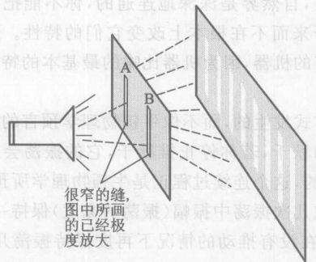

*图 13.1 用光做的双缝实验：实验装置和结果*

*图 13.2 用光做的双缝实验：实验结果*

我们自然想知道是什么介质“携带”这个波——是什么东西在波动？在回答这个问题之前，我们需要知道一些电学和磁学的知识，特别是电磁 (EM) 场的概念（第 8.8 节）。我们学到，电磁场是每个带电物体对它周围的空间产生的一个效应，电磁场充满每个带电物体周围的空间，并且在任何地方只要有一个带电物体出现它就会感受到一个电磁力，这个地方就存在有电磁场。这为你提供了背景知识，让你在第 9 章中知道在光波中是什么东西在波动。答案是，波动的是一个电磁场——**光是电磁场中的波**。

> ① 像在第 8 章中一样，光必须是单频率的并且是经过同步的。见第 8 章脚注②。

我们怎么知道光是量子化的？现在我们来学一些关于光的新东西。想象用极微弱的光进行双缝实验。你可能会预期实验结果将和图 13.2 一样，只是暗淡得多。但是实际发生的情况不是这样。在足够微弱的光中并且曝光时间很短时，光只打到屏幕上不多的几个小点上 [图 13.3 (a)]！没有干涉图样的痕迹。如果我们延长曝光时间（或者，换个方法，如果把光稍微加亮一点），我们就得到更多的小撞击 [图 13.3 (b)]，仍然没有干涉图样的痕迹。曝光时间更长，我们得到更多的撞击点 [图 13.3 (c)]，并且开始看到一个干涉图样在单个撞击图样中涌现。最后，让曝光时间更长，我们看到干涉图样是极大量单个微小撞击的结果 [图 13.3 (d) 和 13.3 (e)]。

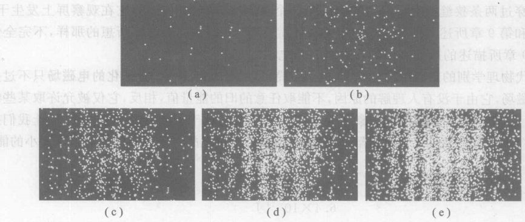

*图 13.3 用极暗的光以分时段摄影 (time-lapse photography) 方法进行的细致考察表明，图 13.2 的双缝干涉条纹是由光在全屏幕的各个点上的单次撞击形成的。5 幅照片所用的曝光时间大致是 0.2 s（大约发生了 30 次小撞击），1 s（150 次撞击），5 s（800 次撞击），20 s（3 000 次撞击），及 2 分钟（20 000 次撞击）。*

图 13.4 示出同一现象的另一个例子。尽管照相系统捕获来自物体光并且通过透镜系统把光聚焦到胶片上，暗光和短曝光时间还是让我们看到单个粒子似的撞击。图 13.4 示出照片是怎样从撞击中浮现出来的。

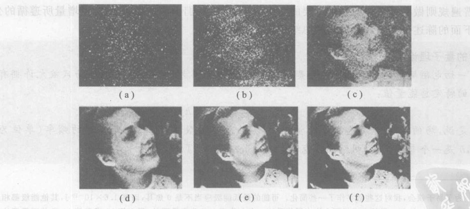

*图 13.4 一幅照片从单次粒子撞击中浮现出来。序列中各幅照片的曝光时间越来越长。每幅照片的撞击次数大致是 (a) $3 \times 10^3$, (b) $10^4$, (c) $10^5$, (d) $8 \times 10^5$, (e) $4 \times 10^6$, (f) $3 \times 10^7$。*

因此图 13.2 的光波干涉图样是由光对屏幕必微小的、单个粒子似的撞击建立起来的。这个过程和印象派绘画的点染画派的画家用颜色小点绘制他们的作品的方法相似。由这些微小撞击自然会提出这样的假说：光是由微小的粒子构成的。但是我们已经看到，光是分布在空间的电磁场中的一个延展的波，穿越两条狭缝而来，因此这个假说必须放弃。不论怎么说，每次撞击必须优先发生在干涉图样的明亮条纹内。这样的撞击不可能由从光源飞到观察屏的粒子做到，因为穿越这条或那条狭缝的单个小粒子不可能“知道”两条狭缝都是打开的，因此撞击得优先发生在亮纹内。

那么究竟是什么在穿越双缝呢？我们怎么解释光在屏幕上像粒子似的撞击呢？其答案有一段很长的历史，但是我们将不细讲这段历史，而是讲述我们今天所理解的答案。答案是这样的：没有粒子穿过两条狭缝；相反，穿过狭缝的是一个在空间分布的电磁场，它在观察屏上发生干涉，如第 8 章和第 9 章所述。但是这个电磁场并不完全像 19 世纪物理学家所想的那样，不完全像第 8 章和第 9 章所描述的那样。新的特征是一切电磁场都是量子化的。

像近代物理学别的东西一样，这个新概念很简单，但是奇特。一个量子化的电磁场只不过是这样一一个电磁场，由于没有人理解的原因，不能取任意的旧的能量值，相反，它仅被允许获取某些特定的能量值，而不能取别的能量值，正像图 13.1 节的停下来的秋千一样。为了具体起见，让我们想象频率为 $5 \times 10^{14}$ Hz 的纯黄光。根据量子物理学，携带这个黄光的电磁场只能拥有以下大小的能量：
$0\ \text{J}$
$3.2 \times 10^{-19}\ \text{J}$
$6.4 \times 10^{-19}\ \text{J}$
$9.6 \times 10^{-19}\ \text{J}$
$12.8 \times 10^{-19}\ \text{J}$，等等
你也许能看出这些能量值中隐含的规则②：它们都是 $3.2 \times 10^{-19}\ \text{J}$ 的简单倍数。如果我们把这个能量叫做 $E$，那么允许的能量就简单地是 $0, E, 2E, 3E, 4E$，等等。一个携带纯黄光的电磁场不允许别的能量值。例如，1.3 $E$ 或 15.71 $E$ 是不允许的。

这个例子表明了普通的规则：一个携带辐射（可以是可见光、红外线、X 射线等）的电磁场的总能量必须是某一能量值的简单整数倍。德国物理学家马克斯·普朗克（图 13.5）最终发现这个普遍规则做出了最初的和最重要的贡献，他发现我们上面叫做 $E$ 的能量增量所遵循的公式。下面的陈述给出了这个公式并总结了这个普遍规则：

> **辐射的量子理论**
>
> 一切电磁场都是量子化的。更具体地说，携带频率为 $f$ 的辐射的电磁场只被允许拥有以下的特定总能量值：
>
> **总能量** $= 0, hf, 2hf, 3hf, 4hf, \text{等等}$
>
> 这就是说，场的能量必须是能量增量 $E=hf$ 的简单整数倍，其中 $f$ 是辐射的频率（单位为 Hz），$h$ 是一个普通常量，叫做**普朗克常量**：$h = 6.6 \times 10^{-34}\ \text{J/Hz}$ ③

普朗克于 1900 年在研究灼热物体发出的辐射的性质时发现了这个定理。普朗克挑选了我们现在叫做普朗克常量（普朗克不会把它叫这个名字！）的这个数的数值，使之适合他所研究的实验的定量细节。后来爱因斯坦研究了一些关于辐射打中金属物体表面时所发生情况的实验，通过正确地预言实验的结果，验证了普朗克公式 $E=hf$ 和普朗克常量的数值。

因此，电磁场是“数字化的”：它们不能具有随意的旧的能量值，而必须拥有 0, 1, 2, 3, … 个单位的基本能量增量 $hf$。不过物理学家不说“数字化”这个词，而说电磁场是“量子化的”（意即被限制于特定大小的能量）。我们称最小的能量增量为一个**能量量子**。我们可以把一个量子化的电磁场想象成一个游泳池，它的水位只能是水深为 0 m, 1 m, 2 m, 3 m, 等等，绝不容许有任何其他的深度。像这个量子化的游泳池中的水一样，量子化的电磁场也充满着激光器和观察屏幕之间的全部空间。像量子化的游泳池的水深一样，这个场的能量只能是 $0, hf, 2hf, 3hf$，等等，绝不能有任何其他的值。

有了量子化的电磁场这个关键概念之后，让我们回到双缝干涉实验上来。当辐射撞击观察屏幕时，电磁场把它的一部分能量交给观察屏。但是这个场不能像旧时那样交付一个随意的能量值，因为量子化意味着场的能量的变化只能是整数个量子。图 13.3 和图 13.4 中看到的微小撞击是电磁场能量的单个量子。让我略作解释。

假设光极其微弱，以致平均说来，在比方说每 5 秒钟时间里，电磁场只能把一个能量量子交给屏幕。整个延展的场是穿过两条狭缝而来，并且充满光源和屏幕之间的空间，但是在这 5 秒钟时间里它至多能够传送一个能量量子。这个场必须在某一瞬刻一下子就交出它的能量量子，因为这个场不能携带一个量子的一部分——它必须永远只包含要么正好一个要么正好零个能量量子。当这个场把它的能量量子交给观察屏时，整个延展的场必须瞬间地下失去这么多能量。用我们的游泳池类比，那就是整个延展的水体将瞬时地下降 1 m。但是能量值必须只交给屏幕上的一点，因为屏幕是由原子构成的，我们在第 14 章将看到，这些原子也是量子化的，每个原子必须要么吸收要么不吸收一个整能量量子。“一个原子不能吸收半个能量量子。例如，图 13.3 (a) 中看到的 12 次撞击中的每一次都把一个能量量子交给屏幕上的一个原子。

这就是在图 13.3 和图 13.4 这些实验结果中观察到的光的粒子般行为的解释。由于这些微小的撞击具有能量，而且发生在相当精确的地点，因此它们具有一种像是粒子的本性，虽然它们实际上并不是粒子，而仅是整个延展的电磁场的能量增量。这些行为像粒子相像的能量量子叫做**光子**，一般把它们看成是光的微观粒子，尽管“粒子”这个词可能会引起误解。只要把光子当成粒子还显得恰当，我们便不妨认为，光子以光速传播，并且携带一个能量（当然是辐射能）$hf$，其中 $f$ 是携带光子的电磁场的频率。由于它们以速率 $c$ 传播，相对论告诉我们光子的静止质量一定为零。注意一个光子的能量随它的频率增大——更高的频率意味着更高的能量，正如我们从第 8 章中关于波的一般性质的研究中期望的那样。

虽然我们常常把光子想成是粒子，但是重要的是要记住，它们实际上并不是粒子，至少不是通常的牛顿意义上的粒子。光子仅仅是一个延展的电磁场的能量增量。精确地说，在双缝实验中直到发生一次撞击（对屏幕、实验室的墙壁、空气中浮悬的尘土颗粒或别的什么东西的撞击）之前，是没有光子的。不要把事情想象成是一群单个的粒子，从光源出发，穿过两条狭缝，运动到屏幕上。如果在某一点发生了一次撞击，不要想象为一个光子刚好在此之前一刻到达该点。一个光子一点也不像一粒快得运动的小豌豆。实际发生的事情是填满整个空间的电磁场在顷刻之间失去了一个能量量子，而在同一时刻这个能量量子出现在屏幕的特定一点上。在发生撞击的那一时刻之前是没有光子的。

图 13.6 将有助于你直观摹想这个过程。这个图表示在 5 个不同的时刻，一个光量子的发射、传送和碰撞。在 (a) 处，一个光源（当然它不是一次简单的闪光——在这种实验中得用一个激光器）刚刚发射少量的光（或电磁场）。在 (b) 处这个场正到达双缝。在 (c) 处这个场的一部分穿过了两条缝（我们不画出从隔板反射的其余部分）。穿过缝的那部分在 (d) 处正好到达观察屏。在 (e) 处，观察屏上出现了一次撞击——一个光子。在光子出现的那一刻，这个延展的场消失了。物理学家常常这样描述这个过程：他们说延展的场**缩**为一小点。

> ② 为了易于领会，我对这些数字作了一些简化。可能的最低能级应当不是 0 焦耳，而是 $1.6 \times 10^{-19}\ \text{J}$，其他能级都相应提高（增加 $1.6 \times 10^{-19}\ \text{J}$）。虽然电磁场不允许有零能量这一点在物理上是非常重要的，但在第 13 章和第 14 章并不需要这一事实。
> ③ 需要附上单位“J/Hz”，使得在乘以一个以 Hz 为单位的频率时，结果是一个以 J 为单位的能量。

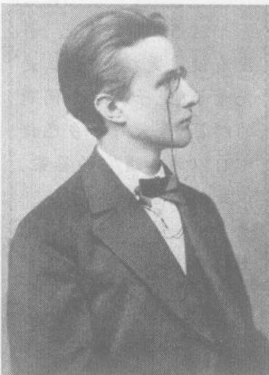

*图 13.5 马克斯·普朗克。他于 1900 年 12 月 14 日在德国物理学会的一次会议上引进了公式 $E=hf$，通常把这一天当作量子物理学的诞生日。在普朗克的理论中，$hf$ 代表热能与辐射能交换的最小单位，即一个微观粒子能够放弃之以产生光的最小能量值。*

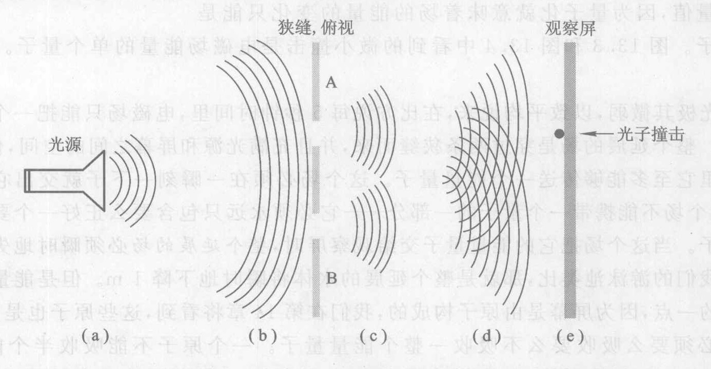

*图 13.6 用光做的双缝实验，表示一个能量非常低的光束（在这种实验中使用一个激光器）在 5 个不同时刻的电磁场。图中示出从顶上俯视的双缝实验，开口 A 和 B 代表长狭缝的宽度方向。光束在 (a) 处发射出来，在 (b) 处到达两条缝，在 (c) 处穿过缝，在 (d) 处到达观察屏，在 (e) 处打到屏幕上的具体一点上。我们把这次撞击说成是“一个光子”。在撞击的瞬间，这个延展的场消失。*

> **概念检查 1**
> 在用光做的双缝实验中，缝与屏幕之间的区域中包含有 (a) 电子；(b) 一个电磁场；(c) 光子；(d) 能量；(e) 没有上面任何一种东西。
>
> **概念检查 2**
> 由黄光、红光和红外辐射组成的辐射进入你的照相机并打到底片上。这三种形式的辐射中，哪一种辐射每个光子的能量最大？(a) 黄光；(b) 红光；(c) 红外线；(d) 所有三种辐射每个光子有相同的能量。

## 13.3 量子世界

今天，我们仍然不知道为什么辐射是量子化的，也不知道普朗克常量取它现有的特定值的原因。这个很小的数在量子物理学中所起的作用与大数 $c$ 在相对论中所起的作用相似。虽然我们不知道为什么它们两个有它们今天的具体值，但是我们的确知道，如果 $h$ 和 $c$ 中有哪一个取很不相同的值的话，宇宙将会大不相同。

虽然光波生成的图样是由大量光子撞击而得，但是得记住，每个光子都“知道”整个延展的场的情况，因为每个光子实际上都代表整个场的能量增量。我们在图 13.3 和图 13.4 中看到，光子撞击屏幕是无规则的，头一个打在一个地方，第二个打在另一个地方，如此等等。但是在这种无规则性中有一个图样。光子极少打在后来成为干涉条纹中暗区的区域，而是优先先打在将成为干涉条纹中亮区的区域。对于干涉图样的最佳描述就在于它是大量单个撞击形成的统计图样。从图 13.3 可以判定，即使浮现出的统计图样可以预言，任何一个单个光子的精确撞击地点是不可预言的。这使我们想到丢骰子或保险业，它们的单次结果是不可预言的，但是总的统计结果是可以预言的。我们将看到，这种一个总体样群中的不可预见性或**不确定性**是全部量子物理学的特征。

除了量子化和不确定性之外，在用光做的双缝实验中还显露出量子物理学的另一个关键特征。这个实验的一个古怪之处在于，正好在一个光子撞击屏幕的那一瞬刻，整个电磁场的能量突然向下移动 $hf$。但是它是一个延展的、充满空间的场。那么，双缝附近的场（图 13.1）怎么能正好在屏幕上发生光子撞击的那一瞬刻突然失去能量呢？观察屏幕和缝之间毕竟有一段距离。这个距离在原则上可以是星际距离或星系际距离。缝附近的场怎么能瞬时就“知道”发生了光子撞击？这一令人困惑的情况是“**非局域性**”的一个表征，它是另一种普遍的量子现象。我们将在第 14 章更细致地研究量子不确定性和非局域性。

注意一个量子多么小得出发。对于黄光，它只有 $3.2 \times 10^{-19}\ \text{J}$，这可由 $h$ 和 $f$ 相乘而得，黄光的 $f=5 \times 10^{14}\ \text{Hz}$。举个例子。一盏典型的 100 W 白炽灯每秒钟大约发射 10 J 光能（每秒进入一盏典型的白炽灯中的 100 J 能量中只有 10% 作为可见光发出）。如果我们假定它全是黄光，这就相当于每秒多于 $10^{19}$（1 000 亿亿）个光子，这只要用 10 J 除以 $3.2 \times 10^{-19}\ \text{J}$ 就可得出。因此一个能量量子——单个光子实在是其小。你没法分辨一个每秒发射 $10^{19}$ 个光子的白炽灯和一个每秒发射 $10^{19}+1$ 个光子的白炽灯的区别。正是因为一个典型的能量量子非常微小（它来自普朗克常量的微小），使科学家在 1900 年前从来没有注意到量子化，也使我们在日常生活中从来没有注意到它。

> **概念检查 3**
> 如果普朗克常量是它的值的 10 倍大，那么量子效应应将 (a) 更容易探测到；(b) 更难探测到；(c) 上两和情况哪一种都不是。
>
> **概念检查 4**
> 假设图 13.1 中的光源接通的时间如此短，使得只有一个能量量子穿过双缝。当它到达屏幕时，这个能量就 (a) 散布在图中的亮纹的全都面积上；(b) 亮纹中的一个小点上；(c) 一个小点上，这个小点可以在屏幕上的任何地方；(d) 屏幕上正对着能量穿过来的狭缝的一个小点上。

> **作出估计**
> 在一个晴天的中午，射到每平方米地面的太阳光在 1 秒钟内携带约 1 000 J 能量。估计在 1 秒钟内射到 $1\ \text{m}^2$ 地面的光子数目。当你对着明亮的阳光张开你的手掌时，估计每秒射到你手掌上的光子数。④

## 13.4 电子干涉：实物的波动性

第 13.2 节和第 13.3 节讲述了辐射的量子理论。现在让我们转向实物。就我们所知，一切东西都是由辐射和实物构成。前者没有静止质量，后者有静止质量。直到 1900 年为止，惯常的看法都是辐射是由一个电磁场中的波构成的，而实物是由粒子构成的。但是我们刚刚学到，电磁场是量子化的，并且这意味着，尽管辐射是电磁场中的一个波，它的行为在某些方面却像粒子。那么实物又怎样呢？

路易·德布罗意 (Louis de Broglie; 图 13.7) 于 1923 年在巴黎大学攻读博士学位，他感到在辐射和实物之间应当有一种对称性。他觉得，辐射展示出既有波动性又有粒子性，而实物的行为却永远像粒子，这是不对称的，因此他建议，实物也应当既有波动性又有粒子性。尽管当时缺乏实验证据支持这个大胆的想法，德布罗意还是觉得它是如此美丽，因此他把它写进了他的博士学位论文。德布罗意的博士学位评委会不知道该怎么处理这篇论文，便把它送给爱因斯坦，征求他的意见。这篇论文给爱因斯坦坦很深的印象，后来他评论说：“这是在物理学的这个最难解的谜团上的第一缕微弱的光”。评委会通过了德布罗意的学位论文。

物质的波？实物的单个粒子比如一个电子或者一个原子怎么能又是一个在空间延展的波？不管怎样，德布罗意继续着他的思路。在他所想象的辐射与实物之间应当具有对称性的基础上，且从联系辐射的波动侧面和粒子侧面的普朗克公式 $E=hf$ 出发，德布罗意推出了一个公式，预言了他相信会以某种方式与每个实物粒子相联系的波的波长：

> **实物粒子的波长** = $\frac{\text{普朗克常量}}{\text{粒子的质量} \times \text{粒子的速率}}$
> $$ \lambda = \frac{h}{mv} $$

> ④ 根据第 9 章，太阳光主要是由可见光或靠近可见区的辐射组成的，其频率为 $10^{15}$ Hz 左右（见图 9.5）。这个辐射的一个光子的能量是 $(6.6 \times 10^{-34}) \times 10^{15}\ \text{J} = 6.6 \times 10^{-19}\ \text{J}$，或大约 $10^{-18}\ \text{J}$。要得到 1 000 J 能量，我们需要有 $1 000 / 10^{-18} = 10^{21}$ 个光子。这就是说，只在 1 秒钟内就有 10 万亿亿个光子。你的手掌大约有多大？我测量了我的手掌，大约是 $9\ \text{cm} \times 18\ \text{cm}$，或大约 $200\ \text{cm}^2$。$1\ \text{m}^2$ 是 $100\ \text{cm} \times 100\ \text{cm} = 10\ 000\ \text{cm}^2$。因此手掌的大小大约是 $200 / 10\ 000\ \text{m}^2 = 0.02\ \text{m}^2$，1 秒钟内落到手掌上的光子数目约为 $0.02 \times 10^{21} = 2 \times 10^{19}$ ——每秒 20 000 000 000 000 000 000 个光子。

关于物质波的这个公式和关于辐射量子的公式 $E=hf$ 相似。两个公式都联系了一种粒子性质和一种波动性质。$h$ 的微小表示一个实物粒子的波长 $\lambda$ 非常微小，正如它也表示一个光子的能量非常微小。$\lambda$ 的微小意味着实物的波动侧面是很难探测出的，正如 $E$ 的微小意味着辐射的波动侧面难探测一样。这就是为什么我们通常认为实物是由粒子构成的而辐射是由波构成的原因。

如果我们把德布罗意公式用到一个典型的宏观物体上，例如一个 1 kg 的垒球，在地板上以 1 m/s 的速率滚动，我们得到其波长为
$$ \lambda = \frac{6.6 \times 10^{-34}\ \text{J} \cdot \text{s}}{1\ \text{kg} \times 1\ \text{m/s}} = 6.6 \times 10^{-34}\ \text{m} $$
垒球的波长大约是 10 亿亿亿分之一米！这远小于一个原子，比可以探测的长度小得多，难怪我们从来没有注意到垒球的波动侧面。

微观粒子的波长则要大得多。由于质量出现在德布罗意公式的分母里，质量小的粒子一般有大的波长。我们今天知道的质量最小的实物粒子之一是电子⑤。在包括有电子流的实验中，例如后面要描述的实验，电子运动的典型速度为 $10^7$ 或 $10^8$ m/s。在这样的速度下，德布罗意公式预言的电子波长是大约 $10^{-11}$ m。虽然这个长度很小——大约是一个典型的原子大小的 10 分之一，但已足以在细心的实验中探测出来。

**我们怎么知道德布罗意的理论成立？** 德布罗意的假说在 1927 年得到证实。英国物理学家 G. P. 汤姆孙将一束电子流穿过薄金属箔。大量电子撞击金属箔后面的一个屏幕所形成的图样是一个波的干涉图样，它只有依靠某种未知的波伴随着电子通过金属箔才能生成。金属箔中原子之间的间隙起着波干涉实验中的狭缝的作用，使穿过不同狭缝的物质波在金属箔的远处发生干涉。

虽然神秘的物质波的物理本性还如果不清楚，但已可通过观测屏上的干涉图样测定它们的波长。结果与德布罗意公式一致。

我们把德布罗意的思想总结如下：

> **物质的波动理论**
>
> 每一个实物粒子都具有波动性质，其波长等于 $h/mv$，其中 $m$ 是粒子的质量而 $v$ 是粒子的速率。

注意这里说的是每一个实物粒子都具有波动性质，不仅是电子，而且也包括质子、金原子核、分子，等等。读到这里，你可能会奇怪这到底是怎么回事。一个实物粒子怎么会有一个波长呢？一个波需要一个延展的介质，而单个电子甚至不在空间展开，那么一个电子怎么能是一个波呢？我们还是转向实验以求得到指引。我们来看两个实验，它们回答了这些问题，并且进一步证实了德布罗意的思想，不过是以一种完全没有料到的方式——一种完全改变我们对物质的基本看法的方式实现的。

**我们怎么知道实物具有波动性？** 图 13.8 表示出一个双缝实验的实验装置，它就像用光做的双缝实验，不过不用光而改用实物。我们假定这个实验用的是电子，虽然任何别的实物粒子如中子、质子、原子或分子也可以用并且结果相似。图左部的装置代表一个插在电源上的电子源。这个电子源可能是封装在真空管内的一段金属丝，它用电源加热，直到电子被“烧沸”从中跑出来；类似的电子源是电视显像管的心脏部件。我们管这个装置叫**用电子做的双缝实验**。

> **[双缝实验] 这样的现象是用任何经典 [牛顿] 方法都不能解释的，绝对不能；它正是量子力学的核心。事实上，它包含着唯一的奥秘。我们不能靠仅仅说明这个实验是怎样做的就排除了这个奥秘。**
> ——费曼

> ⑤ 现在知道名叫中微子的粒子具有很小的静止质量，大约是一个电子的质量的 100 万分之一，但不是零（第 18 章）。

> **他们[20 世纪 20 年代的物理学家们] 证明，可以把实物粒子理解为各种场的量子，就和光子是电磁场的量子一样。据说，每种基本粒子对应有一个场。于是，宇宙的居民被设想为一组场，……而粒子被归结为一种附带现象。这个观点的实质一直留存到今天，并且成为量子场论的核心教义：基本的实在是一组场……其他的一切都是作为这些场的量子力学的结论而推导出来的。**
> ——物理学家温伯格

一个“电子束”——你暂时可以把它想象成每秒几十亿个快速运动电子的电子流——从电子源射出，在射向双缝的过程中分散开来。⑥ 当它们到达图中用 A 和 B 标示的双缝后，电子束的一小部分穿过每条狭缝，其余的被隔板挡住。因此从每条狭缝射出一窄条电子束，向右边的观察屏射去。我们在屏上将看到什么？

图 13.9 示出实验结果。虽然从德布罗意 1923 年的工作以来已经预言了这个结果，实际做出这个实验装置仍是不容易的，因为两条狭缝必须非常之小，因此这个实验直到 1974 年才由在德国工作的物理学家 C. Jonsson 做出来。为了加强你的印象，图 13.10 再次画出实验装置和结果。

这个结果和本节前面讨论的 G. P. 汤姆孙的实验结果相像。汤姆孙的结果证实了德布罗意关于电子具有波动性的预言，Jonsson 的这个新结果是进一步的证实。

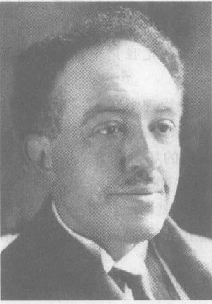

*图 13.7 路易·德布罗意。他觉得在实物和辐射之间应当有对称性，因此预言实物也应当像辐射那样，表现出相同的波粒二象性。*

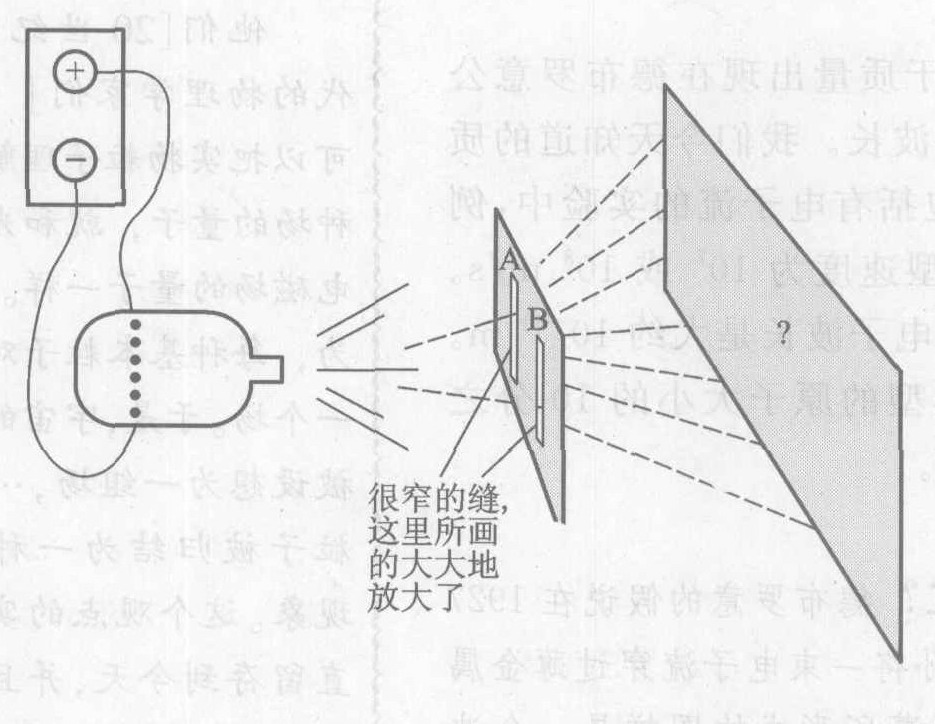

*图 13.8 用电子做的双缝实验。电子源是一条细钨丝，用电流加热，直至电子从它“沸腾”出来。类似的电子束在电视显像管中起核心作用。在图示的实验中我们在屏幕上将看到什么？*

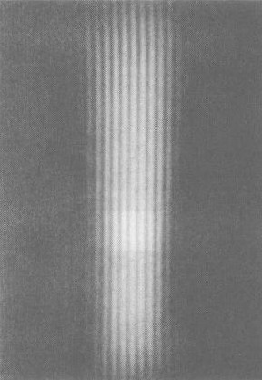

*图 13.9 电子生成的波干涉图样*

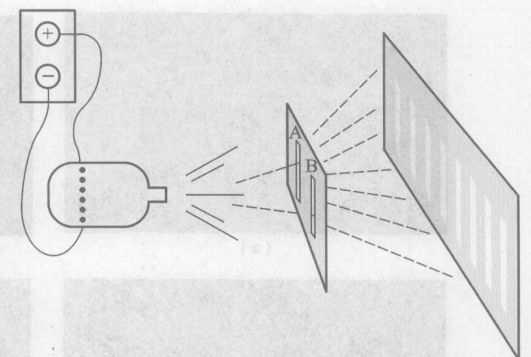

*图 13.10 用电子做的双缝实验的结果。电子撞击发生在屏幕上所画的宽带之内。比较这个结果与用光做的类似的实验的结果（图 13.1）。*

这些实验结果看起来和用光做的双缝实验的结果图 13.1 和图 13.2 完全相像！在屏幕上看到的图样是一个波干涉图样，表示穿过两条狭缝而来的波到达观察屏幕时发生干涉。这确定无疑地证实了德布罗意关于电子和其他实物粒子具有波动性的思想，并且事实上其定量结果完全符合德布罗意关于这种波的波长的公式。

但是这是一个令人困惑的结果。在第 2 章里，而且早在中学里，你就学过实物是由质子、中子和电子这些粒子构成的。但是在这里却有一个实验：把电子通过一组狭缝打出去，我们却发现电子发生干涉，因此他们必定是波！到底是怎么回事？为了回答这个问题，我们再一次请教大自然。

**我们怎么知道实物具有粒子性？** 现在我们再一次来看用电子做的双缝实验，但是用的是强度弱得多的电子束——你可以称它为更“暗”得多的电子束（虽然我们在这里说的是电子而不是光）。大约从 1930 年前后起，物理学家就预言了这个实验的结果，但是一直到 1989 年，外村彰 (A. Tonomura) 和他的日本同事们才实际做了这个困难的实验*。因为用的是更暗的电子束，你也许多预期，实验结果看起来还是和图 13.9 一样，只是暗得多。但是实际情况不是这样。图 13.11 表示实际发生的情况。当电子束的强度足够低和曝光时间很短时，电子束只在屏幕上几个小点上撞击屏幕 [图 13.11 (a)]，图上根本看不到干涉图样的痕迹！如果我们延长曝光时间少许，我们只是看到更多的撞击点，仍然没有干涉图样的痕迹 [图 13.11 (b)]。但是曝光时间更长时，我们发现一幅干涉图样浮现在单个撞击的图样上。这幅干涉图样是大量的单个小撞击的结果。

为了避免可能的误解，我们要指出，干涉图样并不是不同电子之间的相互作用的结果。即使是如此之弱的电子束，以致在一个时刻至多只有一个电子穿过狭缝，也会出现这幅图样。哪怕是每个小时只有一个电子穿过狭缝，积累了许多小时的撞击后仍将形成一幅干涉图样。

> ⑥ 全部电子必须有相同的速度，换句话说，有相同的波长。
> \* 关于 C. Jonsson 及外村彰的新电子双缝干涉实验的详细介绍，可参看王琦，认识电子，《大学物理》1999 年 5 月，29。——译者注

你也许已经猜到我们对这些单个撞击叫什么名字。它们就是电子！你也许还已注意到，图 13.9 和图 13.11 中的两个实验结果正像图 13.2 和 13.3 中的实验结果——除了我们现在用的是电子束而不是光束，因此撞击是由电子造成的而不是光子造成的。

这个实验表明，图 13.9 的波干涉图样是由微小的单个电子对屏幕的撞击建立起来的。注意，像用光做的双缝干涉实验一样，每次撞击都倾向于优先发生在图的亮纹即相长干涉部分。⑦ 这意味着每个电子“知道”它“应该”对双缝干涉图样做出贡献——每个电子都“知道”两条缝都开着。但是我们已习惯于把电子想成是小粒子，是粒子就只能穿过两条缝的一条，肯定不会同时穿过两条缝。那么，只穿过一条缝的单个小电子，怎么能“知道”另一条缝也开着，因此它应该对双缝干涉图样做出贡献呢？

量子物理学对这个难题所给的答案，与第 13.2 节中对用光做的双缝干涉实验的答案相同：

> ⑦ 你可能已经注意到，我们在图 13.11e 中看到的图样不像图 13.10 中画的那么简单。例如，有些撞击是发生在亮线之间的“暗区”。这是因为在图 13.10 中预言的图样被简化了。实际的预言图样画在图 13.13 中。

*图 13.11 在电子波干涉实验中一幅干涉图样通过单次电子撞击建立的过程。从上到下的 5 幅照片的曝光时间分别为 0.01 s (只有 10 个电子撞击屏幕)，0.1 s (100 个电子)，1 s (3 000 个电子)，20 s (20 000 个电子) 和 70 s (70 000 个电子)。*

图 13.9 中所示的干涉图样的解释是，有一个延展的场穿过两条缝，并且在缝与屏幕之间的区域里发生干涉。但是是个什么场呢？它不可能像光的情况那样是一个电磁场，因为一个电子束不是一个电磁波。事实上，这个实验和电磁学毫无关系，尽管电子是一个带电粒子。即使是不带电的粒子如中子来做这个实验，结果仍然是一个像图 13.9 那样的双缝干涉图样。穿过双缝的场是某种全新的东西，在 20 世纪 20 年代德布罗意和其他人发现它之前人们不知道它的存在。我们管它叫**物质场**⑧。德布罗意的物质波是物质场中的波，正如电磁波是电磁场中的波一样。并且，正像电磁场在光的情形下一样，物质场也是量子化的。

由于我们已经讨论过量子化的电磁场，不难理解量子化的物质场的概念：首先，像电磁场和引力场一样，物质场充满一个空间区域，例如图 13.10 中缝与屏幕之间的区域。当我们说物质场是量子化的时，我们的意思是，由于人们还不理解的原因，不允许这个物质场拥有任意大小的能量。相反，这个场只能拥有某些特定大小的能量，而不是别的。

对于一束电子，这个能量只能是 $mc^2, 2mc^2, 3mc^2, 4mc^2, \text{等等}$，其中 $m$ 是一个电子的质量。从第 10 章我们还记得，如果 $m$ 代表一个不动的或运动的电子的质量（即惯性），那么 $mc^2$ 就是电子的总能量（包括动能）。因此当我们说物质场的允许能量是 $mc^2, 2mc^2, \text{等等}$ 时，我们只是在说物质场必须包含足够多的能量以得到一个电子、或两个电子、或三个电子，等等，而不是中间的一个什么能量值。物质场是量子化的，正如辐射场是量子化的！像电磁场这样的量子的场叫做光子一样，物质场的量子叫做电子。这里有一个很好的对称：所有的东西，一切实物和一切辐射，都是由弥漫的场构成的，但是这些场是量子化的，这是我们有光的粒子（光子）和实物粒子（如电子）的原因。如前所述，这一想法不仅适用于电子，也适用于别的粒子，如质子、中子、原子和分子⑨。我们把这个想法总结如下：

> **物质的量子理论**
>
> 自然界存在一种新的场，叫物质场。像电磁场一样，物质场是量子化的。例如，电子的物质场只能具有要么 0 个电子、要么 1 个电子、要么 2 个电子，等等的能量。电子（及别的实物粒子）之所以存在，是因为物质场正是以这样的能量增量量子化。

> **就我来说，做实验的主要目的是向人们显示量子物理学是多么奇特。大部分物理学家都很朴实；大部分人仍然相信实实在的波或粒子。**
> ——Anton Zeilinger，物理学家

电子并不是真正的小粒子，一点也不像循着一条具体的路径从电子源穿过狭缝来到屏幕的一群豌豆。相反，电子是量子，是一个延展的场的能量增量，正如光子是量子一样。

> **概念检查 5**
> 设下面三样东西都以相同的速率运动，其中哪一个的波长最长？(a) 一个氢原子；(b) 一架喷气式飞机；(c) 一个 DNA 分子。
>
> **概念检查 6**
> 假设图 13.10 中的电子源接通如此短暂的时间，使得只有一个能量量子穿过双缝。当它到达屏幕时，这个能量 (a) 散布在图中画的亮带中的一个带上；(b) 撞击亮带中的一个小点；(c) 撞击屏幕上任意的一个小点；(d) 撞击屏幕上正对着能量所通过的狭缝的小点。

## 13.5 物质的量子奥秘

图 13.12 将帮助你直观想象这一切。这个图和图 13.6 相像，不过是关于实物的而不是关于电磁辐射的。这个图表示一个强度很弱的物质波的发射、传播和对屏幕的撞击，它们发生在五个不同的时刻。在 (a) 处，一个电子源刚刚发射出数量很少的电子束，或物质场。这个场到达双缝，穿过两条缝，到达观察屏。在 (e) 处，一次撞击——一个电子——出现在观察屏上。在电子出现的瞬间，整个延展的物质场消失。

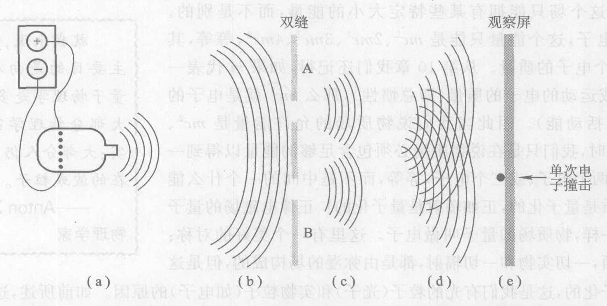

*图 13.12 用电子做的双缝实验，表示一个强度很低的电子源的物质场在五个不同时刻的情形。电子束发射出来，到达双缝，从缝中穿出，到达观察屏，最后在 (e) 处一特定点撞击屏幕。撞击被称这“一个电子”。在撞击的瞬间，整个延展的场消失。*

> **在其成熟的形式中，量子场论的想法是，量子场是宇宙的基本成分，粒子只是场的能量和动量小包。……因而量子场论导致一个比以往的既有场又有粒子的二象解释更统一的自然观。**
> ——温伯格，物理学家

我们要重复早先关于光的一一些话：物理学家认为基础实体是物质场，而不是电子和质子等。这就是说，物质场是物理实在的，正如电磁场是物理实在的。正如光子只是电磁场的量子，电子等只是物质场的量子。大自然之所以有像粒子的侧面，其原因是大自然是由场构成的，而这些场是量子化的。虽然把电子、质子等想象成粒子是合理的，但是应当记住，它们不是通常的牛顿意义上的粒子。一个电子一点也不像一颗小豌豆。一个电子只是一个延展的物质场的一份能量增量。精确地说，在双缝实验中，除了发生了撞击的瞬间之外，并没有电子。不要想象是一群名叫“电子”的单个粒子从电子源穿过两条缝运动到屏幕。如果在某点发生了一次撞击，不要想象有一个电子在撞击前一刻到达该点。在此之前，只有一个延展的物质场。

作为一个例子，你也许曾见过电子或别的微观粒子在高能物理实验中产生的狭窄的路径或“径迹”（你将在第 18 章见到这种径迹的照片）。虽然这些径迹是电子存在的很有说服力的证据，但它们并不使电子在于在撞击的瞬间而在各次撞击之间只有物质场存在的观点失效。这些径迹是由物质场与气体分子或水分子之间的相继的单次相互作用所造成。物质场在每次与一个分子相互作用时塌缩为一个微小的电子撞击，但在各次撞击之间的时间里是一个延展的物质场。

> ⑧ 这种场有一段不短的历史并且有各种名称。物理学家常称叫它电子场，对别的粒子的场则叫别的名字，如质子场和中子场。作为量子物理学中的一个相关的概念也用波函数这一术语，虽然波函数不是一个实在的物理场，而是一个有用的数学工具。相反，物质场（我们常用的术语）则是一个物理上实在的场，正像电磁场是一个物理实在的场一样。
> ⑨ 粒子的质量越大，就越难在实验上演示这一点。但是在 2003 年，奥地利物理学家 Anton Zeilinger 演示了 $C_{60}$ 分子的物质波干涉，表明这些大分子（60 个碳原子！）是一个物质场的量子。

今天，我们仍然不知道为什么物质会量子化，也不知道为什么量子（电子、质子等）拥有它们所具有的能量（换句话说，也就是质量）。但我们的确知道，如果这些量子拥有与它们现有的能量值非常不同的能量的话，我们的宇宙将是一个非常不同的场所。

要记住，虽然像图 13.9 那样的一幅干涉图样是由每秒中有几十亿个电子撞击观察屏幕生成的，但每个单个电子都“知道”整个实验装置的情况，因为每个电子只是整个延展的物质场的一个能量增量——一个量子。也要注意单次电子撞击的不可预言性，正像在关于光的双缝实验中光子撞击的不可预言性一样。在电子双缝实验中我们还看到在关于光的实验中曾注意到的特性的非局域性：在电子撞击发生的那一瞬间，整个延展的物质场瞬间就在撞击点交出一整量子能量。

在电子显微镜一类仪器中，我们每天都使用着物质波。电子显微镜用电磁场代替光学显微镜所用的玻璃透镜，使电子联系的波弯折和聚焦，生成微观现象的电子像。由于电子的波长可以小于单个原子的大小，电子显微镜能够对原子成像（第 2 章图 2.10），这是光学显微镜做不到的，因为可见光的波长是原子大小的几千倍。

> **概念检查 7**
> 电子在哪些方面与光子相似？(a) 二者都带电荷；(b) 二者都以光速运动；(c) 二者都在一小点撞击观察屏；(d) 二者都是量子。

## 13.6 大自然是非局域的，并且是不确定的

比起爱因斯坦的相对论，量子物理学是对牛顿物理学的更根本的背离。这些背离包括电磁场的量子化，一种叫做物质场的新场的存在，以及这个物质场的量子化。而且，在用光和用实物做的双缝实验中，我们注意到当场交出一次撞击时，整个电磁场或物质场在瞬间改变它的特性，这种行为叫做**量子非局域性**。此外，屏幕上每一单次撞击的位置是不可预言的，虽然整体图样可以预言。不可预言性和非局域性是量子物理学的两个重要的和特有的特性。我们将在本节开始讨论不可预言性，或量子不确定性，并在第 14 章继续讨论；在第 14 章还将讨论非局域性。

为了从几十亿个微小的电子撞击得出一幅图 13.9 那样的图样，不同的撞击必须发生在不同的地方。如果你按牛顿的方式思考，你也许会认为电子撞击不同的地方是因为它们以不同方式离开电子源的。那么，我们能调节电子源，制备出状况完全相同的电子，使它们都打在屏幕的同一点上吗？通过实验，我们求得这个问题的答案是“不能”。即使我们在每次撞击前预先制备出完全相同的电子源，撞击仍然发生在分散在干涉图样上的不同点。

> **大自然喜欢隐藏自己。**
> ——厄菲斯的赫拉克里特，公元前 500 年
>
> **我们在理解量子力学代表的世界观方面总是有许多困难。至少我是这样，因为我的年纪已经不小了，我从没有这些东西对我显而易见的直觉。是啊，我现在对它还感到不安。……你知道，事情总是这样的，一个新思想总是需要经过一两代人オ会变得显然没有问题。我提不出真正的问题，因此我猜想也许没有真正的问题，但是我并不能肯定就真的没有问题。**
> ——费曼，1982 年的话

是什么使撞击发生在不同的点上呢？毕竟我们通常期望（牛顿物理学也这样教导我们）全同的物理条件将导致全同的结果。但是我们的期望和牛顿物理学在这里却错了。这里并没有使结果发生变化的原因，因为所有的电子是全同的，对每个电子的实验准备也是全同的。倒是大自然中有一种固有的**不确定性**。与常识和牛顿物理学相反，实验表明，全同的原因可以导致不同的结果。物质场延展在整个干涉图样上，而撞击点——场交出一个能量量子的地方——可以是这个图样上的任何一点。没有办法预言精确的撞击点，因为即使大自然自己事先也不知道精确的点在何处。牛顿物理学错了：未来并不完全由现在决定。这是微观世界的一条普遍规则。尽管我们竭尽全力去控制光子、电子和其他粒子（或量子），它们依然按自己的规律行事。大自然在根本上是不确定的。并且这不只是微观物理学的事；量子不确定性可以被放大为宏观世界中的容易观察到的实际事件，如放射性衰变（第 15 章）。宇宙甚至可能把量子不确定性印到它的大尺度结构上了（第 11 章）。

有些物理学家不同意这个观念，他们争辩说，并不是未来不可确定，而是因为我们对微观世界的理解（量子物理学）还不深不透，没有掌握操纵微观世界的真正原理，这些原理将恢复自然界的可预言性。爱因斯坦在 20 世纪 30 年代强烈地主张“上帝不掷骰子”，引用了细致的例子，试图证明固有的不确定性将是荒谬的。但是量子物理学继续保持着实验成功的完美记录，并且爱因斯坦和其他人认为是荒谬的量子预言现在却经受了考验，人们发现它们是实际发生的。

> **一位哲学家曾经说过：“科学本身存在的必要条件是相同的条件永远给出相同的结果。”可是，事情却不是这样。**
> ——费曼
>
> **我相信，有可能建立一个理论，它能给出实在的完备描写，它的定律确立的是事物本身之间的关系，而不仅仅是它们的概率之间的关系。……量子力学给人的印象是深刻的，但是一个内心的声音告诉我，这还不是真正的理论。这个理论给出了许多结果，但是并没有使我们离老家伙 [指上帝] 的秘密更近一点。无论如何，我确信他不玩骰子。**
> ——爱因斯坦。他的朋友玻尔回签说：“阿尔伯特，别吩咐上帝该做什么。”
>
> **上帝不但玩骰子，有时他还把骰子扔到看不到的地方。**
> ——霍金，物理学家

请注意：尽管单次撞击是随机的，总的双缝干涉图样却是可以预言的。我们每次做实验都得到同一干涉图样。由于这幅图样代表几十亿次撞击的总的统计规律，因此尽管单次撞击不可预言，总的统计规律是可以预言的。精确的图样并不像图 13.10 所示的那样简单，图 13.13 示出观察到的总体统计图样更多的细节；图的右部示出平均撞击次数随屏幕上的位置而变化的情况。屏幕上标示“o”的点是图 13.9 中暗线的位置，那里没有撞击发生。如果你细致地观看 13.11 (e)，你当能在实际实验结果中看出这个更细致的图样：撞击发生在每条亮纹中心的机公最大，而在每条暗纹的中心撞击的机会逐渐降到（接近）零。

1926 年，德国物理学家马克斯·玻恩（图 13.14）首先得出结论：这样一幅干涉图样必定是每次电子撞击的概率图样。这就是说，玻恩认为，图 13.13 中画出的数据给出了单个电子撞击屏幕上各点的概率，就像“正面和反面的概率各占 50%”给出了掷一次硬币结果的概率一样。更精确地说，物质场在任何特定一点的强度⑩代表一次电子撞击将在该点发生的概率，如果在该点有一屏幕或某个别的探测器的话。例如，图 13.9 示出物质场在屏幕上各点的强度，而这一强度（或亮度）代表任一单个电子将在该点撞击屏幕的概率。

*图 13.13 示出观察到的总体统计图样更多的细节；图的右部示出平均撞击次数随屏幕上的位置而变化的情况。屏幕上标示“o”的点是图 13.9 中暗线的位置，那里没有撞击发生。如果你细致地观看 13.11 (e)，你当能在实际实验结果中看出这个更细致的图样：撞击发生在每条亮纹中心的机公最大，而在每条暗纹的中心撞击的机会逐渐降到（接近）零。*

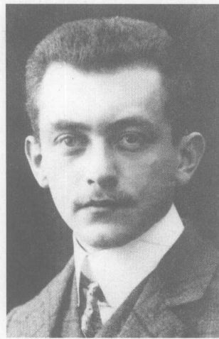

*图 13.14 马克斯·玻恩*

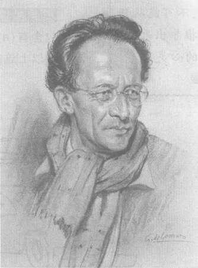

*图 13.15 薛定谔*

概率的概念在量子物理学之前很久就有了，它一般与量子物理学没有什么关系。每当一次特定实验的结果不确定但多次重复的总的统计规律可以预言时，概率都是很有用的。一个与量子物理学没关系的例子是扔一次硬币：“正面的概率是 50%”的意思是，在很多次扔硬币的序列中，大约 50% 的结果将是正面朝上。可以把这个 50% 或 0.5 的概率看成一个统计结果，一个实验的多次重复中代表出现的统计图样的数。

不过在像掷硬币这一类宏观实验中观察到的概率与量子物理学中所标称的概率之间有一个差别。由于掷硬币服从牛顿物理学到很高的近似程度，其结果在原则上是可以预言的。这就是说，只要有足够的关于投掷者手指用力情况、硬币在桌面之上的初始高度、桌面和硬币的弹性性能等等的信息，就可以用牛顿物理学预言投掷的结果。我们关于硬币投掷的不确定性来自对精密细节的无知。但是量子事件甚至在原则上就是不可预言的。量子不可预言性来自大自然的本身的不确定性，而不是仅仅由于我们对测量和预测大自然无能为力。

> ⑩ 定量地说，强度是物质波的振幅的平方。

> **薛定谔方程的玻恩解释是自牛顿以来我们的世界观的最具戏剧性的和最大的改变。**
> ——莱德曼，物理学家，引自 *The God Particle*（中译本：《上帝粒子》，上海科技教育出版社，2003）
>
> **每当发生一次量子相互作用，上帝就扔骰子。**
> ——帕格尔斯，物理学家
>
> **我们是从哪里得出它 [薛定谔方程] 的呢？不从任何地方，不可能从任何地方把它推导出来，它来自薛定谔的心灵。**
> ——费曼

统计图样的可预言性表明，尽管单次撞击不可预言，物质波是可以预言的。1926 年，奥地利物理学家薛定谔（图 13.15）提出了预言物质波运动的方法。薛定谔从一个用来描述别的领域（这些领域不包括量子物理学）的波动现象的著名公式出发，他在这个公式中嵌入了德布罗意关系式 $\lambda = h/mv$ 及一些高明的猜测。其结果是一个公式，现在叫做**薛定谔方程**，它描述了电子或任何别的实物粒子的物质波在多种多样情况下的运动。薛定谔方程正确地描述了诸如用电子做的双缝实验和电子穿过固体薄膜时所观察到的干涉图样等现象。从历史角度看，最重要的是，薛定谔证明，他的方程适用于原子内部的电子，预言的结果与原子物理学实验一致（第 14 章）。

> **概念检查 8**
> 在用一束中子做的双缝实验中，缝和屏幕之间的区域包含有 (a) 一个物质场；(b) 单个中子；(c) 一个电磁场；(d) 光子流；(e) 以上这些什么也没有。

---

> **概念检查答案**
>
> 1. (b) 和 (d)。
> 2. 黄光的频率最高，(a)。
> 3. (a)。
> 4. 每个光子必须打在干涉图样内的某个地方，即使由于只有一个光子打在屏幕上因而图样还没有显露出来，(b)。
> 5. 氢原子，因为它的质量最小，(a)。
> 6. 理由与概念检查 4 相同，(b)。
> 7. (c) 和 (d)。
> 8. (a)。

---

### 关键概念

下述概念的定义出现在所标页码的本书正文页面上和书末的按拼音排序的术语词汇中。我们将它们按出现先后顺序排列在这里，你可以用这个清单复习本章内容。

*   量子物理学 300
*   用光做的双缝实验 302
*   电磁 (EM) 场 302
*   量子化的电磁场 304
*   辐射的量子理论 304
*   普朗克常量 304
*   能量量子 305
*   光子 305
*   后牛顿革命
*   物质的量子理论 313
*   电子显微镜 315
*   量子非局域性 315
*   量子不确定性 315
*   概率 317
*   薛定谔方程 318
*   物质场 313
*   物质波 309
*   用电子做的双缝实验 310
*   电子 313

### 复习题

**后牛顿革命**

1.  什么是量子物理学？
2.  量子物理学与牛顿物理学的哲学含义有哪些不同？（至少描述一个方面）

**光的量子化和量子世界**

3.  描述用光做的双缝实验及其结果。
4.  电磁场是什么？
5.  如果我们用很暗的光和短曝光时间做双缝实验，我们在屏幕上将看到什么？
6.  继续上题，在更长的曝光时间后我们在屏幕上将看到什么？
7.  我们所说的量子化的电磁场是什么意思？
8.  量子化的电磁场中允许的最小能量增量是多大？
9.  电磁场的量子（或能量量子）是什么意思？
10. 什么是光子？它的速率是多大？它的静止质量呢？
11. 为什么我们通常不会注意到光是由光子构成的？
12. 量子不确定性是怎样进入用光做的双缝实验的？
13. 量子非局域性是怎样进入用光做的双缝实验的？
14. 电子干涉和物质的量子奥秘
15. 单个电子有波长吗？
16. 我们怎么知道实物粒子有一种波伴随着？
17. 伴随着实物粒子的波叫什么名字？
18. 光学显微镜与电子显微镜，何者能探测最小的物体？为什么？
19. 描述用电子做的双缝实验及其结果。
20. 如果我们用低强度的电子束和短曝光时间做电子双缝实验，我们在屏幕上将看到什么？
21. 继续上题，我们管单次撞击叫什么名字？
22. 存在一个“物质场”，有什么证据？
23. 我们说物质场是量子化的，这是什么意思？
24. 量子不确定性
25. 举出一个例子，完全相同的原因不产生同样的结果。
26. 量子不确定性与掷硬币的结果中的通常的不确定性有什么不同？

### 思考题

**后牛顿革命**

1.  说出 20 世纪头十年两个革命性物理学理论的名称。
2.  量子物理学在哪些方面影响了近代生活？

**光的量子化和量子世界**

3.  我们怎么知道光是量子化的？
4.  在什么意义上我们说电磁场是“数字化的”而不是“模拟的”？
5.  在用光做的双缝实验中出现了一次光子撞击。这时电磁场发生了什么？
6.  我们通常没有注意到光子。假设普朗克常量变得比它的实际值大得多。那么我们将更容易还是更不容易注意到光子？
7.  一个红光的光子和一个黄光的光子，哪一个的能量更高？
8.  一个紫外辐射的光子和一个红外辐射的光子，哪一个的能量更低？
9.  在用光做的双缝实验中，小的光子实际穿过了两条狭缝吗？穿过狭缝的是什么？
10. 当我们把双缝实验中用到的光的强度减到很暗时，我们并不是简单地得到更暗的干涉图样。我们得到的是什么？
11. 一束红光的强度或亮度可以变化。当你增加强度时，单个光子的能量是增大，还是减小，还是保持不变？
12. 在上题中，每秒发射的光子数是增加，还是减少，还是保持不变？
13. 一束红光的频率可以变化。当你增加频率时，光的颜色变化吗？单个光子的能量是增大，还是减小，还是保持不变？
14. 在上题中，光子的速率改变吗？
15. 图 13.2 所示的实验结果演示的是哪一种波？是什么介质中的波（介质的名称叫什么）？

**电子干涉和物质的量子奥秘**

16. 图 13.9 所示的实验结果演示的是哪一种波？是什么介质中的波？
17. 以同样的速率运动的一个电子和一个质子，哪一个的波长更短？
18. 一个慢速运动的电子和一个快速运动的电子，哪个一个的波长更短？
19. 假设我们在电子双缝实验中使用强度非常低的电子束，以致每分钟只有一个电子出现。我们在屏幕上会看到一幅干涉图样吗？我们将看到什么？
20. 举出一束电子和一束光之间的一些相似之处。
21. 举出一个电子和一个光子之间的一些相似之处。
22. 举出一个电子和一个光子之间的差异。
23. 在用电子做的双缝实验中，每个电子的撞击点是不可预言的。可以预言的是什么？
24. 穿过双缝仪器后，一个电子打在屏幕上正对着缝 A 的地方。我们可以说这个电子是穿过缝 A 来的吗？
25. 如果电子的行为只像粒子而不像波，我们会在双缝实验中观察到干涉图样吗？
26. 你没有注意到一个投出的垒球的波动性质。这是因为垒球的波长太长还是因为波长太短？
27. 假设以下各样东西有相同的速率，将它们按照波长从小到大的顺序排列：氦原子、汽车、DNA 分子、电子、中子、垒球。
28. 如果能设计出一具“质子显微镜”，你以为它的波长同台电子显微镜的波长相比将如何？

**量子不确定性**

29. 你掷硬币的结果是不确定的。这是由量子不确定性引起的吗？加以说明。
30. 在不停的硬币投掷中，接连两次正面朝上的概率是百分之多少？你怎么用实验来检验这个预言？
31. 在用电子做的双缝实验中，撞击点能够预言吗？
32. 在用电子做的双缝实验中，屏幕上有任何一点我们可以能够肯定的不会有电子撞击吗？
33. 在用电子做的双缝实验中，什么东西是可以预言的？
34. 如果我们说是光子而不是电子，上面三个问题的答案会有不同吗？
35. 举出牛顿物理学与量子物理学的至少两点不同之处。
36. 举出牛顿物理学与量子物理学的至少两点相似之处。

### 习题

**光的量子化**

1.  一个光源同时发出橙色和紫色两种颜色。哪种颜色的光子的能量更高？
2.  在上题中，两个颜色的频率分别是 $5 \times 10^{14}$ Hz (橙色) 和 $7 \times 10^{14}$ Hz (紫色)。求两种光子的能量。
3.  微波的光子和可见光的光子，哪一个的能量更大？大约大多少倍？(参看图 9.5)
4.  摩擦一个物体使之带电，然后以 1 Hz 的频率摇动它，产生电磁辐射。每个光子携带的能量是多少？
5.  一个频率为 $10^{24}$ Hz 的 $\gamma$ 辐射光子携带多少能量？
6.  作出估计。将 1 N (大约 1/9 kg 重) 的重量抬升 1 m 高度，需要大约多少个可见光的光子？
7.  作出估计。要在活的植物中产生一次光合反应，需要大约 10 个可见光光子。这 10 个光子大约携带多少能量？
8.  作出估计。人眼能检测的下限是每秒大约有 10 000 个光子进入瞳孔。这相当于每秒多少能量？

**实物的波动性**

9.  使一个质子的速率加倍，对其波长有何影响？
10. 一个质子和一个氘核（一个质子和一个中子被核力束缚在一起），假设它们的速率相同，它们的波长大小有什么关系？
11. 一个电子和一个质子以同样的速率运动。哪一个的波长较长？差多少倍？（质子的质量大约是电子质量的 1800 倍）。
12. 假设我们用一支强力枪支开火，这支枪把 1 g ($10^{-3}$ kg) 的子弹加速到 1 000 m/s 的速率 (3 倍声速)。求子弹的物质波的波长。
13. 求以 $0.1 c$ 的速率打在电视屏幕背面的电子的波长。电子的质量是 $9.1 \times 10^{-31}$ kg。
14. 单个的电子的速率已可减至每秒几厘米。电子的质量是 $9.1 \times 10^{-31}$ kg。以 0.1 m/s (10 cm/s) 运动的单个电子的波长是多少？答案以 mm 为单位表示。
15. 在一个新的近的实验中，钠原子被冷却到只以每秒几米的速率运动。一个钠原子的质量是 $38 \times 10^{-27}$ kg。以 2 m/s 的速率运动的单个钠原子的波长是多少？答案以 mm 为单位表示。