# 第 14 章 量子论的宇宙

> 为了理解原子结构，我们必须接受这个观念：未来是不确定的。它不确定到这个程度：未来实际上是在这个世界的每一部分，由每个原子和每个生物创造出来的。这个观点和机械决定论完全相反，我相信它应当被每个人了解。
> ——爱德华·特勒，物理学家

本章更深入地探究量子物理学。第 14.1 节更严密地审视量子不确定性并表述不确定原理。第 14.2 节讨论宏观观测对微观系统的令人惊讶的效应。我们已在第 13 章讲过量子非局域性；第 14.3 节更严密地考察这个现象，它可以算是物理学中所曾出现过的最古怪的观念。第 14.4 节和第 14.5 节考虑量子物理学描述的那种实在，并且探究量子物理学对仍然渗透在近代文化中的牛顿世界观有什么影响，或将来可能有什么影响。最后，第 14.6 节和第 14.7 节研究量子物理学的也许是最重要的实际应用：原子的量子理论。

## 14.1 不确定原理：未来不由过去决定

我们在第 13 章看到，量子理论的一条中心原理是，观测结果是变动的和不可预言的，哪怕这些结果是由完全相同的物理条件引起的。但是尽管微观世界有这种固有的**量子不确定性**，大量结果的总的统计规律还是遵循可预言的图样，这种图样由一个可预言的电磁场或物质场确定。

德国物理学家海森伯（图 14.1）于 1927 年发现，量子不确定性可以被量化。为了对海森伯的论据有所理解，让我们考虑一个量子化的物质场，它只包含刚好一个电子的能量，这个场穿过空无一物的空间沿我们称之为 $x$ 轴的方向运动。我们知道，物质场在任何特定一点的强度代表在该点找到一个电子的概率。我们在第 13 章已看到，物质场是在空间延展的，一般具有一种类似波动的特性，如图 14.2 所示。在量子物理学中，这个图是表示单个粒子如一个电子的物质场的自然方式。我们把图 14.2 所示的这样一个物质波叫做一个**波包**。图中用 $\Delta x$（读 delta $x$）表示波包的可能位置范围。记住，并没有一个叫“电子”的微小粒子伴随波包行进或在波包中行进，相反，电子就是波包。只有当波包与另一系统（如观察屏）相互作用时，波包才塌缩并给出一个微小的像粒子似的撞击。$\Delta x$ 是这样一个撞击可能发生的范围。

量子理论（薛定谔方程）预言，一个如图 14.2 所示的波包不能处于静止。而且，一个波包不能只用一个速度运动，而是必须以处于一个范围内的不同速度运动①。物理上，这意味着，不仅一个电子的位置是不确定的，它的速度也是不确定的。一个粒子的可能速度范围缩写为 $\Delta v$。

因此一个运动的电子（或任何别的实物粒子）有两个不确定量，$\Delta x$ 和 $\Delta v$。让我们比较波包 A 和另一个被压缩到 A 的长度的一半的另一个波包 B（图 14.3）。你可以看到，B 的波长更短。但是德布罗意公式（第 13.4 节）$\lambda = h/mv$ 告诉我们，更短的波长对应于更高的速度。因此波包 B 代表一个比波包 A 速度更高的电子。速度更大意味着速度的不确定量也更大，结果 $\Delta x$ 减半导致 $\Delta v$ 加倍。②

这表明了量子物理学的一个普遍的特征：只要把一个粒子的 $\Delta x$ 按某一比例压缩，$\Delta v$ 就增大同样的比例；反之亦然：压缩 $\Delta v$ 就增大 $\Delta x$。海森伯定量地证明，$\Delta x$ 和 $\Delta v$ 的乘积保持不变。

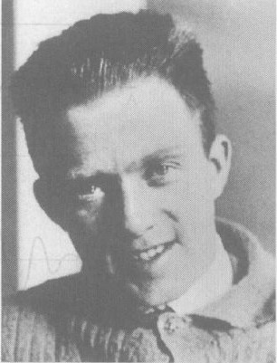

*图 14.1 W. 海森伯。他用薛定谔方程推导出著名的不确定原理，根据这个原理，每个实物粒子具有固有的、不可消除的位置不确定性和速度不确定性。于是，在微观世界，未来并不由过去完全确定。*

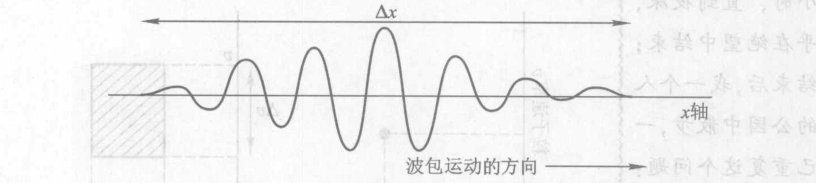

*图 14.2 代表单个粒子的物质波，这个粒子的位置不确定度是 $\Delta x$，沿 $x$ 轴方向运动。一个像这样只在有限距离上延展的波叫做一个波包。*

按照这条线索进行细致的推理，海森伯得出，这一规则对每种粒子（而不只是电子）在每种物理情况下（而不只是在自由运动时）都成立。下面就是他的结果用于实物粒子的情形（这条原理的一个经过修正的形式也适用于光子）：

> **不确定原理**
>
> 每个实物粒子的位置和速度都是不确定的。虽然两个不确定量中随便哪个都可以取任何值，但是二者的乘积一定等于普朗克常量除以粒子的质量。用符号表示就是
> $$ \Delta x \cdot \Delta v \approx h/m $$
> 其中 $h$ 是普朗克常量而 $m$ 是粒子的质量③。

① 其理由为，按照名为“傅里叶分析”的一门数学分支，一个波包是许多个不同的波长的波的叠加，每个波有确定的波长。但是德布罗意公式 $\lambda=h/mv$ 告诉我们，不同的波长对应于不同的速度。因此一个波包有一个可能速度范围。
② 原因如下：由于 B 被压缩到长度只有 A 的一半，B 的波长只有 A 的波长的一半。因此 B 的各个分量速度是 A 的速度的两倍，因为 $\lambda=h/mv$ 表明波长与速度成反比。因此 B 的速度范围 $\Delta v$ 也是 A 的两倍。
③ 更精确地说，$\Delta x \cdot \Delta v \geqslant h/4\pi m$，这个乘积可以大于 $h/4\pi m$，但是不能小于。

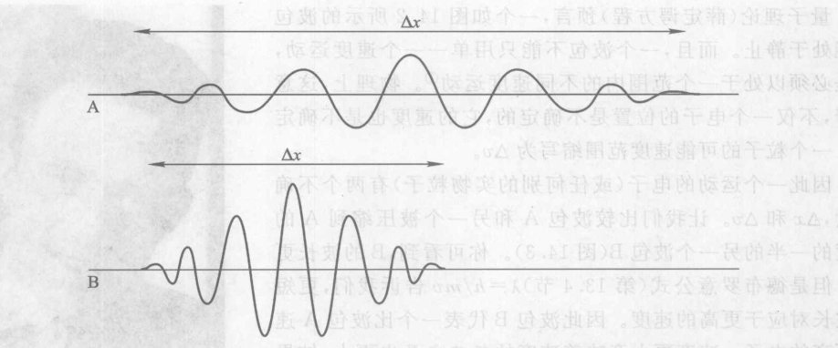

*图 14.3 $\Delta x$ 值不同的两个波包。波包 B 可以由把波包 A 压缩到一半大小而得到。在这一过程中，A 的所有波长都被压缩到原来长度的一半，这意味着速度和速度的不确定度加倍。*

我们把一个粒子的 $\Delta x$ 和 $\Delta v$ 称为它的**可能值范围**。我们可以在一个速度-位置图里直观想象一个粒子的可能值范围（图 14.4）。这个图上的一点代表一个精确的位置 $x$ 和速度 $v$ [图 14.4(a)]。牛顿物理学认定每个物体有一个精确的 $x$ 和 $v$。例如，按照牛顿物理学，一个坠球的中心的位置和运动可以用一个特定的 $x$ 和一个特定的 $v$ 来描述。牛顿运动定律从根本上说是根据物体当下的 $x$ 和 $v$ 预言其未来的 $x$ 和 $v$ 的方法。例如，给出一个下落的垒球的中心在一个时刻的位置和速度，我们可以预言此中心在下落过程中以后任何时刻的位置和速度。

但是微观粒子并不同时具有精确的位置和速度。量子理论要求每个物体的位置和速度有不确定量 $\Delta x$ 和 $\Delta v$，它们构成一个潜在这个性或可能性的**范围**。这可以由以 $\Delta x$ 和 $\Delta v$ 为边的矩形的面积，见图 14.4(b)。如果由于任何原因 $\Delta x$ 减小了，那么 $\Delta v$ 就一定增大，以保持乘积不变，如图 14.4(c) 所示。而如果 $\Delta v$ 减小，则 $\Delta x$ 一定增大，如图 14.4(d) 所示。不论 $x$ 还是 $v$ 你都可以随你意高精确实地预言，但如果其中一个是高度精确预言的，则另一个必定是高度不确定的。你可以把这些图当成是一个粒子的物质场的图像。像别的物理场一样，物质场是散布在空间的一个位置范围上的，场的不同部分以不同的速度运动。一个像图 14.4(b) 那样的可能值范围只是表示这些位置和速度的范围。如果这时粒子在某一点撞击屏幕，关于这一点我们唯一可以事先预言的是，它将在范围 $\Delta x$ 之内。同样，它的速度可以是范围 $\Delta v$ 内的任意值。

> 我还记得我和玻尔的讨论，这次讨论进行了许多个小时，直到深夜，并且几乎在绝望中结束；在讨论结束后，我一个人在邻近的公园中散步，再向自己重复这个问题：大自然有可能像它外表显示的那么荒谬吗？
> ——海森伯
>
> 一个没有有意识的生命的宇宙，不过是一场没有观众的戏剧，不为任何人而存在。在这种情况下，干脆说这个宇宙不存在，难道不是很恰当吗？
> ——薛定谔

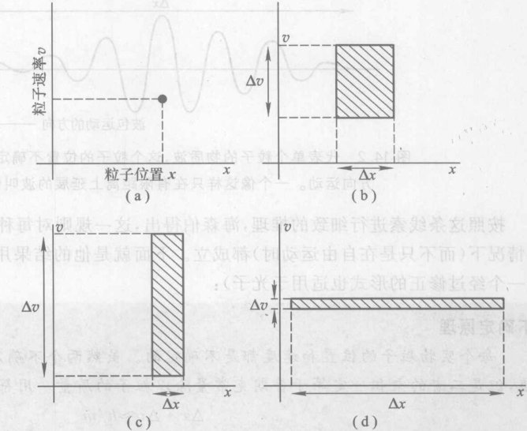

*图 14.4 位置不确定度和速度不确定度。(a) $x-v$ 图上如图所示的一点代表 $x$ 和 $v$ 的一对精确值。量子理论不允许这样的精确值；(b) 根据量子理论一个粒子的可能值范围。阴影区域的总面积 $\Delta x \cdot \Delta v$ 一定大约等于 $h/m$；(c) 如果 $\Delta x$ 由于任何原因减小了，那么 $\Delta v$ 一定增大，以占据面积相同的可能值范围；(d) 如果 $\Delta v$ 减小，$\Delta x$ 必定增大。*

由于不确定原理 $\Delta x \cdot \Delta v \approx h/m$，质量更大的粒子的可能值范围更小。例如，一个质子的可能值范围只有一个电子的可能值范围的 2000 分之一（图 14.5）。因为 $x$ 和 $v$ 二者都是预言一个物体未来的行为所需，一个质子比一个电子可以更精确地预言。而一个垒球，其质量是一个电子的质量的一亿亿亿倍，其行为可以如此精确地预言，以致量子不确定性可以忽略（图 14.5）。这就是宏观世界服从牛顿物理学的原因。即使是一粒沙子，其质量也是如此之大（它包含大约 $10^{18}$ 个原子），以致量子不确定性可以忽略。

> 这再一次强调了对原子事件的描述中的主观因素，因为测量仪器是观察者建造的……我们必须记住，我们所观察的并不是自然本身，而是自然向我们的探询方法所暴露的一面。
> ——海森伯
>
> 相信存在一个独立于感知主体的外部世界是一切自然科学的基础。
> ——爱因斯坦

假设一个粒子的 $\Delta x$ 被压缩到一个非常小的范围。于是这个粒子一定有很大的 $\Delta v$。但是如果不是同时有一个很大的 $v$ 的话，你不能有一个很大的 $\Delta v$；例如，如果 $\Delta v$ 是 1000 km/s，那么单单 $v$ 的可能值范围最低（最慢）是 0 至 1000 km/s，因此 $v$ 的平均值一定至少是 500 km/s。因此当 $\Delta v$ 大时，$v$ 也一定大。这意味着位置被高度确定（$\Delta x$ 小）的粒子一定运动很快。位置越确定，速度越大。不确定原理不允许微观世界是静止的！例如，原子核内的质子和中子必须以 10% 的光速运动，因为核力把它们约束在原子内的这样一个小区域内。

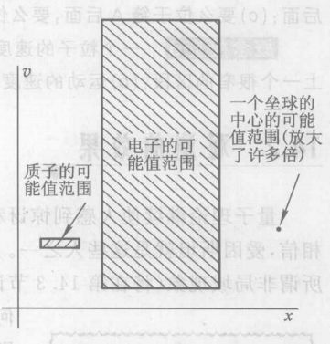

*图 14.5 质量更大的物体的可能值范围更小。这是像垒球这样的宏观物体的量子不确定性可以忽略的原因。*

量子不确定性在实际运用上相当重要。我们在第 14.3 节将看到，它们有一天可能在量子计算机中得到实际应用。量子不确定性是放射性衰变（第 15 章）这种原子核现象的核心，使这个过程从根本上不可预言。在怀孕时，双亲的 DNA 分子随机结合的过程中，DNA 的化学键的量子特性起着一定的作用。因此，在微观层级上运作的量子不确定性在你的遗传中起了作用。根据宇宙起源的暴胀理论（第 11 章），大爆炸时的微观量子不确定性成了随后物质依靠引力集聚为今天我们看到的巨大星系团的“种子”。宇宙的膨胀把这些初始很微小的种子拉伸到天文学尺度，物质被吸向这些种子。今天我们看到，微观的量子不确定性被放大了，在宇宙的总体布局上留下了永远的烙印。

> 在有关原子事件的实验中，我们必须和事物与事实、和现象打交道，它们与日常生活中的任何现象同样真实。但是原子和基本粒子本身则不是这样真实；它们构成一个潜在性或可能性的世界，而不是一个真实事物的世界。
> ——海森伯
>
> 我们以这些方式和许多别的微妙方式处于玩骰子的上帝的手掌之中。

> **概念检查 1**
> 下面这些东西哪一个的可能值范围（量子不确定性范围）最大？(a) 质子；(b) 汽车；(c) 氦原子；(d) 水分子。
>
> **概念检查 2**
> 参看图 13.13，在物质波刚刚穿过双缝之后，它的可能值范围 (a) 覆盖图中从上面的缝 A 到下面的缝 B 的整个位置范围；(b) 破裂成两个分开的碎片，一个在缝 A 后面，另一个在缝 B 后面；(c) 要么位于缝 A 后面，要么位于缝 B 后面，只能是其中一种。
>
> **概念检查 3**
> 一个粒子的速度很精确，其波包 (a) 占据 $x$ 轴上一个很宽的区段；(b) 只占据 $x$ 轴上一个很窄的区段；(c) 运动速度有很大的范围；(d) 运动速度的范围很小。

## 14.2 观测的效果

量子理论继续使人感到惊讶和困扰。有些人觉得这个理论过于与直观相反，以致无法相信，爱因斯坦就是这些人之一。他和另外两个物理学家于 1935 年表明，量子理论预言存在所谓的非局域现象（将在第 14.3 节讨论），这种现象如他所说是如此“不可思议”，使他期望“任何对实在的合理定义能够允许这样的现象存在”。爱因斯坦和别人的把这些预言当做一个正确的理论将不包含量子不确定性的证据。不过，爱因斯坦虽并不曾提出方法，让量子理论的不可思议的预言接受实验检验。

于是，世界像是由事件构成的一件复杂的织物，在这件织物中，不同的联结交替着、叠合着并组合着，决定了整体的结构和质地。
——海森伯

由于量子理论在实际中取得如此辉煌的成功，并没有多少物理学家对这些未经验证的反对意见感到烦恼。在那些的确感到烦恼的人中有 D. 玻姆和约翰·贝耳（图 14.6）。玻姆在 20 世纪 50 年代开始发表他对量子理论的诠释分析。贝耳从这些想法出发，于 1964 年证明量子理论的某些不可思议的预言是可以该实验检验的。J. 克劳塞（图 14.6）和他的四位合作者④在 1972 年实现了首次这样的实验检验，并发现，与爱因斯坦等人的期望相反，这种不可思议的现象是实际发生的！1982 年，A. 阿斯佩克特（图 14.6）改善了克劳塞的实验检验，使得毋庸置疑，真实的世界要比爱因斯坦等人所想的更为奇特。

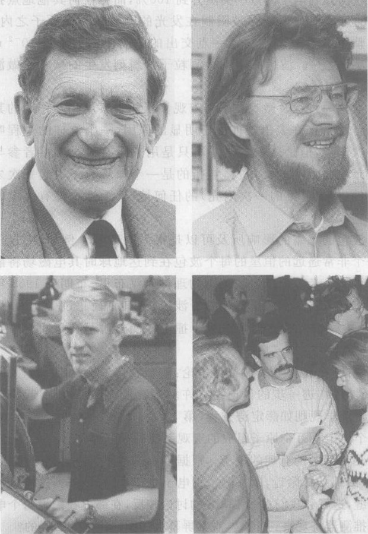

*图 14.6 量子理论的四位探索者。从上左开始顺时针方向：玻姆、贝耳、阿斯佩克特与贝耳（右）和物理学家梅西亚（左）谈话、克劳塞。*

这些不可思议的预言与量子化的电磁场和物质场中的突然变化有关。例如，考虑单个自由运动的电子飞向一个观察屏。我们已经看到，直到撞击发生之前，实空中只有一个延展的物质场或波包向着屏幕运动；我们叫做“一个电子”的撞击实际上只是从物质场给观察屏的一个能量量子。这个波包可以延展很宽，甚至伸展一个宏观距离。例如，引起图 13.11 中任意一次撞击的波包在到达观察屏时大约是 1 cm 宽。与原子大小相比，这是一个极大的尺寸，相当于 1 亿个原子一个挨着一个排起来那么宽。

现在想一想单个电子的这个 1 cm 宽的波包撞上观察屏时所发生的事情：波包和观察屏的原子之间的相互作用使得屏幕的单个“颗粒”（与一颗沙粒相似）发一下光。在这一瞬刻，整个延展的波包突然发生根本的改变，因为在这一点找到电子的概率突然升到 100%，而在任何其他地点找到电子的概率下降到零。这个电子的可能值范围现在被限制在发光的颗粒的一个原子之内，大小约为 10 亿分之一米，因为场的整个能量量子是在这一点交出的。波包的大小从 $10^{-2}$ m 降到 $10^{-9}$ m 或更小——小到 1 000 万分之一。波包大小在检测粒子的瞬刻发生的减小叫做**波包的塌缩**。

> 观察者永远不会被仪器完全代替；因为如果仪器完全代替了他，他显然就得不到任何知识……仪器是要人来读的！观察者的意识最终总会插进来。最细心的记录，如果没有人看，也不告诉我们任何东西。
> ——薛定谔，引自 *Mind and Matter*
>
> 真棒，现在的小伙子会有这些想法。但是对他们的话我一个字也不信。
> ——爱因斯坦在海森伯 1927 年发布不确定原理的演讲之后
>
> 我不能认真地相信 [量子理论]，因为它不能和下面的观念相调和：物理学应当代表时空中的实在，不存在不可思议的超距作用。
> ——爱因斯坦

对这一过程及微观粒子与宏观仪器如观察屏相互作用的其他场合总是有许多争论。由于明显的原因，一个这样的过程叫做一次**测量**，但是这个术语并不只用来指有人类观察者参与并记录测量结果时。相反，它指的是一个微观粒子引起一次宏观事件（例如可见的一次闪光）的任何情况，无论有没有人出席观察它。

波包的塌缩的影响所及可以是很大的区域。例如，来自任何一个非常遥远的恒星的每个光波包在到达地球时其电磁场将散布在许多千米的范围上。英国物理学家汉布里-布朗于 1965 年通过测量来自一颗恒星的光的干涉图样（其直径超过 100 米）证实了这个预言。尽管光子波包的尺寸很大，每个光子的场在光子撞上探测器时都在瞬间收缩到一点。

波包塌缩由于其瞬时性和“非局域性”在物理学家中备受争论：这个波包怎么会在一个大区域内同时消失？我们将在下节对非局域性作进一步的讨论。在许多人看来，它之所以引起争论还因为，测量过程不能用通常的量子物理学规则如薛定谔方程（第 13 章）来描述。⑤ 这是一个复杂的问题，因为它涉及微观粒子和一个由上百万个原子组成的宏观系统的相互作用。

用电子做的双缝实验提供了量子测量问题的有趣的例子。根据牛顿式的思维方式，你也许会以为，我们可以把一个探测器放在这条或那条狭缝附近，以探测个别电子是穿过哪条缝的，这样就可以证明每个电子的确穿过这条或那条缝，这就和我们在图 13.13 的讨论相反，在那里我们说每个电子的物质场都穿过两条缝。这样一个探测器将观察到什么？观察屏幕上的图样将是什么样的？

在回答这些问题之前，我们需要看一看——当我们完全关闭随便哪一条缝时会发生什么情况。这时，每个电子的波包显然一定穿过没有关闭的那条缝，缝 A 或缝 B。图 14.7 示出每种单缝图样：图 14.7(a) 示出只有缝 A 打开时得到的图样，图 14.7(b) 示出只有缝 B 打开时得到的图样（这两个图样当然是完全全同的，除了一个在缝 A 后面，另一个在缝 B 后面）。这两个简单图样每一个都表示单个电子的波包到达屏幕时波包的强度（物质场的强度，或屏幕上不同点发生电子撞击的概率）。完全没有干涉的痕迹。薛定谔方程预言了这些图样，并且这些图样可以作为上百次万次电子撞击后得到的统计结果在实验上观察到。现在看了第三个图，图 14.7(c)；它只是前两个图之和，把两个单缝实验中的全部电子撞击加在一起。换句话说，图 14.7(c) 表示，如果和在第 13 章的讨论相反，在双缝实验中每个电子波包实际上只穿过这条或那条缝而不是同时穿过两条缝，所发生的情况。

> ④ M. Horne, A. Shimony 和 R. Holt 在实验的设计方面与他合作，S. Freedman 在实验的实际操作上与他合作。
> ⑤ 另一方面，许多物理学家争辩说，一个叫做“量子退相干”的过程可以仅在薛定谔方程和别的已被接受的量子原理的基础上描述波包塌缩。

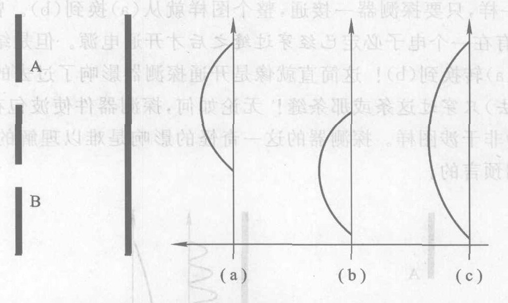

*图 14.7 用电子做的单个狭缝实验的结果。像第 13 章中一样，这个图表示从顶视角度看的实验，A 和 B 处的开口代表长狭缝的窄方向。(a) 只有缝 A 打开而缝 B 关闭时观察屏上电子撞击的图样；(b) 只有缝 B 打开而缝 A 关闭时的图样；(c) 图 A 和图 B 相加，表示双缝实验中如果每个电子波包只通过某一缝（(a) 或 (b)）而不是同时通过两条缝时将发生的情况。*

下面，让我们回忆当两条缝都打开、但是没有探测器查看电子穿过哪条缝的情况。在第 13 章曾讨论过，这时得出的结果是一幅干涉图样，如图 13.13 所示。

现在我们来看，如果在双缝实验中有一个探测器确定电子是通过哪条缝，会发生什么情况。图 14.8 表示探测器（假设它像一只从侧面看的眼睛）位于 D 点，正在缝 B 后面。这样的探测器通常是电磁器件，设计成对电子运动的影响尽可能小，允许电子在近处经过，不受阻碍地到达观察屏。只要这个探测器没有接通电源，不能探测电子，在屏幕上就出现通常的干涉图样 [图 14.8(a)]。当探测器一接通，它立即开始指示，大约一半的电子是通过缝 B 的，另一半不通过缝 B，这使我们以为，牛顿物理学说的毕竟是对的：电子的确是穿过这条或那条缝而不是同时穿过两条。但是，只要开关一开通，干涉图样就消失，而“非干涉图样”（图 b）就出现在屏幕上——这正是我们在图 14.7(c) 中看到的图样，它应当是电子要么穿过缝 A 要么穿过缝 B 的纯效应，而不是同时穿过两条缝！实验者甚至可以让探测器在断通之间快速转换，使屏幕上的图样同样快速地在 (a) 和 (b) 之间跳变。显然，测量（或探测）对物质波有强烈的和立即发生的影响。

为了减小探测器对实验的影响，研究人员可以将探测器摆在离路径更远的地方，例如离缝更远（图 14.9）。还是一样，只要探测器一接通，整个图样就从 (a) 换到 (b)。曾设计出极快的开关器件，使得探测器只有在一个电子必定已经穿过缝之后才开通电源。但是结果仍然一样：只要探测器接通，图样就从 (a) 转换到 (b)！这简直就像是开通探测器影响了过去发生的事件，使得双缝的波包改为（在过去）只穿过这条或那条缝！无论如何，探测器件使波包在已经通过双缝之后从干涉图样立即变为非干涉图样。探测器的这一奇怪的影响是难以理解的，虽然它实际上是量子物理学的标准规则预言的。

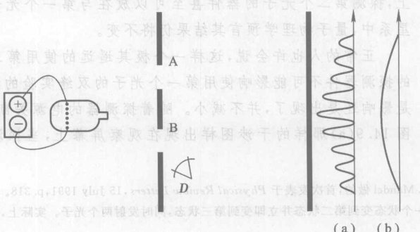

*图 14.8 仅仅接通位于 D 点的粒子探测器的电源，就使物质场从干涉图样 (a) 跳变到非干涉图样 (b)。*

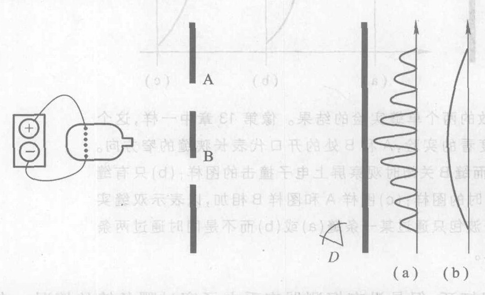

*图 14.9 即使探测器放在狭缝后面很远的地方，靠近屏幕，只要探测器一接通，图样就将从 (a) 跳变到 (b)。*

**我们怎么知道仅仅观测就会影响远处的时间？** 1991 年在曼彻斯特大学做的一个实验演示了观测对实验结果的影响的一个极端的例子。⑥ 这个实验是用光（光子）而不是用实物（电子）做的，但是没有人怀疑，如果能够用电子做类似的实验，结果也会相同。

在一个器件中同时产生两个光子*——两个单光子的电磁场波包。第一个光子穿过一个双缝干涉装置，而第二个光子则沿一个完全不同的方向飞向一个探测器件。探测器件这样安置，使得它完全从观测第二个光子来指出第一个光子穿过哪条缝，它可以摆放在离第一个光子的路径一段距离的地方。原则上，探测第二个光子的器件甚至可以放在与第一个光子不同的星系中，量子物理学预言其结果仍将不变。

正常的人也许会说，这样一个极其遥远的使用第二个光子的探测器件不可能影响使用第一个光子的双缝实验的结果。但是影响还是出现了，并不减小。随着探测器的电源关断，一个像图 14.9(a) 那样的干涉图样出现在观察屏幕上，当探测器接通时，图 14.9(b) 那样的非干涉图样立即出现。

这个实验有一种整体的特性，这种整体性是量子物理学的典型特性。实验的结果（干涉或非干涉）依赖于整个实验装置。虽然两个光子离开很远，第一个光子的行为还是强烈地依赖于有没有探测第二个光子的探测器。量子世界看来是紧密地相互联结在一起的。我们将在下节看到更多的这类联结。

> ⑥ 这个实验是邹兴宇、王力军和 L. Mandel 做的，首次发表于 Physical Review Letters, 15 July 1991, p. 318。
> * 在单次原子事件中一个原子从一个状态变到第二状态并立即变到第三状态，同时发射两个光子。实际上，两个光子是纠缠的，见下节。——译者注

> **概念检查 4**
> 假设在图 14.8 中用两个探测器，每条缝后面放一个。这时，物质场在屏幕上所成的图样将是 (a) 一个干涉图样，分成不相连的两部分，各自在一条缝后面；(b) 一个非干涉图样，分成不相连的两部分，各自在一条缝后面；(c) 一个和图中所示的相同的干涉图样；(d) 一个和图中所示的相同的非干涉图样。

## 14.3 量子非局域性：不可思议的超距作用

迄今我们只在仅包含不相互作用的单独粒子的情况之下讨论了量子不确定性和非局域性。我们还记得，量子非局域性指的是整个延展的电磁场或物质场在瞬间发生的变化，哪怕发生变化的地方离引起变化的地方很远。

我们来看量子不确定性和非局域性应用到两个或多个粒子时后的后果。我们将只考虑两个粒子，但是同样的结论也适用于任意多个粒子。如果两个粒子在物理上相互作用，量子理论预言，它们的物质场会紧密地联结起来，并且甚至在两个粒子分开之后仍然联结在一起。这两个粒子变成一个单一的量子系统，具有单一——一个共有的物质场。这样两个粒子叫做一个**纠缠**系统。图 14.10 是表示这一情况的一个方法。图中画出两个粒子的波包。这两个波包在初始时是完全分开的，然后它们运动到相互足够靠近，发生相互作用，然后再分开。量子物理学预言，它们的物质波在相互作用过程中彼此混合在一起，使得这两个波包形成一个单一的二粒子波包，即使在两个粒子分开之后也是如此。我试图在图 14.10 中表明这一点，用的办法是把两个初始波包分别涂成黑色和灰色。当它们分开时，每个波包的一部分向右走，一部分向上走——如伴随两个波包的箭头所示。在发生相互作用后，两个波包都既含黑色又含灰色，实际上是一个单一的黑-灰波包的两个“子波包”，哪怕两个子波包可能在空间分开很远。纠缠的两个粒子是一个单一的量子体即一个二粒子波包的构成部分。它们构成一个单一的物体，不过是在两个不同的地方。

现在假设图 14.10 中这两个纠缠的“子波包”中的一个撞击一面观察屏。这个波包顷刻间就在一切地方塌缩。但是这必定会影响另一波包，因为这两个波包实际上构成一个单一的相互联系的波包。这就在顷刻间改变了第二个粒子的量子态，哪怕这两个粒子分开的距离以光年计。⑦ 这是一种**超距作用**，在爱因斯坦看来它是不可思议的。从 1972 年以来，实验已充分证实了纠缠的实在性。

> 这个宇宙是一个让人以某种奇异的方式参与其中的宇宙。
> ——惠勒
>
> 这把人们领到一个不可分割的整体性的新观念，这种观念否定了可以把世界分解为单独而且独立存在的部分的经典观念。通常的观念以为，这个世界的“基元部分”是最基本的实在，我们把这个观念颠倒过来了。我们毋宁说，整个宇宙的相互联结性才是基本的实在，而“部分”则仅仅是这个整体之中相对的、偶尔的形式。
> ——玻姆
>
> 任何基元现象，在未观察到时都不是真实的现象。
> ——惠勒

**我们怎么知道大自然是非局域的？** ⑧ 1992 年，英国物理学家 J. Rarity 和 P. Tapster 在双缝干涉的基础上做了一个纠缠实验。这个实验在开始时产生两个纠缠的光子（理论预言用电子做的实验结果相同），它们的波包彼此背相运动，如图 14.11 所示。然后两个波包各自穿过分开的双缝装置，并依靠图中所示的反射镜系统，撞击各自的观察屏。Rarity 和 Tapster 观察由上百万个这样的纠缠电子对形成的总的图样。

像在通常的双缝实验中一样，每个粒子的波包都既穿过缝 A 又穿过缝 B，如果两个粒子不纠缠，左面的屏和右面的屏都将显示通常的干涉图样。

由于两个光子是沿相反的方向分开，如果它们是普通的牛顿粒子，那么它们在第一面屏上的撞击点在中点以下的距离 $x$，将和第二面屏上的撞击点在中点以上的距离 $y$ 完全相同（见图）。即，$x$ 将等于 $y$。但是，由于量子不确定性，$y$ 不一定等于 $x$，不能由关于第一个撞击地点 $x$ 的知识预言第二个撞击地点 $y$。事实上，量子物理学预言，它们的差 $y-x$ 应当形成一幅典型的干涉图样，如图 14.12 所示。

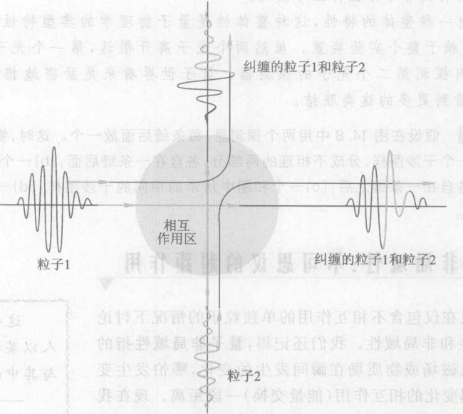

*图 14.10 两个粒子相互作用后再分开，它们的物质场通常会纠缠在一起。解释见正文。*

> ⑦ 这个实验没有在几光年的距离上做过，但是它曾在相距几千米的距离上做过。奥地利物理学家 Zeilinger 计划做的一个实验将把两个纠缠的光子的光束从卫星投射到地球上相距甚远的两点，以检验在地球表面上相距很远的两点的量子纠缠。
> ⑧ 这个实验是 1986 年由 M. Horne 和 A. Zeilinger 建议的，并于 1992 年由 J. Rarity 和 P. Tapster 完成；区泽宇和 L. Mandel 做了一个类似的实验。

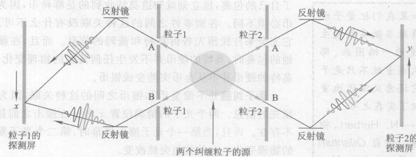

*图 14.11 位置纠缠实验。由于它们之间的纠缠，粒子 1 和粒子 2 在顷刻间协调它们的撞击地点 $x$ 和 $y$，不论它们离开多远。图中所示的四个波包是在图中心的“源”处产生的。各个反射镜仅仅反射这些波包，引进它们只是为了把实验限制在狭小的区域内。*

按照图 14.12，两个光子的撞击地点 $x$ 和 $y$ 必定互相关联，使得 $y-x$ 构成一幅干涉图样，尽管在撞击之前由于不确定原理既没有精确的 $x$ 值也没有精确的 $y$ 值存在。假设我们对实验略作改变，允许第一个光子撞击观察屏发生在第二个光子撞击观察屏之前（这不会改变实验的结果）。尽管在撞击之前精确的 $x$ 值不存在，只要第一个光子在某点 $x$ 一撞击屏幕，第二个光子的波包（它可能在几光年之外）就必须在顷刻间改变自己，以“适应”第一个光子的撞击地点，如图 14.12 所示。这是什么意思呢？假设图 14.12 的干涉图样中峰值互隔 1 mm，使得相长干涉发生在 $y-x$ 等于 0 mm, 1 mm, 2 mm, 3 mm, 等等的地方。那么在光子 1 在某一特定点 $x$ 发生撞击之后，光子 2 必须优先选择在一点 $y$ 发生撞击，$y$ 和 $x$ 差 0 mm, 1 mm, 2 mm, 等等，而必须避免那些和 $x$ 差 0.5 mm, 1.5 mm, 2.5 mm, 等等的 $y$ 值。既然在第一个光子撞击之前具体的 $x$ 值甚至尚不存在，而且两个光子还离开一段距离（甚至好几光年），那么第二个光子怎么能“知道”应当撞击哪些点、避开哪些点呢？第二个光子在顷刻间就获得关于第一个光子的撞击地点的知识，尽管它们相隔一段距离。真是不可思议！

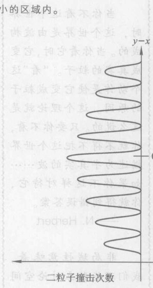

*图 14.12 如果我们不是分开研究 $x$ 或 $y$，而代之以研究两个屏幕上的两个撞击点的位置之差 $y-x$，我们就得到一幅干涉图样。这说明两个粒子是纠缠的。在某一点 $y$ 发生撞击的光子 2，怎么会“知道”光子 1 的撞击地点 $x$，以调整 $y$ 值使之适配这里显示的干涉图样呢？光子 2 在顷刻间就把它的撞击图样与光子 1 的撞击地点协调起来，尽管不确定原理说两个撞击地点事先都是不确定的。*

也许你觉得这种跨越一段距离的不同粒子之间的合作还不算不可思议。也许它仅仅是下述各种事例之间的关联的一个例子：假设我说知道住在巴黎的莫特和住在北京的薇玛互寄了一枚金币给他们当中的一人、一枚银币给另一人。没有进一步的信息的话，他们之中谁都不知道自己将收到哪种币。但是当薇玛打开了自己的包裹，她立刻就知道莫特收到的是哪种币，因为两块硬币必须不同。各别事件之间的这种关联没有什么不可思议的；它完全来自我预先告诉莫特和薇玛的信息。而且，在薇玛打开她的包裹时，莫特的硬币并没有发生任何真实的物理变化。例如，莫特的硬币并不从金币突然变成银币。

**量子纠缠**并不像金币和银币之间的这种关联，因为没有预先的信息。两个光子的精确位置 $x$ 和 $y$ 在撞击之前甚至根本不存在。而且，当第一个光子撞击屏幕时，第二个光子发生真实的物理变化——其波包突然改变。

1964 年，贝耳（图 14.6）细致地定量分析了这个问题，他证明，纠缠粒子之间的关联不是通常的金银币问题那种关联，并且一个粒子的举动引起另一个粒子的物理变化。这就像是薇玛在北京收到一枚金币立即即使得在巴黎的莫特的硬币变成一枚银币，虽然在薇玛观察她的硬币之前莫特的硬币既不是金币也不是银币。下面是贝耳的结论的小结：

> **非局域性原理**
>
> 量子理论预言，纠缠粒子的行为将是这样的，它只能用粒子之间存在有真实的**非局域**（即瞬刻到达远处）关联才能解释。这就是说，一个粒子的物理变化，例如对这个粒子进行的一次测量所引起的这个粒子的变化，会在瞬间使与这个粒子纠缠的所有其他粒子发生物理变化，不论这些粒子离这个粒子多远。

> 如果我们把量子理论认真地当作实际发生的事情的一幅画图，那么每次测量就不只是干扰；它还意义深远地重新编织了实在之布。
> ——N. Herbert, 物理学家，引自 *Quantum Reality: Beyond the New Physics*
>
> 当你不看这个世界时，这个世界是由波构成的。当你看它时，它变成真实的粒子。“看”这个动作是使它变成粒子的原因。这个道理就是这么说的。只要你不看，你就不得把这个世界描述为半真实的波……如果你不这样对待它，你就得到错误答案。
> ——N. Herbert

**非局域性**意味着，我们不能独立讨论空间的不同部分。
——贝耳

**纠缠**是量子理学的本质特征。
——薛定谔

贝耳也发现了可以在实验上检验关于纠缠的量子预言的方法。克劳塞（图 14.6）是第一个做这种检验的人。阿斯佩克特（图 14.6）最先证明，这种联结的建立比光速还快，看来发生在瞬刻，正像量子理论预言的那样。两个粒子确实构成了一个单一客体，某些物理学家称之为“二粒子系统”。两个纠缠的粒子不是依靠它们之间的通信来协调它们的行动；而是它们的行动一定协调，因为它们是单一客体，只不过处于两个不同的地方。

这样一个结论似乎同相对论不存在比光更快的运动的论断相矛盾。但是相对论说的只是**能量**（实物或辐射）不能运动得比光还快。而贝耳非局域性原理中所指的联结并不传递能量，因此贝耳原理不违背相对论。

如果纠缠粒子中的任何一个接触外部世界，量子纠缠立即结束。例如，在 Rarity-Tapster 实验中，当随便哪个粒子撞击屏幕时，纠缠就结束了。尽管纠缠如此脆弱，丹麦物理学家于 1999 年还是提出了一个使任意多个离（带电的原子）发生纠缠的实际方法：把离子陷在电磁场陷阱中，并用激光在它们之间产生纠缠。2001 年曾用这个方法使两团分离的气体云产生纠缠，每团云包含上十亿个铯原子。两团云只相隔几毫米，实验表明，纠缠保持了 0.000 5 秒，但是人们期待将来能在更大的距离上保持更长的时间，也许是用固体样品替代气体。

纠缠和不确定性有可能导致强有力的**量子计算机**。常规的计算机是由许多个像电子开关一样的简单的、单个的物理器件构成的，每个器件有两个值：“开”和“关”。这样的物理器件叫**比特**，它的两个态分别标为“0”和“1”。量子计算机将由许多个单个的量子系统（比如陷在一个电磁场中的单个离子）构建而成，每个系统有两个可能的量子态，比如一个能量较高的量子态和一个能量较低的量子态。这些量子系统叫**量子比特**，和通常的比特一样，它的两个量子态也分别标为“0”和“1”。但是量子比特利用的是这些量子态的量子本性。要理解这一点，我们回忆双缝实验，我们在那里看到，量子不确定性允许单个电子同时通过两条缝。在同样的意义上，量子不确定性允许每个量子比特（如一个离子）同时处于它的两个可能的状态“0”和“1”中。于是对这样一个量子比特施行的物理操作就同时施行在两个状态上。

这听起来似乎并不给人以深刻的印象，但是只要你考虑它对多于一个量子比特的情况，你就会看到它的力量。考虑两个量子比特。由两个比特构成的常规计算机有四个可能的状态：00, 01, 10 和 11。计算机在任一时刻只能在其中一个状态中。但是一个量子计算机的每个量子比特都同时处于两个状态 0 和 1，因此这部量子计算机就同时处于它的四个可能的状态，从而它能对全部四个状态同时实行计算。三个量子比特可以同时处于八个状态。随着量子比特个数的增加，它们同时所处的状态数急剧倍增，提供了极大的计算能力。

量子计算机机使用一个“控制”量子比特对进行计算的各量子比特的量子态进行运算，控制的量子比特和计算用的量子比特通过量子纠缠相联结。如果最终表明量子计算机是可行的，它将是最完美的量子器件，它的运作从根本上依赖于两种特定的量子现象：不确定性和纠缠。

> 对我来说，这是一个两难处境。我想它是一个深奥的两难推理，不会轻易得到解决；它将要求我们看待事物的方式有一个实质性的变化。
> ——贝耳，在谈到阿斯佩克特实验的含义时

> **概念检查 5**
> 一台有 10 个量子比特的量子计算机可以同时进行多少个运算？(a) 10；(b) 100；(c) 8；(d) 64；(e) 512；(f) 1 024。
>
> **概念检查 6**
> 如果两个电子是纠缠的，那么 (a) 如果其中一个粒子突然改变其波包，则另一个粒子也一定突然改变其波包；(b) 它们一定彼此施力；(c) 随着它们相互远离，它们之间的纠缠将会减少；(d) 二者是一个单一的物质波的一部分；(e) 随着它们相互远离，它们将变得更加纠缠。

## 14.4 这是什么意思？量子实在

丹麦物理学家尼尔斯·玻尔（图 14.13）对我们理解量子理论贡献最大。1913 年，他提出半量子化的行星系原子模型，这是通向后来的全量子的原子理论的有用的台阶（第 14.6 节和 14.7 节）。在 20 世纪 20 年代和 30 年代，玻尔和海森伯、玻恩及其他人一道发展了一种量子理论的哲学（对理论的涵义的看法），它经受了时间和新实验（像那些证实非局域性的实验）的检验。今天，玻尔的观点在物理学家中已被普遍（但非全体一致）接受。本章讲述的就是这个观点，但是增添了一些最新的实验和说法。

> 在一个完全决定论的世界里，我们所知道的人类的自由意志就化为只是一个幻影……按照量子力学，我们不能排除自由意志可能是创造未来的过程的一部分。
> ——爱德华·特勒
>
> 有两种真理：一种是平庸的真理，它们的对立面是明显荒谬的；一种是深奥的真理，辨认它的标准是，它的对立面也是深奥的真理。
> ——玻尔

**不确定性**是量子理论的一个主要特征。当我们说一个电子的位置不确定时，我们的意思并不是简单地指我们缺乏有关它的位置的知识，而是说这个粒子实际上没有确定的位置。它的物质场（即这个电子）充填它的全部可能值范围。

考虑一次精确的位置测量对一个由波包描述的粒子的效果。这样一次测量将发现粒子在某个具体位置 $x$。但是，如果由此得出结论说粒子在测量之前就在 $x$ 或者哪怕是在 $x$ 附近，那将是一个错误。相反，我们必须想象粒子在测量前是处于一个可能值范围 $\Delta x$ 内，测量实际上是生成了粒子的位置而不仅仅是发现了它，因为测量使物质场塌缩为（几乎）一个点。测量部分地生成它们要探测的属性。一次位置测量生成一个（近似的）位置，一次速度测量生成一个（近似的）速度（图 14.14）。

*图 14.13 玻尔的订婚照，摄于 1911 年。两年后他发展了第一个精确的原子结构理论。*

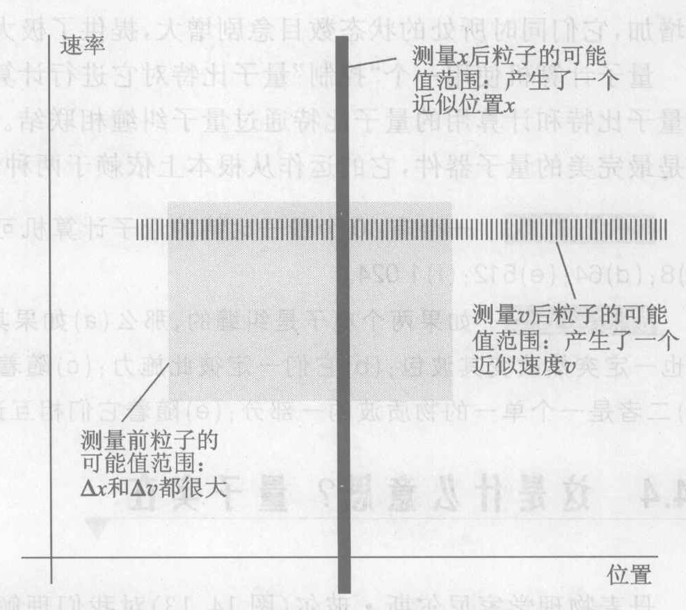

*图 14.14 一次位置测量或一次速度测量的效果是为被测量的粒子生成一个位置或速度。*

不确定原理不允许同时定一个精确的位置和一个精确的速度。这就像一个坠球可以有确定的颜色或者有确定的形状，但是不能同时具有二者。因为位置和速度这两个属性中一个的存在排队另一个的存在，我们说这两个属性彼此“互补”。在玻尔由于他的科学成就而被丹麦文化传统的最高荣誉爵士时，他选择中国的表示阴阳互补关系的太极图为他的族徽上的盾形纹章的主图（图 14.15）。

> 从量子力学的起源要学到的一个教训是……在我们的学说的某个地方隐藏着一个未经经验证明的概念，我们必须清除它来开辟道路向前。
> ——玻恩

量子理论的意义和观测是紧密相连的。我们所说的观测是指由一个微观系统引起的任何宏观标志，比方屏幕上的一次小闪光，它能够在瞬间根本改变被观测系统的系统。观测的结果不仅由所涉及的微观粒子决定，而且由整个实验装置特别是探测器决定。接通或断开一个探测器会根本改变一个电子的物质波。如同玻尔经常说的，微观粒子的属性并不属于这个粒子本身，而是存在于“整个测量环境”之中。这种认为粒子的属性是由实验环境生成的观点叫做关联的实在 (contextual reality)。纠缠代表关联的实在的一个极端形式，其中每一个粒子都成为别的粒子的关联物 (context)。

所有这一切把微观世界和宏观世界的常规关系颠倒了过来。在通常的观点中，宏观物体如探测器是由原子构成的。但是量子理论提供了一种观点，在这个观点中探测器要比原子更为基本，因为它们确定了原子的存在。让我们引用海森伯的话：

“有些物理学家宁愿回到一个客观的真实世界的观念。它的最小部分也在和石头或树存在的同样意义上客观存在着，而与我们是否观察它们无关。但是这是不可能的……唯物主义依靠的是这样一个幻觉，即我们周围世界直接的‘现实性’可以外推到原子的疆域。但是，这种外推是不可能的——原子不是石头或树那样的东西。”

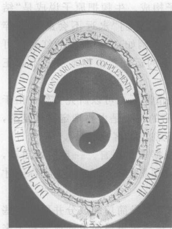

*图 14.15 玻尔的族徽。中间的圆形图案是古代中国的太极图。太极图上面的拉丁文铭文是“相反相成”。玻尔理论的深刻的哲学家，用这种方式承认了貌似对立的东西之间的和谐，这种和谐反复出现在古老东方的教诲中：一切自然和人文现象的实质在于互补的对立面的动态互动。*

> 当说到原子时，语言只能像在诗中那样用。诗人也是不太关心描述事实的，更关心的是创造形象。
> ——玻尔
>
> 对于那些看来最简单的问题，我们将倾向于要么不给出任何回答，要么给出这样的回答，这种回答乍看之下使人更想起一种奇怪的教义问答，而不是物理科学的那种直截了当的肯定语句。例如，如果问电子的位置是否保持不变，我们必须说“不”；再问电子的位置是否随时间变化，我们又必须说“不”；再问电子是否在运动，我们还必须说“不”；佛陀在被问到一个人在死后的状态时就是这样回答的；但是这样的回答不是 17 世纪和 18 世纪的科学传统熟悉的那种回答。
> ——奥本海默

## 14.5 朝向一个后牛顿世界观

在科学上，人类现在已经进入后牛顿时代一个多世纪了；但是在哲学上，我们现在在何处尚不清楚。今天我们的“哲学取向”是什么（参看第 1.1 节中所引梅勒的话）？让我们回忆牛顿世界观的四个主要特征（第 5 章）：

**原子论** 基本的实在由原子构成。牛顿把原子说成是“结实、有重量、坚硬、不可入的粒子”，它们“永远不会磨损或碎裂”。气味、颜色等只是一些名字。例如，一块餐巾的红颜色也可归结为餐巾中和观察者体内原子的运动。事物本身并不真正是红的。

**客观性** 在没有人类影响的情况下也可以研究自然。由于一切事情都是原子引起的，而原子的行为是由物理定律规定的，因此实在并不依赖于人。科学研究这种“客观实在”。

**可预言性** 未来完全可以根据现在预言。一旦初始启动，钟表式的宇宙的全部演化进程都是精确规定的，直到你刚才挠鼻子的动作。

**分析** 科学依靠把现象分解为其实成的成分并研究这些成分而进步。因此我们可以通过理解宇宙最简单的成分粒子来理解宇宙。

现代物理学否认所有这四条牛顿世界观的原则。

**原子论** 原子论首先和电磁场相抵触，电磁场是物理实在，但并不是由原子构成的。物质世界是由物质场构成的，但是物质场肯定不是由原子构成的。事实上，实物粒子仅仅是物质场的量子或能量增量。原子远不是结实、坚硬、不可入的，而完全是空的，仅仅由场构成。它们的静止质量是这些场能量的后果。原子远不是永不磨损或碎裂的，而是可以湮没的。虽然能量是不会毁灭的，实物却可以毁灭和产生。原子不是传统意义上的像豌豆（极小的豌豆）一样的小东西。原子的属性依赖于它的环境。笛卡儿曾主张，第二位的属性（如餐巾的红色）是依赖于观察者的第一位的实在的。量子理论把这个次序颠倒过来，把宏观探测器看成是原子的实验依存条件。

**客观性** 客观性的观念在伽利略和牛顿的时代对科学进步至关重要。在他们之后的三个世纪里，科学家们相信自然现象在原则上可以脱离它们周围的环境。至今从爱因斯坦的相对论起，测量过程就开始打扰这种相信完全客观性是可能的信念。精确说明时间和空间这些量是如何测量的已变得至关重要。在量子理论中，整个实验环境对确定待研究物体的属性变得至关重要。这并不使物理学变成主观的，因为每个使用同样的设备的观察者仍然看到同样的结果，但是它的确使微观系统实在与它们的实验环境不可分离。

**可预言性** 同样的原因不再导致同样的后果。单次放射性衰变、一个光子的闪光以及决定一个人的遗传特征的化学反应，都是不可预言的量子事件。宇宙并不像一个可以预言的钟。但是，即使单次事件不能预言，统计图样是可以预言的。

**分析** 分析过程假定有可能把一个现象分成几部分而不改变它。这对宏观体系很有用，但是量子理论与这个观念矛盾。例如，把太阳系分解为太阳、行星系，等等，研究一部分与其他每一部分相互作用的方式，是很有用的。但是量子理论说我们永远不能把一个微观体系看成是由可以分离的各部分构成的。不能把电子双缝实验分拆成电子一方加上双缝仪器一方，因为电子是部分由仪器确定的。虽然即使金星不存在的活火星也仍然是火星，但是一个电子在其环境改变时其本性就会改变。量子纠缠是最突出的例子。两个纠缠的粒子的联结是如此紧密，哪怕把它们想成独立的粒子也是不可能的。存在一种微观的整体性，在我们的宏观眼睛里它是不明显的。

简短地说，这个量子世界观断言，宇宙是由非实物的场构成的，微观世界的粒子仅仅是这些场的量子化的增量，未来是根本不可预言的，自然是深深地相互联结和不可分的。它一点也不像一部机器。

尽管后牛顿物理学已存在一个多世纪了，但是我们还没有看到一个后牛顿世界观，一个力学的（机械的）宇宙的譬喻说法继续深深地、也许是不恰当地影响着我们的文化对物理实在的看法。我们将会建立一个科学上准确的并且是人性的世界观，它能在后牛顿时代支撑我们吗？人类还只是刚刚触及这个任务的皮毛。它也许是当代世界的急迫问题。

> 它动。
> 它不动。
> 它远。
> 它近。
> 它在这一切之内。
> 它在这一切之外。
> ——奥义书，印度宗教经典，大约公元前 1000 年
>
> 我们永远能够想象别的 [错误] 理论——像由牛顿力学支配的使人烦的粒子世界。
> ——温伯格，物理学家，引自 *Dreams of a Final Theory*
>
> 不存在——不存在！我怎么能看到这些在我跟前的小不点，像我看到那把小匙那样清楚明白呢？
> ——卢瑟福，1915 年前后，一次在餐桌上被问到他是否相信原子核真正存在时。
>
> 在一个没有物理学家的宇宙中做一个原子是不幸的事……物理学家是原子认识原子的一种方法。
> ——G. Wald，生物学家
>
> 他们（玻尔和海森伯）的理论结构并没有延伸到及固定在基础的微观时空实在上。相反，它回到及固定在具体意义的实在上，这种实在构成社会生活的基础。
> ——H. Stapp，物理学家
>
> 不知不觉……我们就把认知主体从我们力求理解的自然的领域内排除了。我们变成一个旁观者的角色，不属于这个世界，而通过这一手法这个世界就变成一个客观的世界。[我们的] 科学建立在客观化的基础上，依靠这个法，科学把自己同……对心灵的适当理解割裂开来。但是我相信，这是我们现在的思维方式需要修补的地方，也许得从东方的思想输血。
> ——薛定谔，引自 *Mind and Matter*
>
> 我不认为有一个独一无二的实在宇宙……即使物理学定律本身也可能在某种程度上依赖于观察者。
> ——霍金
>
> 我们在未知之岸上找到了一个奇怪的脚印。我们曾设计出一个接一个的深奥理论来说明它的来源。最终，我们成功地重建出留下个脚印的生物。喏，那正是我们自己的脚印。
> ——爱丁顿爵士，英国天文学家和物理学家

## 14.6 我们是怎么知道的？观察原子光谱

迄今为止，第 13 章和第 14 章已经讲了量子物理学的基本原理和它的重大意义。现在我们将研究量子物理学的也许是意义最重大的实际例子：原子的量子理论。我们首先要了解我们在实验上知道些什么，以及是怎么知道的。

已知最精确的科学测量是光谱仪做的，这种仪器测量辐射的频率或波长。图 14.16 表示如何用光谱仪研究由一光源（如炽热发光的气体）发出的可见光辐射。光源发出的辐射经过一条狭缝后成为一束窄光束。这束光通过一个玻璃棱镜或其他能分离光束的不同频率（颜色）的器件。光束在从一种介质进入另一种介质（例如从空气进入玻璃）时会弯折。你也许曾注意过在池塘的水中发生的这个效应：部分浸在水中的物体在水面处似乎是弯折的。一个棱镜之所以能够分离一束光的频率，是因为在每一玻璃面上不同频率的光弯折的程度不同。在彩虹中也可以看到这种频率分离现象，这时每个雨点对太阳光起着一个小棱镜的作用。

光在从棱镜的远端射出时，已经分离为许多束光，每束光对应于原始光束中的一个频率。用一屏幕或照相底片截获所有这些光束并显示它们不同的颜色。每束光的频率或波长可以通过测量它在屏幕上的位置而确定。在这样一个实验中测得的频率的集合叫做发射这一辐射的辐射源的**谱**。

在电磁辐射的各个波段使用不同类型的光谱仪。例如，你可以把收音机看成是一台用来检测房间里的射电辐射的频率的频谱仪。光谱测量给出了大量的各种各样的信息。例如，在望远镜的目镜一端接一台光谱仪，天文学家就可以推断关于恒星和星系的质量、温度、运动、化学组成及其他属性的信息。我们关于微观世界的绝大部分数据来自光谱测量。

一团灼热发光的固体或液体，如白炽灯中加热到大约 $3 000\ ^\circ\text{C}$ 的金属灯丝，发射的是**连续谱**，它包含一段不间断的可见光频率，展成连续的色带。彩虹展示的便是太阳的连续光谱。但是令人惊奇的是，如果把一团稀薄的（压强低的）气体加热到发光，它发射的光谱将不是连续的。相反，它的光谱只有有限个精确的频率，每个频率在屏幕上显现为一条狭缝形状的光**谱线**（图 14.16）。这样的一组精确分离的频率叫做**线状谱**。图 14.17 表示一条连续谱和四种不同气体发出的四组线状谱。你可以看到，不同的气体的线状谱是不同的。由于每种气体有它自己的特征光谱，我们可以用光谱证认不同的气体。我们得知恒星的化学组成就是用这个方法。

加热是使气体**激发**（也就是使它发出辐射）的一种方法。大多数气体当其温度超过大约 $2 000\ ^\circ\text{C}$ 时就发光。火焰就是被加热的这种发光气体。太阳光来自太阳的可见表面上的灼热气体，其温度为 $5 500\ ^\circ\text{C}$。另一种激发气体的方法是让一个电流通过它。这个过程叫做**放电**，它产生了我们在氖管、汞汽灯和钠汽灯中看到的辉光、火花、闪电。可以用装有稀薄气体的放电管研究气体的光谱（图 14.18）。

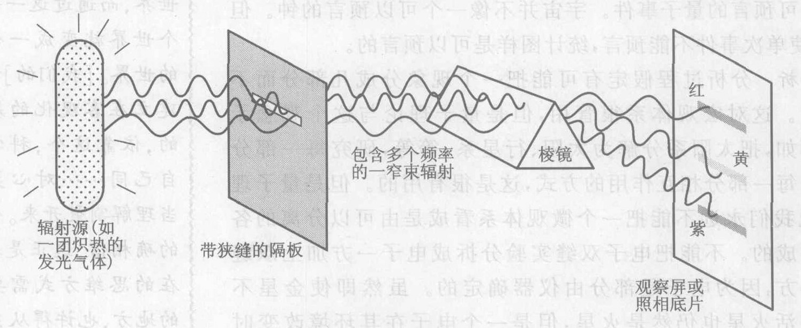

*图 14.16 一种光谱仪。它用来研究光源发出的光。*

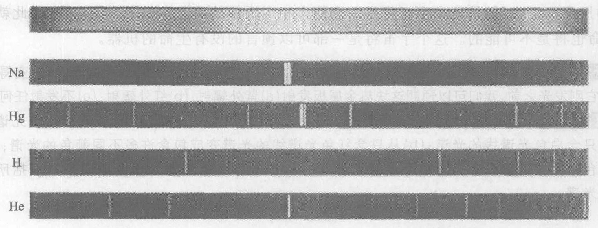

*图 14.17 白炽灯产生的连续谱和几种不同的气体产生的线状谱：钠 (Na)、汞 (Hg)、氢 (H) 和氦 (He)。频率从左向右增高。*

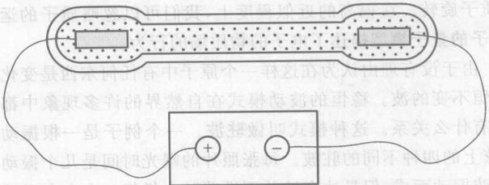

*图 14.18 装有一种稀薄气体的放电管。当放电管两端的电极上有足够多的电荷时，电极就强迫电子离开负电极从而放电。随着这些电子穿过放电管向正电极运动，它们会和气体中的原子碰撞而使原子激发。这些气体原子然后发射具有其特征频率的光子，失去其激发能。*

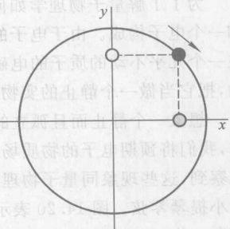

*图 14.19 一个公转的电子（黑色小圆）可以看成是同时做两个振动：从下面看它好像是沿 $x$ 轴振动（灰色小圆），从侧面看它好像是沿 $y$ 轴振动（白色小圆）。*

**我们怎么解释观察到的光谱？** 我们知道，任何物质被加热时，它的原子的无规则运动的动能增加。希腊人的原子模型不能提供一个理由，说明这为什么会使物质发光，但原子的行星系模型却能：原子里的亚原子粒子是带电的；这些带电粒子在物质被加热时运动得更加强烈；这些振动和沿轨道转动的带电粒子应当发出电磁辐射。但是为什么气体发出线状光谱而不是连续光谱呢？为什么只发射某些波长，而不是一切波长呢？是什么决定了发射光波的波长？原子的行星系模型提供不了这方面的线索。

原子的行星系模型还有一个更突出的问题。图 14.19 说明，一个公转的电子可以看成同时在两个方向上振动。但是我们知道（第 9 章），振动的带电粒子产生辐射，因此一个公转的电子应当一直辐射电磁能！但观测表明，原子并不一直在辐射。更糟的是，如果一个电子真的在一直辐射，它就必定会不断损失能量，这会使它沿着半径越来越小的螺线掉到原子核里去，停止转动。因此，原子的行星系模型预言原子将会崩溃！准是有什么东西错了。

> 从经典（牛顿）观点看，根本不可能有原子。
> ——费曼

我们能够想象一个宇宙，在这个宇宙中，牛顿物理学一直到最小的尺度也是正确的，但是这个宇宙将是一个使人厌烦地死寂的地方。原子不能存在，因此就没有化学，生命也将是不可能的。这个宇宙将是一部可以预言的没有生命的机器。

> **概念检查 7**
> 你可能已经注意到，随着你加热一块金属板，它先发出暗红色的光；然后变得更亮、更白。在它刚发光之前，我们可以预期这块热金属板发射 (a) 紫外辐射；(b) 红外辐射；(c) 不发射任何辐射。
>
> **概念检查 8**
> 随着上题中的热金属板从暗红变白，它的光谱将 (a) 从只含红色光谱线的光谱变成只含白色光谱线的光谱；(b) 从只含红色光谱线的光谱变成包含许多不同颜色的光谱；(c) 从暗的红色连续光谱变成明亮的白色连续光谱；(d) 从昏暗的红色连续光谱变成明亮的包括所有颜色的连续光谱。

## 14.7 原子的量子理论

为了了解量子物理学如何描述原子，我们将考察最简单的原子——氢原子，它由一个质子和一个电子构成。由于电子的质量大约只有质子质量的 1/2 000，因而它几乎包揽了全部运动，在一个几乎不动的质子的电磁场中绕质子旋转。在很高的近似程度上，我们可以忽略质子的运动，把它当做一个静止的实物粒子。原子的量子模型描述了电子的物质场的行为。

想象一个静止而且孤立的氢原子。由于没有理由认为在这样一个原子中有什么东西是变化的，我们将预期电子的物质场是某种稳恒不变的波。稳恒的波动模式在自然界的许多现象中都观察到，这些现象量子物理学通常没什么关系。这种模式叫**驻波**。一个例子是一根振动的小提琴琴弦。图 14.20 表示一根琴弦上的四种不同的驻波。每张照片的曝光时间是几个振动周期。你可以看到，每种驻波都由整根弦振动而成，但是这个波并没有沿着弦向任何一个方向运动（也就是说，波峰和波谷的位置是固定的）。但无论如何，弦在任何特定时刻都呈一个波动形状。例如，图 14.21 表示图 14.20 中第三个驻波用短时间曝光拍的一个快照。弦的每个端点都必须是一个振动位移为零的节点。在这两个固定端点之间，弦的振动分成一个、两个、三个和四个区段，如图 14.20 中相继各张照片所示。注意只有若干个驻波才适合这根弦，这些驻波在这根弦的长度上产生整数个（1、2、3 等）区段的振动。

我们预期，一个孤立的氢原子中电子的物质场会生成这样的一个物质波驻波。但是这个驻波不是像图 14.20 中那样沿着一根直线伸展；相反，氢原子的球形使物质波成为一个圆形驻波，如图 14.22(a) 所示。正像图 14.20 中的驻波必须刚好适合弦的长度一样，物质波驻波必须刚好环绕原子核整教个区段。图 14.22(a) 表示一个符合这个要求的物质波，而图 14.22(b) 的波则不符合这个要求，因而是不允许的。

对氢原子的薛定谔方程的详细数学研究得出了关于电子物质场的允许的驻波图样的精确预言。最终发现有些这样的允许图样，正像图 14.20 中的弦有好几个允许的驻波图样一样。这些图样中的每一个都代表氢原子中的电子的一个可能的物质场。图 14.23 直观表示一些氢原子**量子态**。图中所示的 10 个图样中的每一个都是电子的物质场的一个允许的驻波图样。越暗的区域的强度越大（波动的振幅越大⑨），不涂阴影的区域是强度低或强度为零的区域。要摹想完整的三维图样，只要在想象中把二维绕图中的竖直 $z$ 轴旋转便得。

> ⑨ 如第 13 章所述，一个波的强度是其振幅的平方。

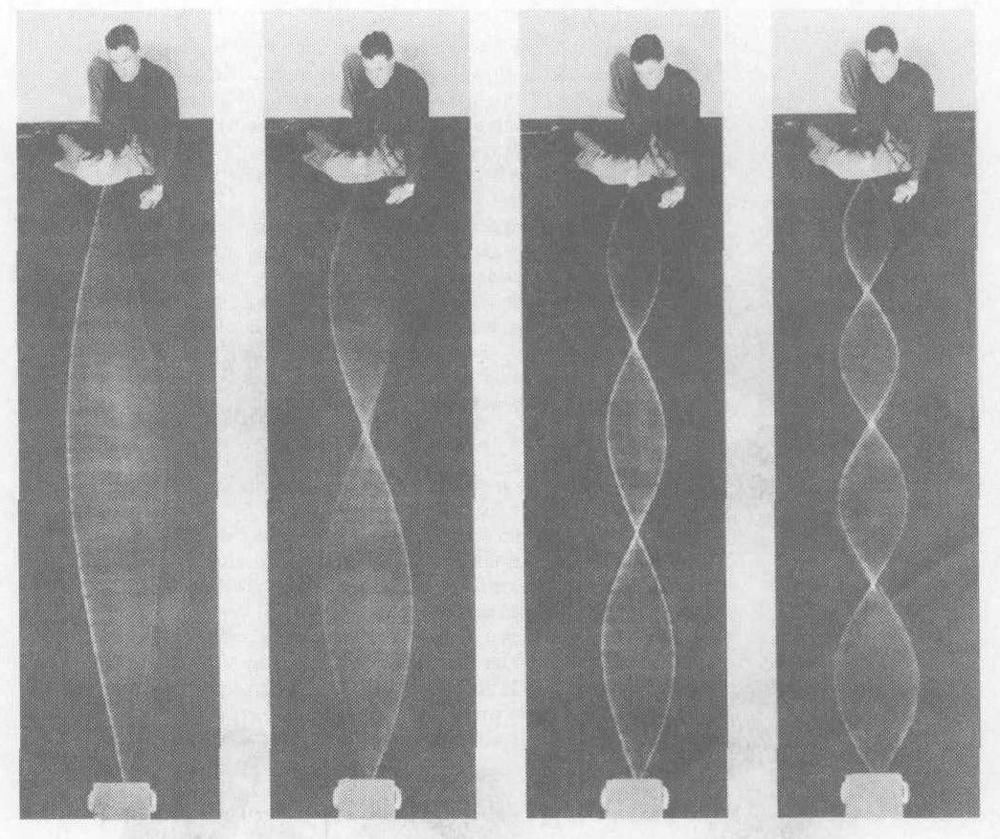

*图 14.20 一条弦上的四个驻波。在第一种振动方式下，弦以一整段振动；在第二种振动方式下，弦分成两段振动，中间有一个不动点；如此等等。*

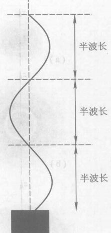

*图 14.21 图 14.20 中第三个驻波在某一时刻的“快照”*

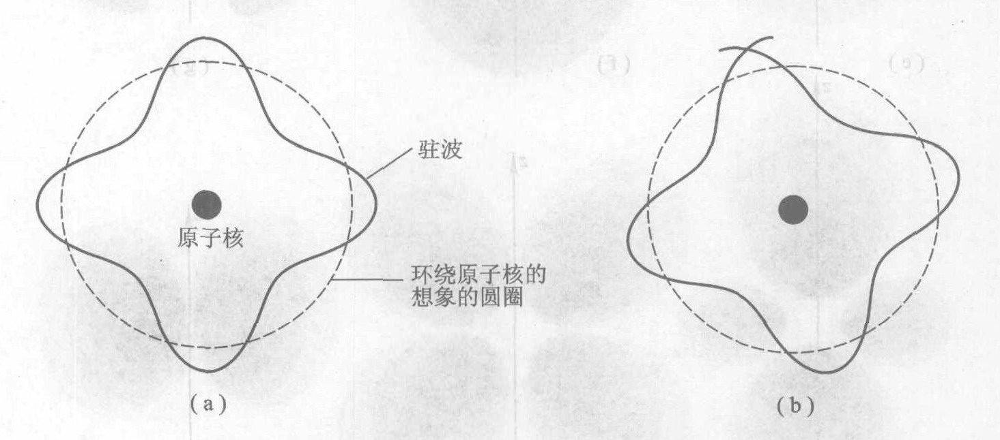

*图 14.22 (a)一个刚好合适环绕原子核的驻波；(b)一个不合适的驻波，它的波长比(a)中的波长长一点。*

我们知道（第 13 章），如果我们测量一个电子的位置，我们就不会发现它是一个延展的波，而将发现它是某特定的一点（有一个不大的不确定性范围 $\Delta x$）。图 14.23 中物质波的强度给出了观察到电子在不同地点的概率。例如，量子态 (a) 所占的体积比任何别的态都小。在这个量子态中，容易找到电子的地方是离原子核近的地方，并且从原子核向外在不同方向上（向上、向下、向左等）找到电子的难易程度相同。态 (b) 的体积更大一些，因此和态 (a) 中的电子相比，更可能发现电子的地方是离原子核更远的地方。态 (b) 在从原子核向外的中途有一个有趣的间隙，表示在这个距离上永远找不到电子。有趣的是，处于态 (b) 中的电子可以在这个距离之内或之外找到，但却永远不能在这个距离上找到。一个电子怎么能在这个距离之内，有时在这个距离之外，却总不在这个距离上呢？

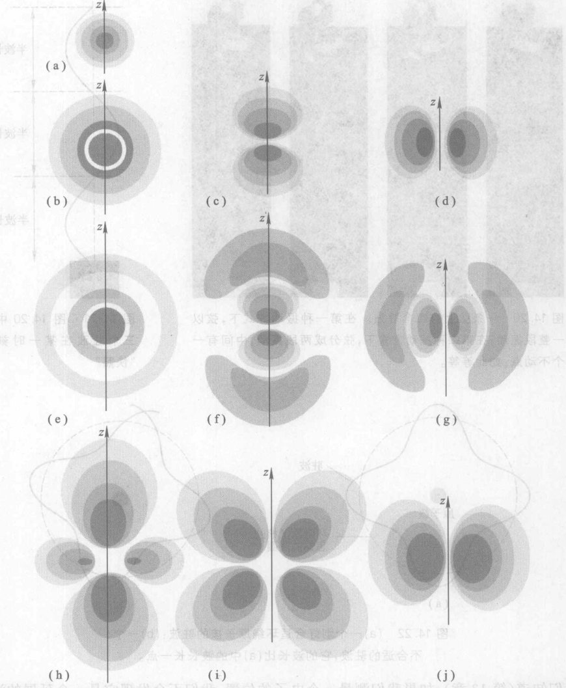

*图 14.23 微观世界的图样。氢原子中的 10 种不同的允许的物质波或量子态。如果测量电子的位置，在颜色越深的区域（那里物质场的强度更强）找到电子的概率越大。态 (e) 的体积更大。可能发现电子的地方离原子核更远，并且这个态有两条间隙，在那里找不到电子。不像 (a)、(b) 和 (e) 这几个态，图中剩下的七个量子态在每个方向上是不同的。态 (d) 的形状像是一只环绕 $z$ 轴的肥厚的面包圈，它使我们想起原子的行星系模型。态 (c) 的形状是沿 $z$ 轴的一个哑铃（两个球）。它分成两部分，在两部分之间找不到电子。*

图 14.23 表示的是自然界最简单的原子——氢原子的 10 个最常见的量子态。还有更多的许多量子态没有在图中画出。每个图样代表氢原子可以存在的一个状态。⑩ 电子多于一个的原子有更复杂的量子态，不过这些量子态都可从求解适合于这种特定原子的薛定谔方程并要求物质波驻波刚好适合于环绕原子核而求得。

由于氢原子的每个量子态都是一个具有特定频率的驻波，并且一个波的频率与它的能量相联系，我们预期每个量子态只有一一个特定的能量。这就是说，图 14.23 中每个态的能量没有量子不确定性。从这个图我们甚至可以对每个量子态的能级（能量的大小）作出合理的推测。因为质子作用于电子的力是吸引力，要把电子向外拖到离原子核更远的地方就必须做功。因此电子离开原子核越远，电子的电磁能就越大。这正像重力的势能一样；因为地球对一块石头施加一个吸引力，把石头向上举时其重力势能增大。因此把原子核包得最紧的、最小的物质场应当能量最低。由图判断，这是量子态 (a)。这个量子态叫做**基态**。它是电子离原子核最近的态。我们还记得，如果宇宙服从牛顿物理学，原子将会塌陷，因为绕原子核旋转的电子将会把它们的能量辐射掉，落到原子核上去。与此相反，氢原子有一个最小的量子态即量子态 (a)。原子处于这个态时不能辐射能量，仅仅是因为没有能量更低的量子态了。一个处于基态的原子就像一个滚到山底的球，它不能滚得更低了。量子物理学阻止了原子塌缩！

别的量子态叫傲**激发态**，因为它们的能量比基态高。每个量子态的精确能量值可以用薛定谔方程算出。图 14.24 表示最低的五个精确能量值（但是没有显示实际数值）。如所预料，态 (a) 的能量最低，标为 $E_1$。态 (b)、(c) 和 (d) 的能量刚好相同，标为 $E_2$。图 14.23 中剩下的六个量子态的能量刚好也相同，标为 $E_3$。图中还示出两个更高的能级 $E_4$ 和 $E_5$，它们对应于未画出的量子态。注意随着能量增高能级越来越密。一个像图 14.24 这样的能级图是微观世界的量子或“数字化”本性的最好的例子：氢原子中的一个电子只能取这些能量值，而不是别的值，例如，它不能取其值在 $E_1$ 和 $E_2$ 之间的中间值的能量。

每一个这样的量子态代表一个不发生变化的孤立氢原子。如果有什么变化的话又会怎样呢？例如，如果一个原子发射辐射，会发生什么情况？我们知道，辐射是量子化的，只能以名为光子的能量包的形式观察到。一个原子辐射时，必须发射至少一个能量量子——一个光子。这意味着原子的能量必须失去至少这个数量的能量。由于原子的能量是量子化的，因此它必须从某一能级跳变到另一能级。

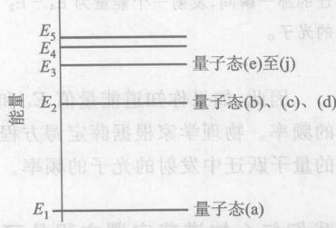

*图 14.24 氢原子中的电子的最低五条能级。若以 J 为单位，这些原子能级是很小的：最下面两条能级的能量差 $E_2-E_1$ 只有 $1.6 \times 10^{-18}\ \text{J}$。*

> 你当然一定懂得，玻尔，整个量子跃迁的想法必将引向胡说八道……如果受这些该死的量子跃迁，我真后悔我曾和量子理论发生过任何关系。
> ——薛定谔，和玻尔的一次谈话

⑩ 氢原子也可以存在于两个或多个这些允许的量子态的组合中。

着，它开始时处于某一激发态，而且必须过渡到一个能量更低的量子态。这种过渡必须在瞬间完成，因为氢原子不允许取任何与图 14.24 中画出的能级不同的能量值。原子的这种从一个量子态到另一个量子态的瞬时过渡叫做**量子跃迁**。图 14.25 是通常表示跃迁的方法。跃迁用能级图上的一个箭头表示，从初始能级伸到末能级。这个图表示一个原子从 $E_4$ 能级过渡到 $E_3$ 能级，还指出发射出一个光子，把能量带走。在图 14.23 中，想象一个能量为 $E_4$ 的量子态（未画出）突然消失，而代之以量子态 (b)、(c) 或 (d)。氢原子确实像这样从一种图样跳到另一种图样。

现在我们可以理解原子光谱以及原子发射辐射的过程了。原子在量子跃迁到一条更低的能级时产生辐射，在这个过程中生成并发射一个光子。还记得（第 13 章）一个光子的能量是 $hf$，其中 $h$ 是普朗克常量，$f$ 是光子的频率。由于能量守恒，被发射的光子的能量 $hf$ 必须等于量子跃迁中的能量差：即 $hf = \text{高能态的能量} - \text{低能态的能量}$。

因此，如果你知道能量值 $E_4$ 和 $E_3$，就可以求出在这两个能级之间的量子跃迁中发射的光子的频率。物理学家根据薛定谔方程可以算出氢原子的能级，进而求出各对能级之间的每一种可能的量子跃迁中发射的光子的频率。

**我们怎么知道薛定谔方程是可靠的？** 图 14.26 在一张能级图上画出了氢原子的最低五条能级之间可能发生的 10 个向下的量子跃迁。由于光子的能量等于原子的能量变化，代表每个量子跃迁的箭头的长度与这次量子跃迁中发射的辐射的频率成正比。因此一个氢原子通过从能级 $E_2, E_3, E_4$ 或 $E_5$ 向下量子跃迁到一条更低的能级，可以发射 10 个不同的频率。图 14.27 定量地表示这 10 个频率。由于薛定谔方程决定了能级，它也决定了这些频率。

用光谱仪测量氢原子气体的光谱，发现其频率正是图 14.27 中所示的由量子理论所预言的频率。薛定谔方程最初赢得声誉，正是因为薛定谔表明这个方程能够精确预言这些频率。只举一个例子，薛定谔方程预言，氢原子从能级 $E_2$ 量子跃迁到能级 $E_1$ 所发射的光子的波长（可从频率算出）为 $1.215\ 68 \times 10^{-7}$ m。实际测量表明它是 $1.215\ 66 \times 10^{-7}$ m 加减一个小误差。还有许许多别的氢光谱线，它们都可以用薛定谔方程预言出来。频率和波长的理论预言值和实测值也达到了类似的一致程度。物理学家知道，任何一个方程，若能预言到六位数字，那么它准有些东西是对的。

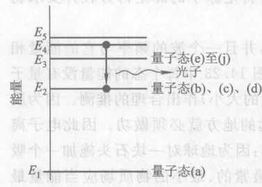

*图 14.25 从一个量子态到另一个量子态的量子跃迁示意图。在发生量子跃迁的那一瞬间，发射一个能量为 $E_4 - E_3$ 的光子。*

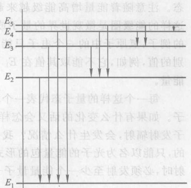

*图 14.26 氢原子的最低五条能级之间可能发生的向下量子跃迁。*

> **化学没有哪一部分的基本理论是不依赖量子原理的。**
> ——化学家泡林

*图 14.27 图 14.26 中所示的量子跃迁发射的光子的频率*

> **概念检查 9**
> 图 14.23(h) 中的量子态在三维空间中的形状的最佳描述是 (a) 一个哑铃；(b) 一个面包圈；(c) 两个指向不同方向的哑铃；(d) 两个指向不同方向的面包圈；(e) 一个哑铃和一个面包圈。
>
> **概念检查 10**
> 图 14.26 所示的氢原子的五条能级之间的 10 种量子跃迁当中，产生频率最高的光子的量子跃迁是 (a) $E_5$ 到 $E_4$；(b) $E_5$ 到 $E_1$；(c) $E_5$ 到 $E_2$；(d) $E_2$ 到 $E_1$。
>
> **概念检查 11**
> 在氢原子的最低六条能级之间的量子跃迁能够产生多少个不同的频率？(a) 6 个；(b) 5 个；(c) 10 个；(d) 14 个；(e) 15 个。

---

> **概念检查答案**
>
> 1. (a)。
> 2. (b)。
> 3. (a) 和 (d)。
> 4. 要决定电子穿过哪条缝只用一个探测器，因此附加的探测器是多余的，此时的物质场和一个探测器时的物质场完全相同，(d)。
> 5. 2 自乘 10 次（换句话说，$2^{10}$）是 1 024，(f)。
> 6. (a) 和 (d)。
> 7. 根据第 9 章，烧热但不发光的物体发出的辐射的类型是红外辐射，(b)。
> 8. 固体发射连续光谱，(d)。
> 9. (e)。
> 10. (b)。
> 11. 除了图 14.26 中所示的 10 种量子跃迁外，另有从能级 $E_6$ 到另外五条能级的量子跃迁。因此总数是 15 种，(e)。

### 关键概念

下述概念的定义出现在所标页码的本书正文页面上和书末的按拼音排序的术语词汇中。我们将它们按出现先后顺序排列在这里，你可以用这个清单复习本章内容。

*   量子不确定性 322
*   波包 322
*   不确定原理 323
*   可能值范围 324
*   波包的塌缩 328
*   测量 328
*   量子非局域性 331
*   量子纠缠 331
*   非局域性原理 334
*   量子计算机 335
*   比特 335
*   量子比特 335
*   关联的实在 337
*   牛顿世界观 338
*   量子世界观 339
*   光谱仪 339
*   谱 340
*   连续谱 340
*   线状谱 340
*   激发 340
*   放电 340
*   原子的量子模型 342
*   驻波 342
*   氢原子量子态 342
*   能级 345
*   基态 345
*   激发态 345
*   能级图 345
*   量子跃迁 346
*   原子发射辐射 346

### 复习题

**不确定原理**

1.  图 14.2 中的物质场所代表的粒子具有精确的位置吗？具有精确的速度吗？
2.  图 14.3 中哪个波包有更精确的位置？哪个波包有更精确的速度？
3.  不确定原理要求一个粒子的 $\Delta x$ 必须大于某个规定值吗？它是怎么说的？
4.  一个垒球的量子不确定性是大还是小？为什么？

**观察的效应**

5.  对一个粒子的波包进行一次位置测量后，这个波包发生什么变化？
6.  单个微观粒子的物质场有可能延展到宏观尺寸如几米或更大的距离上吗？举个例子。
7.  举个例子表明，接通探测器的电源就会使一粒子的物质场发生量子跃迁。
8.  非局域效应是什么意思？

**量子纠缠**

9.  什么是纠缠？
10. 贝耳的原理关于纠缠粒子是怎么说的？
11. Rarity-Tapster 实验说明了什么？
12. 贝耳的原理所提出的非局域联结能够瞬间传送能量吗？
13. 根据量子理论的标准解释，以下哪些是自然的本性：可预言性、离开很远的粒子之间的非局域联结、关联的实在。
14. 叙述牛顿世界观的至少两个与量子物理学矛盾的基本观念。

**观察原子光谱**

15. 光谱仪中的棱镜是做什么用的？
16. 光谱仪中的狭缝是做什么用的？
17. 光谱仪测量的究竟是什么？
18. 叙述激发气体的两种方法。
19. 当我们激发一种气体时，它的原子发生什么了？
20. 叙述原子的行星系模型与我们对原子光谱的观察不一致的一个方面。

**原子的量子理论**

21. 原子的行星系模型真的遇到的一个严重问题。是什么问题？
22. 什么是驻波？
23. 驻波与原子的量子理论有什么关系？
24. 描述图 14.23 中某些量子态的三维形状。
25. 图 14.23 中的一个量子态究竟代表什么？
26. 图 14.23 中哪个量子态的能量最低？
27. 图 14.23 中哪个量子态是基态？哪些是激发态？
28. 考虑图 14.23 中任何一个量子态。在这个量子态中，电子可以预言的能量吗？有可以预言的位置吗？有可以预言的速度吗？
29. 叙述原子产生辐射的过程。
30. 原子中的一个量子跃迁是什么意思？
31. 图 14.26 中所示的那些量子跃迁中一共发射多少个不同的频率？

### 思考题

**不确定原理**

1.  按可能值范围从大到小排列以下的东西：质子、葡萄糖分子 $C_6H_{12}O_6$、氦原子、垒球、电子、尘粒、水分子、汽车。
2.  如果普朗克常量比它现有的值小，这对不确定原理有什么影响？如果它是零呢？
3.  如果普朗克常量是 $1\ \text{J/Hz}$ 而不是 $6.6 \times 10^{-34}\ \text{J/Hz}$，对你有什么影响？
4.  如果普朗克常量比它现有的值小，这会影响原子的大小吗？有怎样的影响？
5.  想几种与量子理论无关的一般场合，在这些场合中观察会改变实在。民意测验将是一个例子吗？观看月亮将是一个例子吗？
6.  测量干扰被测物体的一个常见例子是用一只温度计测量一盆水的温度。它对水的温度有什么干扰？这是一个量子效应吗？
7.  如果对图 14.2 的波包进行一次精确的速度测量，波包会发生什么事？测量怎样影响 $\Delta x$ 和 $\Delta v$？
8.  你的朋友扔一枚硬币，但是把它遮住，使得你们中间没人说得出它是正面朝上还是反面朝上。这时你说该正面朝上的机会（概率）是多大？假设设他把手挪开，你看见了它是反面朝上。现在你应该给正面朝上指定多大的概率？概率的这一突然变化和量子理论有任何关系吗？
9.  图 14.8(a) 示出在双缝实验中物质波在屏幕上生成的图样。这是电子好撞击屏幕之前还是之后的单个电子的物质场？当电子撞上屏幕时，物质场发生什么变化？
10. 如果 Rarity-Tapster 实验中的光子的行为像通常的牛顿粒子一样，图 14.12 中的曲线图将是什么样子？
11. 假设 Rarity-Tapster 实验可以用电子代替光子来做。实验结果仍将是图 14.12 那样的干涉图样吗？

**量子实在和后牛顿世界观**

12. 电子在正常情况下没有精确的位置。你怎样使电子具有一个（相当）精确的位置？
13. 电子在正常情况下没有精确的速度。你怎样使电子具有一个（相当）精确的速度？
14. 举出自然的非牛顿性质的几个一般方面。
15. 举几个具体实验，这些实验表明自然界是非牛顿式的。
16. 举几个具体实验，这些实验表明自然界是牛顿式的。

**观察原子光谱**

17. 从哪些方面说，你的收音机是一具光谱仪？
18. 一部收音机与正文中说的光谱仪在哪些方面不同？
19. 为什么光谱仪中用一条狭缝（图 14.16）而不用比如像一个圆孔？
20. 为什么当不同的材料燃烧时，它们常常产生不同颜色的火焰？
21. 有什么办法测定一种燃烧物质的化学成分？
22. 如果你比较两盏钠汽灯发出的光谱，它们相同吗？如果你比较一盏钠汽灯和一盏汞汽灯的光谱呢？

**原子的量子理论**

23. 用惯性的语言解释为什么电子在氢原子中承担了几乎全部运动。
24. 假设图 14.20 中的弦长是 2 m，这条弦能够在波长为 2.1 m 的驻波中振动吗？若波长为 1.9 m 呢？0.5 m 呢？加以解释。
25. 描述图 14.23(f) 所示的量子态的三维形状。
26. 描述图 14.23(g) 所示的量子态的三维形状。
27. 描述图 14.23(i) 所示的量子态的三维形状。
28. 描述图 14.23(j) 所示的量子态的三维形状。
29. 如果能够分别在一个原子的激发态和基态对原子的质量进行非常精确的测量，将会发现任何差别吗？（提示：记住 $E=mc^2$。）
30. 当原子发射一个光子时，原子的质量有没有变化？（提示：记住 $E=mc^2$。）
31. 在图 14.26 所示的氢原子的五条能级之间的 10 种量子跃迁中，哪个跃迁产生的光子的频率最低？
32. 在图 14.26 中，是从 $E_5$ 到 $E_4$ 的量子跃迁还是从 $E_2$ 到 $E_1$ 的量子跃迁产生的光子的频率更高？这两个光子哪一个的波长更长？
33. 在图 14.26 中，下面这些量子跃迁哪一个产生的光子的频率最高：是 $E_4$ 到 $E_3$, $E_4$ 到 $E_3$, 到 $E_2$, 还是 $E_2$ 到 $E_1$？哪一个产生的波长最长？
34. 图 14.17 中描绘的四条氢光谱线的光波最低的和氢原子的第二条能级 $E_2$ 的四个能量最低的跃迁精确地一致。这四条光谱线中的哪三条画在图 14.27 中？

### 习题

**不确定原理**

1.  一个电子 ($m_e=9.1 \times 10^{-31}$ kg) 的速度不确定量为 $\Delta v = 1\ \text{m/s}$。它的位置不确定量必定是多大？用 mm 作单位表示你的答案。
2.  一个质子 ($m_p=1.7 \times 10^{-27}$ kg) 的速度不确定量为 $\Delta v = 1\ \text{m/s}$。它的位置不确定量必定是多大？用 mm 作单位表示你的答案。如果你做了上题，比较两个答案。
3.  作出估计。基态氢原子中的电子处于一个球内，球的直径大约是 $10^{-10}$ m。电子的质量大约是 $10^{-30}$ kg。用这个数据和海森伯不确定原理估计电子的速度。（提示：在基态，电子的速度应当大致等于其速度不确定量，换句话说，$\Delta v \approx v$。见第 14.1 节末尾的讨论。）它是光速的多少分之一？

**原子的量子理论**

4.  氢原子的最低两条能级之间的能量差 $E_2-E_1$（图 14.24）为 $16 \times 10^{-19}\ \text{J}$。求氢原子从态 2 跃迁到 1 时发射的光子的频率。它在光谱的哪个波段（图 9.5）？
5.  氢原子的第二条能级与第三条能级之间的能量差 $E_3-E_2$（图 14.24）为 $3 \times 10^{-19}\ \text{J}$。求氢原子从态 3 跃迁到态 2 时发射的光子的频率。它在光谱的哪个波段（图 9.5）？
6.  从前两题给出的信息，求氢原子的第三条能级与第一条能级之间的能量差 $E_3-E_1$。求氢原子从态 3 跃迁到态 1 时发射的光子的频率。它在光谱的哪个波段？