# 第五篇 原子的内部：原子核之火、太阳之火

---

# 第 15 章 原子核和放射性：一种新力

> 我希望在人们学会同邻居和平共处之前，不要发现如何释放镭内部的能量的方法。
> ——卢瑟福，1915年

科学扩展人类认识的一个方面是扩展人类能够看到的距离尺度。前科学的文化能够认识肉眼能看见的，小到最小的尘埃粒子 ($10^{-5}\text{ m}$)，大到一个人在地球上能看到的距离 (100 km, 或 $10^5\text{ m}$)。今天，望远镜已把我们的认识能力扩展到距离约为 $10^{26}\text{ m}$ 的可观察的宇宙的边界，而显微镜和巨型加速器则探测到小至原子 (大小为 $10^{-10}\text{ m}$)、原子核 ($10^{-14}\text{ m}$) 和亚原子粒子 ($10^{-19}\text{ m}$ 甚至更小)。

原子核是本章和下一章的主角。虽然原子核似乎和人类操心的东西离得很远，但是技术已经开发了原子核的巨大力量。力量永远既有危险又带来机会。要由大家来判定使用得是否明智。因此，我们学习原子核物理学，并不只是因为它的知识价值，而且还因为你我必须了解如何有益地和非破坏性地使用这种强有力的知识。

本章研究原子核的结构和称为放射性衰变的核反应；下一章研究另外两种核反应，聚变和裂变。第 15.1 节讨论原子核里的作用力，第 15.2 节研究原子核的能量，这个题目对我们进一步讨论原子核物理学是很关键的。然后我们叙述放射性衰变的物理学 (第 15.3 节)，包括半衰期概念 (第 15.4 节)。随后两节研究两个与放射性有关的文化和社会题目：放射性年代测定方法及其对地球历史的意义 (第 15.5 节)，和人体受放射性照射的后果 (第 15.6 节)。第 15.7 节是第 15.6 节的扩充，更一般地探讨技术风险问题。

**我们怎么知道物质的新高能状态？** 图 11.23 是两个铅原子以接近光速的速度相碰撞的一幅模拟“快照”。这幅图画的是碰撞后 $6 \times 10^{-18}\text{ s}$ 的原子核，白色的是质子和中子 (两个铅核的残骸)，两个原子核残骸之间的较暗的东西是几种夸克粒子 (质子和中子的成分)。这是对一次真实实验的模拟，这次实验是 2000 年在瑞士的日内瓦进行的，有来自 20 多个国家的科学家参加。这次实验复现了并且证实了理论预言的存在于大爆炸后大约 $10\ \mu\text{s}$ 的“夸克-胶子浆”的存在。①

*① 有许多人，甚至包括某几个美国总统，都把 “nuclear (原子核的)” 这个词的英文读音读错了。它应当是 “nuc-le-ar”，而不是 “nuc-u-lar”。*

在这种新的物态中，夸克粒子被释放出来自由漫游而不是被束缚在更复杂的粒子如质子或中子中。更多的细节见下节和第 18 章。

> **概念检查 1** 参看图 5.16 (第 5 章)，原子核物理学应当位于哪个区域中？(a) 广义相对论；(b) 牛顿物理学；(c) 狭义相对论；(d) 禁区；(e) 以上哪一个也不是。

---

## 15.1 核力：第三种胶

科学家就像侦探一样，从观察到的线索形成假说和推论。

我们在第 8 章看到，原子核只占据一个很小的空间，跨度约为 $10^{-14}\text{ m}$，它由质子和中子构成。② 图 15.1 画了一个典型的原子核。这幅图作了高度的简化。最重要的是，它忽略了每个质子和每个中子的量子不确定性，它们大致充满整个原子核。此外，质子和中子并不像图 15.1 中画的小球。每个质子和中子由三个小的 (也许是点状的)“夸克”构成 (第 18 章)，而夸克则由核力场构成。但无论如何，图 15.1 这样的图对引导我们的思维还是有用的。

由于质子带电相互排斥而中子是电中性的，这些原子核粒子之间必须有一个吸引力，原子核才不会因电力排斥而炸开。这个吸引力必须足够强，才能克服相距仅 $10^{-15}\text{ m}$ (两个质子中心之间的距离) 的两个质子之间的巨大斥力。万有引力永远是吸的，它能把原子核保持在一起吗？你可能会猜到，万有引力负担不了这一工作，因为质子和中子的质量很小，使得原子核粒子之间的万有引力与电力相比太小了。我们还记得，日常生活中感受到的力可以归结为两种基本的力：万有引力和电力。既然万有引力太小了，而电力是原子核内部唯一的排斥力，我们推得一定存在第三种基本的力，它把原子核维系在一起。

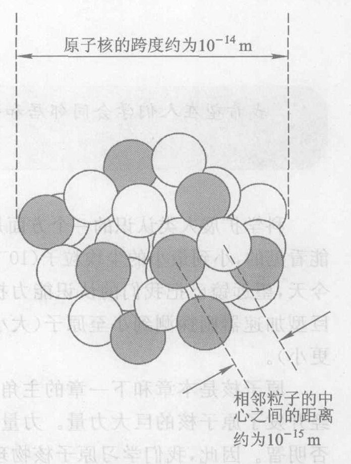

*图 15.1 原子核示意图。黑球代表质子，白球代表中子。这样的图把亚原子粒子画成好像是通常的牛顿客体，思考是有帮助的，但是它们被高度简化了。自然界在这个层级上是量子化的，不能用任何图画恰当地表示出来。*

这个第三种力必须使两个质子在相距大约 $10^{-15}\text{ m}$ 时彼此强烈吸引。它也必须使两个中子彼此吸引并且使中子和质子相互吸引，否则中子就会掉出来。但是尽管这个力在间隔短的情况下非常强，它却不能伸展很远。它肯定不能从一个原子核伸展到固体中相邻的原子核 (大约相距 $10^{-10}\text{ m}$)。因为要是它能，一切原子核就会结成一团。事实上，我们可以假设 (记住这是一个侦探故事) 这个力仅足以把最大的原子核保持在一起那么远，因为要是它能延伸得更远，就可能会有更大的原子核，在自然界中就会观察到。实验表明，这个“**强作用力**”或简称**强力**力仅仅延伸到 $10^{-15}\text{ m}$ 的距离，这大约是相邻的原子核粒子之间的距离 (图 15.1)。

因此一共有三种把各种东西粘合在一起的胶。在亚原子层级上，强作用力使原子核保持在一起。在原子层级上，电力使轨道电子同它们的原子核结合在一起，使原子结合成分子，并且使固体和液体维系在一起。而在天文学层级上，则是万有引力使行星、恒星、太阳系和星系保持在一起，并且跨过星系团，决定宇宙的形状 (第 11 章)。

就我们迄今知道的，自然界中每一个力都可以归结为这三种力加上另一种“**弱作用核力**”或简称**弱作用力**的作用，弱作用力在放射性 $\beta$ 衰变中起作用 (第 15.3 节)。这四种基本力一起决定了我们的宇宙的结构。我们不知道为什么它们具有它们现在的性质，这些性质使宇宙成为如此有趣和多样的处所。如果这些力中任何一个力的性质有所不同，情况将会怎样？例如，如果强作用力的力程长一些，或强度弱一些，将会怎样？如果电力或万有引力比它们现在实际的强一些或弱一些，又会怎样？如果有三种电荷，或者只有一种电荷，情况又会怎样？如果万有引力是相互排斥的而不是相互吸引的呢？如果四个基本力的任何一个改变很多，那么宇宙将会有很大的不同，而生命可能就不存在。

*② 原子核的直径范围从 $3 \times 10^{-15}\text{ m}$ (氢) 到 $20 \times 10^{-15}\text{ m}$ (铀)。*

> **概念检查 2** 假设强作用力的力程比实际的值长一些。这对元素的清单 (周期表) 会有什么影响？(a) 周期表将会比现在的更短一些；(b) 周期表将会比现在的更长一些；(c) 周期表将不会改变。

---

## 15.2 核能和核结构

由于强作用力是四种基本力中最强的一种，伴随单个核过程的能量变化要比由电力支配的化学过程的能量变化大得多。这就是核武器爆炸和核反应堆从每千克材料得到巨大的能量并且从原子核发出的电磁辐射处于高能 $\gamma$ 射线波段的原因。

核能为什么一定很大，有一个基本的量子理论的原因。由于强作用力的力程很短，任何原子核粒子都被束缚在一个很小的空间区域里。不确定原理告诉我们，位置这样高度确定的任何粒子的速率一定高度不确定，从而其平均速率必定很大 (第 14.3 节)，因此它的动能很大。定量地说，我们求得，任何被束缚在小到 $10^{-14}\text{ m}$ 的区域里的原子核粒子的平均速率至少是 $3 \times 10^7\text{ m/s}$，或光速的大约 10%。在这样高的速率下，相对论现象开始变得重要。这表示在图 15.2 中，这个图是图 5.16 的更详细的版本。在量子不确定性禁止的区域边缘上的 $x$ 点标出一个典型的原子核的大小和核粒子的速率。

类似的论据也适用于原子：由于原子中的一个电子的物质场 (图 14.23) 的跨度约为 $10^{-10}\text{ m}$，不确定原理意味着，原子内的电子必须以大约 0.5% 的光速运动。这在图 15.2 中用 $y$ 点标出。

既然原子核是由部分组成的，我们猜想有可能改变它们的结构。任何改变原子核结构的过程叫做**核反应**。中世纪叫金炼金术士的化学家——巫师喜欢的做的一件事，就是试图把一种化学元素变成另一种，特别是把铅变成金。他们不掌握的化学知识还是他们的巫术都没有生成任何金子，但是他们的梦想现在看来是可以做到的。虽然巫术无济于事，化学反应却是一条正确的路。问题仅在于，通常的分子化学能太低了，无法完成这一工作。今天，核化学家把一种元素变成另一种当成了例行公事。把铅变成金甚至也是可能的，不过你不能用这个方法赚钱，因为所需的能量的花费比金子贵得多。

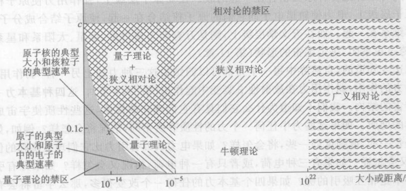

*图 15.2 牛顿物理学、相对论物理学和量子物理学各自的领域。数字和边界只是代表性的，各理论的领域之间并无明确的界限。如图所示，原子物理学坐落在量子理论的领域内，而原子核物理学则坐落在相对论量子理论的领域内。*

核反应有点像化学反应。一个原子的化学性质是由其轨道电子的数目决定的，也就是说是，由这个原子所属的元素的原子序数决定的。各种元素及其原子序数在书后所附的元素周期表中列出。原子序数对核反应也是重要的，因为它是原子核中质子的数目。但是中子对决定原子核的性质也很重要。质子数和中子数都完全相同的原子核属于同一种**核素**，质子数相同同中子数不同的原子核称为**同位素**。正如一种特定元素的原子在化学反应中的性质完全相同，一种特定同位素的原子核在核反应中的性质完全相同。

同位素的编号方法只比元素的编号方法稍微复杂一点。一种同位素由其**原子序数** (它所含的质子数) 及其**原子量** (它所含的质子和中子的总数即原子核中粒子的总数) 来标志。由于质子和中子的质量大致相同，整个原子核的质量近似与原子量成正比。这正是它叫做原子量的原因。

例如，碳元素的原子序数为 6，因此每个碳原子核有 6 个质子。因为有些碳原子核含 6 个中子，另一些含 7 个中子，还有的含 8 个中子，所以碳一共有三种同位素。这三种同位素的化学性质相同，但核性质不同。它们的原子量分别为 12, 13 和 14。我们标记具体的同位素的方法是在它们的化学符号前面加上其原子序数为下标及其原子量为上标。例如，碳的三种同位素的符号是 $^{12}_6\text{C}$，$^{13}_6\text{C}$ 和 $^{14}_6\text{C}$。但是我们常常不写原子序数，因为化学符号实际上已经标志了它，而只写 $^{12}\text{C}$，$^{13}\text{C}$ 和 $^{14}\text{C}$，读作碳 12、碳 13、碳 14。

> **概念检查 3** 化学反应中起作用的是哪种基本力？(a) 万有引力；(b) 电磁力；(c) 摩擦力；(d) 核力。

> **概念检查 4** 两种原子核 $^3\text{H}$ 和 $^3\text{He}$ 的 (a) 原子序数相同但原子量不同；(b) 原子序数不同，原子量也不同；(c) 原子序数不同而原子量相同；(d) 原子序数相同，原子量也相同。

---

## 15.3 放射性衰变：原子核的自发蜕变

1896 年，法国物理学家亨利·贝可勒尔做完了一周的研究工作，把一些含铀化合物放在抽屉里去过周末。出于偶然，他也把一块未经曝光的照相底版放在同一抽屉里。当他下星期回来时，他惊奇地发现，尽管保存在一个暗抽屉里，照相底版却感光了。一个不那么认真的科学家可能会耸耸肩，把坏了的底版扔掉完事，但是贝可勒尔怀疑铀和曝光有联系。他发现只要他把铀放在感光底版附近，他就能重复这个结果。显然，铀辐射出某种东西，它能使感光板曝光。这个现象叫做“**放射性**”。贝可勒尔使铀经受各种化学处理，但是这并未使所产生的效应有什么变化。因此放射性与化学性质没有什么关系。科学首次接触到了原子核，尽管原子核还没被发现。

两年以后，波兰物理学家玛丽·居里 (图 15.3) 和她的丈夫皮埃尔·居里在沥青铀矿 (一种柏油状的黑色物质) 中探测到放射性。这并不使他们奇怪，因为已经知道沥青铀矿是含铀的矿石；使他们惊奇的是他们发现，它的辐射比纯铀的辐射更强，尽管沥青铀矿所含的铀浓度很低。显然，沥青铀矿中含有某种别的物质，它的放射性比铀强得多。于是居里夫妇承担了从 8 吨沥青铀矿中化学分离出这种物质的艰巨任务。这包括极其大量的探测工作，因为新物质及其化学性质当时还不知道。他们最后得到了一点点 (仅 0.01 g) 粉末状的物质。它像铀一样自发辐射，但是它发出的射线比相同质量的铀发出的要强得多。由于它的强有力的辐射，他们把这种新元素命名为“**镭**” (Radium, 辐射的元素之意)。

> 在所有的名人中，居里夫人是唯一一个没有被盛名腐蚀的。
> ——爱因斯坦，1934年居里夫人逝世时的悼词

从发现铀和镭以来，科学家已经发现了许多放射性物质。原子序数大于 83 (铋) 的每种核素都是放射性的，较轻的元素也有许多放射性同位素。例如，碳的三种同位素中，$^{14}\text{C}$ 是放射性的，但是 $^{12}\text{C}$ 和 $^{13}\text{C}$ 不是。实验 (图 15.4) 表明，放射性物质发出三种不同的射线，分别叫做 $\alpha$ (读阿尔法)、$\beta$ (读贝塔) 和 $\gamma$ (读伽马) 射线。这些射线对电场或磁场反应的方式表明，$\alpha$ 射线带正电，$\beta$ 射线带负电，$\gamma$ 射线不带电。这些射线来自各种同位素的原子核。

更细致的考察表明，大多数原子核是**稳定的**，意思是除非受到外部影响的干扰，这些原子核将永远保持不变。但是有些原子核是**不稳定的**或**放射性的**，即使它们没有受到外界的干扰，它们最终也会改变它们的结构。这种自发的结构改变叫做**放射性衰变**。有两种主要的放射性衰变。③ 在 **$\alpha$ 衰变**中，一个放射性原子核吐出一个叫做 **$\alpha$ 粒子**的粒子。$\alpha$ 粒子与氦原子核 $^4_2\text{He}$ 完全相同——两个质子和两个中子被强作用力结合在一起 (图 15.5)。如果 $\alpha$ 粒子射到空气中，和空气分子的碰撞将立即它慢下来，然后它将从邻近的原子夺来两个电子，变成正常的氦原子。

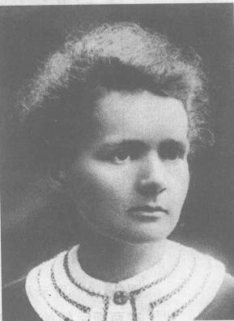

*图 15.3 玛丽·居里与皮埃尔·居里和亨利·贝可勒尔分享了 1903 年诺贝尔物理学奖。皮埃尔于 1906 年滑倒在马车轮下立即被压死。居里夫人继续进行她的研究工作，不顾世俗流行的对妇女从事理科学的偏见，坚信自信能够成功。她的确成功了：她是任在巴黎大学 (索尔本) 执教的第一位女教授，她是第一个两次获得诺贝尔奖的人，第 96 号元素是以她的名字命名的。她的女儿伊伦也成了一位核科学家，获得 1935 年诺贝尔化学奖。居里夫人的最重要贡献之一是有助于使科学的大门对别的女青年敞开。1934 年居里夫人患了白内障，手指也受到伤害，并死于辐射引起的白血病。伊伦·居里也死于白血病。*

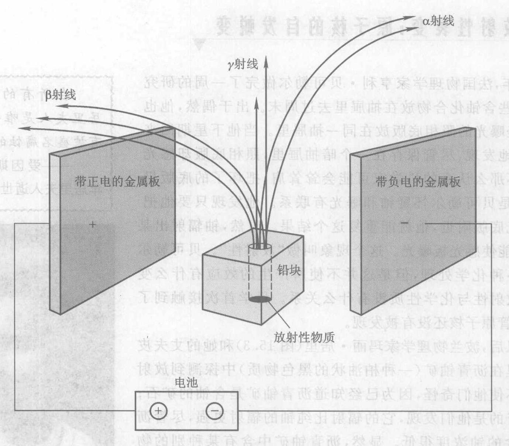

*图 15.4 显示放射性物质能够发射三种不同的射线 ($\alpha, \beta$ 和 $\gamma$) 的实验。两块金属板在两板之间的空间里产生一个电场。实验表明，由于 $\alpha$ 射线被带负电的板吸引及被带正电的板排斥，$\alpha$ 射线带有正电荷。同样，$\beta$ 射线带负电，$\gamma$ 射线不带电。*

> **现在，镭使人特别感兴趣的是它的射线强度，它比铀射线强几百万倍。镭射线的各种效应有助于几种疾病的治疗……特别重要的是癌症的治疗……镭比金子要珍贵千万倍。**
> ——居里夫人，1922 年在 Vassar 学院的一次讲话

在 **$\beta$ 衰变**中，一个放射性原子核吐出一个电子 (图 15.6)。这使人感到奇怪，因为原子核中并没有电子！我们将在稍后再澄清这个谜。如果 $\beta$ 射线射到空气中，电子就和空气分子碰撞而慢下来，被邻近的某个原子俘获，变成一个普通的轨道电子。但是当它是由一个放射性原子核发射的，我们就把它叫做 $\beta$ 粒子，以表明它的产生过程。

*③ 除了这里讨论的两种放射性衰变以外，还有别的几种不太常见的放射性衰变，如正电子衰变，变电子俘获等。*

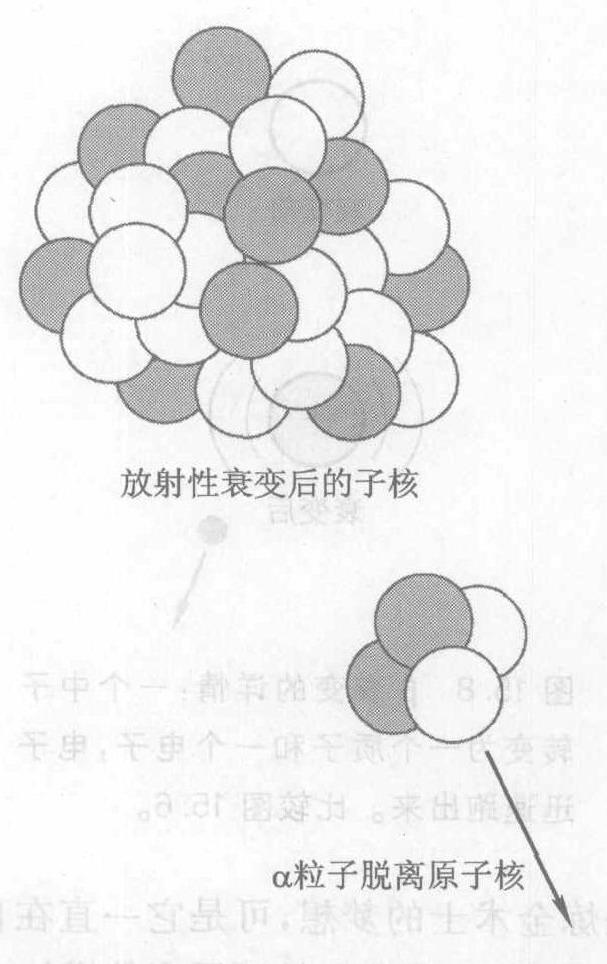

*图 15.5 $\alpha$ 衰变*

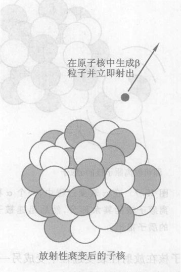

*图 15.6 $\beta$ 衰变*

大多数放射性核素通过这两个过程之一衰变。例如，铀和镭发射 $\alpha$ 粒子，而 $^{14}\text{C}$ 发射 $\beta$ 粒子。由于 $\alpha$ 衰变和 $\beta$ 衰变对原子核有强烈的扰动，两个过程都使原子核发射电磁辐射，因此大多数衰变都伴随着放出一个 **$\gamma$ 射线光子**。用量子物理学的语言来说，原子核量子跃迁到一个更稳定、能量更低的态，在这个过程中发射一个 $\gamma$ 射线光子，就像原子在量子跃迁到一个低能量子态时发射一个可见光光子 (第 14.7 节) 一样。虽然由于 $\alpha$ 射线和 $\beta$ 射线是从原子核向外发射出来的，常常也把它们叫做辐射，不过它们并不是电磁辐射。相反，它们是实物的 $\alpha$ 粒子和 $\beta$ 粒子流。而 $\gamma$ 射线则是电磁辐射的一种形式。

放射性的发生，是由于某些原子核结合得并不是很牢。不稳定性的一个根源仅仅是因为原子核太大：一个很大的原子核的日子很不好过，因为每个质子在受到仅仅仅最邻近的几个邻居原子核的短程核力吸引而约束在一起的同时，却受到其他许多质子的长程电力排斥要被推出原子核。这是一切比铋 (原子序数 83) 重的核素都是放射性核素的原因。

在 $\alpha$ 衰变中，原子核的一小部分被推出原子核 (图 15.7)。由于 $\alpha$ 粒子 $^4_2\text{He}$ 是自然界最稳定的结构之一，因此从原子核脱落下来的这种质子和中子的组合。一旦脱离了原子核，$\alpha$ 粒子就被残留的原子核 (叫做**子核**) 中质子的电力有力地推开。

$\alpha$ 衰变作为不稳定核的一种瓦解方式人们还是可以预料到的，$\beta$ 衰变则更使人惊奇。它是由弱作用力引起的，弱作用力实际上使一个中子自发转变为一个质子，同时产生一个高能电子 (图 15.8)。一个原子核中发生这个过程时，这个核就失去一个中子，得到一个质子。由于电子的质量很小，不确定原理 (第 14 章) 告诉我们，在这个过程中产生的电子的位置不确定值很大——比整个原子核大得多。换句话说，电子不再被束缚在原子核里，带着高能射出。这就是 $\beta$ 粒子的来源。④

*④ 第 6.5 节里讲过，在 $\beta$ 衰变时还有一个叫中微子的小粒子从原子核飞出。*

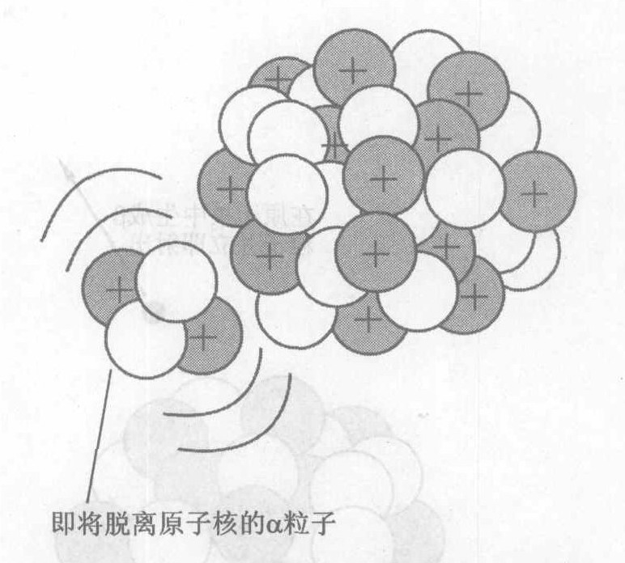

*图 15.7 在 $\alpha$ 衰变过程中，一个 $\alpha$ 粒子脱离原子核的其余部分，然后迅速被子核中的质子推出。*

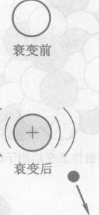

*图 15.8 $\beta$ 衰变的详情：一个中子转变为一个质子和一个电子，电子迅速跑出来。比较图 15.6。*

原子核在放射性衰变过程中变成另一种核素。这是炼金术士的梦想，可是它一直在自发地发生！例如，当 $^{14}_6\text{C}$ 发生 $\beta$ 衰变时，它失去一个中子而得到一个质子，原子序数增加 1，而原子量则保持不变。于是产生的子核的原子序数为 7，原子量为 14，即 $^{14}_7\text{N}$。我们表示核反应的方法与表示其他过程的惯用方法相同：用一个箭头从初状态指向末状态。例如，$^{14}\text{C}$ 的 $\beta$ 衰变表示为
$$ ^{14}_6\text{C} \longrightarrow ^{14}_7\text{N} + \beta \text{粒子} $$
另一个例子是 $^{238}_{92}\text{U}$ 的 $\alpha$ 衰变。$\alpha$ 衰变使原子序数减少 2，从 92 变到 90 (钍)，原子量减少 4，因此这个核反应表示为
$$ ^{238}_{92}\text{U} \longrightarrow ^{234}_{90}\text{Th} + \alpha \text{粒子} $$
从能量的角度审视一个过程总是有启发的。在放射性衰变中发生什么能量转化？(暂停，想一想)…… $\alpha$ 粒子和 $\beta$ 粒子把微观动能 (热能) 带到原子核周围的环境中，而 $\gamma$ 光子则携带辐射能。这些能量来自放射性材料的原子核结构。于是宇宙损失了核能而得到了热能和辐射能：
$$ \text{核能} \longrightarrow \text{热能} + \text{辐射能} $$
放射性衰变像是一次滑坡，不过是由核力而不是由重力引起的。在一次滑坡中，重力把一座山丘的一部分向下拉，变成一个更稳定、更紧密的形态。滑坡将架空的土地的引力能变成滑坡时的动能，最终变成热能。在放射性衰变中，原子核里的力使一个不稳定的原子核中的质子和中子发生一次类似的自发“滑坡”，变成一个更稳定的形态，使原子核分崩离析而不是整体沉沦，在这个过程中，核能 (而不是引力能) 转化为热能及其他形式的能量。

几乎每种化学元素都有放射性同位素存在，或者可以在核反应堆或加速器中人工制造出来。因为它们的化学性质和同一元素的稳定同位素的化学性质完全相同，放射性同位素有许多医学的和其它的用途，对人类健康也有许多危险 (第 15.6 节)。放射性同位素的另一个重要应用是放射性年代测定 (第 15.5 节)。但是我们需要先讨论一下“半衰期”。

> **概念检查 5** 哪些基本力在核反应中起作用？(a) 万有引力；(b) 电磁力；(c) 摩擦力；(d) 强作用核力或弱作用核力。

> **概念检查 6** 放射性碘 ($^{131}_{53}\text{I}$) 的 $\beta$ 衰变的子核是 (a) $^{127}_{51}\text{Sb}$; (b) $^{132}_{53}\text{I}$; (c) $^{132}_{54}\text{Xe}$; (d) $^{131}_{55}\text{Cs}$; (e) $^{131}_{54}\text{Xe}$。

---

## 15.4 半衰期：一个原子核在何时衰变

量子理论的核心特征是，单个微观事件是不可预言的，但是这些事件的统计性质是可以预言的。这就像掷硬币：你不能预言一次投掷的结果，但是你可以预言在多次投掷中正面朝上的次数大致是 50%。掷硬币这样的宏观过程和微观过程之间的差异是，“大自然还是知道”硬币将怎样下落，你可以用牛顿物理学去预言掷硬币的结果，但是微观过程绝对是不可预言的。已知原子核的亚微观本性，那么放射性衰变是一种根本不可预言的事件，也就不足为奇了。它是自然界中量子不确定性的最显著的例子之一。

具体谈起，考虑一个铀原子核的 $\alpha$ 衰变。由于自然界对高度稳定的 $\alpha$ 粒子的偏好，你可以把一个像铀核这样的大原子核的表面想象成一些 $\alpha$ 粒子的集合，它们在表面附近漂浮着，既被强作用力吸向原子核，同时又受到原子核中质子的排斥 (图 15.9)。每个 $\alpha$ 粒子其实是一个量子物质场，和使电子具有量子性的物质场属于同一类。因此任何特定的 $\alpha$ 粒子都永远有一定的概率处于原子核之外，并且离原子核足够远，使得不再感受强作用力 (我们还记得强作用力是短程力)。这样一个 $\alpha$ 粒子将立即被所有质子的长程电力推出原子核。

由于量子不确定性，大自然只“知道”发射一个 $\alpha$ 粒子的概率，而不知道它将在何时被射出。一个特定的铀核可能在 1 秒钟内就衰变，也可能在 1 年内衰变，也可能在 200 亿年内才衰变。但是，若给大量铀核，就能够致预言在任何特定的一段时间内，它们有多少份额会衰变。这正像掷硬币：如果我们一次投出大量的硬币，我们可以预言统计结果，但是不能预言单次投掷的结果。

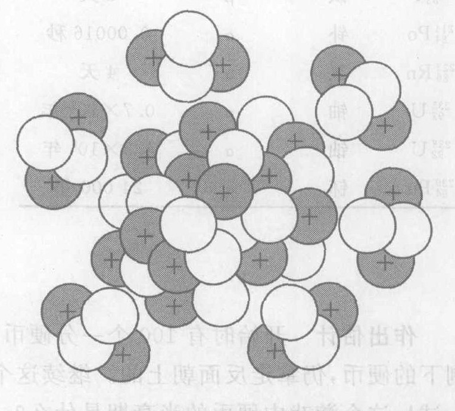

*图 15.9 把原子核的表面想象成一些 $\alpha$ 粒子的集合，这些 $\alpha$ 粒子在表面附近旁漂浮着。当这些 $\alpha$ 粒子之一偶然离原子核比较远，使它不再感受到它的邻居的短程强作用力对它的向内拉力时，它就立即被整个原子核中的所有的质子的长程电力推出原子核。*

对任何一种放射性核素，最重要的统计性质是**半衰期**，即大量的这种原子核的 50% 衰变掉的时间。由于有些放射性原子核是高度不稳定的而另一些则稳定程度高得多，不同的核素的半衰期很不相同。一个高度不稳定的原子核像一次即将发生的滑坡：正像预料中的滑坡可能马上就会发生一样，原子核可能马上就会衰变。而一个更稳定的原子核则可能要较长的时间才会衰变。表 15.1 给出几种放射性核素的半衰期。

例如，如果给你 1 g $^{14}\text{C}$，碳的这种放射性同位素的半衰期是 6000 年，经过 $\beta$ 衰变变为氮的稳定同位素 $^{14}\text{N}$。在 6000 年后，50% 的 $^{14}\text{C}$ 核将衰变掉，只会剩下 0.5 g $^{14}\text{C}$。另外半克已变成氮了。再过 6000 年，还剩下多少 $^{14}\text{C}$ 呢？(停一停……) 答案是半克的一半，或 0.25 g，因为半衰期统计法则仍然适用。6000 年是任何宏观数量的 $^{14}\text{C}$ 的 50% 发生衰变的时间。因此在 6000 年后还剩下 0.5 g 的 $^{14}\text{C}$，12 000 年后还有 0.25 g，18 000 年后还有 0.125 g，如此等等。这些值画在图 15.10 上，并连成光滑曲线，表示任何时刻剩下的数量。它是 $^{14}\text{C}$ 的衰变曲线。任何放射性核素的衰变曲线的形状和 $^{14}\text{C}$ 的衰变曲线完全相同，只是半衰期不同。因此图 15.10，如果用半衰期代替年作时间单位 (沿水平轴的最底下一行)，就可以用于任何放射性核素。

| 核素 | 元素名称 | 衰变过程 | 半衰期(近似) |
| :--- | :--- | :--- | :--- |
| $^{14}\text{C}$ | 碳 | $\beta$ | 6000 年 |
| $^{90}_{38}\text{Sr}$ | 锶 | $\beta$ | 30 年 |
| $^{131}_{53}\text{I}$ | 碘 | $\beta$ | 8 天 |
| $^{214}_{84}\text{Po}$ | 钋 | $\alpha$ | 0.00016 秒 |
| $^{222}_{86}\text{Rn}$ | 氡 | $\alpha$ | 4 天 |
| $^{235}_{92}\text{U}$ | 铀 | $\alpha$ | $0.7 \times 10^9$ 年 |
| $^{238}_{92}\text{U}$ | 铀 | $\alpha$ | $4.5 \times 10^9$ 年 |
| $^{239}_{94}\text{Pu}$ | 钚 | $\alpha$ | 24 000 年 |

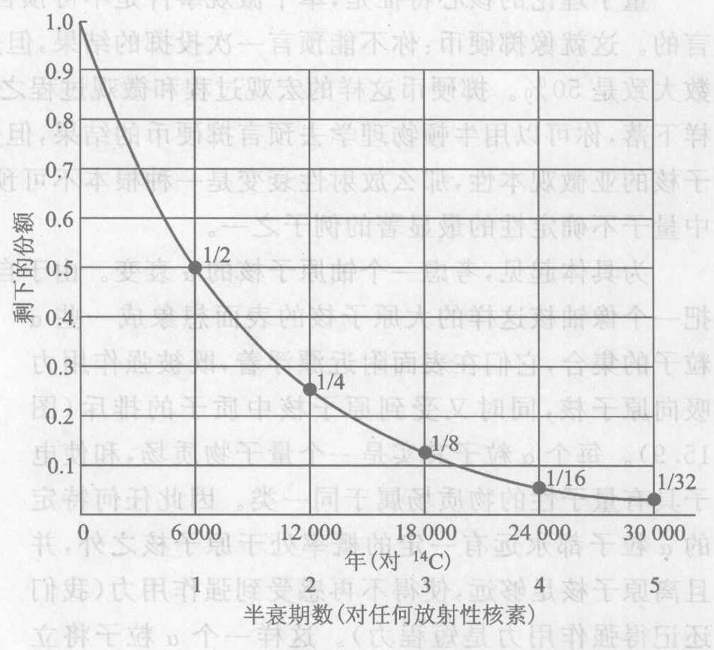

*图 15.10 $^{14}\text{C}$ (及任何其他放射性核素) 的放射性衰变曲线*

**作出估计** 开始时有 100 个一分硬币。假设把它们都扔出，并将反面朝上的都拿走。再扔剩下的硬币，仍拿走反面朝上的。继续这个过程，要只剩下 1 个硬币，你必须扔大约多少次？试一试！这个游戏中硬币的半衰期是什么？

> **概念检查 7** 假设一种放射性物质衰变剩只剩下 1/64。它已经过了几个半衰期？(a) 2; (b) 3; (c) 4; (d) 5; (e) 6; (f) 7。

---

## 15.5 放射性年代测定：我们开始出现于何时？

放射性衰变是一种计时的钟。如果知道一种物质已经衰变掉多少，就可以从衰变曲线 (图 15.10) 读出已经流逝多少时间。

**碳 14 年代测定**是放射性年代测定方法的一个例子。地球上的碳基本上全是两种稳定的同位素 $^{12}\text{C}$ 和 $^{13}\text{C}$ 中的一种。但是在地球的大气中，大约每 1 万亿个碳原子中有一个放射性同位素 $^{14}\text{C}$ 的原子。由于 $^{14}\text{C}$ 的半衰期只有 6000 年，而地球比 6000 年古老得多，你可能会感到奇怪，大气中怎么还会有 $^{14}\text{C}$。答案是，宇宙线 (即来自外层空间的高能粒子) 在不断补充它。宇宙线时不时进入大气，和大气中的氮碰撞，把氮核变成 $^{14}\text{C}$。

因为一切生物有机体中的碳最终来自大气，$^{14}\text{C}$ 在整个生物世界中也大致以与大气中相同的比例分布，即每 1 万亿个碳原子中有一个 $^{14}\text{C}$ 原子。这个比例一直维持到生物体死亡为止。然后 $^{14}\text{C}$ 逐渐衰变。测量残留的 $^{14}\text{C}$ 的数量，与稳定的碳比较，就可以测定生物体已经死了多长时间。例如，如果一把古老斧柄中的 $^{14}\text{C}$ 只有正常值的 1/4，那么做斧柄的树一定已经死了 12 000 年，即 $^{14}\text{C}$ 的两个半衰期。

这种测量能够确定有机体已经死了多长时间的条件是，知道有机体死时有多少 $^{14}\text{C}$。通常的假设是，$^{14}\text{C}$ 在大气中所占的份额在过去和现在基本上相同，因此一棵死了很久的树，它死时体内也是每 1 万亿个碳原子中有一个 $^{14}\text{C}$，与今天相同。但是这个假设正确吗？我们将在下页的“我们怎么知道”那一段讨论它。

随着要测年代的物体种类 (木器、岩石、化石等) 的不同，随着在任何特定的地点可用的放射性材料的不同，以及随着待测年代的不同，科学家使用各种不同的放射性衰变过程。例如，碳 14 年代测定方法只适用于生物起源的物体和至多 10 个 $^{14}\text{C}$ 半衰期的年代，对于更长的年代，留下来的 $^{14}\text{C}$ 数量是如此之少，已无法准确测量了。每种方法都是把一种放射性核素同另一种原子核进行比较，以确定放射性核素已经衰变了多少份额以及它已衰变了多长时间。表 15.2 列出了一些用来测定年代的放射性原子核和同它们作比较的原子核。

也有许多不用放射性的测定古老物件年代的方法，有的只提供相对年代，有的则提供高度准确的以年计的年代 (表 15.3)。其中有些方法依靠岩石的晶体结构或生物分子结构以稳定的速率在长时间内发生的变化，另一些则依靠简单地数树木的年轮数目和用深钻技术从格陵兰和南极取得的长圆柱体冰柱中的年沉积层数目。这些记录测得的年代长得令人惊讶：树木的年轮给出的年代可以长到 11 000 年 (借助于树木化石)，某些冰核则在时间中延伸了 50 万年。这么多的独立年代测定方法对所得到的年代提供了很严格的交叉核对。

表 15.4 表示了一些对地球上的生命演化更重要的地质年代。为了使这些数据在我们脑中有更深刻、更生动的印象，这个表的第三列把地球的历史压缩为一天的 24 小时。这样看这些年代会使我们大开眼界 (图 15.11)。在地球历史的大部分时间内，占统治地位的生命形式是简单的有机体如水藻。在这个 24 小时的钟上，复杂动物直到夜间很晚时才出现；最早的人类在午夜前 2 分钟才进化出来；而我们现代人类 (智人) 出现在午夜前 2 秒钟。人类的全部文明所占的时间只有 1 秒钟的几分之一。重大的人类活动，如农业的传布、人口爆炸、工业革命、信息革命等，在世界舞台上只占一瞬间。诚如梅勒所言 (第 1.1 节)，强烈追求的是加速。

> 我们所有的人的内心深处都有一种如饥似渴的愿望，想要知道我们的来历，想要知道我们是谁，我们来自何处。没有这种浸润心灵的知识，便是一片沉重的向往。不论你在生活中有由多大成就，总是一片空白，一种空虚和一种最使人不安的孤独感。
> —— A. Haley, 引自 Roots

> 我们将不停止探索……而我们一切探索的目的将是到达我们的出发地并且第一次了解这个地方。
> —— T. S. Eliot, 引自 Four Quartets

**表 15.2 用于放射性年代测定的核素**

| 核素 | 用来作比较的参照原子核 |
| :--- | :--- |
| $^{238}\text{U}$ | $^{206}\text{Pb}$ |
| $^{238}\text{U}$ | $^{234}\text{U}$ |
| $^{235}\text{U}$ | $^{207}\text{Pb}$ |
| $^{234}\text{U}$ | $^{230}\text{Th}$ |
| $^{187}\text{Re}$ | $^{187}\text{Os}$ |
| $^{147}\text{Sm}$ | $^{143}\text{Nd}$ |
| $^{87}\text{Rb}$ | $^{87}\text{Sr}$ |
| $^{40}\text{K}$ | $^{40}\text{Ar}$ |
| $^{14}\text{C}$ | C 的总量 |
| $^{10}\text{Be}$ | Be 的总量 |

**表 15.3 非放射性年代测定方法**

| 方法 | 被测的属性 |
| :--- | :--- |
| 树木年轮 | 年轮的数目 |
| 冰核 | 每年沉积的冰层的层数 |
| 岩石地层 | 沉积层的位置和成分 |
| 天文学方法 | 从陨石测量太阳系的年龄、从恒星的类型和位置测量恒星的年龄、从宇宙背景辐射测量宇宙的年龄 |
| 电子自旋共振 | 岩石中辐射引起的改变 |
| 热释发光 | 岩石中辐射引起的改变 |
| 光学自旋发光 | 岩石中辐射引起的改变 |
| 线粒体 DNA | DNA 分子中的突变个数 |
| 氨基酸分析 | 氨基酸中变化的数目 |
| Y 染色体 | Y 染色体的突变个数 |

> 我们的世界一转眼间就从一个野性的、自然的世界变成了一个这样的世界：人类在其中消费和糟蹋，并阻止了陆地上的净生物资源总量的估计 45% 的增长，而且用掉了一半以上的可再生淡水资源。
> —— P. Raven, 美国科学促进会会长演说，2002 年

**表 15.4 我们开始出现于何时：和我们人类有关的若干大致的年代**

| 事件 | 在现在多少年前 | 在一个 24 小时的钟上 |
| :--- | :--- | :--- |
| 太阳系起源 | 46.67 亿年 | |
| 地球起源 | 45.57 亿年 | 00:00 (午夜) |
| 生命 | | |
| 　　生命的化学证据 | 38 亿年 | 04:00 |
| 　　最早的化石 (单细胞生物) | 33 亿年 | 07:00 |
| 　　最早的脊椎动物 | 5 亿年 | 21:30 |
| 　　最早的爬虫类 | 3 亿年 | 22:30 |
| 　　最早的哺乳动物 | 2 亿年 | 23:00 |
| 　　最早的灵长目 | 6 000 万年 | 23:40 |
| 人类 | | 24:00 之前多少秒 |
| 　　最早的人科动物 | 600 万年 | 120 秒 |
| 　　人属 | 240 万年 | 48 秒 |
| 　　使用石器 | 200 万年 | 40 秒 |
| 　　直立人 | 190 万年 | 38 秒 |
| 　　智人 | 10 万年 | 2 秒 |
| 文化 | | |
| 　　发明农业 | 1 万年 | 0.2 秒 |
| 　　最早的城市，最早的文字 | 5 000 年 | 0.1 秒 |
| 　　科学时代 (哥白尼) | 500 年 | 0.01 秒 |
| 　　工业时代 | 250 年 | 0.004 秒 |
| 　　20 世纪 | 100 年 | 0.002 秒 |

*\* 注：直立行走 (不像现代的猿类) 的猿人，它们是人类的直接祖先。*

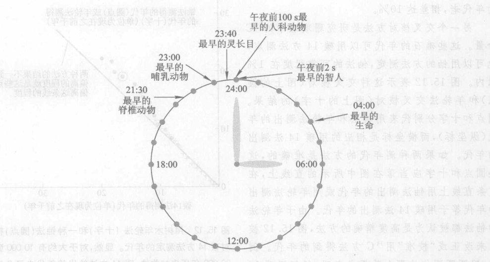

*图 15.11 这个“宇宙钟”把地球的历史压缩为 24 小时。智人直到午夜前 2 秒钟才出现。在这最后两秒钟里发生了许多事情：在午夜前 0.2 秒发明了农业，接着是城市、科学革命和工业革命。*

在过去，许多科学家和非科学家都相信地球只有几千岁。例如，开普勒曾说过 (第 1 章)“上帝等了 6 000 年”才等到一个第谷。布拉赫这样的观测者。这个估计是根据圣经旧约中所说的人的代数向后倒推出来的亚当和夏娃的年代。今天，认为地球的年龄只有几千年的假说与来自天文学、物理学、化学、地质学、生物学、古生物学、考古学和历史学的数据和原理相矛盾。当然，这不应当看成是对旧约的批评。按大多数学者的意见，旧约是一本哲理书而不是一本历史书。

**我们怎么知道放射性年代测定是可靠的？** 科学家不断用各种独立的方法交叉核对像表 15.4 中的那些结果。如果几种独立的方法 (既有基于放射性过程的，也有基于非放射性过程的) 给出的结果都一致，那么我们对所有这些结果的信任程度就增大了。因为如果它们刚好同样地错，那是使人奇怪的。科学家不愿意相信这样令人感到奇怪的巧合。由于这种交叉核对的习惯，科学已经织就一张“一致性之网”。

碳 14 年代测定给我们提供了一个很好的交叉核对的例子，因为我们有理由预期用碳 14 方法测出的年代有误差：如果撞击地球大气的宇宙线的数量过去与今天不同，那么那时生物体中 $^{14}\text{C}$ 的含量也会与现在不同。因此，科学家对碳 14 方法测出的年代进行了广泛的交叉核对。

一个交叉核对的方法是研究树木生长年轮中的 $^{14}\text{C}$。对于活着的树，只要数一数年轮的个数就可以知道它们的年龄 (直到 5 000 岁)；对于死了的不知道其年代的木材，把它年轮的生长图样 (由不同的天气引起的年轮厚度的变化) 与已测定了年代的标本的图样比配，可以定出它死于何年。古老到 10 000 年的树木标本的年代可以用这种方法测定。没有什么理由怀疑这样测得的年代，因为它们是由简单的数年轮的方法得到的。结果表明，较古老的年轮年代要比用碳 14 方法测得的年代老，相差达 10%。

另一个交叉核对方法是研究珊瑚礁中的 $^{14}\text{C}$ 含量。这些礁石的年代可以用碳 14 方法测定，也可以用铀的方法测定，铀法的可靠程度在 1% 以内。图 15.12 表示这种交叉核对 (图上的圆点) 和年轮法交叉核对 (图上的十字) 的结果。圆点和十字分别代表用铀法和年轮法测出的年代 (纵坐标)，而横坐标是相应的用碳 14 法测出的年代。如果两种测年年代的方法是准确的，这些圆点和十字应当落在图中所示的直线上，在这条直线上用轴法测出的年代或用年轮法测出的年代等于用碳 14 法测出的年代。由于年轮法和铀法都被认为是高度精确的方法，图 15.12 被用来改正或“校准”用 $^{14}\text{C}$ 方法得到的年代。例如，用圆圈围住的那个数据点表明，任何用碳 14 方法测出年代为 16 000 年的物体，其实际年代为 19 000 年。

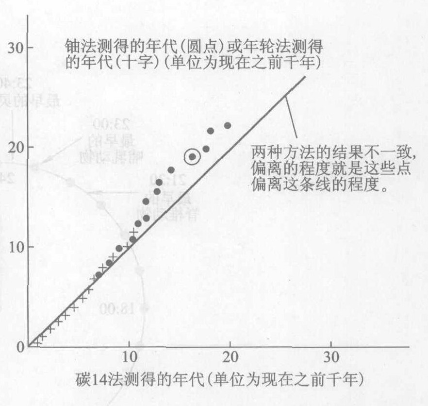

*图 15.12 用树木年轮法 (十字) 和一种铀法 (圆点) 核对碳 14 方法测定的年代。显然，对于大约有 10 000 到 20 000 年历史的物体，碳 14 方法给出的年代少了几天年。碳 14 方法和另外两种方法之间的最大偏差为 15%。*

> **概念检查 8** 一个人身体中，$^{14}\text{C}$ 和碳的总量的比例是 1 比 1 万亿。于是，在人死了 6 000 年之后的 $^{14}\text{C}$/C 比例是 (a) 2 比 1 万亿；(b) 1 比 1 万亿；(c) 1 比 2 万亿；(d) 1 比 4 万亿。

> **概念检查 9** 一个考古学家挖出一具骨骼，测出它的每 1 g 碳平均每分钟只有大约一次 $^{14}\text{C}$ 衰变。这是活的有机体中的衰变率的大约 10%。这个动物已经死了大约 (a) 6 000 年；(b) 13 000 年；(c) 19 000 年；(d) 60 000 年；(e) 600 年。

---

## 15.6 人体受致电离辐射照射

你房间的墙壁，你呼吸的空气，甚至你的身体都有放射性 (概念检查 8)。它们有什么后果？今天的后果与核时代的后果有什么不同吗？有什么风险？为了防止有害的后果，我们能够或应该做些什么事？

放射性物质发射的 $\alpha, \beta$ 和 $\gamma$ 粒子损害生物细胞。当这些高能粒子像小子弹⑤一样穿过一个细胞时，使这个细胞的一些分子电离 (即把电子从这个分子敲出来)，这就造成了损害。因为它们能使分子电离，$\alpha, \beta$ 和 $\gamma$ 射线叫做**致电离辐射**。由于 X 射线也有足够的能量使生物物质电离，它也被归入致电离辐射一类，虽然它并非来自原子核。电离改变了分子的化学结构。细胞的某些功能可能会改变，这取决于哪些分子发生了电离。最大的后果是对一个细胞的 DNA 分子的损害，因为 DNA 携带者其他细胞要继承的生物遗传信息。

测量致电离辐射对人体的伤害的单位叫**雷姆** (rem)。如果一个人受到致电离辐射，那么他接收的雷姆数便是受损害的细胞数目的直接度量。要对雷姆有些定量的概念，最好从具体例子来看。⑥ 例如，一个普通的美国人一年从各种来源接收的辐射量为 0.3 rem，或 300 毫雷姆 (mrem)。在另一极端，一次突然的 1000 rem 的剂量会使人在 30 天内死亡。

*⑤ 即使它们实际上只是量子场，当它们的场与观察屏或人体细胞相互作用时，$\alpha, \beta$ 和 $\gamma$ 也表现得像是粒子。*
*⑥ 雷姆的精确定义如下：对于 $\gamma$ 射线和 X 射线，1 rem 是这样的辐射量，它在 1 kg 生物物质内产生 0.01 J 被吸收的电离能。对于 $\alpha$ 射线和 $\beta$ 射线，雷姆的定义要稍微复杂一些。“希沃特 (Sv)” (1 Sv = 100 rem) 作为法定单位新近取代了雷姆。*

对人体的生物学伤害主要有三种。最直接而明显的是**辐射病**，由对骨髓中的红色造血细胞和肠道壁细胞的损害引起。一次突然的对全身的 25~100 rem 剂量的照射会在血液中造成短期的变化，这时人还可能不会注意到；100~300 rem 剂量引起典型的辐射病症状：发烧，呕吐，红细胞受到损害，白细胞和血小板减少，脱发，自发的出血以及少量的皮下出血；500 rem 的剂量造成 50% 的死亡率；1000 rem 使人在 30 天内死亡；而 10 000 rem 则使人在几小时内死亡。幸好，人们很少受到足以产生剧烈后果的大剂量照射。最严重的例子是 1945 年美国人丢在日本城市广岛和长崎的原子弹 (图 15.13) 和 1986 年在前苏联乌克兰的切尔诺贝利发生的核反应堆事故，以及 20 世纪 50 年代在前苏联的哈萨克斯坦进行的核武器试验。我们关于辐射对人体的伤害的大部分知识来自这些事件及辐射的医学应用。

辐射伤害的第二种形式是突变，即精细胞或卵细胞中的遗传物质 (DNA) 的可以遗传的变化。突变可以一代接一代地产生变异的后代。突变几乎全是有害的，但是偶尔也有一个突变是有益的，这个效应事实对生物进化至关重要。唯一观察到的人体中由辐射引起的突变事例发生在哈萨克斯坦的苏联核武器试验的下风地带。曝露在核试验带来的“放射性尘埃”(见下节) 中的个人的突变率比自然的突变率高 80%，他们的孩子 (在放射性尘埃沉降后出生) 的突变率比自然突变率高 50%。这些突变发生在部分体细胞或卵细胞的 DNA 中，就研究人员现在所能断定的，这些细胞不直接影响孩子们的身体特征。

伤害的第三种形式是普通的体细胞的癌变。在原子弹幸存者中观察到某些癌症的发病率远远高于正常人的发病率。在广岛的幸存者中，1950 年至 1985 年期间白血病的发病率是正常发病率的四倍。许多别的形式的癌症发病率是正常发病率的两倍。根据现有的统计数字，美国科学院估计一次突然的 50 rem 剂量的辐射会以 4% 的概率最终使人因辐射引起的癌症死亡。这意味着每 100 个受到 50 rem 照射的人当中，平均有四个人将死于由辐射引起的癌症。

虽然致电离辐射能够引起癌症，它也能用来治疗癌症。癌细胞由于生长迅速，对辐射的杀伤力特别敏感。为了尽量减少对正常细胞的伤害，我们用一束很窄的 $\gamma$ 射线或 X 射线瞄准肿瘤。为了使对身体其他部位照射的剂量尽可能低，让辐射源旋转但仍然聚焦在肿瘤上。辐射可以来自一种放射性核素如 $^{60}\text{Co}$，也可以来自一台 X 光机。在有些情形下，直接把一个小放射源植入肿瘤。

*图 15.13 辐射病的一个牺牲者，广岛轰炸 23 日后。他脸上的黑斑是由于皮下出血，这是由血管变脆弱和血液凝块引起的。病人在几天后死去。这些激烈的短期的效应和由低剂量的致电离辐射引起的长期效应 (主要是癌症) 很不相同。*

为了治疗甲状腺癌，将放射性同位素 $^{131}\text{I}$ 注射到血液中。由于甲状腺吸收血液中的任何碘元素，$^{131}\text{I}$ 就集中在甲状腺里，特别是那些非正常生长的细胞中，从而杀死有缺陷的细胞。

放射性同位素还有一个有益的用途，就是在医学、农业和工业中充当**示踪物**。用一种放射性同位素如 $^{14}\text{C}$ 或 $^3\text{H}$ 经化学合成成为给定的化合物。然后，当这种化合物通过人体、通过一棵活的植物、或者通过一个工业流程时，就可以用辐射检测器来追踪这些“带标签”的分子。例如，用这个方法可以追踪食物如何消化或一种药物在人体中如何分布。

直到现在，关于与人们日常受到的辐射量可比的低剂量辐射的后果还有许多争论。由于后果难以观察，预言就难以检验。有些科学家主张即使小剂量也造成伤害，另一些科学家则主张小剂量是无害的甚至是有益的。2005 年，美国国家科学院得出结论，根据从 1990 年以来广泛获得的数据，哪怕是小剂量照射也造成伤害。按照这个结论，甚至一次微观的衰变过程也有一个小概率引起癌症或突变，这个造成伤害的概率正比于所受照射的辐射量。例如，由于 50 rem 引起患癌症的概率为 4%，于是 25 rem 引起的概率就是 2%，12.5 rem 引起 1% 的概率，如此等等。于是一次全身 CT 扫描 (1 rem 或 1 000 mrem) 就有 0.1% 的机会患上癌症——1 000 次中有一次机会，而一次胸部 X 射线透视 (0.01 rem 或 10 mrem) 则有 0.001% 的机会患上癌症——10 万次中有一次机会。

下面看一个例子。核武器爆炸和核反应堆产生的一种致癌的同位素是放射性锶 $^{90}\text{Sr}$。在一次核爆炸后，$^{90}\text{Sr}$ 和其他放射性同位素附着在大气中的尘埃粒子上，最终作为**放射性尘埃**落到地球上。从周期表可以看到，锶的化学性质和钙相似。如果你吸进了或吃了锶，它将像钙那样移到你的骨髓中。由于骨髓是制造红细胞的地方，放射性和白血病之间的联系就不足为奇了。像 $^{90}\text{Sr}$ 这样化学活泼的放射性同位素，在人体中是特别危险的，因为它们一旦进入人体，就和别的化学物质化合而留在体内。由于像 $^{90}\text{Sr}$ 这样的同位素，放射性在人体内要比在体外危险得多。

表 15.5 列出大多数美国人所受的是哪几种天然的和人工的辐射。从表中可以看到，人们一般每年要受到大约 1/3 rem 剂量的照射。图 15.14 表示每种辐射源的相对重要性。大部分辐射是天然的，来自在自然界已存在几千年的辐射源。两个受到广泛讨论的人工辐射源，核电站和核武器试验，对总辐射只有不大的贡献。最大的人工辐射源是医用辐射。

平均剂量的大部分来自一个天然的辐射源：氡气，它是地下的镭经 $\alpha$ 衰变产生的。由于氡是气体，它在地下生成后不久就逸散到大气中。氡气本身实际上并没有什么危险，因为它是惰性气体，吸进后立刻在它来不及衰变之前呼出 (它的半衰期是 4 天)。但是氡的衰变产物既有放射性又有活泼的化学性质，它们附着在悬浮在空气中的微观粒子上，被吸入以后，就停留在肺里，能够导致肺癌。因为氡气聚集在封闭的房屋里，它在美国家庭中的浓度平均是户外空气中的五倍。家中氡气的大部分是通过地基进来的。不同房屋中氡气的浓度很不相同，有的比户外高不多，有的比户外高成百上千倍。

你可以在一家五金电器商店买一个叫做径迹探测器的小仪器，以检查你家里氡的浓度。氡发射的 $\alpha$ 粒子通过这个探测器时留下一条径迹。这个探测器在你的屋子里放了几个月之后，你可以把它寄到一个实验室，那里对径迹进行计数，用来算出你家里的氡气浓度。如果你家里氡气的浓度很高，你可能要求专家的帮助来减小它。把裂缝封上用处不大，因为空气压力差会把空气从地下通过地基吸出到房屋中来，即使是在封得很严实的屋子里。不过简单的通风是有帮助的。最有效的解决方法是在房屋的混凝土地基和混凝土敷设于其上的砾层之间装一台鼓风机，以改变房屋下的气压系统，使房屋不再从地下吸吮空气。

**表 15.5 美国人所受的致电离辐射**
估计的每人每年从各种来源所受到到年有效剂量的人平均值

| 来源 | 人均年剂量 / mrem |
| :--- | :--- |
| **天然** | |
| 来自大地的氡气 | 200 |
| 宇宙线 | 27 |
| 岩石和土壤 | 28 |
| 体内消耗品 | 40 |
| 小计 | 295 |
| **人工** | |
| 医科和牙科 X 射线检查 | 39 |
| 核医学 | 14 |
| 消费品 | 10 |
| 所有其他 * | 1 |
| 小计 | 64 |
| **总计** | 359 |

*\* 注：职业性的、核武器、核电站及其燃料循环，以及杂项。*
*资料来源：美国全国科学研理事会所属关于致电离辐射的生物效应的第五委员会，1990 年。*

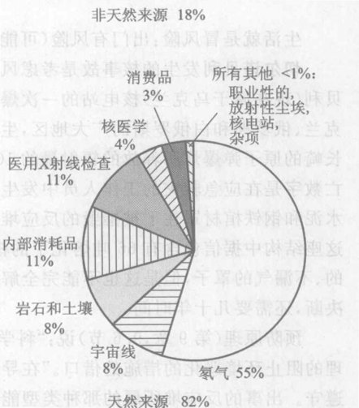

*图 15.14 放射性风险的来源：普通的美国公民通常经受的各种辐射源的相对贡献*
（饼图数据：非天然来源 18% [医用X射线检查 11%, 核医学 4%, 消费品 3%, 所有其他 <1%]; 天然来源 82% [氡气 55%, 宇宙线 8%, 岩石和土壤 8%, 体内消耗品 11%]）

你可能注意到了，表 15.5 中没有食物辐照这一项。在食物辐照过程中，令来自放射性同位素的 $\gamma$ 射线通过生肉和其他食物以消灭细菌。这些射线本身当然并不是放射性物质，它们并不在肉里面产生放射性。因此，虽然可以讨论这个过程的其他副作用，食品辐照并不造成对消费者的照射。虽然在美国对许多食物的辐照已获批准，但还没有广泛使用。受过辐照的食物在杂货店的货架上标有“经过辐照处理”字样。

> **概念检查 10** 下面这些哪些是致电离的电磁辐射？(a) X 射线；(b) 红外线；(c) $\alpha$ 射线；(d) $\beta$ 射线；(e) $\gamma$ 射线。

> **概念检查 11** 下面这些哪一种使你的身体变得比原来更有放射性？(a) 医用 X 射线检查；(b) 食物辐照；(c) 在癌症治疗过程中 $\gamma$ 射线穿过你的身体；(d) 在癌症治疗过程中摄取一种放射性同位素。

> **概念检查 12** 在上题中，哪些在你的一个细胞中造成辐射伤害？

**作出估计** 你有多少放射性？按重量人体有 18% 是碳。生物物质中每克碳含有大约 500 亿个 $^{14}\text{C}$ 原子，其中每分钟大约有 10 个原子衰变。估计你身体内放射性碳原子的总数和 1 分钟内衰变的碳原子数目。⑦

*⑦ 如果你的身体的质量是 60 kg，它含有大约 12 kg 或 12 000 g 碳。你身体里的 $^{14}\text{C}$ 原子数大约是 $(50 \times 10^9) \times 12 000 = 600 \times 10^{12}$，或 600 万亿个。1 分钟内衰变的原子数目为 $10 \times 12 000 = 120 000$。由于你的身体内的其他放射性同位素，你的总放射性实际上是两个这么大。*

---

## 15.7 风险评估：技术社会对风险的处理

生活就是冒风险：出门有风险 (可能给车撞着)，不出门也有风险 (比如吸入氡气)。

切尔诺贝利发生的核事故是考虑风险的一个很好的出发点。1986 年，发生在前苏联切尔诺贝利 (现在属于乌克兰) 核电站的一次爆炸和大火把大量放射性核素抛撒到空气中。这污染了乌克兰、俄罗斯和白俄罗斯的广大地区，生成一团云漂浮在欧洲上空，它所携带的辐射量是广岛和长崎的原子弹爆炸所释放的辐射量的 100 倍。这是历史上最糟糕的一次核电站事故。立即的伤亡数字是在应急救灾的工作人员中发生 237 例辐射病，其中 50 例死去。一座急救中慌忙建起的水泥和钢铁棺材罩住了被摧毁的反应堆，但是它仍在泄漏气体、污染了的水和高强度辐射。整个这座结构中据信包含有 66 吨熔化了的核燃料，加上 37 吨放射性尘埃。乌克兰希望建造一个新的、不漏气的罩子，但是这也不能完全解决问题。要做出的实现一个如何处理那些核燃料的工程决断，还需要几十年时间。

预防原理 (第 9 章，9.6 节) 说：“科学上还没有十足的把握，不得用来作为拖延不采取代价合理的阻止环境恶化的措施的借口。”在导致发生切尔诺贝利事故的各项事件中，这一条显然未被遵守。出事的反应堆所属的那种类型能够发生失去控制的链式核反应 (第 16 章)，它极快地释放热能，足以产生一次低烈度的核爆炸，实际上在切尔诺贝利贝就发生了。这座反应堆没有防护穹顶，每个美国核电站反应堆都用这么一个穹顶罩着。这次事故发生在一次安全测试时，这种测试是漫不经心地进行的，并且包含一些冒险的步骤如切断应急的冷却水 (第 17 章)，这些水是保存在水库中，使反应堆在事故中不致过热的。

很难预言或最后断定在随后几十年里由切尔诺贝利事故引起的长期癌症致死的数目。放射性尘埃散布到欧洲许多地区。许多欧洲人接收到的辐射的个人总剂量范围从几 mrem (相当于一次 X 射线诊断) 到大于 1 rem。越靠近切尔诺贝利，尘埃的剂量越大得多。在事故后几天内每人受到大约 20 rem 的照射后，从事发地点周围 30 km 的地带内撤出了上 10 万人。在乌克兰和白俄罗斯至今仍存在严重的后果。在反应堆附近有一座城市普里皮亚季，它是前苏联时期的模范城市，有 40 000 人口，现在只剩下一座幽灵城市，只用来做研究恐怖分子进行一次可能的放射性或“脏弹”袭击 (第 16 章) 的后果的实验室。在事故地点周围半径 37 km 内的地带 (包括切尔诺贝利和普里皮亚季两座城市) 已被放弃，它们在几个世纪里对人类居民都不安全。

两个最有害的同位素是放射性碘 $^{131}\text{I}$ 和放射性铯 $^{137}\text{Cs}$。二者在生物学上都是活性的。虽然 $^{131}\text{I}$ 的半衰期只有 8 天，因而很快衰减到无害的水平，但是它在事故后的头 8 天内已经被吸入人体，并且落在奶牛吃的草上，从而进入了牛奶供应，在头八天内大部分被消费掉。$^{137}\text{Cs}$ 的半衰期是 30 年。因此它在土壤中几十年都是危险的。这两种同位素都会导致癌症死亡。

由国际原子能公署组织的一项研究于 2005 年报告说，作为切尔诺贝利事故的后果，在俄罗斯、白俄罗斯、乌克兰和欧洲其余部分已经或将要有大约 4 000 个额外的癌症死亡病例。对于同样的人口，正常情况下预计会有 1.25 亿人死于癌症。因此，虽然额外的死亡病例数是个大数目，它们代表的癌症死亡率的增加只有 $4 000 / (1.25 \times 10^8)$ 或大约 0.003%。百分率的这个小小的变化在癌症总的统计数字中是检测不出来的。但是，某些特别的后果是可以检测出来的。例如，居住在切尔诺贝利周围 500 km 以内的儿童甲状腺癌的发病率升高了许多倍，这个后果在数据中显得很突出。这些被检测出的甲状腺癌患者的大多数活了下来。

体会这些数字的意义的一个方法是与别的风险进行数值比较，这种做法叫做**定量风险评估**。例如，全世界范围内由切尔诺贝利引起的 4 000 例长期死亡数字是单单美国一国一年内死于汽车车祸的人数 40 000 多 (我喜欢记住这个数字，以和我在新闻中遇到的别的统计数字比较) 的十分之一，是美国一年的谋杀案件数 (20 000) 的五分之一。这样的比较有助于把抽象的数字形象化。再看一个例子。氡气的照射使美国每年有 5 000 至 20 000 名 (这数字取决于怎么定) 肺癌患者死亡，这个数字与美国每年的谋杀数字可以相比。

领会这些风险的另一个方法是看它们对一个人造成的死亡概率。例如，切尔诺贝利的放射性尘埃可能从欧洲和前苏联的大约 7.5 亿总人口中杀死 4 000 人，这个比例是 $4 000/(7.5 \times 10^8)$，即大约 $5 \times 10^{-6}$ 或 5/100万。这个数字的意思是，这些人中每个人平均说来在 100 万次机会中大约有 5 次机会死于切尔诺贝利引起的癌症。这就是说，在随机选择的 100 万人的人群中，大约有 5 人将死于这个原因。

科学家曾用这些方法评估地球遭受彗星或小行星撞击的风险，这样的撞击如 1908 年摧毁了西伯利亚 2 000 km$^2$ 森林的撞击，和 6 500 万年前使恐龙灭绝的更厉害的撞击。结论是：把一切规模的撞击都考虑在内，每个人在每 20 000 次机会中会有大约一次可能死于这种撞击。这远小于汽车撞车的风险，但是与美国人平均死于航空事故的风险大致相同。由于美国对导致死的航空事故极为认真，那么结论自然也是应该认真对待天外来客撞击的风险——特别是如果能够够做点什么来减少这一风险。事实上，有许多事可以做，如探测太空中有威胁的彗星和偏转它们的轨道。由于这一分析的结果，现在有许多国家在这个问题上合作。

表 15.6 是定量风险评估的一个令人烦恼的例子。表列出了一些活动，每种活动带有同样大小的死亡风险：100万分之一。说所有这些风险相等的意义是：如果 100 万人口中的每个人从事表中列出的任何一种活动，那么他们之中就有一个人 (平均说来) 最终将因此而死亡。每次你从事这些活动中的一项，那么在 100 万次机会中就会有一次使你丧命。这足以使你早上赖在床上起不来了。

说每一件事都有风险，实际上是“我们一定都会死”的另一种说法。到头来，总的死亡风险是 100%。这使人忧伤，然而是真实的，人们应当明智地对待它。许多风险如氡气的照射是无法减到可以忽略不计的水平的，很少有风险能够减小到零。事实上，减小风险的试图可能会适得其反。例如，如果你不做胸部 X 光透视，你可能死于肺结核。你可以生活在户外以大大减小氡气的风险，但这会使你冒别的风险。如果你真想减小氡气的风险，你可以生活在户外并且每小时只呼吸一次，但这时刻你将会窒息。你可以决定不做带有任何风险的任何不必要的事情。但这这样你可能死于无生趣。

辐射安全专家对辐射风险已想过很多，他们提出了两点总的忠告：第一，每种辐射剂量都带有一些风险，因此，除非它带有足以补偿风险的好处，避免受照射。第二，任何人人所照射的剂量必须在考虑所有其他因素 (社会、经济等) 后的合理条件下尽可能低。换句话说，就是必须对风险存有清醒的认识，同时对风险和带来的好处加以权衡。相似的原理适用于生活中的一切风险。

> 国民的健康是国家的财富。
> ——离切尔诺贝利核电厂不远的小城普里皮亚齐的一个诊所前的巨大招牌上的文字。普里皮亚齐在事故中已经撤空，现在仍是一座鬼城

**表 15.6 日常生活的风险：平均带有 $10^{-6}$ 的死亡风险的活动**

| 活动 | 死因 |
| :--- | :--- |
| **致电离辐射** | |
| 在一个好医院的一次胸部 X 光透视 | 致电离辐射引起的癌症 |
| 一次乘坐喷气式飞机的跨国旅行 | 宇宙线引起的癌症 |
| 在室内生活 1 星期 | 宇宙线引起的癌症 |
| 在户外生活 5 星期 | 室内的氡气引起的癌症 |
| 在丹佛 * 生活 2 个月 | 户外的氡气引起的癌症 |
| 在核电站附近生活 5 年 | 宇宙线引起的癌症 |
| 在离核电站 8 km 范围内生活 50 年 | 事故 |
| **体内消耗** | |
| 吸 1.4 支香烟 | 癌症和心脏病 |
| 与一个吸烟者同住 2 个月 | 癌症和心脏病 |
| 喝 0.5 升酒 | 肝硬化 |
| 正常饮用自来水 ** 1 年 | 氯仿引起的癌症 |
| 喝 30 罐 12 盎司装的佐餐苏打水 | 糖精引起的癌症 |
| 吃 40 匙花生酱 | 黄曲霉 B 引起的肝癌 |
| 吃 100 块炭火烤的肉排 | 苯并芘引起的癌症 |
| **旅行** | |
| 骑摩托车旅行 5 km | 事故 |
| 骑自行车旅行 16 km | 事故 |
| 开汽车旅行 50 km | 事故 |
| 坐火车旅行 1 300 km | 事故 |
| 乘商务飞机旅行 1 600 km | 事故 |
| 乘喷气式飞机旅行 8 000 km (跨国两次) | 宇宙致电离辐射引起的癌症 |
| **工作** | |
| 在煤矿里 1 小时 | 黑肺病 |
| 在煤矿里 3 小时 | 事故 |
| **其他** | |
| 在纽约或波士顿住 2 天 | 空气污染 |

*\* 注：丹佛海拔较高，1 609 m，因而宇宙线较强。*
*\*\* 自来水用漂白粉消毒，可分解出氯仿。*
*资料来源：Richard Wilson, "Comparing Risks", Physics and Society, October 1990, pp. 3-5。*

> **概念检查 13** $^{137}\text{Cs}$ 的半衰期是 30 年。在切尔诺贝利事故之后，这种同位素的辐射降到它原来水平的 1% 大致需要 (a) 60 年；(b) 100 年；(c) 200 年；(d) 500 年；(e) 900 年。

> **概念检查 14** 你开车大约得开多远，才会和坐火车横越美国 (4 000 km) 有相同的死亡风险？(a) 12 000 km; (b) 100 000 km; (c) 1 000 km; (d) 250 km; (e) 150 km。

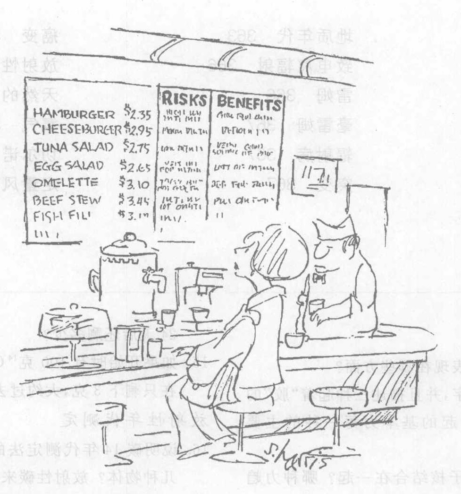

---

> **概念检查答案**
> 1. 原子核有许多量子特征，(e)。
> 2. 更大的原子核也能集结在一起，周期表将会更长，(b)。
> 3. (b)。
> 4. (c)。
> 5. (b) 和 (d)。
> 6. (e)。
> 7. (e)。
> 8. (c)。
> 9. 骨骼中的 $^{14}\text{C}$ 原子必定只有这只动物死时的 10% 这么多了。按照图 15.10，$^{14}\text{C}$ 原子在大约 19 000 年后下降到 10%，(c)。
> 10. (a) 和 (e)。
> 11. (d)。
> 12. (a), (c), (d)。
> 13. 6 到 7 个半衰期，或 180 到 210 年，(c)。
> 14. 按照表 15.6，导致同样大的风险汽车开的距离只有火车走的距离的 50/1 300 或 1/26。因此坐火车旅行 4 000 km 所冒的风险与开汽车旅行 $4 000/26 = 150\text{ km}$ 的风险相同，(e)。

### 关键概念

下述概念的定义出现在所标页码的本书正文页面上和书末的按拼音排序的术语词汇中。我们将它们按出现先后顺序排列在这里，你可以用这个清单复习本章内容。

*   强作用力 354
*   弱作用力 355
*   四种基本力 355
*   核反应 355
*   元素 356
*   核素 356
*   同位素 356
*   原子序数 356
*   原子量 356
*   放射性同位素 357
*   $\alpha, \beta$ 和 $\gamma$ 射线 357
*   稳定原子核 357
*   放射性原子核 357
*   放射性衰变 357
*   $\alpha$ 衰变 358
*   $\alpha$ 粒子 358
*   $\beta$ 衰变 358
*   $\beta$ 粒子 358
*   $\gamma$ 射线光子 359
*   子核 359
*   半衰期 361
*   衰变曲线 362
*   碳 14 年代测定 362
*   放射性年代测定 362
*   宇宙线 362
*   地质年代 363
*   致电离辐射 366
*   雷姆 366
*   毫雷姆 367
*   辐射病 367
*   突变 367
*   癌症 367
*   放射性尘埃 368
*   天然的人工的辐射 368
*   氡气 368
*   切尔诺贝利 370
*   定量风险评估 371

### 复习题

**核力**

1.  原子核的非牛顿本性表现在哪些方面？
2.  说出四种基本力的名字，并且描述三种起着“胶”的作用把东西粘合在一起的基本力每一种的主要功能。
3.  四种力中哪种力把原子核结合在一起？哪种力趋向于把原子核分开？
4.  强作用力的什么性质使得原子核如此之小？为什么大得多的原子核不能存在？

**核能和核结构**

5.  解释为什么核粒子必须快速运动而必须具有高能量？
6.  核反应在哪些方面与炼金术相似？
7.  什么是核素？要标志一种特定的核素需要知道哪些量？什么是同位素？
8.  $^{12}\text{C}, ^{14}\text{C}$ 和 $^{14}\text{N}$ 之间有哪些差异？比较它们的质子数、中子数、化学性质、核化学性质 (核反应中的行为)、中性原子中轨道电子的数目和质量。

**放射性衰变**

9.  放射性原子核发射哪几种射线 (或粒子)？描写它们的一种。
10. $\alpha$ 衰变时原子序数和原子量发生什么变化？
11. $\beta$ 衰变时原子序数和原子量发生什么变化？
12. 放射性衰变时发生什么能量转化？

**半衰期**

13. 在放射性衰变中，什么量是不能预言的？什么是基本原理的实例？
14. 已知 $^{131}\text{I}$ 的半衰期是 8 天。如果起初有 100 克 $^{131}\text{I}$，24 天后还剩多少？
15. 如果开始时有 100 克 $^{14}\text{C}$ (半衰期为 6 000 年)，现在只剩下 3 克，大约过去了多少时间？

**放射性年代测定**

16. 说明碳 14 年代测定法的工作原理。它适用于哪几种物体？这种柄斧来自何处？
17. 一柄斧柄的 $^{14}\text{C}$/C 比例只有活的有机体中的比例的 1/32。这柄斧柄大约有多古老？
18. 根据科学，地球的年龄大约是多少？几千年？几百万年？几亿年？几十亿年？还是几万亿年？人类 (人科动物) 呢？
19. 描述至少一种对某种年代测定方法 (如碳 14 年代测定法) 进行交叉核对的方法。

**人体受致电离辐射照射**

20. 下面哪些是致电离辐射？无线电波、紫外辐射、$\gamma$ 射线、$\alpha$ 射线、X 射线。
21. 雷姆是什么？
22. 说出由致电离辐射引起的三种主要的生物学伤害的名称，并加以描述。
23. 举出两种天然的致电离辐射源和一种人工源。
24. 举出放射性同位素的一些有用的应用。

**风险评估**

25. 切尔诺贝利事件对健康的长期后果是什么？
26. 什么是放射性尘埃？它们可能来自何处？
27. 每人有 3/1 000 000 的风险 (如患癌症) 是什么意思？
28. 在我们正常的居住环境里，在哪里可以找到氡气？它是怎样去到那里的？

### 思考题

**核力和核结构**

1.  两个相隔 $10^{-15}\text{ m}$ (一个比较小的原子核的大小) 的质子之间是哪种力更强：电力还是强作用力？你的答案有什么证据？
2.  两个相隔 $10^{-15}\text{ m}$ (一个原子的大小) 的质子之间是哪种力更强：电力还是强作用力？你的答案有什么证据？
3.  在原子核 $^{13}\text{C}$ 和 $^{56}\text{Fe}$ 中，各有多少个质子和中子？
4.  原子核 $^{90}\text{Sr}$ 中有多少个质子和中子？$^3\text{H}$ 中呢？
5.  在 $^{235}_{92}\text{U}$ 的一个原子核中有多少个质子和中子？$^{238}_{92}\text{U}$ 呢？
6.  $^1\text{H}, ^2\text{H}$ 和 $^3\text{H}$ 的质量相同还是不同？电荷呢？
7.  $^3\text{H}$ 和 $^3\text{He}$ 的质量相同还是不同？电荷呢？
8.  假设电力比它的实际值更强一些。这将使周期表变长，还是缩短，或者保持不变？
9.  参看图 15.1，如果强作用力的力程只有 $10^{-16}\text{ m}$ 而不是 $10^{-15}\text{ m}$，这对周期表有什么影响？

**放射性衰变**

10. 为什么放射性材料常常是温热的？
11. 你认为天然温泉中的热水是什么加热的？
12. 放射性材料常常在黑暗中放光。但是原子核衰变发射的 $\gamma$ 辐射是看不见的，那么光来自何处？
13. 哪种射线和 X 射线最像：$\alpha$ 射线，$\beta$ 射线，还是 $\gamma$ 射线？
14. 一个氢核能发射 $\alpha$ 粒子吗？
15. 一个元素能够在周期表中“向前”衰变为一个原子序数更高的元素吗？
16. 用周期表找出以下核反应后剩下的原子核：$^3\text{H}$ 的 $\beta$ 衰变，$^{222}\text{Rn}$ 的 $\alpha$ 衰变。
17. 用周期表找出 $^{90}\text{Sr}$ 进行 $\beta$ 衰变后剩下的原子核。

**半衰期**

18. 如果一种放射性核素的半衰期是 1 年，5 年后它剩下的份额还有多少？
19. 如果一种放射性核素的半衰期是 6 个月，5 年后它剩下的份额还有多少？
20. 原子序数大于 92 的核素 (超铀元素) 在自然界中不存在，因为它们的半衰期比地球年龄短得多，已经衰变掉了。那么像 Ra 这样的核素，半衰期只有 1 600 年，又是怎么会存在于自然界中呢？
21. 地球的年龄约为 45 亿年。在刚生成的地球上，$^{238}\text{U}$ 的数量大约是它现在的数量的几倍 (见表 15.1)？
22. 地球的年龄约为 45 亿年。在刚生成的地球上，$^{235}\text{U}$ 的数量大约是它现在的数量的几倍 (见表 15.1)？
23. 开始时有 2 g $^{131}\text{I}$。12 天后还剩多少 (见表 15.1)？
24. 如果你开始时有 1 g 纯 $^{14}\text{C}$，12 000 年后大约还剩下多少？
25. 开始时有 100 个氡原子。12 天后还剩多少 (见表 15.1)？这是一个精确的预言吗？
26. 开始时有 10 个氡原子 (半衰期为 4 天)。大约要过多久，这 10 个原子才会都衰变掉？是什么基本物理原理妨碍你对这个时间做出精确的预言？
27. 表 15.1 那些核素中，哪个最稳定？哪个最不稳定？
28. 如果你有 1 克 $^{235}\text{U}$ 和 1 克 $^{238}\text{U}$，哪个的放射性更强，即哪个在每分钟内发射更多的 $\alpha$ 粒子 (见表 15.1)？
29. 你只有 100 个某种放射性物质的原子。4 个半衰期后，大约还有多少个原子留下来？这是一个精确结果吗？
30. 你只有 5 个 $^{222}\text{Rn}$ 原子 (半衰期 4 天)。要问你 4 天后还有多少个原子剩下，你能说什么？8 天后呢？在 8 天后，全部 5 个原子仍可能都留下来未衰变吗？

**放射性年代测定**

31. 我们能用碳 14 方法测定普通的岩石的年代吗？为什么？
32. 碳 14 测定年代的方法对测定最早的人科动物的年代有用吗，对最早的城市呢？(见表 15.4)
33. 假设撞击地球大气的宇宙线粒子数目在过去比现在多。这影响我们用碳 14 方法测得的一个古老的斧柄的年代吗？它使我们估算的年代比实际的年代更古老还是没有实际的年代古老？
34. 碳 14 方法曾用来测定死海古卷的年代。如果古卷是刻在石头上的，这个方法还能用吗？
35. 在 1963 年的禁止大气层中的核武器试验条约之前，核武器试验在大气中产生了大量的放射性核素。这些核素之一是 $^{14}\text{C}$，它在大气中的浓度由于核试验而加倍。这将怎样影响将来的放射性年代测定？它会影响一个 1940 年造的斧柄的表观年龄吗？1990 年造的斧柄呢？
36. 在 1963 年的禁止大气层中的核武器试验条约之前，核武器试验在大气中产生了大量的放射性核素。这些核素之一是 $^{14}\text{C}$，它在大气中的浓度由于核试验而加倍。这会使一个 1990 年造的斧柄显得比实际年龄小呢，还是更老？

**风险评估**

37. 已知 $^{131}\text{I}$ 的半衰期为 8 天。切尔诺贝利事件后，必须经过多少时间，这种核素的辐射才会降到原来水平的 1%？
38. 埃德加在一个宴会上喝了 0.5 升酒，抽了 4 支烟。哪一活动的风险更大？风险度大多少 (假设他没有酒后开车)？

### 习题

**半衰期**

1.  你有 1 克 $^{131}\text{I}$ 和 $^{234}\text{Th}$ 各 1 克。用表 15.1 预言 24 天后每种同位素还有多少。
2.  开始时你有 5 克 $^{131}\text{I}$。要多长时间其辐射才降到原来的值的 5%？(用图 15.10)

**放射性年代测定**

3.  你测量出一把古老的木头斧柄的碳放射性只有它原来的值的 20%。估计斧柄的年代。
4.  求得一块古老的布 (用天然纤维制成) 里的 $^{14}\text{C}$/C 比例只有活的有机体中的比例的 70%。这块布有多老了？
5.  地球生成时原有的 $^{238}\text{U}$ 大致还有多少份额留存到现在？
6.  地球生成时原有的 $^{235}\text{U}$ 大致还有多少份额留存到现在？
7.  你怀疑一根木矛的年代在 50 000 年前。如果你用碳 14 方法测定年代，你预期同活的有机体中的放射性相比，在这根木矛中还会有多大的放射性？为什么这一测定年代的方法可能难以实际实行？
8.  地球上最古老的岩石是从太空中掉下来的陨石，这些陨石掉到地球上的时间还比较新近，但是据信它们在我们的太阳系形成时已经凝固了。考察这些陨石中的铀和各种来源于铀的子核，得知这些岩石里的 $^{235}\text{U}$ 是岩石初次结晶时所含的 $^{235}\text{U}$ 的 1% 不到一些。根据这个数据，我们的太阳系大约有多古老？

**辐射风险和风险评估**

9.  作出估计。日常生活的平均风险。每个人只死一次。把这一次死亡对 70 岁的典型寿命进行平均，证明每天由一切原因引起的平均死亡风险率是 1/25 000，或 0.000 04，或 100 万次中有 40 次机会。(这个平均值并不是实际的每天的风险的一个良好的近似，因为日风险率在不同的年份变化很大。例如，在 1 岁前和 65 岁后的死亡风险就比中间年份的死亡风险高得多。)
10. 作出估计。100 万分之一的意义。表 15.6 说，每吸 1.4 支香烟就有 $10^{-6}$ 的死亡风险。假设你每天平均抽 1.4 支烟抽了 40 年。那么你抽烟致死的总风险是多大？如果你每天抽一包 (20 支) 又怎样？
11. 作出估计。人体按重量大约 18% 是碳。这些碳的绝大部分是稳定的同位素 $^{12}\text{C}$ 和 $^{13}\text{C}$，但是每 1 万亿个碳原子中大约有 1 个是放射性的 $^{14}\text{C}$。一个典型的 70 kg 重的活人身体中大约含有多少克 $^{14}\text{C}$？