# 第 16 章 聚变和裂变：一种新能量

> 科学发现作为人类成就和人类的盲目性的传奇，处于最伟大的史诗之列。
> ——奥本海默

我们从把事物结合在一起的三种基本的“胶”中取得有用的能量，这三种基本的胶是引力、电磁力和强作用核力。例如，我们用水力发电大坝拦出一座水库，从作用在水库上的引力得到电能；在烧煤的工厂里，从使分子燃烧的微观电力得到电能。我们将看到，我们还可以从强作用核力得到电能。

在我们熟悉的宏观世界里，引力是这三种力中最明显的，而强作用核力最不明显。在微观世界里次序正好倒过来。原子核内在相邻的两个质子这样的亚原子粒子之间的作用力中，强作用力是三者中最强的，电磁力的强度次之，而引力最弱——实际上，它是如此之弱，以致探测不出来。①

由于三种力的强度不同，从三种力得到等量的输出能量所需的燃料量很不相同。例如，一座 1 000 MW 的水力发电厂每秒钟要用大约 6 万吨水的引力能；一座 1 000 MW 的烧煤的火力发电厂每天需要 10 000 吨煤（150 辆载重卡车或一列货车的载货量）；而一座 1 000 MW 的核电厂每年只用大约 100 吨铀（只是几辆载重卡车的载货量）。这三种力的破坏力也很不相同。一次滑坡或洪水中成百万吨的泥石或水的引力能能够将几千居民的小镇夷为平地。这样大小的小镇也可以被装在几百颗化学炸弹里的 1 000 吨高爆炸力的炸药夷平。但是有 25 万居民的广岛，则是一颗只带有 42 kg 铀的核弹夷平的。

三种力中最强的是我们了解得最少的。人类在几百万年的时间里对引力已经有一些直观了解。对电磁力的了解是从 18 世纪开始的。而我们直到 20 世纪才知道强作用力，而且至今对它仍缺乏基本性的了解。

聚变和裂变是本章的主题，它们都是核反应——改变原子核的结构的过程。我们将主要通过能量（本书的四个主题之一）来考虑这些反应。第 16.1 节和 16.2 节将继续讨论从第 15.2 节开始讨论的核能。第 16.1 节叙述氢聚变的力学和星星发光的原因。第 16.2 节讨论自然界中有的各种原子核里的能量。第 16.3 节应用这些概念来讲一个迷人的故事：构成地球和你的身体的原子是如何由恒星炼出来的。第 16.4 节讲述核裂变的物理学，第 16.5 节讨论名声咋舌的链式反应的方法，用这种方法通过变从原子核得到有用的能量。不幸的是，人类关于原子核的知识的首次主要应用是核炸弹。由于核炸弹仍然是一个威胁，以及它对我们科学时代的诸多教训，第 16.4、第 16.5 和第 16.6 三节将在制造世界上第一种核武器的历史背景下讨论裂变炸弹。第 16.7 节讲述我们的核知识的另一个产品聚变炸弹。第 16.8 节讨论核恐怖主义这种邪恶的可能性。此后，在第 17 章里，我将讨论核知识的一种更正面的应用：用作动力。

*① 例如，两个质子之间的引力只有它们之间的电力的一万亿亿亿亿分之一 ($10^{-36}$)，这么弱！*

---

## 16.1 聚变：太阳的天火

在我的字典里，“聚合 (fuse)” 这个词的意思是结合在一起，而“裂解 (fission)” 这个词的意思是裂开。因此，两个原子核聚合成一个更大的原子核叫做**核聚变**，而一个原子核裂解为大约两半形成两个更小的原子核叫做**核裂变**。

继续在第 15.1 节开始的关于原子核的侦探故事，我们来看看，对最简单的多粒子原子核即氢的同位素 $^2_1\text{H}$ 的能量，我们能得出一些什么结果。假设你想要把这个原子核分解为孤立的质子和中子。由于质子和中子是由强作用力结合在一起的，这不是一件容易的事（图 16.1）。

> **概念检查 1** 和裂解前的 $^2\text{H}$ 核相比，分开的质子和中子具有 (a) 更多的能量；(b) 更少的能量；(c) 同等的能量。

> **概念检查 2** 和 $^2\text{H}$ 核裂解前质子和中子相互作用的力相比，分解后质子和中子相互之间的力 (a) 更大；(b) 更小；(c) 相同。

分开的质子和中子比 $^2\text{H}$ 核有更多的能量。由于它是核力引起的，这多出的能量是**核能**的一种形式。这里的能量关系与由万有引力而相互吸引的两个物体（如地球和一块石头）的能量关系相似：石头离地面越远，引力能就越大（图 16.2）。

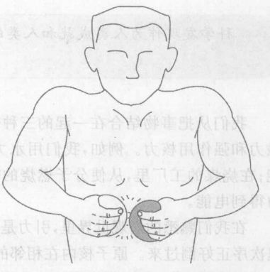

*图 16.1 要把 $^2\text{H}$ 核中的两个粒子拉开，你必须做功*

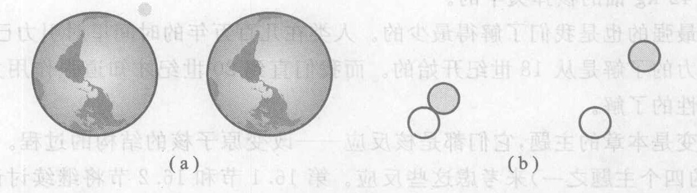

*图 16.2 核能与引力能很相似：离得越远，能量越大。(a) 哪种情况下系统的核能更大：石头的高度低时还是高时？(b) 哪种情况下系统的核能更大：质子和中子接近时还是离得远时？*

现在我们想象如何把一个质子和一个中子合在一起生成一个 $^2_1\text{H}$ 核，而不是分开它。这个过程可以表示为
$$ n + p \longrightarrow ^2\text{H} $$
其中 n 代表中子，p 代表质子。我们已经看到，这个核反应的左边比右边有更多的核能。由于能量永远守恒，多出的这份能量在这个过程之后一定表现为某种别的能量形式。换句话说，这个过程是把核能转化为别的能量形式的一个方法。事实上，它是**核聚变**的一种形式。只要中子和质子（或 $^1\text{H}$ 原子）进入彼此的强作用力力程（我们还记得强作用力的力程很短），这个过程就会发生。于是强作用力把二者紧紧地拉在一起——就像一条拉伸的橡皮筋啪的一声收拢。当大量的中子和质子以这种方式聚合时，这种聚变就会引起发热并且发射高能 $\gamma$ 辐射。因此能量转换方式是
$$ \text{核能} \longrightarrow \text{热能} + \text{辐射能} $$
我们将把这样的核能向其他能量形式的转化称为**核能的释放**。

在大爆炸创生宇宙（第 11 章）后的最初几分钟里，发生了大量的中子—质子聚变，生成了今天依然存在的 $^2_1\text{H}$ 的大部分。这种反应今天在超新星爆发中（第 5 章）还在发生。

今天的一个更重要的聚变反应是两个氢核（可以是质子 $^1_1\text{H}$，也可以是 $^2_1\text{H}$）的聚变。和上面一样，当两个氢核进入彼此的核力力程范围并且猛烈聚合时，核能被释放。事实上，太阳和其他恒星主要是由氢构成的②，并且它们的能量主要来自 $^1\text{H}$ 和 $^2\text{H}$ 的聚变。

> **概念检查 3** $^1\text{H}$ 和 $^2\text{H}$ 聚变生成的是 (a) $^3_1\text{H}$; (b) $^2_1\text{H}$; (c) $^3_2\text{He}$; (d) $^4_2\text{He}$; (e) $^3_2\text{He}$。

$^1\text{H}$ + $^2\text{H}$ 的聚变有一个有趣之处。与 n + p 反应不同，$^1\text{H}$ + $^2\text{H}$ 反应涉及静电力，因为两个原子核都带电。两个原子核在大得多的距离上就开始以电力相互排斥，这个距离比它们的强作用力相互吸引的力程大得多。因此要使两个原子核足够靠近以受到彼此的强作用力是不容易的。恒星解决这个问题的方法是，在恒星形成过程中（第 5 章），首先在星体的中心加热到几百万开。在这样的温度下，原子核运动得如此之快，以致它们能够穿越彼此相排斥的电场而足够接近，从而发生聚变。

因此要使大量氢核发生聚变需要给它们提供热能。记住聚变反应本身产生辐射能和热能，我们可以把能量关系小结如下：
$$ \text{热能}_{\text{入}} + \text{核能} \longrightarrow \text{热能}_{\text{出}} + \text{辐射能} $$
就数量而言，输出的热能远大于使反应发生所需输入的热能。因此反应一旦开始，就能够自己维持。这正像一团火：它需要一根点燃的火柴的热能使纸开始燃烧；但一旦烧起来，燃烧反应产生的热能就能比使反应发生所需的热能更多，因此燃烧能够自己维持。聚变和一场火之间的区别是，聚变涉及的是核力，而火涉及的是化学力（原子间的电磁力）。由于热能所起的重要作用，自持的聚变反应应叫**热核反应**。

**我们怎么知道 $E$ 确实等于 $mc^2$？** 核反应是质能等当关系（第 10 章）的很好的例证，因为它涉及的能量很大，足以产生可观的质量变化。考虑 $^1\text{H} + ^2\text{H}$ 反应。由于这个反应生成 $^3\text{He}$ 的核能小于分开的 $^1\text{H}$ 核和 $^2\text{H}$ 核的核能，质能等当原理预言：氦核的质量也应当更小（图 16.3）。

从直接测量知道这三种原子核的质量是：
$1\text{H}$ 的质量 = $1.6727 \times 10^{-27}$ kg
$2\text{H}$ 的质量 = $3.3437 \times 10^{-27}$ kg
$3\text{He}$ 的质量 = $5.0066 \times 10^{-27}$ kg

前两个质量加起来是 $5.0164 \times 10^{-27}$ kg，比氦核的质量大 $0.0098 \times 10^{-27}$ kg。正像爱因斯坦所预言的，系统损失能量时其质量减小。

为了定量检验 $E = mc^2$，必须直接测量反应中的能量损失（转化为辐射能和热能的能量）。这只要用转化的能量加热水并测量水的温度变化就行了。测得的单次聚变反应释放的能量是 $8.815 \times 10^{-13}$ J。我们来看它是否等于已知的质量差乘以光速的平方：
$$ \begin{aligned} 0.0098 \times 10^{-27}\ \text{kg} \times c^2 &= 0.0098 \times 10^{-27} \times 9 \times 10^{16} \\ &= (0.0098 \times 9) \times 10^{-27+16} \\ &= 0.08815 \times 10^{-11} \\ &= 8.815 \times 10^{-13}\ (\text{J}) \end{aligned} $$
果然相等。

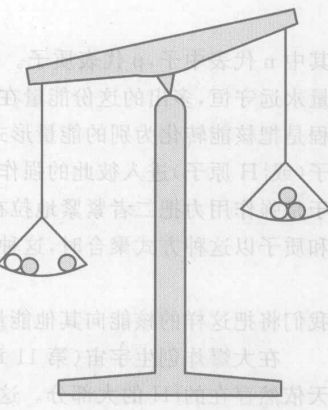

*图 16.3 整体的质量不等于它的两部分质量之和：当 $^1\text{H}$ 和 $^2\text{H}$ 聚变成 $^3\text{He}$ 时，$^3\text{He}$ 在静止时的总能量小于 $^1\text{H}$ 和 $^2\text{H}$ 的能量之和，因此 $^3\text{He}$ 的质量小于 $^1\text{H}$ 和 $^2\text{H}$ 的质量之和。*

**作出估计** 太阳的总输出功率为 400 亿亿亿瓦 ($4 \times 10^{26}$ J/s)，它来自三种聚变反应，其净效果是把太阳中的氢转变为 $^4\text{He}$。太阳每秒损失大约多少质量？③ 尽管有这么大的质量损失，太阳的生命将在现在之后 50 亿年才结束，那时它的质量仅比 50 亿年前点燃时的质量小 0.06%！

*② 天文学家一度相信恒星是由重元素构成的。但是天体物理学家 Cecilia H. Payne 于 1925 年在哈佛大学写博士学位论文时，应用光谱方法研究星光，发现恒星主要是由氢构成的。她这篇学位论文使她获得哈佛天文系的第一个博士学位，有人把这篇论文说成是“历史上最精彩的博士学位论文”。*
*③ 1s 损失的质量 $= E/c^2 = 4 \times 10^{26} / 9 \times 10^{16} \approx 4 \times 10^{26} / 10^{17} = 4 \times 10^9 (\text{kg}) = 400$ 万吨。*

---

## 16.2 核能曲线

除了 $^1\text{H}$ 和 $^2\text{H}$ 以外，还有许多别的原子核也能聚合在一起，形成较大的原子核。这里是两个例子：

> **概念检查 4** 两个 $^3_2\text{He}$ 核发生聚变，生成什么元素的同位素？(a) 氦；(b) 锂；(c) 铍；(d) 硼。(提示：利用书后所附的元素周期表。)

> **概念检查 5** $^4_2\text{He}$ 和 $^8_4\text{Be}$ 聚变生成核素 (a) $^{12}_6\text{C}$; (b) $^{12}_8\text{C}$; (c) $^{12}_4\text{C}$; (d) $^{12}_6\text{O}$; (e) $^{12}_8\text{N}$。

我们从这些例子看到，聚变由较轻的原子核如 He 生成较重的原子核如 Be。下一节还将看到，宇宙中许多重原子核正是这样生成的。这些变换的能量关系与氢和氢发生聚变生成氦的能量关系相似：原子核的集合必须够热才开始发生聚变，而聚变过程将给出比输入的多得多的热能和辐射：
$$ \text{热能}_{\text{入}} + \text{核能} \longrightarrow \text{热能}_{\text{出}} + \text{辐射能} $$
但是这些不同的聚变过程的能量收支关系有一个重大差异。作为一个例子，让我们比较 $^1\text{H} + ^2\text{H}$ 的聚变与 $^4\text{He} + ^4\text{He}$ 的聚变。在 $^4\text{He} + ^4\text{He}$ 过程中，原子核之间的电力比 $^1\text{H} + ^2\text{H}$ 过程中的更强，因为每个 $^4\text{He}$ 核含有两个质子而每个 H 核只含一个质子。因此 He + He 过程比 H + H 过程需要更高的温度，因而需要更多的热能输入。从这个例子可以看出，越重的原子核发生聚变需要的温度越高，从而需要的热能输入越大。

随着我们把越来越重的原子核进行聚变，最终我们到达这样一种情况：为维持聚变反应所需的大量热能输入变得比输出的热能还大，这样一来反应就不能自持了。这个极限出现在原子序数 26 处（铁）。因此，比铁轻（原子序数比铁低）的原子核可以通过自持反应（每次反应中产生的热能多于用掉的热能）由聚变生成。但是对于比铁重的元素，这个有利的能量收支关系却变成不利了。

图 16.4 的**核能曲线**用图解方式表明了以上几点。它对一切核素画出了核能（更精确地说是每个质子原子核粒子的核能）与原子量（原子核粒子的个数）的关系。这条曲线显示了上面讨论过的两个特征：首先，整条曲线位于代表分开的原子核粒子的能量的水平直线之下。这必然是这样，因为要把任何原子核分离成组成它的质子和中子都需要做功（第 16.1 节）。

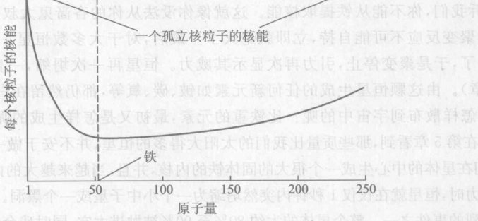

*图 16.4 核能曲线。实线代表不同原子量的原子核中每个核粒子的能量。铁 (原子量为 56, 原子序数为 26) 的每个核粒子的核能最小，因此铁是最稳定的原子核。*

其次，这条曲线先是下降，直到原子量为 56（对应于铁，原子序数为 26）为止，然后曲线又上升。曲线的下降段（原子量从 1 到 56）告诉我们，对于比较轻的原子核，聚变把核能转化为其他形式的能量如热能，因此在能量上能够自持。但曲线的上升部分（原子量大于 56）则告诉我们，对于比铁重的原子核，聚变的结果是核能增大，于是别的形式的能量如热能减少。这样的反应只有当有外界能源提供所需的能量时才能维持。这一转折点的出现，是由于原子核很大时，需要有大量的热能才能把两个原子核聚合在一起，如前所述。

虽然不能使用重核聚变的方法释放核能，核能曲线的形状却提示了另一种可能性：如果我们对重核不是进行聚变而是使一个足够重的原子核发生**裂变**（裂解），裂变过程后的核能就会比裂变之前少。换句话说，核能将被释放。这样的过程在能量上可以自持。

我们要强调的重要结论是：核能不仅可以通过很轻的原子核的聚变而释放，还可以通过很重的原子核的裂变而释放。

---

## 16.3 元素的起源：我们由恒星材料构成

我们的宇宙开始于大约 140 亿年前的一次大爆炸，这次爆炸事件创造了空间和时间本身，也创造了不同形式的能量和物质。但是这次大爆炸只生成了三个元素，绝大部分是氢和氦，加上一点点锂（第 11 章）。即使是今天，大爆炸中生成的氢和氦也占宇宙中的普通物质的 99% 以上，而所有其他元素占不到 1%。这些比氢重的元素尽管很少，对于生命和现代技术却是关键性的。这些元素来自何处？

答案是，这些元素是在恒星中生成，并且通过质量很大的恒星的爆炸而散布到宇宙各处。我们已经看到，每颗恒星，包括我们的太阳，在它们的生命的绝大部分时间里，都是通过把氢转变成氦来取得其大部分能量。当它们用完了它们的中心处的氢燃料后，恒星就部分坍缩。这个坍缩的能量进一步加热了恒星，这就点燃了新的温度更高的自持聚变过程，如
$$ {}^4_2\text{He} + {}^4_2\text{He} \longrightarrow {}^8_4\text{Be} \quad \text{和} \quad {}^8_4\text{Be} + {}^4_2\text{He} \longrightarrow {}^{12}_6\text{C} $$
这些反应能够生成从氦一直到铁的所有元素，但是不能生成比铁更重的元素，因为核能曲线（图 16.4）告诉我们，你不能从铁提取核能。这就就像没法从你的吝啬鬼大叔手里挤出钱一样。包含铁反应的聚变反应不可自持，立即就熄火了。最后，对于大多数恒星，一切可能的自持聚变材料都用完了，于是聚变停止，引力再次显示其威力。恒星再一次坍缩，一直收缩到变成一颗白矮星（第 5 章）。由这颗恒星生成的任何新元素如铍、碳、氧等，都仍然留在白矮星中。那么，比氦重的元素是怎样散布到宇宙中的呢？比铁重的元素，最初又是怎样生成的呢？

我们在第 5 章看到，那些质量比我们的太阳大得多的恒星，并不安于做一个慢慢老去的白矮星。相反，它们在星体的中心生成一个很大的固体铁的内核，并且当这颗越来越大的内核过于沉重，无法承受引力的拉力时，恒星就在仅仅 1 秒钟内突然坍缩为一个中子星或一个黑洞。这样的超新星爆发是宇宙中最暴烈的事件之一。整个星体的大约 80% 至 90% 被抛进太空，同时残余的部分则坍缩。

被抛射到太空的物质不仅包括铁以下的一切元素，还包括比铁重的元素，它们是由爆发的冲击生成的。科学家尚不理解这个生成比铁重的元素的对程的详情，看来它们同内核坍缩引发的“冲击波”（与超音速喷气式飞机产生的强力的可听到的隆隆声相似）有关。人们认为，当这个冲击波穿越被抛射到太空的物质时，它在被抛射的物质中生成了大量的中子，这些中子与较大的原子核结合在一起，因此许多被抛射的原子核通过“捕获”越来越多的中子而变得越来越大。这些大原子核然后进行放射性衰变，变成比铁重的元素（如碘、金、铀等，见概念检查 6）的正常原子核。最后，被抛射的物质到达了更广阔的太空，它们在那里可以成为新生成的恒星、太阳系的一部分，以及也许是你的身体的一部分。

超新星爆发是相当稀罕的事件。在过去 1000 年里肉眼只看见过五次。其中一次爆发于 1987 年发生在一个邻近的星系里（第 5 章，图 5.12）。没有这些偶发的超新星爆发，便只有大爆炸直接生成的三种元素才可能散布到宇宙中。一切行星将只由这种材料构成，而我也不会在这里讲这个故事，你也不会在这里读它了。因为我们的太阳是在我们的星系生成几十亿年之后才形成的，太阳系把在太阳诞生前爆发的超新星抛出的重元素收了进来。我们应当为这些罕见的、发生在很久以前和遥远地方的超新星爆发感谢我们的星星，是它们把比氦重的元素送到各个地方，例如我们这个天区。

> **概念检查 6** 在一次超新星爆发中，如果一个铁原子核捕获了三个中子，然后作 $\beta$ 衰变两次，它将变成什么元素？(a) 铬；(b) 锰；(c) 钴；(d) 镍；(e) 锌。(提示：用书后所附的元素周期表。)这就是产生比铁重的元素的那种过程。

---

## 16.4 裂变的发现：过渡到一个新时代

有人说过，不能吸取历史教训的人注定要重犯历史的错误。发现和首次使用核裂变的传奇是关于科学和社会的一个很有起作用的案例研究，如果我们想要使用科学和技术而不在某种程度上毁灭我们自己，我们就必须从这个故事吸取教训。这是关于在面对一个威胁全世界的敌人的情况下必须完成的工作的一部悲剧性的英雄传奇。这些事件一旦在第二次世界大战的早期待启动，那么一切真正的悲剧一样，发生在广岛和长崎的故事结局就变成不可避免的了。

> 解开了羁绊的原子能已经改变了一切，而我们的思维方式却仍然未变，因此我们正漂向所未有的灾难。
> ——爱因斯坦

科学家于 1896 年发现放射性衰变，这是人类最早知道的核反应。在随后的几十年里，他们对这种新现象进行了认真的研究。他们用现在高能物理中已经很常用的一个简单技术，用别的小粒子轰击原子核，观察所发生的情况。

1933 年，伊伦·约里奥-居里 (图 16.5，玛丽和皮埃尔的女儿) 和她的丈夫弗雷德里克·约里奥 $\alpha$ 粒子轰击铝箔，产生了一种以前不知道的磷的同位素。天然的磷是稳定的，但新的同位素却有放射性。这是第一次人工制造的放射性同位素，也是第一次在随后的放射性衰变中释放核能。约里奥预见到潜了在的后果：“我们有理由认为，能够随意制造或毁坏种元素的科学家，也将能产生一种爆发型的嬗变……如果这样的嬗变真的能够在物质中成功地蔓延开来，那么大量释放没有的能量就是可以想象的。”

大约同时，科学家用 $\alpha$ 粒子轰击铍核，检测出一种以前不知的粒子，在碰撞中从铍中敲出。这种新粒子是电中性的。他们发现了中子。这种微妙的新粒子在核能的应用中起了关键的作用。由于不带电，中子可以溜进原子核而不可克服质子在接近带正电的原子核时所受的电斥力。它们又不橡电子，电子是感不到强作用力的，中子一旦溜进原子核就和原子核强烈地相互作用。

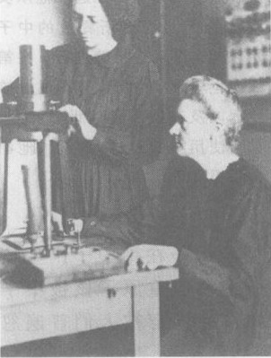

*图 16.5 伊伦·约里奥-居里和她的母亲玛丽·居里 (见第 15 章图 15.3) 在工作中。伊伦和她的丈夫弗雷德里克·约里奥-居里 1935 年前后在巴黎的镭学研究所工作时，用快速运动的 $\alpha$ 粒子轰击各种元素的原子核，生成了许多以前不知道的同位素。镭学研究所是玛丽·居里创立的。*

匈牙利物理学家西拉德 (图 16.6) 是一位幻想幻的人，他终生仰慕另一位幻想家——英国作家威尔斯。威尔斯 1914 年的小说《获得自由的世界》预言了核能、核弹、核战争和世界政府。西拉德极有发明才能，他迅速抓住了中子带来的可能性：也许某种在能量收支上有利地位的核反应在某种物质中会发射中子；也许这些中子随后能够轰击同一物质中的其他原子核并且在大量物质中产生一连串类似的反应。这样，中子也许就是释放大量有用的核能的钥匙。但是西拉德也认识到，这个想法如果实现了，将会是一把双刃剑，既带来希望也带来恐惧。

1934 年，费米 (图 16.7) 试着用新发现的粒子中子而不是像约里奥-居里夫妇那样用 $\alpha$ 粒子来轰击原子核。他使用的方法是轰击各种元素一直到铀，在这个过程中生成了 40 种新的放射性同位素。费米轰击的一个元素是原子序数为 92 的最重的天然元素铀。费米假设，某些铀核将吸收一个中子，变成不稳定的原子核，然后发生放射性衰变，转变为一种或几种在周期表中邻近铀的元素。但是这个实验生成的非铀核似乎不符合这种描述，费米不能理解这是什么原因。

德国女化学家诺达克 (图 16.8) 发表了一个解释：“人们可以假定……在用中子产生核衰变时，会发生一些全新的核反应，它们是以前从未观察到的……也许当重核被中子轰击时……原子核会分裂成几块大碎片。”但在 1934 年，她的先知性的预言被人们普遍忽视了。

1938 年，伊伦·约里奥-居里报告说，中子轰击铀产生了一种神秘的元素，她可以用镧 (原子序数 57) 为“载体”来拾取这种新元素并把它带出，使新元素从铀中化学分离出来。但是这种神秘的元素无法用化学方法与镧分开。当然它不可能就是镧，轰击 92 号元素铀怎么会产生一个在周期表中离铀 35 位的元素呢？在柏林领导一个铀研究小组的哈恩对这个不寻常的结果持怀疑态度，因此把他的研究工作的方向定为他认为必需的对约里奥-居里工作的修正。

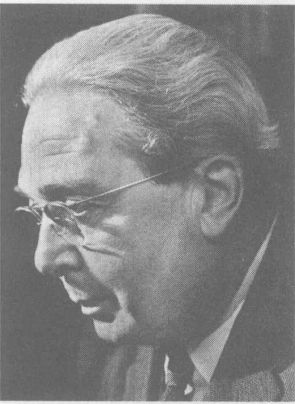

*图 16.6 莱奥·西拉德。这个极富发明能力的物理学家第一个领悟到，中子可能是通过链式反应释放大量核能的钥匙。他从实验发现，$^{235}\text{U}$ 裂变释放的中子足以使这个反应持续进行。在第二次世界大战中倡议美国发展核武器以及在战后提倡世界和平、禁止使用核武器这两方面，他都是积极分子。*

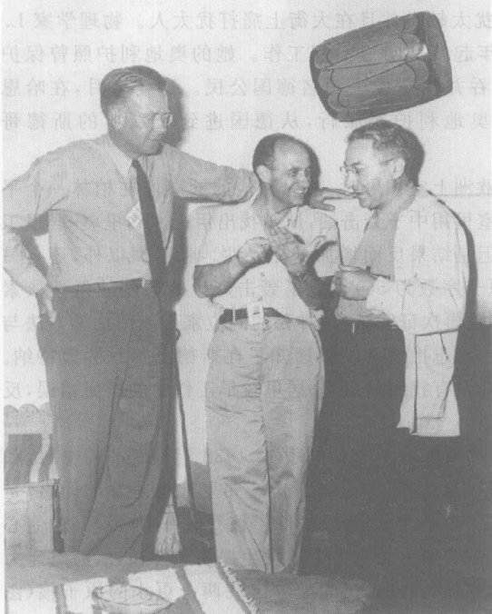

*图 16.7 恩里科·费米 (中) 正在和拉比谈话，旁边看着他们的是劳伦斯，“回旋加速器” (见第 18 章图 18.8) 的发明人。1934 年，费米用新发现的中子代替约里奥-居里夫妇所用的 $\alpha$ 粒子轰击原子核，在这个过程中生成了许多新的放射性同位素，由于发现这些同位素，1938 年他获得了诺贝尔奖。然后他从法西斯意大利移民美国，在那里，由于担心轴心国将在发展核武器方面打败同盟国，他在曼哈顿计划中起了关键作用。第 100 号元素是以他的名字命名的。*

④ *关于这位极富创造性的人物的生平和时代的综合传记，请读 W. Lanouette 与 Bela Silard (西拉德的弟弟) 合写的 Genius in the Shadows: A Biography of Leo Szilard, the Man Behind the Bomb (Chicago: University of Chicago Press, 1994)。西拉德的先知式的政治遗嘱和科幻寓言 The Voice of the Dolphins (Stanford, CA: Stanford University Press, 1992) 很有趣，值得一读。*

*图 16.8 德国化学家伊达·诺达克最早预言中子撞击重原子核引发核裂变的可能性。虽然她的活在 1934 年被普遍忽视，这种现象却在 1938 年被发现了，提出了以核裂变为依据的新式军事武器的可能性。*

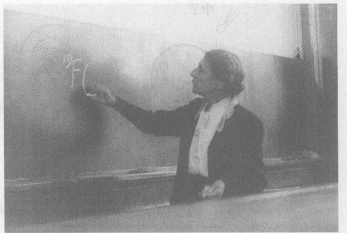

*图 16.9 丽丝·迈特纳 (1878—1968)，大约摄于 1930 年。她在柏林做关于铀的研究工作，直至 1938 年德国的反犹太主义迫使她逃往瑞典斯德哥尔摩。她在斯德哥尔摩做的理论计算阐明了她以前在柏林的研究小组所做的工作，表明该小组实际上发现了一种全新的核过程。她把这种新过程叫做核裂变。第 109 号元素以她的名字命名。*

1938 年是灾难深重的一年。奥地利被希特勒德国吞并了；慕尼黑协定允许希特勒占领捷克斯洛伐克的一部分；德国的反犹暴徒焚烧犹太教堂并且在大街上痛打犹太人。物理学家 L. 迈特纳 (图 16.9) 是奥地利犹太人，从 1907 年起就和哈恩一起工作。她的奥地利护照曾保护她免遭德国反犹主义的迫害，但是奥地利被吞并使她成了一名德国公民。这一年 7 月，在哈恩的帮助下，她大胆地用当时已作废的奥地利护照旅行，从德国逃到了瑞典的斯德哥尔摩。⑧

> 她毕生从未放弃的理念是把物理学当成一场为了终极真理的战斗。
> ——弗里什，谈他的姨妈兼同事迈特纳

当战云在欧洲上空积聚时，哈恩和他柏林的同事们在柏林一个平静郊区的实验室里用中子轰击铀，试图找出伊伦·约里奥-居里工作中的错误。但是结果反而增加了神秘性。除了镧以外，还有另一个元素钡 (原子序数为 56) 也成了轰击产生的某些放射性核素的良好载体，并且再次证明，这种神秘的同位素不能用化学方法与其钡载体分开。哈恩把这些结果通知了在斯德哥尔摩的迈特纳。哈恩的结果完全没有找到约里奥-居里工作中的任何错误，反而与她的结果相似。

迈特纳喜欢经常进行十尔千米的徒步旅行“以保持活力和灵敏”。1938 年圣诞节前夕，她和她的外甥弗里什穿着越野滑雪板做了一次穿越瑞典乡村的长途行走。弗里什也是她的同事，是一位物理学家，他们一道讨论哈恩的数据。玻尔曾经提出，可以把原子核看成一个液滴。他们心里想着这幅图像，争论着往铀原子核里加一个中子是否会使这个核发生振荡和伸长，然后电力将把原子核的两端推得彼此分离，使得在原来的原子核的地方出现两个更小的原子核（图 16.10）。它像是一滴水滴，被拉长了而且被一分为二。两个更小的原子核之一可能是钡或镧。他们从微生物学中的细胞分裂得到启示，把这个假设的新过程叫做**核裂变**。

图 16.4 的核能曲线表明，这个过程中最终的核能小于初始的核能，因此这个过程释放核能。被释放的核能转变为图 16.10(d) 中看到的微观动能以及这个过程产生的辐射能。迈特纳用液滴模型算出，在原子核内的电力做功推开两片裂变碎片时，消耗的核能应当大约 $3 \times 10^{-11}$ J。然后她又用一个完全不同的方法重新计算这个能量：把爱因斯坦的 $E=mc^2$ 公式应用于从实验得知的铀核和碎片之间的质量差值（图 16.11）。已知这个质量差值约为一个质子质量的 1/5。

⑧ *关于她的生平和时代的一本优秀的传记，见 R. L. Sime 的 Lise Meitner: A Life in Physics (Berkeley, CA: University of California Press, 1966)。中译本：丽丝·迈特纳：物理学中的一生 (戈革译，江西教育出版社，1999)。*

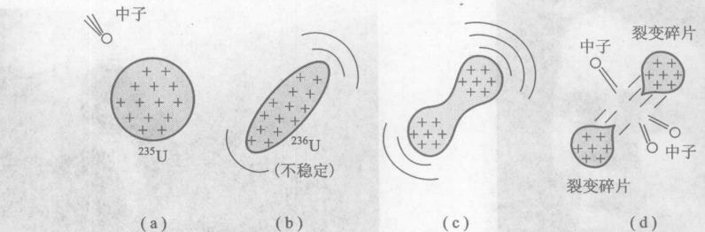

*图 16.10 铀核受到中子撞击后的裂变*
*(a) 中子 (b) 236U (不稳定) (c) 振荡 (d) 裂变碎片，发出中子*

把这个质量乘以 $c^2$，她得到大约 $3 \times 10^{-11}$ J。两个结果一致，迈特纳的计算是核裂变的坚实证据。核时代开始了。

> **概念检查 7** 当约里奥-居里夫妇用 $\alpha$ 粒子轰击 $^{27}_{13}\text{Al}$ 时，每个铝核吸收一个 $\alpha$ 粒子并且发射一个中子。这个过程生成的核素是 (a) $^{23}_{11}\text{Na}$; (b) $^{30}_{13}\text{Al}$; (c) $^{30}_{15}\text{P}$; (d) $^{29}_{15}\text{P}$; (e) $^{16}_{29}\text{S}$。

---

## 16.5 链式反应：打开锁着的核力

到了 1939 年，主要的科学家如爱因斯坦、费米和西拉德都已从希特勒占领下的欧洲逃到了美国。当西拉德听到铀核能够吸收一个中子然后分裂成两部分时，他就预见到实现威尔斯的核能梦想的一个办法。由于不带电的中子是一种特别好的核“胶”，重元素含有的中子数目比质子多得多。这样，由铀裂变而成的更轻的碎片含有的中子数应当比它们的质子序数在正常情况下所含的中子数多得多。因此，在反应中应当分做出单个中子，而这些中子又会使别的铀核发生裂变。随着这个**链式反应**从一个铀核进到下一个铀核，大量的铀就会发生裂变（图 16.12）。随着链式反应蔓延开来，中子的数目将迅速倍增，使几千克的铀原子核在几微秒内发生裂变。

西拉德认为，如果在裂变中的确发射中子的话，那么，这一事实应当对德国人保密。

在宣布发现核裂变的消息后一星期内，费米和其他人也独立地想出了用中子实现链式反应的主意，并且对可能释放的能量作出了估计。有一次，费米站在哥伦比亚大学他的办公室的窗旁，俯看着纽约喧闹的街道，他把手指弯成杯状——好像拿着一个橙子似的。“这么大的一个小炸弹，”他沉思着，“这就一切完 了。”

西拉德设计了一个简单的实验，来直接检测他猜想在一个中子使铀核裂变时所释放的中子。从实验结果，他能估计出每次裂变所释放的中子的平均数。只要这个数大于 1，足以迅速建立一个链式反应，使大量的轴发生裂变。他测出这个数大约是 2。西拉德立即打电话给他的同胞——住在美国的匈牙利物理学家特勒。西拉德只说了一句：“我找到了中子。”那个晚上，西拉德心里毫不怀疑世界正走向灾难。

1939 年 9 月 1 日，希特勒下令入侵波兰，发动了第二次世界大战。德国科学家明白核裂变作为武器的潜在可能性。因此，德国政府禁止铀的出口，并于 1939 年启动了一个秘密的核武器计划。这是国际核军备竞赛的开始。

西拉德和特勒等物理学家了解这一切可能性能。如果希特勒在美国之前制造出裂变炸弹，那就会成为他制胜的武器。他们同爱因斯坦讨论了他们的恐惧。爱因斯坦同意把他的名望支持他们的努力，以提醒美国政府注意这个问题。他们一起起草了以爱因斯坦的名义起草了一封致罗斯福总统的信，并于 1939 年 10 月寄出。爱因斯坦建议美国政府密切注意事态的进一步发展，并且在财政上支持裂变研究。信的最后一段写道：“德国实际上已经停止出售它占领的捷克斯洛伐克铀矿所生产的铀”，并且“在柏林……正在重复美国关于铀的一些研究工作”。

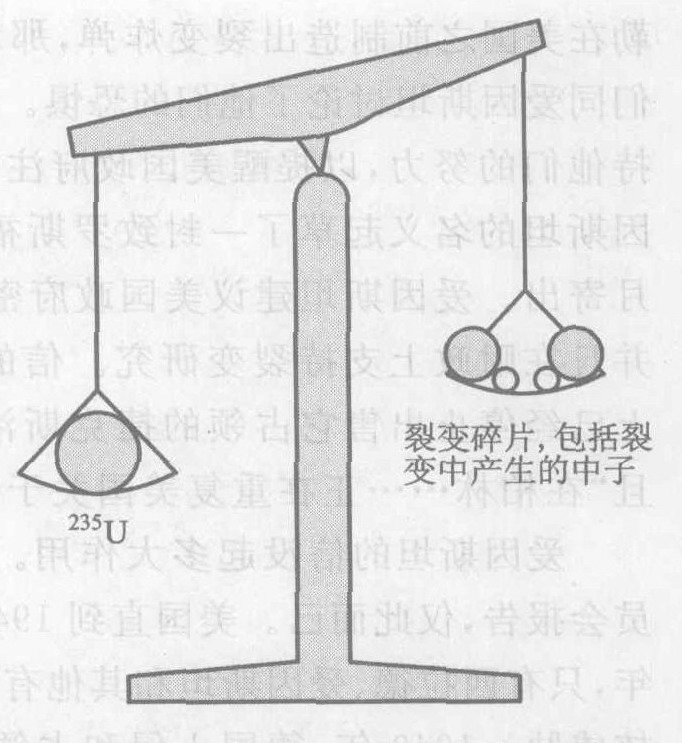

*图 16.11 铀核的质量大于它分裂成的碎片的质量 (见核能曲线)。根据爱因斯坦的理论，这个质量差乘以光速的平方应当等于裂变过程中释放的能量。*

> **我感到极度的震惊和沮丧。一想到无数无辜的妇女和儿童那不可言状的痛苦，我就无法忍受……经过彻夜的讨论、试图解释和自责之后，我是如此地焦虑不安，以致其他人都有对我非常担心。**
> ——哈恩，裂变的共同发现者，在战后的 1945 年与别的德国核科学家被拘禁于英国时

爱因斯坦的信没起多大作用。开了一次会，提交了一份委员会报告，仅此而已。美国直到 1941 年 12 月才参战，而在 1939 年，只有西拉德、爱因斯坦和其他有见识的物理学家严肃地对待核威胁。1940 年，德国入侵和占领了大部分欧洲，并且轰炸英国，准备入侵。战争双方开始轰炸对方的城市，大量平民伤亡成为现代战争的一个现实。

虽然美国政府没有积极参与，但是美国的铀研究在 1939 年至 1941 年期间仍旧取得了进展。他们逐渐清楚了铀的两种同位素 $^{235}\text{U}$ 和 $^{238}\text{U}$ 之间的重大差别。当一个中子撞击铀时，只有 $^{235}\text{U}$ 才能可能发生裂变，而 $^{238}\text{U}$ 则是吸收中子，变成一个新的放射性同位素 $^{239}\text{U}$。这意味着有一个核炸弹需要几平纯粹的 $^{235}\text{U}$ 维持快速的链式反应，才能使大量的铀发生裂变。如果有许多 $^{238}\text{U}$ 出现，那么它将吸收掉大部分中子，炸弹将不会爆炸。

天然铀中的 $^{235}\text{U}$ 不到 1%。要制造一枚核炸弹，必须把 1% 的 $^{235}\text{U}$ 从 99% 的 $^{238}\text{U}$ 中分离出来（图 16.13）。这在许多科学家看来简直是不可能的。问题在于，同一元素的两种同位素在一切化学反应中的行为都完全相同，因此化学方法对分离它们无能为力。提取足以制造一枚炸弹所需的 $^{235}\text{U}$ 显得如此困难，以致玻尔坚持认为：“这是绝对做不到的，除非你把整个美国变成一座大工厂。”玻尔此确信该肯定做不到的。后来证明，他的话是先知先觉的，虽然结局并不是他想象的那样。

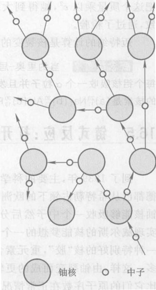

*图 16.12 一个链式反应。在图的右下方，有一个中子打中一个铀核。这个铀核裂变时发射两个中子，从而又使另外两个核裂变，如此等等。以这种方式，几千克铀的原子核很快就裂变掉。*

1940 年，科学家制出了一个新的非天然的化学元素，即地球上并不天然存在的元素。他们发现了证据，表明 $^{238}\text{U}$ 受到中子袭击时会吸收一个中子变成 $^{239}\text{U}$，然后迅速发射一个 $\beta$ 粒子变成第 93 号元素。它的发现者把这第一个铀外元素以海王星 (Neptune) 的名字命名为“镎”(neptunium)，因为海王星是天王星 (Uranus) 外的行星，而铀 (uranium) 是以天王星命名的。

和一切重于铅的元素一样，镎是放射性的。由于它发射 $\beta$ 粒子，因此它衰变为原子序数更大一号的元素，生成另一个非天然元素，原子序数为 94。1941 年初，科学家检测出这个新元素，发现它有一个重要性质：像 $^{235}\text{U}$ 一样，第 94 号元素在受到一个中子撞击时很容易发生裂变。而且，这种新元素可以用化学方法从生成它的铀中分离出来，从而避免了分离同一元素的两种同位素的困难。直到 1942 年，它的发现者才为这种像 $^{235}\text{U}$ 一样裂变、但是可以从铀中用化学方法分出来的新元素取一个名字：钚 (plutonium)，这是以离太阳最远的行星冥王星 (Pluto) 命名的，而冥王星又是以希腊神话中幽冥世界的主神鲁托 (Pluto) 的名字命名的（图 16.14）。

> **可能有人对你们这些科学家说过，你们对今天的灾难（二次大战）有部分责任……但是请你们放心，应该对此负责的并不是全世界的科学家……发生的事情完全是那些人引起的，你们把你们沿着和平路线做出的进展，总是或正在使用于完全不同的目的。**
> ——罗斯福总统，1940 年在一次科学家会议上的讲话

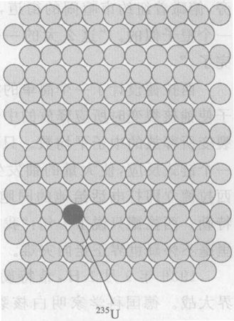

*图 16.13 在天然铀中，每 140 个原子中只有一个是 $^{235}\text{U}$，别的都是 $^{238}\text{U}$。*

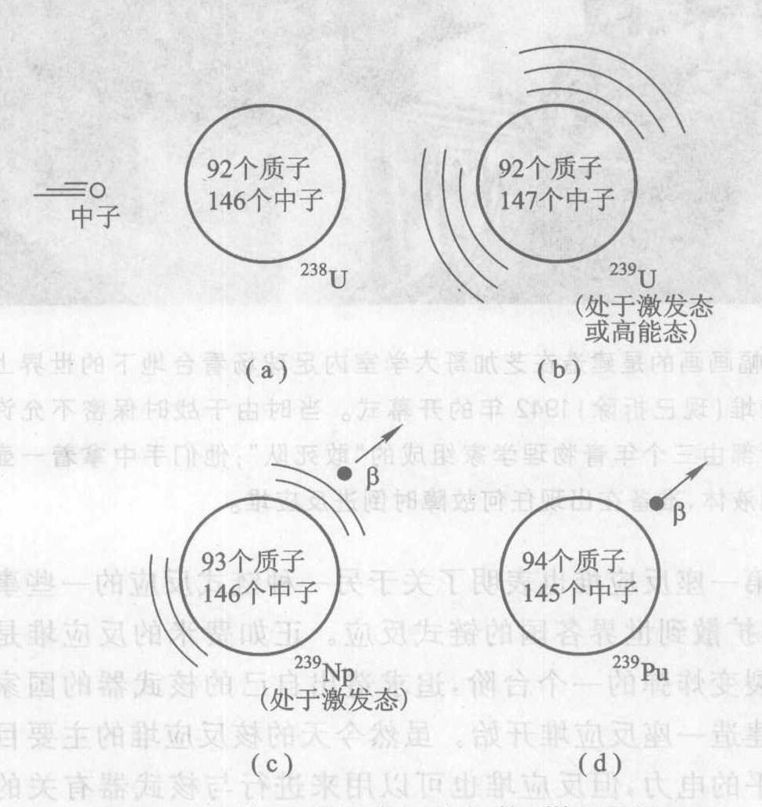

*图 16.14 第 94 号元素钚的生成。$^{238}\text{U}$ 吸收一个中子后，经过两次 $\beta$ 衰变成为 $^{239}\text{Pu}$。*

1941 年 10 月，科学家使罗斯福总统相信，裂变武器是可以工作的。
1941 年 12 月 7 日，日本偷袭美国珍珠港。1942 年，一个叫做曼哈顿计划的美国核武器计划认真地开始了。

> **概念检查 8** 当一个 $^{235}\text{U}$ 核被一个中子打中时，它分裂为两个大碎片并发射 2 至 4 个中子。虽然在不同情况下的碎片不同，一个典型的碎片是 $^{142}_{56}\text{Ba}$。从周期表，我们可以推出这个具体的裂变过程中的另一碎片是 (a) 氪；(b) 氖；(c) 铯；(d) 铷；(e) 锶。

> **概念检查 9** 铀的两种同位素的原子量相差大约 (a) 4%; (b) 3%; (c) 0.5%; (d) 略小于 1%; (e) 略大于 1%。

---

## 16.6 曼哈顿计划和裂变武器

美国以空前的规模展开的制造裂变炸弹或原子弹⑨的计划源于美国对德国裂变炸弹的恐惧。1942 年 12 月，费米领导的芝加哥大学研究小组首次实现了自持的链式反应（图 16.15）。为了做到这一点，费米的小组建造了世界上第一座核反应堆，它是以受控方式将核能转化为别种能量形式的装置。关于核反应堆的进一步讨论见第 17 章。

> **在我看来，与人类命运攸关的问题是：它所发展的文化进程是否将成功地制服由……侵略和自我毁灭引起的公共生活的混乱。在这方面，或许我们此刻正在经历的这个阶段值得特别注意。人们已经把他们征服自然的能力提高到如此的程度，以致用这种能力他们现在能够很容易互相灭绝到最后一人。他们知道这一点；他们当前的大部分动乱、他们的沮丧、他们忧虑的心情，都是由此而来。**
> ——弗洛伊德, 1930 年，发现裂变的许多年之前

> **在根本上，并且从长远看，原子能的释放所提出的问题是人类管理自己而不发生战争的能力问题。**
> ——美国国务院 1953 年 1 月的一份报告

世界上第一座反应堆也表明了关于另一种链式反应的一些事实，即核武器扩散到世界各国的链式反应。正如费米的反应堆是造出美国的裂变炸弹的一个台阶，追求造出自己的核武器的国家也最可能从建造一座反应堆开始。虽然今天的核反应堆的主要目的是提供和平的电力，但反应堆也可以用来进行与核武器有关的研究和获取与核武器有关的材料。一个表面上用于和平目的的核动力规划可以用来遮掩一项秘密的核武器规划，印度、以色列、南非、伊拉克、巴基斯坦、朝鲜（按照许多人的意见还有伊朗）发生的的事表明了这一点。

另一个问题是，反应堆通过把 $^{238}\text{U}$ 转变为 $^{239}\text{Pu}$，可以生产有军事用途的钚，为制造裂变炸弹提供一条可能的途径。铀在地壳中是常见的，所以 $^{238}\text{U}$ 很容易得到。一座反应堆仅仅运转几个星期就能够生成足以制造一枚裂变炸弹的钚。曼哈顿计划的工程师们在华盛顿州的汉福德附近建造了三座巨大的天然铀反应堆以生产钚。

$^{235}\text{U}$ 是打开核时代大门的钥匙。实际上它是唯一能发生链式反应的天然核素。⑩ 另一种在核武器中的会发生链式反应的核素是 $^{239}\text{Pu}$，而为了生产 $^{239}\text{Pu}$，发生在 $^{235}\text{U}$ 中的链式反应是不可少的。并没有明显的理由解释，为什么会发生链式反应的天然原子核刚好是一种，而不是另一个数目比方说零种。在某种意义上，这种危险而有用的核素差一点就不存在于地球上了：铀是周期表中最后一种天然元素，而其中 $^{235}\text{U}$ 又不到 1%。大自然竟给予人类这样一种有巨大威力的核素，这真是一个讽刺，似乎是对人类的某种考验。

铀和钚二者各提供了一条通向裂变炸弹的途径。曼哈顿计划对两条途径都试了。沿着铀的途径，关键问题是提纯天然铀，把 1% 的 $^{235}\text{U}$ 从 99% 的 $^{238}\text{U}$ 中分离出来。由于这两个同位素的化学性质完全相同，任何同位素分离方法只能基于两者微小的质量差别。这可不是一件简单的事情。

我们今天理解而而言最重要的同位素分离技术是**离心分离法**。在一台高速离心机（一个圆柱形容器，绕着一根通过其中心的竖直轴迅速旋转）中，任何液体或气体都可以分离成较重和较轻的成分。较轻的材料漂向旋转容器的内部，而较重的材料则漂向外部，其原因与你乘坐一辆开得很快的车在转弯时身体被“拉”向外相同。理解这一点最容易的方法是基于爱因斯坦的等效原理（第 11 章）：旋转的容器构成一个加速参考系，其加速度向内指向圆心（第 5 章）。但是爱因斯坦说加速度的效应不可能同重力的效应区分开来。因此由旋转引起的“人造重力”把较重的东西“向下”拉向容器之外，而较轻的东西则朝向容器的内部“向上”浮。

在分离过程中，把天然铀做成气体形式，在离心机中旋转，直到容器中心的材料中的 $^{235}\text{U}$ 稍微浓集一些。把这个浓集的部分提取出来，送入第二台离心机，旋转，直到离心机中央的材料进一步浓集，然后再提取出来，再送到第三台离心机中旋转，如此等等。在多次经过这样一级一级的离心机后（这要求有许多质量极高的高速离心机），就得到了高度浓集的铀——炸弹级的铀。一旦浓集度达到 90% (90% 的 $^{235}\text{U}$ 和 10% 的 $^{238}\text{U}$)，得到的材料就适合于做核武器了。曼哈顿计划中所采用的技术叫做**气体扩散法**，它需要规模极大的同位素分离工厂（图 16.16）。虽然任何一种同位素分离方法在技术上的要求都十分苛刻，但是离心法可以在小得多的工厂里进行，对电力的要求也低得多，因此对那些核武器扩散的事主来说，保密就更容易。离心法是巴基斯坦与从巴基斯坦购买核技术情报和核武器装备的国家（至少包括伊朗、利比亚和朝鲜）所选的分离方法。

不论采用哪种技术，浓集铀都不是一件容易的事。必须取得几十千克制造炸弹所需的高浓缩铀。

*⑨ “原子弹”不是一个合适的名称，因为其能源是原子核而不是整个原子。“核武器”这个术语是合适的，不过我将用“裂变炸弹”和“聚变炸弹”来区分二者。*
*⑩ $^{233}\text{U}$ 也会发生链式反应，但是它在天然铀中的含量极少，就公众所知，还从未用它做过炸弹材料，虽然曾有人建议过把它用于反应堆中。*

*图 16.15 这幅画画的是建造在芝加哥大学室内足球场看台地下的世界上第一座核反应堆 (现已拆除) 1942 年的开幕式。当时由于战时保密不允许照相。注意后部由三个青年物理学家组成的“敢死队”；他们手中拿着一壶吸收中子的液体，准备在出现任何故障时倒进反应堆。*

*图 16.16 位于田纳西州橡树岭的气体扩散工厂。图的中央是原来的曼哈顿计划的建筑，有 800 m 长，占地面积达 17.4 公顷。它是在二战中建造的，在战争期间总共生产了大约 50 kg 高度浓集的铀——足以造出炸广岛的炸弹了。*

> **当时还不是很清楚，分离出大量铀 235 的工作是一项需要认真对待的工作。**
> ——费米，1939 年

> **如果自由国家的科学家不起来制造武器以保卫他们国家的自由，那就会失去自由。**
> ——罗斯福总统，1940 年在一次科学家会议上的演说

1942 年 10 月，美国陆军挑选物理学家奥本海默（图 16.17）担任设计和制造世界上第一件核武器的实验室的主任。事实证明，这是一个高明的选择。奥本海默选择了新墨西哥州一块与外界隔绝的沙漠高地为新实验室的地址。他们根据当地一所男童学校的名称，把该地命名为洛斯阿拉莫斯。

要维持一个链式反应，可裂变材料至少需要有某个极小值。这是因为，如果这种材料的数量太少，裂变产生的中子就会有太多的部分直接经由表面穿出而不打中任何东西，因而不可能将一个链式反应维持下去（图 16.18）。洛斯阿拉莫斯的科学家首先要做的事情之一，就是计算维持一个链式反应所需的**临界质量**。对于 $^{235}\text{U}$，临界质量为 25 kg——像一个葡萄柚那么大；对于 $^{239}\text{Pu}$，临界质量为 8 kg——大小像一个（大）橙子，正如费米预料的。

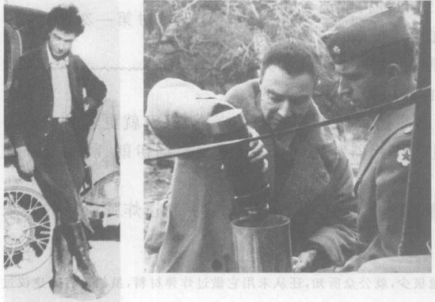

*图 16.17 奥本海默是美国最有才华的物理学家之一，他在政治上属于左翼，是一个有争议的人物。他涉猎广博，敏感，爱好文学。他是设计和制造世界上第一件核武器的实验室的科学负责人。(a) 在 20 世纪 30 年代；(b) 在曼哈顿计划期间。*

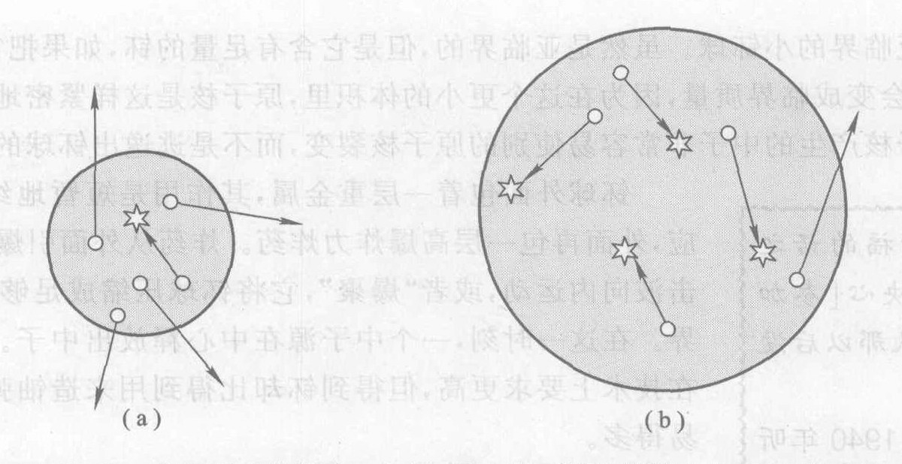

*图 16.18 临界质量的概念。(a) 如果一块可裂变材料太小，那么裂变时发射的大部分中子将逃逸出可裂变材料的表面而不打中任何原子核，链式反应不能维持；(b) 但是如果材料团块足够大，那么大部分中子在逃出表面之前将击中别的原子核，触发一个链式反应。*

世界上第一枚铀弹选用的设计是如此直截了当，以致在使用之前用不着对它进行试验 [图 16.19(a)]。高爆炸力的炸药把一环低于临界质量的 $^{235}\text{U}$ 猛然撞入另一块低于临界质量的 $^{235}\text{U}$，使之达到或超过临界质量；同时，中子对这一铀块进行簇射，启动链式反应。这里就得到一个关于核扩散的教训：一个国家只要不尝试试验就可以拥有一颗铀弹。一群人只要能够生产、买到或偷得足够量的高度浓集的铀，制造一颗粗糙然而可靠的铀弹并不是太难的事。

但是铀弹选用的这种简单设计的效率不高：它需要 42 kg 珍贵的高度浓集的铀，几乎是最小的临界质量的两倍。钚弹选用了一种效率更高也更精巧的设计 [图 16.19(b)]。在炸弹中心是一个进临界质量的小钚球。虽然它是亚临界的，但是它含有足量的钚，如果把它压缩为更小得多的体积，它就会变成临界质量，因为在这个更小的体积里，原子核是这样紧密地堆集在一起，以致一个裂变的原子核产生的中子非常容易使别的原子核裂变，而不是逃逸出钚球的边界。

钚球外面包着一层重金属，其作用是短暂地约束从而加强反应，外面再包一层高爆炸力炸药。炸药从外面引爆，爆炸物质的冲击波向内运动，或者“爆聚”，它将钚球压缩成足够小，使之变成临界。在这一时刻，一个中子源在中心释放出中子。虽然这种设计在技术上要求更高，但得到钚比得到用来制造铀弹的高浓集铀容易得多。

> **听了罗斯福的话之后，我就下定决心[参加武器研究]，从那以后没在有变过。**
> ——特勒，1940 年听了罗斯福的演说之后

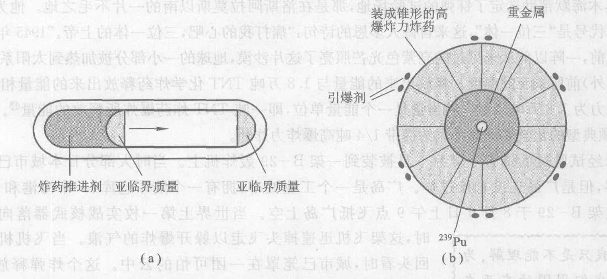

*图 16.19 裂变炸弹设计简图。(a) 在投在广岛的枪式炸弹中，普通的炸药推进剂把一块小于临界质量的 $^{235}\text{U}$ 沿着管子猛然推进另一块小于临界质量的 $^{235}\text{U}$ 中，生成大于临界质量的 $^{235}\text{U}$ 块，开始链式反应；(b) 在丢到长崎的内爆式炸弹中，普通的炸药爆炸向内挤压一团 $^{239}\text{Pu}$，把它压缩到足够程度，使一团小于临界质量的 $^{239}\text{Pu}$ 变成大于临界质量。*

1944 年年底，高浓集铀开始运到洛斯阿拉莫斯，到下一年夏天，其数量已足以制造一颗铀弹。1945 年 5 月前，也运来了足够的钚，可以为制造钚弹进行最后的临界质量实验。

1945 年 5 月，德国投降了。美国这时才得知，德国在这场战争中一直试图发展核武器，但是从未接近其目标。尽管对德国原子弹的担心曾是曼哈顿计划的最初推动力，然而德国投降后美国并没有把这个计划停下来。这里我们得到一些教训：科学家一旦发现某件事是可以做成的，就常常会有一种动力、一种技术义务推动我们去做它。一个计划一旦启动，就常常会发展出一个自我激励的技术势头。另一方面，的确也有充足的理由继续发展核炸弹：日本仍是一个顽抗的敌人，核武器有可能缩短战争，挽救生命。

奥本海默帮助选定了钚弹的试验场地，那是在洛斯阿拉莫斯以南的一片不毛之地。他为那个地方取的代号是“三位一体”，这来自诗人多恩的诗句：“痛打我的心吧，三位一体的上帝。” 1945 年 7 月 16 日黎明前，一阵以前从未见过的亮紫色光芒照亮了这片沙漠，地球的一小部分被加热到太阳系中（除太阳中心外）前所未有的温度。释放出来的能量与 1.8 万吨 TNT 化学炸药释放出来的能量相同，或者说其威力为 1.8 万吨当量。吨当量是一个能量单位，即一吨 TNT 炸药爆炸所释放的能量。为了比较，一颗典型的化学炸弹大约携带 1/4 吨高爆炸力炸药。

未经试验过的铀弹于 8 月 5 日被装到一架 B-29 轰炸机上。当时大部分日本城市已经被炸成灰烬，但是广岛还没有挨过炸。广岛是一个工业城市，拥有一个陆军仓库、一个海港和 40 万居民。这架 B-29 于 8 月 6 日上午 9 点飞抵广岛上空。当世界第一枚实战核武器向其目标落下时，这架飞机迅速掉头飞走以躲开爆炸的气浪。当飞机机组人员回头看时，城市已笼罩在一团可怕的云中。这个炸弹释放出 1.2 万吨当量的核能，14 万人当场死亡，受伤的人数也有这么多；整个跨度为 5 km 的城市变成一片废墟（图 16.20）。到 1950 年，死亡数字已达 20 万人，占广岛总人口的 50%。

> **我只是不能理解，为什么我们周围的东西在一瞬间就发生了这么大的变化……我想这可能就是……地球的崩演，据说在世界末日会发生这种事。**
> ——大田洋子，日本作家和广岛的幸存者

战争仍在继续。日本领导层内部就是否应该马上投降展开了激烈的争论。结束了对德作战的苏联进军中国东北，对日本宣战。8 月 9 日，即轰炸广岛后三天，美国投下了它的钚弹。这一次的目标是长崎，这座城市比广岛小一些。这颗炸弹释放出 2.2 万吨当量的能量，当场炸死 7 万人，到 1950 年，总的死亡人数为 14 万人，死亡率仍是 50%。

1945 年 8 月 14 日，日本投降了。

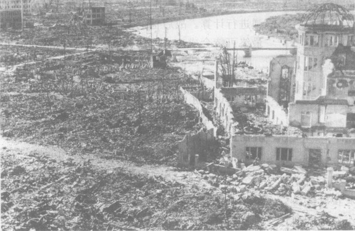

*图 16.20 广岛，1945 年 8 月。投下的铀弹释放出 1.2 万吨当量的核能，14 万人当场死亡，受伤的人数相同，整个 5 km 跨度的城市化为一片废墟。到 1950 年，死亡数字已达到 20 万人，占总人口的 50%。*

> **我们认为投掷这种炸弹是极其重要的。我们刚刚在冲绳经历了痛苦的经验……人们曾预料在日本本土的抵抗将更加严酷。我们曾在东京一个晚上用[常规]炸弹炸死 10 万人，而它似乎不起什么作用。因此这就显得非常必要：我们是否能让他们震惊和猛醒，赶快采取行动。我们必须结束这场战争；我们必须拯救美国人的生命。**
> ——马歇尔将军，美国“马歇尔计划”的起草人

> **概念检查 10** 要用高爆炸力的化学炸药炸弹来得到丢在长崎的那颗核弹的爆炸威力，这些化学炸弹要用多少架二次大战时的重型轰炸机（每架可载 5 吨炸弹）来装载？(a) 500 架至 1 000 架之间；(b) 1 000 架至 2 000 架之间；(c) 2 000 架至 4 000 架之间；(d) 4 000 架至 6 000 架之间；(e) 多于 6 000 架。

---

## 16.7 聚变武器：地球上的天火

二次大战后，美苏之间的“冷战”几乎立即开始。苏联物理学家像苏联以外的科学界一样，早在 1939 年初就得知了核裂变，并且在 1940 年他们自己得出结论，在铀中可以建立起链式反应。在战争期间，有 50 名以上苏联科学家家为同位素分离和设计铀弹与钚弹工作；对广岛和长崎的轰炸只是使他们加倍努力。苏联于 1946 年在反应堆里实现了链式反应，并在 1949 年，试爆了一颗裂变炸弹。⑬

⑬ *1942 年至 1943 年在洛斯阿拉莫斯做研究的物理学家 K. 富克斯后来承认他是一个苏联间谍。他的情报可能将苏联的裂变炸弹计划缩短了一两年。富克斯也提供了美国的聚变炸弹研究的情报，但是这方面的情报可能实际上延误了苏联的聚变武器计划，因为直至 1951 年美国的聚变研究是沿着一条错误的路线。*

1941 年，特勒开始以氢聚变为释放核能的能量为基础的炸弹进行计算。战后他的聚变小组扩大了，到 1949 年，看来他们最终可能会成功。但是美国还没有决定是否要制造聚变武器。

随着冷战的紧张局势加剧而来的 1949 年苏联裂变炸弹试验，向美国提出了警告。杜鲁门总统和一个小圈子里的官员和科学家讨论了美国是否要竭尽全力制造出氢弹，或聚变炸弹。他们的担心与早先对德国的担心相似：苏联有可能先造出制胜的武器。杜鲁门确信这是不可容忍的，他于 1950 年决定发展聚变炸弹。按奥本海默的说法，在 1950 年美国的聚变炸弹计划还是“一件使人困惑的事，你可以热烈争论它，但没有多大的技术意义”。但是在 1951 年，数学家乌拉姆提出了一个巧妙的新想法，一举解决了这个计划的许多问题。奥本海默在一篇有关高技术的魅力的揭示性评论中说：“到 1951 年，这个计划在技术上是如此完美，以致对它已不可能有争论了。”

1952 年 10 月，美国爆炸了世界上第一个热核聚变装置。像在太阳中心所发生的一样，两个氢原子核产生生成氦。在这个及其他一切聚变武器中，所用的氢同位素是 $^2\text{H}$ 和稀少的放射性同位素 $^3\text{H}$，因为这些同位素在较低的、更易达到的温度下就能够发生聚变，而不像在太阳中 $^1\text{H}$ 和 $^2\text{H}$ 发生聚变那样需要更高的温度。你可能会猜，这个聚变反应应该生成 $^5\text{He}$，但是 $^5\text{He}$ 是一个很不稳定的同位素，因此，这个反应生成的是 $^4\text{He}$ 加一个自由中子：
$$ ^2\text{H} + ^3\text{H} \longrightarrow ^4\text{He} + n $$
图 16.21 是氢弹的工作原理图。为了把氢燃料加热到聚变点火所需的几百万开的高温，用一个内爆式裂变炸弹作为“起爆器”。裂变炸弹发出的高温 X 射线迅速把氢加热到聚变温度。乌拉姆的想法是，这样以光速进行的 X 射线，就可以在起爆器的爆炸气浪到达氢燃料并把它吹散之的短智时间里（不到若干分之一秒）先到达氢燃料并把它加热到发生聚变的温度。在乌拉姆于 1951 年做出这一贡献之前的 10 年里，裂变起爆器和聚变燃料是裹在一起装在一个大球里，这很容易在发生聚变之前就被裂变爆炸的气浪推毁。在这个设计中的几处地方使用了方便的天然铀。在氢发生聚变时所存在的热条件下，即使天然铀也可以发生裂变，从而产生更大的爆炸气浪和更多的放射性尘埃。

不能用大于临界质量的铀块来做裂变炸弹，因为这样的质量会迅速自发爆炸。这使得难以设计威力很大的裂变武器。但是聚变武器却没有天然的上限，因为氢燃料不会自发爆炸。世界上第一次聚变爆炸的能量输出是 1 000 万吨当量，即相当于 1 000 万吨 TNT。这是广岛原子弹释放的能量的 1 000 倍，或整个第二次世界大战中全部作战人员所投的爆炸能量的两倍！

> **在某种粗糙的意义上——这不是粗俗的笑话、幽默和夸其谈可以冲淡的——物理学家体验到了什么是罪孽；这种体验他们是丢不掉的。**
> ——奥本海默, 1947

> **当看到某件事在技术上是完美的时，人们就去做它；只有在取得了技术成功之后，人们才会争论是否该做这件事。**
> ——奥本海默

> **我们的用意是好。**
> ——物理学家拉比，1983 年在洛斯阿拉莫斯武器实验室成立 40 周年纪念会上的演说题目

> **甚至可以说，军备竞赛是用纯技术方法解决社会问题这种机械论希望的一次全球性的示威。这里我们再次看到强力的无用，但有关各方却为此付出了太大的代价。**
> ——卡皮察，物理学家，前苏联物理学会会长

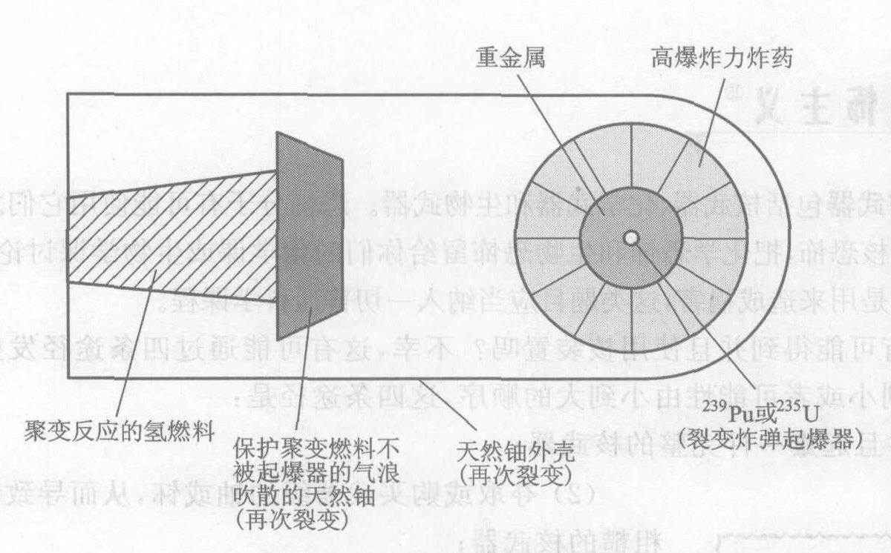

*图 16.21 聚变炸弹的设计。*
*(包含：聚变反应的氢燃料、天然铀外壳(再次裂变)、裂变炸弹起爆器)*

苏联聚变试弹试爆的成功和有关美国政府正在考虑聚变武器计划的报道促使苏联迅速推进其聚变武器计划。1955 年 1 月，苏联也试验了一颗热核聚变炸弹。我们在这里再一次看到**作用—反作用循环**。只要各国感到自己的安全受到威胁，这个危险而昂贵的过程就难以控制。

从任何尺度来看，美苏之间的核军备竞赛的规模都是非常极端的。到 20 世纪 80 年代中期，双方的每一方都拥有大约 25 000 件核武器，足以摧毁对方运转着的社会好几百次。每一方持有自己的武器，都是出于担心：如果对方占显著优势，不知他们会干出什么事来。每一方的武器库都是为了威慑对方，使之不敢发动攻击。随便哪一方的武器存量的任何显著增加，总会导致另一方的武器存量更加过头的增加。核威慑政策的成功之处，是有助于确保在大约 1947 年到 1989 年的整个冷战期间在美国和苏联之间既没有爆发常规战争也没有爆发核战争。而且，值得注意的是，在广岛和长崎被摧毁以来的 60 年中，没有一件核武器被用作战争武器而起爆。今天美国和俄罗斯每一方仍然持有大约 8 000 枚可以立即使用的核武器，还有几千枚处于各种准备就绪阶段的核武器在储备中。它们的大部分都大得足以摧毁一个像纽约或莫斯科这样的大城市的市中心。

**作出估计** 百万吨当量有多大？估计要运运 100 万吨 TNT 炸药，需要多少辆高速公路载重卡车（载重 30 吨）？载运这一单货物的卡车在高速公路上排成一队有多长？如果是 1 000 万吨 TNT 呢？

> **黑暗时代可能乘着科学的闪光翅膀回来。**
> ——丘吉尔，二次大战时的英国首相

> **一个没有核武器的世界对我们所有人都是更不稳定的和更危险的。**
> ——撒切尔夫人，1979 年至 1990 年期间的英国首相

> **对人本身及其命运的关心，必须永远是一切技术努力的主要宗旨……以使我们心灵的创造成为人类的福祉而不是祸害。绝对不要迷失在你的图形和方程式中而忘记了这一点。**
> ——爱因斯坦

---

## 16.8 核恐怖主义

大规模杀伤武器包括核武器、化学武器和生物武器。恐怖分子有可能使用它们之中的任何一种。我在这里只讨论核恐怖，把化学恐怖和生物恐怖留给你们的化学课或生物学课讨论。为了使科学用于人类福祉而不是用来造成祸害，这类题目应当纳入一切普通科学课程。

恐怖分子有可能得到并且使用核武器吗？不幸，这有可能通过四条途径发生。按照造成破坏的程度由大到小或者可能性由小到大的顺序，这四条途径是：

(1) 夺取并且起爆一件完整的核武器；
(2) 夺取或购买武器级的铀或钚，从而导致制造和起爆一件粗糙的核武器；
(3) 破坏核电站和其他核设备，释放出放射性；
(4) 得到放射性材料，从而导致制造和起爆一枚脏弹——用常规炸药炸爆的炸弹，但是其造成的破坏主要是由于放射性材料的弥散。

**夺取一枚炸弹** 现在还没有已经证实的偷盗一件核武器的个案，但是有着有超过 30 000 件核武器分布在 9 个国家的情况，下一个恐怖主义组织购买或者偷到其中一件是有可能的。例如，虽然巴基斯坦总统穆沙拉夫支持美国反对恐怖主义的战争，却不可能知道有多少秘密的恐怖分子潜藏在他的国家的军事组织中，以及他们有多大的可能接近巴基斯坦的大约 50 件核武器。没有这些“内部”的人的帮助，恐怖组织将会发现，在正常情况下，要窃取一件核武器是极其困难的。但是恐怖分子可能利用一个衰败的核国家的无政府状态或革命动荡局势来取得对核武器的控制。例如，据传前苏联总统戈尔巴乔夫在 1991 年的一次反对他的政变企图中被他的反对者切断了通信环节，从而失去了对他的国家的核武库的控制。恐怖分子一旦得到一枚炸弹后，还必须面对一些进一步的障碍，如如何制服大部分核武器中都要装的防止非授权使用的器件、如何把核武器运送到目的地、如何触发这个炸弹等。从上面两节已经知道，这枚核炸弹可以把一个大城市的中心夷为平地。

**夺取炸弹燃料** 在全世界的几百个地方存有大约 1 700 吨武器级的铀和 500 吨武器级的钚，它们大部分是在美国和俄罗斯。这足以制造大约 60 000 枚各种类型的核炸弹。这些武器级燃料的大约一半已装在核武器中，是不太可能被恐怖分子购买或被盗窃的（见上），但是剩下的尚未武器化的部分的安全就很难保证了。过去十年中已有若干案例，涉及非法买卖少量的这种材料。虽然还没有一件接近制造一枚核炸弹所需的 25 kg 高度浓集的铀或 8 kg 高度浓集的钚的数量，但是恐怖组织现在可能已经拥有这么多的核燃料。恐怖分子可能获得核燃料的地方有以下三处：
*   在俄罗斯有多处存放核燃料的地方未得到适当的安全保障；
*   巴基斯坦，恐怖分子可以利用那里不稳定的政治局势和变化无常的忠诚；
*   位于俄罗斯和其他 20 个国家的大约 50 座以高浓集铀为燃料的用来进行核物理研究的反应堆，它们的燃料常是由美国供应的。

美国和其他国家正式试图提高这些地方的安全性，例如，逐步停用以浓集铀为燃料的研究反应堆。一个恐怖集团获得核武器燃料的途径与获得完整的核武器的途径相似：通过政府或军队内部的人的帮助并利用局势的动荡购买或盗窃。因为武器级燃料分散在这么多地方，对它们的保卫又不如对核武器保卫那么严密，恐怖分子得到核燃料要比得到一枚完整的核武器容易。

**破坏核电站** 核电站不会像一枚核炸弹那样爆炸，因为它们使用的低浓集或未浓集的铀燃料不会发生高爆炸力的链式反应（第 17 章）。但是核电站里在核反应堆本身中以及在废燃料储放池中有大量高放射性材料，一次恐怖袭击可能会释放这些材料。还不清楚，一架载有燃料的大飞机的直接冲撞能不能对这些设备打开一个缺口。一次对给水系统的攻击可以阻断电站的活水入口，从而造成“熔塌”事故（第 17 章）或至少使电站停止工作。可以驾驶装满汽车炸弹突袭反应堆或废燃料池，或者从几千米外发射多枚火箭。核电站也容易受到“信息恐怖主义”的攻击——内部的人或外部的计算机黑客对信息和控制系统的破坏。恐怖分子可能会排干废燃料储放池的水，使高放射性燃料升温、燃烧并释放出放射性。美国一切反应堆所执行的安全和保卫措施有助于挫败这些阴谋，但是与核电站内部卧底的人的勾结则使这些攻击更有可能成功。由上述任何一种方法进行的一次成功袭击都可能造成可以与切尔诺贝利事故（第 15 章）相比的辐射泄漏。

**引爆一枚脏弹** 最可能发生、不过造成的破坏最小的一种核恐怖行动的形式，是一个小组甚至单一个人可以把有害的放射性物质放入常规炸弹中，炸弹爆炸会使放射性物质弥散到广大地区。事实上，2002 年据称是基地组织的特工 Jose Padilla 因策划在美国进行脏弹袭击而会被捕，虽然他的炸弹只能散布天然铀，而天然铀的半衰期很长因而放射性水平很低。它造成的更重要的后果是对公众的心理效应。有几百万个放射源分散在全世界各处，不像 Padilla 的铀，这些发射源中有许多的放射性很强，足以构成真实的危险。基地组织和俄国车臣的叛乱分子已经显示了对这些高放射性材料的兴趣。

做脏弹用的放射性材料可以搞到或偷到，不过最简单的方法是以用在数以千计的医学、科研、农业和工业装置中的放射性同位素的名义合法地购买。最有害的材料也有着最宽广的商业用途，很容易买到。

一次脏弹袭击造成的杀伤是由爆炸的气浪和放射性二者所造成。由于放射性材料是被气浪散布的，高放射性区域不太可能超出被气浪摧毁的区域之外。因此造成的伤亡人数与通常的炸弹如汽车炸弹造成的伤亡人数相当，很少或没有因人辐射而死亡。但是它造成的经济损失可能是巨大的，因为在广大的非致命的低水平辐射区域内经济活动会被迫停下来；因为清除污染的花费很大且要很多年；并且因为袭击将引起普遍的恐慌，即使辐射危险可能并不高。

> **好也罢，坏也罢，世界进入了一个新的核时代，在这个时代里我们面对着非常不同的核威胁。**
> ——美国参议员 Richard Lugar 和 Sam Nunn，引自 C.Ferguson 和 W.Potter 所著 The Four Faces of Nuclear Terrorism 一书的前言

> **美国必须对保护其境外裂变材料的政策作根本的修订：把高浓集铀的安全确保、集中管理和消弹扩散作为最优先最紧迫的任务。和同属高危险的核原料钚相比，对高浓集铀的这一优先对策很明显更为迫切。**
> ——C. Ferguson 和 W. Potter，引自他们的书 The Four Faces of Nuclear Terrorism

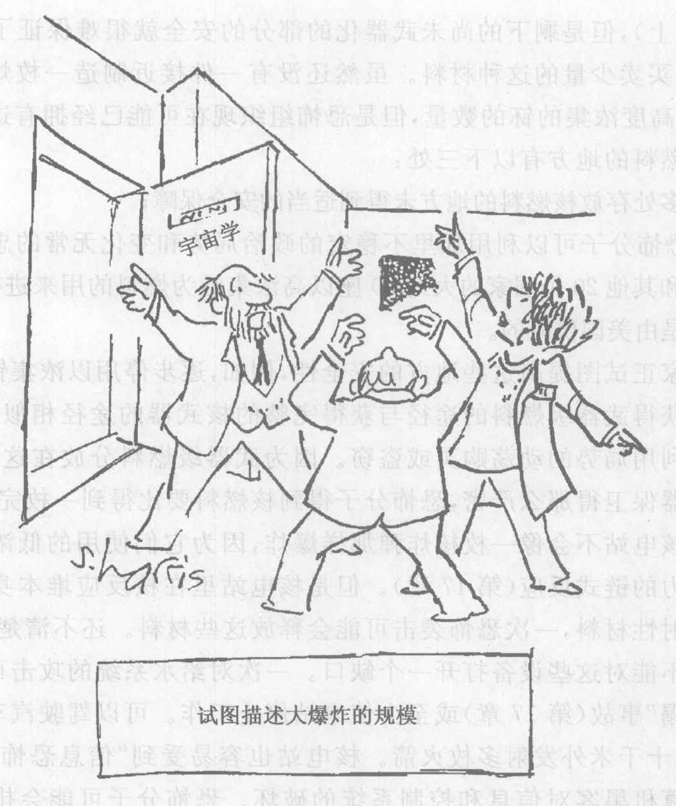

---

> **概念检查答案**
> 1. 为了把质子和中子分开，必须对它们做功，因 (d)。
> 2. 此系统的能量增加了，(a)。
> 3. (e)。
> 4. 原子序数为 4，这是铍，(c)。
> 5. (a)。
> 6. (d)。
> 7. 原子量增加 3，原子序数增加 2，(c)。
> 8. 原子序数是 92 - 56 = 36，这是氪，(b)。
> 9. 它们相差 238 分之 3 (238 - 235 = 3)，或 3/238，它比 1% 略大一点，(e)。
> 10. 22 000 吨 / 5 吨 = 4 400, (d)。

### 关键概念

下述概念的定义出现在所标页码的本书正文页面上和书末的按拼音排序的术语词汇中。我们将它们按出现先后顺序排列在这里，你可以用这个清单复习本章内容。

*   核聚变 378
*   核裂变 378
*   核能 378
*   核能的释放 379
*   热核反应 379
*   核能曲线 381
*   大爆炸 382
*   超新星爆发 382
*   裂变碎片 386
*   链式反应 387
*   曼哈顿计划 389
*   裂变炸弹 390
*   核反应堆 390
*   核武器扩散 390
*   同位素分离 391
*   离心分离 391
*   高度浓集的铀 391
*   临界质量 392
*   吨当量 394
*   广岛 394
*   长崎 394
*   聚变炸弹 396
*   作用—反作用循环 397
*   大规模杀伤武器 398
*   脏弹 398
*   夺取一枚炸弹 398
*   夺取炸弹燃料 398
*   破坏核电站 399
*   引爆一枚脏弹 399

### 复习题

**聚变和核能曲线**

1.  给出至少一种聚变反应的反应式。
2.  当 $^{12}\text{C}$ 和 $^4\text{He}$ 发生聚变时生成什么核素？（提示：用周期表）
3.  在放射性衰变中发生什么能量转化？在核聚变中呢？在核裂变中呢？
4.  在四种基本力中，哪些在原子核内是重要的？
5.  分开的一个质子和一个中子，与一个 $^2\text{H}$ 核，何者的核能更多？你是怎么知道的？何者的质量更大？你是怎么知道的？
6.  如果你把一个原子核分成分组成它的质子和中子，它的核能是增加还是减少？或者答案与你从什么原子核出发有关？
7.  假设你把一个原子核分成质量相等的两部分。这个系统的核能是增加还是减少？或者答案与你从什么原子核出发有关？
8.  大致画出核能曲线。关于从聚变或裂变得到有用能量的可能性，这条曲线告诉我们什么？

**元素的起源**

9.  举出在大爆炸中生成的两个元素。
10. 恒星的能量从何而来？
11. 什么是超新星？
12. 周期表中比较轻的元素是怎样生成的？比较重的元素呢？
13. 参见上题。为什么铁在元素生成中居于这样特殊的地位？
14. 构成你的身体的化学元素是在哪里生成的？

**思考题**

**聚变和核能曲线**

1.  写出 $^1\text{H}$ 和 $^1\text{H}$ 聚变的反应式。
2.  写出 $^4_2\text{He}$ 和 $^8_4\text{Be}$ 聚变的反应式。
3.  一个原子核的质量与它的质子和中子的质量之和相比，是更大、相等还是更小？答案依赖于你考虑的是哪个原子核吗？
4.  实物可以被摧毁吗？如果可以，给出一个例子。能量可以被摧毁吗？如果可以，给出一个例子。
5.  从 $^{16}_8\text{O}$ 核中去掉一个 $\alpha$ 粒子。这是聚变的一个例子还是裂变的一个例子？写出这个核反应。这个反应式的哪一边（左边还是右边）有较多的核能？
6.  把一个 $\alpha$ 粒子与一个 $^{16}_8\text{O}$ 核聚合。写出这个核反应的反应式。这个反应式的哪一边（左边还是右边）有较多的核能？
7.  要释放碳的核能，是用聚变，还是裂变，还是二者都不是？释放金的核能呢？释放铁的核能呢？
8.  下面这些过程中，哪些过程中静止质量会由于质能等当原理发生变化？哪些过程中静止质量的变化是可以实际测量的？(a) 加热一杯咖啡；(b) 爆炸一枚聚变弹；(c) 举高一本书；(d) 物质-反物质湮没（第 11.4 节）。
9.  下面这些过程中，哪些过程中静止质量会由于质能等当原理发生变化？哪些过程中静止质量的变化是可以实际测量的？(a) 一座核反应堆的运行；(b) TNT 炸药爆炸；(c) 一枚裂变炸弹爆炸；(d) 扔出一个垒球。
10. 四种基本力中的哪些力把原子核结合在一起？四种力中的哪些力倾向于把原子核分开，即把它分裂成碎片？
11. 在原子核里起作用的力之一是电磁力。这个力是倾向于帮助还是反对核聚变反应的发生？

**元素的起源**

12. 氢核聚变生成更重的原子核仅仅发生在一颗恒星演化历史的后期，当这颗恒星由于部分坍缩而达到更高的温度之后才发生。为什么氦的聚变必须在比氢的聚变所需温度更高的温度下才能发生？
13. 在什么意义上说，一直维持着我们存在的是核聚变释放的能量？
14. 1987 年看到的超新星爆发发生在离我们 180 000 光年的一个星系中。它实际发生在什么时候？
15. 1987 年超新星在爆发之前，通过聚变生成了许多元素。在一个反应中，$^{12}\text{C}$ 和 $^4\text{He}$ 聚合。这个反应生成什么原子核？这个反应释放核能吗？
16. 1987 年超新星爆发之前的另一个反应是两个 $^{12}\text{C}$ 核的聚合。这个反应生成什么原子核？这个反应释放核能吗？
17. 你身体中的原子有可能是在太阳中生成的吗？加以说明。
18. 你身体中的原子有可能是由北极星生成的吗？加以说明。

**裂变和链式反应**

19. 一个中子打中一个 $^{235}\text{U}$ 原子核并生成钡，所生成的另一个元素是什么？
20. 一个中子打中一个 $^{239}\text{Pu}$ 原子核并生成锶，所生成的另一个元素是什么？
21. 举出燃烧和裂变之间的至少一个相似之处。举出至少一个不同之处。
22. 举出一个链式核反应点燃和焚烧一张纸的相似之处和不同之处。
23. 当一个 $^{235}\text{U}$ 原子核被一个中子打中时，它分裂为一个较大的碎片，并发射 2 至 4 个中子。典型的一对碎片是 $^{144}_{56}\text{Ba}$ 和 $^{89}_{36}\text{Kr}$。写出这个反应的反应式，其中包括进人这个反应和由这个反应生成的同位素和其他粒子。
24. 为什么在 $^{235}\text{U}$ 中能够发生链式反应而在 $^{238}\text{U}$ 中不能发生？
25. 给出两个理由，说明为什么使宏观数量的 $^{235}\text{U}$ 发生裂变比使宏观数量的 $^{14}\text{N}$ 发生裂变容易。
26. 为了用最少量的材料得到效率最高的链式反应，裂变材料应当取什么形状：柱形还是球形？为什么？
27. 你预期在天然铀矿中有可能发生链式反应吗？为什么或为什么不？

**核武器**

28. 钚是放射性的吗？为你的答案给出理由。
29. 天然的金属铀能自发爆炸吗？为什么？
30. 在一种裂变时不发射中子的材料中有可能发生链式反应吗？
31. 氢弹的聚变能来自 $^2\text{H}$ 和 $^3\text{H}$ 的聚变。这个反应的产物之一是一个 $\alpha$ 粒子。写出完整的核反应式。

**核恐怖主义**

32. 恐怖分子有可能制造的是哪一种核炸弹？他们需要哪种特殊材料以制造它？
33. 恐怖分子能够使一座核电站像一枚核炸弹一样爆炸吗？加以说明。
34. 最可能发生的是哪种核恐怖行动，它可能造成多大的损害？

### 习题

**裂变和链式反应**

1.  $^{235}\text{U}$ 发生裂变时损失其静止质量的大约 1%。假设有 10 kg $^{235}\text{U}$ 发生裂变。损失多少静止质量？释放多少核能？
2.  作出估计。一座大型核电站的发电功率大约是 1 000 MW，或 $10^9$ J/s。这个能量来自 $^{235}\text{U}$。1 天里大约将消失多少静止质量？
3.  在上题中，假设电能来自一座烧煤的火力发电厂而不是核电站，功率仍为 1 000 MW。这会改变上题的答案吗？说明理由。

**裂变武器和聚变武器**

4.  由于 1 吨当量 $= 4.2 \times 10^9$ J，一颗 15 000 吨当量的原子弹爆炸时有多少静止质量消失？一颗 1 500 万吨当量的氢弹爆炸时有多少静止质量消失？
5.  一颗 15 000 吨当量的原子弹的能量（上题）能够将美国的总人口抬升多高？假设美国的人口为 3 亿人，平均重量为人每人 600 N (质量为 60 kg)。一颗 1 500 万吨当量的氢弹的能量能够将美国的人口抬升多高？
6.  假设一颗 100 万吨当量 ($4.2 \times 10^{15}$ J) 的聚变炸弹释放的全部能量都用来把人们升到 1 600 m 的高度（科罗拉多州丹佛城的海拔高度）。这大约可以抬升多少人？这是地球总人口的多少分之一？（我们从第 6 章还记得，引力能 = 重量 $\times$ 高度。你需要估计平均每个人的体重是多少牛顿。）