# 第 17 章 能量的挑战

> 我国对能量问题安于现状的态度是危险的。波斯湾地区之外的低成本石油资源即将耗尽。与能量相关的城市空气污染已经在世界范围内对人类的健康构成威胁。二氧化碳（以及）其他温室气体正在不断地增加……引进非化石燃料能源和各种各样提高能量效率的技术已经使我们改进了能量安全，降低了环境压力。在这个全球能量需求不断增长的年代，这样的改革行动必须坚持下去。
> ——美国物理学会的报告，1996年5月

要使一个物体在物理状态上有改变，必须在一段距离上对这个物体施力——换句话说你必须做功。于是，能量（做功的本领）在社会生活中的基础作用就不奇怪了，尤其是在今天，世界人口正在迅速增加，技术正在迅猛发展，多种事物处于变化之中。事实上，简直就说不清，当代社会究竟在多大程度上依赖人类肌肉的能量之外的各种天然能源。作为一个练习，请你尽可能多地列出你想得起来的上个星期你使用过的耗能物品。

时间到，别写了。

下面是我用过的一些东西：小汽车、空调、白炽灯、电冰箱、电视机、计算机、烤面包片器、蜡烛、电扇、报纸（纸张、印刷、投递）、食物（生长、加工、包装、运输）、衣服（缝制、运输）、热水、冷水（供水、废水处理），等等。我们的整个生活方式都依赖于能够以合理的价格获得能源。

根据美国物理学会上面这个报告，关于今日的能量使用情况在未来几十年里能否持续下去，存在着一些问题。一种做法或者政策，如果既符合今日人们的需要，又不危及未来几代人的前景，它就是可持续的。我们还记得，在第6章（第6.7节）说过，今天每度电8美分的能量价格是非常便宜的，哪怕价格提高到10倍，仍然非常便宜。但是，随着世界人口的增长，随着中国和印度这样的国家的发展，随着世界化石燃料资源的衰减，以及随着全球变暖的加剧，我们还能继续大量消费便宜的能量吗？由于我们的能量大约 85% 依赖于化石燃料，而正是化石燃料变得越来越成问题，我们现行的能量方针看起来是越来越持续不下去了。因此，我们正处于或接近转折的关键时刻：能量的未来将与它的过去有显著的差别。

构建什么样的未来要由我们来定。我们可以选择一条通向和平、健康与繁荣的可持续发展的道路，也可以选择依然维持现行的不可持续的政策，从而陷入冲突、环境破坏和贫穷。我们在第7章（第7.5至第7.8节）和第9章（第9.6节）中已经讨论过与上述选择有关的一些能量方面的问题。本章继续这一讨论。

第17.1节对能量使用的历史先作一个长期的观察，再作一个短期的观察。第17.2节考察我们的现况，并概述我们未来的可能选择。关键的问题是传统的不可再生能源（天然气、石油、煤与核能）和可再生能源（特别是太阳能）之间的权衡与能量效率。第17.3、第17.4和第17.5节考察不可再生能源，特别是核能与煤。第17.3节研究核能如何工作，第17.4节对核能与煤作了比较评价，第17.5节考虑有关核能的一些问题。第17.6节探索可再生能源的物理学问题，也讨论了一点经济学问题。最后，第17.7节考察关于能量效率的迷人的物理学和一点点经济学。

个人声明：大部分学习能量课题的学生都对这个问题形成了自己的观点，我也不例外。不过，我已经尽一切努力来克制自己不要宣扬自己的观点，而是公平地介绍一切合理的意见。比如，我在本书中着重介绍了核能，但是不要因此就认为我对核能特别友善或特别敌视。相反，我试图着重介绍的是那些对能量的未来具有重大意义的题目，以及那些物理味道较强的题目。①

*① 当前有关能量信息的一个来源是美国能源部的信息局，其网址是 http://www.eia.doe.gov。*

## 17.1 能量简史

在决定下一步的走向之前，先了解一下你现在身在何处是明智的。图17.1 高度示意性地画出人类使用能量的600万年历史，图中画的是每个人的日能耗的近似值（以MJ为单位）随时代的变化。石器时代文明和现代文明的种种差别都与组织能量做功的不同方式有关。最早的人类只用自身肌肉内的能量，这种能量通过食物的氧化而得到。一个普通人每天用大约 2000 大卡或 8 兆焦（8 MJ）能量做功，大约相当于连续点亮一只 100 W 的白炽灯。

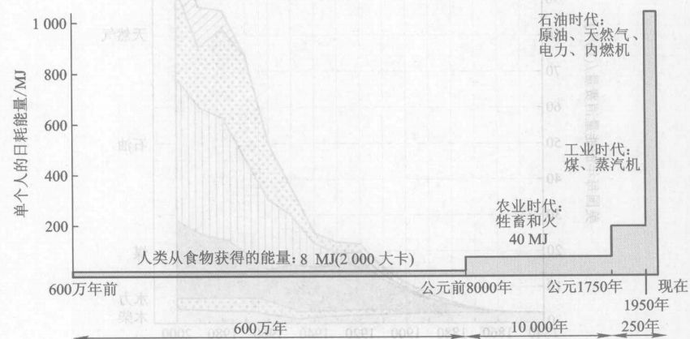

*图 17.1 使用能源的简史：单个人的日耗能量与大致的时代的关系。注意时间轴不是按比例画的。前农业时代持续的时间是农业时代的600倍，而农业时代是工业时代的40倍。虽然在这个简略图中没有指出，人类大约在100万年前首次开始使用火。*

虽然在图 17.1 中没有指出，人类大约在 100 万年前开始用火。大约 1 万年前，人类开始使用牲畜的化学能做功，这促使人类文明进入农业时代。牲畜和火使一个人做功的能量增加到从前的五倍，即每天 40 MJ，相当于点只 100 W 的白炽灯。

煤是一种化石燃料。用煤做燃料的热机在 1750 年前后开始了工业时代。化石燃料包括煤、石油和天然气，它使工业化国家的人所用的能量再增加到五倍，达到每天大约 200 MJ，相当于点亮 25 只 100 W 的白炽灯。

最近 60 年，对化石燃料热机的大量使用（主要用于运输和供电，见第 7 章）已经把工业化国家的能量使用量再升高到五倍，达到每人每日 1 000 MJ，相当于连续点亮 125 只 100 W 的白炽灯。换个说法就是，如果这 1 000 MJ 全部用来升高物体，它可以将一个重 600 N 的普通人升高 1 700 km！我们当前在日常生活中使用巨额的能量，因为我们购买能量的费用非常便宜。8美分就能够买 1 度电，这些能量足以将一个人从海平面升高到海拔 6 000 m！

图 17.2 只对美国更详细地画出了更短期的能量使用情况图。图中画出美国在 1840—2000 年期间每年消耗的能量，以艾焦 (EJ) ($1\ \text{EJ} = 10^{18}\ \text{J}$) 为单位。标着木柴、水力、煤、石油、天然气与核能的各部分分别代表由这种能源提供的能量，上边界表示由全部六种能源提供的总能量。注意从 1880 年以来化石燃料的增长，从二次大战后（1945年）以来石油和天然气使用的迅速增长，以及能量消费的巨大的加速增长。在图中显示的 160 年中，这个国家的人口增长到 10 倍（图 17.1），而人均耗能增加到 5 倍，因此，总能耗增加到原来的 50 倍。

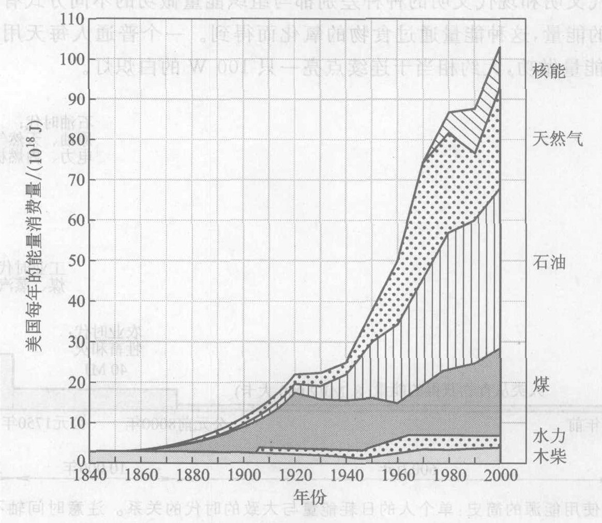

*图 17.2 1840—2000年美国的能量使用历史：每年各种能源的总消费量。*

由于图 17.2 中的四种主要能源都是“不可再生的”，即有限的，因此，我们想要维持图中及其巨大的能量消费增长的能力存在着严重的问题，就不足为奇了。

> **概念检查 1** 美国大约在哪一年从石油和天然气获得的能量开始超过从煤中获得的能量？
> (a) 1880; (b) 1910; (c) 1930; (d) 1950; (e) 1970。

> **概念检查 2** 1900—2000年期间，美国能量消费增加的倍数大约等于 (a) 4; (b) 8; (c) 15; (d) 50; (e) 100。

> **概念检查 3** 美国在 1960 年用了大约多少天然气？(a) $15 \times 10^{18}\ \text{J}$; (b) $35 \times 10^{18}\ \text{J}$; (c) $50 \times 10^{18}\ \text{J}$; (d) $20 \times 10^{18}\ \text{J}$。

**作出估计** 用图 17.2 大致核对图 17.1 中所示的从 1950 年到 2000 年这段时期的估计。在这期间美国人口为 2.75 亿。②

## 17.2 今天和明天的能量使用

图 17.3 表示美国的能量消费在六种主要能源之间的分布，其历史已见图 17.2。化石能源几乎提供了全部能量消费，核能、木柴和水电资源的贡献不大。图 17.4 是一个能流图，它显示美国消费的能量在国民经济中是如何流动的：从六种初级能源进入三个主要经济部门（工业、家用和商业、运输业）。三分之一多一点的能量用来发电，然后输送给上述三个部门，另外三分之二的能量则直接用到这三个部门。水力资源、核能和煤主要用于发电，石油、天然气和木柴则主要用于非电用途。

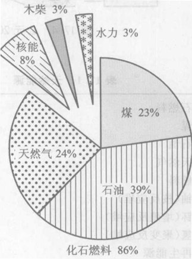

*图 17.3 今日美国能源的组成*

图 17.4 反映了能量的两条重要原理。我们从能流（图中的“管道”宽度和所标数字）彼此相配的事实中看到了能量守恒定律：流进的能量永远等于流出的能量。我们还从能量转化中看到了热力学第二定律：102 EJ（EJ 是艾焦的符号，1 EJ = $10^{18}$ J）的高品质能量转换成 67 EJ 废热和仅仅 35 EJ 有用能。第二定律对热机效率的严格限制还表现在发电行业和交通运输业的较低的效率，这两行业主要是以热机为动力的（解释见第 7 章）。

前面讲到，我们正在面临能量历史上的一个转折的时刻。现行的能量模式可能会发生很大的改变，因为能源枯竭和环境问题（特别是全球变暖，第 9 章）迫使人们极度减少化石能源的使用。如果这样，我们未来的能量将会是什么呢？

② 2000年美国的年总能量消费约为 $100 \times 10^{18}\ \text{J}$，因此，人均年能量消费为 $\frac{100 \times 10^{18}\ \text{J}}{275 \times 10^6} = 360 \times 10^9\ \text{J}$
每日人均能量消费大约为 $\frac{360 \times 10^9\ \text{J}}{365} \approx 10^9\ \text{J} = 1,000\ \text{MJ}$

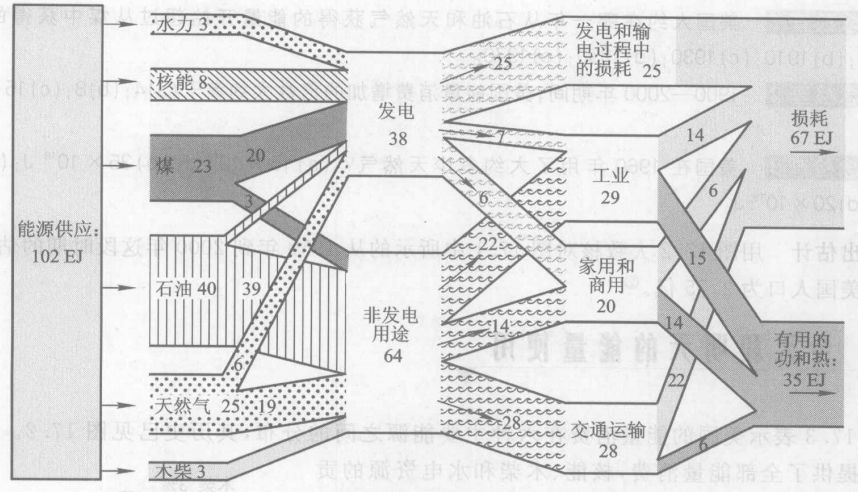

*图 17.4 公元2000年美国经济中的大致能量流，单位为 EJ ($10^{18}$ J)*

**表 17.1 天然能源**

*   **化石燃料**
    *   煤
    *   石油
    *   天然气
*   **核燃料**
    *   铀（核反应堆）
    *   钚（增殖反应堆）
    *   氘（聚变反应堆）
*   **可再生能源**
    *   水力
    *   生物体燃料：木柴和垃圾
    *   从木料（以及煤和天然气）中提取的甲醇
    *   从谷物、草类、糖和甘蔗渣中提取的乙醇
    *   风力
    *   光电池（太阳能电池）
    *   太阳热发电
    *   地热
    *   主动式太阳能加热
    *   被动式太阳能加热
    *   节能（虽然不是天然能源，但起着类似天然能源的作用）提高能量效率虽不改变能量服务质量但改变生活方式以减少能量的使用

为了回答这个重要问题，表 17.1 列出了主要的能源，即含有有用能量的天然资源。

**化石燃料**包括煤、石油和天然气，其中储存着由几亿年沉积的富含能量的动植物残骸的地层生成的化学能。时间和压力使这些生物的残骸转变成巨大的煤层、油田和气田。这是人类对自然环境的影响的一个生动的说明：在烧化石燃料的短短 250 年中（这仅是把这些能量储存到地下所花时间的一百万分之一），我们已经把这些燃料中的许多碳以二氧化碳的形式送回大气中。

**核动力**从原子核获得巨大的能量，它用当今世界上的铀燃料核反应堆提供电力。近 30 年来，这个行业在美国一直都不景气，但在世界范围内它一直在缓慢地发展。在将来，由于化石燃料短缺、不断增长的能量需求和全球变暖，有可能推动这个行业在美国和世界范围迅速发展。将来，核动力可以钚为燃料（使用增殖反应堆，见第 17.5 节），也可以氢为燃料（使用尚待开发的聚变反应堆，见第 17.3 节）。

化石能源和核能源是有限的，或**不可再生的**，其意义为在人类的寿命的期限内它们不能复原。这些能源还能够维持多久是一个重要的问题，特别由于它们在美国全国的能量消费中占了整整 94% 的份额。这不是一个简单的问题。在现实世界里，不可再生的资源绝不会真的完全用尽。而是随着资源的逐渐枯竭，它变得越来越难以开采（从地下挖出），于是产量下降，导致市场短缺，价格上涨。持续短缺和价格逐季上涨最终使这资源变得如此昂贵，以至实际上被淘汰。

因此，重要的问题并不是“这些资源何时会耗尽？”，而是“它的产量何时开始下降？”。在这个时刻之后，这种资源的价格迅速上升，而其用量则下降。从第 7 章图 7.26 中的钟形曲线可以看到，一种不可再生资源，当它原来埋在地下的总储藏量的大约一半被开采出来时，它的产量就到达巅峰值并开始下降。表 17.2 示出几种主要的不可再生能源产量到达巅峰值还有多少时间的估计值。估计值的范围很宽，主要是因为每种资源在地下的剩余储藏量以及对未来的消费需求的增长都不确定。你可以看到，原油和天然气的产量巅峰值也许在不久的将来就会来到，原油甚至可能现在就在产量的巅峰。许多分析家预言，当原油这种供应最紧缺而全世界对它的需求最迫切的化石燃料的产量达到巅峰并开始下降时，经济将出现严重的动乱。

> 从核聚变获得能量的日子离今天可能还要 50 年，不过在那之前我们通过不需要它。但是，到那时我们就需要它了。这是因为：它的燃料丰富和产生的能量的高密度、不会释放出碳、低放射性、不会发生爆炸和核扩散的风险低。
> ——R. Goldston, 普林斯顿等离子体物理实验室主任

**我们怎么知道原油的产量何时会达到巅峰？** 与前面提出的“我们怎么知道”问题不同，这对这个大问题的简短回答是我们不知道。石油悲观论者（大多数以前是石油公司的地质学家，现在说出了自己的意见）认为，原油的产量将在 2010 年前到达巅峰。他们这个结论的依据是：以中国和印度为首的世界范围的越来越大的需求；供应者没有能力满足这种需求，越来越贵的油价就证实了这一点；波斯湾以外地区的石油生产国产量下降；并且有迹象表明即使在波斯湾地区，石油产量也可能正在接近巅峰。假如这些石油悲观论者的论断是对的，那么，原油产量很快就会跟不上需求的步伐，价格将迅速上涨，使我们以石油为基础的能源经济体系发生各种根本性的改变，包括我们的运输系统和以小汽车为基础的生活方式都将发生巨大的改变。

**表 17.2 假定消费量以每年 1%~2% 的增长率增长，不可再生能源的全球生产量在多少年后将开始下降。更准确地说，这是一个产量到达“巅峰”的年限，此后这种能源供给将处于短缺状态，预期价格将迅速上涨**

| 能源 | 年限 | 能源 | 年限 |
| :--- | :--- | :--- | :--- |
| 煤 | 几百年 | 原油 | 0~40 |
| 天然气 | 10~60 | 铀$^a$ | 60~200 |

*注：a 不包括增殖反应堆。*

另一方面，石油乐天派（大多数是专门研究天然能源问题的经济学家）则认为，原油产量更多地依赖于经济和政治，而不是地下的实际储藏量。他们相信，各种技术创新（如新的钻探技术、深海钻探、从沥青砂和页岩中提取石油等）将会起作用；他们相信石油的产量将会继续增加，而价格则会保持相对稳定。即使乐天派给出的原油产量到达巅峰值的年限也只有 40 年左右。

底线是，不论你接受悲观论者的论断还是乐天派的观点，不论我们对全球变暖和其他环境方面的挑战做些什么，我们这个时代正处于或接近石油时代的终结。

> 环境问题中最困难的部分是能量，而能量问题中最困难的部分是环境。扩展与持续的经济繁荣带来的挑战的核心，是以能够承受的代价限制不断增长的能源供给对环境的冲击。在能源——繁荣的挑战中要求最苛刻的部分就是由人类引起的气候变化提出的挑战……我们将看到，这是人类的活动对环境的冲击中最难以处理的事情。
> ——J. Holdren, 物理学家，哈佛大学约翰·肯尼迪行政学院科学技术与公共政策项目负责人。

**可再生能源**（第 17.6 节将对它们作更多的讨论）是指那些能够立刻或至少在人类寿命的期限内得到补充的能源。尽管可再生能源在当今美国能源中只占 6% 这个数量不大但却有意义的分量，但是由于全球变暖、环境污染、化石燃料价格不断上涨以及与石油和天然气有关的国际安全问题的担心，可再生能源的使用正在增加，并将继续不断增加。可再生能源包括两种近几十年广泛使用的能源：用大坝拦截使水位升高带来的**水屯能**和燃烧木柴与垃圾得来的**生物体能**。别的更新的生物体燃料包括从木料中提取的甲醇（木醇）和从玉米、草类、糖类和甘蔗渣中提取的乙醇（酒精）。

**风力**、**光电池**（太阳能电池）、**太阳热能**以及地下的**热能**（地热）都可以发电。今天，地热能得自地下的蒸汽和热水，但是将来它可能得自地热岩石；在地球表面下可以钻探到的深度上有如此之多的炽热岩石，因此通常将地热能源归类为可再生能源，尽管在人类寿命的期限内地热并不能真正得到恢复。最后，**太阳能**可以直接用于采暖和烧水。这既可以采用主动方式，用水泵和风扇使水和空气送到四处；也可以采用被动方式，让太阳光照就是了。

由于我们从化石燃料中获得的能量是如此之多，要实现向可再生能源的转换需要几十年的时间。一些专家预言，这将需要巨大的经济投入，不过别的专家则预言，新技术、能量效率的提高以及牟利动机将会极大地降低成本，甚至有可能使成本“为负”（这就是说，改用可再生能源的成本可能比继续使用化石燃料更低）。

**节能**（减少能量消费）在将来也会更加重要得多。例如，许多分析家认为，美国可以将能量消费减少一半而不伤害经济，因为德国和日本等工业化国家的能量消费就只有美国的能量消费的大约一半（不论是人均能量消费还是国民生产总值中每一美元的能耗）。虽然节能措施实际上并不是一种能源，但它的作用在许多方面就像一种能源一样。节能包括提高能量效率的措施，如住宅的隔热、高效节能照明和节能汽车等，这些措施减少了能量消费但并不降低所提供的服务的质量。节能还包括采用较少耗费能量的生活方式以节省能量，例如，使用公共交通工具代替小汽车、在较小的住宅中居住以及建造更紧凑的社区等。许多研究表明，单单通过提高能量使用效率就能极大降低能量消费，而无需采用改变生活方式这个有争论的办法。我们将在第 17.7 节进一步讨论能量效率的问题。

从 1973 年起，美国开始以比以前高得多的效率使用能量。图 17.5 记载了这件大事。标有“年总能量”的曲线表示该年美国的能量总消费量。图的这些部分与图 17.2 相似。标有“考虑通货膨胀因素后的美国年 GNP”的曲线表示美国全年的年度国民生产总值；即美国全国的商品和服务的年产出总值。图中的 GNP 不是用美元数标出，而是使用这样的标度，即令 1950 年的 GNP 值与总能耗相同。

由于 GNP 是衡量国家经济总产出的尺度，而经济产出又依赖于所消费的能量，因此，我们看到美国 1950—1973 年间的能量消费和 GNP 几乎精确地同步上升就不奇怪了。不过接下来的事有些令人惊讶：1973 年第一次国际石油危机打破了能量消费与工业增长之间的这种密切联系。随着国外原油供应量下降，能量价格急速上涨，美国人通过更高效地使用能量寻求省钱的办法。从图中可以明显看出这次危机及 1979 年第二次石油危机的影响。虽然每次危机后 GNP 都短暂下降，不过很快就恢复了上升趋势。但是，每一次危机后减少的总能量用量并不恢复其迅速上升的趋势。显然，由于价格上涨导致的提高能量效率的措施被永久保留下来了。能量效率的迅速提高支持了 GNP 的迅速增长，而能量消费的增加则缓慢得多。

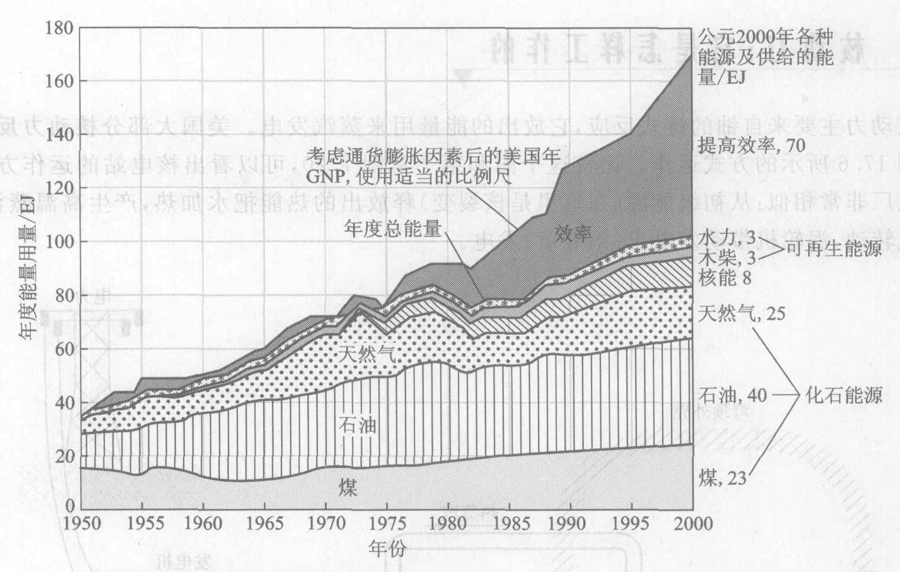

*图 17.5 1950—2000年美国能量消费历史的更详细的情况。上边界画的是 GNP，它是衡量国民经济提供的商品和服务产出的尺度。从 1973 年能源危机开始变大的 GNP 与总能耗之间的差表示从 1973 年开始采取提高能量效率措施所节省的能量。*

没有能量效率的提高，能耗就会与 GNP 同步。因此，把两条曲线之差标为“能量效率”是合适的。到 2000 年，能量效率提高的因素对全国总能量使用的贡献已达 70 EJ，远远超过任何一种别的能源。这说明了一个极其重要之点：正确的提高效率的措施能够节省巨额的能量。

> **概念检查 4** 根据图 17.4，发电行业的总能量效率大约等于 (a) 25%; (b) 35%; (c) 40%; (d) 50%; (e) 65%。

**作出估计** 根据图 17.1，工业化国家中的人均每日能量消耗大约是 1 000 MJ。用这个数字估计人均功率消耗，单位为 W。再把结果用 kW 表示。假如这些能量都是电能，能够点亮多少只 100 W 的白炽灯？③

③ 功率是每秒消费的能量（第 6 章）。因此，用日耗能量 1 000 MJ 除以每日的秒数就得到：$1 000 \times 10^6\ \text{J} / (60 \times 60 \times 24\ \text{s}) \approx 12,000\ \text{W}$，或 12 kW，相当于 120 只 100 W 白炽灯消耗的功率。

## 17.3 核动力：它是怎样工作的

核动力主要来自铀的链式反应，它放出的能量用来蒸汽发电。美国大部分核动力反应堆按示意图 17.6 所示的方式运作。比较这个图和第 7 章图 7.20，可以看出核电站的运作方式和蒸汽发电厂非常相似：从初级能源（在这里是核裂变）释放出的热能把水加热，产生高温蒸汽，推动涡轮机转动，涡轮机带动发电机（第 8 章）发电。

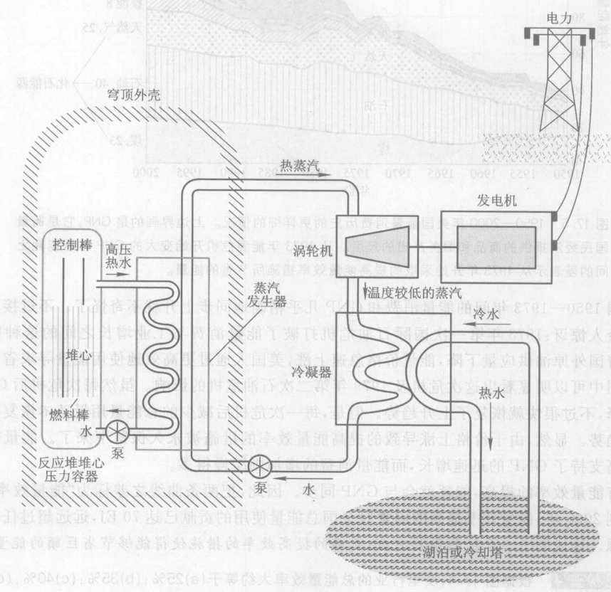

*图 17.6 由一座核反应堆提供动力的蒸汽发电厂的示意图（与图 7.20 比较）。*

一切核动力反应堆都有三个基本的构成部分：将核能转化为热能的燃料；将热能从燃料中带出来的冷却剂；吸收中子的控制棒，将这根控制棒推进或抽出反应堆就可以停止、减慢或加快链式反应。美国的大多数反应堆利用水冷却。如图 17.6 所示，水通过反应堆的中心循环，将参与链式反应的燃料棒上的热能带出来。这些热能随后生产出蒸汽。

水冷式反应堆中的燃料是铀，不过要将其中的 ${}^{235}\text{U}$ 由天然浓度 0.7% 略加浓缩到 3%。裂变放出的能量只来自这 3% 的 ${}^{235}\text{U}$ 核，97% 的 ${}^{238}\text{U}$ 核不能裂变，不提供能量。燃料中维持着一个非爆炸性的链式反应。天然的铀在水冷式反应堆中是不能工作的，因为 ${}^{238}\text{U}$ 和水分子中的 ${}^{1}\text{H}$ 都会吸收中子使链式反应中断。由于核动力反应堆使用的是略加浓缩的铀，而不是制造炸弹的高浓缩 (90%) 铀，因此，核动力反应堆不会像一枚真正的核武器那样爆炸，也不可能将这种铀直接用来制造炸弹。

> 我们无法控制原子能，使其具有任何商业价值，并且我相信我们永远也做不到这一点。
> ——卢瑟福，物理学家，1933年的预言

铀燃料做成圆柱形细长条的形式，存放在细长的金属管中。反应堆产生动力的核心由大约 40 000 根这样的燃料棒构成，共 100 吨燃料。在燃料棒之间插入数量少得多的控制棒，由吸收中子的材料如镉或硼等做成，能够根据需要插入燃料中或抽出。这个核心部分被封装在一个厚重的钢制反应堆堆心压力容器内。这是一个耐高压、防辐射的容器，并能吸收大量逃离堆心的中子。

为了将通过堆心循环因而具有强烈放射性的水与工厂的其他操作部分隔离，水在两套在物理上隔绝的封闭管道中循环（图 17.6）。第一套管道在堆心中循环，带走燃料棒放出的热量。虽然这套管道中的水被加热到 300 ℃ 以上，但是堆心压力容器中的高压使这些水不会形成气泡，从而保持不沸腾。这些水流过一个“蒸汽发生器”，在那里加热第二套管道中的水，使这些“二级水”变成蒸汽。通过两套管道的接触，热能被输送出来，而两套管道中的水却不致相混。由于链式反应会使堆心、压力容器和第一套水循环管道具有极强的放射性，因此把这些部件封装在厚实的混凝土结构中。为了进一步防止发生意外，在这些具有放射性的部件外还建造了一个巨大的穹顶外壳（图 17.7），由大约 1 m 厚的钢筋混凝土构成，能够抵抗相当于一架喷气式飞机坠毁的冲击力。由于第二套管道没有保持在高压下，其中的水在蒸汽发生器中立刻变成蒸汽。剩下的运作与其他蒸汽发电厂完全一样。

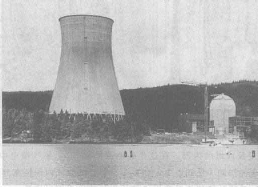

*图 17.7 建设中的核电站。图中看到正在施工的冷却塔和反应堆的防护性穹顶外壳。*

拓展未来能源供应的一个方向是增加核能的使用。这种拓展可能采用以下这些形式：一种是今天的以铀为燃料的裂变反应堆的新的更安全的改进型。另一种是叫做“增殖反应堆”（第 17.5 节）的新型裂变反应堆，它用钚工作又生产钚。一种在未来更有可能的是**聚变反应堆**，它所依据的核反应与氢弹相同：

$$ {}^{2}\text{H} + {}^{3}\text{H} \rightarrow {}^{4}\text{He} + \text{n} $$

在聚变反应堆中，这个反应将以非爆炸的形式发生，连续输出热能，用来烧沸锅炉中的水，生产发电厂需要的蒸汽。${}^{2}\text{H}$ 可以通过同位素分离技术从普通的水中提取，在 6 000 个水分子中，大约有 1 个 ${}^{2}\text{H}$，其余的是 ${}^{1}\text{H}$。${}^{3}\text{H}$ 是氢的一种放射性同位素，没有天然产物，需要在聚变反应中通过“增殖”的方式自己产生，方法是：用锂将聚变反应室围起来，锂与聚变反应中产生的中子会发生如下反应：

$$ \text{n} + {}^{6}\text{Li} \rightarrow {}^{4}\text{He} + {}^{3}\text{H} $$

建造一座核聚变反应堆不容易。我们在第 16 章中看到，要启动一个自持的热核反应，必须把 ${}^{2}\text{H}$ 和 ${}^{3}\text{H}$ 加热到几百万开。这可以让电流通过气态氢燃料来做到。要得到“净能量增益”（反应产生的有用能量多于为维持反应所输入的能量），必须满足三个条件：燃料必须被充分压缩，温度必须足够高，并且上述两个条件必须维持足够长的时间（超过 1/10 s）。这是很困难的。例如，如果燃料与容器壁接触，器壁就会立刻使燃料冷却到远低于发生核聚变所需的温度。因此，必须用电磁力约束燃料，使燃料不与器壁接触。图 17.8 示出欧洲联合聚变环的内部结构，这个反应堆的能量产量已经达到“平衡点”的 50%。“平衡点”指的是反应堆开始产生净能量增益的状态。在图中这座轮胎状的聚变器内，氢气被粒子束、无线电波和电流加热到 1 亿开以上。

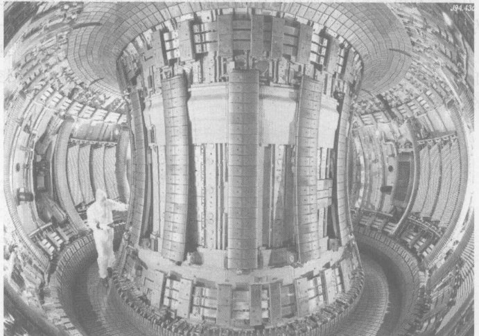

*图 17.8 实验性聚变反应堆的内部。在这个轮胎形的结构内，氢气被电中性粒子、无线电波和电流联合起来加热到 1 亿开以上。如果在足够长的时间内保持充分高的温度和压强，氢就会聚合成氦，并释放核能使反应堆运转并为外部世界提供能量。*

美国和其他五个国家于 2005 年达成协议，在法国的卡达拉奇建造一座试验式聚变反应堆，其设计目标要达到 10 倍净能量增益。不过，能量的输出是间歇的，没有商业价值。建造时间需要 10 年。尽管在几十年的紧张研究中得到了扎实的进展，从聚变中产生可用能量的条件迄今未能满足，具有商业价值的聚变反应堆至少要到 2050 年才能实现。由于大家有广泛的共识，当前我们在能源-环境问题上的两难困境必须在 2050 年之前妥善解决，所以聚变并不是解决这些问题的钥匙。而如果我们不解决我们的能量两难困境，谈论核聚变和其他 2050 年之后的问题都是不切实际的，因此，尽管核聚变有潜力使能量图景发生革命性的变化，我们将不再进一步讨论聚变。

> **概念检查 5** 以下哪种是核聚变反应堆的可能燃料？(a) 铀; (b) 钍; (c) 氢; (d) 钚; (e) 热狗。

## 17.4 技术评估：一个例子

每个工业化民主国家的公民都需要学习科学。最根本的原因是人人都要投票，而今天投票表决的最关键的问题都与科学有关，如能源-环境危机。由于这些问题影响到我们的环境、我们的经济和我们的价值，社会要保持民主传统，就不能把这些问题交给专家去处理。如果我们不能对这些问题做明智的评估，就会做出愚蠢的决策，而由于科学技术的强大力量，就会带来灾难性的后果。

事实上，公民们在日常生活中每时每刻都在作出关于这些问题的决定。成千上万的人在购买什么产品、是否对住宅进行隔热处理、交通方式、废物再生利用这些问题上的个人决定，合起来就确定了我们是正确地使用还是不正确地使用技术和科学。那么，是不是每个公民在所有与科学相关的社会问题上都要成为专家呢？这显然是不可能的。但在另一个极端，不经思考地遵循旧习惯有可能引发灾难。虽然没有可能在所有的问题上成为专家，但是，每个公民都可以对其中一些问题学习足够的知识以向别人提供咨询。用这种方式，把众人的智力联合起来，我们就能够做出明智的民主决策。

> 我们这些搞原子核的人与社会达成了一项浮士德式的交易。一方面，我们许诺向社会提供一种取之不尽、用之不竭的能源。但是为了这种魔法般的能源，我们向社会索取的代价则是我们的社会机构千百年万忧心忡忡地保持警觉，这是我们很不习惯的。
> ——Alvin Weinberg, 国立橡树岭实验室前主任，1972年

个人与团体可以通过一个叫做**技术评估**的过程清楚地了解这些问题，从而鼓励做出合理的和有根据的决策。技术评估的想法是，在对这些问题进行价值讨论之前，首先要对它们有一清楚的理解。为了对这些问题有一清楚的理解，每一个“利益攸关者”都应该画一张客观的得失权衡表，显示一切可能的选择以及其代价和收益。然后才能开始讨论人类对这些代价和收益的价值判断。

作为技术评估的一个例子，让我们考虑一个重要问题：煤与核能的优劣对比。这两种能源提供了美国 71% 的电力，其中煤提供了 53%，核能提供了 18%。我们想要使这两种能源在未来占有多大的份额呢？

> **概念检查 6** 核动力的缺点包括：(a) 由于开采造成地层下降; (b) 由酸雨造成的污染; (c) 工作人员的健康问题; (d) 全球变暖; (e) 废料处理; (f) 大规模杀伤武器的扩散。

> **概念检查 7** 上述各项哪此是煤的缺点？

表 17.3 列出了两种能源的代价和好处。由于两种能源都用来发电，表中两栏在这一项的内容相似。事实上，除了全球变暖（核能不存在这个问题）与核武器扩散（煤不存在这个问题）之外，表中的其他各项在两栏中都是对应的，但完全不相同。不过，问题的相似并不见得对它们的评价相同。例如，虽然两种燃料的开采都导致地面下沉，但是，由于每单位能量对应的煤燃料的体积大得多，开采煤导致的地面下沉就比开采核燃料导致的下沉大。又如，恐怖分子对核动力比对以煤为能源更是一个威胁。

**表 17.3 煤与核能的代价和好处**

| 煤 | 核能源 |
| :--- | :--- |
| **好处：** | **好处：** |
| 充足的电力 | 充足的电力 |
| **代价** | **代价** |
| 资源：够使用几个世纪 | 资源：够使用几十年 |
| 由于开采造成地层下降 | 由于开采造成地层下降 |
| 空气污染：酸雨、$\text{SO}_2$、$\text{NO}_2$、粉尘 | 核废料造成环境辐射 |
| 工作人员的健康：黑肺病 | 工作人员的健康：矿场和电站中的辐射 |
| 矿难 | 发电站事故 |
| 使河湖变热 | 使河湖变热 |
| 固态废料：粉尘、煤渣 | 用过的燃料棒、低水平放射性废料 |
| 设备、燃料、运转和废料处理的费用 | 设备、燃料、运转和废料处理的费用 |
| **全球变暖的主要来源** | 不会导致全球变暖 |
| 不存在核扩散问题 | **核武器扩散** |
| 遭受破坏：停电 | 遭受破坏：释放辐射、制造炸弹的材料失窃 |

为了满足未来对能量的需求，需要考虑各种各样的能源……由于涉及全球气候，使用非化石能源无疑将受到鼓励……（不过）这种能源顶多能提供所需要的能量的 1/3 ……我们使用的大部分能量将依然来自化石能源。到 [21] 世纪中叶，只剩下煤是既便宜又丰足的化石能源。因此，煤的处理技术和燃煤发电厂的改良将继续是能源政策最重要的主题。
——C. Starr, 电力研究所名誉主席、罗马俱乐部国际组织核分部前任主席

**能源资源的可用年限**是一个重要问题（表 17.2）。假定能量的消耗量以每年 1% 到 2% 的适度比例增加，那么，几个世纪之后煤的产量才会达到巅峰值并开始下降，但是，铀的产量在 60 年之内就要开始下降。如果核动力迅速发展，那么，在比 60 年短得多的时间内铀的产量就会到达巅峰值。不过我们下面将看到，利用所谓的“增殖反应堆”，有办法避免这个问题。

**煤的最大缺点无疑是它带来了全球变暖问题**。主要来自化石燃料的二氧化碳的排放在全球变暖的原因中占 55% 的比重。而在化石燃料中，煤在这方面最严重，每产生 10 亿焦能量要释放 24 kg 碳，相比之下，原油只释放 19 kg 碳，天然气只释放 14 kg 碳。表 17.4 在分子基础上表明了这一事实；大多数含碳化合物也含有一些氢，碳原子和氢原子都与氧气燃烧产生 $\text{CO}_2$、$\text{H}_2\text{O}$ 和热能。只有二氧化碳而不是水是全球变暖的重要原因。④ 因此，H/C 比值更高的燃料，产生单位能量所带来的全球变暖程度较轻。

④ 尽管水蒸气是一种温室气体，但是，由于通过燃烧释放的量相对来说较少，因此在全球变暖的问题上所起的作用并不重要。

**表 17.4 几种燃料释放的碳的数量**

| 燃料 | 每 10 亿焦能量释放的碳量 / kg | 燃烧的氢和碳之比 |
| :--- | :--- | :--- |
| 煤 | 24 | 1 个 H 原子比 18 个 C 原子 |
| 原油 | 19 | 2 个 H 原子比 1 个 C 原子 |
| 天然气 | 14 | 4 个 H 原子比 1 个 C 原子 |
| 氢 | 0 | 只燃烧氢 |

要烧煤而又不造成全球变暖，必须把通常从燃煤工厂的烟囱排出的 $\text{CO}_2$ 收集并储存起来。一个建议是将 $\text{CO}_2$ 气体泵送到现有的油田和天然气穴中。还有人建议将 $\text{CO}_2$ 泵送到深海中，不过这可能损害海洋环境。清除和储存 $\text{CO}_2$ 是很花钱的，而世界上的燃煤工厂每天都排放大量的 $\text{CO}_2$。这么个大量法？具体说吧，一座大型燃煤工厂每天要消耗大约 10 000 吨煤，这足够装满 200 辆大型卡车（第 7 章）。这可以燃烧掉后，产生大约 30 000 吨 $\text{CO}_2$（每个 C 原子与两个 O 原子结合）。世界上烧煤的产业的总量相当于大约 3 000 座这样的大型工厂。因此，全世界的燃煤工厂每天产生大约 9 000 万吨 $\text{CO}_2$。真不少。科学家们估计，能够在地下储存大约 80 年的 $\text{CO}_2$ 排放量，而不会有大风险。但是这将是很昂贵的，比从烧煤转向其他选择（如风力）以减少 $\text{CO}_2$ 排放量贵得多。

从烧煤到烧油再到烧天然气这个历史趋势（图 17.2）可以看出是成能量供给的**脱碳过程**。全球变暖使得脱碳成为大多数国家今天的政策目标。比起煤或石油来更愿意用天然气来发电，太阳能正在迅速发展，人们也在谈论着核动力的复兴。1970—2000 年，全球经济总产值中每百万美元所需的碳释放量下降了近 40%，这表明上述努力是成功的。但是全球经济总产值的增加更大，因此，碳的年总排放量还是增加了 50% 还多。

表 17.4 使我们想到，这一趋势可能导向仅含氢的无碳能源。虽然宇宙的绝大部分成分是氢，但是由于它很轻并且运动得快，在几十亿年前就已全部逃离地球，因此，今天地球上不存在天然的氢气 ($\text{H}_2$)。不过，可以让电流通过水产生氢。如果电力是用太阳能或核能发出的，整个过程就是无碳的了。氢气可以以像天然气一样用管道（实际上，可以使用目前的天然气管道）输送到很远的地方，供运输行业和居家加热使用，也可以装入燃料电池（第 7 章）中用来产生电能。氢气可以用纯粹的化学方法从煤等化石燃料中产生，不过这个过程还是要要把煤中所含的碳释放到大气中，而所获得的能量不到煤所含的能量的 75%。这样看来，就全球变暖的角度看，这种从化石燃料中获取氢的方法并不是赢家——可能比直接烧化石燃料好一些。

> [核] 工业的衰落在切尔诺贝利事件之前很久就开始了……事实上，核工业自其创业之日起就被各种问题所困扰……这些问题现在我们相信是这种技术所固有的。同样值得注意的是，随着核动力的曲折前进……风力与太阳能也得到了发展……现在的挑战是如何转移政府投资的优先考虑，而政府已给了核动力很大的补助。
> ——N. Lenssen 和 C. Flavin, 能源专家

> 新一代核电站……将不仅提供价格比燃煤发电站更低的电力，也将比现有的核电站安全一千倍。
> ——B. Cohen, 匹兹堡大学健康物理学家

> 全球气候变化……造成的危害可能是极大的。通过节能措施及增加核能与太阳能的使用以减少化石能源的消费量可以使得问题得到改善……核能最明显的作用就是代替煤发电。它还可以代替少量原油和大部分天然气，……随着现有化石燃料电站的退役，这种方案大概能够在三四十年内实现。
> ——D. Bodansky, 物理学家和能源专家

一些工业专家曾经把燃料电池进入市场看成是石游退场的最后一次较量的开始和“氢动力时代”的黎明。不过，由于开发氢燃料电池困难重重，加上任何一种新技术的引入和将其普及到全社会之间必有较长的滞后时间，上述看法的实现可能是遥远的将来的事。可能要到 2030 年才会仅有 5% 的汽车以氢燃料电池为动力。

在下一节，我们将考虑表 17.3 中列出的有关核能的一些争议。

## 17.5 核动力引发的争议

在核动力的历史上有许多科学和社会方面的经验教训。第一个商业核电站于 1957 年启用。到 1975 年，共有 54 座核电站提供美国全国电力的 10%，核时代似乎已经牢固地确立了。然而就在这时，繁荣的前景却变得暗淡了。最后一座新核电站的订单是 1974 年发出的，事情最终变得明显起来（特别是随后在 1979 年发生了三哩岛事故，见下页），第一个核动力时代在 20 世纪 70 年代发展到巅峰，此后很快就结束了（图 17.9）。今天关于核动力的一个重大争议是：会出现第二个核动力时代吗？

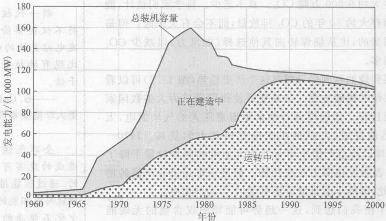

*图 17.9 1960年到2000年美国在核动力上的投入：总装机容量和建造中的容量*

核动力总是吸引着强烈的支持者和强烈的反对者。支持者认为，全球变暖、化石燃料短缺，以及更加安全的新一代核反应堆的前景都召唤着核动力的复兴，核能源是一种能够产生巨大电能的非化石能源，而且还能够进一步扩展产生更多的能量。反对者则争辩说，考虑安全性、废料处理问题，巨额的成本以及核扩散问题，使核动力是不能接受的。不过几乎所有观察家都同意，由于全球变暖问题，现在是开始对我们的能源经济实行脱碳化的时候了。

表 17.3 中列出了有关核动力的问题，其中最重大的大概是核废料、核电站事故、铀资源和核武器扩散。下面分别讨论这些问题。

虽然低辐射水平的核废料也造成一些问题，但是更严重的问题是用过的燃料棒内的具有强放射性的**高辐射水平核废料**。⑤ 美国的废燃料棒当前存放在全国 104 座核电站防护性穹顶内的大水池中，受到被盗窃和蓄意破坏的威胁。这些水池不是用来长期存放核废料的，如果维持几百年，它们最终都会把辐射泄漏到周围的环境中。由于这些废料必须安全存放几千年才能使其中的放射性同位素衰变到安全的辐射水平，因此需要一个长期解决办法。

用过的燃料棒包含有裂变碎片和在链式反应中产生的其他放射性同位素。在前几个世纪中，寿命短的同位素是燃料棒的放射性的主要来源，因此，废料的辐射水平在头 10 年后将降低到 1/300，而在头一个 100 年后将降低到 1/100 000。虽然如此，某些同位素在数万年到数百万年期间仍然是潜在有毒的。美国官方规划高辐射水平核废料存放的时间框架长达 1 万年，比人类有记载的历史还长。大多数专家们相信，将废料烧结在玻璃材料中，放入寿命可达 1 万年的钢罐内，并把这些钢罐存放在地质稳定地点的地下几百米深的人工洞穴里，就能够埋藏这么长时间。人们曾提出过许多存放地点，但是都由于政治原因受到反对。1987 年，国会选定内华达州的尤卡山作为考虑的唯一地点，不过从那时以来，这个地点一直无法在政治和科学争论中确定下来。

1979 年发生在**三哩岛的事故**表明了在复杂的技术中事情怎么会出错。这次事故始发于一个常规事件：一台外部水循环系统里给涡轮机送蒸汽的泵出了故障（图 17.6）。控制棒立刻自动插入反应堆，裂变停止下来。但是，由于反应堆的功率中大约有 5% 并不是来自裂变而是来自放射性，因此，反应堆中裂变过程的停止并没有使发热过程停止。这就必须使水保持流过反应堆以防止过热。

于是，一台备用的水泵接替了这个工作。但是，这台备用水泵的一个阀门却被错误地关上了，而通知操作员阀门未打开的报警灯又被一块标签牌挡住了，于是，冷却水足足有八分钟没有进入反应堆。在这段时间里，反应堆内的温度和压力上升，迫使一个在蒸汽发生器（图 17.6）上的减压阀开启。打开的阀门使蒸汽跑了出来，带有放射性的水流到了防护建筑的地板上。其中的一些水自动被泵送到邻近的建筑物中，向周围释放出比较少量的放射性辐射。

⑤ 为了让你对这些燃料棒的放射性强度有多高一概念，设想一个毫无防护的人站在一堆典型的、经历了 10 年的废燃料棒（一捆大约 250 根）旁 1 m 以内，他在大约 15 分钟内将接受到致命的辐射剂量。一堆比这更新的、经历放射性衰变时间更短的废燃料，具有放射性更强。

> 所有的注意力都集中在燃料循环的前端，主要集中在反应堆本身上。这里有找到工作和发展事业的大好机会，这里是获得商业利润的场所。工程师们对处理废料毫无兴趣，这件工作没有任何吸引人的地方，没有任何辉煌的业绩可言，它是一件脏活，没有谁因为关心核废料而得到嘉奖。原子能委员会对这个问题置若罔闻……令人感到有点惊异的是，没有任何团体[指出]如果系统中缺少某些关键的部分，整个系统就有可能卡住停机。
> ——C. Wilson, 美国原子能委员会主席 (1947—1951)

> 核动力在不远的将来必定会扮演一个重要角色，但是必须小心管理好这个行业……只有这样，核动力的全部潜力才能得以实现。鉴于全球人口增长以及由此带来的问题，我很怀疑走回头路能够让我们掌握未来。相反，我们必须向前迈进。
> ——W. Hafele, 物理学家，前西德政府科学顾问

> 必须使用电能的各种用途（这些用途需要电能的高品质，而且在经济上证明了用电是合理的）仅占美国总的终端用途需求的 8%。因此，庞大的新市场就好像是去推（而不是拉）一条绳子——推很有想象力但终究不能令人满意。
> ——A. Lovins, 物理学家，能源顾问，位于科罗拉多州斯诺马斯的落基山研究所研究部主任

> 没有任何科学家或工程师能够绝对保证，放射性核废料不会在某一天从哪怕是最完善的储藏所泄漏出危险的数量……应当批准核废料库的建造吗？或者应当再搁一搁？这并不是技木问题，而是关系到大街上的普通老百姓和他选出来的代表的问题。
> ——K. Krauskopf, 斯坦福大学地质学家

> 拟议中的将高放射性核废料存放在内华达州沙漠中的计划并不会有明显的风险使地下水受到污染。
> ——引自对美国全国科研理事会的一项关于将内华达州尤卡山作为高放射性核废料处理和储藏场所是否适当的研究报告的新闻报道

过热的反应堆中心的水随着蒸发而逸出。为了防范反应堆过热的威胁，每个反应堆都建有一个应急冷却水罐。可是操作人员却把控制室里的报警铃声错误地当做是反应堆中心的水过多而不是过少。于是，他们断掉了应急冷却水的供应。水面降到燃料棒顶部以下的位置，燃料发热，直到堆心的大部分熔化，这叫做**熔塌事故**。这使反应堆受到永久性的毁坏。只是由于反应堆堆心底部仍然残留有一些水，才使整个反应堆堆心压力容器免于熔化，使熔化了的燃料免于泄漏到防护建筑中。

炽热的反应堆中不寻常的化学反应放出氢气，这些氢气在反应堆中停留了好几天，这使人们担心，万一氢气爆炸，就会将反应堆撕开，向周围释放出大量放射性辐射。这次事故并没有人员立刻死亡，至于患长期癌症而死亡的，预计即使有也极少。这次事故的清理工作花费了所属公司 10 亿美元，外加反应堆的损失。

第 15 章讨论了 1986 年发生在**切尔诺贝利**的历史上最严重的一次核动力事故。尽管低浓度的反应堆燃料不会像正式核武器那样发生爆炸，但是，失控的链式反应会足够快地释放出热能，产生一次能量与常规化学炸弹相似的低强度核爆炸。这次事故导致反应堆熔塌，污染了大片地区，造成了约 4 000 例短期就发生和长期才显出的死亡。燃料部分渗入电站的地面。假如燃料把地板完全熔穿，就有可能与地下水接触而引发一次剧烈的放射性水蒸气爆炸。

尽管这些事故导致采用新的安全措施，但专家们估计，今日正在全世界运转的大约 500 个核动力反应堆，在下一个 10 年内再发生另一次堆心熔化事故的机会在 4% ～ 40% 之间。

一些观察家呼吁复兴和发展核动力。他们的理由是：① 和核动力的危险相比，全球变暖的威胁大得多；② 化石燃料的供应日益不稳定；③ 特别是由于像中国和印度这样的国家的经济发展，世界的能量需求正在快速增加；④ 新一代更安全得多的反应堆正在悄然成熟。这种新型的反应堆被描成是“内在安全的”，意思是它的安全只依赖于引力或热膨胀等物理现象，而不依赖于设备的性能和操作人员的行为。例如，在瑞典开发的 PIUS 反应堆的设计中，整个反应堆和内部水循环系统（图 17.6）浸没在一个单独的非常巨大的冷水池中。如果正常的冷却水中断，那么，即使没有电力供应，这个大水池也会自动对堆心进行冷却，利用外部冷水与更热的反应堆堆心之间的温差引起的自然流动，使水循环流过反应堆。为了自动中断链式反应，外的水池含有大量吸收中子的元素硼。

如果大量发展核动力，铀资源有可能在几十年内就开始耗尽。**增殖反应堆**是解决这个问题的一个可能的办法。我们还记得（第 16 章），当反应堆内的 ${}^{235}\text{U}$ 发生裂变放出能量时，数目多得多的 ${}^{238}\text{U}$ 核吸收中子转变为钚。我们知道，钚是另一种发生链式反应的原子核，可用于核反应堆中。增殖反应堆是一座专门设计的反应堆，使得每发生一次 ${}^{235}\text{U}$ 裂变，就生成一个以上的钚核。因此，增殖反应堆实际上生产出比它使用的（铀）燃料更多的（钚）燃料，并且能够将任何国家的铀资源中大量的 ${}^{238}\text{U}$ 转变成可发生裂变的钚，这就极大地扩展了铀资源。

虽然增殖反应堆能够解决资源问题，但是却使**核武器扩散**的问题更加严重。部分由于这个原因，美国目前并没有开发或运行增殖反应堆，世界上只有两座正在运转的增殖反应堆（在法国和俄国）。我们在第 16 章中看到，核动力与核武器有一些联系。以铀为燃料的动力反应堆能够生产有军事用途的钚，虽然废燃料棒还必须先经过**再处理**，将钚从剩下的铀和裂变过程中产生的强放射性同位素中分离出来。印度就是沿着这条路制造出一枚裂变炸弹的，它利用由美国提供的、原推测用于和平目的的再处理技术对一座动力反应堆的燃料棒进行处理而生产出钚。巴基斯坦的核武器计划也得益于核动力技术：一位在荷兰一座商业用途的铀浓缩工厂工作的巴基斯坦物理学家——间谍复制了这座工厂的设计，在巴基斯坦建造了一座浓缩工厂，为核武器生产出武器级的铀。因此，巴基斯坦与印度之间的核军备竞赛与核动力问题纠缠在一起。

铀反应堆的燃料不能用作核武器的燃料（因为它不是高度浓缩的）但钚反应堆的燃料却能，因此，增殖反应堆使核扩散问题变得严严重起来。广泛使用增殖反应堆和再处理将生成大量的已经分离的钚，这些钚将被储存起来，运到别的反应堆并使用。一个扩展的核动力产业可能每年会将 100 万千克以上的钚送入全球市场。因为制造一枚裂变炸弹只需要 10 kg 钚，要防止大量的钚用于制造核武器将是困难的。尽管有这些担心，日本、中国、印度和韩国计划在未来几十年里建造增殖反应堆作为亚洲迅速扩展的核动力的一部分。日本和中国预期在 2050 年前将他们的几乎全部常规的浓缩铀反应堆用增殖反应堆代替。

如你所看到的，对于可能的未来的能源如煤和核能的评价是复杂的。大多数观察家同意，全球变暖的问题压倒了其他问题，但是核动力的问题特别是核武器的扩散也是严峻的。因此，参加辩论这个问题的人往往分成两个阵营：一些人要求发展核动力以减少对煤的依赖；另一些人则要求同时减少对煤和对核动力二者的依赖。

> 最终也许不是经济原因而是用过的燃料的储藏和处理决定美国的核动力的生命力。
> ——I. Selin, 核管理委员会主席

> 放射性核废料……是一个不重要的技术问题。
> ——B. Cohen

> 没有什么事情比一次事故更能唤起反对核能的声音。
> ——P. Bradford, 核管理委员会前成员

> 即使现在，在经过 50 多年的努力并花费了大量金钱之后，美国依然没有一个有坚实技术基础的或社会可接受的政策来处理高放射性的核废料。的确，目前通过在内华达州尤卡山建立一个国家储藏地以解决这个问题的尝试陷入了矛盾的困境中，并且注定会失败。
> ——J. Flynn, 社会学家; R. Kasperson, 政治科学家; H. Kunreuther, 公共政策专家; P. Slovic, 社会学家

> 遥远的未来的公民们将 [把钚] 看作是上帝赐给人类的最大的礼物之一……反核运动已经花费如此之多的精力试图令公众相信 [钚] 是一种对健康有严重危害的东西。他们中间那些具有科学背景的人必定会认识到，这个论点是虚构的。
> ——B. Cohen

> 有责任感的科学家已经强烈地表明了他们的意见：钚贸易冒着核扩散与由动力应用转向武器制造的风险，可能会进一步损害公众对核动力的信心。物理学家从大量文献中应当充分理解和认识核动力与核武器之间关系的历史和心理学问题。
> ——R. Goble, 克拉克大学环境、技术与社会学教授，物理学副教授

> 通过开发和落实可再生能源技术及制造能力，我们将建立一个可以持续的能源结构，它将成功地指引我们进入 [新的] 千年。我们应该尽全力开展这项事业。
> ——J. Turner, 国立可再生能源实验室，戈登，科罗拉多州

> **概念检查 8** 下面的物质中哪一种的质量最大？（提示：煤主要由碳组成，其他元素只作为少量的污染物出现。）(a) 一座典型的核电站一年里产生的废燃料棒；(b) 一座典型的燃煤发电厂一年里产生的二氧化碳气体；(c) 一座典型的燃煤发电厂一年里产生的氧化硫气体。

## 17.6 未来的能量选择：可再生能源

虽然只有水电和生物体能源对今日的可再生能源有较大的贡献，但是，其他可再生能源正在迅速增长，在将来可能为我们提供更多的能量。每一种能源都有其自身的缺点，但是一般说来可再生能源的缺点比化石能源或核能少。通过为家庭、工业和运输业生产热和电力，可再生能源或核能或它们二者有可能为我们提供一个无碳的能源经济体系（第 17.4 节）。

**水电**和**生物体燃料**各自在美国的能量预算中占 3%。水力能是太阳的热使水蒸发成水蒸气并上升时所携带的引力能，这种能量全部用于中央电网。虽然从水力资源还能挤出更多的能量，但是由于美国大多数能够建造堤坝的河流都已经筑起了拦水大坝，因此，这种能源的利用已经接近实际的极限了。

**生物体能**是木柴、谷物和垃圾的化学能，可以从多种资源中得到，并转化成多种能量形式。目前主要将它们燃烧以供暖或产生蒸汽供发电站使用。不过，生物体还能够通过细菌的发酵（分解）被转化成用于运输行业的酒精和用于加热的甲烷。如果是生产和转换生物体时只使用少量化石燃料，那么，由于生物体释放到大气中的二氧化碳会由下一代作物吸收大气中的二氧化碳而被抵消，生物体对全球变暖的影响不大。

由谷物提取的乙醇（酒精）产量不断增加，它提供当今美国运输业 2% 的燃料。但是，由于高度机械化的现代耕作方式要使用大量化石燃料，因此，对乙醇的价值仍有争议。事实上，一些研究显示，为了生产乙醇所耗费的化石燃料的能量比成品乙醇中的可用能多。因此，就全球变暖而言，从谷物中提取乙醇实际上比简单地单独燃烧化石燃料更坏。不过，用来生产乙醇的能量主要来自煤和天然气，而成品乙醇是一种可以替代石油的液态燃料。因此，生物体能无疑有助于减轻我们对石油的依赖，但是，如果我们希望生物体能有助于解决全球变暖问题，那么，在种植谷物时就必须少用化石燃料，这些燃料用在机械化种植、化肥生产和运输等方面。

**生物体能**对未来的能量供给有可能做出有价值的贡献，但可能不会占很大的份额。原因是，来自农作物的生物体能需要大量的土地，生产每焦耳能量所需要的土地比风力能高出 30 倍，风力能也是一种需要大量土地的可再生能源。来自农作物的生物体能能够做到的也许是替代相当一部分（如 10%）现在的石油消费。另一方面，新技术也许会使得将垃圾、农业废物、草类和木头转变成液态燃料成为可行，这不一样，生物体能就能在不浪费宝贵的耕地的前提下做出更大的贡献。

**地热**、**风力**、**光电池**和**太阳热能**都用来产生电力。它们加起来对世界能量供给只占大约 1% 的贡献，但是每一种在未来都有大得多的潜力。表 17.1 中剩下的几项可再生能源——即主动式和被动式太阳能加热装置能够用来烧水、晒衣服和取暖。它们提供的能量的大小通常并不列出，但远远超过全球地热、风力、光电池和太阳热能发电的贡献的总和，而且它还能有巨大的增长。

**地热能**是由放射性和压力在地下产生的热能，它为全世界提供 7 000 MW 电力，相当于 7 座大型的燃煤发电厂。获取这种能量最简便的方法是通过钻井直接把热水或蒸汽抽出来。不过这种“直接地热”资源非常有限。一种几乎是无限的地热资源以炽热的干岩层的形式潜藏在地下几千米深处，它们的能量比煤层中所含的能量多许多倍。开采这种能源的钻探和地下破碎技术要求很高，还不成熟。图 17.10 说明其工作原理。

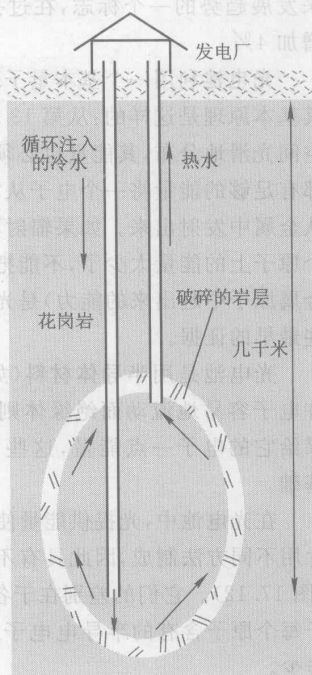

*图 17.10 有一天也许能通过由水力破碎过程产生的巨大裂缝注入冷水从干热的岩石中提取热能。*

**风能**是太阳照暖地球对看太阳的一面引起空气流动的空气动能。自古以来，人们就利用风力扬帆远航、转动风车磨面粉和抽水。今天，还用它推动**风力涡轮机**发电（发电机连接到风力驱动的涡轮轴上，见图 17.11）。这是一项有几十年历史的成熟技术。在近期内，风能很有希望提供世界电力的相当大的份额：有许多大面积的多风地区；对于大型发电厂风力已经和煤一样便宜；正当环保开支使煤价上涨时，新的设计方案将进一步降低风能的成本。今天，在世界电力中，风力发电占大约 2% 的份额；在过去 10 年中，风力发电量以年近 30% 的速率上升。德国在世界上占领先地位，排在其后的是西班牙、美国、印度和丹麦。德国的电力大约有 8% 来自风力发电，而丹麦是 13%。美国的电力只有 1% 来自风能，它还没有认识到其风能的巨大潜力。2005 年，风能为全世界提供了 47 000 MW 电力，相当于 47 座大型发电厂。作为未来发展趋势的一个标志，在过去 10 年中，风力发电激增 10 倍，而核电则仅增加 6%，燃煤发电增加 4%。

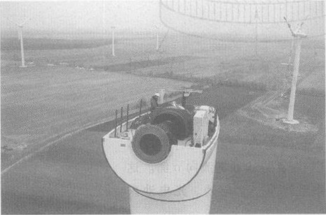

*图 17.11 丹麦制造商 NEG Micon 的一位安装专家为德国 Sustrum 的一座新的风力涡轮机做最后阶段的安装工作。*

**光电池**利用一个基本量子现象直接从照射到金属表面的太阳辐射产生电流（流动的电子）。其基本原理是这样的：从第 13 章中得知，光与其他电磁辐射是量子化的。这意味着虽然辐射在空间光滑地分布，其能量也必须存放在叫做**光子**的微小的能量包中。每一个这样的集中能量包都有足够的能量将一个电子从它所在的原子中赶出来，使它沿金属的表面自由运动，或者也许还从金属中发射出来。如果辐射不是把能量集中在能包中，计算表明，在通常情况下，落在任何一个原子上的能量太少了，不能把一个电子赶出来。因此，这种**光电效应**（将电子从它们所在的金属原子中赶出来的能力）是光的量子化的直接证据，事实上，这个现象为量子物理学提供了一些最早的证据。

光电池是用半导体材料（如硅）做成的，半导体的电性能介于导体和绝缘体之间，导体允许电子容易地流动而绝缘体则不允许。半导体的行为在一般情况下与绝缘体相同，但是，如果给它的电子一点能量，这些电子就很容易流动。这些性质使半导体成为现代电子技术的基础。

在光电池中，光提供能量使电子进入传导状态。一个典型的电池由两层薄硅片组成，两层硅片用不同方法制成，因此具有不同的电性质，分别叫做 n 型 (negative, 负) 和 p 型 (positive, 正) （图 17.12）。它们的差别在于各自掺入了不同种类的非硅“杂质”原子。n 型半导体中的杂质原子每个原子含有的半导电子比硅原子多，而 p 型半导体中的杂质每个原子的半导电子比硅少。

设想两层硅片在黑暗中简单地叠在一起，没有任何外部电接触。由于杂质的存在，作用在每一层内的微观电力使电子迅速从 n 型（开始时电子较多）流向 p 型（电子较少）。这就在 p-n 界面（两层硅片之间的结）上建立起一个电场，使电子停止流动。

如果光照到两层硅片上，两层硅片仍然没有外部电接触，光电效应就会给予某些电子能量，使一些获得能量的电子越过 p-n 结从 p 侧向 n 侧回流。这时，n 侧就像开路电池的负极，而 p 侧就像正极。现在将这个小“电池”连接到一个外部用电器件上，如图 17.12 所示。于是，被推到 n 侧接受能量的电子就会通过导线流回 p 侧。当电子到达 p 侧后，光继续激活电子，使它们越过界面从 p 侧流向 n 侧，形成一个电子流动的完整回路。p-n 结就像一个由光激活的电池。

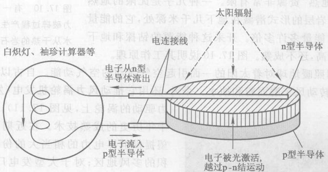

*图 17.12 本图说明光电池的工作原理。光照射到它上面时，p-n 结（p 型半导体和 n 型半导体的界面）的作用就像一个电池。由于两种半导体具有不同的微观性质，由光激活的电子越过 p-n 结从 p 侧流向 n 侧。这些电子然后流过一条外电路。p-n 结的作用就像一个电池。光电池只有 1 mm 厚。*

这种电池构成的电池组能够向中央电网供电，也可以直接向单个建筑物或电器设备供电，特别是在那些很难与中央电网连接上的边远地区（图 17.13）。虽然迄今世界上运转的光电力只有 4 000 MW（4 座大型发电厂的容量），它却是发展最快的能源，在过去 10 年里每年增长 30%。这种能源的价格仍然是煤或风力的 4 倍，但是，大规模的研究正在迅速降低价格，使这种能源越来越具有竞争力。

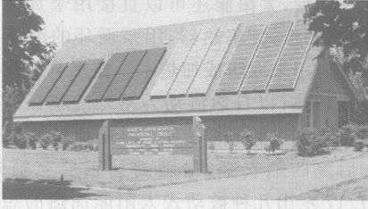

*图 17.13 连接在一起的一组光电池可以提供一个大电流*

**太阳能热电**是用太阳产生的热能发电。这种能源今天在美国发出的电力和一座大型电站相当，它使用两种技术。第一种技术用反射式太阳能收集器追踪太阳的移动并将太阳光聚焦到一种液体上，把这种液体用管子输送到中央机房生产蒸汽，以推动发电机（图 17.14）。第二种技术用大阳能反射镜将太阳能反射到中央锅炉上生产蒸汽（图 17.15）。

> 最小的风险给出最低的价格——一样的结果。能量公司只承担得起小规模的、快捷的、便宜的与模块化的选择方案。提高能量效率、可再生能源和某些天然气技术符合这些检验标准，煤与核能一般不符合这些标准。
> ——A. Lovins

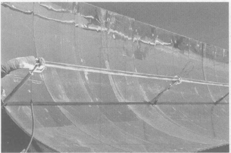

*图 17.14 一家太阳热能发电厂的太阳热能收集器。几英尺高的反射镜面将阳光聚焦到与集热器一样长的水管内的液体上。水管将热能输送到蒸汽涡轮机，推动一台与之连接的发电机。*

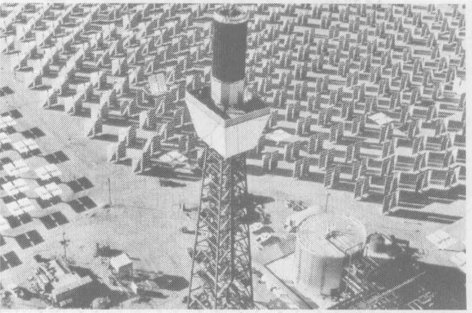

*图 17.15 位于加州 Barstow 的一套 10 MW 的太阳热能试验装置。镜子将阳光反射到塔顶的一台锅炉上，产生蒸汽发电。*

最后，太阳能还可以直接用来加热。图 17.16 是一台屋顶“平板式”集热器，用泵循环的液体在这里被加热后流回室内用来取暖或加热水。使用泵的集热器称为**主动式太阳能加热**；以自然流动为基础的集热器则是**被动式**的。这种方法比人类还要古老（动物和植物也追求太阳），简单的如后院的晒衣绳，最新的如三层充氩式多层镀膜窗。图 17.17 示出几种被动式太阳能加热的想法。即使在寒冷的天气里，只要让太阳照进来，这些方法也能够将采暖需求减少 60% 至 80%。

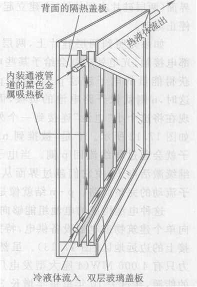

*图 17.16 平板式太阳热能收集器，它是用强制循环的液体收集和传送太阳热能。*

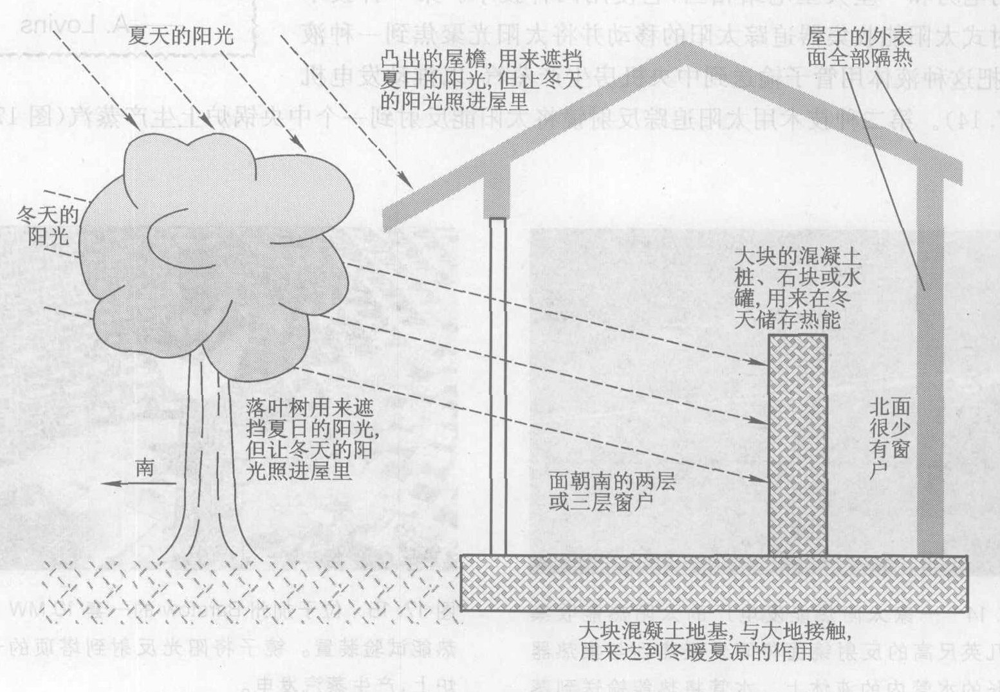

*图 17.17 几种被动式利用太阳能的想法，以保持房屋冬暖夏凉。*

可再生能源的活力与经济学信息相关。许多可再生能源的一个主要优点是对环境的影响小。许多观察家相信，要充分发挥这一优点而又仍然维持自由市场，就应该将环境“成本”计入能源的价格之中。比方说，煤在今天除了得到政府的直接补贴外，实际上还得到了环境的补贴，因为它的价格没有反映出它带来的污染和全球变暖的全部代价。这种看不见的补贴扭曲了市场，导致了对煤的滥用。人们已经提出了几种将环境成本纳入市场体系的方法，最简单的方法之一是对所有燃料中的碳含量收税。

> **概念检查 9** 根据第 7 章的定义，以下哪些是热机？(a) 水力发电机; (b) 地热发电机; (c) 风力涡轮机; (d) 太阳热能发电; (e) 光电池。

## 17.7 未来的能量选择：节能

提高能量效率每年向美国提供高达 70 EJ ($70 \times 10^{18}$ J) 的巨额能量服务（图 17.5）——这甚至比石油还要多——而没有伴随实际使用能源而来的环境污染和资源枯竭这两个问题。假如美国依旧按照 1973 年石油禁运之前的能量效率运作，它的能量用量就会比现在的用量高 69%。节省下来的能量为美国减少的开支每年达 4 500 亿美元！

与别的国家对比表明，美国还能够把使用能量的效率提高许多。图 17.18 比较了七个国家和全世界的人均能耗。德国、英国和日本三国的人均能耗大约只有美国的一半，而提供的能量服务（用该国人均国民生产总值测算）却与美国相似。这表明美国的能量用量还可以削减不少而不减少能量提供的服务。

只要认真对待能量效率，节省能量是可能的。作为这方面的一个例子，我们来看一下最近节能灯的进展情况。

传统的白炽灯通过将细钨丝加热直至发光。可以预料产生的热比光多得多。**荧光灯**按照不同的原理工作，根本不涉及加热。它在玻璃灯管内充了稀薄的水银蒸气或某些别的气体。电流通过灯管，运动的电子碰撞一些水银原子使其电离，并使许多原子跃迁到激发的量子态（第 14 章）。被激发的水银原子发射看不见的紫外线光子，被一种涂在玻璃管内壁的叫做磷光体的粉状材料吸收，使磷光体发出可见光。这种灯泡的效率比白炽灯的效率高得多，只需要 1/4 的电能就能以提供同样照明。

**节能荧光灯**的发明使荧光灯和旧式的细长灯管相比可以用于更多种灯座上。在家用电网中，电子并不是保持朝一个方向流动，而是每秒钟来回振动 50 次。老式的荧光灯就在这个 50 Hz 频率下工作。不过，如果灯管内的工作频率比 50 Hz 高得多，灯管的质量和效率都会提高。其原因是，在 50 Hz 的频率下，电子和离子每来回运动一次的时间长达 1/50 s，在电子和离子的世界里这是一段很长的时间。这段时间足以让大量的电子和离子撞到灯管的两端，导致发热而缩短灯管的寿命。旧式的灯管造成细长的形状就是为了减小这种“末端效应”。新型的电子控制的灯管使电流以 50 000 Hz 的高频率振动。如此高的频率使电子和离子振动的幅度小得多，从而减少了能量损失，并使灯管小得足以插进普通的灯座（图 17.19）。

> 不完善的建筑指标意味着通过美国建筑物的窗户流失的能量比通过阿拉斯加的输油管流动的能量还多。
> ——W. Ruckelshaus, 环境保护局首任局长

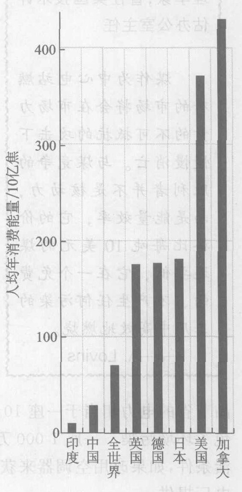

*图 17.18 几个国家和全世界的人均能量消费*

如果我们将定一套政策，以推动我们更稳健地朝着提高能量效率和开发非化石燃料的方向迈进，像日本人所做的那样；如果我们打算像日本人那样将汽油的价格从每加仑 3 美元提高到 5 美元，那么，那些对我们依赖原油进口的脆弱地位 [并特别担心] 的论据也许还有些道理。
——J. Gibbons, 物理学家，曾任美国技术评估办公室主任

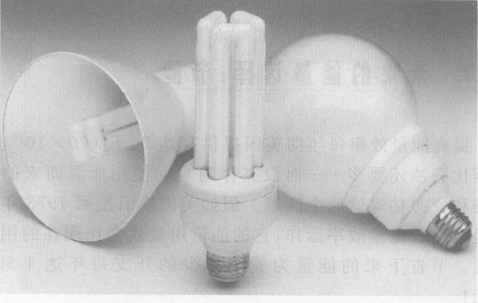

*图 17.19 节能荧光灯*

这个提高效率的简单例子带来什么样的效果呢？对消费者而言，一支普通的节能荧光灯管的售价为 10 美元，使用寿命是白炽灯的 10 倍，而消耗的能量是白炽灯的 1/4，在灯管的整个使用期限内净节省 45 美元。对社会而言，全世界使用的 26 亿支节能荧光灯节省的电量相当于 28 座 1 000 MW 的大型发电厂发出的电量。少发电污染就会减少。例如，2005 年北美使用的 3.75 亿支小型荧光灯全年就减排了大约 9 百万吨碳和 175 000 吨二氧化硫。

能量效率与经济问题是纠缠在一起的。提高能量效率通常会节省金钱，既然如此，政府和公司就有可能鼓励节能的方案，在经济上给消费者以回报。比如说，一些电力公司和政府用低价采购大量节能荧光灯，并将它们以更低的价格销售给用户，再在这些用户的电费中扣回成本与售价的差额。由于用电量减少而节省的金钱多于购买灯管的额外支出，因此用户省了钱。公司、消费者和环境都得到了好处。

在能量效率已被忽视多年的情况下，一小笔投资可以带来惊人的节省。例如，一座 750 万美元的节能荧光灯制造厂的产品节省的电力相当于一座 10 亿美元的发电厂的发电量，同时还省下了发电厂的燃料费用，并避免了环境污染。一座 1 000 万美元的生产隔热透光窗的“超级玻璃”厂能够向人们提供的舒适生活条件，如果改用空调器来获取的话，开动空调器所需要的电量需要由一座价值 20 亿美元的发电厂提供。

> 煤作为中心电站燃料的市场将会被在市场力量的不可抵抗的攻击下慢慢消亡。与煤竞争的胜利者并不是核动力，而是能量效率，它的价格比每吨 10 美元的煤还要低，它在一个免费的、不产生任何污染的工厂中高效地燃烧。
> ——A. Lovins

能量的价格强烈地影响着所用能量的消耗量和类型。GNP 增长与能耗增长之间的同步关系只有在 1973 年中东石油禁运导致能量价格上涨时才被打破，注意到这一点是很有教益的。从 1973 年开始，随着提高能量效率措施的实施，GNP 增长了而能耗却没由（图 17.5）。石油禁运带来的能量涨价使我们节省了大量能量和金钱。

许多研究工作提出对能量征税以鼓励人们提高能量效率。通过降低其他方面的税收以作补偿，可以使能量税成为“收益上为中性的”，它能阻拦人们肆意使用能量而不增加总的税收。鼓励措施鼓励人们购物时考虑能量。许多观察家建议对那些低效率的汽车征收“耗油大王”税，而对效率高的汽车则给予“节油”折扣。一个基本的观点是，如果市场经济想要对付全球变暖、能源枯竭以及其他环境问题，就必须将这些因素纳入商业活动和消费商品的成本中。假如我们不努力对付这些问题，我们的经济肯定会陷入被摧毁的环境的陷阱中。

> **概念检查 10** 如果全世界都按照美国的人均能量消费使用能量，那么，全世界每年消费的能量将大约等于现在消费量的 (a) 两倍; (b) 3 倍或 4 倍; (c) 5 倍或 6 倍; (d) 8 倍到 10 倍。

> [能量消费的] 增长已经放慢了，主要是由于人们发现节能措施的费用比建造新的供能设施要少得多——只有建造一座新发电厂的费用的 1/5~1/3。
> ——A. Rosenfeld, 物理学家，他通过研制高频荧光灯提供了相当于 28 家大发电厂提供的能量服务

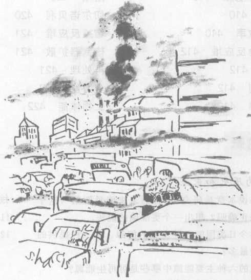

*“仅有的另一种解决办法是，我们也许会进化成一个对所有这些垃圾有免疫力的物种。”*

**概念检查答案**

1.  (d)。
2.  (b)。
3.  (a)。
4.  在用来发电的 38 EJ 中，发出了 6+7 = 13 (EJ) 有用的电能，效率是 13/38 = 34%, (b)。
5.  (a) 和 (d)，见第 16 章。
6.  (a)、(c)、(e)、(f)。
7.  (a)、(b)、(c)、(d)、(e)。
8.  一年里烧掉的煤远远多于参与裂变的铀，因此 (a) 被排除。由于煤中碳的含量比硫多得多，燃烧过程产生的 $\text{CO}_2$ 一定比 $\text{SO}_2$ 多得多，答案是 (b)。
9.  在地热和太阳热能两种情况下，热能都用来发电，答案是 (b) 和 (d)。
10. 根据图 17.18，全世界每人年均能量消费约为 700 亿焦耳，而美国则约为 3 700 亿焦耳。3 700 / 70 = 5.3，答案是 (c)。

---

## 关键概念

下述概念的定义出现在所标页码的本书正文页面上和书末的按拼音排序的术语词汇中。我们将它们按出现先后顺序排列在这里，你可以用这个清单复习本章内容。

*   可持续 404
*   能源 408
*   化石燃料 408
*   核动力 408
*   不可再生的 408
*   巅峰值 409
*   可再生能源 410
*   节能 410
*   能量效率 410
*   核动力反应堆 412
*   燃料 412
*   冷却剂 412
*   控制棒 412
*   穹顶外壳 413
*   聚变反应堆 413
*   技术评估 415
*   脱碳过程 417
*   高辐射水平核废料 419
*   三哩岛 419
*   熔塌 420
*   切尔诺贝利 420
*   增殖反应堆 421
*   核武器扩散 421
*   再处理 421
*   水力能 422
*   生物体能 422
*   地热能 423
*   风能 423
*   风力涡轮机 423
*   光电池 424
*   光电效应 424
*   半导体材料 424
*   太阳热发电 425
*   太阳能加热 426
*   主动式 426
*   被动式 426
*   荧光灯 427
*   节能荧光灯 427

## 复习题

**能量的历史和未来**

1.  如果说本章是研究“预言的未来能量图景”，这个说法正确吗？想出一个更准确的说法。
2.  列出今日美国的六种主要的能源。哪三种提供的能量最多？
3.  美国的六种主要能源中哪些是可再生能源？
4.  美国的六种主要能源中哪些主要用于发电？
5.  在图 17.4 中，为什么家用这种能量效率比运输业的能量效率高得多？
6.  列出在美国未来能量政策中将起重要作用的四大类主要能源或能量选择方案。
7.  在美国，目前下面的哪一种能源提供更多的有用能量：化石燃料、核能还是可再生能源？
8.  列出各种化石燃料。它们为什么叫做化石燃料？
9.  解释为什么将图 17.5 中 GNP 曲线与总能量曲线之间的差别称为能量效率。
10. 解释为什么在图 17.5 中 GNP 曲线与总能量曲线多年来都相互重合，为什么后来又分开了。

**核能**

11. 什么是核反应堆？
12. 以下哪些在燃煤发电厂中需要而在核电站中不需要：冷凝器、冷却塔或冷却池、涡轮机、烟囱、防护穹顶？
13. 以下哪些在核电站中需要而在燃煤发电厂中不需要：冷凝器、冷却塔或冷却池、涡轮机、烟囱、防护穹顶？
14. 列出核动力反应堆的三个主要部分，解释每一部分的功能。
15. 美国的反应堆燃料的浓度最接近下面哪个数字：1%、3%、10%、50%还是90%？
16. 炸弹级铀燃料的浓度最接近下面哪个数字：1%、3%、10%、50%还是90%？
17. 核聚变反应堆可以从哪里获得燃料？

**对核能与煤的评价**

18. 分别列出核动力的五个问题与燃煤动力的五个问题。
19. 在四种用得最多的不可再生能源中，哪一种（或哪几种）在美国的储藏量最丰富（按目前的使用速度计算还能用的年数最多）？哪一种最贫乏？
20. 大多数能源专家都认为煤的使用在长时期内将继续上升吗？为什么？
21. 什么是高放射性核废料，今天它们储存在哪里？这个问题最可能的长久解决办法是什么？
22. 一般地描述三哩岛发生的事件。
23. 一般地描述切尔诺贝利发生的事件。
24. 什么是增殖反应堆？它对铀资源问题有什么影响？
25. 增殖反应堆对核扩散问题有什么影响？

**可再生能源与节能**

26. 哪两种可再生能源今天用得最广泛？
27. 列出三种在未来能够生产大量电力的可再生能源，简短地描述每一种是怎样工作的。
28. 什么是半导体，它们在光电池中起什么作用？
29. 主动式和被动式太阳能加热的区别是什么？描述它们各自使用的一些技术。
30. 别的国家的人均能耗与美国相比的情况如何？这种情况对美国进一步提高能量效率的潜力有何启示？
31. 荧光灯是怎样工作的？
32. 荧光灯的能量效率为什么比白炽灯高？
33. 叙述最近对荧光灯的改进，这种改进提高了它们的效率。

## 思考题

**能量的历史和未来**

1.  按照图 17.2，美国大致在哪一年开始从化石燃料中获得和木柴一样多或更多的能量？
2.  1980 年的能量消费是 100 年前的能量消费的大约多少倍？
3.  哪些是可再生能源：木柴、铀、垃圾（用作燃料）、煤、风能、天然气、水力能？
4.  表 17.1 中哪些项目对全球变暖起作用？
5.  表 17.1 中哪些能源最终不是来自太阳？
6.  用图 17.2 估计以下年份美国从燃煤获得的能量：1900, 1920, 1940, 1960, 1980, 2000。
7.  用图 17.2 估计以下年份美国从原油获得的能量：1900, 1920, 1940, 1960, 1980, 2000。
8.  在工业、家用与商用和运输业这三个领域中，哪一个领域的能量效率最低？原因是什么？（参见图 17.4）
9.  用图 17.4 求美国运输业的能量效率。
10. 用图 17.4 求美国家用和商用领域的能量效率。
11. 从美国家用和商用领域的能量效率为 70%（上题）来判断，你对这个领域中使用热机的情况能够作出什么结论？
12. 1860, 1880, 1900, 1920 这几年美国是哪种能源占主导地位？
13. 1940, 1960, 1980, 2000 这几年美国是哪种能源占主导地位？
14. 用图 17.2 估计 1940 年和 1980 年美国能源消费中煤所占的百分比。
15. 用图 17.2 估计 1940 年和 1980 年美国能源消费中石油所占的百分比。
16. 从图 17.4 求整个美国经济的能量效率的近似值。
17. 按照图 17.4，美国的能源有多大的份额用于发电？
18. 按照图 17.4，燃煤能量有多大的份额用于发电？原油呢？天然气呢？
19. 从图 17.5 估计 1973 年后采用的提高能效的措施在 1980 年和 1990 年提供的等当的能量服务（用 EJ 作单位）。再估计上述年份全国的总能量服务中由提高能效措施提供的服务量所占的百分比。
20. 用图 17.5 估计美国在 1950 年至 1970 年期间每年使用的能量（实际能量而不是它所提供的服务）增加的百分比。对 1970 年到 1990 年期间重复上述估计。

**核能**

21. 每一在热机都输入热能、输出功和输出热能。图 17.6 中它们发生在哪些部位？
22. 图 17.7 中有一座高塔。它与燃煤发电厂中的烟囱相似吗？这个塔起什么作用？燃煤发电厂有像这样的塔吗？
23. 核电站有冒“烟”的烟囱吗？为什么？
24. 图 17.6 显示核电站有一个冷凝器。它的作用是什么？燃煤发电厂也有冷凝器吗？
25. 为什么核电站必须用两套分开的水或蒸汽循环而燃煤发电厂只需一套循环？如果只有一套循环，可能发生什么事？
26. “热污染”是指将热能排进冷却用的湖泊或河流。如果一座燃煤发电厂和一座核电站均以 40% 的能量效率运转。每输出 1 J 电能引起更大热污染的是燃煤发电厂还是核电站，抑或两座工厂产生相同程度的污染？
27. 来自外层空间的粒子撞击大气层产生的中子常常撞击地球的表面。这些中子能够引发地下的天然铀发生链式反应吗？为什么？
28. 假定核电站中的主水管破裂而停止供水。这时如果控制棒立刻下降，使链式反应停止，是否还有问题？为什么？在这种情况下应当使用什么安全装置？

**对核动力与煤的评估**

29. 列出煤胜于核动力的两个优点。
30. 列出核动力胜于煤的两个优点。
31. 既然烧天然气的发电厂也会产生二氧化碳，为何把燃煤发电厂改为烧天然气会减少全球变暖呢？
32. 放射性核废料是热的吗？为什么？
33. 增殖反应堆怎么能产生比所消耗掉的燃料更多的燃料？为什么不违反能量守恒定律？

**可再生能源**

34. 一个国家的核动力工业对该国发展铀原子弹能起什么作用？
35. 一个国家的核动力工业对该国发展钚原子弹能起什么作用？
36. 叙述水力能是如何再生的。
37. 对表 17.1 列出的可再生能源中的每一种举出一个可能的缺点。
38. 在住宅周围常规利用太阳能有哪些方式？
39. 今天可再生能源在运输行业中有任何应用吗？加以说明。
40. 在以下各种发电方式中，发生的是什么样的能量转化：煤、铀、水力能、生物体燃料？
41. 在以下各种发电方式中，发生的是什么样的能量转化：地热、风力、太阳热能发电、光电池？
42. 当你将洗好的衣物拿到户外在太阳底下晾晒时，发生什么能量转化？

**能量效率**

43. 在什么意义上由 1973 年中东石油禁运引起的石油危机对美国是一件好事？
44. 工业化国家中有哪些国家的人均能量消费只有美国的一半或更低？
45. 假如全世界都按照英国的人均能量消费使用能量，那么，世界每年消费的能量比现在是多了还是少了？多多多少或者少多少？
46. 假如全世界都按照中国的人均能量消费使用能量，那么，世界每年消费的能量比现在是多了还是少了？多多少或少多少？

## 习题

**能量的历史和未来**

1.  从 1880 年到 1920 年期间美国的能量消费大致按指数上升。用图 17.2 估计它的翻番时间和每年增长的百分比（参见第 7.8 节）。
2.  假定美国的能量消费自 1920 年以来保持以 3.5% 的百分率增加。如果这样，到 2000 年，总能量消费将会大于还是小于实际的总能量消费（参见第 7.8 节）？大多少或小多少？

**煤与核动力**

3.  热污染是指将热能排进冷却用的湖泊或河流中。考虑一座由湖泊“冷却”（即把废热排进湖泊中）的发电厂以 40% 的能量效率运转。这座发电厂每发出 1 J 电能要产生多少焦耳热污染？
4.  一座发电厂将蒸汽加热到 450 ℃ 并将 80 ℃ 的热水排放到湖中。利用公式 效率 = $(T_{\text{入}}-T_{\text{出}})/T_{\text{入}}$ 计算这座发电厂理论上的或最大可能的能量效率，式中的温度用“K”作单位（第 7.2 节, 0 ℃ = 273 K）。假定实际的能量效率为 40%。这座发电厂每发出 1 J 电能必须使用多少焦耳能量？
5.  一座地热发电厂使用 150 ℃ 的蒸汽发电，将废气排放到 25 ℃ 的大气中。利用上题的公式求这座发电厂最大可能的能量效率。假定实际的能量效率为 20%。这座发电厂每发出 1 J 电能必须使用多少焦耳能量？

**可再生能源**

6.  作出估计。假如你用光电池覆盖一个足球场，大约可以为多少户家庭提供电力？用以下的数据：照射在每平方米地面上的太阳能的功率（昼夜平均）是 200 W，平均每个家庭消耗的电功率为 1 kW，光电池的效率为 20%。
7.  作出估计。利用上题给出的数据证明，如果在约 $10\ 000\ \text{km}^2$ 的土地上（像亚利桑那州这样阳光充沛的大约 3% 的面积）铺设光电池，就能提供全美国所需要的电量。全美国用电量的平均功率大约为 $4 \times 10^8\ \text{kW}$。假如国家试图用这种方法提供全部电力，将会出现什么问题？
8.  一只典型的 18 W 节能荧光灯售价为 18 美元。寿命为 10 000 小时，所提供的照明相当于一只 75 W 的白炽灯，后者的价格为 1 美元，寿命为 750 小时。两种灯泡都照明 10 000 小时，各需花多少钱？别忘了将电费算进去，每度大约 8 美分。
9.  利用上题给出的数据计算一只典型的 18 W 节能荧光灯的投资“回收期”，换句话说就是，在灯泡的成本被节省下来的能量成本补偿之前需要照明的小时数。假设灯泡每天点亮 8 小时，上述时间等于多少个月？