# 第 18 章 量子场：相对论与量子联姻

> 出乎意料和不可思议的东西也属于这个世界。有了这些，生活才是完整的。
> —— C. G. Jung

我们曾经寻找过坚实的基础，但一无所获。我们洞察越深，就发现宇宙越是动荡不息；所有的事物都在奔腾跳跃，跳着狂野的舞蹈。
—— 玻恩

狭义相对论和量子物理学在不同的方向上推广了牛顿物理学。一个将牛顿物理学推广到光速，另一个则将其推广到至少是迄今测量到的最小尺度 $10^{-19}\ \text{m}$，这一尺度只有原子核大小的 1/10 000。不过，这两个理论却存在一个问题：狭义相对论不包含量子原理，因而在小尺度上不适用；而量子物理学则不包含相对论原理，因而在高速下不适用。因此，两个理论都不能描写小尺度的高速现象。我们需要将相对论和量子物理学结合成一个理论，使它能够处理一切尺度和一切速率范围的物理现象。

这个理论在 1930—1950 年期间逐步建立起来，叫做**量子场论**。量子电动力学是量子场论的一部分，它是迄今曾有过的最精确的科学理论。与大多数后牛顿物理学理论一样，量子场论基本上并不复杂，但需要一个适应和习惯的过程。量子场论的一个基本观念是对物理实在的力场观，这也是后牛顿物理学理论的一个经久不变的主题。这个观念已经结合爱因斯坦的质能关系（第 11 章）讨论过，它认为宇宙完全由场构成。我们将在第 18.1 节中讨论这个观念的含义。

第 18.1 节叙述量子场论总的想法，其余各节将这种想法分别应用于四种基本力：电磁力（第 18.2 节、第 18.3 节）、弱作用力（第 18.4 节）、强作用力（第 18.5 节）和引力（第 18.6 节）。

## 18.1 量子化的场：存在粒子的原因

我们在第 9 章中曾经讲过，场（例如引力场、电磁场和物质场）弥散在空间的一个区域中。这个区域完全不需要包含任何物质或“东西”。一个场是空间本身的一种状态，空间的一种紧张或应力状态，不论场中是否可能存在有任何物质。例如，磁场就是产生一个磁力的可能性，不论是否有任何感受这种能力的铁的东西存在。我们也记得，即使没有任何实物存在，场也会有能量，这就意味着它们是物理实在的客体，而不仅仅是心智的建构。

量子场论的核心是这样一种观点：宇宙并不是由“实物”构成，而是仅由场构成的。放这本书的桌子只不过是颤动的力场的一种组态，与一块磁铁周围的看不见的力场类似；这本书也是这样。由于桌子中的电场排斥书本中的另一个电场，因而这本书不会穿过桌子掉下来。由于这本书的力场发出电磁辐射，你的眼睛（它们也只不过是场）看见了这本书。

这是一个奇特的想法。没有真正坚固的、持久的“东西”。从这个意义上说，世界上没有实物，什么也没有。只有场。不过，这并不意味着万物皆空，或者万物不复存在，是虚幻的。完全不是这样。事实上，相对坚固的桌子（也许你现在正好就坐在它上面）是由原子构成的，而原子则由场构成，这个场对你的双肘（也许你正倚靠在这张桌子上）中的原子（也是由场构成的）施加相当强的、非常实在的力。正由于这个原因，你才不会穿过桌子掉下去。

量子场论把每一种场，比如电磁场，当做一个单独的物理实体来处理，它充满宇宙，并满足量子物理学原理和狭义相对论。① 在第 13 章中，你已经学习过基础的东西，不过在那里我们把它叫做“量子物理学”而不是“量子场论”。现在对这些基础内容作一迅速回顾：如第 13.2 节所述，电磁场充满了宇宙，它按照特定的能量差额而量子化。当这样一个量子化的场与比如一个观察屏幕 or 你的眼睛相互作用时，它必定在每一相互作用点上获得或者失去整个能量差额（能量量子）。电磁场的这些量子的行为有点像粒子，叫做光子。这个理论还断言，物质场也充满宇宙，它们也是量子化的，如第 13.4 节所述。这些物质场的量子的行为有些像粒子，叫做电子、质子、中子、原子，等等。在这一章中，我们将看到，存在有与光子相似的别种辐射量子，和与电子和质子相似的别种实物量子。

这种观点彻底颠覆了牛顿的观念。牛顿的观念把宇宙看作是大量分离的、永远存在的粒子的聚集体，粒子的运动和相互作用决定了所发生的一切。而量子的观点把宇宙看作是仅仅由不多的几种不断变化的、延展的场构成，场的运动和相互作用决定了所发生的一切。由于这些场是量子化的，它们的相互作用必定以特定的能量差额发生，这些能量差额表现为光子、电子和质子等。这个观点也解释了为什么所有的电子必定是一模一样的，为什么同一特定频率的所有光子必定是一模一样的，等等。比方说，所有的电子都只是同一种物质场的能量的量子化能量包，因此，它们必定是一模一样的。这有点像你的天然气罐里的 1J 能量，它与你的天然气罐里的任何另外 1J 能量是一模一样的。

因此，量子场论解释了自然界为什么仅有几种基本粒子。在大自然基本成分的清单中，根本不需要再列出任何粒子，只需列出不多的几种场。这种观点将物质和辐射置于同等的地位：实物粒子（如电子）和辐射粒子（如光子）都是场的量子化的能量包。这些粒子服从通常的量子不确定性原理，场在任意一点的强度确定了相应的粒子在该点出现的概率（第 13 章）。场（及相关联的粒子）也服从狭义相对论的规则，即相对性原理和光速不变原理（第 10 章）。小结如下：

> **依我看来，当今的物理学理论中，有可能在未来的终极理论中保留下来的部分是量子力学。**
> ——温伯格

> **实在是个场的集合，场给出找到相应量子的概率，这个观念是相对论性量子场论的最重要的结论。这是关于实在的图景的核心观念。按照这种观念，不仅实物概念消散在场的概念中，而且场给出的找到量子的概率。**
> ——帕格尔斯，物理学家

**场的量子理论**
基本的实在是几种场，比如电磁场，这些场充满宇宙，它们是量子化的，并且服从狭义相对论。自然界中发生的每一件事都是这些场的变化的结果。量子化要求，只要发生相互作用，这些场必定表现为场能的微小能量包（或量子）。自然界的一切辐射粒子和实物粒子都是这种量子。

① 还不应该把广义相对论也结合进来，不过，这方面的努力仍未取得成功。有关这方面的尝试参见第 18.6 节的介绍。

## 18.2 量子电动力学：关于电子和光的奇妙理论

量子场论在 20 世纪 30 年代诞生，当时世界正酝酿着战争。虽然核物理学在美国蓬勃发展（第 16 章），但是量子物理学的发展还得等一等。尽管如此，日本的朝永振一郎（图 18.1）还是在战时与世隔绝的条件下从事研究，发表了一篇基础性的论文，提出了一个关于电磁力的量子场理论。直到 1948 年，才得以得到这篇论文的英文版。大战结束后的 1947 年，两位 20 多岁的纽约青年费曼和施温格（图 18.1）完成了电磁力的量子场理论。叫做**量子电动力学**的这三个理论是独立提出的，它们的形式很不相同，但说的是同样的东西。我将介绍费曼的更直观的方法。

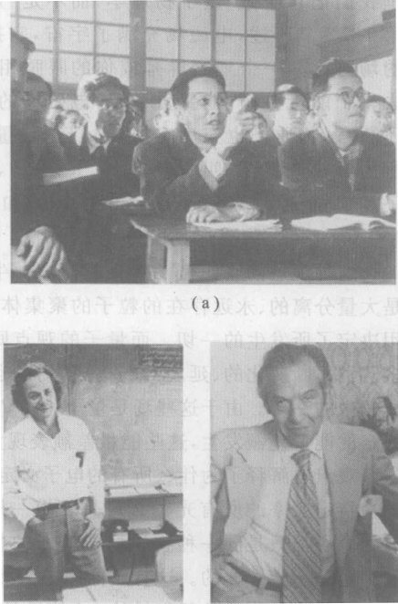

*图 18.1 量子电动力学（电磁力的量子场理论）的三位独立的创立者。(a) 朝永振一郎（在座位上打手势的人），摄于 1948 年，他的理论发表 5 年后；(b) 费曼。他因打破常规的思维习惯而闻名：他能在夜总会的后台上工作，音箱中震耳欲聋的音乐激励着他的灵感；(c) 施温格。一位独来独往的研究者，他跟别人说他在自己的战时实验室中“变成了一个科学研究的夜行侠”。*

量子电动力学讨论的是两种量子场之间的相互作用，这两种量子场是量子化的电磁场和量子化的电子场（电子的物质场）。从粒子的观点看，这个理论是光子（电磁场的量子）和电子（电子场的量子，这种粒子只受纯粹电磁力作用）的相互作用。听来简单。但是，电磁场和电子场必须既服从相对论又服从量子论的要求却导致惊人的结果。

在费曼的理论中，两个电子之间有连续不断的电力的老观念，被以一个光子的形式进行量子化的力的交换的图像代替了。图 18.2 画出了这个想法。这个图画的是两个电子在不同时刻的位置，并表示两个电子之间的一次量子相互作用。起初，电子 2 静止不动（其位置不随时间改变），而电子 1 向下运动。然后电子 2 辐射一个光子，这个光子穿过空间运动到电子 1，电子 1 吸收掉这个光子。在电子 2 发射光子时，就变为向下运动，而当电子 1 吸收光子时，就调头向上运动。这两个电子通过交换光子相互排斥，很像两个篮球运动员通过来回传球而相互作用。不过，使人惊奇的是，量子电动力学允许两个带相反电荷的粒子如质子和电子通过交换光子而相互吸向对方。

*图 18.2 一幅显示两个电子之间的一次量子相互作用的示意意图。这样的图叫做“费曼图”。*

每个量子事件都有量子不确定性。在图 18.2 中，光子的发射和吸收是不确定的。首先，发射和吸收是否发生就是不确定的，如果发生，它发生在何时何地也是不确定的。量子场论给出发生发射和吸收一个光子的概率公式代替确定的电力定律。在这个理论中，一个粒子带电就意味着它有发射和吸收光子的能力。

这个理论用弯折的、非确定的路径代替了光滑的、确定的牛顿模式路径。如果两个电子之间的力很弱，那么单个光子的能量低，量子理论预言的路径相当光滑，接近牛顿模式路径 [图 18.3(a)]。但是，如果力很强，量子理论的预言就明显为非牛顿式的 [图 18.3(b)]。

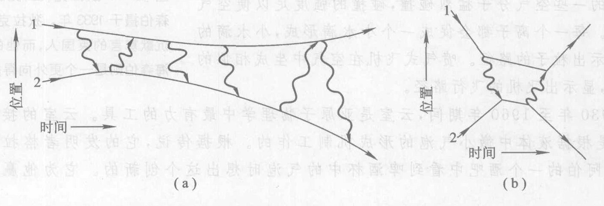

*图 18.3 (a) 两个相互作用微弱（就是比较弱的力，因此仅交换低能光子）的电子之间一系列相互作用的费曼图。电子的路径近于光滑的牛顿式路径；(b) 在更强的相互作用（高能光子）下，电子的路径明显地偏离光滑路径，牛顿物理学不再是良好的近似。*

至此为止，对电相互作用进行量子化得到的东西是我们所预期的：量子化的力与随和机性。但是一些全新的东西也显露出来了：为了使这个理论服从狭义相对论，自然界中必定存在一种新的实物粒子。

导致这个预言的论据是非常有趣的，并且是近代物理学中使用的典型推理方法。它的基础是对称性，这个概念我们在前面已经遇到好几次了。为了遵从狭义相对论，量子场论必须“在时间反演变换下对称”。换句话说，假如我们想象一个与我们的宇宙完全相似的宇宙，只是时间的流逝方向不同，那么量子场论的定律在那个宇宙中必定成立。② 费曼发现，一个想象在时间中倒退行进的电子，其可观测效应与另一个粒子完全相同，这个粒子和电子完全相似，只不过不带负电荷，并且在时间中正向行进。为了使物理定律在时间反演下对称，这个带正电的电子，或**正电子**，必须存在。③

② 这就引出了一个引人入胜的问题：如果我们的绝大多数基本物理理论关于时间是对称的，那么为什么时间的正方向与逆方向不同呢？比方说，为什么人都是越活越老而没有人越活越年轻？人们现在还不能回答这个极深奥的问题，不过答案与热力学第二定律有关系（第 7 章），并且按照大多数物理学家的意见，答案还与大爆炸有关（第 11 章）。

③ 英国理论物理学家狄拉克（图 18.4）更早，他在 1928 年就用一种不同的方法预言了正电子，他的方法用的是量子理论和狭义相对论，但不是量子场论。

对正电子的预言表明了量子场论大有用武之地：在此之前的理论，不论是牛顿理论还是相对论或是量子论，都只描写事物如何随时间变化。量子场论远远超越了这些理论从现在到未来和过去的延伸，它不仅描写事物如何运动，还描写哪种事物可以存在，哪种事物不能存在。

**我们怎么知道正电子和其他奇异的新粒子存在？** 亚原子粒子的路径可以用一种叫做**云室**的仪器显示出来。在一个容器（“室”）内充满含有饱和水蒸气的空气，所谓饱和水蒸气就是气态 $\text{H}_2\text{O}$ 刚好达到转化为液态水滴的条件时所处的状态。当一个带电的亚原子粒子如电子飞过这个小室时，会与其路径上的一些空气分子猛烈碰撞，碰撞的强度足以使空气分子电离。每一个离子都会促成一个小水滴形成，小水滴的径迹就显示出粒子的路径。喷气式飞机在空气中生成相似的雾化尾迹，显示出飞机的飞行路径。

在 1930 年至 1960 年期间，云室是亚原子物理学中最有力的工具。云室的接替者是**气泡室**，它是根据液体中微小气泡的形成机制工作的。根据传说，它的发明者格拉泽是在密歇根州安阿伯的一个酒吧中看到啤酒杯中的气泡时想出这个观念创新的。它为他赢得了诺贝尔奖。

1932 年，加州理工学院的安德森在云室中产生一个强磁场。我们还记得磁场会对运动的带电粒子施加一个侧向力。这个侧向力使通过磁场运动的电子的路径弯曲。一个粒子运动得越快，它的运动路径越直，两个粒子以相同的速率运动，则质量越大的粒子其运动路径越直，因此，从路径的曲率可以估计出运动粒子的速率和质量。

在 1932 年，唯一现成的可用于实验的高能粒子来自宇宙空间。安德森让这些“**宇宙射线**”通过他的云室，结果发现有数目不少的相当直的径迹。当时人们知道的带电粒子只有电子和质子。这些径迹似乎是由快速运动的电子造成的，但是它们弯曲的方向和预期的方向相反，表明这些粒子带正电荷。安德森起初不理会宇宙线应该从上向下运动这个事实，假设这些径迹是电子由于某种原因而从下向上飞过云室造成的。为了检验这个假设，他将一块薄铅板插入云室中间。快速运动的粒子轻易穿过铅板，但是速度会减慢，因此，通过铅板后粒子径迹的曲率会增大。图 18.5 是让安德森赢得诺贝尔奖的照片，在图中看得清清楚楚，粒子是从上向下运动的，因为在照片的下半部分粒子路径的曲率更大，于是粒子径迹的曲率表明，它带的是正电荷。安德森就这样发现了正电子。

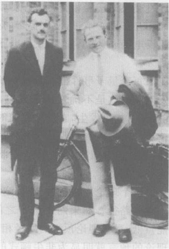

*图 18.4 狄拉克（左，见脚注③）与海森伯摄于 1933 年。狄拉克是一个极为沉默寡言的英国人，而他的好友海森伯则是一个更外向得多的德国人。*

为了在宇宙线还未与多雾空气发生相互作用之前对它们进行观测，安德森于 1936 年在科罗拉多州派克斯峰山脉上建造了一个新的磁场云室。他发现了一些奇怪的径迹，它们与质子、电子甚至正电子对不上号。这些径迹的曲率比质子的大很多，而这些粒子又轻易地通过了一组铅板，如果它们是电子，这些铅板会使它们停住的。安德森发现，这种新粒子的质量是电子的 200 多倍，但是其他方面的特性却与电子完全相同。这确实令人感到意外。正像哥伦比亚大学的物理学家拉比问的，“这是谁订的货？”今天，我们仍然不知道。这种粒子叫做 **$\mu$子**。

## 18.3 反物质

正电子是科学中遇到的第一种**反粒子**。相对论对量子场论在时间反演下对称的要求意味着，对于每一类存在的粒子，必定有一类反粒子。一个粒子及其反粒子的电磁性质为镜像，其他特性完全一样。例如，电子的反粒子是带正电的正电子。同样，质子的反粒子是带负电的**反质子**，中子的反粒子是不带电的**反中子**。尽管反中子总体不带电，但是它的磁性是中子的磁性的镜像。

量子场论和高能实验物理学意义最深远的成就之一是预言和观测到物质的产生与湮没。大家知道，量子场论认为，电磁场和电子场与其他系统，如双缝实验（第 13 章）中的观察屏幕，通过交换一个或者多个量子而相互作用。对于电磁场，这个量子的名字叫做光子，而电子场的量子的名字叫做电子和正电子。量子场论预言了一个电磁场与一个电子场相互作用时能发生什么事情。一种可能是，电磁场向电子场交出一个或者几个量子（光子），从而增加电子场的能量。通常情况下，这个过程的可观测效果只是使可能在（比方说）一个云室中观测到的某个电子（电子场的量子）的能量增加。不过，如果电磁场向电子场交出能量足够高的光子，某种新现象就会出现：能够产生出电子场额外的量子，也就是说是，能够产生出电子和正电子。可是实验表明，在任何微观的相互作用中，总电荷量必定保持不变，因此，电子和正电子总是成对产生。量子电动力学给出了这个现象发生的概率。

另一种可能是，电子场交给电磁场量子。能够发生这种过程的一个途径是，一个电子和一个正电子从电子场中消失，而一个或者几个高能光子在电磁场中出现。因此，电子-正电子对既可以产生也可以“**湮没**”。

因此，量子电动力学预言，一个光子有一定得概率以一电子-正电子对或多个这样的对的形式出现，而电子-正电子对也有一定的概率以一个或多个光子的形式出现。图 18.6 是一个光子的部分生活史的费曼图，它向我们宣示了这种观念。反过来，假如一个粒子与它的反粒子相互足够近能够发生相互作用，它们又可以成为光子。

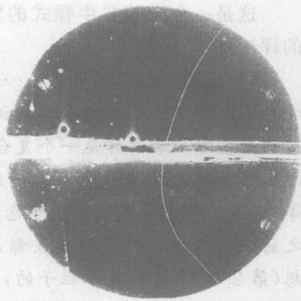

*图 18.5 赢得诺贝尔奖的照片，单凭这张照片就确证了正电子的存在。*

> 正像一个粒子可能处于这样一个量子态，在这个态中它既不明确地在这里也不明确地在那里……一个粒子也有可能处于这样一个态，在这个态中既不能明确地说它是电子也不能明确地说它是中微子，只有当我们测量到某些区别两者的特性（比如电荷）之后才能分辨它们。
> ——温伯格

这是一个极其非牛顿式的发展。正如海森伯对此所作的评论：

“粒子与反粒子的发现……已经改变了我们对原子物理学的全部看法……一旦我们认识到能够产生粒子对，我们就必须把基本粒子看作是一个复合系统；由于一个基本粒子实际上有可能是这个粒子加上一组粒子对、加上两组粒子对，等等，因此基本粒子的整个概念在一夜之间发生了改变。在此之前，我想，物理学家们一直都是根据德谟克利特的哲学思想（第 2 章）来看待基本粒子的，即把它们看作是不可改变的结构单元，它们是大自然所特有的，永远是同样的东西，绝不改变，绝不能变为任何别的东西。它们不是一个动力学系统，它们只是自身存在着。在这一发现之后，每一件事都显得不一样了，因为我们可以问，为什么一个光子不会有时候是一个光子加上一组电子和正电子对，等等？……因此，对物质分割问题的看法跟从前大不一样了。”

**反粒子**意味着**反物质**的可能性，反物质与普通物质相似，不过由反质子、反中子和正电子组成的。的确，人们在 1996 年首次将反质子与正电子结合在一起产生在几个反氢原子。虽然为“企业号星际飞船”上的反物质推进器提供动力的梦想仍是遥不可及的事，不过，研究人员今天已经能够以每秒几个原子的速度制造反氢。

大量反物质的集聚如反恒星系是有可能的，但是人们认为它们并不存在，因为如果它们存在的话，当一个星系与一个反星系相撞时，我们就会观测到湮没过程所发出的高能辐射。我们观测到许多正在发生碰撞的星系，却从未观测到这样的湮没过程，因此人们相信，宇宙中只包含极少量的反物质。

不过，对称性似乎暗示我们，宇宙应该由等量的普通物质和反物质构成。那么，为什么普通物质如此之多，而反物质却如此之少呢？俄国物理学家萨哈罗夫于 1967 年提出，大爆炸可能的确创生出等量的普通物质与反物质，但在宇宙诞生的最初 1 秒内，某些罕见的对称性破缺过程使普通物质的量稍微多出一点（小于 $10^{-9}$），然后其余的普通物质与反物质湮没了，而普通物质的这一微弱超出就构成了今天宇宙中的全部物质。发生了这种事情对于包括我们在内的宇宙中的生命是一件好事情。假如不是由于在最初 1 秒内普通物质有这一微弱的超出，宇宙也许就会几乎全部由辐射构成，而我们也许就不曾在这里思考反物质问题了。

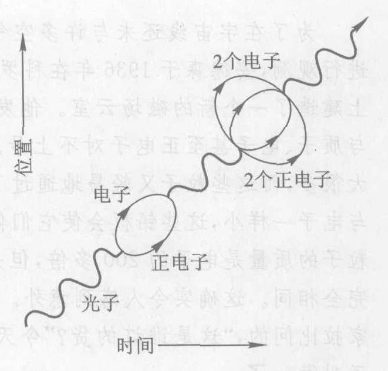

*图 18.6 一个光子的生活史中的若干瞬间（在某段时间内是一对电子-正电子，在另一段时间内则是两对）。*

**我们怎么知道反物质存在？** 在高能物理实验室中，物质与反物质的产生与湮没已成为一件常规事情。每当一个高能粒子进入气泡室并与液体颗粒相撞时，就会发生反物质的产生与湮没（图 18.7）。这时会产生新粒子的簇射，其中包括有粒子-反粒子对。安德森利用自然的宇宙射线作为高能入射粒子。今天，入射粒子先在**粒子加速器**（图 18.8）中由电磁力加速到高能量。

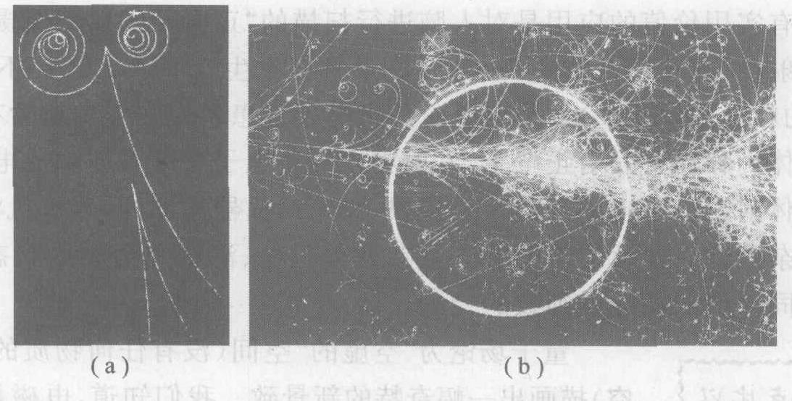

*图 18.7 (a) 由 $\gamma$ 射线光子产生电子-正电子对的气泡室照片。在照片的顶部，一个光子撞击一个原子中的电子并把它从原子中打了出来（长曲线），与此同时，产生出一对电子和正电子（紧绕的螺线）。靠近照片的底部，另一个光子产生一对电子和正电子。你怎样判断每一对有两个电荷相反的粒子？在这两对粒子中，哪一对的能量和速率更高？为什么看不见光子的路径？(b) 一个高能粒子撞击气泡室中的一个粒子，产生含有各种粒子的“喷注”。图中亮线是测量装置的一部分；别的曲线是亚原子粒子的路径。*

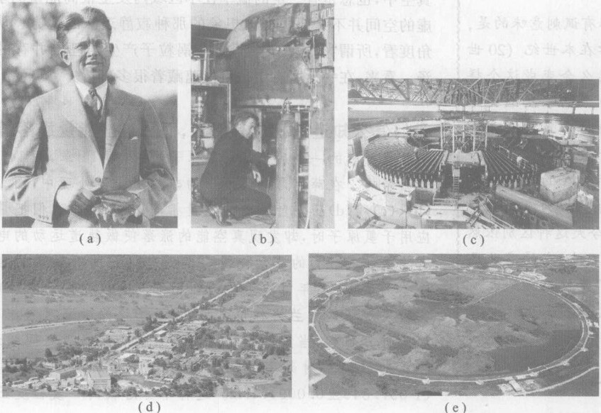

*图 18.8 图解粒子加速器简史。最早的加速器是放电管，与今天的日光灯管相似。比较这几个图与第 1 章图 1.2，不论是观测外层空间还是探索原子内的亚原子空间，都需要大型仪器。(a) 劳伦斯发明回旋加速器，这种加速器用电磁场使带电粒子按圆形轨道运动并加速这些粒子。图中是他 1930 年手拿着一个早期的回旋加速器，他在这一年首次提出回旋加速器的设想；(b) 劳伦斯于 1934 年在一台 27 英寸 (1 英寸 = 2.54 cm) 的回旋加速器旁。1937 年，这台机器产生出第一种人造元素锝。尽管这种元素的原子序数为 43，排在周期表的中间，但它的所有同位素都是短寿命的放射性同位素，因此，在地球上没有发现天然的锝；(c) 这台加速器安装在加州大学伯克利分校，是第一台能量足以产生质子-反质子对的加速器；(d) 安装在加州斯坦福大学的直线加速器 (SLAC)，在 3 km 长的直管道内对电子进行加速。假如这些高速电子是在圆轨道上运动，它们就会把自己自身能量的大部分辐射掉；(e) 芝加哥附近的费米实验室。周长 6 km 的主加速环将质子加速到非常高的能量。*

反物质的一个有实用价值的应用是对人脑进行扫描的“正电子发射断层摄影术”(PET)。扫描过程利用氟的放射性同位素 ${}^{18}\text{F}$ 进行，这种同位素具有发生正 $\beta$ 衰变这一不寻常的特性，也就是说，衰变所发射的粒子（第 15 章）不是电子而是正电子。患者先咽下少量含有 ${}^{18}\text{F}$ 的类糖药物。这种药物在患者的体内移动并发射正电子，发射出来的正电子立即与体内的电子碰撞并湮没，产生 $\gamma$ 射线光子从人体射出。来自脑部的 $\gamma$ 射线被 PET 扫描器检测到，计算机将它们转化成患者脑部糖类代谢的复杂图像。这就使得能够在患者处于轻松、清醒和活动的状态下对处于工作状态下的人脑各个不同区域的功能做细致的检测。

**没有相何观测量点比以下观点更为重要，那就是真空不空。这是最前沿的物理学的主要观点。**
——惠勒

**具有讽刺意味的是，物理学在本世纪（20 世纪）怎么会变成这个样子。19 世纪与 20 世纪早期的特征是唯物主义观点盛行，这种观点对实际上存在的事物与不存在的事物加以明显的区别。今天这种区别依然存在，不过，它的意义已经起了变化……一无所有中包含着一切存在。**
——帕格尔斯，物理学家

量子场论为“空虚的”空间（没有任何物质的空间，通常叫做**真空**）描画出一幅奇特的新景致。我们知道，电磁场和别的场伸展到甚至没有任何物质的区域。可是，在任何存在有比方说电磁场的地方，都有某个概率值让一个光子或粒子-反粒子对突然爆出来又突然消失。量子不确定性允许空间中任何一点的能量围饶其长期平均值涨落。空间区域越小，这种能量涨落可以越大。因此，即使在真空中，也总是有一一定的概率在极小的区域内发生很高能量的事件。空虚的空间并不像是我们曾想象的那种寂静乏味的地方。从微观的角度看，所谓“空虚的”空间是一锅粒子产生与湮没并存的开锅的汤。看来，在一无所有中也能蕴藏着很多事情。

**我们怎么知道“真空”有能量，而且这些能量涨落着？** 真空能量涨落的一个后果是对氢原子能级（第 14 章，第 14.7 节）的轻微影响。在薛定谔对氢原子的非相对论性处理中，图 14.23 中的 (b)、(c) 和 (d) 三个量子态的能量相同。可是，当我们把量子场论应用于氢原子时，却发现真空能量的涨落使做轨道运动的电子稍微有些晃动，态 (b) 的晃动能量与态 (c) 和 (d) 的有轻微的差别。这一差别于 1947 年首次由兰姆在精细测量氢光谱的实验中发现。实验发现了这种**兰姆移位**之后，量子场论的专家对它作了计算。理论计算预言，当氢原子在这两个紧挨着的能级之间跃迁时，吸收或发射的辐射频率为 $(1\ 057.860 \pm 0.009)\ \text{MHz}$。测量值为 $(1\ 057.845 \pm 0.009)\ \text{MHz}$。这种不可思议的一致程度正是理论的精确和光谱测量的精度的明证。

量子电动力学不仅描述了电子和正电子，还可以描述与电子相似的 $\mu$ 子和反 $\mu$ 子。此外，第三种与电子相似的粒子及其反粒子于 1976 年被发现，叫做 **$\tau$ 子**。这个粒子比 $\mu$ 子重得多，其质量是电子质量的 3 500 倍，或者说接近质子质量的两倍。这一次也没有任何人知道“是谁订的货”。今天看来，这三代类电子粒子有可能属于最基本的物质组分之列。所有这三种粒子连同它们的反粒子都通过交换光子相互作用，它们之间的全部相互作用都可以用量子电动力学正确描述。

$\mu$ 子与 $\tau$ 子是不稳定的；换句话说，它们自发衰变成能量更低的粒子。在今天，$\mu$ 子和 $\tau$ 子只是通过真空涨落或在高能相互作用中产生以后以粒子-反粒子对的形式短暂出现时才起点作用。然而，这两种重电子在宇宙创生的大爆炸过程中可能起过关键作用。前面提到的使普通物质比反物质在量上略占优势的萨哈罗夫过程要求有这三类电子。虽然 $\mu$ 子和 $\tau$ 子似乎是神秘的，但是，我们的存在也许归功于它们在宇宙的最初 1 秒钟内的活动。

是否还有别种更重的电子呢？我们将看到，把理论与天文观测结合起来所得出的答案是：没有。

> **概念检查 1** 假如你访问一个反星系，那么：(a) 你将会被吸入它的黑洞中并被撕得粉碎; (b) 那里的所有行星都含有多种与地球上相同的化学元素，不过这些元素都由反物质构成; (c) 你将发现物体之间的引力是相互排斥的而不是相互吸引的; (d) 你将会湮没; (e) 这肯定是一次单程旅行。

> **概念检查 2** 有一个 $\gamma$ 射线源，它发射的光子有 20% 的能量足以以电子-正电子对的形式出现。这个源发射出 400 个光子。我们将观测到多少个实物粒子？(a) 大约 160 个; (b) 刚好等于 160 个; (c) 大约 80 个; (d) 刚好等于 80 个。

> **概念检查 3** 以下哪种粒子会感受电力？(a) 质子; (b) 电子; (c) 正电子; (d) 反质子。

## 18.4 电弱统一和中微子

1930 年泡利提出，在放射性 $\beta$ 衰变中，原子核除发射一个 $\beta$ 粒子外，还发射一个全新类型的粒子。他把这种假设的新粒子叫做**中微子**，意即“微小的中性粒子”。我们在第 6 章中讨论了这个假说的历史及其与能量守恒的关系。尽管中微子在此之后 25 年才在实验中发现，费米还是认真地对待它们，他主张，中微子的存在表明有一种新的基本力——**弱力**在自然界起作用。费米了解关于电力的量子场论工作的进展，他很快把这些想法应用于弱作用力。费米的理论成功地预言了放射性原子核的半衰期和 $\beta$ 衰变过程中从原子核射出的 $\beta$ 粒子的能量范围。

在自然界的四种基本力中，弱力是最不清楚的。万有引力和电磁力由于能够在长距离上起作用，这两种力一直显露在我们的宏观世界中。强力将原子核结合在一起，对核能与核武器起主要作用，是引起放射性 $\alpha$ 衰变的主要原因。而关于弱力的最引人注目的例子是 $\beta$ 衰变。由于弱力既微弱又是短程的，因此我们对它最不清楚。

中微子几乎完全不显示的存在的。这就是说，它几乎没有什么物理特性：没有电荷、静止质量极小（比电子的静止质量小多了），既感受不到电力也感受不到强作用力。这种“微小的中性粒子”以非常接近光速的速率运动，只能感受弱作用力（以及万有引力），是已知粒子中最令人难以捉摸的、也是最奇特的。

由于中微子只参与弱相互作用，当它们穿过物体运动时几乎感受不到物质的存在。在 $\beta$ 衰变中产生的中微子需要穿过 8 光年厚的铅块才有一半停下来！难怪研究 $\beta$ 衰变的物理学家捕捉中微子会遇到这么多的麻烦（第 6 章）。在任何时刻都有成千上万来自宇宙空间的中微子从各个方向穿过你的身体，但是，你也许要等待很多很多年，才会有一个中微子在你的身体内发生相互作用。现在从你头顶上向下穿你而过的中微子会很容易穿越我们的行星，不用 1/10 秒就穿出地球的另一边，不到 2 秒就会跑到月亮轨道之外。

> 乍一看，所有这些好像是中世纪神秘主义者在讨论天球的音乐、针尖上的天使或者某些类似的早期宇宙学研究。难道我们仅仅是在玩数学游戏吗？难道仅仅是语义学上的把戏吗？抑或这这就是实在？
> ——莱德曼和施拉姆，引自 *From Quarks to the Cosmos*

1967 年，巴基斯坦物理学家萨拉姆和美国物理学家温伯格（图 18.9）各自独立地揭示了弱力与电磁力之间的紧密联系。他们提出了一种新的量子场论，将这两种力结合成一种统一的**电弱力场**，并且将电子的物质场和中微子的物质场结合成一种统一的**电弱物质场**。这种统一可以与 19 世纪期间麦克斯韦完成的统一相提并论，麦克斯韦将电力和磁力统一成统一的电磁力。

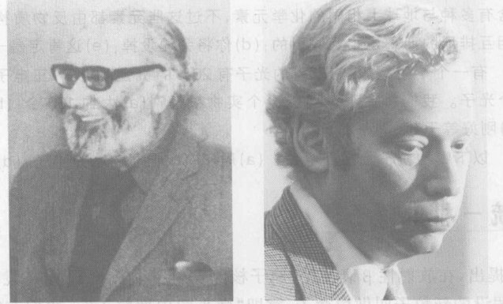

*图 18.9 电弱力理论的共同创立者。他们将电磁场和弱核力场的量子理论结合成一个单一的电弱量子场论。(a) 萨拉姆，生于巴基斯坦，是信仰伊斯兰教的最杰出的科学家之一。他将诺贝尔奖中自己的那一份捐赠给在意大利的里雅斯特的以他的名字命名的研究所，该研究所资助来自发展中国家的科学家；(b) 美国物理学家温伯格，除了因量子场论领域的工作赢得了诺贝尔奖之外，他还为非科学界人士写过几本书，其中 Dreams of a Final Theory\* 是一本关于基本相互作用力和其他主题的书，另一本书 The First Three Minutes\*\* 描写并解释了大爆炸的早期阶段。*

我们记得，量子电动力学描述电子和正电子的电相互作用，这种相互作用通过在带电粒子之间交换光子而发生。温伯格-萨拉姆理论推广了这幅图像。这个理论认为，弱力和电磁力都来自单一的力场，因此它们实际上是同一个电弱力的不同侧面。这个理论描述电子、正电子、中微子和反中微子的电磁相互作用和弱相互作用，认为这种相互作用是通过交换一些别的粒子而发生的。这些交换粒子包括光子和另外三种粒子。这三种新的交换粒子与光子有些不同，主要的不同是这三种粒子都有质量——事实上，就亚原子粒子而言是有很大的质量。每种粒子的质量大约是质子质量的 100 倍！三种粒子的记号分别为 $W^+$, $W^-$ 和 $Z$，可以把它们看成是由于某种未知原因而获得了质量的光子。与光子的另一个不同之处是两个 $W$ 粒子分别带有正电荷和负电荷。$Z$ 粒子和光子一样不带电。质量很大的中性 $Z$ 粒子是电弱理论的一个惊人的新预言，6 年后，在 1973 年实验探测到这种粒子，完全证实了这个理论。

\* 中译本：终极理论之梦，李泳译，湖南科学技术出版社，2003。
\*\* 中译本：最初三分钟，洗鼎钩译，科学出版社，1981；宇宙最初三分钟，张承泉等译，中国对外翻译出版公司，2000。——译者注

我们还记得，除电子外，还有另外两代更重的类电子粒子，即 $\mu$ 子与 $\tau$ 子。既然电弱力将电子与中微子结合到一个家族中，我们可能会猜测，存在着与 $\mu$ 子相伴的第二代中微子和与 $\tau$ 子相伴的第三代中微子。这是一个很好的猜想。事实上，确实存在一种第二代物质场，它的量子是 $\mu$ 子和“$\mu$ 中微子”，还存在一种第三代物质场，它的量子是 $\tau$ 子和“$\tau$ 中微子”。所有这三代粒子都通过同一中电弱力场及其四种交换粒子（光子、$W^+$, $W^-$ 和 $Z$ 粒子）而相互作用。电弱理论正确地预言了这些基本粒子的所有观测到的相互作用。表 18.1 总结了这个理论。

**表 18.1 电弱力理论**
两种基本的电弱场遍布宇宙：一种是电弱力场，它的量子是下表列出的四种交换粒子，另一种是电弱物质场，它的量子是电子和电子中微子（e 中微子）。此外，存在“第二代”和“第三代”物质场，它们的量子在下表中列出。

| 代 | 粒子种类 | 质量(质子=1) | 电荷(质子=+1) | 代 | 粒子种类 | 质量(质子=1) | 电荷(质子=+1) |
| :---: | :--- | :--- | :--- | :---: | :--- | :--- | :--- |
| 1 | 电子 | 0.000 5 | -1 | | **交换粒子** | | |
| 1 | e 中微子 | a | 0 | | 光子 | 0 | 0 |
| 2 | $\mu$ 子 ($\mu$ 电子) | 0.11 | -1 | | $W^+$ | 86 | +1 |
| 2 | $\mu$ 中微子 | a | 0 | | $W^-$ | 86 | -1 |
| 3 | $\tau$ 子 ($\tau$ 电子) | 1.90 | -1 | | $Z$ | 98 | 0 |
| 3 | $\tau$ 中微子 | a | 0 | | | | |

*注：a 最近发现，三种中微子中至少有一种具有很小的非零的静质量，尽管其精确值还不确定。例如，已经知道 e 中微子的质量小于电子质量的 600 万分之一。*

**我们怎么知道中微子存在？** 我们在第 6 章中看到，在 1930 年前后，当 $\beta$ 衰变实验似乎与能量守恒冲突时，存在中微子的猜测首次被提出。应用能量守恒和其他公认的原理得出的结论是：在 $\beta$ 衰变中，除了观测到的 $\beta$ 粒子之外，还产生一个没观测到的粒子。而且，观测数据暗示，这种粒子的（静止）质量或者为零，或者非常小，比一个电子的质量小得多。大多数物理学家假设它等于零。

中微子最终于 1956 年被观测到。在这个实验里，在一个核反应堆中由 $\beta$ 衰变产生的数量极其庞大的中微子入射到一个巨大的水池中。这些中微子中每小时只有大约 3 个与水中的质子相互作用，产生出科学家能够观测到的高能 $\gamma$ 光子，证实这种相互作用确已发生。

上述实验显示，$\beta$ 衰变的确认产生了中微子，尽管每小时只观测到 3 次中微子的相互作用。由于在反应堆中每秒发生的几万亿次 $\beta$ 衰变过程基本上是相似的，因此每次 $\beta$ 衰变都将伴随着有一个中微子产生。我们从这里得到的结论是：核反应堆每秒射出数以万亿计的观测不到的中微子，它们穿越水池而不发生任何相互作用。

不过，物理学家仍然不能确定这种难以捉摸的粒子的质量到底为零还是不为零但很小。随着时间的过去，实验能定出中微子质量的越来越小的上限。今天，e 中微子质量的可能值的最大值是一个电子质量的 600 万分之一的一个零头。直到最近，质量等于零看来是最有道理的。毕竟，如果这个新粒子的质量简单地为零（像光子那样）就能跟所有的数据相符合，为什么偏偏要让它有一个远小于任何其他已知实物粒子的质量呢？

但是在 2001 年，科学家们确认，中微子终究是确实具有质量的。完成这个任务可不简单。

**我们怎么知道中微子有质量？** 从质量“很可能等于零”到“确定不等于零”的转变开始于 20 世纪 60 年代末来自太阳的中微子的观测。物理学家用普遍接受的关于在太阳内部发生的核反应的理论计算太阳发射的高能中微子的数目。这个预言可以用巨大的中微子探测器 [也叫做**中微子望远镜**，见第 1 章图 1.2(d)] 来验证。中微子探测器安装在地下的深处，以避免来自太空的 $\gamma$ 光子和其他高能粒子对检测器的干扰。但是，观测结果与预言相差极大：观测到的中微子数目只有预言值的 1/3。理论和观测的这种不一致是科学中出现创造性发现的契机，在这个时刻往往能确认一些全新的东西。

几个不同的小组在不同地点用不同技术重复了上述实验，但是理论和观测的不一致仍然如旧。科学家们听怀疑理论是不是错了——要么是太阳内部核反应的理论错了，要么是基本的中微子物理学理论错了。

天体物理学家们仔细审查了太阳内部核反应的整个理论，但是找不到任何漏洞。猜疑转向中微子物理学。人们对温伯格-萨拉姆电弱理论提出了几种修改方案。一个新的令人惊讶的理论预言出现了：如果两种中微子具有不同的质量，那么它们就能够自发地与对方交换身份。例如，假如 e 中微子和 $\tau$ 中微子具有不同的质量，那么一个 e 中微子就能够自发地变为一个 $\tau$ 中微子，反之亦然，这和一个高能光子能够变为一个粒子-反粒子对很像。

科学家们意识到，这种中微子身份转化有可能解决太阳中微子“失踪”之谜。预言的太阳发射的中微子全是 e 中微子，现在的中微子探测器只能探测到 e 中微子。如果来自太阳的中微子有一部分在它们离开太阳后的旅途中转变为另外两种中微子之一，那么，地球上探测到的 e 中微子的数目就会少一些。

需要能够观测所有各种中微子的新探测器。日本的超级神冈探测器 [图 1.2(d)] 就是为这个目的而建造的。天体物理学家小柴昌俊（图 18.10）用这台探测器观测来自太空的高能粒子撞击地球大气所产生的 $\mu$ 中微子。他得到一个令人惊讶的结果。穿过我们的行星从下方进入地下探测器的大气 $\mu$ 中微子的数目只有从上方进入的数目的大约一半。显然，有一些向上运动的 $\mu$ 中微子在穿过地球的 0.1 秒的旅程中丢失了。这是令人惊讶的，因为已经知道，这些粒子中只有微不足道的份额能够在地球内部发生相互作用而丢失。人们猜想，这个差值是由于 $\mu$ 中微子在这 0.1 秒期间自发转变为其他某种类型的中微子而引起。2000 年，超级神冈的科学家们宣布，从 $\mu$ 中微子到 $\tau$ 中微子的这种转变是实际发生的。

2001 年，用另一个位于加拿大的新探测器做实验的科学家宣布了关于太阳中微子问题的明确解答，使上述结果更令人信服。在加拿大的实验中，来自太阳的所有各种中微子的总数与预言的太阳发射的 e 中微子的数目精确地一致，但是来自太阳的 e 中微子的数目只有预言值的大约 1/3，就像从 20 世纪 60 年代以来一直观测到的那样。这说明太阳发射的 e 中微子中，有大约 2/3 在飞向地球的旅途中转变成 $\mu$ 中微子或 $\tau$ 中微子。

自然的结论是：三种中微子中至少有一两种必须具有质量，因为只有不同质量的中微子能够相互转化身份，因此它们的质量不可能全都是零。

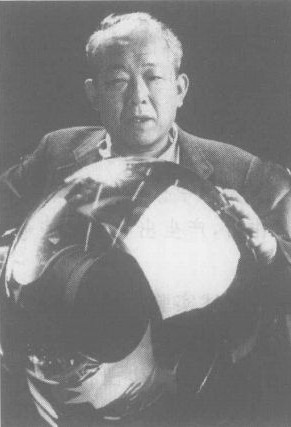

*图 18.10 东京大学的天体物理学家小柴昌俊。他用建在日本的超级神冈中微子探测器证实，许多由高能宇宙射线撞击地球大气产生的 $\mu$ 中微子在穿透我们这颗行星的旅途中转变成 $\tau$ 中微子。*

除了表 18.1 中列出的三代电弱粒子外，还有更多代电弱粒子吗？事情的一个意想不到的转折是，天文观测表明只有三代电弱粒子。理由来自大尺度宇宙与微观世界之间的一个密切联系：外部空间（宇宙空间）与内部空间（原子内的微观世界）是通过一个迅速变成宏观的微观事件而紧密联系在一起的。这个事件就是大爆炸。

发生大爆炸 4 分钟后，宇宙的组成中大约有 75% 的氢和 25% 的氦（第 11 章）。这些数字是原子核物理学理论所预言的，它们同时对宇宙中最古老物质的观测结果相一致。理论上预言的氦所占的百分比与电弱粒子有多少代有关：代的数目越多，预言的氦所占的比例就越大。如果有三代电弱粒子，预言的氦所占的百分比与观测值符合。如果存在有四代电弱粒子，预言的氦的百分比就太高，不能与观测到的氦的百分比一致。结论是：只有三代电弱粒子。

> **道生一，一生二，二生三，三生万物。**
> ——老子，引自《道德经》，第 42 章

近来，地质学家利用中微子来了解地球内部深处发生的过程。人们假设，地壳板块在热能的作用下一直一直在运动。热能有两个来源：地球在 46 亿年前形成时残留的热能，和后来由放射性衰变产生的附加能量。2005 年，科学家们报告了利用中微子探测器观察由地球内部深处的铀 238 和钍 232 的放射性衰变发出的中微子的结果。虽然在长达两年多的数据采集期间仅有 4 个到 54 个（实验有较大的不确定性）这样的中子触了探测器，这已经足以证实地质学家的假设。

统一是科学史上多次重复奏响的主题（图 18.11）。例如，哥白尼将地球与其他行星统一起来；牛顿将地上的物理学与天上的物理学统一起来；麦克斯韦发现了一种将电、磁与光统一起来的场论。在 19 世纪末之前，科学家相信只有两种基本力，即电磁力和引力。爱因斯坦在创立了将引力解释为时空几何的结果的新理论后，花了他自己科学生涯中的大量时间试图将电磁力与引力统一起来，希望一个单一的“统一场论”能够将电磁力和引力表现为时空几何的不同的侧面。他没有成功。

后来，科学家们以量子场论为基础，在微观的层级上探求统一。我们已经看到，这些努力通过将量子理论、狭义相对论及电磁力和弱力统一起来，得到了重大的成就。物理学家今天正在试图将电弱力与强作用力统一起来（第 18.5 节），并且将所有这些力与引力统一起来（第 18.6 节）。

> **概念检查 4** 以下粒子哪一种能够感受电力？(a) $\mu$ 子; (b) $\tau$ 中微子; (c) 电子; (d) 光子; (e) $W^+$ (f) $Z$。

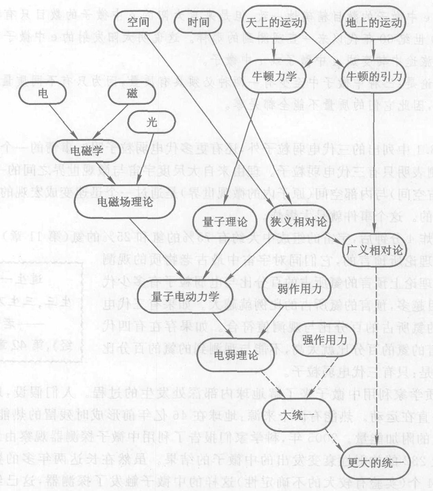

*图 18.11 物理学中的一些统一，虚线表示还未建立起来的统一。时间从上到下演进。*

## 18.5 强作用力和夸克

迄今为止所作的测量告诉我们，所有的电弱粒子（表 18.1）都是点粒子。也就是说，它们的力场像是集中在一个点上，它自身不占任何体积。例如，电子的电荷就像是集中在一个点上。但质子和中子则不同。20 世纪 50 年代做的实验表明，它们的电力和磁力中心分布在一个线度大约为 $10^{-15}\ \text{m}$ 的小体积内。这些粒子是否可能是复合粒子，由更小的、点状的粒子组成呢？

在 20 世纪早期，人们以为质子和电子是仅有的亚原子粒子。1932 年，人们发现了中子和正电子，开创了一个发现粒子的亚原子粒子。到 1960 年，已经产生了几百种被认为是基本粒子的新粒子。人们常把这份令人眼花缭乱的粒子清单戏称为“粒子动物园”。宇宙肯定不是由这么多不同的东西构成的。

> **如果我能记住所有这些粒子的名称，我早就去干植物学了。**
> ——费米，在谈到 20 世纪 60 年代所发现的各种亚原子粒子时

盖耳曼（图 18.12）希望通过按照粒子的物理性质的规律性将已知的粒子分门别类，整顿这个粒子动物园的秩序。盖耳曼的工作与 19 世纪化学家的工作很相似。当时这些化学家发现了“原子动物园”中的许多已知元素的化学性质的规律性，他们按照这些规律将元素归类生成一个表，就是今天的元素周期表。只是在后来，人们才在一个新的原子模型中找到了周期表的自然解释，按照这个新模型，100 多种元素仅由电子、质子和中子构成。同样，盖耳曼的分类方案使他猜测可能存在几种更简单的实体，他称之为**夸克** (quark)，质子、中子和其他粒子可能是由它们构成。这使实验物理学家开始猎捕夸克。可是，尽管花了很大的气力在气泡室径迹中进行搜寻，却没有何任何人能够找到夸克存在的直接证据。

**我们怎么知道夸克存在？** 当泰勒、弗里德曼、肯德耳（图 18.13）和 12 位同事于 1967 年开始研究质子和中子的时候，他们并不是在寻找夸克。他们用斯坦福直线加速器 [SLAC, 图 18.8(d)] 继续先前的实验工作，先前的实验显示质子和中子是线度为 $10^{-15}\ \text{m}$ 的模糊的球。为了得到了这些模糊球的更清晰的图像，他们用 SLAC 的高能电子猛撞质子，并使用他们专门建造的巨型探测器测量电子被质子偏转后的偏转角（图 18.14）。当电子的能量较低时，散射只给出与以前相同的那个模糊球的图像，不过分辨率更高。但是，当电子的能量高到足以将质子和中子打成碎片时，他们发现了意外的事情。有些电子的偏转角非常大，就好像它们是被深埋在模糊球内部的坚硬小颗粒反弹回来一样。这个实验的方法及其结果与卢瑟福发现深藏在原子内部的坚硬小核的实验相似（第 8.6 节）。只不过这一次在质子和中子的内部看来不是一个力心，而是三个小力心。泰勒、弗里德曼和肯德耳找到了盖耳曼的夸克。

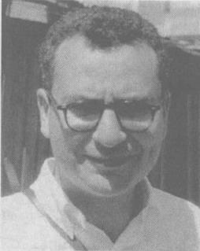

*图 18.12 盖耳曼提出了一个对当时已知的亚原子粒子进行分类的方案。1961 年前后，这个方案预言存在新的粒子，还暗示存在在几种更简单的实体，叫做夸克，质子、中子和其他粒子可能由夸克构成。夸克于 1967 年在实验上被发现。*

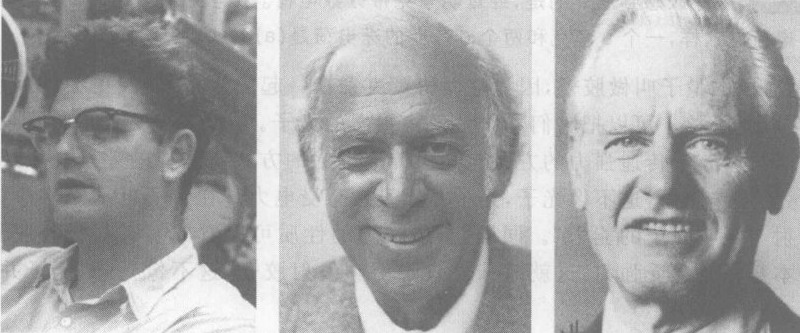

*图 18.13 (a) 泰勒, (b) 弗里德曼, (c) 肯德耳。他们用斯坦福直线加速器加速的高能电子轰击质子和中子以探测质子和中子的内部。这种方法与卢瑟福当年用 $\alpha$ 粒子轰击原子来探测原子的内部（图 8.27）非常相似。正如卢瑟福的 $\alpha$ 粒子散射显示出每个原子内部有一个小而致密的核——原子核，这三位科学家的实验结果显示出在每个质子和中子的内部有三个小硬点——夸克。*

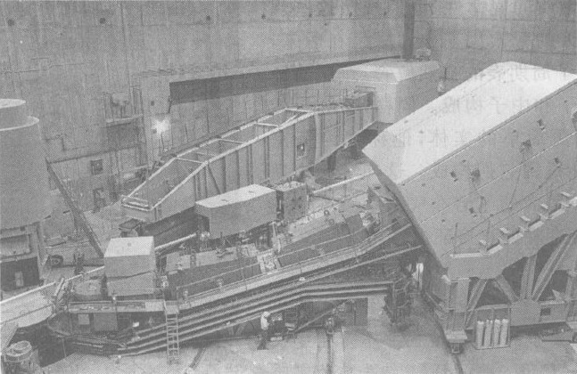

*图 18.14 SLAC 的巨型电子探测器。电子束从左方进入，与一个靶中的质子碰撞。用三台探测器对偏转电子进行分析，这三台探测器分别是：左方的圆柱形大罐（不全），前后两个巨型探测器。*

物理学家已经提出了量子场论的一个新版本来描述夸克之间的相互作用，迄今为止它与所有用来检验这个理论的实验都一致。在这个理论中，强力直接作用在夸克之间，而作用在质子和中子之间的力只不过是它们的夸克之间的力的结果。新理论中被量子化的力场（与电磁场类似）是**强作用力场**，被量子化的物质场（与电子场类似）是**强作用物质场**。强作用物质场的量子是两种夸克，叫做 **u 夸克**（上夸克）与 **d 夸克**（下夸克）及其反粒子。这个理论论和两个 d 夸克组成的。这就是质子和中子存在的原因！我们知道，质子受电力的作用，而夸克是为了解释质子而假设的，因此，夸克除了感受和施加强作用力之外，必定还受电力作用。

> **概念检查 5** 令人感到意外的是，经查明夸克带分数电荷。u 夸克带 +2/3 质子电荷，d 夸克带 -1/3 质子电荷。这样，一个 u 夸克和两个 d 夸克的净电荷是 (a) 0; (b) 1; (c) 2。

强作用力场的量子叫做**胶子**，因为它们将夸克粘在一起成为核子，在更大的尺度上，它们也将核子粘成原子核。可以把它们看作是强作用力的光子。与光子一样，它们既没有质量也不带电荷。不过，胶子传递强力的方式与光子传递电力的方式有重要的差别。胶子本身会直接施加和感受强作用力，这不像光子，光子并不直接感受电力。在量子电动力学中，“电荷”可以看成“发射与吸收光子的能力”。同样，感受强力的性质可以看成发射与吸收胶子的能力。可是，胶子本身却会感受强力，这就意味着胶子能够发射胶子，这不像光子，光子并不能发射光子。

胶子生成更多胶子的这种能力解释了夸克最奇特的特性之一（图 18.15）：当夸克被分开时，它们之间的力变强而不是更弱，这使得不可能分离出单个夸克。当质子中的一个夸克被拉得离开相邻的夸克一小段距离时，胶子要从这个夸克飞到相邻的夸克就必须飞越更长的路程。这就给了这些胶子更多的时间在飞行中增殖，生成更多的胶子，这使得随着距离变大力也变得更强。随着夸克被拉得更远，能量在强作用力场中迅速积攒起来，这个能量产生出夸克-反夸克对。经过一段短暂的重新组合后，一个新的夸克束缚在第一个夸克被拉走的空位上（它不随那个夸克飞走），而被拉走的夸克与新的反夸克结合，形成一个不稳定的夸克-反夸克对。这是我们提供了一个极其美妙的解释，为什么在气泡室中年复一年地寻找单个夸克的努力竟会毫无结果。因为将一个夸克从其邻居拉开的任何尝试只是造出了更多非单独存在的夸克。

就现有的分辨精度而言，夸克像电子和中微子一样，是真正的点粒子。夸克看来最终是自然界的“种子”阶梯上真正基本的“种子”的良好候选者（图 18.16）。

我们还记得，有三代电弱粒子（表 18.1）。完全一样，实验观测显示出存在在三代夸克。第二代与第三代夸克各有两个夸克，它们是 u 夸克与 d 夸克的更重的而且不稳定（寿命短）的变种。

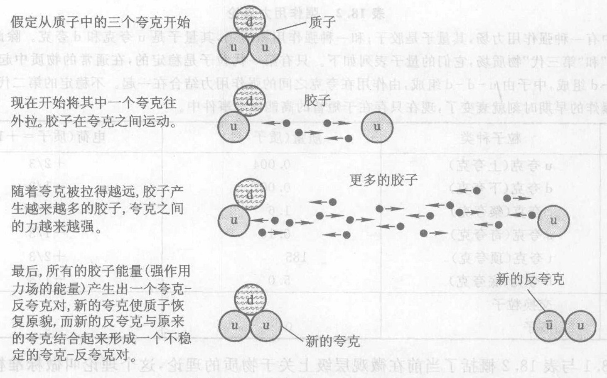

*图 18.15 无法分离出夸克的原因
假定从质子中的三个夸克开始。
现在开始将其中的一个夸克往外拉。胶子在夸克之间运动。
随着夸克被拉得越远，胶子产生越来越多的胶子，夸克之间的力越来越强。
最后，所有的胶子能量（强作用力场的能量）产生出一个夸克-反夸克对，新的夸克使质子恢复原貌，而新的反夸克与原来的夸克结合起来形成一个不稳定的夸克-反夸克对。*

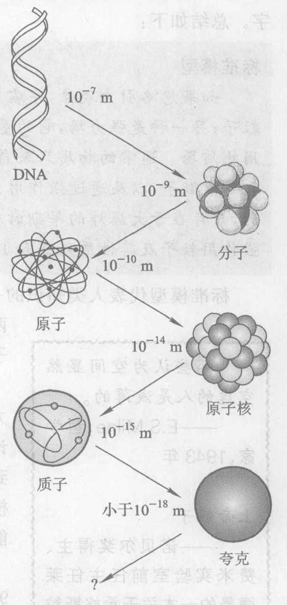

*图 18.16 自然界的“种子”阶梯，从 DNA 到夸克。注意每一级的近似尺度。*

表 18.2 给出强作用力的全套班子。最后一个有待实验发现的夸克即 **t 夸克**（顶夸克）于 1994 年由费米实验室 [图 18.8(e)] 初步证实。由于 t 夸克的质量比其他五种夸克的质量大得多，这（由于 $E=mc^2$）意味着需要高得多的能量才能产生这种夸克，因此 t 夸克是最后发现的。据估计，t 夸克的质量是质子质量的 185 倍，大约有一个金原子那么重！表 18.1 与表 18.2 之间的相似是惊人的，这种相似性显示出电弱力与强力之间的密切关系。这暗指应该存在在一个**大统一理论**，将电弱力与强力看作是一种单一的基本力的两个侧面。到目前为止，这样的理论仍未被科学家掌握。

**表 18.2 强作用力理论**
宇宙中有一种强作用力场，其量子是胶子；和一种强作用物质场，其量子是 u 夸克和 d 夸克。除此之外，还有“第二代”和“第三代”物质场，它们的量子表列如下。只有第一代粒子是稳定的，在通常的物质中起作用。质子由 u-u-d 组成，中子由 u-d-d 组成，由作用在夸克之间的强作用力结合在一起。不稳定的第二代和第三代粒子在大爆炸的早期时刻就衰变了，现在只存在于短暂的高能微观事件中。

| 代 | 粒子种类 | 质量(质子=1) | 电荷(质子=+1) |
| :---: | :--- | :--- | :--- |
| 1 | u 夸克 (上夸克) | 0.004 | +2/3 |
| 1 | d 夸克 (下夸克) | 0.007 | -1/3 |
| 2 | c 夸克 (粲夸克) | 1.6 | +2/3 |
| 2 | s 夸克 (奇夸克) | 0.16 | -1/3 |
| 3 | t 夸克 (顶夸克) | 185 | +2/3 |
| 3 | b 夸克 (底夸克) | 5.0 | -1/3 |
| | **交换粒子** | | |
| | 胶子 | 0 | 0 |

表 18.1 与表 18.2 概括了当前在微观层级上关于物质的理论，这个理论叫做**标准模型**。对于一个曾给出像反物质、中微子和夸克这些奇妙预言的理论，标准模型实在是一个沉闷的名字。总结如下：

**标准模型**
如果忽略引力现象，宇宙中只有两种力场：一种是电弱力场，它的量子是光子、W 粒子和 Z 粒子；另一种是强力场，它的量子是胶子。物质场只有 6 种：三代电弱作用物质场和三代强作用物质场。通常的物质只来自两种第一代物质场，它们的量子是：通过电弱力相互作用的电子和 e 中微子，以及通过强作用力相互作用的 u 夸克和 d 夸克。第二代和第三代粒子是不稳定的，只存在于大爆炸的早期时刻，今天它们只伴随高能微观事件短暂地存在。电弱作用粒子和强作用粒子及其性质列表在表 18.1 和表 18.2 中。

标准模型代表人类知识的一次大规模的统一。如果忽略引力，普通物质只是两种物质场和两种力场的表现形式。把实物量子（u 夸克、d 夸克、电子与中微子）看作构成宇宙的砖块，力的量子（光子等）就是水泥。

> **那些认为空间显然空虚的人是浅薄的。**
> ——E.S. Milne, 哲学家, 1943年

> **上帝粒子**
> ——诺贝尔奖得主、费米实验室前任主任莱德曼的一本关于希格斯粒子的书的书名 (中译本，上海科技教育出版社)

不过，标准模型并不是故事的结束。一个问题是，它没有把引力结合进去，给我们留下了一个非量子化的引力理论（广义相对论，第 11 章）和一个量子化的其他力的理论。我们在下一节将看到，这是不能令人满意的。还有一个下面就要讨论的问题是，标准模型强烈地暗示有一种新的场，它的量子至今还未观测到，不过可能很快就会观测到了。

我们在第 10 章中看到，由于 $E=mc^2$，质子或中子的质量的 90% 来自这些粒子内部的夸克之间的强作用力场的能量。这样，标准模型就解释了普通物质的几乎全部质量。不过，标准模型并没有解释为什么夸克及表 18.1 和表 18.2 中列出的其他粒子原先就有质量。一个得到普遍支持的假说是，宇宙中有一种新的基本场，叫做**希格斯场**。④ 这种场像别的基本场一样在大爆炸期间产生，在整个宇宙中弥漫。宇宙中每一种粒子，除了光子和胶子，都是总是在和希格斯场相互作用。即使是完全孤立的粒子也“感受”到希格斯场！这种相互作用与大自然中其他一切已知相互作用不一样，有能量（做功的能力）与之相联系。如果希格斯假说是对的，那么，就是这个能量给予基本粒子以质量！t 夸克这样的粒子（表 18.2）有较大的质量是因为它们与希格斯场的相互作用较强，而电子这样的粒子有较小的质量是因为它们与希格斯场的相互作用较弱。光子和胶子的静止质量为零，是因为它们完全不与希格斯场相互作用。

幸好，这个怪念头可以比对这在实在世界加以检验。由于希格斯场是量子场，因此必定通过量子化的能包相互作用。高能粒子加速器也许在几年内就能够产生这些希格斯粒子。希格斯粒子的质量不能准确预言，不过间接的证据暗示，它也许是质子质量的 200 倍，大约等于一个金原子的质量。⑤ 由于 $E=mc^2$，这样粒子的质量大意味着在高能物理实验中需要巨大的能量才能产生出来，这个能量超出了当时的粒子加速器能够达到的能量。预计于日内瓦附近的欧洲核子研究中心 (CERN) 的有史以来最大的加速器于 2009 年投入运行 \*，物理学家相信这台设备将会证实出希格斯粒子。如果是这样，我们对宇宙中的质量的终极起源就终于有一个解释了。很可能，在你读这几行文字时，希格斯粒子已经被确认或者被否定了！

④ 英国物理学家希格斯于 1964 年提出了这一想法。
⑤ 也许你会感到奇怪，为什么这样一个有金原子那么重的粒子不能简单地发现它在穿越空间或者处于普通物质中。答案是，像 t 夸克和许多其他重粒子那样，希格斯粒子是极其不稳定的，生成后立刻就转变成别的质量更小的粒子。因此，它们在离能微观事件（如高能粒子加速器中两个粒子的碰撞）产生后只能短暂地存在。
\* 这是指 CERN 的大型强子对撞机 (LHC)，它是世界上最大的对撞机，把质子加速到接近光速后对撞。原定 2007 年启动，由于在一项高压检测中用于聚焦质子束的磁体系统发生爆裂，启动时间被推迟。最终定于 2009 年初启动。——译者注

> **概念检查 6** 按照标准模型，以下哪些是基本粒子（或非复合粒子）？(a) 质子; (b) 电子; (c) 正电子; (d) 氢原子; (e) 光子; (f) 水分子。

> **概念检查 7** 胶子的运动速率 (a) 小于光速; (b) 等于光速; (c) 大于光速。

## 18.6 量子引力：普朗克尺度上的物理学

物理学家不仅在统一所有已知的力方面取得了巨大的成功，而且在统一所有已知的实物粒子方面也取得了巨大的成功。已经表明，除引力外的所有的基本力，和所有的通常物质粒子都只来自仅仅几种力场和物质场。电弱力和强力之间明显的对应关系（表 18.1，表 18.2）表明，这两个力有一个单一的大统一理论，将电弱力和强力统一起来，不过，这里的理论人们仍未找到。

但是，即使是一个在实验上得到证实的大统一理论，仍然会将引力留在这幅统一的图景之外。引力难以纳入这些统一理论的一个原因是，在微观层级上我们对引力的了解太少，因为在这一层级上引力非常弱。例如，两个质子之间的引力作用只有它们静电排斥力的一万亿亿亿亿分之一 ($10^{-36}$)。只有当大量的物质堆积在一起时，例如在一颗行星或恒星中，引力的效应才足够强，容易观测到。在大量物质堆积的情况下，质子与电子的电效应在很大的程度上相互抵消，而引力则由于总是吸引的，因而互相加强，使引力占支配地位。

> **物理学家是人类中的彼得·潘 \*\*，他们永远长不大，他们永远保持着好奇心。**
> ——拉比，物理学家

> **上帝创造世界时用了漂亮的数学。**
> ——狄拉克

已经证明，爱因斯坦的广义相对论对多种现象是正确的。这是一个非量子化的场论，讨论的场是由质量引起的时空曲率场（第 11 章）。将这个理论与关于别的力的理论结合起来的最明显的途径，是要求引力场服从量子论的原理。但是人们发现，这不是一件简单事情。

广义相对论把引力看作是由质量引起的空间的平滑的弯曲。它在天文学的距离尺度和日常的宏观距离尺度上工作得很好。但是在极小的距离尺度上，广义相对论对描绘的这种平滑的弯曲却与量子理论的最基本的特征即不确定原理相冲突。原因如下。我们还记得（第 14 章），不确定原理不允许微观世界静止：一个位置被极度限定的粒子必定具有极不确定的速率，因此有很高的平均速率。在量子场论中，这条原理用语言来叙述就是：场在最小尺度的层级上的运动是非常激烈的和不确定的。这就是说，假如你把空间一个水体积极度放大，你会发现这个小体积的每个微小部分的量子场都在剧烈地涨落，好像一锅急速沸腾的汤的表面。

我们想要进行量子化的场是引力场，即空间的曲率。引力场的量子理论预言，在最小尺度的层级上空间的曲率会剧烈地涨落。图 18.17 用图解的方式显示经过 5 种不同级别放大后的一个空间小区域。只有在经过第 4 级放大后我们才开始观察到引力场的一点点亚微观的骚动——空间本身的起伏。在经过最高级（第 5 级）的放大后，我们看到空间剧烈涨落，在广义相对论所描绘的平滑的空间曲率上翻腾。惠勒（图 18.18）把空间的这种涨落形象地比喻为“量子泡沫”。

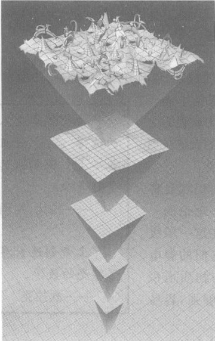

*图 18.17 一个小空间区域经过五级放大，以显示出其亚微观性质。在最高一级（第 5 级）放大后，我们看到了量子场论预言的“量子泡沫”。这些剧烈的涨落在广义相对论预言的更平滑的弯曲上翻腾，使对广义相对论进行量子化的任何尝试遇到巨大的困难。*

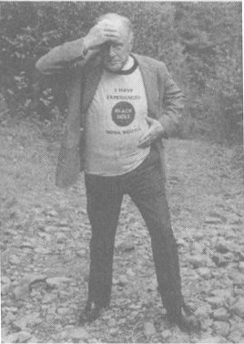

*图 18.18 惠勒是普林斯顿大学与得克萨斯大学广义相对论和量子理论基础研究小组的带头人。图中，他刚从加拿大新斯科舍省的布莱克霍尔港归来，显得有点头昏眼花的样子。他的领汗衫上印着："I have experienced Black Hole, Nova Scotia." ("Black Hole, Nova Scotia 是加拿大新苏格兰省的布奈克霍尔港。在天文学上，Black Hole 是黑洞，Nova 是新星，Scotia 在拉丁文中有关暗之意，黑洞是在超新星爆发过程中由恒星的核心部分产生的。因此汗衫上的这句话有双关意义，既是“我欣赏过布奈克霍尔港的景致”，也是“我体验过黑洞的神奇景象。”——译者注)*

\*\* 童话中的人物，一个永远长不大的小孩。——译者注。

于是物理学家们在尝试对引力场进行量子化时陷入了荒谬的答案。典型的情况是，理论预言某些微观事件发生的概率等于无穷大，而其他概率为负数，这显然是荒谬的，因为大家知道每个概率值都处于 0 和 1 之间。物理学家们提出了许多巧妙的方案试图克服这些困难。这些尝试除了一个之外都以失败告终。这个例外的方案叫做“**弦假说**”；我们下面来介绍这个假说。

广义相对论和量子理论联合预言了几个基本结果，无论哪个（如果有一个）量子引力理论最后被证实，这几个基本结果最终都可能适用。一个这样的基本结果是引力子，既引力场的量子。和光子（电磁场的量子）一样，引力子的质量与电荷均为零，并以光速运动。从量子观点来看，两个物体例如地球和月亮之间的引力是通过这两个物体之间交换引力子产生的。但是，从来没有观察到引力子，而且也许永远也不会直接观测到引力子，因为引力太微弱了。例如，如果一个质子吸收一个引力子，这个质子会反冲，但是理论预言这种反冲是如此之小，完全没有希望观测到它。

广义相对论和量子理论的基本数值量或“常量”肯定会出现在任何正确的量子引力理论中。这些常量是：光速、普朗克常数和“引力常量”（在国际单位制中为 $6.7 \times 10^{-11}\ \text{m}^3 \cdot \text{kg}^{-1} \cdot \text{s}^{-2}$，见第 5 章），引力常量确定了作用在两个特定物体之间的引力的强度。自然界中这三个常量能够按某种方式组合起来，得到（粒子之间的）距离的一个估算值，我们预期在这个距离上量子引力效应会显露出来——换句话说，我们预期当粒子之间的距离达到这个尺度时，发生的事件既受引力效应也受量子效应的重大影响。由于量子效应主要发生在微观距离上，而且两个微观粒子之间的引力与其他力相比要弱得多，那么毫不奇怪，这个**普朗克长度**是很小的，事实上它是极微小的量，它等于 $10^{-35}\ \text{m}$，或 1 000 亿亿亿亿分之一米！这个长度也是图 18.17 中的扰动的近似空间长度。

类似地，还可以推出一个基本的时间间隔，它是一段典型的时间间隔值，如果量子效应和引力效应两者都起作用，在这个时间间隔期间两个粒子之间（随便举个例）将发生显著的变化。由于不确定原理意味着在这些小距离尺度上的变化必定很快速，因此，这个**普朗克时间**极短，只有 $10^{-43}\ \text{s}$。

物理学家还能够推出预言的与典型的量子引力事件对应的能量。不确定原理告诉我们，在小到普朗克长度大小的区域内发生的事件必定是因极高的能量。理论得出这个基本的**普朗克能量**大约等于 10 亿焦耳。在我们的日常世界中这个能量并不算大，只是 8 加仑（约一油箱）汽油的化学能。但是，这么多的能量集中到一个亚微观尺度却是一个极大的值。10 亿焦耳能量按照质能等当关系相当于大约 $10^{19}$ 个质子的质量，这么多的质量被挤在一个尺度只有 $10^{-35}\ \text{m}$ 的体积内，肯定极不寻常的！我们把这个质量称为**普朗克质量**，它大约是 0.01 mg，一颗典型的灰尘颗粒的质量。请想象一下，单个基本粒子带有这个质量或能量！

⑥ 在 1900 年前后，当时的量的量子理论还未建立，甚至连一个完整的量子理论也没有，普朗克就了解，这个长度连同下面讨论的时间和能量具有普遍的意义。

普朗克长度、普朗克时间和普朗克能量合称**普朗克尺度**，它们是发生典型的量子引力现象的近似空间大小、时间间隔和能量值。

20 世纪 60 年代，惠勒（图 18.18）指出了自然界在普朗克尺度层级上的一个不同寻常的特性。他发现，在一个半径为普朗克长度的球内，以及在持续时间为普朗克时间的时间间隔内，大小如普朗克能量的能量涨落容易发生，而且，在一个如此微小的体积内有这么多的质量，会使时空弯曲得折叠起来形成黑洞，同宇宙的其余部分割裂开来。这个现象会把空间与时间割裂成小包，即时空本身的量子。因此，普朗克长度和普朗克时间是终归还有物理意义的最小长度与最短时间间隔！

由于今天的的高能加速器中产生的微观事件的能量远低于普朗克能量，要观察这样的现象是困难的。然而，实验和理论都指出一个明显的趋势：各种基本力之间的差别随着能量的增高而减小。例如，电弱力理论提出，能量增高时，弱力的强度会增大，直到弱力大致与电力的强度相同。在更高的能量下，电弱力的强度变得与强力相同。如果能量更进一步提高，达到普朗克能量，那么，即使是通常情况下很微弱的微观粒子之间的引力，也会变得与别的基本力一样强。

下面解释为什么会这样。设想把两个质子推得越来越靠近。我们知道，在“正常的”微观间隔下，比如像一个原子的大小 ($10^{-10}\ \text{m}$) 或一个质子的大小 ($10^{-15}\ \text{m}$) 那样的间隔下，电力要比引力强得多。但是，随着间隔变得越来越小，力将变得越来越强，这些力场携带的能量也越来越大。可是能量具有质量，而质量总是对别的质量产生引力。因此，随着间隔的减小，两个质子的质量就增大，这使得引力增加得比电力更快。当两个质子的质量变得非常巨大，事实上，当间隔是普朗克长度时，质量变得大致等于普朗克质量。在这个尺度下，微观的引力大致等于电力的强度，并且事实上所有的力变得大致相等。

在那些研究量子引力的学者看来，所有的基本力的强度在普朗克尺度下大致相等由的预言强烈暗示，这些力是一个单一的基础力的不同的侧面，这种统一在普朗克尺度下变得明显。

**弦假说**⑦ 是一个优美的、有大希望的假说，它试图将广义相对论和量子论统一起来。尽管这个假说在 25 年的发展历程中还没有得到任何直接的观察验证，它仍然是一个好的科学假说，因为它明确地提出了一个可检验的预言，这些预言很快就会得到检验，它与任何已知的结束不矛盾，并且能够解决一些基本问题。

弦假说的关键想法是，一个基本粒子（例如一个电子）并不是集中在一个无穷小的点上，而是一个处于特定振动状态的微小的环，就像一个无形圈的橡皮圈。这些环叫做**弦**。这种对点粒子模型的扩展，使粒子因子不处于一点而是沿一个环分布，于是它对周围空间的影响就变平滑，平滑了图 18.17 中所示的涨落，从而足以符合广义相对论的要求。弦是细小的，事实上你会猜出，细得可以和普朗克距离相比较。从核或原子的尺度上看，弦是如此细小，看起来与点粒子无法差别，这就是我们一直把它们想象成点粒子的原因。

弦除了能够在空间四处运动之外，还能哆振动。这些振动是量子化的，量子理论只允许某些特定的振动“模式”（振动型式、频率和能量）。根据弦假说，每一种这样的振动模式就是一种不同的基本粒子：一个电子是一条以某种方式振动的弦，一个 d 夸克是一条以另外一种方式振动的弦，一个光子又是另一种振动，如此等等。在所有外表的背后，基本粒子实际上是完全相同的：它们全部是完全相同的弦。它们不同的性质仅仅是因为它们不同的振动模式。这些振动模式中能量最低因而最稳定的模式是普通物质的粒子，即表 18.1 和表 18.2 中列出的第一代粒子和交换粒子。

⑦ 一般叫做弦论，由于本书强调科学的认知过程，因此我宁愿用假说这个词而不用理论这个词，以表明这些奇妙的想法仍然处于尝试性阶段，尚未得到观察的证实，并且是不完善的（因为有几个不同的弦论版本都是可能的）。正如本书强调的，理论这个词专门留给那些已经多次被观察直接验证的能够用于解释事物的想法。关于弦假说的更多内容，请查阅网页 www.superstringtheory.com。要查找非技术性的讨论，请点击“basic”超链接。

这听来很好，然而白璧有瑕，美中不足。只有在我们周围的空间不是 3 维而是 10 维的情况下，加上一个时间维度构成一个 11 维时空，弦才能消除困扰量子引力理论的矛盾。低于或高于 10 维的空间会引起逻辑上的矛盾。而正在好 10 维的空间中，一切东西都很完美。这看起来自然是怪诞的。我们都知道空间只有 3 维。另外 7 维到哪儿去了呢？

它是这么怪诞吗？还记得，我们想要描写的量子引力效应只发生在很小的距离上。如果那 7 个额外的维度由于某种原因很小（不管这可能意味什么），小到我们在正常活动中根本察觉不到它们的存在，那又会怎样呢？遵从这个逻辑，弦假说假定，另外 7 维在我们的 3 维空间的每一个点上紧紧地“卷了起来”。为了帮助大家理解这个想法，下面作一个**类比**⑧：想象某种 1 维的生物，显现在它们面前的整个宇宙是一条长直线，一个没有弯曲的“1 维空间”，这些生物只能沿着这条直线前后运动。假设这些生物其实是生活在一条长长的直水管的 2 维弯曲表面上，但它们并不知晓，这条水管太细了，以至这种生物（它们的身体比水管的半径大很多很多）从来都不曾注意到第二维。如果有有一个物理学家告诉它们说，它们的宇宙实际上是 2 维的，这第 2 维卷缩得如此紧密，以至在日常生活中根本感觉不到；告诉它们事实上它们正生活在一条细长的管状宇宙中，其中卷曲的维度如此细小，以至从来没有观察到，这些生物听到后也许会认为这是一个怪念头。

一旦接受了广义相对论关于引力使空间弯曲的观念，弦假说关于 7 个卷缩的空间维度的观念看起来就不那么怪诞了。卷曲起来的维度存在于我们这个 3 维空间的每一点上，正像水管上那个卷曲的第二维存在于沿水管的每一点上，但是我们意识不到它们的存在，因为在我们正常的世界上的引力（唯一能直接检测空间的弯曲的力）不能探测如此小的间距。事实上，即使一度的尺寸大到 1 mm，也有可能迄今还未在实验上被探测到，因为要探测引力在这么小的距离上的变化是一件困难的事情。弦假说明确指出，弦（它确实能对这么短的距离上的引力变化做出回应）伸展在所有 10 个空间维上。这些完全相同的弦在卷曲的空间维度上有许多不同的卷曲方式和振动模式，使不同的弦具有截然不同的性质。

到底是什么原因使人信接受这样一个古怪的念头？特别是在缺乏任何真凭实据的情况下还接受这个念头？主要的原因是，如果科学想要把自然界的各种力和各种粒子统一到一个单一的理论中，就需要引力的量子理论，这个统一理论必须以某种方式把广义相对论和量子物理学调和起来。在经过几十年的探索后，弦假说是迄今为止唯一的得到这种调和的假说。⑨

⑧ 这个类比及图 18.17 取自格林为非科学界人士和科学家写的一本优秀的科普书 *The Elegant Universe: Superstrings, Hidden Dimensions, and the Quest for the Ultimate Theory* (New York: Norton & Co., 1999)，中译本：宇宙的琴弦，湖南科学技术出版社。
⑨ 也提出过另外一个叫做“圈量子引力”的假说。这个假说看来不存在无穷大问题，也不要求额外的维度。但是，为这种简单性所付出的代价是，要求时空本身由可移动的环圈构成。

但是，理论应该能够预言尚未观察到的事情，或者至少应该能够对尚未得到解释的事情给出可信的解释。在需要做出“解释”的事情中，三代粒子（表 18.1、表 18.2）的存在也许能够从 7 个卷曲维度的一般几何性质来解释。弦假说还提供了一个框架，用来预言每种粒子的质量和其他性质，例如为什么夸克所带的电荷为什么会像现在这样。不过，7 个卷曲维度的几何学太复杂了，迄今为止还没有人做出过这样的预言。

在迄今尚未观察到的现象中，引力子被认为是弦的振动的基本型式之一。由于引力子是量子引力最普遍预期的特性，因此这个预言表明，引力已经是弦假说的一个不可分割的部分。

最后，弦假说预言，除了标准模型中的粒子之外，还存在在一组新粒子，叫做“超对称伙伴”粒子，标准模型的每一种粒子都有一个伙伴粒子。它们之所以可以叫做“超对称”伙伴粒子，原因是，如果标准模型粒子清单加上建议的伙伴粒子在实际上的存在，那么，在物质的“基元成分”粒子（电子、夸克等）和传递力的交换粒子（光子、W 粒子等）之间就会呈现出一种漂亮的对称性。这种观念叫做“超对称性”，在许多理论中都能找到。人们期望，用新一代高能加速器产生和观测这些超对称伙伴。在 10 年内就能证实（或者否定）这个观念。弦假说很自然地呈现出超对称性，因为人们发现弦的振动型式是成对发生的，每一对刚好具有正确的超对称性质。这个发现虽然不能证实弦假说，但是它肯定会把这个假说置于更坚实的实验基础上。

这就结束了我们在量子场论领域中的漫游，也为本书写上一个句号（但我还是得读一下后面的跋）。当我们思考广义相对论、量子物理学、弦假说和本书中讨论的其他观念时，有一点是清楚的，那就是自然宇宙有多得多的可能性，正如科学家兼哲学家霍尔丹所说的，“不仅比我们所设想的更古怪，而且比我们所能想象的还要古怪。”也许我们的宇宙只是众声宇宙中的一个，这众声宇宙中的每一个都有自己的时空，有不同的时空维数和不同的物理定律。也许，穿过众多不同的“时间”，无穷多个不同的宇宙生成了又消失了，它们共同构成了实在，这个实在在根本不是发生在时间和空间之中，而是在某种意义上超越于时间和空间。

在一个这样的宇宙中，在一个叫银河系的星系中，在一个叫做地球的行星上，读到这些文字的你和写下这些文字的我无可估量地幸运地活着，并且在心中怀有这些想法。也许，我们对这样一份厚礼的最好的回答就是简单的一声：谢谢。

> **如果我们真的找到了一个完备的理论，那么，总有一天其一般的原则应当是人人能够理解的，而不仅仅是少数科学家理解。那时，我们所有人……都能参加讨论，讨论……为什么我们和宇宙存在。如果我们找到了这个问题的答案，那将是人类理性的最高胜利——因为那时我们就会了解上帝内心的想法了。**
> ——霍金，《时间简史》的结束语

---

![卡通漫画]
(卡通漫画描述上帝创造宇宙和黑洞的幽默对话)

**我正在考虑如何解决这个问题。**

## 概念检查答案

1.  (b)、(d)、(e)。
2.  400 对的 20% 等于 80 对，或者 160 个粒子。不过由于量子不确定性，这只是近似值，答案是 (a)。
3.  四个选择都对。
4.  (a)、(c)、(e)。
5.  $\frac{2}{3} - \frac{1}{3} - \frac{1}{3} = 0$，答案是 (a)。
6.  (b)、(c)、(e)。
7.  (b)。

---

## 关键概念

下述概念的定义出现在所标页码的本书正文页面上和书末的按拼音排序的术语词汇中。我们将它们按出现先后顺序排列在这里，你可以用这个清单复习本章内容。

*   量子场论 434
*   物理实在的力场观 434
*   场 435
*   量子化的场 435
*   能量量子 435
*   场的量子理论 436
*   量子电动力学 436
*   电子场 436
*   交换光子 437
*   带电 437
*   正电子 438
*   $\mu$ 子 439
*   粒子加速器 440
*   真空 442
*   能量涨落 442
*   兰姆移位 442
*   $\tau$ 子 442
*   代 442
*   中微子 443
*   电弱力场 444
*   电弱物质场 444
*   交换粒子 444
*   W 粒子 444
*   Z 粒子 444
*   点粒子 448
*   夸克 449
*   强作用力场 450
*   强作用物质场 450
*   u 夸克 450
*   d 夸克 450
*   胶子 450
*   大统一理论 451
*   标准模型 452
*   希格斯场 452
*   希格斯粒子 453
*   引力子 455
*   普朗克长度 455
*   普朗克时间 455
*   普朗克能量 455
*   普朗克质量 455
*   普朗克尺度 456
*   弦假说 456
*   共有多少代？
*   强相互作用力

## 复习题

**量子化的场**

1.  量子场论是由哪两个理论结合而成的？
2.  什么是场？什么是量子场？
3.  说出电磁场的量子的名称。
4.  电子也是“量子”吗？是什么场的量子？

**量子电动力学与反物质**

5.  光子在两个电子之间的电力中起什么作用？
6.  描述图 18.3(a)、(b) 代表的事件。
7.  什么是 $\mu$ 子？什么是 $\tau$ 子？
8.  什么是反粒子？举出两种反粒子。
9.  什么是反物质？
10. 描述粒子-反粒子对的产生。
11. 举出并描述几种用于探测亚原子世界的仪器。
12. 真空真是空的吗？真空会发生什么事情？

**电弱统一**

13. 为何中微子这样难检测？在四种基本力中中微子感受哪一种力？
14. 列出通过电力相互作用的六种粒子。
15. 说出电磁力的交换粒子的名称。举出电弱力的四种交换粒子。
16. 电弱粒子是按“代”排列的。描述这种排列型式。
17. 举出引起强力的基本粒子（非复合粒子）。
18. 夸克是怎样发现的？
19. 质子是基本粒子吗？如果它们是复合粒子，那么是由什么粒子组成的？电子呢？
20. 一个夸克向另一个夸克施加哪种力或哪此力？
21. 夸克的一个性质是施加和感受强作用力。举出至少两种别的性质。
22. 有多少种夸克？它们之中有多少种在普通物质中能找到？
23. 说出携带强力的交换粒子的名称。
24. 为什么我们从来没有观察到一个单独的夸克？

**量子引力**

25. 四种基本力中哪几种能够宏观距离上被感受到？
26. 什么是引力子？实验上已经发现这种粒子了吗？如果发现了，是如何发现的？如果还没有发现，为什么？
27. 普朗克长度与普朗克时间的含义是什么？
28. 什么是弦假说？

## 思考题

**量子电动力学与反物质**

1.  在图 18.7(a) 中，什么证据表明每个粒子对由两个带反号电荷的粒子组成？
2.  在图 18.7(a) 中，两对粒子中哪一对的运动速率更快？你怎么知道的？
3.  在图 18.7(a) 中，为什么看不见产生两对粒子的两个光子的路径？
4.  一对电子-正电子对湮没时产生的两个光子每一个的频率大约为 $10^{20}\ \text{Hz}$。这些光子属于电磁波谱中哪个波段？如果电子和正电子是在运动而不是静止，湮没产生的光子频率是高一些还是低一些？
5.  假如图 18.5 中的粒子径迹是由一个向上运动的电子而不是向下运动的正电子造成的，那么照片会有什么改变？

**电弱统一**

6.  10 个电弱粒子（表 18.1）中，哪些粒子以光速或接近光速的速率运动？
7.  10 个电弱粒子（表 18.1）中，哪些粒子能够感受电力？哪些粒子能交换光子？
8.  $\beta$ 衰变的发现应该放在图 18.11 的哪个框中？
9.  W 粒子和 Z 粒子在哪些方面与光子相似？在哪些方面不同？

**强相互作用力**

10. 根据标准模型，以下粒子哪些是基本粒子：中微子、中子、夸克、$\mu$ 子、光子、反质子？
11. 胶子在哪些方面与光子相似？在哪些方面不同？
12. 夸克在哪些方面与电子相似？在哪些方面不同？
13. 给出至少一个具体的理由（而不是对统一的一般信念），说明为什么科学家相信可能存在在一个单一的理论将电弱力与强力统一成一个单一的大统一力？
14. 按照表 18.2，构成一个质子的两个 u 夸克与一个 d 夸克的总静止质量似乎只有 $0.004 + 0.004 + 0.007 = 0.015$ 倍质子质量！质子中多出来的质量（可能）来自什么地方？

**量子引力**

15. 过去人们假定基本粒子只占据一个孤立的几何点。为什么弦假说假定它们形如细小的弦圈？
16. 解释如何用一根软水管说明细小卷曲维度的观念。

## 习题

**量子电动力学与反物质**

1.  一对电子-正电子对湮没时产生两个光子，每一个的频率大约为 $10^{20}\ \text{Hz}$。求每个光子的能量（见第 13 章）。
2.  一对静止的质子-反质子对湮没时产生两个光子。用上题给出的数据，以及质子的质量为电子质量的 1800 倍的事实，求每个光子的频率。
3.  一对静止的质子-反质子对湮没时产生两个光子。由质子的质量为 $1.7 \times 10^{-27}\ \text{kg}$，求每个光子的能量。用这个能量求每个光子的频率，并将结果与上题比较。
4.  **作出估计**。一个大型发电厂发出 1 000 MW 的电力。如果所需要的能量来自物质-反物质的湮没，假定发电时的能量效率为 50%，估算每年大约需要的物质与反物质的总质量。
5.  **作出估计**。假设 1 g 物质与 1 g 反物质湮没。证明所产生的能量能够将全美国 3 亿人口提起大约 1 km 高。

---

# 跋：总结

> **我今日呼天唤地向你作见证，我将生死、祸福陈明在你面前，所以你将拣选生命，使你和你的后裔都得存活。**
> ——旧约：申命记

从开始学习本书以来，你我自己同行了一段路程。现在我们已经到达旅途的终点。让我们往回走几步，回顾沿途的风景。诸多细节由四个反复出现的主题联系在一起，这四个主题就是：科学认知过程、后牛顿物理学的意义、能量以及物理学和社会的联系。

有时，当我和人们谈论物理学和社会的联系时，我要求他们举出一些重大的当代社会问题。不用多长时间，就可以凑出一个相当长的清单：恐怖主义、人口过多、物种灭绝、吸毒、全球变暖、艾滋病、贫穷，等等。当我们寻找它们的共同之处时，我们清楚看到，它们每一个都含有重大的科学技术成分。

科学带来强大的力量，这股力量常常既是有益的又是有害的。例如，由于医药科学延长了我们的寿命（这是好事），我们现在有了人口过多的问题（这是坏事）。我们在解决死亡问题上接受了科学的帮助，但是没有在生育问题上承担起责任来。再举一个例子：当你发动你的汽车时，你就把一个威力加到你自己身上和我们的地球身上。汽车的速度令人兴奋，但它是全球变暖却显示出这个等式的黑暗一面。

科学和社会的问题可以归结为：人类为不科学时代的成果支付他应付出的代价。我们迅速接受了汽车的便捷和医药的神奇，但是对解决化石燃料问题或控制我们的生育率却是慢吞吞的。我们不能光接受科学的恩惠而不承担相应的责任。作为一个科学教师，我当然对这个问题有自己的看法，我的第一个建议是，我们所有的人都要更多地学习科学。人类今天指挥着巨大的力量，但却不具备相关的知识。我们最好是更努力地去理解我们正在做的事情，因为没有知识的力量是灾难的前奏。

能量统一了全部物理学，它能组织我们对一切物理过程的思考。在实用的层次上，如果我们想要营造一个繁荣的未来，我们的文化就必须掌握我们对能量的使用情况。我们很快就面临化石燃料时代的终结，这一前景既是挑战又令人激动。你能为解决这个问题出力。

在更深的层次上，近代物理学教导我们，宇宙中的过程不只是物质的机械运动，把它看成能量的变换更为恰当。能量，而不是物质，是宇宙的“原材料”。能量本身是做功的本领，因而带来了变化，它采取运动或相互作用的形式。宇宙最终是由场构成的，场具有能量，并且充满宇宙，甚至所谓“真空”。

后牛顿物理学的意义深深触及工业文明的文化根基。近代文化仍然认定牛顿的钟表式的宇宙代表了科学的实在观。这种唯物主义的世界观很少有自由、机遇、创造性或精神价值存在的余地。

但是近代物理学描绘了一幅由相对论和量子理论构建的场和能量的非牛顿式的画面。许多非力学形式的能量在这个后牛顿宇宙中运作，实在不是像一个可以预言的钟表机制，而像一个动态的和不可预言的能量网。这几乎是钟表的对立面。许多人已经建议，如果非得用一个比喻的话，宇宙更像是一个活的有机体，而不是一个钟。

现在还不清楚，从这将会出现一种什么样的世界观。我们的牛顿文化才刚刚开始吸取相对论和量子理论的冲击。毕竟在哥白尼去世后还过了个多世纪，欧洲才开始吸取后中世纪科学的文化冲击。因此不奇怪，第一个后牛顿世纪不是 20 世纪，而可能是 21 世纪。

超越牛顿世界观是很重要的，表明这一点的—个实际例子，也许是一直在进行的（至少在美国一直在进行）反对生物进化的运动。这个运动源于觉察到宗教信仰受到威胁。宗教原教旨主义者的代表性看法是把进化看成是决定论性的和唯物主义的，没有精神价值存在的余地。这种反对看来是针对用牛顿物理学解释的进化，而不是针对进化本身的。一个后牛顿文化也许会缓解这种基于宗教的对科学的担心。

后牛顿物理学认为，我们不能像控制一个钟一样控制自然。自然是一张网，我们是它的一部分，我们控制这张网的努力会裹住我们，使我们陷入危险。后牛顿物理学认为，拯救我们的机会不在于把我们的意志强加于自然界，而在在于帮助自然界（因而也帮助了我们自己）实现她的追求。

我们常常问这样的问题：我们怎么知道这个那个？科学对这个问题的回答惊人地简单：我们是从经验、从经过理性思维解释的经验知道的。这条规则说起来简单而做起来很苛刻：不假定任何东西当然成立，在细心观察和诚实思考的基础上形成结论，并且乐意根据新的经验修正这些结论。换句话说，相信宇宙。

有了今天这样强有力的技术，如果我们做正确行事，我们每个人的日子都可以过得像国王和女王一样。但是我们并没有过这样的日子。事实上，地球上的大部分人，包括美国的几百万人，都生活在贫穷和悲惨的境地。问题出在哪儿？答案也许是，今天的许多流行的意识形态，尽管形式多样、互相冲突，它们却既不来自细心的观察，也不来自诚实的思考，即使在新经验之下也不对它们提出怀疑，而大多数信仰它们的人却绝对相信它们是正确的。他们的教条主义态度的后果我们在周围到处可见：狂热、战争、恐怖、迫害、偏见和受苦受难。科学对这个问题的看法是，危机与其说是在于这些信仰本身，不如说是在于这些信仰的绝对性。如果一个人愿意信任经验并且心灵是诚实的，即使是错误或者有害的信仰也能改过迁来。如果当成绝对真理来接受，即使是正确的和健康的信仰也能变得危险。

> **科学不只是一堆知识，而更是一种思想方法，这种思想方法的特征是严峻的怀疑态度与新思想的开放态度混合在一起，它是我们生活中每个领域——包括社会、经济、政治、宗教各方面——绝对需要的。**
> ——萨根

> **相信独一无二的真理，相信自己是其拥有者，这是这个世界的万恶之源。**
> ——玻恩，物理学家

在思考我们在 21 世纪怎么才能做得比在 20 世纪更好时，我们也许应当反复思量科学最基本的价值：一切观念都要接受经验的检验，都要接受批判的理性思想的挑战。这是一条为科学工作得极好的规则。它也许是科学带来的最重要的好处。

---

# 译后记

本书的译者是秦克诚（北京大学）、刘培森（北京理工大学）和周国荣（五邑大学）三人。我们的分工是：刘培森译第1章至第6章，周国荣译第7章至第9章、第17章和第18章，秦克诚译其余各章并负责全书的统稿和定稿。

这一中文版是本书的第二次中文版，是根据原书英文版第四版（2006）翻译的。此前的中文版是根据原书英文第二版（1998），由赵凯华先生组织引进翻译，译者也是我们三人，但分工有些不同。那一版由上海科学技术出版社于2001年出版。

本书是一本很好的文科大学生物理教材。作者从1975年开始，在阿肯色大学为主修非科学的学生开设了一门新型的物理课程。这本书就是这门课程建设的成果，是这门课程使用的教材。经过30年孜孜不倦、精益求精的努力，他取得了丰硕的成果。2006年，他因本书和他提倡讲授与科学有关的社会论题如全球变暖、伪科学（或迷信）和核武器等于2006年获得美国物理教师学会的最高奖-密立根奖。原书英文版已出过四版，现在在美国130余所院校中采用（实际上，还有一些高中也采用本书为物理教材，美国的教材并不截然划分为大学和高中两个不可逾越的阶段），他仍在准备更新的版本。每次改写，都有不小的变化。例如这一版，他增加了许多现代内容，而对原来的内容，唯浮辞之务去，写得更加精练，因此虽然内容增加，篇幅反而减小了。

随着人们越来越认识到人文和科学两种文化不应隔绝而应当互相沟通和交流，现代社会的公民需要具备科学素养，我国越来越多的院校也开设了以文科学生为对象的物理课程，并编写了教材。这种课程应当如何开设，文科的物理教材应当如何编写，是一个需要探索的问题。赵凯华先生有一个精辟的见解，就是大学文科物理教材既不能是理工科教材的浓缩，也不能是它的淡化。换句话说，应当重起炉灶，另立体系。在翻译这本书的过程中，有时我和赵先生议论到这个问题，都觉得文科物理教材很难写。但是我们都觉得Hobson这本书对这个问题解决得比较好。针对文科学生的特点，作者写本书时坚持以下四条原则：强调科学的认知过程，一切知识来自实践并最终由实践检验；教给学生最新的物理学；不用数学的概念式教学；讲授物理学的社会联系。这就使本书与别的教材相比很有些特点，例如：书中介绍了量子力学中的非局域性、大统一、弦假说、超对称、希格斯场等物理学中最新的观念，除外全书没有出现数学公式，不提波粒二象性的观念而以量子场为基础，有关社会问题的大量论述，这都是别的同类教材中没有的。特别是“我们怎么知道”一栏尤见特色。

这本书的翻译比较难。一是它涉及的面很宽；二是作者是用鲜活的美国口语写的；此外还有许多引语，由于没有前后文语境，有时茫然不知其原意。而作为一本教材，特别是文科的教材，译文除了“信”（不出错）之外还要争取“达”（流畅）。我们只有知难而进，勉力为之。上一个中文版出版后，曾在2002年获得“Newton-科学世界”杯科普图书奖。这个奖后来有些争议，因为本书是教材，不是一本通常所说的科普书，但是它表明，本书的翻译质量得到了认可。这并不是我们的英文程度高明，而是因为我们抱着认真工作、虚心求教的态度。利用互联网上的新工具e-mail，我们和作者建立了直接联系，向他请教，有的实在难懂的语句就请他用平易的英文重写一遍。对我们的问题，他都热情回答，给了我们很大的帮助。来往电子邮件的总量达二三十万字节。翻译中我们看到一些小错误或需要改进的地方，向他提出；并且从我们中国古圣先贤的一些哲理性的语录中，向他推荐一些作页边引语，如老子的“道生一，一生二，二生三，三生万物”和苏轼的诗《题庐山西林壁》等，他都欣然接受了。在这一版中，我们对译文进一步作了改进。不过总还会有我们没有发现的错误和不妥之处，请使用本书的老师和同学发现后向我们指出，以便改正。

我和Hobson教授是20世纪90年代中期在匈牙利的一次会议上认识的。由于翻译这本书而引起的频繁的邮件往来和交流，以及他的几次来华访问，使我们成了好朋友。他是一个典型的美国人，率真、热情，有一种使命感，把提高一切地球人的科学素养当做自己的使命。他旗帜鲜明地反对一切伪科学，曾写过批判“法轮功”的文章，并在上海的《科学》杂志上发表（摘要也发表在人民日报海外版上）。他称赞和感谢中国的计划生育政策，更盛赞胡锦涛主席提出的科学发展观。

经过近三十年的改革开放，我国发展到一个新阶段。经济有了巨大的、举世瞩目的发展，但是由于认识上的问题，虽然一些有远见的科学家一再提醒，我们仍没有完全避免重蹈一些国家先发展、后治理的老路，资源浪费、环境污染等问题已到了该解决的时候了。科学的发展观并不只是不再片面追求GDP指数、保护环境、节约资源、可持续发展等具体问题，提高公民的科学素质更是这个题目的题中应有之义，是科学发展观的重要内容，而具有高度科学素养的公民则是落实科学发展观的有力保证。在这种新形势下，我们期望这本书的出版能够起到它的作用。

秦克诚
2007年11月